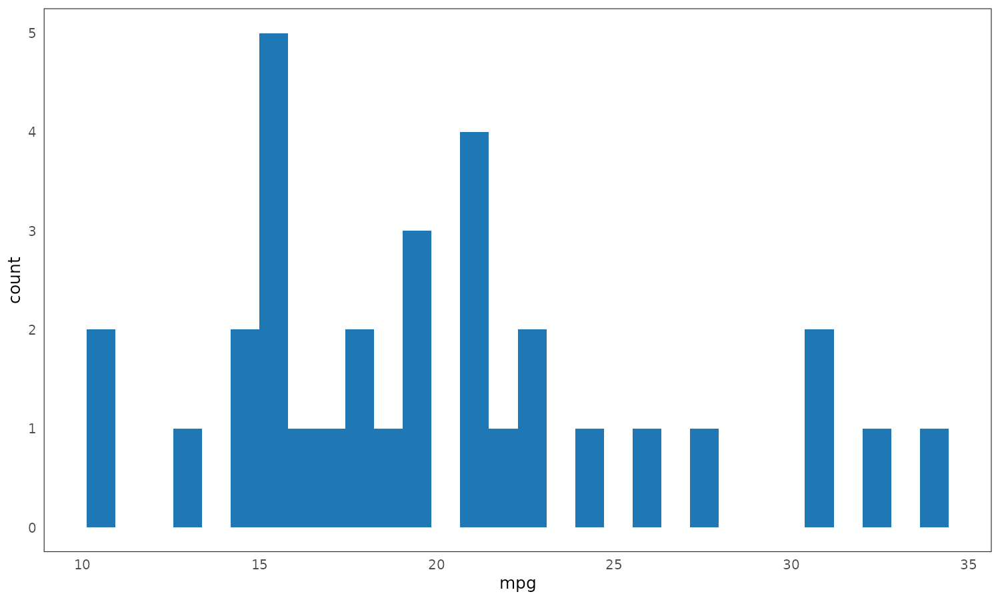
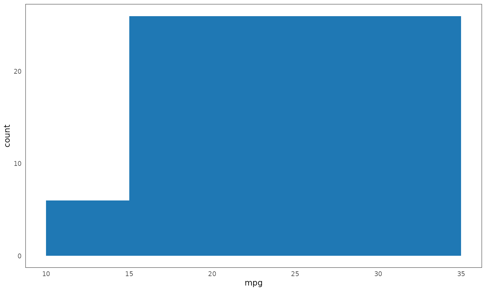
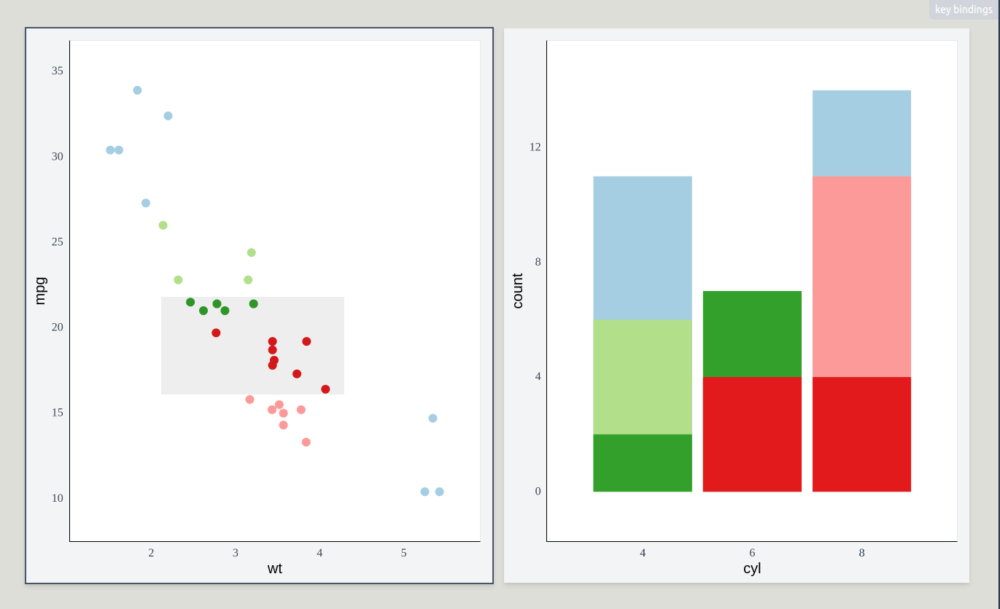

# Abstract 

Placeholder


<!--chapter:end:index.Rmd-->

# Introduction {#introduction}

> It’s written here: ‘In the Beginning was the Word!’ <br>
> Here I stick already! Who can help me? It’s absurd, <br>
> [...] <br>
> The Spirit helps me! I have it now, intact. <br>
> And firmly write: ‘In the Beginning was the Act!
>
> Faust, Part I, Johann Wolfgang von Goethe [-@goethe2015]

Humans are intensely visual creatures. About 20-30% of our brain is involved in visual processing [@van2003; @sheth2016], utilizing a highly sophisticated and powerful visual processing pipeline [see e.g. @goebel2004; @knudsen2020; for a brief review, see @ware2019]. It is well-established the brain can process certain salient visual stimuli in sub-20-millisecond times, outside of conscious attention [@ledoux2000; @ledoux2003], and that people can make accurate, parallel, and extremely rapid visual judgements, in phenomena known as subitizing and pre-attentive processing [@mandler1982; @treisman1985]. These features make the visual cortex the most powerful information channel that humans possess, both in terms of bandwidth and throughput.

Statisticians have known about this power of visual presentation for a long time. Starting with early charts and maps, data visualization co-evolved alongside mathematical statistics, offering an alternative and complementary perspective [for a review, see @friendly2006 or Section \@ref(brief-history)]. While mathematical statistics tended to focus on confirmatory hypothesis testing, data visualization provided avenues for unsupervised exploration, "forcing us to notice that which we would never expect to see" [@tukey1977]. Eventually, this valuable role of forcing us to see the unexpected established data visualization as a respected tool within the applied statistician's toolkit.

Seeing an object from a distance is one thing, but being able to also touch, manipulate, and probe it is another. Within the human brain, action and perception are not independent, but are instead intricately linked, mutually reinforcing processes [see e.g. @dijkerman2007; @lederman2009]. Beginning in the 1970's, statisticians acquired a new set of tools for exploiting this connection. The advent of computer graphics and interactive data visualization transformed the idea of "interrogating a chart" from a mere turn of phrase into tangible reality. All of a sudden, it became possible to work with the visual representation of data in a tactile way, getting new perspectives and insights at the stroke of a key or click of a button. 

This compelling union of the visual and the tactile has made interactive data visualization a popular method of presenting data. Nowadays, there are many packages and libraries for building interactive data visualizations across all the major data analytic languages. Interactive figures make frequent appearance in online news articles and commercial dashboards. However, despite this apparent popularity, significant gaps remain in the use and understanding of interactive visualizations. Individual analysts rarely utilize interactive data visualization in their workflow [see e.g. @batch2017], the availability of certain more sophisticated features is fairly limited (see Section \@ref(background)), and researchers still point to a lack of a general interactive data visualization pipeline [@wickham2009; @vanderplas2020]. 

This thesis explores these interactive data visualization paradoxes and the inherent challenges surrounding interactive data visualization pipelines more specifically. I argue that, contrary to some prevailing views, interactivity is not simply an add-on to static graphics. Instead, interactive visualizations must be designed with interactivity as a primary consideration. Furthermore, I contend that certain interactive features fundamentally influence the types of visualizations that can be effectively presented. My claim is that popular types of interactive visualizations exhibit a particular kind congruence between graphics, statistics, and interaction, and that the absence of this congruence results in suboptimal visualizations. I formalize this congruence using the framework of category theory. Finally, I validate these theoretical concepts by developing an open-source interactive data visualization library and demonstrate its application to real-world data.

#### Thesis Overview

The thesis is organized as follows. Section \@ref(background) reviews the history of interactive data visualization and discusses general trends and issues in the field. Section \@ref(problems), focuses on specific problems encountered when designing an interactive data visualization pipeline. Section \@ref(goals), outlines the the goals and aims that guided the development of the interactive data visualization library. Section \@ref(system) details the system's components and design considerations. Section \@ref(applied-example), presents an applied example of exploring a real-world data set using the developed library. Finally, Section \@ref(discussion), discusses lessons learned and potential future research directions.

<!--chapter:end:introduction.Rmd-->


# Background {#background}

Placeholder


## Brief history of interactive data visualization {#brief-history}
### Static data visualization: From ancient times to the space age
### Early interactive data visualization: By statisticians for statisticians {#early-interactive}
#### Open-source Statistical Computing
#### Common features and limitations of early interactive systems
### Interactive data visualization and the internet: Web-based interactivity {#web-based}
#### D3
#### Plotly and Highcharts
#### Vega and Vega-Lite
#### Common features and limitations of web-based interactive systems
## What even is interactive data visualization? {#what-is-interactive-visualization}
### Interactive vs. interacting with {#interactive-interacting}
### Interactive *enough*? {#interactive-enough}
### Complexity of interactive features {#complexity-of-features}
### Working definition
### Common interactive features {#common-features}
#### Changing size and opacity
#### Zooming and panning
#### Querying
#### Sorting and reordering
#### Parametric interaction
#### Animation and projection
#### Representation switching {#representation-switching}
#### Linked selection {#linked-selection}
## General data visualization theory
### Visualization goals {#visualization-goals}
### Visual perception {#visual-perception}
### Scales and measurement {#scales-measurement}
### Graphics formats {#graphics-formats}
#### Raster graphics
#### Vector graphics
## Summary

<!--chapter:end:litreview.Rmd-->


# Challenges {#problems}

Placeholder


## The structure of this chapter: Data visualization pipeline
## Partitioning {#partitioning}
### Showing the full data {#show-all-data}
### Comparison and disjointness {#comparison-disjointness}
#### Naturality of disjointness
#### Disjointness and bijections
#### Disjointness in visualizations: Real-world example
#### Disjointness and interaction {#disjointness-interaction}
### Plots as partitions
#### Bijection on cases vs. bijection on subsets
#### Products of partitions {#products-of-partitions}
#### Limits of flat product partitions
### Partitions, hierarchy, and preorders {#hierarchy}
#### Plots as preorders {#plots-as-preorders}
#### The graph behind the graph
## Aggregation
### The relationship between graphics and statistics
#### Independence: The grammar-based model
#### Motivating example: Limits of independence {#stacking-not-graphical}
#### Some statistics are stackable but others are not {#stackable-or-not}
#### Advantages of stacking: Part-whole relations {#stacking-part-whole}
### Stackable summaries: A brief journey into Category Theory {#aggregation-category-theory}
#### Past applications of category theory to data visualization {#visualization-category-theory}
#### Generalizing preorders: Categories {#preorders-categories}
#### Structure preserving maps: Functors
#### Aggregation: A functor from the preorder of data subsets to the preorder of summary statistics {#aggregation-functor}
#### Functorial summaries and set union
#### Whole equal to the sum of its parts: Monoids {#monoids}
#### Programming with monoids {#programming-with-monoids}
#### Groups and inverses {#groups-inverses}
#### Other properties: monotonicity and commutativity
##### Monotonicity
##### Commutativity
#### Transforming summaries: Stacking, normalizing, and shifting {#transforming-summaries}
##### Stacking
##### Normalizing
##### Shifting
## Scaling and encoding {#scaling}
#### Scales as functions {#scales-as-functions}
#### Limits of modeling scales with simple functions {#simple-scale-limits}
#### Solution: Scales as function composition {#scales-composition}
##### Reusability and discrete scales
##### The intermediate interval {#scaling-intermediate}
##### Implementing scale features via the intermediate interval
###### Margins
###### Panning
###### Zooming
##### Inverses {#scaling-inverses}
##### Scale transformations
#### Comparison to past implementations of scales {#scales-comparison}
## Rendering
### Frames {#frames}
### Graphical elements

<!--chapter:end:problems.Rmd-->


# Goals {#goals}

Placeholder


## User profile
## Programming interface
## User interface
## Interactive features

<!--chapter:end:goals.Rmd-->

---
output: html_document
editor_options: 
  chunk_output_type: console
alway_allow_html: true
---

```{r}
#| echo: false
include_figure <- function(path, height = 400) {
  if (knitr::is_html_output()) knitr::include_url(path, height)
  else knitr::include_graphics(gsub(".html", ".png", path))
}

if (knitr::is_html_output()) {
  knitr::opts_chunk$set(
    out.width = "100%",
    out.height = "100%",
    out.extra = 'style="border: none;"' # Get rid of iframe borders
  )
}
```

# System description {#system}

This section contains a detailed description of the two software packages developed as part of this doctoral project: ([plotscape](https://github.com/bartonicek/plotscape) and [plotscaper](https://github.com/bartonicek/plotscaper)):

- `plotscape`: Written in TypeScript/JavaScript, provides "low-level" interactive visualization utilities
- `plotscaper`: Written in R, provides a "high-level" wrapper/API for R users 

A couple of general notes. Firstly, the low-level platform (`plotscape`) was written with web technologies (JavaScript, HTML, and CSS). Web technologies were chosen because they provide a simple and portable way to do interactive apps in R, having become the de facto standard thanks to good integration provided by packages such as `htmlwidgets` [@htmlwidgets2021] and Shiny [@sievert2020]. Second, the functionality was split across two packages out of practical concerns; rather than relying on some JS-in-R wrapper library, `plotscape` was implemented as a standalone vanilla TypeScript/JavaScript library, to achieve optimal performance and fine-grained control. `plotscaper` was then developed to provide a user-friendly R wrapper around `plotscape`'s functionalities.  

As of the time of writing, `plotscape` comprises of about 6,400 significant lines of code (SLOC; un-minified, primarily TypeScript but also some CSS, includes tests, etc...), and `plotscaper` contains about 500 SLOC of R code (both counted using [`cloc`](https://github.com/AlDanial/cloc)). The unpacked size of all (minified) files is about 200 kilobytes for `plotscape` and 460 kilobytes for `plotscaper`, which is fairly modest compared to other interactive data visualization alternatives for R^[For instance, the `plotly` package takes up about 7.3 megabytes, which amounts to over 15x difference.]. Both packages have fairly minimal dependencies.

Since the two packages address fairly well-separable concerns - high-level API design vs. low-level interactive visualization utilites - I decided to organize this section accordingly. Specifically, I first discuss general, high-level API concerns alongside `plotscaper` functionality. Then I delve into the low-level implementation details alongside `plotscape`. There are of course cross-cutting concerns and those will be addressed towards ends of the respective sections. However, first, let's briefly review the core requirement of the package(s).

## Core requirements

To re-iterate, from Section \@ref(goals), the core requirements for the high-level API (`plotscaper`) were:

- Facilitate creation and manipulation of interactive figures for data exploration
- Be accessible to a wide range of users with varying levels of experience
- Integrate well with popular tools within the R ecosystem

These overarching goals, which will be explored further in Section \@ref(high-level-api), translated into more specific feature requirements:

- Simple creation of multi-panel figures
- Built-in linked selection across all plot types
- Standard interactive features like zooming, panning, and querying
- Support for parameter manipulation and representation switching in e.g. barplots and histograms
- Two-way communication between figures and interactive R sessions
- Static embedding capabilities for R Markdown/Quarto documents

To realize these goals, it was necessary to design the low-level platform (`plotscape`) which could support them. The primary purpose of `plotscape` was to provide utilities for the interactive data visualization pipeline:

- Splitting the data into a hierarchy of partitions
- Computing and transforming summary statistics (e.g. stacking, normalizing)
- Mapping these summaries to visual encodings (e.g. x- and y-axis position, width, height, and area)
- Rendering geometric objects and auxiliary graphical elements
- Responding to user input and server requests, propagating any required updates throughout the pipeline (reactivity)

Section \@ref(low-level-implementation) will discuss the above-mentioned tasks, and the data structures and algorithms used to support them.

## High-level API (`plotscaper`) {#high-level-api}

In Section \@ref(goals), I already discussed some broad, theoretical ideas related to the package's functionality. Here, I focus more on the concrete API - what `plotscaper` code looks like, how are the users supposed to understand it, and why was the package designed this way. The goal is to provide a rationale for key design decisions and choices.

### API design {#api-design}

As mentioned in Section \@ref(goals), a primary inspiration for `plotscaper`'s API was the popular R package `ggplot2`. In `ggplot2`, plots are created by chaining together a series of function calls, each adding or modifying a component of an immutable plot schema:

```{r}
#| fig-show: "hide"
library(ggplot2)

# Plots are created by chaining a series of function calls
ggplot(mtcars, aes(wt, mpg)) +
  geom_point() +   # The overloaded `+` serves as pipe operator
  scale_x_continuous(limits = c(0, 10))
```

```{r}
# The ggplot() call creates an immutable plot schema
plot1 <- ggplot(mtcars, aes(wt, mpg))
names(plot1)
length(plot1$layers)

# Adding components such as geoms or scales returns a new schema
plot2 <- ggplot(mtcars, aes(wt, mpg)) + geom_point()
names(plot2)
length(plot2$layers)
```

`ggplot2` is well-loved by R users, as evidenced by the package's popularity. However, its API presents certain limitations when building interactive figures. Specifically:

- Its design primarily centers around individual plots. While facetting does make it possible to create multi-panel figures consisting of repeats of the same plot type [see `facet_wrap()` and `facet_grid()`, @wickham2016], creating mixed plot-type multi-panel figures requires the use of external packages such as `gridExtra` [@auguie2017] or `patchwork` [@pedersen2024]. As discussed in Section \@ref(background), in interactive graphics, multi-panel figures are essential and should be considered first-class citizens.
- While the immutable schema model works well for static graphics, in interactive graphics, the ability to modify an already rendered figure via code can be extremely useful. For example directly setting a histogram binwidth to a precise value via a function call offers superior control compared to using an imprecise widget such as a slider.
- Many of the `ggplot2`'s core functions make heavy use of quotation and non-standard evaluation [NSE, @wickham2019]. While this style is fairly popular within the R ecosystem and does offer syntactic conciseness, it also complicates programmatic use [@wickham2019]. For instance, in `ggplot2`, to plot all pairwise combinations of the variables in a dataframe, we cannot simply loop over their names and supply these as arguments to the default `aes` function - instead, we have to parse the names within the dataframe's environment (this is what the specialized `aes_string` function does). Again, in interactive contexts, the ability to easily manipulate figures with code is often highly useful, and this makes NSE a hindrance (more on this later).  
- The package was developed before widespread adoption of the pipe operator [both `%*%` from `magrittr`, @bache2022; and the native R `|>` pipe, @r2024] and its use of the overloaded `+` operator is a noted design flaw [see @wickham2014].

In `plotscaper`, I addressed these issues as follows. First, a function-chaining approach similar to `ggplot2` was adopted, however, with a focus on multi-panel figure composition. Most functions modify the entire figure, however, specialized functions with selectors can also target individual plots (see Sections \@ref(basic-example) and \@ref(figure-plot). Second, to enable mutable figure modification while retaining the benefits of immutability, most functions can operate on both immutable figure schemas and references to live figures, with the operations being applied homomorphically (this will be discussed in Section \@ref(scene-and-schema)). Finally, non-standard evaluation was avoided altogether, and functions can be composed using any valid pipe operator^[Throughout the examples in this thesis, I use the base R `|>` operator, however, the `%>%` operator from the `magrittr` package [@bache2022] would work equally well.]. 

### Basic example {#basic-example}

The code below shows an example of a simple interactive figure created with `plotscaper`. More advanced and realistic applications are shown in Section \@ref(applied-example); this is example is only meant to provide a simple illustration:

```{r}
#| eval: false
library(plotscaper)

create_schema(mtcars) |>
  add_scatterplot(c("wt", "mpg")) |>
  add_barplot(c("cyl")) |>
  set_scale("plot1", "x", min = 0) |>
  render()
```

```{r plotscaper-example1}
#| echo: false
#| fig-cap: "An example of a simple interactive figure in `plotscaper`."
include_figure("./figures/plotscaper_example1.html")
```

We first initialize the figure schema by calling `create_schema` with the input data. Next, we chain a series of `add_*` calls, adding individual plots. Furthermore, we can manipulate attributes of individual plots by using specialized functions. For instance, in the example above, `set_scale` is used to set the lower x-axis limit of the scatterplot to zero. When a schema is provided as the first argument, these functions append immutable instructions to the schema, a process which will be detailed in Section \@ref(scene-and-schema). Finally, call to `render` instantiates the schema, creating an interactive figure. Several aspects of this workflow warrant further explanation which will be provided in the subsequent sections.

#### Figure vs. plot and selectors {#figure-plot}

First, note that, as discussed in Section \@ref(api-design), all `plotscaper` functions take as their first argument the entire figure. This differs from `ggplot2` functions, which typically operate on a single plot (unless facetting is applied). Thus, the primary target of manipulation is the entire figure, rather than a single plot. This design necessitates the use of selectors for targeting individual plots, as seen in the `set_scale` call above. I decided to use a simple string selector for this purpose. While alternative selection strategies, such as overloading the extraction (`$`) operator or using a dedicated selector function were also considered, upon considering the inherent trade-offs, I decided to go with the straightforward method of string selectors. This design choice is open to being revisited in future major releases of the package.

#### Variable names

Second, `plotscaper` also uses simple string vectors to specify data variable names. This means that the function arguments are *not* treated as quoted symbols^[The terminology here is a bit unfortunate, since the *unquoted* string arguments *are* surrounded by quotes.]. For example, we use `add_scatterplot(c("x", "y", "z"))` instead of `add_scatterplot(c(x, y, z))`. While this style requires two extra key strokes for each variable and might feel less familiar to some R users, I believe that its suitability for programmatic use makes it a worthwhile trade-off. For instance, a user of `plotscaper` can easily create an interactive scatterplot matrix (SPLOM) like so:

```{r}
#| eval: false
column_names <- names(mtcars)[c(1, 3, 4)]
schema <- create_schema(mtcars)

for (i in column_names) {
  for (j in column_names) {
    if (i == j) schema <- add_histogram(schema, c(i))
    else schema <- add_scatterplot(schema, c(i, j))
  }
}

schema |> render()
```

```{r plotscaper-example2}
#| echo: false
#| fig-cap: "An example of a programmatically-created figure (a scatterplot matrix)."
include_figure("./figures/plotscaper-example2.html", 800)
```

While the scatterplot matrix in Figure \@ref(plotscaper-example2) could be also recreated with quotation/NSE using functions like `substitute` from base R [@r2024] or `enquo` from `rlang` [@rlang2024], doing so requires the knowledge of quasiquotation which is part of [advanced R](https://adv-r.hadley.nz/quasiquotation.html#quasiquotation). Many R users may be familiar with calling functions using "naked" variable names, however, actual proficiency with using quotation effectively may be less common. Furthemore, R's NSE is a form of metaprogramming [@wickham2019]. While powerful, over-reliance on metaprogramming is often discouraged in modern developer circles, due to it potential to impact performance, safety, and readability [see e.g. @phung2009; the discussion at @handmadehero2025]. Thus, to promote simplicity and programmatic use, I chose simple string vectors over quoted function arguments in `plotscaper`.

#### Variables and encodings {#variables-encodings}

Third, note that, in `plotscaper`, variable names are *not* meant to map directly to aesthetics such as x- or y-axis position or size. In other words, unlike `ggplot2`, `plotscaper` does not try to establish a direct correspondence between original data variables and the visual encodings/aesthetics. The reason for this is tha, in many common plot types, aesthetics do not actually represent variables found in the original data, but instead ones which have been derived or computed. Take, for instance, the following `ggplot` call:

```{r}
#| eval: false
#| fig-cap: "A simple `ggplot2` call to create a histogram. Note that, unlike with e.g. `geom_scatter`, the variables mapped to the x- and y-axis are not found directly in the data (the `aes` call) but are instead derived in the background."
ggplot(mtcars, aes(x = mpg)) + 
  geom_histogram()
```

```{r}
#| echo: false

```

Overtly, it may seem as if the `aes` function maps the `mpg` variable to the x-axis. This would be the case if, for example, `geom_point` had been used, however, with `geom_histogram`, this interpretation is incorrect. Specifically, the x-axis actually represents the left and right edges of the histogram bins, a derived variable not found in the original data. Similarly, the y-axis shows bin counts, another derived variable. Setting custom histogram breaks makes this lack of a direct correspondence even clearer:     

```{r}
#| eval: false
#| fig-cap: "A `ggplot2` call to create a histogram, with custom breaks. The lack of direct correspondence between `aes` and variables mapped to the axes should now be more obvious: the x-axis variable really depends more on the `breaks` argument to `geom_histogram`, rather than the underlying data."
ggplot(mtcars, aes(x = mpg)) + 
  geom_histogram(breaks = c(10, 15, 35))
```

```{r}
#| echo: false

```

Now it is easier to see that what gets mapped to the x-axis is *not* the `mpg` variable. Instead, it is the variable representing the histogram breaks. The `mpg` variable gets mapped to the plot only implicitly, as the summarized counts within the bins (the y-axis variable). Thus, in `ggplot` call, the semantics of `aes(x = mpg, ...)` are fundamentally different in `geom_histogram` as compared to, for example, `geom_scatter`.

While this lack of a direct correspondence between data and aesthetics may seem like a minor detail, it is in fact a fundamental design gap. As discussed in Section \@ref(problems), `ggplot2` is based on the Grammar of Graphics model [@wilkinson2012], which centers around the idea of composing plots out of independent, modular components. The fact that the semantics of `aes` are tied to `geom`s (and `stat`s) means that these classes of `ggplot2` functions are not truly independent. This issue is even further amplified in interactive graphics. For instance, when switching the representation of histogram to spinogram, we use the same underlying data but the aesthetic mappings are completely different. The expression `aes(x = mpg)` would be meaningless in a spinogram, since both the x- and y-axes display binned counts - `mpg` only facilitates binning and is not displayed anywhere in the plot directly. 

So what to do? To be perfectly frank, I have not found a perfect solution. In Section \@ref(problems), I proved that, in the general case involving transformations like stacking, `stats` and `geoms` *cannot* be truly independent. Barring that, the problem with specifying aesthetics in plots like histograms is that, in some sense, we are putting the cart before the horse: ultimately, we want to plot derived variables, so we should specify these in the call to `aes`, however, we do not know what the derived variables will be before we compute them (requiring the knowledge of `stat`s and `geom`s). So perhaps the schema creation process should organized in a different way. As per Section \@ref(problems), we could mirror the data visualization pipeline by structuring the code like:    

```{r}
#| eval: false
data |> 
  partition(...) |> 
  aggregate(...) |> 
  encode(...) |> 
  render(...)
```

In broad strokes, this is how the data visualization pipeline is implemented in `plotscape` (see Section \@ref(low-level-implementation)). However, this model does have one important downside: it does not lend itself easily to a simple declarative schema like that of `ggplot2`. Despite several attempts, I have been largely unsuccessful in formalizing such a schema. The difficulties stem from the hierarchical dependencies between the various pipeline stages, as well as the added complexity of integrating reactivity into the pipeline.

Be it as it may, this difficulty with declarative schemas is why I opted for the more traditional, nominal style of specifying plots in `plotscaper`(i.e. using functions like `add_scatterplot` or `add_barplot`). While this approach may seem less flexible, I hope I have demonstrated that the underlying limitations are *not* an exclusive to `plotscape`/`plotscaper`, but extend to `ggplot2` and all other GoG-based data visualization systems. I have simply chosen make these limitations more explicit. If a better solution is found, it may be integrated into future releases of the package.

A final point to mention is that it could be argued that one benefit of the `ggplot2` model where partitioning and aggregation logic (`stat`s) is implicitly tied to `geom`s is that it makes it easier to combine several kinds of `geom`s in one plot. For instance, `geom_histogram` can be combined with `geom_rug`, while single-case `geom_points` can be combined with aggregate summaries computed via `stat_summary`. Ignoring the conceptual problem of non-independence discussed above, this approach works fine for static graphics, where performance is not a key concern. However, in interactive graphics, computing a separate set of summaries for each `geom` layer may create unnecessary computational bottlenecks. Therefore, interactive graphics can benefit from sharing aggregated data whenever possible, and this is only possible if the partitioning and aggregation steps of the data visualization pipeline are lifted out of `geom`s. 

### The scene and the schema {#scene-and-schema}

A key part of the `plotscaper` API is the distinction between two classes of objects representing figures: schemas and scenes. Put simply, a schema is an immutable ledger or blueprint, specifying how a figure is created, while a scene is a live, rendered version of the figure which can be directly modified. Both can be manipulated using (largely) the same set of functions, implemented as `S3` methods which dispatch on the underlying class.

As shown before, schema can be created with the `create_schema` function: 

```{r}
#| echo: false
library(plotscaper)
```

```{r}
schema <- create_schema(mtcars) |>
  add_scatterplot(c("wt", "mpg")) |>
  add_barplot(c("cyl"))

schema
str(schema$queue)
```

As you can see, the object created with `create_schema` is essentially just a `list` of messages. Modifying the schema by calling functions such as `add_scatterplot` or `set_scale` simply appends a new message to the list, similar to how objects of class `ggplot` are modified by the corresponding functions and the `+` operator in `ggplot2` [@wickham2016]. This design makes it easy to transport schemas (e.g. as JSON) and modify them programmatically. Finally, rendering the schema into a figure requires an explicit call to `render`. Note that this approach is different from the popular R convention of rendering implicitly via a `print` method; however, there is a good reason for this design choice which will be discussed later. 

The call to `render` turns the schema gets turned into a live, interactive figure by constructing an `htmlwidgets` widget [@htmlwidgets2021]. This bundles up the underlying data and `plotscape` code (JavaScript, HTML, CSS) into a standalone HTLM document, which may be served live, such as in RStudio viewer, or statically embedded in another HTML document, such as one produced with RMarkdown. All of the schema messages also get forwarded to the widget and applied sequentially, creating the figure.

Note that, under this model, the schema merely records state-generating steps, not the state itself. In other words, all of the state lives on the scene (the client-side figure). This design avoids state duplication between the R session (server) and web-browser-based figure (client), eliminating the need for synchronization.

While this client-heavy approach deviates from the typical client-server architecture, where most of state resides on the server, it is essential for achieving highly-responsive interactive visualizations. By keeping most of the state on the client, we avoid round-trips to the server, resulting in fast updates in response to user interaction. For instance, linked selection updates, triggered by mousemove events, can be computed directly on the client and instantly rendered. Conversely, this is also why server-centric frameworks like Shiny [@shiny2024] struggle with latency-sensitive interactive features like linked selection. Finally, as will be discussed below, while the R session (server) may occasionally send and receive messages, their latency requirements are significantly less stringent, making a "thin" server perfectly viable.

### Client-server communication {#communication}

When inside an interactive R session (e.g., in RStudio IDE [@rstudio2024]), creating a `plotscaper` figure via calling `render` also automatically launches a WebSockets server [using the `httpuv` package, @cheng2024]. This server allows live, two-way communication between the R session (server) and the figure (client). By assigning the output of the `render` call to a variable, users can save a handle to this server, which can be then used to call functions which query the figure's state or cause mutable, live updates. For instance:

```{r}
#| eval: false
# The code in this chunk is NOT EVALUATED - 
# it only works only inside interactive R sessions,
# not inside static RMarkdown/bookdown documents.

scene <- create_schema(mtcars) |>
  add_scatterplot(c("wt", "mpg")) |>
  add_barplot(c("cyl")) |>
  render()

# Render the scene
scene

# Add a histogram, modifying the figure in-place
scene |> add_histogram(c("disp"))

# Set the scatterplot's lower x-axis limit to 0 (also in-place)
scene |> set_scale("plot1", "x", min = 0)

# Select cases corresponding to rows 1 to 10
scene |> select_cases(1:10)

# Query selected cases - returns the corresponding
# as a numeric vector which can be used in other
# functions or printed to the console
scene |> selected_cases() # [1] 1 2 3 4 5 6 7 8 9 10

```

As noted earlier, most `plotscaper` functions are polymorphic `S3` methods which can accept either a schema or a scene as the first argument. When called with schema as the first argument, they append a message to the schema, whereas when called with scene as the first argument, they send a WebSockets request, which may either cause a live-update to the figure or have the client respond back with data (provided we are inside an interactive R session). In more abstract terms, with respect to these methods, the `render` function is a functor/homomorphism, meaning that we can either call these methods on the schema and then render it, or immediately render the figure and then call the methods, and the result will be the same (provided no user interaction happens in the meantime). The exception to this rule are state-querying functions such as `selected_cases`, `assigned_cases`, and `get_scale`. These functions send a request to retrieve the rendered figure's state and so it makes little sense to call them on the schema^[Of course, we *could* always parse the list of messages to compute the figure's state on demand, as it will be when the figure gets rendered. For instance with `create_schema(...) |> assign_cases(1:10, 2) |> assign_cases(5:10, 3)` we could parse the messages to infer that the first five group indices will belong to group 2 and the second five will belong to group 3. However, since the user has to explicitly write the code to modify the figure's state, the utility of this hypothetical parsing mechanism is debatable.].

### HTML embedding

As `htmlwidgets` widgets, `plotscaper` figures are essentially static webpages. As such, they can be statically embedded in HTML documents such as those produced by RMarkdown [@rmarkdown2024] or Quarto [@allaire2024]. More specifically, when a `plotscaper` figure is rendered, `htmlwidgets` [@htmlwidgets2021] is used to bundle the underlying HTML, CSS and JavaScript. The resulting widget can then be statically embedded in any valid HTML document, or saved as a standalone HTML file using the `htlwidgets::saveWidget` function. This is in fact how `plotscaper` figures are rendered in the present thesis. 

As mentioned above, since client-server communication requires a running server, statically rendered figures cannot be interacted with through code, in the way described in Section \@ref(communication). However, within-figure interactive features such as linked selection and querying are entirely client-side, and as such work perfectly fine in static environments. This makes `plotscaper` a very useful and convenient tool to use in interactive reports. 

## Low-level implementation (`plotscape`) {#low-level-implementation}

This section describes the actual platform used to produce and manipulate interactive figures, as implemented in `plotscape`. I begin by discussing some broader concerns, specifically the choice of programming paradigm, data representation, and the implementation of reactivity. Then, I provide a detailed list of the system's components and their functionality.

Key concepts are explained via example code chunks. All of these represent valid TypeScript code, and selected examples are even evaluated, using the [Bun](https://bun.sh/) TypeScript/JavaScript runtime [@bun2025]. The reason why TypeScript was chosen over R for the examples is that explicit type signatures make many of the concepts much easier to explain. Further, since `plotscape` is written in TypeScript, many of the examples are taken directly from the codebase, albeit sometimes modified for consistency or conciseness.

### Programming paradigm

The first broad issue worth briefly discussing is the choice of programming paradigm for `plotscape`. A programming paradigm is a set of rules for thinking about and structuring computer programs. Each paradigm offers guidelines and conventions regarding common programming concerns, including data representation, code organization, and control flow. 

While most programming languages tend to be geared towards one specific programming paradigm [see e.g. @van2009], the languages I chose for my implementation - JavaScript/TypeScript and R - are both multi-paradigm languages [@chambers2014; @mdn2024c]. As C-based languages, both support classical procedural programming. However, both languages also have first-class function support, allowing for a functional programming style [@chambers2014; @mdn2024e], and also support object-oriented programming, via prototype inheritance in the case of JavaScript [@mdn2024d] and the S3, S4, and R6 object systems in the case of R [@wickham2019]. This made it possible for me to try out several different programming paradigms while developing `plotscape`/`plotscaper`. 

I did not find it necessary to discuss the choice of programming paradigm in Section \@ref(high-level-api), since I did not delve into any specific implementation details there. However, I believe it is important to discuss it now, as I will be going into implementation details in the following sections. Therefore, in the following subsections, I will briefly outline four programming paradigms - object-oriented, functional, and data-oriented programming - discussing their key features, trade-offs, and suitability for interactive data visualization. I will then provide a rationale for my choice of programming paradigm and discuss my specific use of it in `plotscape`.

#### Procedural programming

Procedural programming, also known as imperative programming^[Technically, some authors consider procedural programming a subset of imperative programming, such that procedural programming is imperative programming with functions (procedures) and scopes, however, the terms are often used interchangeably.], is perhaps the oldest and most well-known programming paradigm. Formalized by John Von Neumann in 1945 [@von1993; for a review, see @knuth1970; @eigenmann1998], it fundamentally views programs as linear sequences of discrete steps that modify mutable state [@frame2014]. These steps can be bundled together into functions or procedures, however, ultimately, the whole program is still thought of as a sequence of operations. In this way, it actually closely maps onto how computer programs get executed on the underlying hardware [beyond some advanced techniques such as branch prediction and speculative execution, the CPU executes instructions sequentially, see e.g. @parihar2015; @raghavan1998].

Compared to the other three programming paradigms discussed below, the procedural programming paradigm is, generally, a lot less prescriptive. It essentially acts as a framework for classifying fundamental programming constructs (variables, functions, loops, etc.), and offers minimal guidance on best practices or program structure. Most programming languages offer at least some procedural constructs, and thus many programs are at least partly procedural.

As for the suitability of procedural programming for interactive data visualization, there are some pros and cons. The fact that programs written in procedural style map fairly closely onto CPU instructions means that, generally, they tend to be highly performant; for instance, it is generally considered good practice to use procedural (imperative) code in "hot" loops [see e.g. @acton2014]. However, a purely procedural style can introduce challenges when developing larger systems. Specifically, since the procedural style imposes few restrictions on the program structure, without careful management, it can lead to complex and hard-to-extend code.   

#### Functional programming {#functional}

Functional programming is another fairly well-known and mature programming paradigm. With roots in the lambda calculus of Alonzo Church [@church1936; @church1940; for a brief overview, see e.g. @abelson2022; @frisby2025], functional programming centers around the idea of function composition. In this paradigm, programs are built from pure, side-effect-free functions which operate on immutable data. Further, functions are treated as first-class citizens, allowing functions to take other functions as arguments or return them (functions which do this are called "higher-order functions"). This approach ultimately leads to programs that resemble data pipelines, transforming input to output without altering mutable state.

A key benefit of the functional approach is referential transparency [see e.g. @abelson2022; @frisby2025; @milewski2018; @stepanov2009]. Because pure functions have no side effects, expressions can always be substituted with their values and vice versa. For example, the expression `1 + 2` can be replaced by the value `3`, so if we define a function `function add(x, y) { return x + y; }`, we can always replace its call with the expression `x + y`. This property is incredibly useful as it allows us to reason about functions independently, without needing to consider the program's state. However, referential transparency only holds if the function does not modify any mutable state; assigning to non-local variables or performing IO operations breaks this property, necessitating consideration of program state when the function is called.

Relevant to this thesis, functional programming is also closely linked to mathematics, particularly category theory [see @milewski2018]. Many algebraic concepts discussed in Section \@ref(problems) – including preorders, functors, and monoids – have direct counterparts in many functional programming languages. These are often implemented as type classes, enabling polymorphism: for instance, in Haskell [@haskell1970], users can define an arbitrary monoid type class which then allows aggregation over a list [@haskell2019].

Again, when it comes to interactive data visualization, the functional programming style presents some fundamental trade-offs. While properties like referential transparency are attractive, all data visualization systems must ultimately manage mutable state, specifically the graphical device. Further, user interaction also adds additional complexity which is challenging to model in a purely functional way (although it is certainly possible; see Section \@ref(streams)). This might explain the lack of purely functional interactive data visualization libraries, despite the existence of functional libraries for static visualization [see e.g. @petricek2021]. Nevertheless, many functional programming concepts remain valuable even in outside of purely functional systems. For example, a system may work with mutable state while remaining largely composed of pure functions [by "separating calculating from doing", see @normand2021; @vaneerd2024].

#### Object-oriented programming {#oop}

Compared to the two programming paradigms discussed before, object oriented programming (OOP) is a more recent development, however, it is also a fairly mature and widely-used framework. It first appeared in the late 1950's and early 1960's, with languages like Simula and Smalltalk, growing to prominence in the 1980's and 1990's and eventually becoming an industry standard in many areas [@black2013].

The central idea of object-oriented programming is that of an objects. Objects are self-contained units of code which own their own, hidden, private state, and expose only a limited public interface. Objects interact by sending each other messages [@meyer1997], a design directly inspired by communication patterns found in the networks of biological cells [as reported by one of the creators of Smalltalk and author of the term "object-oriented" @kay1996]. Beyond that, while concrete interpretations of object oriented programming differ, there are nevertheless several ideas which tend to be shared across most OOP implementations.

These core ideas of OOP are: abstraction, encapsulation, polymorphism, and inheritance [@booch2008]. Briefly, first, abstraction means objects should be usable without the knowledge of their internals. Users should rely solely on the public interface (behavior) of an object simplifying reasoning and reducing complexity [@black2013; @meyer1997]. Second, encapsulation means that the surface area of an object should be kept as small as possible and the internal data should be kept private [@booch2008]. Users should not access or depend on this hidden data [@meyer1997]. The primary goal of encapsulation is continuity, allowing developers to modify an object's private properties without affecting the public interface [@booch2008; @meyer1997]. Third, polymorphism means that objects supporting the same operations should be interchangeable at runtime [@booch2008]. Polymorphism is intended to facilitate extensibility, allowing users to define their objects that can be integrated into an existing system. Finally, inheritance is a mechanism used for code reuse and implementing polymorphism, where objects may inherit properties and behavior from other objects.

Object-oriented programming (OOP) has been widely adopted, especially for graphical user interfaces (GUIs). Given the significant GUI component in interactive data visualization systems, OOP might seem like an obvious first choice. Furthermore, OOP's claimed benefits of continuity and extensibility appear highly valuable for library design. However, more recently, OOP has also come under criticisms, for several reasons. First, while the ideas of reducing complexity via abstraction, encapsulation, and polymorphism seem attractive, applied implementations of OOP do not always yield these results. Specifically, a common practice in OOP is for objects to communicate by sending and receiving pointers to other objects; however, this breaks encapsulation, causing the objects to become entangled and creating "incidental data structures" [@hickey2011; @parent2015; @will2016]. Second, by its nature, OOP strongly encourages abstraction, and while good abstractions are undeniably useful, they take long time to develop. Poor abstractions tend to appear first [@meyer1997], and since OOP tends to introduce abstractions early, it can lead to overly complex and bloated systems [@vaneerd2024]. Third and final, OOP can also impact performance. Objects often store more data than is used by any single one of their methods, and further, to support runtime polymorphism, they also have to store pointers to a virtual method tables. Consequently, an array of objects will almost always take up more memory than an equal-sized array of plain values, resulting in increased cache misses and decreased performance [@acton2014].   

#### Data-oriented programming {#dop}

Compared to the three previously discussed paradigms, data-oriented programming (DOP) is a more recent and less well-known programming paradigm. In fact, due to its novelty, the term is also used somewhat differently across different contexts, broadly in two ways. First, DOP sometimes refers to a more abstract programming paradigm, concerned with structure and organization of code and inspired by the Clojure style of programming [@hickey2011; @hickey2018; @sharvit2022; @parlog2024]. In this way, it also shares many similarities with the generic programming paradigm popularized by Alexander Stepanov and the related ideas around value semantics [@stepanov2009; @stepanov2013; @parent2013; @parent2015; @parent2018; @vaneerd2023; @vaneerd2024], and there are even some direct ties [see @vaneerd2024]. Second, DOP (or "data oriented design", DOD) also sometimes refers to a more concrete set techniques and ideas about optimization. Originating in video-game development, these primarily focus on low-level details like memory layout and CPU cache line utilization [@acton2014; @bayliss2022; @kelley2023; @nikolov2018; @fabian2018].  Interestingly, despite these two distinct meanings of the term DOP, both converge on similar ideas regarding the structure and organization of computer programs, and as such, I believe it is justified to discuss them here as a single paradigm.

The core idea of DOP is a data-first perspective: programs should be viewed as transformations of data [@acton2014; @fabian2018; @sharvit2022]. This has several consequences, the most important of which is the separation of code (behavior) and data [@fabian2018; @sharvit2022; @vaneerd2024]. Data should be represented by plain data structures, composed of primitives, arrays, and dictionaries [a typical example would be [JSON](#JSON), @hickey2011; @hickey2018; @sharvit2022]. In other words, the data should be trivially copyable and behave like plain values [see @stepanov2009; @stepanov2013]. Furthermore, it should be organized in a way that is convenient and efficient; there is no obligation for it to model abstract or real-world entities [@acton2014; the fundamental blueprint is that of the relational model, @codd1970; @moseley2006; @fabian2018]. Code, on the other hand, should live inside modules composed of stateless functions [@fabian2018; @sharvit2022]. The primary benefit of this approach is that, by keeping data and code separate, we can reason about both in isolation, without entanglement [@vaneerd2024]. It also allows us to introduce abstraction gradually, by initially relying on generic data manipulation functions [@fabian2018; @sharvit2022]. Finally, it also enables good performance: by storing plain data values and organizing them in a suitable format (for example, structure of arrays, see Section \@ref(row-or-column)), we can ensure optimal cache line utilization [@acton2014; @fabian2018; @kelley2023;]. 

As might be apparent, data oriented programming shares some similarities with procedural and functional programming, but there are also some key differences. Compared to the lasseiz-faire approach of procedural programming, DOP tends to be a lot more opinionated about the structure of programs. Furthermore, while its focus on stateless functions might suggest a resemblance to functional programming, DOP generally does not prohibit mutation, and its emphasis on plain data over abstract behavior contrasts with the often highly abstract nature of purely functional code. As such, in my view, the ideas in DOP represent a distinct and fully-formed programming paradigm. 

While DOP is a novel programming paradigm, there is a precedence for similar ideas in data visualization systems. Specifically, the popular tendency of defining plots via declarative schemas (see e.g. Section \@ref(variables-encodings)) seems to align well with DOP principles. While this generally tends to be a feature of the packages' public facing APIs, not necessarily the implementation code, the popularity of JSON-like schemas might suggest that this style might be useful in designing data visualization packages more broadly.  

#### Final choice of programming paradigm and rationale

Thanks to TypeScript/JavaScript (and R) being a multi-paradigm programming language, I was able to experiment with several programming paradigms. During initial prototyping, I used primarily procedural style, but I also explored some functional programming concepts. Later, I completely rewrote the package using traditional OOP style, but found some aspects of it frustrating and challenging. Particularly, with multiple communicating objects, I found it difficult to cleanly separate concerns and reason about complex interactive behavior. Eventually, I discovered DOP and ultimately settled on that style, finding that the plain data model greatly simplified a lot of the problems I had.

In my view, the primary advantage of DOP was the ability to reason about data and behavior separately. Many parts of the system, such as dataframes and scales (see Sections \@ref(dataframe) and \@ref(scales)), make sense to think about as primarily composed of plain data. Modeling them this way helps avoid much of the entanglement which is arguably inherent to traditional OOP objects. Specifically, plain data structures composed of primitives, arrays, and dictionaries naturally tend to form simple tree-like structures, rather than more complex graphs with potential circular references, simplifying reasoning [@parent2013; @parent2015; @vaneerd2024]^[Technically, in JavaScript, there is no difference on the language level: all array and dictionary ([POJO](#JSON)) variables are pointers to (heap-allocated) objects, so they can be referenced in multiple places. However, conceptually, I still found it much easier to think about data structures in the DOP way.]. Further, defining behavior in pure function modules made it much easier to refactor and test. I also believe it encouraged a more conservative coding style: the requirement to pass all data explicitly as arguments, rather than relying on implicit class properties (members), made me more disciplined, by encouraging me to pass on only the necessary data and nothing more. Finally, it greatly simplified scenarios requiring double (multiple) dispatch; instead of deciding which class a method should belong to and which it should dispatch on, I could simply write a free function dispatching on both.

The only place where I found myself reverting to OOP-like idioms was in the several areas requiring polymorphism. Specifically, while for most of the system, polymorphism is pure overhead (in my opinion), for certain components like scales, the ability to dispatch based on the underlying data type is desirable. Further, giving the users the ability to extend the system by implementing their own components is of course useful. However, instead of using classes, I implemented a custom dispatch mechanism myself. While, hypothetically, traditional OOP classes may be a decent solution here, I found that maintaining consistent style with the rest of the codebase was preferable. 

While I did not attempt a purely (or even largely) functional implementation of `plotscape`, I believe there are several reasons why it might not be the optimal choice either. First, as mentioned in Section \@ref(functional), data visualization inherently requires dealing with significant amount of mutable state (the graphical device). Further, user interaction adds another element that is challenging to model in a purely functional style. While techniques for handling both do exist [see e.g. @abelson2022; @frisby2025], and so do functional programming data visualization libraries [see e.g. @petricek2021], I personally question whether the increased complexity is worthwhile. Second, similar to OOP, a purely functional style tends to introduce a high amount of abstraction. While good abstractions are incredibly powerful, I found that, generally, refactoring poorly-organized plain data containers was much easier than refactoring abstract constructs, be they classes or higher-kinded types.  

Finally, while my preference for DOP might also be partly due to the fact that, over the course of the project, I naturally improved as a programmer, I do not believe that this is the full explanation. Even after settling on DOP, I have experimented with other paradigms but consistently find myself returning to DOP. While there are of course many less-than-perfectly-tidy areas of the `plotscape` codebase that could be refactored, I still believe that this less programming paradigm allowed me, a solo developer with limited time, to go further and develop more features without becoming overwhelmed by inherent complexity. Therefore, I felt it necessary to explain my choice of programming paradigm.  

#### Style used in code examples

Another part of the reason why I spent time discussing the choice of the programming paradigm used in `plotscape` is because it is reflected in many of the code examples used throughout the rest of this chapter. Specifically, in these examples, I typically define a data container as a TypeScript `interface` and a collection of related functions in a `namespace` of the same name. Since TypeScript transpiles to JavaScript, and all of the type information is compile-time only, type (`interface`) and value (`namespace`) overloading like this is perfectly valid.

In some ways, this interface-namespace style might seem like object-oriented programming (OOP) with extra steps, i.e. where someone might write `const foo = new Foo(); const bar = foo.bar()`, I write `const foo = Foo.create(); const bar = Foo.bar(foo)`, however, there are a couple of important differences. First, unlike a class that tightly couples data and behavior, the interface-defined type is solely a data container, and the namespace is merely a container for free functions. As such, both can be reasoned about in isolation. Second, TypeScript's structural typing enables calling the namespace functions with *any* variable matching the type signature, not just class instances, significantly improving code reusability. Finally, unlike classes, the interface-defined types are simple data containers without polymorphism, and this eliminates the need for dynamic dispatch (in the general case), potentially improving performance. Overall, the style aligns with the data-oriented programming principles discussed in Section \@ref(dop).

### Data representation: Row-based or column-based {#data-representation}

Data visualization is fundamentally about the data; however, the same data can often be represented in multiple different ways. This is important for programs handling data, as different data representations have distinct characteristics that can impact various aspects of the system. In most data analytic applications, the fundamental model is a two-dimensional table or dataframe. However, because computer memory is inherently one-dimensional, a choice must be made: should these tables be stored as an arrays of heterogeneous records (rows) or as a dictionaries of homogeneous arrays (columns)? Each approach comes with its own set of trade-offs, affecting ease of use, maintainability, and performance.

In most popular in-memory data analytics applications, the column-store model seems to dominate. This model organizes tables as dictionaries of columns, such that each column is a homogeneous array containing values of the same type. Unlike a matrix, however, different columns can store values of different types (e.g. floats, integers, or strings). Dataframe objects may also store optional metadata, such as row names, column labels, or grouping structures [@r2024; @bouchet-valat2023]. Popular examples of this design include the S3 `data.frame` class in base R [@r2024], the `tbl_df` S3 class in the `tibble` package [@muller2023], the `DataFrame` class in the Python `pandas` [@pandas2024], the `DataFrame` class in the `polars` [@polars2024], or the `DataFrame` type in the Julia `DataFrame.jl` package [@bouchet-valat2023].

However, there are also some fairly well-known examples of row-based systems. Particularly, the popular JavaScript data visualization and transformation library D3 [@bostock2022] models data frames as arrays of rows, with each row being a JavaScript object. Likewise, row-stores are also highly popular in data bases, particularly in online transaction processing (OLTP) systems such as PostgreSQL, SQLite, or MySQL, where tables are generally stored as arrays of records, both in memory and on disk [see e.g. @petrov2019; @abadi2013]. 

### Reactivity

A key implementation detail of all interactive applications is reactivity: how a system responds to input and propagates changes. However, despite the fact that interactive user interfaces (UIs) have been around for a long time, there still exist many different, competing approaches to handling reactivity. A particularly famous^[Or perhaps infamous.] example of this is the web ecosystem, where new UI frameworks seem to keep emerging all the time, each offering its unique spin on reactivity [see e.g. @ollila2022]. This makes choosing the right reactivity model challenging. 

Furthermore, reactivity is paramount in interactive data visualization systems due to many user interactions having cascading effects. For instance, when a user changes the binwidth of an interactive histogram, the counts within the bins need to be recomputed, which in turn means that scales may need to be updated, which in turn means that the entire figure may need to be re-rendered, and so on. Also, unlike other types of UI applications, interactive data visualizations have no upper bound on the number of UI elements - the more data the user can visualize the better. This makes efficient updates crucial. While re-rendering a button twice may not be a big deal for a simple webpage or GUI application, unnecessary re-renders of a scatterplot with tens-of-thousands of data points may cripple an interactive data visualization system. 

Because of the reasons outlined above, reactivity was key concern for `plotscape`. While developing the package, I had evaluated and tried out several different reactivity models, before finally settling on a solution. Given the time and effort invested in this process, I believe it is valuable to give a brief overview of these models and discuss their inherent advantages and disadvantages, before presenting my chosen approach in Section \@ref(reactivity-solution). 

#### Observer pattern {#observer}

One of the simplest and most well-known methods for modeling reactivity is the Observer pattern [@gamma1995]. Here's a simple implementation: 

```{ts}
// Observer.ts
export namespace Observer {
  export function create<T>(x: T): T & Observer {
    return { ...x, listeners: {} };
  }

  export function listen(x: Observer, event: string, cb: () => void) {
    if (!x.listeners[event]) x.listeners[event] = [];
    x.listeners[event].push(cb);
  }

  export function dispatch(x: Observer, event: string) {
    if (!x.listeners[event]) return;
    for (const cb of x.listeners[event]) cb();
  }
}

const person = Observer.create({ name: `Joe`, age: 25 });
Observer.listen(person, `age-increased`, () =>
  console.log(`${person.name} is now ${person.age} years old.`)
);

person.age = 26;
Observer.dispatch(person, `age-increased`);
```

Internally, an `Observer` object stores a dictionary where the keys are the events that the object can dispatch or notify its listeners of, and values are arrays of callbacks^[In simpler implementations, a single array can be used instead of the dictionary; the listeners are then notified whenever the object "updates".]. Listeners listen (or "subscribe") to specific events by adding their callbacks to the relevant array. When an event occurs, the callbacks in the appropriate array are iterated through and executed in order.

The `Observer` pattern easy to implement and understand, and, compared to alternatives, also tends to be fairly performant. However, a key downside is that the listeners have to subscribe to the `Observer` manually. In other words, whenever client code uses `Observer` values, it needs to be aware of this fact and subscribe to them in order to avoid becoming stale. Further, the logic for synchronizing updates has to be implemented manually as well. For instance, by default, there is no mechanism for handling dispatch order: the listeners who were subscribed earlier in the code are called first^[This can be solved by adding a priority property to the event callbacks, and sorting the arrays by priority.]. Moreover, shared dependencies can cause glitches and these have to be resolved manually as well. See for instance the following example:

```{ts}
import { Observer } from "./Observer"

function update(x: { name: string; value: number } & Observer, 
                value: number) {
  x.value = value;
  console.log(`${x.name} updated to`, x.value);
  Observer.dispatch(x, `updated`);
}

const A = Observer.create({ name: `A`, value: 1 });
const B = Observer.create({ name: `B`, value: A.value * 10 });
const C = Observer.create({ name: `C`, value: A.value + B.value });

Observer.listen(A, `updated`, () => update(B, A.value * 10));
Observer.listen(A, `updated`, () => update(C, A.value + B.value));
Observer.listen(B, `updated`, () => update(C, A.value + B.value));

update(A, 2); // C will get updated twice
```

The example above shows the so-called diamond problem in reactive programming^[Not to be confused with the diamond problem in OOP, which relates to multiple inheritance.]. We have three reactive variables `A`, `B`, and `C`, such that `B` depends on `A`, and `C` depends simultaneously on `A` and `B`. Since `C` depends on `A` and `B`, it has to subscribe to both. However, `C` is not aware of the global context of the reactive graph: it does not know that `B` will update any time `A` does. As such, an update to `A` will trigger *two* updates to `C` despite the fact that, intuitively, it should only cause one. 

Without careful management of dependencies, this reactive graph myopia that the `Observer` pattern exhibits can create computational bottlenecks, particularly in high-throughput UIs such as interactive data visualizations. Consider an interactive histogram where users can either modify binwidth or directly set breaks. If both are implemented as reactive parameters, a poorly managed dependency graph (e.g., breaks dependent on binwidth, and rendering dependent on both) will result in unnecessary re-renders, impacting performance at high data volumes.

#### Streams {#streams}

A radically different approach to reactivity is offered by streams [see e.g. @abelson2022]. Instead of events directly modifying data state, streams separate event generation from event processing, modeling the latter as pure, primarily side-effect-free transformations. These transformations can then be composed via usual function composition to build arbitrarily complex processing logic. Finally, due to the separation between the stateful event producers and stateless event transformations, this approach aligns closely with methods such as generators/iterators as well as functional programming more broadly [@abelson2022; @fogus2013], and has implementations in numerous functional programming languages and libraries, most notably the polyglot Reactive Extensions library [also known as ReactiveX, @reactive2024].

Consider the following implementation of a stream which produces values at 200-millisecond intervals and stops after 1 second: 

```{ts}
function intervalSteam(milliseconds: number, stopTime: number) {
  let streamfn = (x: unknown) => x;
  const result = { pipe };

  function pipe(fn: (x: any) => unknown) {
    const oldStreamfn = streamfn;
    streamfn = (x: unknown) => fn(oldStreamfn(x));
    return result;
  }

  const startTime = Date.now();
  let time = Date.now();

  const interval = setInterval(() => {
    time = Date.now();
    const diff = time - startTime;
    if (diff >= stopTime) clearInterval(interval);
    streamfn(diff);
  }, milliseconds);

  return result;
}

const stream = intervalSteam(200, 1000)


stream
  .pipe((x) => [x, Math.round((x / 7) * 100) / 100])
  .pipe((x) =>
    console.log(
      `${x[0]} milliseconds has elapsed`
      + `(${x[1]} milliseconds in dog years)`
    )
  );
```

As you can see, the event producer (stream) is defined separately from the event processing logic, which is constructed by piping the result of one operation into the next. Because of the associativity of function composition, the stream actually exhibits properties of a functor, meaning that the order of composition - either through direct function composition or `.pipe` chaining - does not affect the result. Additionally, while the stream transformations themselves are (generally) stateless, they can still produce useful side-effects (as can be seen on the example of the `console.log` call above). Further, because of this fact, they also lend themselves well to modeling asynchronous or even infinite data sequences [@abelson2022; @fogus2013].

While streams can be extremely useful in specific circumstances, their utility as a general model for complex UIs (beyond asynchronous operations) is debatable. Specifically, the inherent statefulness of UIs conflicts with the stateless nature of streams: stateless computations inside the stream have to leak into the rest of the application *somewhere*. Delineating which parts of the logic should go into streams versus which should be bound to UI components adds unnecessary complexity for little real benefit. Consequently, streams are likely not the optimal choice for interactive data visualization, where some mutable state is unavoidable. 

#### Virtual DOM

Within the web ecosystem, a popular way of handling reactivity involves something called the virtual DOM (VDOM). This approach, popularized by web frameworks such as React [@react2024] and Vue [@vue2024], involves constructing an independent, in-memory data structure which provides a virtual representation of the UI in the form of a tree. Reactive events are bound to nodes or "components" of this tree, and, whenever an event occurs, changes cascade throughout the VDOM, starting with the associated component and propagating down through its children. Finally, the VDOM is compared or "diffed" against the actual UI, and only the necessary updates are applied. Note that, despite being named after the web's DOM, the VDOM represents a general concept, not tied to any specific programming environment.

The VDOM provides a straightforward solution to reactive graph challenges such as the diamond problem described in Section \@ref(observer). It can work very well in specific circumstances, as evidenced by the massive popularity of web frameworks such as React or Vue. However, compared to alternatives, it also comes with some significant performance trade-offs. Specifically, events near the root component trigger a cascade of updates which propagates throughout a large portion of the tree, even when there is no direct dependence between these events and the child components. Moreover, since the only way for two components to share a piece of state is through their parent, the model naturally encourages a top-heavy hierarchy, further compounding the issue. Finally, depending on the nature and implementation of the UI, the diffing process may be more trouble than its worth: while in a webpage, updating a single button or a div element is a relatively fast operation, in a data visualization system, it may be more efficient to re-render an entire plot from scratch rather than trying to selectively update it.

#### Signals {#signals}

Another approach to reactivity that has been steadily gaining traction over the recent years, particularly within the web ecosystem, are signals (also known as fine-grained reactivity). Popularized by frameworks such Knockout [@knockout2019] and more recently Solid JS [@solid2024], this approach has recently seen a wave adoptions by many other frameworks including Svelte [@svelte2024] and Angular [@angular2025], and has even seen adoption outside of the JavaScript ecosystem, such as in the Rust-based framework Leptos [@leptos2025].

Signal-based reactivity is built around a core pair of primitives: signals and effects. Signals are reactive values which keep track of their listeners, similar to the `Observer` pattern (Section \@ref(observer)). However, unlike `Observer`s, signals do not need to be subscribed to manually. Instead, listeners automatically subscribe to signals by accessing them, which is where effects come in. Effects are side-effect-causing functions which respond to signal changes, typically by updating the UI, and play a key role in the signal-based automatic subscription model.

While signal-based reactivity might appear complex, its basic implementation is surprisingly straightforward. The following example is based on a presentation by Ryan Carniato, the creator of Solid JS [-@carniato2023]:

```{ts}
export namespace Signal {
  export function create<T>(x: T): [() => T, (value: T) => void] {
    // A set of listeners, similar to Observable
    const listeners = new Set<() => void>();

    function get(): T {
      listeners.add(Effect.getCurrent());
      return x;
    }

    function set(value: T) {
      x = value;
      for (const l of listeners) l();
    }

    // Returns a getter-setter pair
    return [get, set];
  }
}

export namespace Effect {
  const effectStack = [] as (() => void)[]; // A stack of effects

  export function getCurrent(): () => void {
    return effectStack[effectStack.length - 1];
  }

  export function create(effectfn: () => void) {
    function execute() {
      effectStack.push(execute);  // Pushes itself onto the stack
      effectfn();                 // Runs the effect
      effectStack.pop();          // Pops itself off the stack
    }

    execute();
  }
}

const [price, setPrice] = Signal.create(100);
const [tax, setTax] = Signal.create(0.15);

// Round to two decimal places
const round = (x: number) => Math.round(x * 100) / 100
const priceWithTax = () => round(price() * (1 + tax()));
// ^ Derived values automatically become signals as well

Effect.create(() =>
  console.log(
    `The current price is` +
      `${priceWithTax()}` +
      `(${price()} before ${tax() * 100}% tax)`
  )
);

setPrice(200);
setTax(0.12);
```

The key detail to notice is the presence of the global stack of effects. Whenever an effect is called, it first pushes itself onto the stack. It then executes, accessing any signals it needs along the way. These signals in turn register the effect as a listener, by accessing it as the top-most element of the effect stack. When the effect is done executing, it pops itself off the stack. Now, whenever one of the accessed signals changes, the effect re-runs again. Crucially, making a derived reactive value is as simple as writing a callback: if an effect calls a function using a signal, it also automatically subscribes to that signal (see the example of `priceWithTax` above). Importantly, the effect subscribes *only* to this signal and not the derived value itself. In other words, effects only ever subscribe to the leaf nodes of the reactive graph (signals). Derived values computed on the fly (and, if necessary, can be easily memoized^[Memoizing a derived value can be done by creating a new signal and an effect that runs when the original value gets updated.]), and event ordering is simply managed via the runtime call stack.

Signals provide an elegant solution to many problems with reactivity. They automate subscription to events, prevent unnecessary updates, ensure correct update order, and, due to their fine-grained nature, are generally highly performant compared to more cumbersome methods like the virtual DOM. However, again, signals do also introduce their own set of trade-offs. Chief among these, signal's reliance on the call stack for event ordering necessitates their implementation as functions (getter-setter pairs), rather than plain data values. While techniques like object getters/setters or templating [as seen in SolidJS, @solid2024] can be used to hide this fact, it does nevertheless add an extra layer of complexity. Similarly, many features important for performance, like memoization and batching, also require treating signals as distinct from plain data. Having code consist of two sets of entities - plain data and signals - ultimately impacts developer ergonomics.

#### Reactivity in `plotscape` and final thoughts {#reactivity-solution}

At the start of the project, I had used the `Observer` pattern for modeling reactivity. However, I had the idea of letting the users to define reactive parameters that could be used at arbitrary points in the data visualization pipeline. This had led me to explore the various models of reactivity described above, and even do a full rewrite of `plotscape` with signals at one point.

However, eventually, I ended up reverting back to the `Observer` pattern. The primary reason was developer ergonomics. While many properties of signals like the automatic event subscription were appealing, the need to manage both data and signals as distinct entities proved cumbersome. Specifically, deciding which components of my system and their properties should be plain data versus signals added an additional overhead and complicated refactoring. With bit of practice and careful design, I found that I was able to use the `Observer` pattern without introducing unnecessary re-renders. Moreover, I also found that, in the interactive data visualization pipeline, reactivity can be aligned with the four discrete stages: partitioning, aggregation, scaling, and rendering. Specifically, reactive values can be introduced in batch right at the start of each of these four steps, greatly simplifying the reactive graph. Introducing reactivity at other points seem to offer limited practical benefit. Thus, despite the limitations of the `Observer` pattern, the structured nature of the problem (interactive data visualization pipelines) ultimately makes it a decent solution in my eyes.

### System components

This section discusses the core components of `plotscape`, detailing their functionality, implementation, and interconnections. The goal is to give an overview and provide a rationale for the design of key parts of the system. As before, TypeScript code examples are provided, and, in general, these map fairly closely to the real codebase.  

#### Indexable {#Indexable}

One of the fundamental considerations when implementing a data visualization system is how to represent a data variable: a generalized sequence of related values. Clearly, the ability to handle fixed-length arrays is essential, however, we may also want to be able to treat constants or derived values as variables. To give an example, in a typical barplot, the y-axis base is a constant, typically zero. While we could hypothetically append an array of zeroes to our data, it is much more convenient and memory efficient to simply use a constant (`0`) or a callback/thunk (`() => 0`). Similarly, at times, arrays of repeated values can be more optimally represented as two arrays: a short array of "labels" and a long array of integer indices (i.e. what base R's `factor` class does). Thus, representing data effectively calls for a generalization of a data "column" which can encompass data types beyond fixed-length arrays.

The type `Indexable<T>` represents such a generalization of a data column. It is simply a union of three simple types: 

```{ts}
#| eval: false 
Indexable<T> = T | T[] | ((index: number) => T)
```

In plain words, an `Indexable<T>` can be one of the following three objects: 

- A simple (scalar) value `T`
- A fixed-length array of `T`'s (`T[]`)
- A function which takes an index as an argument and returns a `T`

That is, `Indexable`s generalize arrays, providing value access via an index. Arrays behave as expected, scalar values are always returned regardless of the index, and functions are invoked with the index as the first argument (this functionality is provided by [`Getter`](#Getter)s). As a final note, `Indexable`s are somewhat similar to Leland Wilkinson's idea of data functions [see @wilkinson2012, pp. 42], although there are some differences (Wilkinson's data functions are defined more broadly).

#### Getter {#Getter}

A `Getter<T>` is used to provide a uniform interface to accessing values from an `Indexable<T>`. It is simply a function which takes an index and returns a value of type `T`. To construct a `Getter<T>`, we take an `Indexable<T>` and dispatch on the underlying subtype. For illustration purposes, here is a simplified implementation: 

```{ts}
// Getter.ts
export type Getter<T> = (index: number) => T;

export namespace Getter {
  export function create<T>(x: Indexable<T>): Getter<T> {
    if (typeof x === `function`) return x;
    else if (Array.isArray(x)) return (index: number) => x[index];
    else return () => x;
  }
}

```

we can then create and use `Getter`s like so:

```{ts}
import { Getter } from "./Getter"

const getter1 = Getter.create([1, 2, 3])
const getter2 = Getter.create(99);
const getter3 = Getter.create((index: number) => index - 1);

console.log(getter1(0));
console.log(getter2(0));
console.log(getter3(0));
```

Note that, by definition, every `Getter<T>` is also automatically an `Indexable<T>` (since it is a function of the form `(index: number) => T`). This means that we can use `Getter`s to create new `Getter`s. There are also several utility functions for working with `Getter`s. The first is `Getter.constant` which takes in a value `T` and returns a thunk returning `T` (i.e. `() => T`). This is useful, for example, when `T` is an array and we always want to return the whole array (not just a single element):

```{ts}
#| echo: false
// Getter.ts
export namespace Getter {
  export function of<T>(x: Indexable<T>): Getter<T> {
    if (typeof x === `function`) return x;
    else if (Array.isArray(x)) return (index: number) => x[index];
    else return () => x
  }
  
  export function constant(indexable: Indeable<T>) {
    return () => indexable;
  }
  
  export function proxy<T>(
    indexable: Indexable<T>,
    indices: number[],
  ): Getter<T> {
    const getter = of(indexable);
    const proxyGetter = (index: number) => getter(indices[index]);
    return proxyGetter;
  }
}
```

```{ts}
import { Getter } from "./Getter"

const getter4 = Getter.constant([`A`, `B`, `C`])

console.log(getter4(0))
console.log(getter4(1))
```

Another useful utility function is `Getter.proxy`, which takes a `Getter` and an array of indices as input and returns a new `Getter` which routes the access to the original values through the indices:

```{ts}
import { Getter } from "./Getter"

const getter5 = Getter.proxy([`A`, `B`, `C`], [2, 1, 1, 0, 0, 0]);
console.log([0, 1, 2, 3, 4, 5].map(getter5))
```

This function becomes particularly useful when implementing other data structures such as `Factor`s.

#### Dataframe {#dataframe}

In many data analytic workflows, a fundamental data structure is that of a two-dimensional table or dataframe. As mentioned in Section [REFERENCE], we can represent this data structure as either a dictionary of columns or a list of rows, with the column-wise representation having some advantages for analytical workflows. Thus, in `plotscape`, a `Dataframe` is a dictionary columns, with the extra twist that the columns don't have to be fixed-length arrays but instead [`Indexable`](#Indexable)s:

```{ts}
interface Dataframe {
  [key: string]: Indexable
}
```

For example, the following is a valid instance of a `Dataframe`:

```{ts}
const data = {
  name: [`john`, `jenny`, `michael`],
  age: [17, 24, 21],
  isStudent: true,
  canDrive: (index: number) => data.age[index] > 18,
};
```

Most functions in `plotscape` operate column-wise, however, here's how the dataframe above would look like as a list of rows if we materialized using a `Dataframe.rows` function^[Not actually exported by `plotscape` but easily implemented.]:

```{ts}
#| echo: false
// Dataframe.ts

function get(x: any, index: number): any {
  if (typeof x === `function`) return x(index);
  else if (Array.isArray(x)) return x[index];
  else return x;
}

export namespace Dataframe {
    export function findLength(data): number {
      let result = -1;

      for (const col of Object.values(data)) {
        if (!Array.isArray(col)) continue;
        result = col.length;
    }

      return result;
    }

    export function row(data: any, index: number) {
    const result = {};

    for (const [k, v] of Object.entries(data)) {
      result[k] = get(v, index);
    }

    return result;
  }
  
  export function rows(data: any) {
    const result = [];
    const length = findLength(data);

    for (let i = 0; i < length; i++) {
      result.push(row(data, i));
    }

    return result;
  }
}
```

```{ts}
import { Dataframe } from "./Dataframe"

const data = {
  name: [`john`, `jenny`, `michael`],
  age: [17, 24, 21],
  isStudent: true,
  canDrive: (index: number) => data.age[index] > 18,
};

console.log(Dataframe.rows(data))
```

One important thing to mention is that, since the `Dataframe` columns can be different `Indexable` subtypes, we need to make sure that information about the number of rows is present and non-conflicting. That is, all fixed-length columns must have the same length, and, if there are variable-length columns (constants, derived variables/functions) present, we need to make sure that at least one fixed-length column is present in the data (or that the variable-length columns carry appropriate metadata).

While in a traditional OOP style, these length constraints might be enforced by a class invariant, checked during instantiation and maintained inside method bodies, `plotscape` adopts a more loose approach by checking the length constraints dynamically, at runtime. This is done whenever the integrity of a `Dataframe` becomes a key concern, such as when initializing a [`Scene`](#Scene) or when rendering. The approach is more in line with JavaScript's dynamic nature: in JavaScript, all variables (except for primitives) are objects, and there is nothing preventing the users from adding or removing properties at runtime, even to class instances. Further, with `Dataframe`s of typical dimensionality (fewer columns than rows, $p << n$), the performance cost of checking column's length is usually negligible when compared to row-wise operations, such as computing summary statistics or rendering. If performance were to become an issue for high-dimensional datasets ($p >> n$), the approach could always be enhanced with memoization or caching.    

#### Factors

As discussed in Section \@ref(problems), when visualizing, we often need to split our data into a set of disjoint subsets organized into partitions. Further, as mentioned in Section \@ref(hierarchy), these partitions may be organized in a hierarchy, such that multiple subsets in one partition may be unioned together to form another subset in a coarser, parent partition. 

`Factor`s provide a way to represent such data partitions and the associated metadata. They are similar to base R's `factor` S3 class, although there are some important differences which will be discussed below. `Factor` has the following interface:

```{ts}
interface Factor<T extends Dataframe> {
  cardinality: number;
  indices: number[];
  data: T
  parent?: Factor;
}
```

Here, `cardinality` represents the number of unique parts that a partitions consists of (e.g. 2 for a binary variable, 3 for a categorical variable with 3 levels, and so on). Data points map to the parts via a "dense" array of `indices`, which take on values in `0 ... cardinality - 1` and have length equal to the length of the data^[The `indices` indices being "dense" means *all* values in the range `0 ... cardinality - 1` appear in the array at least once.]. For instance, the following array of indices - `[0, 1, 1, 0, 2, 0]` - should be interpreted as meaning that the first part is composed of cases one, four, and six, the second part is composed of cases two and three, and the third part is composed of the case five (keeping in mind JavaScript's zero-based indexing). The data associated with factor's levels is stored in the `data` property, which is composed of arrays/`Indexables` with length equal to the factor's cardinality. For instance, if a factor is created from a categorical variable with three levels - `A`, `B`, and `C`, then the rows the the `data` may look something like this: `[{ label: "A" }, { label: "B" }, { label: "C" }]`. Finally, the optional `parent` property denotes a factor representing the parent partition.  

There are a couple of important things to discuss. First, `cardinality` technically represents the same information as could be obtained by counting the number of unique values in `indices`, however, for many operations on `Factor`s, it is beneficial to be able to access the cardinality in constant $O(1)$ rather than linear $O(n)$ time that would result from having to loop through the `indices`. Such is the case, for example, when constructing [product factors](#Product factors) or when initializing arrays of summaries. Of course, care must be taken to ensure that `cardinality` and `indices` stay synchronized under factor transformations.

Second, the part's metadata is stored in the `data` of type [`Dataframe`](#Dataframe). This represents a departure from e.g. base R's `factor` class, where all metadata is stored as a flat vector of levels. For instance:

```{r}
cut(1:10, breaks = c(0, 5, 10))
```

With `Factor`, the same information would be represented as:

```{ts}
const factor: Factor = {
  cardinality: 2,
  indices: [0, 0, 0, 0, 0, 1, 1, 1, 1, 1],
  data: {
    binMin: [0, 5],
    binMax: [5, 10],
  },
};
```

Storing `Factor` metadata in a `Dataframe` offers several advantages as opposed to a flat vector/array. First, when partitioning data, we often want to store several distinct pieces of metadata. For example, when we bin numeric variable, like in the example above, we want to store both the lower and upper bound of each part's bin. `cut` stores the multiple (two) pieces of metadata as a tuple, however, this approach becomes cumbersome when the dimensionality of the metadata grows. Further, metadata stored in a `Dataframe` becomes far easier to combine when taking [a product of two factors](#Product factors). Since taking products of factors is a fundamental operation, underpinning features such as linked brushing, it makes sense to use metadata representation which facilitates this operation.  

While all `Factor`s share the same fundamental structure - a data partition with associated metadata - factors can be created using various constructor functions. These constructor functions differ in what data they take as input and what metadata they store on the ouput, giving rise to several distinct `Factor` subtypes. These will be the subject of the next few sections.

##### Bijection and constant factors

`Factor.bijection` and `Factor.constant` are two fairly trival factor constructor. `Factor.bijection` creates the finest possible data partition by assigning every case to its own part, whereas `Factor.constant` does the opposite and assigns all cases to a single part. The names of the reflect the mathematical index mapping functions: the bijective function $f(i) = i$ for `Factor.bijection` and the constant function $f(i) = 0$ for `Factor.constant`. Consequently, the cardinality of `Factor.bijection` is equal to the length of the data, while the cardinality of `Factor.constant` is always one. Both can be assigned arbitrary metadata, which must have length equal to the cardinality.

Both functions have the same signature:

```{ts}
#| eval: false
function bijection<T extends Dataframe>(n: number, data?: T): 
  Factor<T>
  
function constant<T extends Dataframe>(n: number, data?: T): 
  Factor<T> 
```

In either case, `n` represents the length of the data (the number of cases), and `data` represents some arbitrary metadata, of equal length as `n`. The variable `n` is used to construct an array of `indices`, which in the case of `Factor.bijection` is an increasing sequence starting at zero (`[0, 1, 2, 3, ..., n - 1]`) whereas in the case of `Factor.constant` it is simply an array of zeroes (`[0, 0, 0, 0, ..., 0]`). Technically, in this case, having an explicit array of indices is not necessary, and we could implement much of the same functionality via a callback (i.e. `(index: number) => index` for `Factor.bijection` and `(index: number) => 0` for `Factor.constant`). However, for many operations involving factors, it is necessary to store the length of the data (`n`), and while it would be possible to define a separate `n`/`length` property on `Factor`, in the context of other factor types, I found it simpler to allocate the corresponding array. While this does have some small memory cost, there is no computational cost involved, since, by definition, the partition represented by a bijection or constant factor does not change^[Unless the length of the data changes. I have not implemented data streaming for `plotscape` yet, however, it would be easy to extend bijection factor for streaming by simply pushing/popping the array of indices.]. 

`Factor.bijection` and `Factor.constant` their own specific use cases. `Factor.bijection` represents a one-to-one mapping such as that seen in scatterplots and parallel coordinate plots. In contrast, `Factor.constant` represent a constant mapping which assigns all cases to a single part. This is useful for computing summaries across the entirety of the data, such as is required for spinogram^[Other use-cases may be plots involving a single geometric object such as density plots and radar plots, however, these are currently not implemented in `plotscape`.].

As a final interesting side-note, both `Factor.bijection` and `Factor.constant` can be interpreted through the lense of category theory, as terminal and initial objects within the category of data partitions, with morphisms representing products between partitions. That is, the product of any factor with a `Factor.bijection` always yields another `Factor.bijection` (making this a terminal object), whereas the product of any factor with `Factor.constant` will simply yield that factor (making this an initial object).   

##### Discrete factors

Another fairly intuitive factor constructor is `Factor.from`. It simply takes an array of values which can be coerced to string labels (i.e. have the `.toString()` method) and creates a discrete factor by treating each unique label as a factor level (this is essentially what base R's `factor` class does). This gives rise to the following function signature:

```{ts}
#| eval: false
type Stringable = { toString(): string };
function from(x: Stringable[], options?: { labels: string[] }): 
  Factor<{ label: string[] }> 
```

When creating a discrete factor with `Factor.from`, the resulting factor's length matches the input array `x`. To compute the factor `indices`, the constructor needs to be either provided with an array of `labels` or these will be computed from `x` directly (by calling the `.toString()` method and finding all unique values). Assigning indices requires looping through the $n$ values `x` and further looping through $k$ `labels`, resulting in $O(n)$ time complexity (assuming $k$ is constant with respect to the size of the data). The factor metadata simply contains this array of `label`s (singular form `label` is used since it is the name of a dataframe column). Each index in `indices` then simply maps to one `label`. Finally, for easier inspection, `label`s may be sorted alphanumerically, though this does not affect computation in any way.

The typical use case for `Factor.from` is the barplot. Here, we take an array of values, coerce these to string labels (if the values were not strings already), find all unique values, and then create an array of indices mapping the array values to the unique labels. The indices can then be used to subset data when computing summary statistics corresponding to the barplot bars.

##### Binned factors

Arrays of continuous values can be turned into factors by binning. `Factor.bin` is the constructor function used to perform this binning. It has the following signature:

```{ts}
type BinOptions = { 
  breaks?: number[]; 
  nBins?: number; 
  width?: number; 
  anchor?: number; 
}

function bin(x: number[], options?: BinOptions): 
  Factor<{ binMin: number[]; binMax: number[] }>;
```

Again, as in the case of `Factor.from`, the length of the factor created with `Factor.bin` will match the length of `x`. To compute the factor `indices`, the values in `x` need to be assigned to histogram bins delimited by breaks. The breaks are computed based on either default values or the optional list of parameters (`options`) provided to the construct function. Note that the parameters are not orthogonal: for instance, histogram with a given number of bins (`nBins`) cannot have an arbitrary binwidth (`width`) and vice versa. Thus, if a user provides multiple conflicting parameters, they are resolved in the following order: `breaks` > `nBins` > `width`. Finally, the metadata stored on the `Factor.bin` output includes the limits of each bin `binMin` and `binMax`, giving the lower and upper bound of each bin, respectively.

Indices are assigned to bins using a half-open intervals on breaks of the form `(l, u]`, such that a value `v` is assigned to to a bin given by `(l, u]` if it is the case that `l < v <= u`. Assigning indices to bins requires looping through the $n$ values of `x`, and further looping through $k$ `breaks`^[In the general case where the histogram bins are not necessarily all of equal with; if all bins are known to have the same width, we can compute the bin index in constant $O(1)$ time], resulting in $O(n)$ time complexity (assuming $k$ is fixed with respect to the size of the data). 
An important point to mention is that a naive approach of assigning bins to cases may lead to some bins being left empty, resulting in `cardinality` which is less than the number of bins and "sparse" `indices` (gaps in index values). For instance, binning the values `[1, 2, 6, 1, 5]` with breaks `[0, 2, 4, 6]` leaves the second bin (`(2, 4]`) empty, and hence the corresponding index value (`1`) will be absent from `indices`. To address this, `plotscape` performs an additional $O(n)$ computation to "clean" the indices and ensure that the array is dense (i.e. `indices` take on values in `0 ... cardinality - 1`, and each value appears at least once). While this additional computation may not be strictly necessary (i.e. some other systems may use "sparse" factor representation), I found the dense arrays of indices much easier to work with, particularly when it comes to operations like combining factors via products and subsetting the corresponding data. Further, even though this approach necessitates looping over `indices` twice, the combined operation still maintains an $O(n)$ complexity.    

##### Product factors

As discussed in Section \@ref(products-of-partitions), a fundamental operation that underpins many popular types of visualizations, particularly when linked selection is involved, is the Cartesian product of two partitions. That is, assuming we have two `Factor`s which partition our data into parts, we can create a new `Factor` consists of all unique intersections of those parts.   

To illustrate this idea better, take two factors represented by the following data (the `data` property is omitted for conciseness):

```{ts}
#| eval: false
{ cardinality: 2, indices: [0, 0, 1, 0, 1, 1] };
{ cardinality: 3, indices: [0, 1, 2, 0, 1, 2] };
```

If we take their product, we should end up with the following factor^[Or a factor isomorphic to that one, up to the permutation of indices.]:

```{ts}
#| eval: false
{ cardinality: 4, indices: [0, 1, 3, 0, 2, 3] };
```

There are a couple of things to note here. First, note that the cardinality of the product factor (4) is greater than either of the cardinalities of the constituent factors (2, 3), but less than the product of the cardinalities ($2 \cdot 3 = 6$). This will generally be the case: if the first factor has cardinality $a$ and the second cardinality $b$, the product will have cardinality $c$, such that:

- $c \geq a$ and $c \geq a$^[Equality only if either one or both of the factors are constant, or if there exists an isomorphism between the factors' indices.]
- $c \leq a \cdot b$^[Equality only if all element-wise combinations of indices form a bijection/are unique.] 

This is all fairly intuitive, however, actually computing the indices of a product factor presents some challenges. A naive idea might be to simply sum/multiply pairs of indices element-wise, however, this approach does not work: the sum/product of two different pairs of indices might produce the same value (e.g. in a product of two factors with cardinalities of $2$ and $3$, there are two different ways to get $4$ as the sum of indices: $1 + 3$ and $2 + 2$). Further, when taking the product of two factors, we may want to preserve the factor order, in the sense that cases associated with lower values of the first factor should get assigned lower indices. Because sums and products are commutative, this does not work. 

One crude solution shown in Section \@ref(products-of-partitions) is to treat the factor indices as strings and concatenate them elementwise. This works, but produces an unnecessary computational overhead. There is a better way. Assuming we have two factors with cardinalities $c_1$ and $c_2$, and two indices $i_1$ and $i_2$ corresponding to the same case, we can compute the product index $i_{\text{product}}$ via the following formula:

\begin{align}
k &= max(c_1, c_2) \\
i_{\text{product}} &= k \cdot i_{\text{1}} + i_{\text{2}}
(\#eq:product-indices)
\end{align}

This formula is similar to one discussed in  @wickham2013. Since $i_1$ and $i_2$ take values in $0 \ldots c_1 - 1$ and $0 \ldots c_2 - 1$, respectively^[Using zero-based indexing.], the product index is guaranteed to be unique: if $i_1 = 0$ then $i_{\text{product}} = i_2$, if $i_1 = 1$ then $i_{\text{product}} = k + i_2$, if $i_1 = 2$ then $i_{\text{product}} = 2k + i_2$, and so on. Further, since the the index corresponding to the first factor is multiplied by $k$, it intuitively gets assigned a greater "weight" and the relative order of the two factors is preserved. See for example the following table of product indices of two factors with cardinalities 2 and 3:

```{r}
#| echo: false
tab <- expand.grid(i_2 = 0:2, i_1 = 0:1)
tab$i_product <- 3 * tab$i_1 + tab$i_2
tab <- tab[, c(2, 1, 3)]

colnames(tab) <- c("Index 1", "Index 2", "Product index")
knitr::kable(tab)
```

Finally, given a product index $i_{\text{product}}$, we can also recover the original indices (assuming $k$ is known):

\begin{align}
i_1 &= \lfloor i_{\text{product}} / k \rfloor \\
i_2 &= i_{\text{product}} \mod k
\end{align}

This is useful when constructing the product factor data: we need to take all unique product indices and use them to proxy the data of the original two factors.

It should be mentioned that, as with binning, computing product indices based on Equation \@ref(eq:product-indices) creates gaps. Again, `plotscape` solves this by keeping track of the unique product indices and looping over the indices again to "clean" them, in $O(n)$ time. Further, since we want to retain factor order, `plotscape` also sorts the unique product indices before running the second loop. Hypothetically, with $n$ data points, there can be up $n$ unique product indices (even when $c_1, c_2 < n$), and so this sorting operation makes creating and updating product indices $O(n \cdot \log n)$ worst-case time complexity. However, I contend that, most of the time, the length of the unique product indices will be a fraction of the length of the data, and, further, profiling during development did identify this operation as a computational bottleneck. If sorting did turn out to be a bottleneck, there may be sub-$O(n \cdot \log n)$ algorithms which still preserve the factor order; however, I did not spend time trying to come up with such an algorithm. 

Finally, `Factor.product` is the only factor constructor which actually assigns to the `parent` property of the output `Factor`. Specifically, the first factor always gets assigned as the parent of the product, creating a hierarchical structure. Technically, there are situations where a product of two factors is simply a "flat" product and not a hierarchy. This is the case, for example, when taking the product of two binned variables in a 2D histogram - the two factors are conceptually equal. However, in practice, this distinction rarely matters. Any computation involving a flat product can simply ignore the `parent` property, and the data is for all other intents and purposes equivalent. This similarity of flat and hierarchical products was also noted by Wilkinson, who used the terminology of cross and nest operators [@wilkinson2012, pp. 61]. 

#### Marker

An important component which also serves the function of a `Factor` but deserves its own section is the `Marker`. `Marker` is used to represent group assignment during linked selection, making it a key component of `plotscape`. Moreover, while most of the components discussed so far can exist within the context of a single plot, `Marker` further differs by the fact that it is shared by all plots within the same figure.

`Marker` has the following `Factor`-like interface which will be gradually explained below^[The actual implementation in the current version of `plotscape` differs slightly in several key aspects, however, I chose to use this simplified interface here for clarity.]:

```{ts}
interface Marker {
  cardinality: number;
  indices: number[];
  data: { layer: number[] };
  transientIndices: number[];
}
```

However, before delving into this interface, let's first discuss some important theoretical concepts related to `Marker`.

##### Transient vs. persistent selection {#transient-persistent}

A key concept in the implementation of `Marker` is the distinction between transient and persistent selection [see also @urbanek2011]. By default, `plotscape` plots are in transient selection mode, meaning that linked selection operations (e.g. clicking, clicking-and-dragging) assign cases the transient selection status. This transient selection status is cleared by subsequent selection events, as well as many other interactions including panning, zooming, representation switching, and change of parameters. To make the results of selection persist across these interactions, the user can assign cases to persistent selection groups (currently, this is down by holding down a numeric key and performing regular selection). Persistent selections are removed only by a dedicated action (double-click).

Importantly, a single data point can be simultaneously assigned to a persistent group *and* also be transiently selected. For example, a data point may belong to the base (unselected) group, transiently selected base group, persistent group one, transiently selected persistent group one, and so on. This means that `plotscape` has a very minimal version of selection operators [see @unwin1996; @theus2002] baked-in: transient and persistent selection are automatically combined via intersection (the `AND` operator). While a full range of selection operators provides much greater flexibility, I contend that this simple transient-persistent model already provides a lot of practical utility. Specifically, it enables a common action in the interactive data visualization workflow: upon identifying an interesting trend with selection, a user may be interested in how the trend changes when conditioning on *another* (`AND`) subset of the data. The transient-persistent model makes this possible, without introducing the overhead having to learn how to use various selection operators. 

```{r transient-persistent-product}
#| echo: false
#| fig-cap: "A screenshot of a `plotscaper` figure showing five different selection group assignments: base/no selection (light blue), group one (light green), group two (light red/pink), transiently selected group one (dark green), and transiently selected group two (dark red). The three remaining group assignments - transiently selected base, group three, transiently selected group three - are not shown (to prevent the figure from becoming too busy). Finally, note that, in the barplot (right), the transiently selected bar segments appear at the base of the bars."

```

Final thing to note is that, during rendering, transient selection status is represented by paired colour shades, see Figure \@ref(fig:transient-persistent-product). That is, each persistent selection group is assigned a unique color, and transient selection is indicated by a darker shade of the same color. This pairing clearly visually differentiates the two selection modes while preserving the identity of the persistent groups.

##### Group assignment indices {#group-indices}

The key responsibility of `Marker` is to manage linked selection status (the transient-persistent model discussed in Section \@ref(transient-persistent) above). It does this very similarly to a `Factor`, by maintaining an array of group assignment `indices`. In `plotscape`, each data point can be assigned one of four primary (persistent) groups based on linked selection: base (no selection), persistent selection group one, persistent selection group two, and persistent selection group three. Further, as also discusssed above, each of those groups can be further split in two based on transient selection state (selected or unselected), resulting in $4 \times 2 = 8$ distinct group assignments (such that the `cardinality` of `Marker` is always 8). These group assignments are coded into indices as follows:  

```{r}
#| echo: false
tab <- data.frame(
  group = c("Base", "Group one", "Group two", "Group three", 
            "Transient base", "Transient group one", "Transient group two", "Transient group three"),
  index = c(7, 6, 5, 4, 3, 2, 1, 0)
  )

knitr::kable(tab)
```

As you can see from the table above, selection groups are mapped to indices in reverse order. Transient group indices have lower values than persistent ones, and persistent groups are sorted in descending order. This reverse ordering is designed to simplify stacking operations. Group assignment inherently implies importance or salience, and, and during stacking, we often want the more "important" selected groups have to higher precedence than less significant, unselected ones [see also @urbanek2011]. For instance, in stacked barplots, the visually salient highlighted bar segments are generally placed at the base (y-axis intercept), and likewise, in dotplots, the highlighted circles are placed at the center, meaning that both have to come first in the aggregation order. Having the group indices coded in reverse order eliminates the need for sorting during later stages of the data visualization pipeline.  

With four persistent groups (including base), many operations involving transient selection can be efficiently implemented using the third bit of the index. Specifically, as can be seen in table [REFERENCE], persistent indices range from 0 to 3 and transient indices range from 4 to 7. Thus, to determine whether a case is selected, we can do a simple bitwise check of the third bit. Likewise, to add or remove transient selection, we can set the third bit appropriately. 

It is important to mention that, while not a necessity, having four persistent groups works well when for the main purpose of `Marker`s: taking products with other factors. With four groups, the number of unique group assignments is eight and the maximum index values is `2^3 - 1 = 7`, resulting in dense `Marker` indices (i.e. all index values from 0 to `cardinality - 1` are valid). If we wanted to implement more persistent selection groups, we could do so by setting a higher bit (e.g. the fourth bit for up to eight persistent groups and sixteen unique indices in total), however, we may break the correspondence between cardinality and the number of unique indices. Practically, this may not cause any issues, as long as we ensure that the `Marker` cardinality is set to $2^{\text{index of the transient bit}}$ which may be different from the number of unique indices. However, I argue that, in most circumstances, four persistent selection groups are enough. It is well-known that human visual capacity is limited, and having more than $4 \times 2 = 8$ different group assignments represented by different colors within the same figure may overtax the visual system. Still, the ability to have arbitrary number of persistent groups may be implemented in future versions in `plotscape`, but it has not been a priority up to this point.

##### Updating group assignment indices

As may be already apparent, a key operations that marker has to support have to do with updating the group assignment indices. The `Marker` namespace exports the following three functions for this very purpose:

```{ts}
#| eval: false
namespace Marker {
  export function clearAll(marker: Marker): void {}
  export function clearTransient(marker: Marker): void {}
  export function update(marker: Marker, group: number, 
                         selectedIndices: number[]): void {}
}
```

`Marker.clearAll` clears all group assignments by setting them all indices to the base value (`7`). `Marker.clearTransient` clears transient indices only. This is also where the `transientIndices` property on the `Marker` interface becomes useful. Since transient selection is removed by *any* selection group assignment, we know that the indices that were last assigned to transient selection are *all* the transient indices there are. As such, we can optimize the removal of transient selection by simply keeping track of which indices were assigned to transient selection last, and once `Marker.clearTransient` is called, simply iterating through these indices (instead of the whole array of indices). 

Finally, the `Marker.update` is the key function for `Marker`. It changes behavior based on the `group` argument. When `group` is one of the persistent groups, it simply iterates through `selectedIndices`, setting each corresponding index in the marker's `indices` array to the `group`'s value. When `group` has the special transient selection value, it instead adds the transient selection status to each marker index, using the bitwise operation described in Section \@ref(group-indices). Finally, it should be mentioned that, since any new selection automatically removes transient selection, `Marker.update` always first calls `Marker.clearTransient`.   

#### Aggregation: Reducers, reduceds, and summaries {#aggregation-summaries}

As discussed in Section \@ref(aggregation), a key challenge when computing statistical summaries in interactive data visualization systems is doing so in a way that preserves the inherent hierarchy in the data. For instance, when stacking bar segments in a barplot that has been partitioned via linked selection, we want the stacking operation to respect the inherent hierarchical relationships between the segments and the bars. Further, as also demonstrated in Section \@ref(aggregation), this setup suggests particular algebraic structures: groups and monoids.

`Reducer`s and associated data structures and procedures provide a way of addressing this challenge. 

##### Reducers {#reducers}

A `Reducer<T>` is simply a data container that stores functionality and metadata associated with a monoid on type `T`. It has the following interface:

```{ts}
// Reducer.ts
interface Reducer<T> {
  name: string;
  initialfn: () => T;
  reducefn: (prev: T, next: T) => T;
}
```

That is, a `Reducer<T>` has a name, a zero-argument function (or a "thunk") producing a value of type `T`, and a binary function which takes two values of type `T` and produces another `T`. The `Reducer` namespace exports these `Reducer`s. Here are a couple of examples:

```{ts}
#| eval: false
export namespace Reducer {
  export const sum: Reducer<number> = {
    name: `sum`,
    initialfn: () => 0,
    reducefn: (x, y) => x + y,
  };

  export const product: Reducer<number> = {
    name: `product`,
    initialfn: () => 1,
    reducefn: (x, y) => x * y,
  };

  export const max: Reducer<number> = {
    name: `max`,
    initialfn: () => -Infinity,
    reducefn: (x, y) => Math.max(x, y),
  };

  export const concat: Reducer<string> = {
    name: `concat`,
    initialfn: () => ``,
    reducefn: (x, y) => x + y,
    // (string concatenation also uses `+` operator in JavaScript)
  };
}
```

For reasons discussed in Section \@ref(aggregation), a `Reducer` *should* be a monoid, meaning that the operation represented by `reducefn` should be associative, and unital (with respect to `initialfn`). That is, the following should hold:

```{ts}
#| eval: false
reducefn(reducefn(a, b), c) === reducefn(a, reducefn(b, c))
reducefn(a, initialfn()) === reducefn(initialfn(), a) === a
```

These constraints are not actually enforced by the system: as discussed in Section \@ref(programming-with-monoids), they would need to be checked with *all possible inputs*, which is not practical for large input domains such as floating point numbers or strings. However, to users familiar with functional programming, the `Reducer` interface should hopefully be evocative of monoids. 

##### Reduced

We can use a `Reducer<T>` to aggregate or fold an array of values of type `T` (`T[]`) over a `Factor`, resulting in an array of values of type `T` of the same length as the `Factor`'s cardinality. The underlying procedure is fairly straightforward and looks something like this:

```{ts}
#| eval: false
function reduce<T>(x: T[], factor: Factor, 
                   reducer: Reducer<T>): T[] {
  const result = Array<T>(factor.cardinality);
  
  // Initialize values
  for (let j = 0; j < factor.cardinality; j++) {
    result[j] = reducer.initialfn();
  }
  
  // Aggregate
  for (let i = 0; i < factor.indices.length; i++) {
    const index = factor.indices[i];
    result[index] = reducer.reducefn(result[index], x[i]);
  }
  
  return result;
}
```

After we apply this operation, we could just return the result array `T[]` as in the example above, however, in the general case, this approach would discard important information. Specifically, as discussed in Section \@ref(aggregation), in a data visualization system, we rarely want to treat summaries as a simple "flat" array of values; instead, to be able to apply transformation such as stacking or normalization, we need to retain the information about *how* these values have been produced (`Reducer`), over which partition (`Factor`), and *which* other arrays of summaries they relate to. This is what the `Reduced` data type is for^[Note that, in the example below, we assign string key properties to an array. This would be prohibited in many languages but is perfectly valid in JavaScript/TypeScript due to its highly dynamic nature.]:

```{ts}
interface Reduced<T = unknown> extends Array<T> {
  factor: Factor<T>,
  reducer: Reducer<T>,
  parent?: Reduced<T>
  original?: Reduced<T>
}
```

The way we use `Reduced` is that we replace the return type of the `reduce` function, and then, inside the function's body, we simply assign the `Factor` and `Reducer<T>` arguments as the `factor` and `reducer` properties to the `result`, after it's been computed:

```{ts}
function reduce<T>(x: T[], factor: Factor, 
                   reducer: Reducer<T>): Reduced<T> {
  
  ...
  
  result.factor = factor;
  result.reducer = reducer;
  
  return result
}
```

That is, now we have the `factor` and `reducer` stored directly alongside array of summaries for future use when applying later transformations like stacking and normalization. This is also where the optional `parent` and `original` properties come in. The `parent` property refers to an array of summaries on the parent partition/`Factor`, whereas `original` refers to the original array of summaries, before any transformations like stacking/normalization have been applied (this is primarily useful when querying).

Speaking of stacking and normalization, the `Reduced` namespace also exposes the `stack`, `normalize`, and `shiftLeft` functions with the following type signatures:

```{ts}
#| eval: false
export namespace Reduced {
  export function stack<T>(reduced: Reduced<T>): Reduced<T> {}
  export function normalize<T>(reduced: Reduced<T>, 
                               normalizefn: (x: T, y: T) => T): Reduced<T> {}
  export function shiftLeft<T>(reduced: Reduced<T>): Reduced<T> {}
}
```

These functions all take `Reduced` as the first argument and compute transformations that make use of the `factor`, `reducer`, and `parent` properties, returning a new `Reduced`. For instance, the `stack` function computes a new array of stacked values, using the `factor`, `parent`, and `reduced` properties. Similarly, the `normalize` also creates and populates it with normalized values which are created by dividing the values in the original array by their corresponding `parent` values^[Technically, with the way `normalize` is implemented, the normalizing function can be any arbitrary binary function, not just division. This could be used, for example, in weighted normalization: instead of using standard division `(x, y) => x / y`, we could add a transformation e.g. `(x, y) => Math.sqrt(x) / Math.sqrt(y)`.]. The `shiftLeft` function creates a new array where the values are shifted by one, such that the first element is the monoidal unit (`reducer.initialfn()`), and the last element is the second to last element of the original array (the primary use-case of this is the spineplot).  

##### Summaries {#summaries}

With the building blocks of `Indexable`s, `Factor`s, `Reducer`s and `Reduced`s, we now have everything we need to compute the hierarchy of summaries described in Section \@ref(aggregation) and more specifically Section \@ref(aggregation-functor). This is the exact purpose of the constructor function exported from the `Summaries` namespace:^[Technically, the type signature of the real function as implemented in `plotscape` is a lot more complicated since it heavily relies on generics to correctly infer the type of the summarized data, however, the basic idea is the same.]:

```{ts}
#| eval: false
type ReducerTuple<T = unknown> = [Indexable<T>, Reducer<T>];
function create(summaries: Record<string, ReducerTuple>, 
                factors: Factor[]): Dataframe[]
```

The `Summaries.create` function takes in a dictionary of `Indexable-Reducer` pairs with matching generic and an array of `Factor`s. It then repeatedly combines the factors pair-wise using `Factor.product` and then computes summaries for each new product factor using the `Indexable-Reducer` pairs in `summaries`. This results in an array of `Dataframe`s with equal length as `factors`, holding the combined data. For example:

```{ts}
#| eval: false
const factor1 = Factor.from([`a`, `a`, `b`, `a`, `b`, `c`])
const factor2 = Factor.product(factor1, Factor.from([0, 0, 0, 1, 1, 1]))
const summaries = { stat: [[10, 12, 9, 15, 11, 10], Reducer.sum] }

const summarized = Summaries.create(summaries, [factor1, factor2])
Dataframe.rows(summarized[0]) 
// [ { label: `a`, stat: 37 }, 
//   { label: `b`, stat: 20 }, 
//   { label: `c`, stat: 10 } ]

Dataframe.rows(summarized[1]) 
// [ { label: `a`, label$: `0`, stat: 22 }, 
//   { label: `a`, label$: `1`, stat: 15 }, 
//   ... ]
```

Thus, the overt behavior of the `Summaries.create()` is to compute summaries using `Reducer`s and combine the resulting data with the corresponding `Factor` data. However, under the hood, the function also does a couple more things. First, it links all reduced variables created from `summaries` with their parent-data counterpart (by assigning the `parent` property on the `Reduced`s). It also sets up a reactive graph, such that when a factor is updated, its corresponding data is updated, and so are its child factors and their corresponding data.

Finally, to actually render the summarized data, the summaries need to be translated to aesthetic mappings. This happens via the `Summaries.translate()` function. Again, overtly, this function simply maps the array of `Dataframe`s, however, under the hood it also manages reactivity. For instance, the following is a translating function in the definition of a histogram, taken almost directly from the codebase: 

```{ts}
#| eval: false
const zero = () => 0;
const coordinates = Summaries.translate(summarized, [
  (d) => d,
  (d) => ({
      x0: d.binMin,
      y0: zero,
      x1: d.binMax,
      y1: d.stat,
  }),
  (d) => ({
    x0: d.binMin,
    y0: zero,
    x1: d.binMax,
    y1: Reduced.stack(d.stat),
  }),
]);
```

Notice that the translating function actually maps three data sets. The first, representing a summary on the whole data set, is not used directly in histograms but it utility will be explained below. The second, representing summaries across histogram bins (whole bars), is used for axis limits and collision detection during selection. The third, representing summaries across the product of histogram bins and `Marker` status (bar segments), is used for rendering. Notice that, in the case of the `y1` variable in the third data set, we use the `Reduced.stack()` function to stack the bar segments on top of each other, within the appropriate factor level and using the associated `Reducer`.

The reason why the histogram data is summarized across three partitions - constant, bins, bins and marker - is to facilitate seamless transition between histograms and spinograms. Histograms and spinograms represent largely the same underlying data (summaries computed across bins), however, spinograms additionally require a whole-dataset summary to establish the upper (right) x-axis limit. By pre-computing summaries on the constant partition, we enable switching between histograms and spinograms without having to re-calculate the summaries, requiring only change in translation/aesthetic mapping. For illustration, here's how the translation of the same underlying data into a spinogram looks like in `plotscape`: 

```{ts}
#| eval: false
const coordinates = Summaries.translate(summarized, [
  (d) => d,
  (d) => ({
    x0: Reduced.shiftLeft(Reduced.stack(d.stat)),
    y0: zero,
    x1: Reduced.stack(d.stat),
    y1: one,
  }),
  (d) => ({
    x0: Reduced.shiftLeft(Reduced.stack(Reduced.parent(d.stat))),
    y0: zero,
    x1: Reduced.stack(Reduced.parent(d.stat)),
    y1: Reduced.normalize(Reduced.stack(d.stat), (x, y) => x / y),
  }),
]);
```

#### Scales {#scales}

As discussed in Section \@ref(scaling), to visualize data, we need to translate values from the domain of the data to the domain of the graphical device (computer screen). In many data visualization packages, this work is done by specialized components called scales. The theoretical model of scales `plotscape` uses was already discussed in Section \@ref(scaling), with the key takeway being that a scales are fundamentally composed of two components: its domain and codomain. In Section \@ref(scales-comparison), I briefly discussed the fact that many popular data visualization systems treat the domain and codomain as fundamentally different entities. I argued that this creates unnecessary complexity, and instead suggested a unified model where both the domain and codomain are represented by the same types. In this section, I will discuss the `plotscape`'s implementation of scales, `Scale`.  

In Section \@ref(scaling), I mentioned that a key idea for creating a generic model of scales involves conceptualizing scales as composed of two components, each translating values to and from their respective domain and the real numbers $\mathbb{R}$. In `plotscape`, these components are called `Expanse`s and will be discussed later, in Section \@ref(expanses). However, for now, assume we have some generic type `Expanse<T>` and a corresponding namespace which exposes two functions:

```{ts}
#| eval: false

interface Expanse<T = unknown> {}

export namespace Expanse {
  export function normalize<T>(expanse: Expanse<T>, 
                               x: T): number {}
  
  export function unnormalize<T>(expanse: Expanse<T>, 
                                 x: number): T {}
}
```

Now, assuming we have some type and namespace `Expanse` that behaves this way, we can define the `Scale` interface as follows:

```{ts}
#| eval: false
interface Scale<T, U> {
  domain: Expanse<T>;
  codomain: Expanse<U>;

  zero: number;
  one: number;
  direction: 1 | -1;
  scale: number;
  mult: number;
}
```

The two primary properties of `Scale` are `domain` and `codomain`, both of type `Expanse`. The utility of the other properties relates to concepts discussed in Section \@ref(scaling-intermediate) and will be discussed later. However, for now, we can focus solely on `domain` and `codomain`. These two properties are sufficient to implement the core functionality of `Scale`: the `pushforward` and `pullback` functions. To explain what these functions do, it may be easiest to just show the code:

```{ts}
#| eval: false
namespace Scale {
  export function pushforward<T, V>(scale: Scale<T, V>, x: T): V {
    const { domain, codomain } = scale;
    const normalized = Expanse.normalize(domain, x)
    return Expanse.unnormalize(codomain, normalized);
  }

  export function pullback<T, V>(scale: Scale<T, V>, x: V): T {
    const { domain, codomain } = scale;
    const normalized = Expanse.normalize(codomain, x)
    return Expanse.unnormalize(domain, normalized)
  }
}
```

The `Scale.pushforward` function takes as its arguments a `Scale<T, U>` and a value of type `T` (corresponding to the scale's domain). It then converts this value to a `number`, using `Expanse.normalize` with `domain` as the first argument. Finally, it converts this number back to the value of type `V` (corresponding to the scale's codomain), using `Expanse.unnormalize`, with the `codomain` as the first argument. Conversely, the `Scale.pullback` function performs the reverse operation: it first normalizes the value within codomain and then unnormalizes it within the domain. In this way, `Scale.pullback` acts as an inverse mapping of the type discussed in Section \@ref(scaling-inverses). Put simply, the `Scale` acts as just a kind of connector or "plumbing" between its corresponding `domain` and `codomain`, converting values from one space to the other.

Thus, most of the heavy lifting related to scaling is done by the `domain` and `codomain` properties, both of type `Expanse`. However, before we go on to discuss `Expanse`, we should explore the remaining `Scale` properties.

##### Scale properties

Besides `domain` and `codomain`, scale also has five numeric properties: `zero`, `one`, `direction`, `scale`, and `mult`. These properties act as parameters of the (implicit) intermediate domain. They facilitate a range of domain-and-codomain-agnostic scale operations, including zooming, panning, growing/shrinking, and reversing, and are applied during calls to `Scale.pushforward` or `Scale.pullback`. For instance, here's how a "more full"^[This is *almost* the exact implementation, with the only difference being that in `plotscape`, `domain` and `codomain` can additionally be array-valued, so `Scale.pushforward` includes logic for handling this.] implementation of `Scale.pushforward` looks like:

```{ts}
#| eval: false
export function pushforward<T, U>(scale: Scale<T, U>, x: T): U {
  const { domain, codomain, zero, one, direction, scale, mult } = scale
  
  // Normalize to [0, 1]
  let normalized = Expanse.normalize(domain, x);  
  // Grow/shrink
  normalized = normalized * scale * mult;         
  // Apply margins
  normalized = zero + normalized * (one - zero);  
  // Apply direction
  normalized = 0.5 * (1 - direction) + direction * normalized;  
  
  return codomain.unnormalize(normalized);
}
```

Let's break down how these properties affect `Scale.pushforward`. First, normalized values get multiplied by the `scale` and `mult`:

```{ts}
#| eval: false
normalized = normalized * scale * mult;
```

Together, these `scale` and `mult` jointly define a multiplicative factor that gets applied to all values during scaling. The reason for separating them into two properties is to allow for both default and interactive scaling. Often, we want to apply a default scaling factor (`scale`) while still enabling users to dynamically adjust the overall magnitude of multiplication (`mult`). For instance, in a barplot, bars might have a default maximum width corresponding to a fraction of the total plot width (`scale`), but users should still be able to interactively resize them (via `mult`).

Second, as discussed in Section \@ref(scaling-intermediate), the `zero` and `one` properties apply proportional margins to the normalized values:

```{ts}
#| eval: false
normalized = zero + normalized * (one - zero);
```

For instance, assuming that  by `Expanse.normalize` maps the "minimum" and "maximum" values of the domain to 0 and 1, respectively, setting `zero` to 0.1 and `one` to 0.9 expands the scale and applies a symmetric 10% margin on both ends. Importantly, this expansion is consistent across all concrete `Expanse` subtypes used for the `domain` and `codomain`. Further, as also discussed in Section \@ref(scaling-intermediate), incrementing both values by the same amount effectively shifts the scale. Consequently, the implementation of panning is as simple as:

```{ts}
#| eval: false
export function move(scale: Scale, amount: number): void {
  scale.zero += amount;
  scale.one += amount;
}
```

Again, this implementation of panning is also domain-and-codomain-agnostic. Further, it can result in `zero` and `one` values outside of $[0, 1]$, which is fine since, as mentioned in Section \@ref(scaling-intermediate), at times we may want to map points outside of the codomain (e.g. scatterplot points with x- and y- coordinates outside of the plot but with plot-overlapping radius). Finally, we can also use the `zero` and `one` properties to zoom into a specific region of the scale, using the `Scale.expand` function. The logic of this function is a bit more complicated, but can be understood with careful application of (highschool) algebra:

```{ts}
#| eval: false
function invertRange(min: number, max: number): number {
  const rangeInverse = 1 / (max - min);
    return [-min * rangeInverse, (1 - min) * rangeInverse];
}

export function expand(scale: Scale, 
                       zero: number, one: number): void {
  const { zero: currentZero, one: currentOne, direction } = scale;
  const currentRange = currentOne - currentZero;

  // Reflect if direction is backwards
  if (direction === -1) [zero, one] = [1 - zero, 1 - one];

  const normalizeCurr = (x) => (x - currentZero) / currentRange;
  // Normalize the zoom values within the current range
  [zero, one] = [zero, one].map(normalizeCurr);
  [zero, one] = invertRange(zero, one);

  // Reflect back
  if (direction === -1) [zero, one] = [1 - zero, 1 - one];
    
  scale.zero = zero
  scale.one = one
}
```

The `Scale.expand` function zooms into a proportional region of the scale, using the two numeric arguments as boundaries of this region. For instance, `Expand.scale(scale, 0.25, 0.75)` zooms into the middle 50% of the scale. The key part of this operation is the `invertRange` function. This takes a numeric interval given by $[\min, \max]$ and inverts this, such that, when the simple linear normalizing function $n(x) = (x - \min) / (\max - \min)$ is applied to 0 and 1 with the new values, the result will be $n(0) = a$ and $n(1) = b$, respectively. The rest of the `Scale.expand` function is just book-keeping, handling the case where `zero`, `one`, and `direction` have been set to non-default values.  

Third and finally, the `direction` property gets applied to the normalized values in the following way:

```{ts}
#| eval: false
normalized = 0.5 * (1 - direction) + direction * normalized;
```

The line of code above is essentially a branchless conditional. When `direction` is 1, then the first term in the sum evaluates to zero and the result is just the value `normalized`. Conversely, when `direction` is -1, the first term evaluates to one and the result is `1 - normalized`, effectively reversing the normalized value. This approach avoids explicit branching, which can be expensive, particularly when the branches are unpredictable. Although the JavaScript engine may be able to optimize a simple `if/else` statement if it was used here, and branch prediction would likely be accurate within long-running loops, this micro-optimization may nevertheless be useful since scaling represents a "hot" code path: it has to occur during any rendering/selection.

With this detailed explanation, the behavior of `Scale.pushforward` should be clear. The `Scale.pullback` function follows a similar pattern, but with inverse transformations applied in reverse order (i.e. `direction` first, then `zero` and `one`, and finally `scale` and `mult`). This concludes our examination of the `Scale` class. We will now proceed to discuss the type and behavior of its `domain` and `codomain` components: `Expanse`s.

#### Expanses {#expanse}

As discussed in the previous section, a `Scale` maps values between two spaces, defined by the `domain` and `codomain` properties, both of type `Expanse`. In other words, a `Scale` primarily acts as a sort of a connector, while the `Expanse` properties handle the core underlying transformations. Specifically, `Expanse<T>` is a generic type designed to convert values of type `T` to and from numerical representations, a process facilitated by the previously mentioned `normalize` and `unnormalize` functions. Beyond these core functions, it may be also beneficial to have additional generic functionality on each `Expanse<T>` subtype, namely the ability to "train" the expanse on new values and return a list of potential axis breaks. This leads to the following interface: 

```{ts}
#| echo: false
export interface Expanse<T> {
  normalize<T>(expanse: Expanse<T>, x: T): number
  unnormalize<T>(expanse: Expanse<T>, x: number): T
  
  train(x: T[]): void
  breaks(): T[]
}
```

Note that, up until this point, `interface`s have been used to define components as a plain data containers, however, with `Expanse<T>`, it is now used differently: to define abstract functionality. The reason for this is that `Expanse<T>` is the first component of the system which absolutely requires runtime polymorphism. Specifically, the implementation of `normalize` and `unnormalize` has to vary significantly across different `Expanse<T>` subtypes, by necessity. For instance, converting numbers to numbers is a fundamentally different task than converting strings to numbers. Further, even when the same generic type `T` is used, there may be use cases for different implementations of the conversion process (as we will explore later). This makes polymorphism necessary. In current version of `plotscape`, I maintain the data-oriented approach of separate data-behaviour containers and hand-roll the polymorphism by dispatching on a type property, however, a case could be made for adopting object-oriented principles here and writing expanse subtypes as classes which implement the `Expanse<T>` interface (or even implementing `Expanse<T>` as an abstract class).

This is really all there is to say about the `Expanse<T>` interface. The real functionality lies within its subtypes, which we will now explore.

#### Continuous expanses

The most straightforward type of expanse is `ExpanseContinuous`, implementing an interface of `Expanse<number>`. It generalizes the linear mapping discussed in Section \@ref(scales-as-functions), values to and from a range given by `[min, max]`. Typically (but not always), this amounts to mapping a data value equal to `min` to zero and data value equal to `max` to 1, with intermediate values interpolated to `(0, 1)`. Here is a simplified interface for the `ExpanseContinuous` data container:

```{ts}
interface ExpanseContinuous {
  min: number;
  max: number;
  offset: number;
  trans: (x: number) => number;
  inv: (x: number) => number;
  ratio: boolean;
}
```

As mentioned above, the `min` and `max` denote the lower and upper bound of the data range, respectively. The `offset` property allows us to shift the data values by some pre-specified constant. This is useful, for example, when we want to ensure that the width of a spineplot bar is exactly 1 pixel less than the available space. The `trans` and `inv` properties allow us to apply non-linear transformations; they should, intuitively, be inverses of each other, and by default, they are set to the identity function (`(x) => x`). Finally, the `ratio` property, a boolean flag, indicates if the expanse is part of a ratio scale (see Section \@ref(scales-measurement)). If `ratio` is `true`, the `min` value is fixed at zero and cannot be modified, even by training on new data.

The `normalize` and `unnormalize` functions in the `ExpanseContinuous` namespace are generalizations of the linear map:

```{ts}
// ExpanseContinuous.ts
export namespace ExpanseContinuous {
    export function normalize(expanse: ExpanseContinuous, 
                              x: number) {
      const { min, max, offset, trans } = expanse;
      return (trans(x - offset) - trans(min)) / 
        (trans(max) - trans(min));
  }

  export function unnormalize(expanse: ExpanseContinuous, 
                              value: x) {
      const { min, max, offset, trans, inv } = expanse;
      return inv(trans(min) + x * (trans(max) - trans(min))) + 
        offset;
  }
}
```

Note that these functions take into account the non-linear transformations (`trans`, `inv`) and the `offset`. First, `offset` is applied to the value immediately, before normalization (or after, in the case of `unnormalize`). Second, the non-linear transformations are applied to the expanse's limits as well as to the value, i.e. the value is `normalize`d within the transformed space. The `unnormalize` function reverses this process, and also has to apply the inverse function. In mathematical notation:

\begin{align}
p = n(x) &= [f(x - \text{offset}) - f(\min)] / [f(\max) - f(\min)] \\
x = u(p) &= f^{-1} \big[ f(\min) + x \cdot (f(\max) - f(\min)) \big] + \text{offset}
\end{align}

One can easily check that $n$ and $u$ are inverses of each other by taking one equation and solving for $x$ or $p$, respectively (assuming that $f^{-1}$ exists).

Back to code. The `ExpanseContinuous.normalize` and `ExpanseContinuous.unnormalize` work as expected:

```{ts}
import { ExpanseContinuous } from "./ExpanseContinuous"

const identity = (x) => x;
const expanse = { 
  min: 1, max: 16, offset: 0, 
  trans: identity, inv: identity 
};

console.log(ExpanseContinuous.normalize(expanse, 4));
// Technically, we should now also set inverse to square
exp.trans = Math.sqrt; 
console.log(ExpanseContinuous.normalize(expanse, 4));
```

Finally, the `ExpanseContinuous` namespace also exports a `train` and `breaks` functions. The train functions simply finds a minimum and maximum value of an array of numbers and sets these as the new `min` and `max` (or just sets the `max`, if `ratio` is `true`). Breaks returns a list of "nice" axis breaks which are by computed via an algorithm inspired by base R's `pretty` function [@r2024].

#### Point expanses

`ExpansePoint` is the simpler of two types of discrete expanses, implementing an interface of `Expanse<string>`. It maps string values to equidistant positions within the $[0,1]$ interval, based on an ordered array of labels. Here is a simplified interface for its data container:

```{ts}
interface ExpansePoint {
    labels: string[];
    order: number[];
}
```

The `labels` array stores the unique string values present in the data, sorted alphabetically. The `order` array is a simple array of indices of equal length as `labels` representing the order in which the labels get assigned to points in the $[0, 1]$ interval. By default, it is simply the increasing sequence `0 ... labels.length - 1`.

The `normalize` and `unnormalize` functions the `ExpansePoint` namespace exports simply map labels to equidistant point in the `[0, 1]` interval or vice versa, while respecting the `order`:

```{ts}
// ExpansePoint.ts
export namespace ExpansePoint {
  export function normalize(expanse: ExpansePoint, x: string) {
    const { labels, order } = expanse;
    const index = order[labels.indexOf(x)];
    if (index === -1) return index;
    return index / (labels.length - 1);
  }

  export function unnormalize(expanse: ExpansePoint, x: number) {
    const { labels, order } = expanse;
    index = Math.round(x * (labels.length - 1));
    return labels[order[index]];
  }
}
```

The `normalize` function maps a label to `[0, 1]` based on its position within the `labels` array (which may be shuffled by `order`), whereas the `unnormalize` function finds the closest label corresponding to numeric position by reversing the process. This works largely as we would expect:

```{ts}
import { ExpansePoint } from "./ExpansePoint"

const cities = ["Berlin", "Prague", "Vienna"]
const expanse = { labels: cities, order: [0, 1, 2] };

console.log(cities.map((city) => {
  return ExpansePoint.normalize(expanse, city)
}));

exp.order[0] = 1; // Swap the order of the first two values
exp.order[1] = 0;

console.log(cities.map((city) => {
  return ExpansePoint.normalize(expanse, city)
}));
```

However, it is important to note that, due to the fact that there is a finite number of `labels`, the `unnormalize` function is *not* a full, two-sided inverse of `normalize`, merely a one-sided inverse or retraction [see e.g. @lawvere2009]. That is, while composing `unnormalize` with `normalize` results in the identity function, the converse is not true. For instance:

```{ts}
import { ExpansePoint } from "./ExpansePoint"

const cities = ["Berlin", "Prague", "Vienna"]
const expanse = { labels: cities, order: [0, 1, 2] };

// Unnormalize works as a one-way inverse (retraction)
console.log(cities.map(x => {
  return ExpansePoint.unnormalize(
    ExpansePoint.normalize(expanse, x))
}))

// But not the other way around
console.log(ExpansePoint.normalize(
  ExpansePoint.unnormalize(expanse, 0.6)
  ))
```

Finally, like `ExpanseContinuous`, the `ExpansePoint` namespace also contains a `train` function, which loops through a string array, finds all unique values, and assigns these to labels, as well as a `breaks` function, which simply returns the array of `labels` (ordered by `order`). Further, the namespace also contains a `reorder` function which modifies the `order` property based on a new array indices, allowing the labels to be shuffled. 

#### Band expanses

While `ExpansePoint` places values at equidistant points along $[0, 1]$, `ExpanseBand` places values at the midpoints of bands of which may be assigned variable widths or "weights". The simplified interface of `ExpanseBand` is the following:

```{ts}
export interface ExpanseBand {
  labels: string[];
  order: number[];
  weights: number[];
  cumulativeWeights: number[];
}
```

The `labels` and `order` properties match those of `ExpansePoint`. The additional `weights` and `cumulativeWeights` are numeric arrays which record the width of each band. `weights` store the individual band widths, whereas `cumulativeWeights` stores their cumulative sums. The reason why `cumulativeWeights` are stored is that, by having the bands have variable widths, we can no longer rely on the label index to correctly identify position. To give an example, with weights `1`, `1`, and `2`, the second band takes up quarter of the available space and the correct normalized value should be 0.375 (halfway between 0.25 and 0.5). However, to compute this value, the cumulative sum of the preceding weights as well as the total sum of all weights are required. While we could compute cumulative sum of weights on each `normalize` or `unnormalize` call, this would introduce performance overhead. As such, it is better to store `cumulativeWeights` and only recompute them each time `weights` or `order` changes. 

The `normalize` and `unnormalize` functions in the `ExpanseBand` namespace map labels to and from the midpoint of their corresponding bands:

```{ts}
export namespace ExpanseBand {
  export function normalize(expanse: ExpanseBand, x: string) {
    const { labels } = expanse;
    const index = labels.indexOf(x);
    return getMidpoint(expanse, index);
  }
  
  function getMidpoint(expanse: ExpanseBand, index: number) {
    const { order, cumulativeWeights } = expanse.props;
    index = order[index];

    const lower = cumulativeWeights[index - 1] ?? 0;
    const upper = cumulativeWeights[index];
    const max = last(cumulativeWeights);

    return (lower + upper) / 2 / max;
  }

  export function unnormalize(expanse: ExpanseBand, x: number) {
    const { labels, order, cumulativeWeights } = expanse;

    const weight = x * last(cumulativeWeights);
    let index = 0;

    while (index < cumulativeWeights.length - 1) {
      if (cumulativeWeights[index] >= weight) break;
      index++;
    }

    return labels[order[index]];
  }

}
```

Compared to `ExpansePoint`, the logic of `normalize` and `unnormalize` is a bit more complicated. To `normalize` a label, we need to first find the index of the label and then return the corresponding midpoint of the band, taking `weights` and `order` into account. To `unnormalize`, we actually have to loop through the array of `cumulativeWeights` to find the first weight that is smaller than the position: as far as I know, there is no way to determine which bin a normalized value belongs to in $O(1)$ time^[This is not much of a problem since, right now, `ExpanseBand.unnormalize` is not actually used anywhere in the system (all scales implemented thus far only use only `ExpanseBand.normalize`). However, it is important to be mindful of this.]. 

##### Compound and split expanses

The final two `Expanse` subtypes, `ExpanseCompound` and `ExpanseSplit`, represent a significant departure from the scalar-valued `Expanse` subtypes discussed earlier. Unlike the others, these subtypes are designed to handle array-valued data. While their implementation logic is relatively straightforward, a detailed discussion would significantly complicate the general explanation of `Expanse` type and behavior. Additionally, their current use-case in `plotscape` is fairly limited (albeit important) - they are used for parallel coordinate plots only. Therefore, I will only provide a brief, conceptual explanation. Interested readers are encouraged to explore the `plotscape` codebase for a deeper understanding.

`ExpanseCompound` is designed to handle heterogeneous arrays (tuples) of values by applying `normalize` and `unnormalize` functions in parallel, using an internal array of `Expanse`s. That is, to construct `ExpanseCompound`, we need to provide an array of `Expanse`s, and when calling `normalize`, we need to make sure that we call it with an array of values which match the underlying `Expanse` types. `ExpanseSplit` instead uses a single `Expanse` to `normalize`/`unnormalize` a homogeneous array of values. Finally, when either `ExpanseCompound` or `ExpanseSplit` is used as `domain` and `codomain` of a `Scale`, the arrity of the other `Expanse` must match.

As was briefly mentioned above, `ExpanseCompound` and `ExpanseSplit` are used in parallel coordinate plots. Specifically, `ExpanseCompound` is used as the `domain` of the y-axis scale, such that values of several different variables can be normalized in parallel. Further, because of the genericity `Expanse` interface, it is easy to mix continuous and discrete expanse subtypes. Additionally, when all expanses constituting the `ExpanseCompound` are continuous, it is also possible to set them to the same limits (by finding the minimum and maximum values across all `Expanse` objects). Finally,`ExpanseSplit` is used as the `codomain`, mapping the array of normalized values produced by the `domain` to the plot's y-axis coordinates.

#### Plot {#plot}

Another key component of `plotscape` is, of course, the `Plot`. `Plot`s are responsible for rendering data and handling user-initiated interactive events. Thus, using the lense of the model-view-controller architecture [MVC, see e.g. @xie2014], `Plot` serves as a fundamental view-controller component, alongside `Scene` (see Section \@ref(scene))^[The model part is handled by components like `Summaries`]. While `Plot` logic is fairly substantial (over 700 SLOC, at the time of writing), much of it consists of somewhat arbitrary implementation details, which are likely not as interesting as those of the previously discussed parts of the system. For this reason, I decided to keep the discussion of `Plot` fairly brief and conceptual. Interested readers are encouraged to explore `Plot`'s definition in the `plotscape` codebase.

As a final general note, `Plot` is also a component where an object-oriented programming (OOP) approach might be useful. Unlike with `Expanse`, this is not primarily due to polymorphism (though some subcomponents of `Plot` could benefit from polymorphism, as we will discuss later), but because `Plot` is tightly coupled to the user interface (UI). Representing `Plot` as a class instance that encapsulates state rather than plain data container decoupled from functionality might represent a more ergonomic design decision within the context of the UI. For consistency reasons, I have maintained the decoupled data-oriented approach here, but I may reconsider this in future versions of the package.

##### Data {#plot-data}

The primary responsibility of each `Plot` is to render data. As discussed in Section \@ref(aggregation-summaries), before being assigned to the `Plot`, this data is pre-aggregated and mapped to aesthetic coordinates. Thus, `Plot` is only responsible for actions involving the data, such as rendering and selection, but not the data itself. 

Importantly, data is not a single `Dataframe`, but instead an array of `Dataframes`, each representing a different level of partitioning. This allows `Plot` to leverage varying data granularities for tasks like selection and rendering. For instance, when rendering, we typically want to use the finest data partition (e.g. bar segments, partitioned by selection status). On the other hand, linked selection can be implemented more efficiently by relying on the coarser data set representing whole objects (e.g. bars), reducing the number of objects that need to be iterated through.

##### Scales {#plot-scales}

To actually render data, data values need to be mapped to `Plot` coordinates via scales. The `Scale` type and functionality has already been introduced in Section \@ref(scales): here, `scales` are just a dictionary with aesthetic mappings as keys and `Scale`s as values.

Currently, each `Plot` in `plotscape` uses the following list of aesthetic mappings and corresponding `Scale`s:

- x
- y
- size
- width
- height
- area
- area percentage (`areaPct`)

Most of these are fairly self-explanatory. Tmap data to the plot's x and y coordinates, respectively. Their `codomain` maxima correspond to the plot's width and height (ignoring margins). The `size` scale maps to glyph sizes, like scatterplot points. By default, it is a ratio scale (minimum is fixed at zero, for both `domain` and `codomain`), uses a square-root transformation, and has a fixed maximum^[With respect to the dimensions of the plot; it can still be modified by interaction.]. The `width` and `height` scales correspond to the plot's dimensions, similar to `x` and `y`, however, with the minimum value fixed at zero and both margins subtracted from the maximum. They are used, for instance, to scale the width and height of barplot bars, semi-independently^[`width` and `height` are not truly independent of `x` and `y` due to e.g. zooming having to affect both] of position. The `area` scale is based on the minimum of `width` and `height` and also has a square-root transformation applied to it. Finally, the `areaPct` scale is a scale used for scaling fixed-coordinate objects (e.g. for growing/shrinking rectangles in a 2D histogram). 

Most of the scales (excluding `size` and `areaPct`) are automatically adjusted when the plot is resized. They may be also modified by user events such as zooming, panning, or shrinking/growing the size of objects. All scales are also provided default values which are reverted to when the reset event is triggered. This is all orchestrated by `Plot`.

Finally, it is crucial to note that in many concrete plot types, scales are trained on data computed at a coarser partition level (representing whole objects), rather than the finest partition level (representing object segments). For example, in histograms, scales for the x- and y-axes are trained on data corresponding to whole bins, not the product of bins and `Marker` status. This approach significantly enhances rendering efficiency, as scale and axis updates are only required when, for instance, bin widths change, rather than each time selection occurs. As discussed in Section \@ref(aggregation-category-theory), this requires making certain algebraic assumptions, namely that the computed summaries are monoidal and monotonic. While this is currently a hard-coded requirement, a potential future direction would be to provide a fallback mechanism such that the scale updates would be based on the finest partition when the summaries are not monoidal monotones.

##### Rendering {#plot-rendering}

Intuitively, every `Plot` needs a dedicated space for rendering data and auxiliary graphical elements such as axis labels and titles. This requires the ability to render basic geometric objects, such as points, lines, rectangles, and text. Furthermore, as discussed in Section \@ref(frames), rendering can be simplified and optimized by organizing objects into vertical layers (z-indices). Therefore, our `Plot` implementation should support this layering capability.

Currently, `Plot` utilizes a dictionary of `Frame` subcomponents for rendering. A `Frame` is essentially a wrapper around the HTML `canvas` element, providing additional utility functions related resizing, clipping, and rendering of graphical primitives. During data rendering, the appropriate `Frame` is selected based on a provided layer value, and the data is rendered accordingly. Finally, each `Frame` can also have associated attributes, such as color (for selection groups), margins, or opacity.

While the current `canvas`-based rendering approach has served well during `plotscape`'s development, it lacks genericity. Specifically, in the future, it could be interesting to explore alternative rendering strategies, such as GPU-based rendering using WebGL [@webgl2025]. Unfortunately, the current hard-wired nature of the rendering approach does not make this easy. Therefore, to allow users to define custom rendering backends, a useful approach could be to refactor the `Plot` class to use a generic `Renderer` interface supporting runtime polymorphism (OOP-based or otherwise). This could prove highly beneficial, since, based on profiling, rendering is the main computational bottleneck of the system (and thus GPU-based rendering could potentially lead to great improvements in performance). 

#### Events and interactive features

This sections details interactive events dispatched directly on `Plot`, and the interactive features associated with them.

##### Activation and deactivation

The simplest events on a `Plot` are activation and deactivation. A `Plot` is activated by a click, with other plots being automatically deactivated (as discussed in Section @\ref(scene)). When active, a `Plot` actively listens to and dispatches plot-specific events, such as events related to mouse movement and specific keyboard key presses. Conversely, a deactivated `Plot` ignores these plot-specific events but may still responds to other events like calls to re-render or resize, as well as global events tied to mouse-clicks or keyboard presses (e.g. the reset event).

##### Growing/shrinking objects

When a plot is active, it may receive grow and shrink events that trigger adjustments to the  `width`, `height`, `size`, `area`, and `areaPct` scales. The response to these events may be adjusted in specific plot types. The response to these events is customizable for specific plot types. For example, in a histogram, grow/shrink events should modify the size of rectangles by adjusting histogram bins, rather than directly altering the scales. Therefore, we override the default event handlers to achieve this specialized behavior.

##### Mouse-move interaction: selection, panning, and zooming {#plot-mousemove}

Each `Plot` supports three mouse-move interaction modes: select, pan, or query. While a plot is active, mouse-move events are dispatched appropriately based on the active mode. Briefly, select mode is the default, and selection is initiated with a left-click. Panning mode is activated by clicking and holding down the right mouse button. Querying is triggered by pressing a designated keyboard key (`Q`) and hovering over objects.

####### Selection

The primary interactive feature in `plotscape` is linked selection. As discussed in Section [REFERENCE], the goal of `plotscape` is to make linked selection generic, such that any plot can simultaneously dispatch and display selection events. This requires that all rendered data objects can be selected.

To perform selection, we have to iterate through a list of coordinates of geometric objects and identify the corresponding cases. As discussed in Section \@ref(plot-data), for aggregate plots, this process can be optimized by iterating over *whole* objects rather than their *parts*. For instance, when selecting bars in a stacked barplot, we can iterate through the coordinates of the entire bars, rather than the (more numerous) coordinates of individual bar segments, which are used for rendering. During the iteration loop, whenever we determine that an object is inside the selection (or overlaps it) using dedicated collision-detection functions, we add its corresponding cases to a list (the cases are stored as part of `Factor` data). Finally, an update event to the `Marker` with the list of cases as data.

Currently, `plotscape` loops through all of the rendered objects each time selection happens. This process could be made more efficient by employing dedicated data structures such as quadtrees to isolate objects which have a non-zero chance of being in the selection area. However, as mentioned in Section \@ref(plot-rendering), the main computational bottleneck seems to be rendering, and, as such, optimizing selection may yield only marginal benefits in performance.

####### Panning

As briefly mentioned in section \@ref(plot-scales), plot scales can be manipulated by panning. Specifically, when a user right-clicks and drags, the panning mode is engaged, resulting in the update of the x and y-axis scales. These scale updates are performed using the logic described in Section \@ref(scales), and the rest of the implementation is fairly straightforward.

####### Querying

Querying is the last of the three interactive mouse-move modes. It is activated via the `Q` keyboard key (by default). When a users presses and holds the `Q` key and mouses over a geometric object in the plot, a pop-up table will show up, displaying the underlying summary statistics related to the object.

Similar to selection, object querying involves iterating through the list of objects to identify the one corresponding to the mouse coordinates. However, unlike selection, which must examine all candidates, querying can terminate early upon finding the first match. While overplotting (e.g., in scatterplots) could technically result in multiple matches, this poses no issue for default query statistics, as these are based on aesthetics and will be identical for all overplotted objects. The issue becomes more complicated with custom querying statistics, a feature which `plotscape` supports, as these, unlike aesthetics, may not be identical across overplotted objects. Since custom query statistics are a fairly advanced feature that may be used by only a fraction of the users, I did not spend time implementing a reconciliation mechanism which would address this, however, this could be improved in future versions of the package.   

As a final note, the query results table is implemented as a separate HTML `table` element, rather than being rendered in a plot `Frame` (`canvas` element) directly. This allows us to leverage HTML and CSS for styling and formatting, simplifying implementation. Additionally, it also means that querying does not cause the data layers to re-render, improving performance.

#### Zooming

Another useful interactive feature is zooming. Again, this feature is implemented through functionality discussed in Section \@ref(scales), and can be triggered via the zoom action (the `Z` key, by default).

Importantly, zooming in `plotscape` is intentionally integrated with selection. Specifically, after a user transiently selects objects in a (rectangular) region, they can initiate the zoom action to zoom into that region. This design is meant to take advantage of the conceptual link between selection and zooming: a selected region inherently signifies a region of interest, making it a logical zoom target. Furthermore, by zooming into a visible, highlighted region, the user can more easily maintain awareness of the change in plot coordinates. One drawback of this approach is that, compared to symmetric zoom methods like zooming onto a point, zooming into non-square selection regions necessarily distorts the plot aspect ratio. However, while this change in aspect ratios can be potentially disorienting when the difference is large, it can also be considered a useful feature when a different aspect ratio is actually desired. To provide users with greater flexibility, future versions of the package could implement symmetrical zooming as a compatible alternative to selection-region-based zooming.

Additionally, every `Plot` can be zoomed into multiple levels deep. This nested zooming is implemented by maintaining a stack of zoom coordinates. At any point, the user may pop one level of zoom, reverting to the previous zoom level. Alternatively, they can trigger the plot reset event (`R` key by default), reverting back to the default zoom level. 

#### Scene {#scene}

As discussed in Section \@ref(api-design), a key part of an interactive system design is the ability to create and manage figures composed of multiple (connected) interactive plots. In `plotscape`, this responsibility is handled by the `Scene` component, making it a view-controller event, similar to `Plot` but more high-level (see Section \@ref(plot)). Again, as with the `Plot` component, the design involves a number of implementation details which will only be glossed over in this section; an interested reader is refered to the `plotscape` codebase. Finally, similar to `Plot`, due to its direct ties to UI, `Scene` is another component that may make sense to be implemented as an OOP class. 

##### Plots

The primary responsibility of `Scene` is to serve as a container for `Plot`s. These are stored in a simple dynamic array which grows as more plots are added to a `Scene`. Further, to speed up look-ups of individual plots, plot references may also be stored in a dictionary. In current version of `plotscape`, this dictionary stores plot types as keys and arrays of plot references as values, such that, e.g., all histograms are stored under the `histo` key of the dictionary. When new plots are added, they are appended to the array as well as the dictionary, and also automatically subscribed to the `Scene` events.

On the DOM side, the `Scene` has a `container` property into which the containers of the individual plots are placed. This container is a simple `div` element which by default uses the CSS `grid` layout. When new plots are added, the dimensions of this layout are automatically updated to preserve a roughly square shape, using the following formulas to calculate the number of rows and columns:

- $\text{number of columns} = \lceil \sqrt{ \text{number of plots}}  \rceil$
- $\text{number of rows} = \lceil (\text{number of plots}) / (\text{number of columns}) \rceil$

This results in a column-first oriented layout, with columns expanding before rows when the plot count exceeds the number of available grid cells. The users may also set the layout manually (such as via the `set_layout` `plotscaper` function).    

##### Marker

As mentioned before in Section \@ref(marker), the `Marker` is shared between plots and as such is stored as a property on the `Scene` object. The `Scene` manages the dispatching of `Marker`-related events and their propagation to plots.

##### WebSockets client

To facilitate two-way communication with an external server, the `Scene` component also maintains a WebSockets client [@mdn2024g]. This client is created during `Scene` initialization, using a URL which either has a default value or may be provided as part of the `Scene` initialization options. The `Scene` subscribes to this client and manages all incoming and outgoing messages via dedicated event handler functions. Messages sent to and from the client are encoded as JSON and contain sender, target, and event type information, along with optional data.

##### Events and Keybindings

`Scene` additionally manages listening and forwarding of events from multiple source. These include plots, the `Marker`, the WebSockets client, and global user inputs, particularly keyboard events. The `Scene` is responsible for propagating and synchronizing these events across its properties.

The list of events managed by the `Scene` includes the following, categorized for clarity:

- **Layout management**: set dimensions, set layout, clear layout, resize (scene and all plots)
- **Selection**: clear all selection, clear transient selection, set transient indices, assign permanent indices, query transient indices, query permanent indices (both return an array)
- **Plot management**: add/remove a plot, pop the array of plots (remove the last added plot), activate/deactivate a plot, deactivate all plots, reset all plots to default values, zoom into a specific region of a plot, normalize a plot (e.g. barplot to spineplot), query a plot's scale (returns a JSON)

Further, some of these events are tied to `KeyboardEvent`s on the `window` object. While default keybindings are provided, users can interactively reassign them using a keybindings widget located in the top-right corner of the `Scene` container.


<!--chapter:end:system.Rmd-->


# Applied example {#applied-example}

Placeholder


### About the data set
### Interactive exploration
#### The relationship between cases and days
#### Number of cases over time
#### Age and child and adolescent mental health
#### Prevalence of diagnoses
#### Prevalence of diagnoses over time
#### Characteristics of patient cohorts over time
## Summary

<!--chapter:end:example.Rmd-->


# Discussion

Placeholder


## Limitations of the theoretical model
### Why the model is necessary
### Disjointness
### Associativity and unitality
### Model constraints
## Limitations of the software
### Scope and features
### Declarative schemas and extensibility {#declarative-schemas}
### Performance {#performance}

<!--chapter:end:discussion.Rmd-->


# Glossary

Placeholder


#### API {#API}
#### Array of Structs (AoS) vs. Struct of Arrays (SoA) {#SoA}
#### JSON {#JSON}
#### IDE
#### SVG

<!--chapter:end:glossary.Rmd-->


# Appendix

Placeholder


#### Encapsulation in DOP {#dop-encapsulation}
## Gauss method and the russian peasant algorithm for monoids {#gauss-russian-monoids}

<!--chapter:end:appendix.Rmd-->


# Mathematical theory

Placeholder


### Relations {#relations}
### Functions {#functions}
#### More on bijections {#bijections}
#### Composition
#### The image and the pre-image
### Partitions {#partitions}
### Preorders {#preorders}
#### Specializing preorders
#### Structure preserving maps: Monotone maps
### Monoids
#### Simple examples of monoids
#### Beyond numbers
#### Specializing monoids
#### Structure preserving maps: Monoid homomorphisms {#monoid-homomorphism}
### Groups
#### Simple examples of groups
#### Structure preserving maps: Group homomorphisms {#group-homomorphism}
### Categories {#categories}
#### Isomorphisms within categories {#isomorphism}
#### Algebraic structures as categories {#algebraic-as-categories}
### Functors {#functors}

<!--chapter:end:math.Rmd-->

# References


<!--chapter:end:references.Rmd-->

