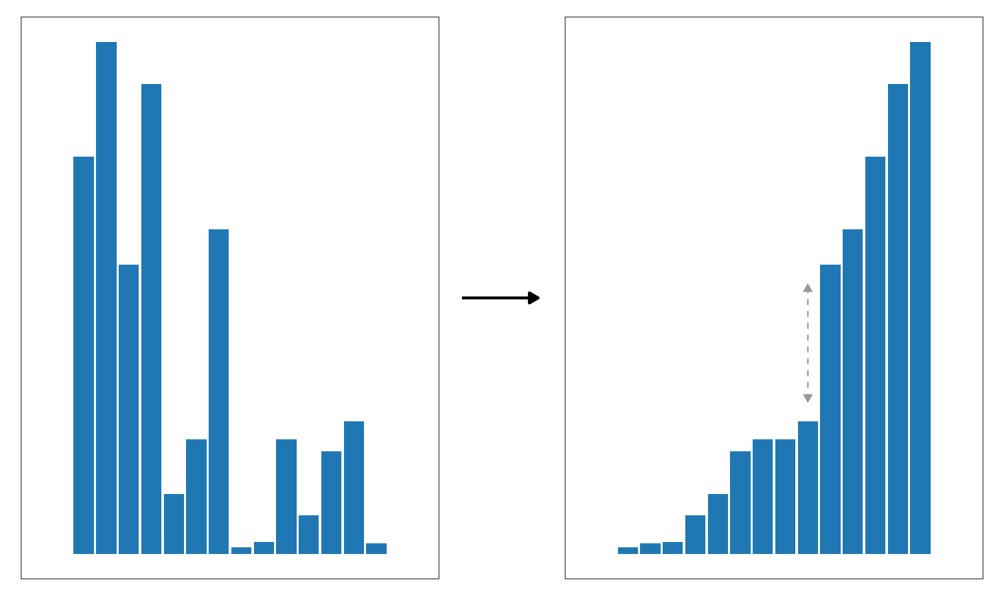
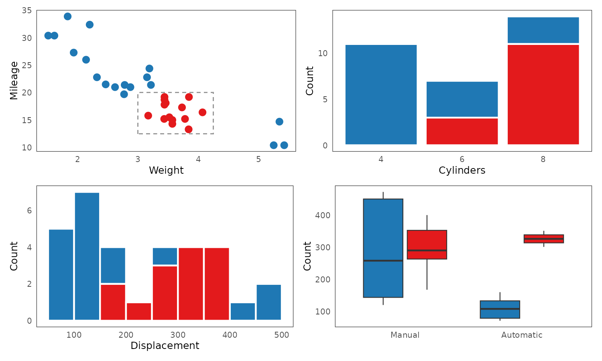
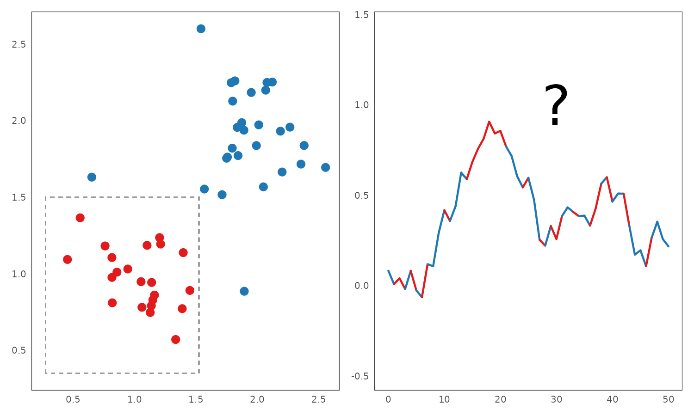

# Abstract 

Interactive data visualization has become a staple of modern data presentation. Yet, despite its growing popularity, there still exists many unresolved issues which make the process of producing rich interactive data visualizations difficult. Chief among these is the problem of data pipelines: how do we design a framework for turning raw data into summary statistics that can then be visualized, efficiently, on demand, and in a visually coherent way? Despite seeming like a straightforward task, there are in fact many subtle problems that arise when designing such a pipeline, and some of these may require a dramatic shift in perspective. In this thesis, I argue that, in order to design coherent generic interactive data visualization systems, we need to ground our thinking in concepts from some fairly abstract areas of mathematics including category theory and abstract algebra. By leveraging these algebraic concepts, we may be able to build more flexible and expressive interactive data visualization systems.

```{r}
#| echo: false

knitr::opts_chunk$set(
  fig.align = "center"
)

directory <- tempdir()

get_ts_filepath <- function(x) {
  if (endsWith(x, ".ts")) {
    paste0(directory, "/", trimws(gsub("//", "", x)))
  } else {
    tempfile(tmpdir = directory, fileext = ".ts")
  }
}

# Create a TypeScript knitr engine
knitr::knit_engines$set(ts = function(options) {
  code <- paste0(options$code, collapse = "\n")
  out <- ""
  
  if (options$eval) {
    ts_path <- get_ts_filepath(options$code[1]) 
    ts_conn <- file(ts_path)
    writeLines(code, ts_conn)
    
    out <- paste("~/.bun/bin/bun run", ts_path) |> 
      system(intern = TRUE, ignore.stderr = TRUE)
    
    close(ts_conn)
  }
  
  knitr::engine_output(options, code, out)
})

```

```{r}
#| echo: false

pal_paired_1 <- palette.colors(2, "Paired")
pal_paired_3 <- palette.colors(6, "Paired")[c(1, 2, 5, 6, 3, 4)]
pal_light_3 <- pal_paired_3[1:3]
pal_dark_3 <- pal_paired_3[2 * 1:3]

library(ggplot2)

clean_theme <- theme_bw() +
  theme(
  axis.ticks = element_blank(),
  panel.grid = element_blank()
)

theme_set(clean_theme)
```

\newcommand\then{⨾}


<!--chapter:end:index.Rmd-->

# Introduction {#introduction}

> It’s written here: ‘In the Beginning was the Word!’ <br>
> Here I stick already! Who can help me? It’s absurd, <br>
> [...] <br>
> The Spirit helps me! I have it now, intact. <br>
> And firmly write: ‘In the Beginning was the Act!
>
> Faust, Part I, Johann Wolfgang von Goethe [-@goethe2015]

Humans are intensely visual creatures. About 20-30% of our brain is involved in visual processing [@van2003; @sheth2016], utilizing a highly sophisticated and powerful visual processing pipeline [see e.g. @goebel2004; @knudsen2020; for a brief review, see @ware2019]. It is well-established the brain can process certain salient visual stimuli in sub-20-millisecond times, outside of conscious attention [@ledoux2000; @ledoux2003], and that people can make accurate, parallel, and extremely rapid visual judgements, in phenomena known as subitizing and pre-attentive processing [@mandler1982; @treisman1985]. These features make the visual cortex the most powerful information channel that humans possess, both in terms of bandwidth and throughput.

Statisticians have known about this power of visual presentation for a long time. Starting with early charts and maps, data visualization co-evolved alongside mathematical statistics, offering an alternative and complementary perspective [for a review, see @friendly2006 or Section \@ref(brief-history)]. While mathematical statistics tended to focus on confirmatory hypothesis testing, data visualization provided avenues for unsupervised exploration, "forcing us to notice that which we would never expect to see" [@tukey1977]. Eventually, this valuable role of forcing us to see the unexpected established data visualization as a respected tool within the applied statistician's toolkit.

Seeing an object from a distance is one thing, but being able to also touch, manipulate, and probe it is another. Within the human brain, action and perception are not independent, but are instead intricately linked, mutually reinforcing processes [see e.g. @dijkerman2007; @lederman2009]. Beginning in the 1970's, statisticians acquired a new set of tools for exploiting this connection. The advent of computer graphics and interactive data visualization transformed the idea of "interrogating a chart" from a mere turn of phrase into tangible reality. All of a sudden, it became possible to work with the visual representation of data in a tactile way, getting new perspectives and insights at the stroke of a key or click of a button. 

This compelling union of the visual and the tactile has made interactive data visualization a popular method of presenting data. Nowadays, there are many packages and libraries for building interactive data visualizations across all the major data analytic languages. Interactive figures make frequent appearance in online news articles and commercial dashboards. However, despite this apparent popularity, significant gaps remain in the use and understanding of interactive visualizations. Individual analysts rarely utilize interactive data visualization tools [see e.g. @batch2017], the availability of certain more sophisticated interactive features is fairly limited (see Section \@ref(litreview)), and researchers still point to a lack of a general interactive data visualization pipeline [@wickham2009; @vanderplas2020]. 

This thesis explores these interactive data visualization paradoxes and the inherent challenges surrounding interactive data visualization pipelines more specifically. I argue that, contrary to some prevailing views, interactivity is not simply an add-on to static graphics. Instead, interactive visualizations must be designed with interactivity as a primary consideration. Furthermore, I contend that certain interactive features fundamentally influence the types of visualizations that can be effectively presented. My claim is that popular types of interactive visualizations exhibit a particular kind congruence between graphics, statistics, and interaction, and that the absence of this congruence results in suboptimal visualizations. I formalize this congruence using the framework of category theory. Finally, I validate these theoretical concepts by developing an open-source interactive data visualization library and demonstrate its application to real-world data.

#### Thesis Overview

The thesis is organized as follows. Section \@ref(litreview) reviews the history of interactive data visualization and discusses general trends and issues in the field. Section \@ref(problems), focuses on specific problems encountered when designing an interactive data visualization pipeline. Section \@ref(goals), outlines the the goals and aims that guided the development of the interactive data visualization library. Section \@ref(system) details the system's components and design considerations. Section \@ref(applied-example), presents an applied example of exploring a real-world data set using the developed library. Finally, Section \@ref(discussion), discusses lessons learned and potential future research directions.

<!--chapter:end:introduction.Rmd-->

---
output: html_document
editor_options: 
  chunk_output_type: console
---

```{r}
#| echo: false
knitr::opts_chunk$set(
  out.width = "100%",
  out.height = "100%"
)

include_figure <- function(path) {
  if (knitr::is_html_output()) knitr::include_url(path)
  else knitr::include_graphics(gsub(".html", ".png", path))
}

if (knitr::is_html_output()) {
  knitr::opts_chunk$set(
    out.extra = 'style="border: none;"' # Get rid of iframe borders
  )
}
```

# Background {#litreview}

## Brief history of interactive data visualization {#brief-history}

Data visualization has a rich and intricate history, and a comprehensive treatment is beyond the scope of the present thesis. Nevertheless, in this section, I will provide a brief overview, with a particular focus on the later developments related to interactive visualization. For a more detailed historical account, readers should refer to @beniger1978, @dix1998, @friendly2006, @friendly2021, or @young2011.

### Static data visualization: From ancient times to the space age

The idea of graphically representing abstract information is very old. As one concrete example, a clay tablet recording a land survey during the Old Babylonian period (approximately 1900-1600 BCE) has recently been identified as the earliest visual depiction of the Pythagorean theorem [@mansfield2020]. Other examples of early abstract visualizations include maps of geographic regions and the night sky, and these were also the first to introduce the idea of coordinate systems [@beniger1978; @friendly2021].

```{r}
#| echo: false
#| fig-cap: "Photos of the tablet Si. 427 which has recently been identified as the earliest depiction of the Pythagorean theorem [@mansfield2020]. Left: the obverse of the tablet depicts a diagram of a field, inscribed with areas. Right: the reverse of the tablet contains a table of numbers, corresponding to the calculation of the areas. Source: Wikimedia Commons [@mansfield2024]."
knitr::include_graphics("./figures/si427.jpg")
```

For a long time, coordinate systems remained tied to geography and maps. However, with the arrival of the early modern age, this was about to change. In the 16-17th century, the works of the 9th century algebraist Al-Khwarizmi percolated into Europe, and with them the idea of representing unknown quantities by variables [@kvasz2006]. This idea culminated with Descartes, who introduced the concept of visualizing algebraic relationships as objects in a 2D plane, forging a powerful link between Euclidean geometry and algebra [@friendly2021]. Coordinate systems were thus freed of their connection to geography, and the x- and y-axes could now be used to represent an arbitrary "space" spanned by two variables.

Descartes' invention of drawing abstract relationships as objects in a 2D plane was initially only used to plot mathematical functions. However, it would not be long until people realized that observations of the real world could be visualized as well. A true pioneer in this arena was William Playfair, who popularized visualization as a way of presenting socioeconomic data and invented many types of plots still in use today, such as the barplot, lineplot, and pie chart [@friendly2021]. Further, with the emergence of modern nation states in the 19th century, the collection of data and *statistics* ["things of the state", @etymonline2024] became widespread, leading to a "golden age" of statistical graphics [@beniger1978; @friendly2021; @young2011]. This period saw the emergence of other graphical lumnaries, such as Étienne-Jules Marey and Charles Joseph Minard [@friendly2021], as well as some ingenious examples of the use of statistical graphics to solve real-world problems, including John Snow's investigation into the London cholera outbreak [@freedman1999; @friendly2021] and Florence Nightingale's reporting on the unsanitary treatment of wounded British soldiers during the Crimean War [@brasseur2005], both of which lead to a great reduction of preventable deaths. 

Simultaneously, the field of mathematical statistics was also experiencing significant developments. Building upon the foundation laid by mathematical prodigies such as Jakob Bernoulli, Abraham de Moivre, Pierre Simon Laplace, and Carl Friedrich Gauss, early 19th century pioneers such as Adolph Quetelet and Francis Galton began developing statistical techniques for uncovering hidden trends in the newly unearthed treasure trove of socioeconomic data [@fienberg1992; @freedman1999]. In the late 19th and early 20th century, these initial efforts were greatly advanced by the theoretical work of figures such as Karl Pearson, Ronald A. Fisher, Jerzy Neyman, and Harold Jeffreys, who established statistics as a discipline in its own right and facilitated its dissemination throughout many scientific fields [@fienberg1992].

As mathematical statistics gained prominence in the early 20th century, data visualization declined. Perceived as less rigorous than "serious" statistical analysis, it got relegated to an auxiliary position, ushering in "dark age" of statistical graphics [@friendly2006; @young2011]. This development may have been partly driven by the early frequentist statisticians' aspiration to establish statistics as a foundation for determining objective truths about the world and society, motivated by personal socio-political goals [see @clayton2021]. Be it as it may, while statistical graphics also did get popularized and entered the mainstream during this time, only a few interesting developments took place [@friendly2021].      

However, beginning in the late 1950's, a series of developments took place which would restore the prominence of data visualization and make it more accessible than ever. Firstly, on the theoretical front, the work of certain academic heavy-weights greatly elevated data visualization and its prestige. Particularly, John Tukey [-@tukey1962; -@tukey1977] fervently championed exploratory data analysis and placed data visualization in its centre. Around the same time, Jacques Bertin published his famous *Sémiologie graphique* [-@bertin1967], which was one of the first works to attempt to lay out a comprehensive system of visual encodings and scales. Secondly, at the more applied level, the development of personal computers [see e.g. @abbate1999] and high-level programming languages such as FORTRAN in 1954 [@backus1978], made the process of rendering production-grade figures easier and more accessible than ever before. Combined, these developments fueled a surge in the use and dissemination of data visualizations.  

As the millennium drew to a close, several other important developments solidified the foundation of static data visualization. First, William Cleveland made significant contributions to the field, laying out many important principles for scientific data visualization [@cleveland1985; @cleveland1993]. Of note, his seminal study on the impact of the choice of visual encodings on statistical judgements remains widely cited today [@cleveland1984]. Similarly, Edward Tufte introduced essential principles for designing effective graphics, coining terms such as *chartjunk* and *data-to-ink ratio* [@tufte2001]. Finally, Leland Wilkinson's groundbreaking Grammar of Graphics [-@wilkinson2012] introduced a comprehensive system for designing charts based on simple algebraic rules, influencing nearly every subsequent software package and research endeavor in the field of visualization.

### Early interactive data visualization: By statisticians for statisticians {#early-interactive}

Compared to static data visualization, interactive data visualization is much more of a recent development. Consequently, less has been written about its history, owing to the shorter timeline, as well as the rapid evolution of software in the time since its inception and the proprietary nature of some systems. Nevertheless, the brief history of interactive data visualization is still rather compelling.

Following the boom of static data visualization in the 1950's, interactive data visualization would not be left far behind. It started with tools designed for niche, specialized tasks. For example, @fowlkes1969 designed a system which allowed the users to view probability plots under different configurations of parameters and transformations, whereas @kruskal1964 created a tool for visualizing multidimensional scaling. 

```{r}
#| echo: false
#| fig-cap: "John Tukey showcasing the PRIM-9 system (left), with an example of a projected scatterplot [right, @fisherkeller1974]. Screenshots were taken from a video available at: [ASA Statistical Graphics Video Library](https://community.amstat.org/jointscsg-section/media/videos))"
knitr::include_graphics("./figures/prim9.png")
```

However, researchers soon recognized the potential of interactive data visualization as a general-purpose tool for exploring data. The first such general-purpose system was PRIM-9 [@fisherkeller1974]. PRIM-9 allowed for exploration of multivariate data via interactive features such as projection, rotation, masking, and filtering. Following PRIM-9, the late 1980's saw the emergence of a new generation of systems which provided an even wider range of capabilities. Tools like MacSpin [@donoho1988], Data Desk [@velleman1989], XLISP-STAT [@tierney1990], and XGobi [@swayne1998] introduced features such as interactive scaling, rotation, linked views, and grand tours (for a glimpse into these systems, excellent video-documentaries are available at [ASA Statistical Graphics Video Library](https://community.amstat.org/jointscsg-section/media/videos)).

```{r xlisp-stat}
#| echo: false
#| fig-cap: "Example of interactive control of histogram highlighting in XLISP-STAT. Note that, unlike in many current data visualization systems, aggregation plots were sensitive to data order (not commutative). This non-commutative behavior meant that, for instance, a highlighted segment could appear in the middle of a bar (as seen in the figure above) or multiple non-adjacent highlighted cases might appear as 'stripes'. Figure reproduced from @tierney1990."

knitr::include_graphics("./figures/xlisp-stat.png")
```

#### Open-source Statistical Computing

The proliferation of open-source, general-purpose statistical computing software such as S and R further democratized the access to interactive data visualization tools. Building on XGobi's foundation, GGobi [@swayne2003], expanded upon on XGobi and provided an integration layer for R. Other tools like MANET [@unwin1996] and Mondrian [@theus2002] introduced sophisticated linking techniques, with features such as selection sequences, allowing the users to combine a series of selections via logical operators [see also @unwin2006]. Further, iPlots [@urbanek2003] implemented a general framework for interactive plotting in R, allowing not only for one-shot rendering interactive figures from R but also for direct programmatic manipulation. This package was later expanded expanded for big data capabilities in iPlots eXtreme [@urbanek2011]. Finally, the `cranvas` package [@xie2014] introduced a reactive programming paradigm for defining the infrastructure for interactive graphics directly in R, using the model-view-controller (MVC) architecture.         

```{r}
#| echo: false
#| fig-align: "center"
#| fig-cap: "Examples of interactive features in Mondrian [@theus2002]: selection operators (left) and mosaic plot with querying (right)."
knitr::include_graphics("./figures/mondrian.png")
```

Alongside the more general interactive data visualization frameworks mentioned above, there were also more specialized packages designed for specific techniques and models. For instance, `KLIMT` was developed for interactive visualization of classification and regression trees [@urbanek2001; @urbanek2002]. Similarly, packages like `tourr` [@wickham2011], `spinifex` [@spyrison2020], `liminal` [@lee2021; @lee2022a] provided tools for exploring large multivariate data sets via grand tour projections [see @cook1995]. Generally, over time, there seems to have been a trend towards more of these specialized tools within the R community, and fewer of the general, high-level frameworks [although there were some notable exceptions, such as the `loon` package, @waddell2023]. Currently, it seems that R users typically encounter interactive visualizations as part of Shiny [@shiny2024] dashboards, or through R wrappers of interactive data visualization packages ported over from the JavaScript ecosystem (see Section \@ref(web-based)).

#### Common features and limitations of early interactive systems

A common thread among these interactive data visualization systems is that they were designed by statisticians with primary focus on data exploration. High-level analytic features such as linked views, rotation/projection, and interactive manipulation of model parameters made frequent appearance. While these features were powerful, they also contributed to a steeper learning curve, potentially limiting adoption by users without a strong data analytic background. Furthermore, these early tools were typically standalone applications, with only later packages like GGobi and iplots offering integration with other data analysis software and languages. Finally, they often offerered only limited customization options and this made them less suitable for data presentation.

### Interactive data visualization and the internet: Web-based interactivity {#web-based}

The end of the millennium marked the arrival of a new class of technologies which impacted interactive data visualization just as much as almost every other field of human endeavor. The rise of the internet in the mid 1990's made it possible to create interactive applications that could be accessed by anyone, from anywhere. This was aided by the dissemination of robust and standardized web browsers, as well as the development of JavaScript as a high-level programming language for the web  [for a tour of the language's history, see e.g. @wirfs-brock2020]. Soon, interactive visualizations became just one of many emerging technologies within the burgeoning web ecosystem. 

Early web-based interactive data visualization systems tended to rely on external plugins. Examples of these include Prefuse [@heer2005] and Flare [developed around 2008, @flare2020], which leveraged the Java runtime and Adobe Flash Player, respectively. However, as browser technologies advanced, particularly as JavaScript's performance improved thanks to advances in just-in-time compilation [JIT, see e.g. @clark2017; @dao2020], it became possible to create complex interactive experiences directly in the browser. This led to the emergence of several popular web-native interactive data visualization systems in the early 2010s, many of which remain widely used today. 

#### D3

D3.js [@bostock2022] is one of the earliest and most influential web-based visualization systems. As a general, low-level framework for visualizing data, D3 provides of a suite of specialized JavaScript modules for various aspects of the data visualization workflow, including data parsing, transformation, scaling, and DOM interaction. 

For instance, here's how to create a basic scatterplot in D3:

```{js}
#| eval: false
import * as d3 from "d3";

const plot = document.querySelector<HTMLDivElement>("#d3-plot")!;
const data = [
  { x: 1, y: 0.41 },
  { x: 2, y: 4.62 },
  { x: 3, y: 7.62 },
  { x: 4, y: 6.54 },
  { x: 5, y: 9.61 },
];

const margin = { top: 10, right: 30, bottom: 30, left: 60 };
const width = parseFloat(plot.style.width);
const height = parseFloat(plot.style.height);

// Create a SVG element, resize it, and append it to #d3-plot
const svg = d3
  .select("#d3-plot")
  .append("svg")
  .attr("width", width + margin.left + margin.right)
  .attr("height", height + margin.top + margin.bottom)
  .append("g")
  .attr("transform", "translate(" + margin.left + "," + margin.top + ")");

// Create x and y scales and append them to
const scaleX = d3.scaleLinear().domain([0, 6]).range([0, width]);
const scaleY = d3.scaleLinear().domain([10, 0]).range([0, height]);
svg
  .append("g")
  .attr("transform", "translate(0," + height + ")")
  .call(d3.axisBottom(scaleX));
svg.append("g").call(d3.axisLeft(scaleY));

// Add points
svg
  .append("g")
  .selectAll("dot")
  .data(data)
  .enter()
  .append("circle")
  .attr("cx", (d) => scaleX(d.x))
  .attr("cy", (d) => scaleY(d.y))
  .attr("r", 2);
```

```{r d3-scatterplot}
#| echo: false
#| fig-cap: "Example of a scatterplot built with D3.js. The code was taken from D3 Graph Gallery [@holtz2022b] and adjusted to use ES6 syntax and slightly more informative variable names/comments."
knitr::include_graphics("./figures/d3-scatterplot.png")
```

As you can see from Figure \@ref(fig:d3-scatterplot) and the corresponding code, D3 is a fairly low-level framework. Compared to typical high-level plotting functionalities such as those provided by base R or `ggplot2` [@r2024; @wickham2016], the user has to handle many low-level details such as scaling and appending of primitives explicitly. This is also the case with interaction. While D3 does provide some methods for handling reactive DOM events, it does not itself provide a system for dispatching and coordinating these events - instead, it delegates this responsibility to the user, and encourages the use of reactive Web frameworks such as React [@react2024], Vue [@vue2024], or Svelte [@svelte2024]. 

Finally, D3.js visualizations are rendered as Scalable Vector Graphics (SVG) by default. This ensures lossless scaling but may impact rendering performance at high data volumes. While various unofficial alternative rendering engines based on the HTML 5 Canvas element or WebGL, do exist, there are no official libraries with such functionalities as of this date.

#### Plotly and Highcharts

Building upon the low-level infrastructure that D3 provides, many packages such as Plotly.js [@plotly2022] and Highcharts [@highcharts2024] provide high-level abstractions which make the process of building interactive figures easier for the average user. Unlike D3 which provides low-level utilities such as data transformations, scales, and geometric objects, these packages provide a simple declarative framework for rendering entire plots using a static [JSON] schema.

Here's how we can render the same scatterplot in Plotly, using the R `plotly` package [@sievert2020]:

```{r}
#| eval: false
library(plotly)
data <- data.frame(x = 1:5, y = c(0.41, 4.62, 7.62, 6.54, 9.61))
plot_ly(data, x = ~x, y = ~y)
```

```{r}
#| echo: false
#| eval: false

urls <- list.files("./figures", "scatterplot.html", full.names = TRUE)
outs <- gsub(".html", ".png", urls)

webshot2::webshot(urls, outs, delay = 30)
```

```{r plotly-scatterplot}
#| echo: false
#| fig-cap: "Example of a scatterplot with `plotly`."
include_figure("./figures/plotly-scatterplot.html")
```

Here's the correponding code in JavaScript:

```{js}
#| eval: false
const data = [{
  x: [1, 2, 3, 4, 5],
  y: [0.41, 4.62, 7.62, 6.54, 9.61],
  mode: 'markers',
  type: 'scatter'
}];

Plotly.newPlot('app', data);
```

Clearly, compared to the D3 code used to create Figure \@ref(fig:d3-scatterplot), the code for creating Figure \@ref(fig:plotly-scatterplot) is much terser. Many details, such as the axis limits and margins, point size and colour, gridlines, and widgets, are handled implicitly, via default values and automatic inference. Also, note that the figure provides some interactive features by default, such as zooming, panning, and tooltip on hover. Reactivity is handled automatically using systems built on the native DOM Event Target interface [@mdn2024a].

Highcharts provides a similar JSON-based interface for specifying plots. While perhaps slightly more flexible than Plotly, it also requires more verbose specifications. Because of the similarity, I will not provide a separate example here [interested reader should look up the package's website, @highcharts2024].

Finally, like D3, both plotly.js and Highcharts also render the graphics in SVG by default. However, unlike D3, they both also provide alternative rendering engines based on WebGL [@highschartsboost2022; @plotly2024b]. This makes them more ergonomic for use with large data sets. 

#### Vega and Vega-Lite

Vega [@satyanarayan2015; @vega2024a] is another popular interactive data visualization package. Like Plotly and Highcharts, Vega is also partially built upon the foundation of D3 and uses JSON schema for plot specification. However, Vega is more low-level and implements a lot of custom functionality. This allows it to offer more fine-grained customization of graphics and interactive behavior, leading to greater flexibility.

However, this added flexibility does come at a cost. Compared to the high-level frameworks like Plotly and Highcharts, Vega is significantly more verbose. For instance, creating a scatterplot matrix with linked selection in Vega requires over 300 lines of JSON specification, not including the data and using default formatting [@vega2024b].

Vega-Lite [@satyanarayan2015] attempts to remedy this complexity by providing a high-level interface to Vega. Here's how we can define a scatterplot with zooming, panning, and tooltip on hover in Vega-Lite:

```{r}
#| eval: false

library(vegawidget)

plot_spec <- list(
    `$schema` = vega_schema(),
    width = 500,
    height = 300,
    data = list(values = data),
    mark = list(type = "point", tooltip = TRUE),
    encoding = list(
      x = list(field = "x", type = "quantitative"),
      y = list(field = "y", type = "quantitative")
    ),
    params = list(list(name = "grid", 
                       select = "interval", 
                       bind = "scales"))
  )

plot_spec |> vegawidget()
```

```{r vegalite-scatterplot}
#| echo: false
#| fig-cap: "Example of a scatterplot built with `vegalite`."
# saveWidget(vegawidget(w), "./figures/vegalite-scatterplot.html")
include_figure("./figures/vegalite-scatterplot.html")
```

Just for clarity, the R code above corresponds to the following declarative JSON schema:

```{js}
#| eval: false
{
  $schema: "https://vega.github.io/schema/vega-lite/v5.json",
  width: 500,
  height: 300,
  data: { values: [
    { x: 1, y: 0.41 },
    { x: 2, y: 4.62 },
    { x: 3, y: 7.62 },
    { x: 4, y: 6.54 },
    { x: 5, y: 9.61 }]
  },
  mark: {"type": "point", "tooltip": true},
  encoding: {
    x: { field: "x", type: "quantitative" },
    y: { field: "y", type: "quantitative" }
  },
  params: [{ name: "grid", select: "interval", bind: "scales" }]
};
```

Note that the zooming and panning capability is provided by the `params` property, which declaratively specifies a list of plot parameters that can be modified by interaction [see @vegalite2024a]. In the case above, the specification creates a two-way binding between plot scales and mouse selection events [@vegalite2024b].   

#### Common features and limitations of web-based interactive systems

In general, these contemporary web-based interactive data visualization systems offer a great deal of flexibility, making them well-suited to modern data presentation. However, all of this expressiveness does seem to come at a cost. Compared to the earlier statistical graphics systems, described in Section \@ref(early-interactive), many of the more advanced features that used to be common are either missing or require a significant effort to implement, such that they are only accessible to expert users. This is evidenced by their infrequent appearance in documentation and example gallery pages. 

For instance, the [R Graph Gallery entry on Interactive Charts](https://r-graph-gallery.com/interactive-charts.html) [@holtz2022] features multiple interactive figures implemented in the JavaScript libraries described above. However, all of these examples show only surface-level, single-plot interactive features such zooming, panning, hovering, 3D rotation, and node repositioning. The [Plotly Dash documentation page on Interactive Visualizations](https://dash.plotly.com/interactive-graphing) [@plotly2022] does feature two examples of simple linked cross-filtering, however, the vast majority of visualizations in the [Plotly R Open Source Graphing Library documentation page](https://plotly.com/r/) [@plotly2022] show examples only surface-level interactivity. Similarly, [VegaLite Gallery pages on Interactive Charts](https://vega.github.io/vega-lite/examples/#interactive-charts) [@vegalite2022] feature many examples, however, only a limited number of examples show linked or parametric interactivity (see e.g. [Interactive Multiview Displays](https://vega.github.io/vega-lite/examples/#interactive-multi-view-displays)). Finally, the [Highcharter Showcase Page ](https://jkunst.com/highcharter/articles/showcase.html) [@kunst2022] does not feature any examples of linking.

Even when advanced features such as linking and parametric manipulation are supported, they are often limited in some way. For example, the following is a quote from the website of Crosstalk, a package designed to enable linking in R, using web-based interactive widgets created with the `htmlwidgets` package [@htmlwidgets2021] or R Shiny [@shiny2024]:

> "Crosstalk currently only works for linked brushing and filtering of views that show individual data points, not aggregate or summary views (where “observations” is defined as a single row in a data frame). For example, histograms are not supported since each bar represents multiple data points; but scatter plot points each represent a single data point, so they are supported."
>
>- @crosstalk2025

Of course, with enough effort, these web-based visualization systems can still be used to create rich figures with advanced interactive features such as linked views and parametric interaction. However, implementing these features often requires stepping down a level of abstraction and dealing with low-level language primitives. This defeats the purpose of using a high-level libraries and creates a barrier to entry for casual users [@keller2024]. It also may explain why interactive visualizations are nowadays mainly used for data presentation, not data exploration [@batch2017]. With the high upfront cost of learning these package's APIs, creating rich interactive figures may be a task best suited for dedicated developers working inside large organizations, rather than individual researchers/analysts.  

## What even is interactive data visualization? {#what-is-interactive-visualization}

> If it looks like a duck, swims like a duck, and quacks like a duck, then it probably is a duck. 
>
> [...] The irony is that while the phrase is often cited as proof of abductive reasoning, it is not proof, as the mechanical duck is still not a living duck
>
> [Duck Test](https://en.wikipedia.org/wiki/Duck_test) entry, [@wikipedia2022] 

In the previous section (Section \@ref(brief-history)), I provided an overview of the history and present state of interactive data visualization, discussing a number of features and systems. However, while doing so, I avoided one crucial question: what constitutes an interactive data visualization? 

Surprisingly, despite the widespread popularity of interactive visualizations, there is no universally agreed-upon definition of interactivity [@vanderplas2020]. Within the data visualization literature, the terms "interactive" and "interaction" are rarely explicitly defined. And even when they are, the definitions are often incongruent or even contradictory [see e.g. @dimara2019; @elmqvist2011; @pike2009]. Finally, similar conceptual ambiguity extends to other terms commonly used in the field, such as a "dashboard" [@sarikaya2018].     

This lack of a clear consensus makes the task of discussing interactive data visualization difficult. Ignoring the issue could lead to confusion, while a truly comprehensive dive into the terminology surrounding interactive data visualization could become excessively verbose, as evidenced by the existence of research papers dedicated to the topic [see e.g. @dimara2019; @elmqvist2011]. To address this issue, this section aims to provide a concise overview of how interactivity has been conceptualized in the literature. The goal is to establish a clear framework for understanding "interactive" and "interaction" within the context of this thesis.

### Interactive vs. interacting with {#interactive-interacting}

First, the word "visualization" in "interactive data visualization" can be interpreted in two different ways:

1. As a noun: a concrete chart or figure
2. As a nominalized verb: the process of interacting with a figure

In data visualization literature, both interpretations are frequently used, leading to significant ambiguity [@dimara2019; @pike2009; see also @yi2007]. On one hand, some researchers focus on the mathematical and computational aspects of visualization, discussing specific systems and implementations [see e.g. @buja1996; @kelleher2015; @leman2013; @wills2008]. Others prioritize the more cognitive or human-computer interaction (HCI) aspects of interactive data visualization, exploring what impact different kinds of visualization techniques have on the user's ability to derive insights from the data [see e.g. @brehmer2013; @dimara2019; @dix1998; @pike2009; @quadri2021; @yi2007]. 

Of course, many interactive data visualization papers discuss both implementation and user experience. However, the dual interpretation of the term "interactive data visualization" does complicate literature search. It also highlights the interdisciplinary nature of the field, showing its connections to statistics, computer science, applied mathematics, business analytics, HCI, and cognitive psychology [see @brehmer2013; @dimara2019]. While this interdisciplinary nature of interactive data visualization is certainly a strength, it can also lead to confusion. As such I think it is necessary to clearly define key terms. 

To ensure clarity throughout thesis, the term *"interactive data visualization"* will primarily refer to concrete charts or figures. When referring to the *practice* of interactive data visualization, I will attempt to use more active phrasing such as *"interacting with a visualization"* or *"user's interaction with a visualization"*, to indicate that what is being referred to is the activity or process of visualization, rather than any concrete figure or chart. 

### Interactive *enough*?

Even when we use the term "interactive data visualization" to refer to concrete charts or figures, the meaning still remains fairly ambiguous. What is the bar for calling a figure "interactive"? What features should interactive figures have? Surprisingly, it is hard to find consensus on these topics among data visualization researchers, and the criteria tend to vary a lot, such that the same figure may be considered interactive by some but not by others. 

Some researchers adopt a broad definition of interactive data visualization, considering almost any figure combined with an interactive graphical user interface (GUI) as interactive, as long as it allows for some level of user manipulation  [@brodbeck2009]. For others, the speed of the computer's responses to user input is important, with faster updates translating to greater interactivity [@becker1987; @buja1996]. Some also differentiate between "interactive" and "dynamic" manipulation, such that interactive manipulation involves discrete actions such as pressing a button or selecting an item from a drop-down menu, whereas dynamic manipulation involves continuous actions, like moving a slider or clicking-and-dragging to highlight a rectangular area [@rheingans2002; @jankun2007; see also @dimara2019]. 

However, many other researchers ascribe to a much narrower view of interactive data visualization, which hinges on high-level analytic features that allow efficient exploration of the data. These features include the ability to generate different views of the data (by e.g. zooming, panning, sorting, and filtering), and the reactive propagation of changes between connected or "linked" parts of a figure [@kehrer2012; @buja1996; @keim2002; @unwin1999; @chen2008]. An often cited guideline is the visual information seeking mantra: overview first, zoom and filter, then details-on-demand [@shneiderman2003]. Similarly, in visual analytics research, a distinction is made between "surface-level" (or "low-level") and "parametric" (or "high-level") interactions, where surface-level interactions manipulate attributes of the visual domain only (e.g. zooming and panning), whereas parametric interactions manipulate attributes of mathematical models or algorithms underlying the visualization [@leman2013; @self2018; @pike2009]. 

Table \@ref(tab:definitions) provides a concise summary of the several perspectives on interactivity discussed above. It meant to serve as a reference point for future discussions within the text, though it is important to note that this is not an exhaustive list. For a more comprehensive taxonomy of interactive visualization systems and features, see e.g. @dimara2019, @yi2007.

```{r definitions}
#| echo: false

library(kableExtra)

tab <- data.frame(
  type = c("User interaction", 
           "Real-time updates", 
           "Plot- and data-space manipulation",
           "Linked views",
           "Parametric updates"),

  details = c("The user can interactively manipulate the figure in some way",
              "The user's interactions propagate into the visualization with little to no lag",
              'The user can interactively explore different parts of the data set by doing actions which effectively amount to "subsetting" rows of the data (e.g. zooming, panning, and filtering)',
              r"(The user's interactions propagate across multiple plots (e.g. linked highlighting))",
              "The user can manipulate the parameters of some underlying mathematical model or algorithm (e.g. histogram bins, grand tour projections, etc...)"),
  papers = c("@brodbeck2009", 
             "@becker1987, @buja1996, @jankun2007, and @rheingans2002", 
             "@buja1996, @keim2002, @shneiderman2003, and @unwin1999", 
             "@buja1996, @keim2002, @kehrer2012, @unwin1999, @theus2008, @wilhelm2008, @wills2008", 
             "@leman2013, @pike2009")
)

colnames(tab) <- c("Name", "Details", "Selected references")
kableExtra::kbl(tab, caption = "Summary of the perspectives on interactivity") |> 
  kable_styling(full_width = FALSE)
```

### Complexity of interactive features {#complexity-of-features}

The way we define interactivity is not just a matter of taste or preference: it has a significant impact on the complexity and feasibility of our systems. As we will see in Section \@ref(common-features), some simple features are fairly easy to implement, requiring just a thin interactive layer over a static data visualization system, whereas others come with a significant overhead, requiring an entirely different framework than static visualization.

To make the point with a particularly blunt example, many programming languages support a read-evaluate-print loop (REPL). This allows interactive code execution from the command line: the user inputs code, the interpreter evaluates it, outputs results, and waits for more input. If the language supports plotting, running code to generate plots could be considered an "interactive data visualization system." User interaction with the REPL modifies the visual output, and with fast-enough input, updates could appear almost instantly (thus satisfying the user interaction and real-time update definitions of interactivity, see table). This would make almost every programming language an "interactive data visualization system", requiring no additional effort.

However, I would argue that, today, this view stretches the concept of interactivity. It is true that, historically, the command line was considered a highly interactive user interface [see e.g. @foley1990; @howard1995]. However, with advancements in processor speeds and the widespread adoption of graphical user interfaces (GUIs), user expectations have evolved. Nowadays, we typically associate interactivity with direct manipulation of visual elements and immediate feedback [@dimara2019; @urbanek2011]. Thus, we can see that what's considered "interactive" evolves over time. 

But even with figures that are manipulated directly, there still are considerable differences in what different features imply for implementation requirements. Some features, like changing color or opacity of points in a scatterplot affect only the visual attributes of the plot and not the underlying data representation. This makes them simple to implement as they do not require any specialized data structures or complex computations, and the primary cost lies in re-rendering the visualization.

In contrast, some interactive features require a lot more infrastructure. For instance, filtering, linked highlighting, or parametric interaction require specialized data structures and algorithms beyond those that would be required in static plots. This is because, each time the user engages in an interaction, entirely new summaries of the underlying data may need to be computed. 

To give a concrete example, when a user selects several points in a linked scatterplot (see Section \@ref(linked-selection)), we first have to find the ids of all the selected cases, recompute the statistics underlying all other linked plots (such as counts/sums in barplots or histograms), train all of the relevant scales, and only then can we re-render the figure. Likewise, when interactively manipulating a histogram's binwidth, we need to recompute the number of cases in each bin whenever the binwidth changes. To maintain the illusion of smooth, "continuous" interaction [@dimara2019], these computations need to happen fast, and as such, computational efficiency becomes imperative at high data volumes.

### Working definition

As discussed in previous sections, the definition "interactive data visualization" varies across fields and researchers. Moreover, when building interactive data visualization systems, different definitions imply varying levels of implementation complexity. Thus, we need to establish clear criteria for our specific definition. 

Data visualization can be broadly categorized into two primary modes: presentation and exploration. While both modes share a bulk of common techniques, each comes with a different set of goals and challenges [@kosara2016]. Data presentation starts from the assumption that we have derived most of the important insights from our data already, and the goal is now to communicate these insights clearly and make an impactful and lasting impression [@kosara2016]. In contrast, data exploration begins from a position of incomplete knowledge - we accept that there are facts about our data we might not be aware of. Thus, when we explore data with visualizations, the goal is to help us see what we might otherwise miss or might not even think to look for [@tukey1977; @unwin2018].    

However, it is not always the case that more complex visuals necessarily translate to better statistical insights. In static visualization, it is a well-established that plots can include seemingly sophisticated features which do not promote the acquisition of statistical insights in any way [@cairo2014; @cairo2019; @gelman2013; @tufte2001]. Similarly, adding interactivity to a visualization does not always improve its statistical legibility [see e.g. @abukhodair2013; @franconeri2021]. 

I propose to treat interactive features the same way we treat visual features in static visualization. Specifically, I propose the following working definition:

> When building interactive data visualization systems, we should prioritize interactive features which promote statistical understanding.

If we accept this proposition, then several important consequences follow. First, we must favor high-level, data-dependent, parametric interactions over the purely graphical ones. That is not to say that purely graphical interactive features cannot useful. For instance, in the case of overplotting, changing the size or alpha of points in a scatterplot can help us see features that would otherwise remain hidden. Nevertheless, I argue that the ability to see entirely new representations of the data is what makes some interactive data visualizations systems particularly powerful. The interactive features that enable this, such as linked highlighting and parameter manipulation, go beyond aesthetics, and empower the users to explore the data in a much more dynamic way, compared to static graphics.

### Common interactive features {#common-features}

This section describes several common types of interactive features that tend to frequently appear in general interactive data visualization systems. It is only meant as an overview [for more comprehensive taxonomies of interactive features, see @dimara2019; @unwin2006; @yi2007]. For each feature, I highlight its core properties, common use cases, and implementation requirements. 

#### Changing size and opacity

One of the simplest and most widely-implemented interactive features is the ability to adjust the size and opacity of geometric objects. This feature gives the user the ability to dynamically shrink or grow objects and make semi-transparent, fully transparent, or opaque. 

The ability to shrink objects or make them semi-transparent can be particularly useful at high data volumes, since this can reveal trends that may be otherwise hidden due to overplotting. For example, in scatterplots, shrinking points and making them semi-transparent makes it possible to identify high-density regions and can in fact provide an approximation to a 2D kernel density plot [see e.g. @dang2010]. The same applies to all other types of plots where the where objects or glyphs may be plotted on top of each other at high densities, such as parallel coordinate plots [@theus2008].

This feature usually fairly easy to implement, since it involves manipulating visual attributes only. Specifically, in many interactive systems, size and alpha multipliers are independent parameters of the visual representation, which do not depend on the underlying data in any way. In other words, when we manipulate size or opacity of geometric objects in our plots, we do not need to worry about what data these objects represent. Compared to other interactive features, this makes it relatively simple to add this functionality to an existing static visualization system [see @bracsoveanu2017].

#### Zooming and panning

Another two significantly related interactive features are zooming and panning. They are often used in tandem, and both involve interactive manipulation of scale limits. For this reason, I discuss them here simultaneously, in a single subsection.

Zooming, depicted in Figure \@ref(fig:zooming), allows the user to magnify into a specific region of a plot. A common approach involves creating a rectangular selection and the axis scales are then automatically adjusted to match this region, however, other techniques do exist, for instance a symmetric zoom centered on a point using a mouse wheel. Zooming is useful because it allows the user to get a better sense of the trend within the magnified region, and discover patterns that may be otherwise obscured due to overplotting or improper aspect ratio [see e.g. @buja1996; @dix1998; @unwin1999; @theus2008; @yi2007]. 

```{r zooming}
#| echo: false
#| fig-cap: "Zooming involves shrinking the axis limits to obtain a more detailed view of the data. Typically, the user selects a rectangular region of the plot (left) and the plot scales are then adjusted so that the region fills up the entire plot area (right). Notice the change in the axis limits."
knitr::include_graphics("./figures/zooming.png")
```

After zooming, it is useful to retain the ability to navigate the wider plot region while preserving the current zoom level and aspect ratio. Panning addresses this need. By performing some action, typically right-click and drag, the user can move the center of the zoomed-in region around, exploring different areas of the plot. 

```{r panning}
#| echo: false
#| fig-cap: "Panning involves moving the axis limits while retaining the same zoom level and axis ratio. After zooming into a rectangular region (top row), the user can around the plot region, usually by clicking and dragging (bottom row)."
knitr::include_graphics("./figures/panning.png")
```

Zooming and panning can be implemented by manipulating scales only, and this also makes them generally fairly straightforward to implement, similar to changing size and opacity. However, there are a few issues to consider. First, whereas continuous axes can be be zoomed and/or panned by simply modifying the axis limits, zooming discrete axes requires a bit more nuance [see e.g. @wilkinson2012]. Second, it is often desirable to give the user the ability to zoom-in multiple levels deep, and this makes maintaining a reversible history of previous zoom-states essential [@unwin1999]. Third, at times, it can be useful to link scale updates across multiple plots, such that, for example, zooming or panning a plot in a scatterplot matrix produces the same actions in other plots with the same variable on one of the axes. Finally, an advanced feature that can be also quite useful is semantic or logical zooming [@keim2002; @unwin1999; @yi2007]. This technique goes beyond magnifying objects; it also increases the level of detail the objects display as the user zooms in. Semantic zooming can be particularly powerful when combined with hierarchical data such as geographic information, however, it also introduces additional complexity, since the effects of the zoom action propagate beyond x- and y-axis scales. 

#### Querying

Querying is another popular interactive feature that is usually fairly straightforward to implement. As shown in Figure \@ref(fig:querying), the way querying is typically implemented is that when a user mouses over a particular geometric object, a small table of key-value pairs is displayed via a tool-tip/pop-up, showing a summary of the underlying data point(s) [@urbanek2003; @xie2014]. This makes it possible to look up precise values that would otherwise be available only approximately via the visual representation. 

```{r querying}
#| echo: false
#| fig-cap: "Querying involves hovering over an object to display its associated data values in a table or pop-up. Notice that this can include both plotted values (`weight`, `mileage`) as well as values that are not directly represented in the plot (car name, `cylinders`)."
knitr::include_graphics("./figures/querying.png")
```

Querying is useful because it combines the best features of graphics and tables. Specifically, it allows the user to overcome Tukey's famous prescriptions: "graphics are for the qualitative/descriptive [...] never for the carefully quantitative (tables do that better)", and: "graphics are for comparison [...] not for access to individual amounts" [@tukey1993]. By providing the option to query individual objects, the user can seamlessly transition between the high-level analytic overview of the graphic and low-level quantitative detail of a table. This facilitates high-precision analytic tasks, such as identifying specific outliers or calculating exact magnitudes of differences [@unwin2006].

Additionally, querying also allow us to show more information than is displayed via the visual encodings alone (see again Figure \@ref(fig:querying)). Specifically, whereas most plots can encode only two or three variables, we can assign an arbitrary number of key-value pairs to the rows of the query table/pop-up. However, it is crucial to balance the level of detail against visual clutter. Too many rows may overtax the attention of the user and also can lead to clipping/overplotting issues, if the query table cannot fit inside the plotting area. Further, there are [better methods](#bidirectional-communication) for retrieving very detailed information from interactive visualizations.    

Finally, while querying is also one of the more straightforward features, its implementation does present certain challenges. First, a naive implementation might simply display derived data values in the state just before they are mapped to visual attributes via scales, however, these are not always the most informative. For instance, in a stacked barplot, returning the original (unstacked) values is more useful than the stacked ones. Second, aggregate plots such as barplots or histograms do generally present some design decisions [see @unwin2006]. In the case of one-to-one plots such as scatterplots, query data for an object (point) can be obtained by simply retrieving the corresponding row. However, in aggregate plots like barplots and histograms, a single object may correspond to multiple rows. This necessitates summarizing the underlying data, and often there may be no single "correct" summary. For instance, when querying a bar in a barplot, should we return the sum of the underlying continuous variable, some other numeric summary such as the mean or maximum, the set of all unique values, multiple of these summaries, or perhaps something else entirely? Similar ambiguities arise when querying objects which are partially selected or highlighted (see Section \@ref(linked-selection)): should the query return summaries corresponding to the entire object, the highlighted parts, or both?

#### Sorting and reordering

With plots of discrete (unordered) data, a highly useful feature can be to sort or reorder objects based on some criterion [see @unwin2000; @unwin2006]. For example, with barplots, in the absence of other ordering rules, bars are typically ordered by the lexographical order of the x-axis variable. However, sometimes, we can glean interesting patterns by sorting the bars in some other order, for example by their height, see Figure \@ref(fig:sorting).

```{r sorting}
#| echo: false
#| fig-cap: "Sorting or reordering can highlight interesting trends. For instance, sorting lexicographically ordered bars (left) by bar height (right) in the figure above immediately reveals a significant gap between the five tallest bars and the rest (gray dashed line)."

```

There are more sophisticated ways to sort objects in a plot than just sorting bars by height, however. For instance, in plots which show multiple summary statistics, any may serve as the basis for the sorting rule; for instance a boxplot may be sorted by the median, upper and lower quartile, the maximum, and the minimum [@unwin2006]. Likewise, in the presence of selection/highlighting, objects may be sorted by the summary statistic on the highlighted parts. Alternatively, some systems allow users to permute the order of discrete scales manually by swapping the position of categories pairwise, a feature which can be particularly useful in parallel coordinate plots [@unwin2006; @urbanek2011]. Finally, in the presence of many categories, sorting may also be usefully combined with lumping categories below a certain threshold together [@unwin2000].

Like zooming and panning, basic sorting typically involves the manipulation of axis scales only, making it also a fairly straightforward feature to implement. However, the more sophisticated sorting features can pose non-trivial implementation challenges [@unwin2006]. For instance, sorting by custom summary statistics or manually permuting discrete scale order may require specialized system components and behavior.

#### Parametric interaction

As discussed in Section \@ref(complexity-of-features), another valuable class of interactive features are those which affect the computation of the summary statistics underlying the graphic [also called "parametric interaction", @leman2013; @self2018; @urbanek2011]. These features extend beyond simple manipulation of visual attributes, requiring that user interaction penetrates much deeper into the data visualization pipeline. Fundamentally, these features involve the manipulation of the parameters of some underlying mathematical model or algorithm.    

An illustrative and popular example of parameter manipulation is dynamically changing histogram binwidth or anchor. Assuming a fixed binwidth $w$ and an anchor $a$, we can describe a histogram via a function $h$ that, for each observation of a continuous variable $x_i$ returns an index $j$ of the corresponding bin, such that, for an ordered list of bins breaks $b_j$, we have $x_i \in [b_{j}, b_{j + 1})$^[Technically, if there are any values $x_i < a$, we will have negative indices ($j < 0$), and if all values are significantly larger than the anchor, such that $x_i > a + w$, the indices will not start at 1. So, to implement the histogram properly, we should shift all indices by subtracting the minimum index. Finally, if the histogram binwidth is not fixed, $h$ becomes more complex as well.]:

$$h(x_i; a, w) = \lfloor (x_i - a) / w \rfloor + 1$$

Thus, a histogram really is a kind of a mathematical model, and can in fact be seen as a crude form of density estimation [see e.g. @bishop2006, pp. 120-122]. Manipulating histogram bins amounts to manipulating the parameters of the function $h$. Crucially, unlike changes to surface-level visual attributes like size or opacity, changing binwidth or anchor requires recomputing the underlying summary statistics [@urbanek2011]. As noted in Section \@ref(complexity-of-features), these changes can have significant downstream effects. For instance, increasing the binwidth may cause certain bins to contain more data points than the current maximum, potentially requiring the adjustment of the upper y-axis limit, to prevent the bars from overflowing the plotting area.

There are other, more complex types of parametric interaction, than just changing histogram binwidth or anchor. These include, for example, modifying the bandwidth of a kernel density estimator, specifying the number of clusters in a clustering algorithm, or manipulating splitting criteria in classification and regression trees, as well as regularization parameters in smooth fits [for some more examples, see @leman2013; @self2018]. 

Because parametric interaction necessitates recalculating the plot's underlying summary statistics, it is both more computationally expensive and as well as more difficult to implement. The interactive system must be able to respond to user input by recomputing relevant summaries and updating dependent plot parameters. In some systems such as Shiny [@shiny2024], the common approach is to re-render the entire plot from scratch each time any interaction occurs. However, this can become prohibitively expensive when these deep, parametric interactions are combined with rapid interactions closer to the surface of the visualization pipeline. Thus, the development of generic and efficient data visualization pipelines still remains an open research problem [@wickham2009; @vanderplas2020; @xie2014].   

#### Animation and projection

A particularly useful form of parametric interaction involves the ability to control a continuous traversal through a series of states, observing the resulting changes as animation. This technique is especially useful when combined with projective techniques such as the grand tour [see @chen2008; for a recent comprehensive review, see @lee2022b], and for this reason I discuss them both here, within the same subsection.

A common and straightforward application of interactive animation is visualizing transitions in data subsets ordered by a specific variable, such as time. A particularly famous example of this technique is the [interactive animation of the Gapminder data set](https://www.gapminder.org/tools/#$chart-type=bubbles&url=v2) [@rosling2011], which illustrates the joint evolution of GDP and life expectancy for countries worldwide. The interactive control of the timeline (play, pause, and pan) empowers users to explore time-dependent trends within this relatively high-dimensional data set, revealing trends that would be challenging to visualize by other means. For instance, the visualization clearly depicts the profound drop in both GDP and life expectancy during the second world war, followed by the subsequent rapid recovery and growth after 1945.

Interactive animation becomes particularly powerful when coupled with techniques like the grand tour [@asimov1985; @buja1986; @cook1995], designed for exploring high-dimensional datasets. Because data visualizations are typically limited to two dimensions, effectively representing high-dimensional data is challenging. The grand tour technique addresses this issue by projecting the data onto a series of lower-dimensional (two-dimensional) subspaces, interpolating between these projections, and animating the results to create a "tour" of different data views [@cook1995]. By surveying this series of projections, the users may discover high-dimensional outliers, clusters, or non-linear dependencies [@wickham2011], and this discovery can be greatly aided by interactive controls of the animation's timeline or even manual control of the tour's direction [@chen2008; @lee2022b]. Finally, the technique also integrates well with other interactive features, such as linked selection and querying/tooltips [@cook1995; @wickham2011; @lee2022a; @lee2022b].

The implementation complexity of interactive animation varies considerably depending on its application. While animating data subsets based on a single variable, as in the Gapminder visualization [@rosling2011], presents no greater implementation challenges than previously discussed techniques, computing the grand tour path requires specialized algorithms [see, e.g., @chen2008, for a brief description]. However, if the data subsets corresponding to each animation frame are pre-computed, the animation itself is generally fairly straightforward to implement.

#### Representation switching

Another specialized kind of parametric (or semi-parametric) interaction involves changing the representation of the underlying data. It is well known that the same data can often be visualized using various sets of visual encodings [@wilkinson2012], with some being more effective for answering specific questions than others. Enabling users to switch between these various representations provides greater flexibility for data exploration [@yi2007]. However, for certain plot types, changing the representation involves more than just altering surface-level visual attributes; it also necessitates recalculating derived statistics.

A typical example is switching between a barplot and a spineplot, see Figure \@ref(fig:barplot-spineplot1). Barplots are effective for comparing absolute quantities. Specifically, by encoding categories along the x-axis and continuous quantities along the y-axis (bar height), we can easily compare the quantities across categories. Color-coding parts of the bars as segments allows us to visualize a second categorical variable, enabling subgroup comparisons of absolute values. However, barplots are less well-suited for comparing the *proportions* represented by these segments, particularly when bar heights vary considerably.

```{r barplot-spineplot1}
#| echo: false
#| fig-cap: "Switching representation can be an effective way to derive new insights from the data. A barplot (left) represents the same underlying data as a spineplot (right), however, the former is better for comparing absolute counts whereas the latter is better for comparing proportions. Note that in the spineplot, it is much easier to see that the proportion of the red cases is the same in categories B and C."
knitr::include_graphics("./figures/barplot-spineplot.png")
```

Spineplots, on the other hand, present a way of visualizing the same sort of data as a barplot while making it much easier to compare proportions. Specifically, in a spineplot, the heights of the bars are all normalized to 1, such that the segments show a proportion of the total, and the original values are instead encoded as the bar width, which is stacked along the x-axis. Thus, the fixed height of bars makes it easy to compare the segments proportionally.

Other examples of switching of representations include switching from a histogram to spinogram (a normalized version of the histogram) and switching between aggregate geometric objects and individual points (e.g. boxplot, parallel coordinate plots).

#### Linked selection {#linked-selection}

Linked selection, also known as linked brushing, linked highlighting, or linked views, is often considered one of the most versatile and powerful interactive data visualization features [see e.g. @becker1987; @buja1996; @wilhelm2003; @heer2012; @ward2015; @ware2019]. Fundamentally, it involves creating a figure with multiple "linked" plots. The user can then click or click-and-drag over objects in one plot, and the corresponding cases are highlighted across all the other plots, see Figure \@ref(fig:linked-selection). This makes it possible to quickly quickly explore trends across different dynamically-generated subsets of the data [@dix1998]. The ability to quickly materialize alternative views of the data makes this a particularly effective tool for data exploration [@wilhelm2008; @wills2008].

```{r linked-selection}
#| echo: false
#| fig-cap: "Linked selection involves highlighting the same cases across all plots. The user can select some objects in one plot, such as points in a scatterplot (top left), and the corresponding cases are higlighted in all the other plots. Source of the underlying data is the `mtcars` dataset [@henderson1981]."

```

Despite the fact that the user experience of linked selection is usually fairly intuitive, there are many subtle considerations that go into implementing the feature [for a good overview, see @wilhelm2008]. First, there is the issue of how the user makes the selection. Typically, clicking selects a single objects and clicking-and-dragging selects multiple objects in a rectangular region (similar to how selecting files and folders works on desktop GUIs of most operating systems). In some systems, the users may also drag the selection region around ("brushing"), form a continuous "lasso" selection, select lines in a particular angular range, or points at a particular distance from a centroid [see e.g. @hauser2002; @splechtna2018; @wills2008]. Further, when one variables is continuous and the other is derived (such as the x- and y-axes in a histogram), the interaction may also be simplified by restricting selection/brushing to the primary axis [@satyanarayan2016]. Finally, the selections can be combined by various operators such as OR, AND, NOT, and XOR, to form unions, intersections, and other types of logical subsets [@theus2002; @urbanek2003; @wills2000; @wills2008]. 

Second, there is the issue of who should dispatch and respond to selection events. In presentation-focused interactive data visualization and dashboarding systems, this responsibility is kept flexible, such that some plots may only dispatch, only respond, do both, or neither [@satyanarayan2015; @satyanarayan2016]. However, in systems focused on data exploration, the convention is typically for all plots to both dispatch and respond to selection events, such that they may be interacted with in the same way. [@theus2002; @urbanek2003; @urbanek2011].

Third, there is the issue of what to link. In the case of data represented by a two-dimensional table or data frame, the most common method is to link cases taken on the same observational level (identity linking), such that each row gets assigned a value representing the selection status [@urbanek2003; @wilhelm2008; @wills2008]. However, in the case of more complex data, more advanced linking schemes are also available, such as hierarchical and distance-based linking [@wilhelm2008; @urbanek2011]. 

Third, there is the issue of displaying selection. This issue will be touched upon in more detail later, in Section \@ref(problems). Briefly, @wilhelm2008 identifies three methods for displaying linked selection: replacement, overlaying, and repetition. Replacement involves replacing the entire plot with a new graphic; overlaying involves superimposing the objects representing the selected subsets on top of the original objects; and repetition involves displaying the selected objects alongside the original ones. Wilhelm identifies issues with all three techniques, although he does seem to generally come down in favor of repetition (however, see my argument in Section \@ref(stacking-part-whole)).

A fourth and final issue in linked selection, and arguably one of the core concerns of the present thesis, is consistency. This topic will be coming up again and again, particularly in Section \@ref(problems). Consistent and predictable features are a cornerstone of good user interface design [see e.g. @ruiz2021]. However, as discussed above, the design an interactive data visualization system supporting linked selection presents many design decisions, each with its own set of implementation constraints. Achieving a consistent user interface through the right combination of these decisions is a known challenge [@urbanek2011; @pike2009]. 

For example, while the approach of allowing objects to independently dispatch and display selection events offers great flexibility, it can also lead to a less intuitive user experience. Put simply, when users select objects in one linked plot by clicking them, they might reasonably expect the same functionality in other plots. If that is not the case (if, for instance, other plots support only displaying but not dispatching selection events), their expectation will be violated. Thus, it might be reasonable to require that all objects can both dispatch and display selection events. However, this places some fundamental constraints on these objects. For instance, how do we draw a lineplot line where only some of the underlying cases are selected? Do we draw a sequence of differently-coloured line segments, leading to a striped "candy cane" pattern (see Figure \@ref(fig:line-consistency))? Do we draw two separate lines? If so, how do we then dispatch selection events on these lines which are already conditional on selection? Like turning over a rock and disturbing a host of creepy-crawlies, linked selection reveals a complex web of visualization design challenges that defy a satisfying, generic solution.

```{r line-consistency}
#| echo: false
#| fig-cap: "Displaying selection is not always trivial. A good example is a lineplot (right). Whereas a point in a scatterplot displays a single case (row) and a bar in a barplot displays a simple subset of cases, a line segment in a lineplot connects two data points. As such, it is not clear whether to highlight the segment *starting* at the selected point, *ending* at the selected point, or, e.g., half a segment on each side of the point. Further, since the geometry of a segmented line is not commutative (row order matters), we end up with a striped 'candy cane' pattern that is not easily interpretable."

```

## General data visualization theory

The following sections briefly explore several key theoretical topics in data visualization: the goals and purpose of visualizations, the mechanisms of visual perception, and the theory of scales and measurement. While mainly discussed in the context of static visualization, these topics are equally relevant to interactive visualization and present some unique challenges. My goal is not to give an exhaustive review - each of these topics is substantial enough to serve as a thesis topic in its own right. Instead, I just want to give a brief overview of these topics, highlight some key points, and discuss how they may relate to my own work. 

### Visualization goals

An important fact about data visualization is that, fundamentally, a chart can be used by many different people for many different things [for a review, see e.g. @brehmer2013; @franconeri2021; @sarikaya2018]. For example, applied researchers may create figures as part of their workflow, aiming to better understand the data they had collected, spot errors and anomalies, and come up with new ideas and hypotheses [@brehmer2013; see also @kandel2012]. Conversely, data scientists and data analysts in the public and private sector may visualize already familiar data sets to communicate important information, drive decisions, or convince or persuade stakeholders [@sarikaya2018]. Finally, some figures may be created out of a sense of curiosity or for pure aesthetic enjoyment [@brehmer2013; @tufte2001]. Depending on the end-goals of the user and the desired target audience, certain visualization techniques, methods, or styles may become more useful than others.

As mentioned in Section \@ref(interactive-interacting), much has been written about the goals and experiences a user might have while creating data visualizations. For instance, @brehmer2013 formalized a typology of abstract visualization tasks, based around three adverbs: *why* is a task is performed, *how* it is performed, and *what* does it pertain to. In the *why* part of their typology, they list the following reasons for why a user may engage in the process of visualizing data: to consume (present, discover, or enjoy), produce, search (lookup, browse, locate, and explore), and query (identify, compare, summarize). As another example, @pike2009 list the following high-level goals a user might have when interacting with a visualization: explore, analyze, browse, assimilate, triage, asses, understand, compare. And there are many other typologies and taxonomies of data visualization tasks and goals in the literature.     

Personally, when it comes to classifying interactive data visualization goals, I prefer the following short list provided by @ward2015:

- Exploration: The user wants to examine a data set
- Confirmation: The user wants to verify a fact or a hypothesis
- Presentation: The user wants to use the visualization to convince or inspire an audience 
- Interactive presentation: The user wants to take the audience on a guided tour of key insights

I believe this list maps fairly well onto interactive data visualization systems found in the wild, such as the ones discussed in Section \@ref(brief-history). Specifically, as mentioned before, in the history of interactive data visualization, the earlier statistical systems seemed to primarily focus on exploration and confirmation, whereas the newer web-based systems seem to prioritize presentation. The interactive presentation category is interesting, since, I would argue, it is far more specific and less common than the other categories, however, by singling it out, Ward et al. make an interesting point. By incorporating time and intentionality, sequential interactive presentations, such as those found in the Graphics section of the New York Times [@nytimes2025], really are quite unique.   

### Visual perception {#visual-perception}

Another important research topic in data visualization is visual perception. Specifically, given that we use visual attributes such as position, color, length, or area to encode various aspects of our data, researchers have tried to answer the question of how to use these attributes in a way that best leverages the human visual system. Fortunately, this research has been quite fruitful, yielding precise and actionable guidelines [for a review, see @franconeri2021; @quadri2021].

A landmark work in this area has been that of @cleveland1984. In this study, the authors conducted a series of empirical experiments in which they investigated people's ability to accurately judge quantities based on different visual encodings. They found that judgments based on position along a common scale were the most accurate, followed by length-based comparisons, and then angle-based comparisons. 

The findings were later corroborated by other authors. @heer2010 replicated the @cleveland1984 study, and included judgements of circular and rectangular areas which were found to be less accurate than position, length, or angle. Other authors have extended these experiments to other visual encodings, such as color or density [e.g. @demiralp2014; @saket2017; @reda2018]. Together, these findings have been used to create rankings of visual encodings, with researchers generally agreeing on the following ordered list: position, length, area, angle, and intensity [from most effective to least, @mackinlay1986; @franconeri2021; @quadri2021].    

### Scales and measurement {#scales-measurement}

Visualizing data involves mapping values to graphical attributes. As discussed in the previous section, certain visual attributes are better for visualizing particular types of data, and vice versa. However, even when we pick an appropriate visual attribute to represent our data with, there are still many choices in how to perform the mapping. For instance, suppose we have some variable $x$ with values $\{ 1, 2, 3 \}$. Should these be treated as magnitudes, a simple ordering, or even just category labels that may be permuted at will? In most data visualization systems, this metadata encoding of values into visual attributes is handled specialized components called scales or coordinate systems, and I will discuss their implementation in detail later, in Section \@ref(scales-composition). However, it is first necessary to discuss some theoretical issues involving scales.  

A particular challenge when discussing scales in data visualization is that the topic unavoidably intersects with a research area that has a particularly long and contentious history: theory of measurement [see e.g. @hand1996; @michell1986; @tal2025]. Theory of measurement (not to be confused with measure theory, with which it nevertheless shares some overlap) is the research area which tries to answer the deceptively simple question: what does it mean to measure something? This seemingly trivial problem has inspired long and fiery debates within the fields of mathematics, philosophy, and social science. Particularly, in psychology, where assigning numerical values non-physical phenomena such as moods and mental states is a central concern, the topic has garnered a significant amount of attention, creating a dense body of research [see e.g. @humphry2013; @michell2021].

Arguably, the most influential work in this field has been that of @stevens1946. In his fairly concise paper, Stevens defined a *scale* as method of assigning numbers to values, and introduced a four-fold classification classification, namely: nominal, ordinal, interval, and ratio scales (see Table \@ref(tab:stevens-scales)).

```{r stevens-scales}
#| echo: false

tab <- data.frame(
  v1 = c("Nominal", "Ordinal", "Interval", "Ratio"),
  v2 = c("Isomorphism",
         "Monotone map",
         "Affine transformation",
         "Linear map"),
  v3 = c("Are $x$ and $y$ the same?", 
         "Is $x$ is greater than $y$?", 
         "How far is $x$ from $y$?",
         "How many times is $x$ greater than $y$?"),
  v4 = c("$x' = f(x)$, where $f$ is a bijection", 
         "$x' = f(x)$, where $f$ is a monotone bijection", 
         "$x' = ax + b$, for $a, b \\in \\mathbb{R}$", 
         "$x' = ax$, for $a \\in \\mathbb{R}$")
)

col_names <- c("Scale", 
               "Structure",
               "Comparison", 
               "Valid transformations")
knitr::kable(tab, col.names = col_names, 
             caption = "Types of scales identified by Stevens (1946)")

```

The Steven's [-@stevens1946] typology is based on invariance under transformation. Specifically, for each class of scales, we define a set of transformations that preserve valid comparisons. The set of valid transformations shrinks as we move from one class of scales to another.  

For nominal scales, any kind of bijective transformation is valid. Intuitively, we can think of the scale as assigning labels to values, and any kind re-labeling is valid, as long as it preserves equality of the underlying values. For instance, given a nominal scale with three values, we can assign the labels $\{ \text{red}, \text{green}, \text{blue} \}$ or $\{ \text{monday}, \text{tuesday}, \text{wednesday} \}$ in any way we like, as long as each value maps to a unique label. This identifies the underlying mathematical structure as an isomorphism.

Ordinal scales are more restrictive, since, on top of preserving equality, transformations also need to preserve order. For example, if we want to assign the labels $\{ \text{monday}, \text{tuesday}, \text{wednesday} \}$ to an ordinal scale with three values, there is only one way to do it that preserves the underlying order: assign the least values to $\text{monday}$, the middle value to $\text{tuesday}$, and the greatest value to $\text{wednesday}$ (assuming we order the labels/days in the usual day-of-week order). However, there is no notion of distance between the labels: we could just as well assign the values labels in $\mathbb{N}$ such as $\{ 10, 20, 30 \}$, $\{1, 2, 9999 \}$, and so on. Thus, the fundamental mathematical structure is that of a monotone map.

Interval scales need to additionally preserve equality of intervals. This means that, for any three values $a, b,$ and $c$, if the distances between $a$ and $b$ and $b$ and $c$ are equal, $d(a, b) = d(b, c)$, then so should be the distances between the scaled labels, $d^*(f(a), f(b)) = d^*(f(b), f(c)$. For most real applications, this limits interval scales to the class of affine transformations of the form $f(x) = ax + b$. A canonical example of an interval scale is the conversion formula of degrees Celsius to Fahrenheit: $f(c) = 9/5 \cdot c + 32$ [@stevens1946]. This example also highlights an important property of interval scales: the zero point can be arbitrary and ratios are not meaningful. Specifically, since the zero points of both Celsius and Fahrenheit scales were chosen based on arbitrary metrics (freezing temperatures of water and brine, respectively), it does not make sense to say that, e.g. 20°C is "twice as hot" as 10°C, in the same way that it does not make sense to say that 2000 CE is "twice as late" as 1000 CE.  

Finally, ratio scales also need to preserve the equality of ratios. Specifically, if $a/b = b/c$ then $f(a)/f(b) = f(b) / f(c)$. As a consequence, this also means that the scale must have a well-defined zero-point. Examples of ratio scales include physical magnitudes such as height and weight, which have a well-defined zero point [@stevens1946].

Steven's [-@stevens1946] typology sparked a considerable debate, on multiple fronts. First, since the original publication, many authors have sought to either expand upon or criticize Steven's typology. However, despite some monumental efforts towards a unified theory, such as that of @krantz1971, measurement has remained a hotly debated topic to this day [see e.g. @michell2021; @tal2025]. Second, more relevant to statistics, some authors such as @stevens1951 and @luce1959 used the theory to define come up with prescriptive rules for statistical transformations, suggesting that, for example, taking the mean of an ordinal variable is wrong since the meaning of the average operator is not preserved under monotone transformations. However, this issue was hotly contested by statisticians such as @lord1953, @tukey1986, and @velleman1993, who argued that many well-established statistical practices, such as rank-based tests and coefficients of variations, rely on such "impermissible" statistics but can nevertheless yield valuable insights. More broadly, these authors also argued that data is not really meaningful on its own, but instead derives its meaning from the statistical questions it is used to answer [see also @wilkinson2012].        

At this point, the discussion around measurement has arguably become far too dense and theoretical, and most data visualization researchers seem to avoid delving into it too deeply [see e.g. @wilkinson2012]. Nevertheless, there are still some areas where the issues of measurement and Steven's typology do crop up. For instance, when scaling area based on a continuous variable, a common recommendation is to start the scale at zero to ensure accurate representations of ratios [see e.g. @wickham2024], aligning with Steven's definition of a ratio scale. Likewise, the long-standing debate around whether the base of a barplot should always start at zero [see e.g. @cleveland1985; @wilkinson2012] also carries echoes of the measurement debate. Ultimately, it may yet require long time to settle the issues around measurement, however, there are definitely some ideas within the literature that data visualization can benefit from.    


<!--chapter:end:litreview.Rmd-->

---
output: html_document
editor_options: 
  chunk_output_type: console
---

# Goals {#goals}

The primary aim of this doctoral project was to develop an original interactive data visualization system, while attempting to provide solutions to the problems described in Section \@ref(problems). This was realized through the creation and publication of the R package `plotscaper` (available on [CRAN](https://cran.r-project.org/web/packages/plotscaper/index.html)) and the underlying JavaScript package `plotscape` (available on [NPM](https://www.npmjs.com/package/@abartonicek/plotscape)). This section outlines some general concerns that informed the more specific design decisions that will be discussed in Section \@ref(system).

## User profile

A key first step in designing any kind of system is understanding the target audience. This is especially the case in interactive data visualization systems, which cater to a diverse range of users. As was discussed in Section \@ref(litreview), users of interactive data visualization systems can differ in their analysis goals, experience, and motivation. At one end of the spectrum, some interactive data visualization systems are designed with fairly minimal expectations of the user's level of experience or motivation. Conversely, other systems assume a highly motivated "expert" users with a sufficient level of domain expertise [@dimara2019] or the ability to contend with low-level execution details such as rendering or reactive event graph [@satyanarayan2015; @satyanarayan2016]. 

The goal was to design a package for interactive data exploration that would be accessible to a wide range of R users. Specifically, I wanted to enable even the novice users to quickly create comprehensive interactive figures they could use to explore their data, while, at the same time, allowing more advanced users to take advantage of the full range of features and engage in deeper customization.  This necessitated a generally simple design, with low-level implementation details abstracted away. Consequently, the design prioritized several key features: a simple API with sensible defaults, a clean and intuitive user interface, and a robust set of built-in interactive capabilities.

## Programming interface

To make the package accessible to a wide range of R users, a key concern was designing a simple and intuitive application programming interface ([API]). Specifically, I wanted to make it easy for the average user to learn the package and produce fairly complete and useful interactive figures, with only few lines of R code. Ideally, the package should empower even users with limited programming experience to take advantage of interactive graphics.

Achieving this level of accessibility required several design choices. First, the API had to be easy to learn. I tried to accomplish this by drawing inspiration from established packages. Specifically, the main inspirations for the `plotscaper` API were the popular `ggplot2` package [@wickham2016], as well as the `iplots` package [@urbanek2003; @urbanek2011]. However, `plotscaper`'s design goals also necessitated some deviations from these packages' APIs, see Section \@ref(system). Second, to further simplify the API, many of the components such as scales had to be given sensible defaults. Conversely, this also meant that extensive customizability was not a primary concern: the goal was to empower the users to start exploring their data quickly, rather than spend time making fine-grained adjustments to their figures. Third, to broaden its appeal, the package had to integrate seamlessly with existing tools within the R ecosystem. These included the popular RStudio [IDE] [@rstudio2024] and the RMarkdown document-authoring system [@xie2018].    

## User interface

While ease of writing user code was a key consideration, equally important was the ease of interpreting and interacting with the resulting visualizations. The visual design of the figures needed to promote acquisition of statistical insights, and the figures' interactive behavior had to be clear and intuitive. As was discussed in Section \@ref(litreview), effective visual design is of key impoertance, as poor design can make figures less legible or even misleading [see e.g. @tufte2001; @cairo2014; @cairo2019; @franconeri2021]. Similarly, the design of interactions can either enhance or hinder the acquisition of insights.

A general rule I applied to the design of the user interface `plotscaper` was "less is more". Specifically, following Tufte's [-@tufte2001] example, I aimed to design figures that would prioritize showing the data above all else. Visually, this was achieved by minimizing auxiliary graphical elements such as axis ticks, labels, and grid lines. I also tried to strive for a minimalist "pen and paper" look and feel, as if the figures were drawn in a notebook. For color, I decided to use muted colors for non-data elements and an established color palette for representing the data. Finally, when it came to interactive features, I tried to approach those with similar degree of minimalism. I tried to avoid distracting interactive features, such as having query tool-tips always appear on hover by default, and in general tried to design the user interactions in a way that would complement but not overwhelm the visual experience.

## Interactive features

The next important question was which interactive features to support. As was discussed in Section \@ref(litreview), there are many interactive data visualization features, and some are more useful than others (for data exploration, anyway). Furthermore, the amount of time and effort required to implement these features also varies considerably. Therefore, choosing the right set of features to prioritize was a key design consideration.

As was hinted at throughout Section \@ref(litreview), the core feature to implement was generalized linked selection or brushing. Specifically, every plot in `plotscaper` needed to support both dispatching and displaying selection events. This feature is highly desirable because it allows users to quickly explore trends across dynamically-generated subsets of their data, making it one of the most useful tools in the interactive data visualization arsenal [@buja1996; @heer2012; @wilhelm2003; @wilhelm2008; @wills2008; @ware2019; @ward2015]. However, it also requires a significant amount of careful planning and programming effort. Simply adding this functionality on top of an existing static data visualization system does not work. Naive solutions, like replacing the entire plot upon selection, produce unsatisfactory behavior, see for example the following quote by Adalbert Wilhelm from chapter II.9 of the Data Visualization Handbook:

> "[Replacing the entire plot] only works fine when we have individual plot symbols for each observation, as in scatterplots for example, where some attributes are changed by the user interaction. But even when replacing plot parameters the user loses the possibility to compare the current plot with previous versions. The
user can only compare the current image with a mental copy of the previous image and hence the comparison might get distorted."
>
> [@wilhelm2008, pp. 210]

Thus, linked selection had to be directly integrated into the data visualization pipeline, or rather, the data visualization pipeline had to be built around this feature. This was a significant programming challenge. Crucially also, I aimed for a consistent linked selection behavior across *all* implemented plot types. This necessitated careful consideration of the issues discussed in Section \@ref(problems).

Other important features which also had to be directly integrated into the data visualization pipeline were parameter manipulation and representation switching. These features give the user the ability to quickly see alternative views of their data and discover trends that they may otherwise miss (see Sections \@ref(changing-representation)). This makes them highly desirable. 

Another interesting challenge was querying. Upon seeing an interesting visual trend in their data, users may often be interested in the precise data values that produced that visual impression. Thus, being able to interactively query geometric objects is very useful. This feature is arguably simpler to implement than the previously mentioned features, however, it should be noted that what complicates its implementation is that, often, the user does not directly care about the visual attributes of the queried geometric objects, but the instead the statistics underlying those visual attributes. For instance, when querying a stacked barplot, we do not care about the stacked values, but instead about the values corresponding to individual segments. Thus, querying provided an intermediate level of challenge. 

Other interesting feature was bi-directional communication. The ability to call functions in an interactive session and have the figure respond directly can be invaluable in data exploration. However, compared to a static data visualization, this requires a specialized setup, such as having live server respond to messages from the client. Thus, developing a system for communicating between the R client and the JavaScript "backend" (the figure) was necessary.

Finally, there were some useful features which were relatively simple to implement. These included changing size and alpha, zooming, and panning. These features could be implemented by manipulating scales and/or the visual attributes of geometric objects, without modifying earlier stages of the data visualization pipeline. Nevertheless, desppite their simplicity, these features could still be highly useful. For example, zooming and panning can help to reveal trends within narrow data ranges, while adjustments to size and alpha can mitigate overplotting. Therefore, implementing these features was an easy choice.

Some features I did not choose to implement were complex logical selection, semantic zooming, and [LIST OTHERS]. Logical selection refers to the ability of being able to use logical operators such as AND, OR, and XOR with selection events to create more complex selections [see e.g. @theus2008]. While this feature can be undeniably a powerful tool in the hands of more advanced users, its utility for novices is debatable. @wills2000 argued that selection systems should be simple, powerful, and forgiving, and as such, I did not choose to prioritize complex selection operators, opting instead for simple transient/persistent selection. More sophisticated selection operators could also always be implemented later. As for semantic zooming, I did not choose to prioritize this feature since, while also undeniably useful in certain situations, it is fairly complex and applies only to a limited set of plot types such as maps. Generally, I focused on features that could apply across many different plot types, and this gave features like semantic zooming lower priority.

<!--chapter:end:goals.Rmd-->

# High-level design

> "Designing is fundamentally about taking things apart [...] in such a way that they can be put back together. Separating things into things that can be composed."
>
> Rich Hickey [-@hickey2013]

This section contains a description of some of the high-level design decisions that went into making the system.

```{r}
#| echo: false
plot <- function(..., pch = 19, col = "grey80", cex = 2) {
  base::plot(..., col = col, pch = pch, cex = cex, xaxt = 'n', yaxt = 'n')
  axis(1, tick = FALSE)
  axis(2, tick = FALSE, las = 1)
}

```

> The example code chunks in this section are written in both R and TypeScript. While I would prefer to use R for all code examples, due to its tight integration with RMarkdown, some of the concepts are much easier to explain in a language with static typing like TypeScript (particularly, type annotations and interfaces). However, since some examples can also be greatly enhanced by graphical output, I also wanted to use R. 
>
> So, where graphical output is important, the code examples are written in R, and, where the code itself is the main focus, they are written in TypeScript. I hope this bilingualism is not too confusing. I have tried to use only the core features of each language to make the examples clear. 


### User profile

When designing an interactive data visualization system, one important consideration is the profile of the average user. Among interactive data visualization systems, there can be significant differences in what the user is expected to know, across various implementations and research areas. For example, some general interactive data visualization systems make almost no assumptions about the user's level of experience or motivation, whereas others assume a highly motivated "expert" user with a sufficient level of domain knowledge [@dimara2019].

The goal of the project was to design a fairly versatile system for general data exploration. As such, the system was designed in such a way to make it possible for someone with fairly modest data science skills to pick up and make decent use of its basic features. At the same time, I also wanted to provide some more advanced features that experienced users could make use of.

[Give examples].

## Programming paradigm

> "Apex predator of Grug is complexity. Complexity bad. Say again: complexity very bad. 
You say now: complexity very, very bad. Given choice between complexity or one on one 
against T-rex, Grug take T-rex: at least grug see T-rex." 
>
> The Grug Brained Developer, @gross2024

It is often the case that single programming task can often be solved in many different ways, each with its own set of trade-offs. These trade-offs affect factors like performance, readability, reliability, and maintainability. With regards to these trade-offs, one of the most fundamental decisions is the choice of a programming paradigm.  

Programming paradigms provide a set of high-level guidelines for thinking about and solving programming problems. They offer distinct approaches to issues such as data representation, code organization, and control flow. Underlying these are philosophical differences on topics such as data mutability, the fundamental unit of computation. These differences can produce programs of radically different shapes and styles.   

However, all programming paradigms ultimately share one fundamental concern: complexity [@booch2008]. Every programming problem comes with some inherent level of complexity. Without careful thought and constant effort, software has the tendency to grow out of scope and becomes unmanageable [@moseley2006]. Thus, all programming paradigms provide answers to the fundamental problem of complexity, each in their own idiosyncratic way [@chambers2014; @jordan2015; @moseley2006; @van2009].

Most programming languages are geared towards one specific programming paradigm, and typically support only one or two to a reasonable capacity [@van2009]. Fortunately, this is not the case for either JavaScript/TypeScript or R, since both are multiparadigm programming languages [@chambers2014; @mdn2024c]. Both languages support object-oriented programming, via prototype inheritance in the case of JavaScript [@mdn2024d] and the S3, S4, and R6 systems in the case of R [@wickham2019], and treat functions as first class citizens, allowing for functional programming style [@chambers2014; @mdn2024e]. Further, as C based languages, both also support classical imperative/procedural programming style, and also provide some utilities for reflective metaprogramming.  

The flexibility of JavaScript and R had allowed me to experiment with different programming paradigms while developing my interactive data visualization package. I have rewritten the JavaScript side of the package multiple times from scratch, testing out several different programming paradigms and styles in the process. Below, I provide a rough sketch of the paradigms I have sampled, as well as an account of my experience of using each paradigm and some thoughts on its suitability for designing interactive data visualization systems.

### Imperative programming

Imperative programming is one of the oldest and most classical programming paradigms. It conceptualizes the program as a sequence of discrete steps that manipulate some mutable state [@frame2014]. In this way, it closely resembles the way computer programs get executed on the underlying hardware [barring some advanced techniques such as branch prediction and speculative execution, the CPU executes instructions sequentially, see e.g. @parihar2015; @raghavan1998].

### Functional programming

### Object oriented programming

Object oriented programming (OOP) is a widely used programming paradigm. It first appeared in the late 1950's and early 1960's, with languages like Simula and Smalltalk [@black2013]. It then grew to prominence in the 1980's and 1990's, eventually becoming an industry standard. 

While there are may different interpretations of OOP, there are several concepts which tend to be shared by most implementations. The core idea of OOP is that programs should be modeled as networks of objects: independent units of computation which bundle related data (properties, members) and code (methods, virtual functions) together [@booch2008]. Objects are self-contained, and own hidden, private state; they expose only a limited public interface. To communicate with each other, objects send each other messages [@meyer1997]. In this way, they behave similarly to networks of biological cells [this was the inspiration for Alan Kay, one of the creators of Smalltalk, who also coined the term "object oriented", @kay1996]. 

Each object is instantiated based on a class, a sort of a blueprint which provides the object with a type as well as implementation of its methods. Classes can be associated with each other in various ways. For example, a class may inherit methods and properties from a parent class (superclass), such that it can make use of the parent's implementation. Alternatively, a class may be composed of other classes, by having their instances as properties. 

Here's a basic example one might see in an introductory OOP text-book (for some reasons, animals are a popular metaphor in introductory OOP texts). We start with a base class `Animal`:

```{ts}
// Animal.ts
type Food = { nutrition: number };

export class Animal {
  // Class properties with default values
  x = 0; 
  y = 0;
  nutrition = 100;

  // A basic method shared by all Animals
  move(dx: number, dy: number) {
    this.x += dx;
    this.y += dy;
  }

  // Default eat method
  eat(food: Food) {
    this.nutrition += food.nutrition;
  }
}
```
 
Next, we subclass the `Animal` class and create a `Dog` class:

```{ts}
import { Animal } from "./Animal.ts"

type Meat = { type: `meat`; nutrition: number };

class Dog extends Animal {
  // Overwrite superclass method - dogs only eat meat
  eat(food: Meat) { 
    super.eat(food); // Call superclass method
  }

  // Dogs also makes a specific dog-like sound
  getSound() { 
    return `Woof!`;
  }
}

const dog = new Dog();

// Dog inherits all of the methods and properties of Animal
dog.move(-10, 10); 
dog.eat({ type: `meat`, nutrition: 10 }); // This is fine
// dog.eat({ type: `vegatable`, nutrition: 10 }); // This would result in a compiler error

console.log([`x`, `y`, `nutrition`].map(e => `${e}: ${dog[e]}`).join(`, `))
console.log(dog.getSound());
```

This is only a toy example of OOP code. In real applications, when writing OOP code, one may also rely on more advanced language features such as interfaces, abstract classes, and generics, however, a detailed discussion of these features is outside of the scope of the present thesis. Nevertheless, what is important to discuss are some fundamental theoretical ideas behind OOP.

#### Abstraction

Abstraction is a fundamental concept in OOP. It refers to the idea that, after having built a system (class) out of components (values and other classes), one should be able to "forget" all of the messy internal details and only rely on the exposed public interface. For instance, in the example above, the `Dog` class inherits from the `Animal` class: we should be able to use the methods inherited from `Animal` (such as `move`) without having to remember how these methods were implemented on the `Animal` class. 

Ultimately, the goal of abstraction is to make it possible to reason about complex systems [@booch2008]. By hiding away details, good abstractions can free us to think about higher-level concepts. Fundamentally, this also comes with a shift of perspective: instead of thinking about the data objects are composed of, we should only consider their behavior [@black2013; @meyer1997].

#### Encapsulation

An idea closely related to abstraction is encapsulation. Encapsulation refers to the practice of controlling access to class internals. Specifically, to properly encapsulate its data, a class should expose only a limited number of properties/methods and the rest should be kept private [@booch2008]. Note that this does not mean that the hidden parts of a class have to be entirely *invisible* to the user, merely that the user should not be able to access the hidden data and rely on it in their applications [@meyer1997].  

The main goal of encapsulation is continuity. By encapsulating private properties, the developer is free to modify them without affecting the public interface [@booch2008; @meyer1997]. In other words, users can continue using the class the same way, even while the developer is actively modifying the internals. 

Encapsulation is also closely related to the ideas of the *open-closed* principle and *small interfaces* [@meyer1997]. The open-closed principles states that modules should be open to extension but closed to modification. The idea of small interfaces suggests that, when communicating via messages (method calls), objects should exchange as little information as possible [@meyer1997]. This is meant to prevent coupling.

#### Polymorphism

Polymorphism refers to the idea that we should be able to swap out components of our system for other components that conform to the same public interface.   

#### Inheritance

"programming without inheritance is distinctly not object-oriented; that would merely be programming with abstract data types" [@booch2008].


#### Domain-driven design

One final concept that is not uniquely object-oriented but has a strong tradition in OOP is domain-drive design. This refers to the idea that components of a program (classes) should model things in the business domain or the real world [@hadar2013; @meyer1997]. The goal of this strategy is to make it easier to discover objects/classes and their relationships by exploiting the mind's capacity for thinking about the natural world [@booch2008; @hadar2013; @meyer1997]. 

#### Criticism of OOP

Another OOP principle that is not always adhered to is the idea of small interfaces [@meyer1997]. In practice, it is common for class methods to receive pointers to other objects as arguments. However, this results in effectively sending all of the information contained in the argument object(s), defeating the principle of small interfaces [@will2016].

Another issue is that, while elegant abstractions are undeniably powerful, it usually takes a long time to come up with them. Poor and/or complicated abstractions tend to appear first [@meyer1997]. The problem with OOP is that it tends to introduce abstraction early [essentially treating all components of a system as abstract data types, @vaneerd2024].

### Data oriented programming

> My second remark is that our intellectual powers are rather geared to master static relations and that our powers to visualize processes evolving in time are relatively poorly developed. For that reason we should do (as wise programmers aware of our limitations) our utmost to shorten the conceptual gap between the static program and the dynamic process, to make the correspondence between the program (spread out in text space) and the process (spread out in time) as trivial as possible.
>
> Edgar Dijkstra -@dijkstra1968

Data-oriented programming (DOP) is a relatively new programming paradigm that has been gaining attention in certain programming communities over the recent years. Unfortunately, due to its novelty, there is some confusion in the terminology surrounding this paradigm. The term "DOP" is often used interchangeably with Data Oriented Design (DOD), which shares a number of similarities. However, there are also important differences: whereas DOP is inspired by the Clojure style of programming and focuses on high-level principles such as structure and organization of code [@hickey2011; @hickey2018; @sharvit2022; @parlog2024], DOD originates in the world of video-game development and primarily concerns itself with low-level optimization details such as memory layout and CPU cache utilization [@acton2014; @bayliss2022; @kelley2023; @nikolov2018; @fabian2018]. Also, both paradigms share a connection to value semantics and Value Oriented Design [VOD, @parent2013; @parent2015; @vaneerd2021; @vaneerd2023; @vaneerd2024] which has its roots in the work of Alexander Stepanov [see e.g. @stepanov2009; @stepanov2013].

Nevertheless, despite the differences, there is also a large common set of ideas that the above-mentioned paradigms share. Specifically, the high-level principles and guidelines they provide are remarkably similar, and there are even examples of explicit cross-pollination and sharing of ideas [see e.g. @vaneerd2024]. Therefore, in this section, I have decided to use DOP as an umbrella term and use it to refer to all three paradigms, unless explicitly specified otherwise.

#### Data first

The main idea of DOP is a data-first perspective. Programs should be viewed as transformations of data, nothing less, nothing more [@acton2014; @fabian2018; @sharvit2022]. This view has several important consequences for design.

First and foremost, programs should be partitioned into two sets of independent components: data and code [@fabian2018]. Data should be represented by generic data structures and code should live inside modules composed of stateless functions [@fabian2018; @sharvit2022]. The main benefit of this approach is that, by keeping data and code separate, we can use and reason about both in isolation, without entanglement [@vaneerd2024]. More specifically, data becomes easy to pass around and serialize, and, since the code is composed of pure functions, it becomes easy to test and mock [@sharvit2022]. In this way, programs can be thought of as being split between what *is* and what *does*.

#### The data

In the DOP view, data should be represented by plain data structures. These are any structures that can formed by combining generic components: primitives, arrays, and dictionaries [aka objects, maps, or structs, @hickey2011; @hickey2018; @sharvit2022]. A good example of such plain data is [JSON](#JSON). 

The data should be organized in a way that makes logical sense and avoids duplicating information. It may even be desirable that the data adheres to the relational model [@codd1970; @moseley2006; @fabian2018]. This does not mean that the data has to actually *live* inside a relational database, just that its shape should resemble that of normalized database tables, with columns represented by generic arrays [@fabian2018]. 

Since data represents just itself - data - there is no obligation for it to model the real world or any kind of abstract entity. This can bring significant performance benefits [@acton2014; @fabian2018]. An example typically discussed in DOD is the Structure of Arrays ([SoA](#SoA)) data structure [@acton2014; @acton2019; @kelley2023]. Storing a list of records as a single record of homogeneous arrays can dramatically reduce memory footprint and improve cache line utilization, resulting in better performance [@acton2014; @fabian2018; @kelley2023]. Another example of alternative data representation that can lead to improved performance are Entity Component Systems in videogames [@harkonen2019]. 

Outside of performance, another benefit of plain data is that it allows us introduce abstraction gradually. When starting a new project, we should rely on generic data manipulation functions as much as possible [@fabian2018; @sharvit2022]. Only once we have settled on a good abstraction should we reify it as code.


#### The code

Separate calculating from doing [@vaneerd2023; @vaneerd2024].


It may seem that many of the DOP principles directly contradict many popular OOP principles, specifically encapsulation, inheritance, polymorphism, and domain driven design. However, many of these principles can either be reconciled with DOP, or DOP in fact provides better alternatives. Below, I go over these principles and provide code examples that further illustrate how DOP works. 

##### Encapsulation

When it comes to encapsulation in DOP, we have to differentiate between encapsulating data and encapsulating code. Encapsulating code is easy in DOP - we can simply not export certain functions from the code modules. We are then free to modify the signature of these functions without affecting the public interface [@fabian2018]. Encapsulating data may require a bit more work. Depending on the language, generic data structures may not have property access modifiers [although there does seem to be a trend in recent languages to support property access modifiers more generically, see e.g. @rust2024; @zig2024]. For instance, in JavaScript, private properties can only be declared as part of a class declaration [@mdn2024e]. However, in most languages, it is still possible to use other language features and metaprogramming to achieve data encapsulation - for example, in JavaScript, we can use the Proxy class to emulate private property access ([see Appendix](#dop-encapsulation)).

Thus, encapsulation of data is certainly possible in DOP. However, a question still remains whether it is a good idea. While in OOP, encapsulation is generally seen as a net positive, in DOP it is thought to come with trade-offs. It does provide an additional layer of security, however, it also makes systems more complex and harder to debug [@fabian2018; @sharvit2022]. And, even with full encapsulation, users may still come to rely on hidden features of the system [@fabian2018]. Ultimately, it is necessary to weigh the pros and cons of encapsulating data within the context of the specific use-case.

Some languages also have features which allow for a weak form encapsulation which is compatible with DOP. In JavaScript, this can be implemented by using symbol keys for object properties [@mdn2024f]. Symbols are builtin primitive in JavaScript and are guaranteed to be unique. If we assign a property to an object using an unexported symbol as the key, the user will still be able to inspect the object and see the property, however, they will not be able to access it without using reflection. This is actually in line with the data hiding concept as laid out by @meyer1997.  

I actually found this form a weak encapsulation a good fit for `plotscape`. For example, here is how I implemented the `Meta` mixin which allows use to store arbitrary metadata on objects:

```{ts}
// Meta.ts
const METADATA = Symbol("metadata");
type METADATA = typeof METADATA;

export interface Meta<T extends Record<string, any>> {
  [METADATA]: T;
}

export namespace Meta {
  export function of<T extends Object>(object: T) {
    return { ...object, [METADATA]: {} };
  }

  export function get<T extends Meta>(object: T, key: keyof T[METADATA]) {
    return object[METADATA][key];
  }

  export function set<T extends Meta, K extends keyof T[METADATA]>(
    object: T,
    key: K,
    value: T[METADATA][K]
  ) {
    object[METADATA][key] = value;
  }
}
```

Now we can import the module and use it to add secret metadata to arbitrary data objects:

```{ts}
import { Meta } from "./Meta.ts"

interface User extends Meta<{ id: number }> {
  name: string;
}

const user: User = Meta.of({ name: "Adam" });
Meta.set(user, `id`, 1337);
console.log(user)
console.log(Meta.get(user, `id`));
```


##### Inheritance

In OOP, primary mechanisms for code reuse are inheritance and composition.

In DOP, since data is generic and separate from behavior, we can call functions from arbitrary modules with any compatible data, and this makes code reuse trivial. For example, here's a simplified version of the `Reactive` interface (Observer pattern) from `plotscape`:
 
```{ts}

const LISTENERS = Symbol(`listeners`); // A unique symbol, to avoid namespace clashes
type Dict = Record<string, any>; // Generic dictionary type
type Callback = (data: Dict) => void; // Generic callback function type

interface Reactive {
  [LISTENERS]: Record<string, Callback[]>;
}

namespace Reactive {
  export function of<T extends Object>(object: T): T & Reactive {
    return { ...object, [LISTENERS]: {} };
  }

  export function listen(object: Reactive, event: string, cb: Callback) {
    if (!object[LISTENERS][event]) object[LISTENERS][event] = [];
    object[LISTENERS][event].push(cb);
  }

  export function dispatch(object: Reactive, event: string, data: Dict) {
    for (const cb of object[LISTENERS][event] ?? []) cb(data);
  }
}

interface Dog extends Reactive {
  name: string
}

namespace Dog {
  export function of(name: string) {
    return Reactive.of({ name })
  }
}

const dog = Dog.of(`Terry`)
Reactive.listen(dog, `car goes by`, () => console.log(`Woof!`))
Reactive.dispatch(dog, `car goes by`)
```

## Reactivity

## Data representation

Data visualization is, first and foremost, about data (it's in the name). However, all data is not created equal. Information can come to us in various shapes and sizes, and the way the data is structured can have a significant impact on various aspects of the visualization system, including ease of use, maintainability, and performance.

#### Row-based vs. column-based

A common model in many data analytic languages is that of two-dimensional table or data frame. Here, the data is organized in a dictionary of columns, with each column being a homogeneous array containing values of the same type. However, unlike in a matrix data structure, different columns can store values of different types (such as floats, integers, or strings). The dataframe object can also store optional metadata, such as row names, column labels, or grouping structure [@r2024; @bouchet-valat2023]. Popular examples of this design include the S3 `data.frame` class in base R [@r2024], the `tbl_df` S3 class in the `tibble` package [@muller2023], the `DataFrame` class in the Python `pandas` package [@pandas2024], the `DataFrame` class in the `polars` library [@polars2024], or the `DataFrame` type in the Julia `DataFrame.jl` package [@bouchet-valat2023]. 

However, the column-based organization of data is not universal. For example, the popular JavaScript data visualization and transformation library D3 [@bostock2022] models data frames as arrays of rows, with each row being its own separate dictionary. Likewise, certain types of databases store tables as lists of records, with each record having the shape of a dictionary [@abadi2013].

Within a broader programming context, these two fundamental data layouts are referred to as the struct of arrays (SoA, also known as "parallel arrays") versus the array of structs (AoS) data structures. SoA store data in a dictionary of arrays, similar to the column-based layout, whereas AoS store data in an arrays of dictionaries, similar to row-based layout. The distinction between SoA and AoS is a bit more nuanced, since structs can store a wider class of types than just plain data, such as functions and pointers, and this makes either layout better suited to certain [programming styles](#programming-paradigms). For example, in object oriented programming, behaviour is encapsulated alongside data in objects (via methods/member functions), and this makes the AoS the more natural data structure within this programming paradigm [replicating the same functionality with SoA is awkward, although some modern languages offer features which make this more convenient, see e.g. @zig2024].     

#### Performance

The two data layouts also offer distinct performance characteristics. 

The column-based (SoA) layout is generally considered to be the one better for performance [see e.g. @acton2014; @kelley2023]. Specifically, it benefits from two important features: better memory alignment and improved cache locality. First, homogeneous arrays offer better memory characteristics than heterogeneous structs. This is because they can be stored as contiguous blocks of memory with the same alignment, eliminating the need for padding and potentially leading to a significant reduction in memory footprint [see e.g. @rentzsch2005; @kelley2023]. Second, the column-based data layout is better suited for pre-fetching. Specifically, when performing column-wise operations, the CPU can cache the contiguously-stored values more easily, often resulting in greatly improved performance [@abadi2013; @acton2014; @kelley2023]. 

However, the row-based (AoS) layout can also perform well in certain situations. Specifically, it can outperform column-based stores when retrieving individual records/rows is key, hence why it is commonly used in traditional Online Transaction Processing databases [OLTP, @abadi2013]. Additionally, it could be argued that the row-based layout can be more "natural" and offer better developer ergonomics for certain programming styles.     

## Rendering engine

<!--chapter:end:design.Rmd-->

---
output: html_document
editor_options: 
  chunk_output_type: console
alway_allow_html: true
---

# System description {#system}

This section contains a description of the two packages developed as part of this doctoral project ([plotscape](https://github.com/bartonicek/plotscape) and [plotscaper](https://github.com/bartonicek/plotscaper)). Since `plotscaper` provides high-level application programming interface (API) for R users, whereas `plotscape` is more concerned with more low-level JavaScript functionality, I will organize the sections accordingly, by discussing high-level API concerns alongside `plotscaper` and implementation details alongside `plotscape`. Cross-cutting concerns will be addressed towards the ends of the respective sections. 

At the time of writing, the `plotscape` repository contains about ~6,400 lines of code (mainly TypeScript), whereas the `plotscaper` repository contains about ~500 lines of R code (counted using the [`cloc` CLI tool](https://github.com/AlDanial/cloc)). 

## Core requirements

The high-level system/API needs to:

- Be accessible to a wide range of users
- Provide functionality for programmatically creating interactive figures and manipulating them live
- Integrate well with popular tools within the R ecosystem, such as the RStudio IDE and RMarkdown

The low-level system needs to be able to:

- Partition the raw data into a hierarchy of parts
- Compute summary statistics on these parts
- Transform these summaries while respecting the hierarchy (e.g. stacking, normalizing by parent values)
- Map these summaries to visual encodings such as x- and y-position, width, height, or area
- Render geometric objects, axes, etc...
- Respond to user input and propagate changes reactively

## Application Programming Interface (`plotscaper`)

As was discussed in Section \@ref(goals), a primary inspiration for `plotscaper`'s API was the popular R package `ggplot2`. In `ggplot2`, plots are created by chaining together a series of function calls, each of serves to compose an (immutable) plot schema:

```{r}
#| fig-show: "hide"
library(ggplot2)

# In ggplot, plots are created by chaining a series of function calls
ggplot(mtcars, aes(wt, mpg)) +
  geom_point() +
  scale_x_continuous(limits = c(0, 10))
```

```{r}
# The ggplot2 call creates an immutable object defining the plot schema
plot1 <- ggplot(mtcars, aes(wt, mpg))
names(plot1)
length(plot1$layers)

# Adding components such as geoms returns a new schema object
plot2 <- ggplot(mtcars, aes(wt, mpg)) + geom_point()
names(plot2)
length(plot2$layers)
```

While a popular choice for static graphics, the `ggplot2` API has some disadvantages when it come to interactive graphics. Specifically:

- The package is generally designed around the idea of creating individual plots. Although multi-panel figures consisting of repeats of the same plot type can be created via facetting [`facet_wrap()` and `facet_grid()`, @wickham2016], to create multi-panel figures with a mix of different plot types, the users have to reach for external packages such as `gridExtra` [@auguie2017] or `patchwork` [@pedersen2024]. As was discussed in Section \@ref(litreview), in interactive graphics, customizing individual plots is less important however, the ability to compose and view multiple plots is key.
- The model of composing an immutable plot schema works well for static graphics, however, with interactive graphics, mutability can be highly beneficial as well. Specifically, the ability to directly modify a rendered figure through code is particularly useful. For instance, in live figure, setting the width of a histogram bin to a specific value can be effectively achieved via a simple function call, rather than by having to manipulate a widget or some other control mechanism.   
- The package was developed before widespread adoption of the pipe operator in R [both `%*%` from `magrittr`, @bache2022; and the native `|>` pipe, @r2024] and so it used the overloaded `+` operator to implement essentially the same functionality. Hadley Wickham himself admitted that if he had discovered the pipe operator earlier, he would have never implemented `ggplot2` with `+` [@wickham2014].
- Many of the package's core functions make use of non-standard evaluation [e.g. `aes()` and `facet_wrap()`, @wickham2019]. While non-standard evaluation seems to be quite popular within the R community and does make some interactive code more concise, it also makes it more harder to use these functions programmatically [@wickham2019]. For example, using the default `aes()` function, we cannot plot all pairwise combinations of variables in a data set by simply looping over their names - to do this, we need to use a specialized `aes_string()` function that takes variable names as strings. Again, in interactive graphics, it is often highly desirable to be able to manipulate the figure with code, and as such, non-standard evaluation may be less useful in this context.  

Given the reasons above, I've adopted a similar approach to `ggplot2`, giving the user the ability to create interactive figures by chaining together a series of function calls. However, unlike in `ggplot2`, the primary focus is on building figures out of multiple plots, rather than customizing individual plots. As such, the function calls typically serve to add (or remove) entire plots, although individual plots can still be modified via specialized functions which rely on selectors. Furthermore, the API supports both the creation of immutable plot schemas as well as mutable manipulation of a live figure, using largely the same set of functions. The idea is that the user can choose their preferred workflow based on their circumstances. 

### Basic example

Here's a basic example of creating an interactive figure with `plotscaper`:

```{r}
#| eval: false
library(plotscaper)

create_schema(mtcars) |>
  add_scatterplot(c("wt", "mpg")) |>
  add_barplot(c("cyl")) |>
  render()
```

We first initialize a plot schema with the `create_schema()` function that we pass data to (more on that later, in Section \@ref(scene-and-schema)). Next, we chain together a series of function calls of the form `add_*()`, adding individual plots. Variable names are provided via character string vectors. Importantly, these string vectors do not represent direct aesthetic mapping in the same way how the `aes()` function in `ggplot2` does: in the `plotscaper` model, data variables are not directly mapped to aesthetics, but can undergo transformations and interactive remapping. Finally, the figure is rendered with the `render()` call.      

### The scene and the schema {#scene-and-schema}

An key part of the `plotscaper` API is the distinction between the figure schema and the live scene. In short, the schema is an immutable blueprint defining the figure, while scene scene is its live, rendered version. Both can be manipulated using largely the same set of functions. However, whereas manipulatingthe schema simply appends the corresponding function calls to an immutable ledger, manipulating the scene applies the changes directly, in a mutable way. Consequently, the scene can only be manipulated inside an interactive R session [such as, for example, inside the RStudio IDE, @rstudio2024], whereas a figure schema can also be rendered statically, as part of an RMarkdown document, for example.    

Here is an example of the figure schema, using the same code as above:

```{r}
schema <- create_schema(mtcars) |>
  add_scatterplot(c("wt", "mpg")) |>
  add_barplot(c("cyl"))

schema
str(schema$queue)
```

As you can see, the schema is essentially just a list of messages (which are in fact stored as an R `list()` that gets converted to JSON when the figure gets rendered). The `render()` call parses these messages sequentially, applying the changes that create the figure. The main advantage of the schema is that it provides an immutable record, allowing the figure to be recreated in its exact state. Furthermore, the schema can be manipulated programmatically, by e.g. pruning or modifying some of the messages, and, since it is essentially just JSON, it can be easily transported.

Importantly, the schema does not actually encode the the figure's state directly; instead, it records the sequence of steps that generate that state. This deliberate design choice avoids duplicating the figure's state between the R client (e.g., the RStudio session) and the JavaScript "server" (the live figure). By representing the schema as a simple immutable list of messages, all figure state resides within JavaScript, eliminating the need for reconciliation or synchronization with the R side.

The scene is implicitly created via the call to `render()`. Under the hood, the call constructs a `htmlwidgets` widget [@htmlwidgets2021] which utilizes custom `plotscape` code to set up and manage the figure. When inside a live interactive R session, the render call also automatically launches an `httpuv` server [@cheng2024] for live communication with the figure. To enable this live communication, the user must first assign the scene object to a variable. Then they can call functions to modify the figure the same way as they would with a schema, however, in this case, the figure is updated live, in a mutable fashion. 

```{r}
#| eval: false
# NOT EVALUATED - works only inside interactive R sessions,
# not RMarkdown/bookdown documents
scene <- create_schema(mtcars) |>
  add_scatterplot(c("wt", "mpg")) |>
  add_barplot(c("cyl")) |>
  render()

# Adds a histogram, mutating the current figure
scene |> add_histogram(c("disp"))

# Selects cases by rows
scene |> select_cases(1:10)

# Query selected cases (works in interactive mode only)
scene |> selected_cases() # 1 2 3 4 5 6 7 8 9 10
```

As noted earlier, most functions work on both the schema and the scene. The one exception are state-querying functions, which include `selected_cases()`, `assigned_cases()`, and `get_scale()`. These functions retrieve the figure's state and return it as output in R (without modifying the figure in any way). For example, `selected_cases()` returns the indices of the currently selected cases as a numeric vector. These functions are designed to interactively query the figure's state, and as such it does not make sense to use them with the stateless schema.

### HTML document embedding

Since `plotscaper` figures are just `htmlwidgets` widgets, they can be statically embedded in HTML documents such as those produced by RMarkdown [@rmarkdown2024] or Quarto [@allaire2024]. More specifically, when a `plotscaper` figure is rendered, `htmlwidgets` [@htmlwidgets2021] is used to construct a widget skeleton (consisting of HTML, CSS, and JavaScript) and injects the JavaScript corresponding to `plotscape`. The resulting widget can then be statically embedded in any kind of HTML document. This is how the `plotscaper` figures are rendered in the present thesis. As mentioned above, this means that the figure cannot be interacted live through code, however, within-figure interactive features such as linked selection and querying still work regardless (since these happen entirely on the JavaScript side). 

## Interactive figure platform (`plotscape`)

This section describes the actual platform used to produce and manipulate interactive figures, as implemented in `plotscape`. It contains a detailed listing of the system's components, along with descriptions of what each component does.

### Indexable {#Indexable}

As discussed in Section \@ref(row-based-or-column-based), when it comes to representing data, the column-based model offer several advantages over the row-based model. In this model, data is stored in a dictionary of contiguous arrays (as in, for example, a CSV file). Thus, I chose to represent the fundamental unit of data as a column, a fixed-length array of values.

However, at times, it may be useful to have additional flexibility. Specifically, it may be useful to to extend our definition of a "column" to non-array-like things, such as derived values and values repeated across all rows. This is where `Indexable<T>` comes in. 

An `Indexable<T>` represents a single "column" of data, and is just a union of three basic types:

```{ts}
#| eval: false 
Indexable<T> = T | T[] | ((index: number) => T)
```

In plain words, an `Indexable<T>` is one of three things: 

- A variable of type `T`
- An array of `T`s 
- A callback that takes an index and returns a `T`. 

To extract a value from `Indexable<T>`, we rely on a generalized form of indexed access. The way how this indexed access works depends on the type of the indexable. First, if the indexable is an array, we subset it using the usual square bracket notation. Second, if the indexable is a non-array-like variable (but not a function), we always return it, regardless of the index (we can think of it as the value as being repeated across all rows). Third and finally, if the indexable is a callback, then we call it with the index and take the returned value. A uniform interface for this generalization of indexed access is provided by [`Getter`](#Getter)s.

Altogether, this is similar to Leland Wilkinson's idea of a variable function [-@wilkinson2012].

The main advantage of `Indexable<T>` is that, while the raw data will typically come in the form of arrays, there are many places further down the data visualization pipeline where constants and callbacks are useful. For example, in a typical barplot, the base of the y-axis is set to a constant value, typically zero. While we could hypothetically append an array filled with zeros to the rendering data, it is more convenient and memory efficient to instead use a constant (`0`), or a thunk (`() => 0`). As another example, often, if we have an array of several repeated values, it may be convenient to instead represent it as two arrays: a (short) underlying array of unique values or labels and an array of indices (similar to base R's `factor` class). When we need the actual values, we can use a callback to subset the array of labels.

### Getter {#Getter}

A `Getter<T>` is simply a function which takes an index and returns a value of type `T`. To construct a `Getter<T>`, we take an `Indexable<T>` and dispatch on its underlying type. For illustration, here is a (slightly) simplified implementation: 

```{ts}
// Getter.ts
export type Getter<T> = (index: number) => T;

export namespace Getter {
  // Constructor
  export function of<T>(x: Indexable<T>): Getter<T> {
    if (typeof x === `function`) return x;
    else if (Array.isArray(x)) return (index: number) => x[index];
    else return () => x
  }
}
```

we can then create and use `Getter`s like so:

```{ts}
import { Getter } from "./Getter"

const getter1 = Getter.of([1, 2, 3])
const getter2 = Getter.of(99);
const getter3 = Getter.of((index: number) => index - 1);

console.log(getter1(0));
console.log(getter2(0));
console.log(getter3(0));
```

Note that, by definition, every `Getter<T>` is also automatically an `Indexable<T>` (since it is a callback `(index: number) => T`). This means that we can create new getters out of other getters.

The `Getter` namespace also includes several other utility functions. One example is `Getter.constant` which takes in a value `T` and returns a thunk which always returns `T` (i.e. `() => T`). This is useful, for example, when `T` is an array and we always want to return the whole array (not just a single element):

```{ts}
#| echo: false
// Getter.ts
export namespace Getter {
  export function of<T>(x: Indexable<T>): Getter<T> {
    if (typeof x === `function`) return x;
    else if (Array.isArray(x)) return (index: number) => x[index];
    else return () => x
  }
  
  export function constant(indexable: Indeable<T>) {
    return () => indexable;
  }
  
  export function proxy<T>(
    indexable: Indexable<T>,
    indices: number[],
  ): Getter<T> {
    const getter = of(indexable);
    const proxyGetter = (index: number) => getter(indices[index]);
    return proxyGetter;
  }
}
```

```{ts}
import { Getter } from "./Getter"

const getter4 = Getter.constant([`A`, `B`, `C`])

console.log(getter4(0))
console.log(getter4(1))
```

Another utility function is `Getter.proxy`, which takes a `Getter` and an array of indices, and returns a new `Getter` which proxies the access to the original values through the array of indices:

```{ts}
import { Getter } from "./Getter"

const proxyGetter = Getter.proxy([`A`, `B`, `C`], [2, 1, 1, 0, 0, 0]);
console.log([0, 1, 2, 3, 4, 5].map(proxyGetter))
```

This function becomes particularly useful when implementing `Factor`s.

### Dataframe

Another fundamental data structure is a `Dataframe`. A `Dataframe` is just a record of [`Indexable`](#Indexable) values:

```{ts}
interface Dataframe {
  [key: string | symbol]: Indexable
}
```

In this way, a `Dataframe` is essentially just a [SoA](#SoA) with a bit of extra flexibility. Specifically, while in typical SoA data structures, all properties are usually arrays, in `Dataframe` they are instances of the `Indexable` type, so they may also be constants or functions. For example, the following is a valid instance of a `Dataframe`:

```{ts}
const data: Dataframe = {
  name: [`foo`, `bar`, `baz`],
  age: 99,
  canDrive: (index: number) => index < 1
}

```

The fact that the "columns" of a `Dataframe` can be constants and functions is useful, for example, when want every row to contain the same value (e.g. 0 for the base of a barplot), or when we want the value be lazily computed based on other values. This is also where the [SoA](#SoA) representation offers a unique advantage: to achieve the same behavior in [AoS](#SoA) layout, we would have to have a copy of the value or function pointer in every row.   

`Dataframe` should always contain at least one array and all arrays in a `Dataframe` should have the same length. This is because some operations are impossible if we do not know the length of the `Dataframe` (the number of rows). For example, when rendering a scatterplot, how do we decide how many points to draw if the x- and y-positions have length 19 and 20, or if they are both constants? Thus, at least of one the dataframe's columns needs to have a fixed length (i.e. have an underlying array) and there should not be multiple different lengths. 

In the current version of the system, these fixed-length constraints are not enforced via a static check (such as during a constructor call), but are instead checked dynamically during runtime, whenever the integrity of a dataframe's length becomes a key concern (using utility functions such as `Dataframe.checkLength`). This is the case, for example, when initializing a [`Scene`](#Scene) or when rendering. 

I found the dynamic fixed-length checks to be the better option, for several reasons. First, they allow us to represent data as a plain JavaScript object (POJO) rather than having to instantiate a class. Second, due to JavaScript's dynamic nature, this approach is also safer: if, during runtime, the user adds a property to a `Dataframe` which violates the fixed-length constraints, this approach will catch the error. Third, and finally, for any data sets with typical dimensionality (more rows than columns, $p << n$), the tiny performance hit that may be incurred due to having to loop through the columns to find the length dynamically will be minuscule compared with the computational cost of looping through the data set's rows and doing work such as rendering or computing statistics. For high-dimensional datasets ($p >> n$), we could always extend the system to memoize the length/number of rows on the `Dataframe` object (although then we may lose the security of the dynamic runtime checks).    

### Reactive

By definition, an interactive data visualization system needs to be able to respond to user input and propagate this information wherever it needs to go. `Reactive` is a fundamental mixin that provides this utility. It is essentially just custom implementation of the Observer/EventEmitter pattern.

Any object can be made `Reactive` by passing it into the `Reactive` constructor, and then calling it with functions from the `Reactive` namespace. Here is a simplified implementation:

```{ts}
// Reactive.ts
const LISTENERS = Symbol(`listeners`); // A symbol key to emulate private property
type Callback = (data: Record<string, unknown>) => void;

export interface Reactive {
  [LISTENERS]: Record<string, Callback[]>;
}

export namespace Reactive {
  export function of<T extends Object>(object: T): T & Reactive {
    return { ...object, [LISTENERS]: {} };
  }

  export function listen(object: Reactive, event: string, cb: Callback) {
    if (!object[LISTENERS][event]) object[LISTENERS][event] = [];
    object[LISTENERS][event].push(cb);
  }

  export function dispatch(
    object: Reactive,
    event: string,
    data: Record<string, unknown> = {}
  ) {
    if (!object[LISTENERS][event]) return;
    for (const cb of object[LISTENERS][event]) cb(data);
  }
}
```

We can use `Reactive` like so:

```{ts}
import { Reactive } from "./Reactive"

const dog = Reactive.of({ name: `Terry the Terrier` })
Reactive.listen(dog, `car goes by`, () => console.log(`Woof`))
Reactive.dispatch(dog, `car goes by`)
```

The actual `Reactive` implementation includes more features, such as the ability to propagate events, throttle them and set their priority (determining the order in which event callbacks execute), remove listeners, and fire only once multiple events have been dispatched. However, the underlying model is the same.     

### Factors

When visualizing data, we often need to split our data into several parts. As was discussed in Introduction [ADD REFERENCE], these parts together forms a [partition](#Partitions) of the data, and there may be multiple partitions organized in a hierarchy, such that one or more parts in a child partition "add up" to a part in the parent partition. 

A `Factor` provides a way to represent such data partitions and the associated metadata. In this way, it is similar to base R's `factor` S3 class, although there are some important differences which will be discussed below. 

`Factor` has the following interface:

```{ts}
interface Factor<T extends Dataframe> extends Reactive {
  cardinality: number;
  indices: number[];
  data: T
  parent?: Factor;
}
```

`cardinality` records the number of unique parts (indices) that form the partition represented by the `Factor`. For example, if the factor represents boolean partitioning of the data into two parts, the cardinality will be 2, if it represents partitioning into three parts, the cardinality will be 3, if it represents a partitionining into all countries in the world, the cardinality will be 195, and so on. 

`indices` represent the actual assignment of cases (rows of the data) to the parts. For example, the array of indices `[1, 0, 1, 1, 2]` represents the following partitioning: the second case (row) is assigned to the first part, the first, third, and fourth case are assigned to the second part, and the fifth case to the third part (keeping in mind JavaScript's zero-based indexing). As was mentioned above, the number of unique values in `indices` has to match the factor's `cardinality`, and the length of `indices` has to match the number of rows of the data set that the factor partitions.

Technically, `cardinality` represents the same information as is contained in `indices` (the number of unique values). However, for some operations, it is useful to be able to access cardinality directly, in $O(1)$ time, instead of having to loop through the entire array of indices ($O(n)$ time). Such is the case, for example, when constructing [product factors](#Product factors) or when initializing arrays of summaries.

A factor may have associated metadata stored in the `data` property. The `data` property is a [`Dataframe`](#Dataframe) with one row for each part (i.e. the number of rows is equal to `cardinality`). Representing metadata as a dataframe represents a departure from base R's `factor` class, which represents all metadata as a flat vector of `levels`. For instance:

```{r}
cut(1:10, breaks = c(0, 5, 10))
```

With `Factor`, the same information would be represented as:

```{ts}
const factor: Factor = {
  cardinality: 2,
  indices: [0, 0, 0, 0, 0, 1, 1, 1, 1, 1],
  data: {
    binMin: [0, 5],
    binMax: [5, 10],
  },
};
```

There are several advantages to storing `Factor` metadata in a `Dataframe` as opposed to a flat vector/array. First, when partitioning data, we often want to associate several pieces of metadata with each part. For example, if we cut or bin some numeric variable, like in the example above, we want to store both the lower and upper bound of each part's bin. We could store both pieces of information as a single element (tuple) in an array/vector, the way that `cut` does it, however, this works well with only few pieces of metadata: once we start storing longer tuples, it becomes hard to tell what each tuple element represents. We could alleviate the problem by naming the tuple elements, but then we are essentially storing the metadata in an array of dictionaries, i.e. the [AoS](#SoA) data structure. We can do better by storing the metadata in a table. 

Second, if we store metadata in a `Dataframe`, it is easier to combine it when we take [a product of two or more factors](#Product factors). Since taking the product of multiple factors is a fundamental operation in an interactive data visualization system, underpinning operations such as linked brushing, it makes sense to use this representation.

There are multiple types of factors which differ semantic meaning as well as the associated metadata. However, all are represented by the same underlying `Factor` data type. To construct these `Factor` subtypes, we use different constructor functions which are all exported by the `Factor` namespace. These will be discussed in the following subsections.   

#### Bijection factors

`Factor.bijection` is the first of two trivial factor constructors. It assigns each case its individual part, such that the cardinality of the resulting factor is simply equal to the number of cases in the data. The function signature of `Factor.bijection` is as follows:

```{ts}
#| eval: false
function bijection<T extends Dataframe>(n: number, data?: T): Factor<T> 
```

Notice that, when we create a bijection factor, we need to specify the length of the data `n` (the number of cases). This is used to create `indices`. Technically speaking, explicitly specifying `n` is not necessary: we could implement `indices` as a callback which takes an index and simply returns it back (an identity function). However, since the factors are primarily used to summarize data, and we need to know how many cases to summarize, we do need to store the length of the data *somewhere*. I found it easier to simply create a dummy array of `indices`, rather than defining a separate `length` property on `Factor`. There is little computational cost associated with this, since, by definition, the partitioning represented by a bijection factor does not change^[Unless the length of the data changes. I have not implemented data streaming for plotscape/r yet, however, it would be easy to extend bijection factor for streaming by simply pushing/popping the array of indices.]. 

`Factor.bijection` can also have associated metadata. This is just a `Dataframe` of length `n`.

On an abstract level, a bijection factor represents a terminal object in the `Factor` category (a category of partitions with intersections as morphism). If we take the product of a bijection factor and any other factor, the result will always be another bijection.

Typical use case of `Factor.bijection` is the scatterplot. When constructing a scatterplot, we simply take two arrays of equal length (three, if representing size as well) and draw one point per each element of the arrays. Thus, the partitioning `Factor` has the same cardinality as the length of the arrays and the arrays represent the factor's metadata. Another use case is the parallel coordinates plot.
 
#### Constant factors

Constant factors, created with the `Factor.mono` constructor, are the second trivial factor subtype. They represent the dual of bijection factors, by assigning all cases of the data to a single part. Thus, the labeling function is a constant function (hence the name). The constructor signature is the same as for [bijection factors](#Bijection factors):

```{ts}
#| eval: false
function mono<T extends Dataframe>(n: number, data?: T): Factor<T> 
```

The metadata associated with constant factors is, intuitively, a `Dataframe` of length 1, i.e. a dictionary of arrays with one element.

On an abstract level, `Factor.mono` represents an initial object in the `Factor` category. That is, if we take the product of a constant factor and any other factor, the result will simply be the other factor (with the constant factor's metadata repeated in all of the other factor's partitions' metadata).

The use cases for constant factors are a bit more obscure. One example is the spinogram. In a spinogram, the upper x-axis limit represents the cumulative sum (count) of all cases in the data. A convenient way to model this is by a constant factor. Another potential use case for constant factors might be plots with a single geometric object, such as a radar plot^[Not currently implemented in plotscape/r].  

#### String factors

When we have array of values which can be coerced to strings (using the `.toString()` method), we can easily turn this into a factor by treating two values as the same level if their string representations match. This is the basis of string factors constructed by `Factor.from`:

```{ts}
#| eval: false
type Stringable = { toString(): string };
function from(array: Stringable[]): Factor<{ labels: string[] }> 
```

The metadata associated with `Factor.from` is the array of `labels`, which are simply all of the unique values produced by applying the `toString()` method to each element in `array`.

#### Binned factors

When we have an array of numeric values, we can turn this into a factor by assigning the values to (typically equal-sized) bins, as in a histogram. This is what `Factor.bin` is for. It has the following constructor signature:

```{ts}
function bin(
  array: number[],
  options: {
    breaks?: number[];
    nBins?: number;
    width?: number;
    anchor?: number;
  },
): Factor<{ binMin: number[]; binMax: number[] }>;
```

Notice that the constructor comes with a list of options which control how the bins are created. If `breaks` are provided, the constructor uses those as the bins directly. Otherwise it uses `nBins`, `width`, and `anchor` to determine the breaks, in decreasing order of importance.

The metadata that `Factor.bin` produces are the limits of each bin (`binMin` and `binMax`).

#### Product factors

A fundamental operation that we need to be able to do with factors is to take their Cartesian product. That is, when we have two factors of same length, each with its corresponding array of indices, we need to be able to take the indices, combine them element-wise, and create a new factor that will have as its cardinality the number of unique pairwise combinations of indices.

For example, take two factors represented by the following data (omitting the `data` property for conciseness):

```{ts}
#| eval: false
{ cardinality: 2, indices: [0, 0, 1, 0, 1, 1] };
{ cardinality: 3, indices: [0, 1, 2, 0, 1, 2] };
```

If we take their product, we should end up with the following factor:

```{ts}
#| eval: false
{ cardinality: 4, indices: [0, 1, 3, 0, 2, 3] };
```

Notice that the cardinality of the resulting factor ($4$) is greater than that of either of the two constituent factors ($2$, $3$) but less than than the combined product of their cardinalities ($2 \cdot 3 = 6$). This will generally be the case: if the first factor has cardinality $a$ and the second cardinality $b$, the product of the two factors will have cardinality $c$, such that:

- $c \geq a$ and $c \geq a$ (equality only if one or both of the factors are constant or there is only one unique element-wise index combination)
- $c \leq a \cdot b$ (equality only if all element-wise index combinations are unique) 

That is, the product factor will have will be at least as many parts (but most likely more) as either of its constituent, and at most as many parts as the product of the numbers of the constituents' parts (but most likely fewer). This is a simple fact based on the logic of [partitions](#Partitions).

##### Computing product indices

A subtle challenge is how to actually compute indices of a product factor. One naive idea might be to simply sum the constituent factors' indices element-wise. However, this approach does not work: the sum of two different pairs of indices may produce the same value. For instance, in a product of two factors with cardinality $4$, there are three different ways to get indices which sum to $4$: $1 + 3$, $3 + 1$, and $2 + 2$. Additionally, this approach does not preserve order: intuitively, we would want the cases associated with lower values of the first factor's indices to come first (have lower index).      

The way out of this predicament is to use the following formula [similar to one discussed in @wickham2013] for computing product indices:

$$i_{\text{product}} = \max(a, b) \cdot i_{\text{factor 1}} + i_{\text{factor 2}}$$

We multiply the first factor's index by the greater of the two factors' cardinalities and add the index of the second factor. Intuitively then, the first factor gets assigned a greater "weight" (represented by the cardinality), and taking the maximum of the two cardinalities ensures that unique pairs of indices always produce a unique product index (since, e.g. with factors of cardinalities 2 and 3, an index pair `(0, 2)` will produce a product index `2` and index pair `(1, 0)` will produce a product index `3`).

This method works well but there are two issues with it that need to be addressed. First, computing the indices does not tell us the resulting cardinality. Second, the computed indices are not dense. For example, multiplying computing the product indices using the factors above gets us the following:

```{ts}
#| eval: false
{ cardinality: 2, indices: [0, 0, 1, 0, 1, 1] };
{ cardinality: 3, indices: [0, 1, 2, 0, 1, 2] };

// Product
{ cardinality: ?, indices: [0, 1, 5, 0, 4, 5] }
```

Notice that the cardinality is unknown (`?`) and there are gaps in the indices (for example, we are missing indices `2` and `3`).  

The issue of cardinality is unavoidable - we cannot infer the cardinality of the product factor from the cardinalities of the constituent factors alone, because we do not know how many unique combinations of indices there will be. However, what we can do is keep track of how many unique product indices we encounter while computing them (using, for example, an array or a hash set), and then use that number after we have finished looping through the indices.

The issue of the gaps in the indices is a bit more complicated. While looping through the indices, we do not know how many unique index combinations we will encounter. There are several options for dealing with this problem. First, hypothetically, we could implement the downstream parts of our system in such a way that the factor indices would only represent relative position, not absolute. I have actually tried this out but found it rather inconvenient.

Second, in a language with first-class support for pointers, another option would be to store the product indices as pointers to a shorter underlying array of "dirty" indices (with gaps), and only clean up this dirty array of indices (by removing the gaps) once we compute the product factor. Unfortunately, in JavaScript, there is no way to represent pointers to primitive types, such as numbers, strings, or booleans.       

The third option, and the one I ended up going with, is to simply loop through the product indices again and clean up the gaps this way. That is, the concrete steps taken in my system are:

1. Compute product indices, keeping track of unique ones
2. Sort the unique product indices
3. Loop through product indices again, replacing them by position in the unique indices array

Steps 1. and 3. require looping through the array of same length as the data, i.e. an $O(n)$ complexity. Step 2. has hypothetically $O(n \cdot \log n)$ complexity (using the usual quicksort algorithm), however, the actual required work is likely to be much less, since, unless either of the two factors is a bijection or all of the product indices are unique (which is unlikely), the length of the array of unique indices will only be a fraction of the length of the data. Thus, the combined complexity of all three steps is likely to be $O(n)$, with $O(n \cdot \log n)$ worst case performance.

Since the operation of computing product factors represents a "hot" code path (it is required, for example, every time linked selection happens), having to loop through an array of the length of the data twice is not ideal. However, in JavaScript, there is likely no better alternative. While we could hypothetically wrap indices in objects, and store the pointers to those, the memory and data access overhead of this approach would most likely result in performance characteristic many times worse. One of the data types JavaScript engines such as V8 are best optimized to handle are packed arrays of small integers [called "smi's", @veight2017], and so, heuristically, it makes sense to keep the indices in this format. Additionally, compared to the overhead of other operations (such as rendering), the cost of looping through an array of small integers twice is likely to be miniscule. Personally, this is what I have seen while profiling the system.        

### Reducers

#### Motivation

When we visualize, we draw summary statistics computed on different parts of the data. For example, when drawing a typical barplot, we split the data based on the levels of some categorical variable, count up the number of cases in each part, and then draw bars of corresponding heights.

In the preceding section, I discussed the component used to represent partitioning of the data into parts: [factors](#Factors). Now it is time to discuss the process of actually computing the statistical summaries representing these parts. Interestingly, while all visualizations rely on this process in one way or another, designing a generic pipeline for doing this presents some surprising challenges.

One such important challenge is displaying coherent visualization. This topic has been discussed in the introduction, in Section [ADD REFERENCE]. Briefly, in order to be a valid representation of the data, an interactive data visualization system should compute and render statistics in such a way that the resulting visualization has correct algebraic properties. As was discussed previously, monoids and groups present a framework for ensuring this, and as such should serve as the backbone of our system.

Another challenge is the hierarchical nature of graphics. In interactive data visualization, it is often desirable to be able to convert one specific plot type into a different representation. For example, a typical barplot represents counts along the y-axis. This is useful for comparing absolute counts, however, it is less useful for comparing proportions. As such, some interactive data visualization systems offer the feature of turning a barplot into a spineplot, a normalized version of the plot where the counts are instead presented along the x-axis, in a stacked order, and the y-axis represents proportion of counts, see Figure \@ref(fig:barspine).

```{r barspine}
#| echo: false
#| fig-cap: "While barplot and spineplot represent the same underlying summaries, 
#| each makes it easier to see different aspects of our data. 
#| Barplot (left) makes it easier to compare absolute counts, 
#| whereas spineplot (right) makes it easier to compare proportions. 
#| Notice that the spineplot makes it much easier to see that 
#| the proportions of blue cases in categories B and C are exactly the same."
#| fig-align: "center"
#| fig-height: 4

knitr::include_graphics("./figures/barplot-spineplot.png")
# library(ggplot2)
# library(dplyr)
# library(patchwork)
# 
# # seed <- sample(1:1e4, 1)
# # set.seed(seed)
# set.seed(8311)
# 
# mtcars2 <- mtcars
# mtcars2$cyl <- factor(mtcars2$cyl, labels = c("A", "B", "C"))
# mtcars2$am <- sample(mtcars2$am)
# mtcars2$am <- factor(mtcars2$am, levels = c(1, 0))
# 
# mtcars_spine1 <- mtcars2 |> 
#   group_by(cyl) |>
#   count() |>
#   ungroup() |>
#   mutate(left = cumsum(lag(n, default = 0)), right = cumsum(n), 
#          position = (left + right) / 2)
# 
# mtcars_spine <- mtcars2 |>
#   count(cyl, am, name = "n_prod") |>
#   left_join(mtcars_spine1, by = "cyl") |>
#   mutate(prop = n_prod / n) |>
#   group_by(cyl) |>
#   mutate(prop_cum = cumsum(prop))
# 
# # Need to reorder the rows to make ggplot2 layer the bars in the right order
# mtcars_spine <- mtcars_spine[c(2 * 0:2 + 2, 2 * 0:2 + 1), ]
# 
# mtcars3 <- mtcars2
# mtcars3$am <- factor(mtcars3$am, levels = c(0, 1))
# 
# p1 <- ggplot(mtcars3, aes(cyl, fill = am)) +
#   geom_bar(col = "white") +
#   scale_fill_manual(values = pal_dark_3[2:1]) +
#   scale_y_continuous(breaks = seq(0, 14, by = 3)) +
#   guides(fill = "none") +
#   labs(x = NULL, y = NULL) +
#   clean_theme
# 
# p2 <- ggplot(mtcars_spine, aes(x = position, y = prop_cum, width = n, fill = am)) +
#   geom_bar(stat = "identity", position = position_identity(), col = "white") +
#   geom_text(data = mtcars_spine1, col = "white",
#             aes(x = position, y = 0.9, label = cyl, fill = NULL)) +
#   scale_x_continuous(breaks = c(0, mtcars_spine$right)) +
#   scale_fill_manual(values = pal_dark_3) +
#   guides(fill = "none") +
#   labs(x = NULL, y = NULL) +
#   clean_theme
# 
# p1 + plot_spacer() + p2 + plot_layout(widths = c(1, 0.05, 1))
```

However, despite the fact that both barplots and spineplots represent the same underlying summaries (counts), turning one into the other is not always a trivial exercise. For example, in `ggplot2`, it is easy to create a barplot using simple declarative syntax, however, there is no such simple recipe for spineplots - creating the right plot in Figure \@ref(fig:barspine) took over 10 lines of external data wrangling code (using standard `dplyr` syntax).

What is so complicated about spineplots? First of all, both the x- and y-axes represent the same variable: counts. However, the way the variable is used is different:

- Along the x-axis, we stack counts *within the levels of a single factor*
- Along the y-axis, we stack counts *within the levels of a product of two factors* and normalize them by the counts *within the levels of the parent factor*.   

In other words, the spineplot forces us to confront the fact that the summaries in our plots form a hierarchy. When we compute the summaries underlying a stacked barplot or spineplot, we are not merely computing a matrix of values where the rows and the columns have no underlying meaning - instead, we are implicitly saying that objects along the x-axis (whole bars) represent a coarser level of partitioning compared with the objects (stacked segments) along the y-axis. The only difference between a barplot and spineplot is, in the barplot, we can get away with treating the two factors as if they were independent (had the same "weight"), whereas in the spineplot this is no longer possible.

This is why in declarative data visualization systems such as `ggplot2`, certain types of plots like spineplots are difficult to express. In these systems, the data is implicitly partitioned as a "flat" product of the factor variables. This representation is convenient (e.g. for defining aesthetics via a single call to `aes()`) but makes it impossible to express hierarchical structures such as the one encoded in spineplot.    

Thus, ideally, our system should make it easy specify a pipeline where we compute monoidal summaries of our data within a hierarchy of partitions represented by one or more factor variables, apply some transformations to these summaries (possibly across the levels of the hierarchy), and finally map the summaries to some visual attributes.

### Scales {#scales}

To visualize data, we need to be able to translate values from the space of the data to the space of the graphical device (computer screen). In most data visualization systems, this is done by specialized components called scales or coordinate systems [see e.g. @murrell2005; @wickham2016; @wilkinson2012]. Scales serve as a bridge between what we have (data) and what we see (visual attributes), allowing us to cross from one domain to the other.

There exists is a fair research on the theoretical properties of scales and how they relate to the mechanisms of visual perception [see e.g. @krzywinski2013; @michell1986; @wilkinson2012; @stevens1946]. However, when it comes to applying this knowledge and implementing scales in concrete data visualization systems, a lot less information is available. And, even when such information is available, it is it is often quite high-level of abstract [for some rare counter-examples, see e.g. @murrell2005; @ziemkiewicz2009]. Thus, the following section is based largely on how scales have been implemented in existing data visualization codebases, such as the `ggplot2` R package [@wickham2016] or `d3-scale` module of D3 [@d3-scale2024; also used by Vega @satyanarayan2015], as well as on personal insights gained while implementing the package.

#### Overview

From a high-level perspective, a scale is just a function $s: D \to V$ which translates values of the data $d \in D$ to values of some visual attribute $v \in V$, such as the x- and y-position, length, area, radius, or color [@wilkinson2012]. This function may or may not be invertible, such that, at times, each value of the visual attribute may be identified with a unique data value (but this is not always the case).

One of the most common and typical cases is a scale where both $D$ and $V$ are subsets of the real numbers:

$$s: [d_{min}, d_{max}] \to [v_{min}, v_{max}] \qquad d_{min}, d_{max}, v_{min}, v_{max} \in \mathbb{R}$$

For example, suppose our data takes values in the range from 1 to 10 and we want to plot it along the x-axis, within a 800 pixels wide plotting region. Then, our scale is simply:

$$s_x: [1, 10] \to [0, 800]$$

Now, there is an infinite number of functions that fit this signature. However, one particularly nice and simple candidate is the following function:

::: {.definition #linear-mapping name="Simple linear mapping"}
$$s(d) = v_{max} + \frac{d - d_{min}}{d_{max} - d_{min}} \cdot (v_{max} - v_{min})$$
:::

if we substitute the concrete values into the formula, this becomes:

$$s_x(d) = 0 + \frac{d - 1}{10 - 1} \cdot (800 - 0) = [(d - 1) / 9] \cdot 800$$

The function acts on the data in the following way:

- $s_x(1) = (1 - 1) / 9 \cdot 800 = 0$
- $s_x(10) = (10 - 1) / 9 \cdot 800 = 800$
- $s_x(d) \in (0, 800)$ for any $d \in (1, 10)$

That is, the function maps the data value 1 to pixel 0 (left border of the plotting region), value 10 to to pixel 800 (right border of the plotting region), and any value in between 1 and 10 inside the interval 0 to 800, proportionally to where in the data range it is located.

It is relatively simple to translate the formula in \@ref(def:linear-mapping) to code:

```{ts}
// simpleScale.ts
export function simpleScale(
  d: number,
  dmin: number,
  dmax: number,
  vmin: number,
  vmax: number,
): number {
  return vmin + ((d - dmin) / (dmax - dmin)) * (vmax - vmin);
}
```

And indeed, this function works the way we would expect:

```{ts}
import { simpleScale } from "./simpleScale.ts"

console.log(simpleScale(1, 1, 10, 0, 800))
console.log(simpleScale(5.5, 1, 10, 0, 800))
console.log(simpleScale(10, 1, 10, 0, 800))
```

#### Limits of modeling scales as simple functions {#simple-scale-limits}

Simple scale functions like the one above can work fine for basic data visualization systems. However, once we begin adding more features, this design becomes prohibitive. Consider, for example, what happens if we want to:

- Expand the scale limits
- Scale discrete data
- Apply non-linear transformations
- Pan, zoom, reverse, reorder, or otherwise modify the scale interactively

Let's take the first point as a motivating example. Consider what happens to data points at the limits of the data range under the simple linear mapping:   

```{r}
#| fig-align: 'center'
x <- 1:10
y <- rnorm(10, 0, 5)
col <- ifelse(1:10 %in% c(1, 10), "indianred", "grey80")

plot(x, y, col = col, cex = 3, xaxs = "i")
```

The plot above shows values scaled using the simple linear mapping along the x-axis, that is, $s: [1, 10] \to [0, 800]$ (effect of the `xaxs = "i"` argument). Notice that, since the position of the points representing the values 1 and 10 (highlighted in red) gets mapped to pixel values 0 and 800 (the left and right border of the plot), only half of each point is visible. This is quite undesirable - a fundamental principles of graphical integrity is that our graphics should not arbitrarily downplay or hide certain data points [@tufte2001]. The points at the axis limits are represented by only 1/2 of the area (or less, if at the limits of both axes), making them less salient, and this is especially pernicious since they are likely to be outliers.    

To address this problem, most data visualization systems automatically expand the range of the domain by some pre-specified percentage:

```{r}
#| fig-align: 'center'
# By default, the plot() function automatically expands the x- and y-axis
# limits by approximately 4% on each end, see `xaxs` in ?graphics::par
plot(x, y, col = col, cex = 3)
```

We *could* achieve similar effect by modifying the simple linear mapping we have defined above and adding an additional argument:

```{ts}
// simpleScale2.ts
export function simpleScale2(
  d: number,
  dmin: number,
  dmax: number,
  vmin: number,
  vmax: number,
  exp: number, // Extra argument
): number {
  return (
    vmin + (exp / 2 + ((d - dmin) / (dmax - dmin)) * (1 - exp)) * (vmax - vmin)
  );
}
```

Now, if we set the `exp` argument to some positive value, the scaled values get mapped closer to the center of the plotting region. For example, setting `exp` to 0.2 moves each of the data limits 10% closer to the center of the plotting region:

```{ts}
import { simpleScale2 } from "./simpleScale2.ts"

console.log(simpleScale2(1, 1, 10, 0, 800, 0.2));
console.log(simpleScale2(5.5, 1, 10, 0, 800, 0.2));
console.log(simpleScale2(10, 1, 10, 0, 800, 0.2));
```

However, notice that this argument is applied symmetrically. At times, we may want to apply a different margin to each end of the scale. We could solve this by adding two arguments instead of one, e.g. `expLeft` and `expRight`, however, at this point, the function signature starts to become unwieldy. If we have to call the function in multiple places, it may become difficult to remember what each individual argument represents. Further, note that by adding arguments, the logic inside the function's body becomes denser and less readable. Finally, we may want to persist or modify some of the arguments during runtime (such as when panning or zooming). For all of these reasons, it may be a good idea to take a more structured approach and break the function down into several smaller components.

#### Solution: Two-component scales {#two-component-scales}

The linear mapping formula in \@ref(def:linear-mapping) can guide us in decomposing the scale function into smaller, more manageable parts. Let's look at it again:

$$s(d) = v_{min} + \frac{d - d_{min}}{d_{max} - d_{min}} \cdot (v_{max} - v_{min})$$

If we look closely, we may be able to see that there are two parts to the function:

<!-- $$s(d) = \color{steelblue}{v_{min} +} \color{indianred}{\frac{\color{black}{d} - d_{min}}{d_{max} - d_{min}}} \color{steelblue}{\cdot (v_{max} - v_{min})}$$ -->

That is, the linear mapping is composed of two simpler functions:

<!-- - $\color{indianred}{n(d) = (d - d_{min}) / (d_{max} - d_{min})}$ takes a data value $d \in D$ and maps it to the interval $[0, 1]$ -->
<!-- - $\color{steelblue}{u(p) = v_{min} + p \cdot (v_{max} - v_{min})}$ takes a value in $[0, 1]$ and maps it to a visual attribute value $v \in V$  -->

This leads us to the following definition of a scale:

::: {.definition #scale name="Scale as composition of two functions"}

A scale $s$ can be created by composing:

- A *normalize* function $n: D \to [0, 1]$, mapping data to the interval $[0, 1]$
- An *unnormalize* function $u: [0, 1] \to V$, mapping value in $[0, 1]$ to the visual attribute codomain

Such that:

$$s(d) = u(n(d))$$
:::

Note that the terms *normalize* and *unnormalize* are arbitrary, however, I think they make for useful labels. They represent 1-D equivalent of vector normalization, mapping a value in the domain to and from a unit interval $[0, 1]$.   

For the case of the linear mapping, we could rewrite this in code as follows:

```{ts}
// LinearMap.ts
export namespace LinearMap {
  export function normalize(d: number, dmin: number, dmax: number) {
    return (d - dmin) / (dmax - dmin);
  }

  export function unnormalize(p: number, vmin: number, vmax: number) {
    return vmin + p * (vmax - vmin);
  }
}
```

```{ts}
import { LinearMap } from "./LinearMap.ts"

console.log(LinearMap.normalize(5.5, 1, 10))
console.log(LinearMap.unnormalize(0.5, 0, 800))
console.log(LinearMap.unnormalize(LinearMap.normalize(5.5, 1, 10), 0, 800))
```

This two component system allows for a clean separation of concerns. Specifically, the normalize function only needs to know how to map the data values to $[0, 1]$. It does not need to be aware of where these normalized data values will be mapped to. Conversely, the unnormalize function only needs to understand how to translate values from $[0, 1]$ to the space of the visual attribute (such as x-axis position).

##### Beyond linear maps

Another big advantage of the two-component scale system is that the functions $n$ and $u$ do not need to be a simple linear maps anymore. For example, suppose that our data $D$ takes form of a set of discrete labels, such as $D = \{ Prague,  Vienna, Munich, Salzburg \}$. We can then replace $n$ with a surjective function $n: D \to [0, 1]$ such that:

$$n(d) = \begin{cases}  
0.2 & \text{if } d = Munich 
\\ 0.4 & \text{if } d = Prague 
\\ 0.6 & \text{if } d = Salzburg 
\\ 0.8 & \text{if } d = Vienna
\end{cases}$$

In other words, $n$ will place values of $D$ at equidistant points along $[0, 1]$, ordered alphabetically. We can implement this function in code as follows: 

```{ts}
// PointMap.ts
export namespace PointMap {
  export function normalize(d: string, dlabels: string[]) {
    return (dlabels.indexOf(d) + 1) / (dlabels.length + 1)
  }
}
```

Since the codomain of $n$ is still $[0, 1]$, we can compose it with a simple linear mapping $u$ just as easily as before: 

```{ts}
import { LinearMap } from "./LinearMap.ts"
import { PointMap } from "./PointMap.ts"

const labels = ["Munich", "Prague", "Salzburg", "Vienna"];

console.log(PointMap.normalize("Munich", labels));
console.log(LinearMap.unnormalize(PointMap.normalize("Munich", labels), 0, 800));
console.log(LinearMap.unnormalize(PointMap.normalize("Prague", labels), 0, 800));
```

##### Inverses 

Additionally, another property of the two-component scale system that can be useful is that, if both $n$ and $u$ are invertible, then so is $s$. That is, we can easily obtain the inverse scale function by inverting the definition from \@ref(def:scale):

::: {.definition #scale-inverse name="Scale inverse"}

If a scale $s$ is composed of invertible functions $n$ and  $u$, then $s$ is invertible:

$$s^{-1}(v) = n^{-1}(u^{-1}(v))$$

:::

This is the case for the simple linear map: the normalize and unnormalize functions are actually inverses of each other:

```{ts}
import { LinearMap } from "./LinearMap.ts"

console.log(LinearMap.unnormalize(LinearMap.normalize(300, 0, 500), 0, 500))
```

However, the inverse may not always exist. In practice, this is often the case when the domain of the data $D$ is smaller than the codomain $[0, 1]$. Take, for example, the discrete point mapping. Since $D$ is finite but $[0, 1]$ has infinitely many values, there will always be some values in $[0, 1]$ that no $d \in D$ maps to. For example, if $D = \{ Munich, Prague, Salzburg, Vienna \}$ and $Munich$ maps to 0.2, $Prague$ maps to $0.4$, and $Salzburg$ maps to $0.8$, then there are no cities which map to 0.9, 0.444, or 0.123456789. Conversely, if we get given those numeric values, then there is no obvious way to map them back to the cities. 

One thing we can do is to replace the inverse/unnormalize function with a weaker form of inverse, called retraction [@lawvere2009]. Specifically, if we have a normalize function $n: D \to [0, 1]$, then an unnormalize retraction $u^*$ will have the property that:

$$u^*(n(d)) = d \qquad \forall d \in D$$

However, the converse doesn't necessarily hold:

$$\neg \big[ n(u^*(v)) = v \qquad \forall v \in V \big]$$

For example, for the discrete point mapping, a retraction may map a value in $[0, 1]$ to the closest data value $d \in D$:

```{ts}
// PointMap.ts
export namespace PointMap {
  export function normalize(d: string, dlabels: string[]) {
    return (dlabels.indexOf(d) + 1) / (dlabels.length + 1)
  }
  
  // Retraction - find the closest label
  export function unnormalize(p: number, dlabels: string[]) {
    const k = Math.round(p * (dlabels.length + 1) - 1)
    return dlabels[k]
  }
}

const labels = ["Munich", "Prague", "Salzburg", "Vienna"];

const [prague, munich] = ["Prague", "Munich"].map(x => PointMap.normalize(x, labels))
const midpoint = (prague + munich) / 2

// Helper function for stripping away floating point error 
const strip = (x: number) => parseFloat(x.toPrecision(12))

console.log(`Midpoint between Munich and Prague: `, strip(midpoint))
console.log(`unnormalize(0.2999): `, PointMap.unnormalize(0.2999, labels))
console.log(`unnormalize(3): `, PointMap.unnormalize(0.3, labels))

```

While inverses are always unique [@lawvere2009; @fong2019], we may be able to come up with many different retractions for any given function. For example, with the discrete point map above, we could use the floor function instead of rounding and assign label to a value in $[0, 1]$ if it is less than the value of the normalized label (but more than the preceding labels).

The non-uniqueness of retractions presents a bit of a dilemma. How do we decide which retraction to use? And, if a certain retractive implementation of `unnormalize` returns a value, how do we decide if it is the "correct one"? 

However, in practice, this is not much of a problem. While developing the package, I found that I've only ever had to use the `unnormalize` function with continuous data (`LinearMap`), and so the inverse was always well-defined. This is probably also why packages like `ggplot2` and `D3` can get by without this functionality. However, I still find it helpful to include the `unnormalize` function as a first class citizen (instead of it being relegated to some special case), both in terms of the mental model and also for debugging.        

##### Some other remarks about the two-component scale system

It is worth noting that there is nothing inherently special about the interval $[0, 1]$ as the intermediate domain: any finite subset of $\mathbb{R}$ would do. However, the interval $[0, 1]$ is convenient, both in terms of interpretation as well as for implementation, as we will see later.

Finally, so far I have discussed scales as *functions*: the scale function, the normalize function, and unnormalize function. Framing scales as composition of functions leads to a nice correspondence between the mathematical definition and the code. However, in practice, it may be more convenient to implement the domain and codomain as *objects* or *classes*, as we will also see in the following section. The important point is that, no matter how the two components are represented, each is responsible for translating values from/to its domain and the interval $[0, 1]$.

#### Past implementations of scales

Two-component scale systems such as the one sketched out above are fairly standard across data visualization libraries. For example, in `D3` [@bostock2011], scales are implemented in a functional style, such that the data domain and the visual attribute codomain are passed as tuples or arrays of values to a higher-order `scale*` function (such as `scaleLinear`, `scalePoint`, or `scaleBand`), which then returns a new function that can be used for scaling. The domain and codomain can also be changed at a later point, by using the `scale*.domain` and `scale*.range` methods respectively (JavaScript functions are objects and can have other functions/methods attached to them). 

For illustration, here is an example from the official documentation [@d3-scale2024]:

```{ts}
#| eval: false
const x = d3.scaleLinear([10, 130], [0, 960]);
x(20); // 80
const color = d3.scaleLinear([10, 100], ["brown", "steelblue"]);
color(20); // "rgb(154, 52, 57)"
// The domain and codomain can be changed after initialization
const y = d3.scaleLinear().domain([10, 130]); 
```

Internally, the `scale*` functions rely on other specialized functions to translate from its domain to the codomain (such as the `normalize()` and `scale()` functions for continuous and discrete/ordinal domains, respectively, and various `interpolate()` functions for codomains). 

Similarly, in `ggplot2` [@wickham2016], scales are built upon the `Scale` class, with each subtype implementing `limits` and `palette` properties. The `limits` property is a vector which corresponds to the data domain and the `palette` property is a function which corresponds roughly to the visual codomain (the x- and y-position behave slightly differently, due to being transformed via coordinate systems). Internally, the package uses the `rescale` function from the `scales` package [@wickham2023] to map data values to $[0, 1]$ and then the `palette` function is responsible for mapping these normalized values to the visual attribute. For illustration, here's the full definition of the `map` method on the `ScaleContinuous` class (I've added comments for clarity):

```{r}
#| eval: false
map = function(self, x, limits = self$get_limits()) {
  # Limits are just a tuple, rescale maps x to [0, 1]
  x <- self$rescale(self$oob(x, range = limits), limits) 

  uniq <- unique0(x)
  # Palette is a function which returns a vector of attribute values
  pal <- self$palette(uniq) 
  scaled <- pal[match(x, uniq)]

  ifelse(!is.na(scaled), scaled, self$na.value)
}
```

#### Proposed model of scales

One feature that the models of scales that `D3` and `ggplot2` rely on is that they both treat the data domain and the visual attribute codomain as different types. In `D3`, fundamentally different functions are used to translate from $D \to [0, 1]$ and from $[0, 1] \to V$, and in `ggplot2`, `limits` is a simple vector/tuple whereas `palette` is a function. While these approaches may have some benefits, such as perhaps offering greater flexibility, they also add additional complexity. Specifically, we have to use two different mental models: one when considering the domain and another when considering the codomain. Further, these models of scales only work in one direction: mapping values $D \to V$. For going the the other way, i.e. mapping $V \to D$, other specialized functions have to be used. 

I propose a model of scales which implements both the domain and the codomain as components of the same type: `Expanse`. Fundamentally, this makes it so that the only difference between the data domain and the visual attribute codomain is which property of the scale they are assigned to. 

Here is a (slightly) simplified version of the `Scale` interface:  

```{ts}
#| eval: false
interface Scale<D extends Expanse, V extends Expanse> {
  domain: D
  codomain: V
}
```

`D` and `V` represent the data domain and the visual attribute codomain, respectively.

The two fundamental functions connected to `Scale` are:

```{ts}
function pushforward<D, V>(scale: Scale<D, V>, value: ValueOf<D>): ValueOf<V>
function pullback<D, V>(scale: Scale<D, V>, value: ValueOf<V>): ValueOf<D>
```

The `pushforward` function *pushes values forward* through the scale, first through its domain and then its codomain, and the `pullback` function *pulls values back*, first through its codomain and then through its domain. The `ValueOf` type helper just identifies the type associated with the expanse's data (e.g. `number` for a continuous `Expanse`, `string` for a discrete `Expanse`, etc...). I've omitted the generic type parameter constraint (`<D extends Expanse, V extends Expanse>`) for brevity.

Here is a simplified implementation of the two functions:

```{ts}
#| eval: false
namespace Scale {
  function pushforward<D, V>(scale: Scale<D, V>, value: ValueOf<D>): ValueOf<V> {
    const { domain, codomain } = scale;
    return Expanse.unnormalize(codomain, Expanse.normalize(domain, value));
  }

  function pullback<D, V>(scale: Scale<D, V>, value: ValueOf<V>): ValueOf<D> {
    const { domain, codomain } = scale;
    return Expanse.unnormalize(domain, Expanse.normalize(codomain, value))
  }
}
```

We can see that most of the work is done by the two `Expanse` components: we use `domain` to translates $D \to [0, 1]$ and codomain to translate $[0, 1] \to V$. `Scale` only serves as plumbing, connecting the two together. 

I argue that this model provides several benefits. First of all, it makes the code easier to reason about. Since both the `domain` and `codomain` are of the same type, we only need to keep a single mental model in mind. Second, if `domain` and `codomain` provide inverse functions (`unnormalize`), we get the inverse scale function $V \to D$ for free (this is just the `pullback` function).

However, before we discuss `Expanse`, there are also some important functionalities that we may want to implement on `Scale` directly. There are two main reasons for this. First, we may want these functionalities to apply generally, across the various `Expanse` subtypes. Second, by implementing them on `Scale`, we can keep the `Expanse` interface cleaner. These general functionalities will be the subject of the next few sections.    

##### Zero and one

Recall how in Section \@ref(simple-scale-limits), we discussed the problem of expanding axis limits to display margins. Clearly, this is something that we also want to be able to do with our two-component scales. However, since we are designing an interactive data visualization system, we also want to be able to do more with axis limits: we want to be able to manipulate them dynamically during runtime, to implement features such as zooming and panning.

In Section \@ref(simple-scale-limits), we solved the problem of expanding axis limits by adding an additional argument to the `simpleScale` function. However, as was discussed previously, this approach does not scale well for more featureful implementations of scales. So how should we go about implementing dynamic axis limits in the context of the two-component scale system?

Suppose we want to add margins to a scale where both the domain or codomain are continuous, such as the x-axis in a typical scatterplot. To implement margins, we could either expand the range of the data (the domain) or shrink the range of the visual attribute (the codomain). However, expanding the domain seems like a bad idea - this only works if the domain is continuous, and, clearly, we may want to add margins to discrete scales too, such the the x-axis of a barplot. Shrinking the range of the codomain could work (most visual attributes are continuous), however, we would need to implement some custom logic for when the plot gets resized. Also, by treating codomain differently than the codomain, we would be breaking away from our intention of representing both with the same generic `Expanse` type.

So what can we do? As was foreshadowed at end of the previous section, we can put the functionality for expanding axis limits directly onto `Scale`. Specifically, notice that any values passing through a scale are first converted to the interval $[0, 1]$ and then back to the space of either the domain or codomain:

$$D \to [0, 1] \to V$$

If we re-normalize these normalized values in $[0, 1]$, we effectively expand or shrink axis limits without having to touch either the domain or codomain. To give a metaphor, if we imagine `Scale` as a pipe connecting the `domain` and `codomain`, we can manipulate axis limits by stretching or squeezing this pipe, allowing more or less water to flow through.

To actually implement this, we can add two additional parameters to `Scale`, `zero` and `one`:

```{ts}
#| eval: false
interface Scale<D extends Expanse, V extends Expanse> {
  domain: D
  codomain: V
  props: { // A dictionary of properties
    zero: number
    one: number
  }
}
```

Now, we can use these two parameters to implement a new version of the `pushforward` function:

```{ts}
#| eval: false
function pushforward<D, V>(scale: Scale<D, V>, value: D): V {
  const { domain, codomain, props } = scale;
  const { zero, one } = props
  let normalized = Expanse.normalize(domain, value)
  normalized = zero + normalized * (one - zero) // Re-normalize
  return Expanse.unnormalize(codomain, normalized)
}
```

The new function's body is a bit more dense, however, the only real change is in the line with the comment. When we re-normalize, we scale the normalized value by the `(zero - one)` range and increment it by `zero`. In other words, `zero` tells us the proportion of the codomain range that the minimum data value gets mapped to, and `one` tells us the proportion of the codomain range that the maximum data value gets mapped to.

For example, suppose we set `zero` to 0.1 and `one` to 0.9. Then we have effectively implemented 10% margins on either side of the scale. If our scale has a $[1, 10]$ domain and $[0, 800]$ codomain, this will result in the following mapping:

- The "minimum" data value (1) gets mapped to 10% of the codomain range (80) 
  - Because `zero + 0 * (one - zero) = zero = 0.1`
- The "maximum" data value (10) gets mapped to 90% of the codomain range (720)
  - Because `zero + 1 * (one - zero) = one = 0.9`

Note the quotation marks around the words "minimum" and "maximum" - there is no requirement for the data to be continuous. For example, if the domain is a discrete `Expanse` which maps the string value `"A"` to zero, then the `pushforward` function will map `"A"` to 10% of the codomain range, just as it did in the case of the continuous domain. Likewise, the codomain could also be discrete - we could use this to implement scales for binned versions of visual attributes such as color or size. 

Thus, we can use `zero` and `one` to implement margins. However, there is much more we can do with these parameters. First, despite the names, `zero` and `one` can both take values *less* than zero and *more* than one. For example, suppose we increment both `zero` and `one` by the same amount, e.g. we set `zero` to 0.1 and `one` to 1.1. Then, the minimum data value will get mapped to the 10% of the codomain range, and the maximum data value will get mapped to 110% of the codomain range (which may lie outside the space representable by the graphic device). If the codomain represents the x-axis position, then we have shifted all of the geometric objects 10% to the right. We have effectively implemented *panning*:

```{ts}
#| eval: false
function move(scale: Scale, amount: number) {
  scale.props.zero += amount;
  scale.props.one += amount;
}
```

That's it. We have implemented a functionality for panning which will work no matter if `domain` translates numbers, strings, or some other more complex data types.

We can also stretch or shrink `zero` and `one` in opposite directions. For example, by setting `zero` to -0.5 and `one` to 1.5, then the minimum and maximum data values will get mapped 50% below and 50% above the limits of the codomain range, respectively, and the 25 and 75 data percentiles will get mapped to the minimum and maximum of the codomain range. If we apply this to the x- or y-axes, we've just implemented *zooming*.

To be perfectly honest, there's a bit more ceremony involved with zooming. Specifically, if we don't start from `zero = 0` and `one = 1` (e.g. if our plot already has margins or if we're zooming in multiple levels deep), then we need to re-normalize within these values. This took me a bit of time to nail down, however, it's just (highschool) algebra:

```{ts}
function rangeInverse(min: number, max: number) {
  return 1 / (max - min);
}

function invertRange(min: number, max: number) {
  const ri = rangeInverse(min, max);
  return [-min * ri, ri - min * ri];
}

namespace Scale {
  export function expand(
    scale: { props: { zero: number; one: number } },
    zero: number,
    one: number
  ) {
    const { zero: currentZero, one: currentOne } = scale.props;
    const currentRange = currentOne - currentZero;
    
    // Re-normalize within current values
    zero = (zero - currentZero) / currentRange;
    one = (one - currentZero) / currentRange;

    // Invert
    [zero, one] = invertRange(zero, one);

    scale.props.zero = zero;
    scale.props.one = one;
  }
}

const scale1 = { props: { zero: 0, one: 1 } }; // Mock of default scale
const scale2 = { props: { zero: 0.1, one: 0.9 } }; // Mock of scale with margins

// Zoom into the middle 50% of either scale
Scale.expand(scale1, 0.25, 0.75);
Scale.expand(scale2, 0.25, 0.75);

console.log(`Zoomed in scale with no margins`, scale1.props);
console.log(`Zoomed in scale with 10% margins`, scale2.props);
```

As you can see, zooming into the middle 50% of a scale that already includes margins has a smaller effect on `zero` and `one`, since the margins have effectively expand the space we're zooming into (i.e., a scale with margins is already *zoomed out*, in a way).

##### Direction

In the same way we can think about expanding/shrinking axis limits in a way that is not coupled to any particular data representation or visual attribute, it may also be helpful to make direction a property of `Scale` rather than either of the `Expanse` components. 

We *could* do this by manipulating the `zero` and `one` properties. For example, by setting `zero` to 1 and `one` to 0, we could effectively reverse the direction of the scale. However, in practice, this would complicate our logic and make it harder for someone to interpret the `Scale` properties. It is a better idea to add an explicit `direction` parameter instead:

```{ts}
#| eval: false
interface Scale<D extends Expanse, V extends Expanse> {
  domain: D
  codomain: V
  props: {
    zero: number
    one: number
    direction: 1 | -1 // Extra parameter
  }
}
```

Like with `zero` and `one`, `direction` acts on the normalized values in $[0, 1]$. This means that we need to apply it in any transformations that use these values. For example, here's an updated version of the `move` function:

```{ts}
export function move(scale: Scale, amount: number) {
  let { direction, zero, one } = scale.props;
  zero += direction * amount;
  one += direction * amount;
}
```

Likewise, the `pushforward`, `pullback`, and `expand` functions also need to take `direction` into account. Either way, with this functionality in place, it becomes trivial to flip or reverse a scale:

```{ts}
export function flip(scale: Scale) {
  scale.props.direction -= 1;
}
```

##### Multipliers

Finally, it may also be helpful to have the ability to shrink/expand the normalized values by some constant without having to modify properties of either the `domain` or `codomain`. Again, this could be done by using the `zero` and `one` properties, however, it's better to define separate properties instead. Specifically, we can add *two* additional parameters:

```{ts}
#| eval: false
interface Scale<D extends Expanse, V extends Expanse> {
  domain: D
  codomain: V
  props: {
    zero: number
    one: number
    direction: 1 | -1
    scale: number // Extra parameter
    mult: number // And another one
  }
}
```

The reason it is better to have two multiplier parameters instead of just one is that there are different reasons for why we may want to multiply values by a constant. First, we may want to multiply the values by some constant that remains fairly static throughout the lifetime of the program/visualization. That is the job of the `scale` parameter. Conversely, we may want to also dynamically manipulate the constant by which the values are multiplied. That is what `mult` is for. Having two multipliers makes it easier to reason about the scale's behavior, as well as to apply changes such as restoring to defaults.

A good example of this is the barplot. In a typical barplot, all bars share the same width, which is some fraction of the width of the entire plotting region. Clearly, this fraction needs to depend on the number of bars in the plot, such that, with $k$ categories/bars, the bar width will be proportional to $k$. However, we may also want to be able to make the bars wider/narrower interactively, e.g. by pressing the `+\-` keys. Thus, the width of the bars is proportional to $c \cdot k$ where $k$ is the static part of the constant (`scale`) and $c$ is the dynamic part of the constant (`mult`).

We apply the constant to the normalized value each time we push/pull a value through a scale:

```{ts}
#| eval: false
// This will be included in the body of pushforward(); see below for full example
let normalized = Expanse.normalize(domain, value)
normalized = normalized * scale * mult
```

Finally, we could hypothetically extend this idea to an entire array of different multipliers, that we could reduce into a single constant each time we push a value through a scale. This could be useful in some circumstances, however, in my application, I found that having two parameters was enough to solve all of my scaling problems. Additionally, having an array of multipliers might make the scaling functions slightly less performant, if we have to reduce the array each time we `pushforward`/`pullback`, or it might make keeping track of the state of the `Scale` object slightly more complicated, if we roll these multipliers into one constant each time we update the array. We would also lose the semantic distinction that we have with `scale` and `mult`. This might be a perfectly fine trade-off if our scales require more multipliers, however, I did not find this to be the case in my implementation.  

##### The Full Monty

With all of the pieces in place, we can put together the full implementation of the `pushforward` function.

It may be helpful to define two helper function for applying the `Scale` properties to a normalized value. First, the `applyDirection` function simply applies the `direction` property, such that `applyDirection(x, 1)` is simply the identity whereas `applyDirection(x, -1)` returns `1 - x` (i.e. moving from `one` down):

```{ts}
function applyDirection(x: number, direction: 1 | -1) {
  return 0.5 * (1 - direction) + direction * x;
}

console.log(applyDirection(0.75, 1))
console.log(applyDirection(0.75, -1))
console.log(applyDirection(1.25, -1))
```

Second, we can define the `applyPropsForward` function which takes a normalized value and applies all of the `Scale` properties to it:

```{ts}
type Props = {
  zero: number;
  one: number;
  direction: -1 | 1;
  scale: number;
  mult: number;
};

function applyPropsForward(x: number, props: Props) {
  const { zero, one, direction, scale, mult } = props;
  x = x * scale * mult;
  x = zero + x * (one - zero);
  return applyDirection(x, direction);
}
```

Now we ready to define the full `pushforward` function. As one final note, we should probably be able to handle the case where the `domain` and `codomain` work on arrays of values rather than scalars (this can be helpful, for example, in the case of a parallel coordinates plot). As such, we can add an `if` block to check where the normalized value is an array and handle appropriately. In total:

```{ts}
function pushforward<T extends Expanse, U extends Expanse>(
  scale: Scale<T, U>,
  value: Expanse.Value<T>,
): Expanse.Value<U> {
  const { domain, codomain, props } = scale;
  let normalized = Expanse.normalize(domain, value);

  if (Array.isArray(normalized)) {
    normalized = normalized.map((x) => applyPropsForward(x, props));
  } else {
    normalized = applyPropsForward(normalized, props);
  }

  return Expanse.unnormalize(codomain, normalized);
}
```

This is the full definition of the `pushforward` function in `plotscape` as of `r Sys.Date()`. The implementation for `pullback` function is very similar, with the only differences being that the order of the `domain` and `codomain` arguments reversed, and it uses the `applyPropsBackward` function, which is not too difficult to derive. 

### Expanses

So far, we have discussed scales, and described them as a sort of bridge between two properties of type `Expanse` -  the domain and the codomain. However, we have left the precise nature of the `Expanse` type vague. Now it is finally time to discuss  `Expanse` and its various subtypes concretely.

As mentioned previously, the job of the `Expanse<T>` is to translate values of type `T` (its domain) to and from the interval $[0, 1]^n$. This makes `Expanse` similar to the maps discussed in Section \@ref(two-component-scales). The reason why the normalized interval is identified as $[0, 1]^n$ instead of the one-dimensional interval $[0, 1]$ is because, sometimes, we may want to map multi-dimensional values. For example, in the parallel-coordinates plot, we want to map values of several different variables to the y-axis. Typically, the dimensionality of the normalized values will be the same as that of `T`, however, we could imagine a situation where it might not be so, for example, we could imagine mapping 3-dimensional vectors to their (normalized) length.  

Most of the functionality is implemented by the specific subtypes of `Expanse`, however, there is also some shared behavior. The simplified interface of `Expanse` is:

```{ts}
interface Expanse<T> {
  value: T;
  normalized: number | number[]
}
```

Here, the `value` and `normalized` properties are opaque types (used on type-level only), which simply indicate the domain type `T` and the dimensionality of the normalized values (`number | number[]`). 

Each namespace corresponding to a subtype of `Expanse<T>` exports two important functions:

- A *normalize* function $n: T \to [0, 1]^n$, mapping values from $T$ to $[0, 1]^n$
- An *unnormalize* function $u: [0, 1]^n \to T$, mapping values from $[0, 1]^n$ to $T$

There are two other important methods that each `Expanse` subtype must export: `train` and `breaks`. The `train` function allows the expanse to train on new data (for example, after a histogram binwidth has been changed). The `breaks` function simply returns an array of breaks of type `T`. Thus, each subtype of `Expanse` implements the following polymorphic methods:

```{ts}
interface ExpanseMethods<T> {
  normalize(expanse: Expanse<T>, value: T): number | number[];
  unnormalize(expanse: Expanse<T>, value: number | number[]): T;
  train(expanse: Expanse<T>, values: T[], options?: Record<string, any>): void;
  breaks(expanse: Expanse<T>, zero?: number, one?: number): T[] | number[];
}
```

#### Continuous expanses

A continuous expanse is a generalization of the linear mapping discussed in Section \@ref(two-component-scales). That is, it translates values to and from a continuous interval given (roughly) by $[\text{min}, \text{max}]$. Here is a simplified interface:

```{ts}
interface ExpanseContinuous {
  min: number;
  max: number;
  offset: number;
  trans: (x: number) => number;
  inv: (x: number) => number;
  ratio: boolean;
}
```

The `min` and `max` properties are fairly self-explanatory - they denote the minimum and maximum of the data. The `offset` property allows us to move values by some constant, either before they have been normalized or after they have been unnormalized. This is useful, for example, when we want to ensure that the width of a spineplot bar is exactly 1 pixel less than the available space. The `trans` and `inv` properties allow us to perform non-linear transformations (they should, intuitively, be inverses of each other). By default, they are both set to the identity function (`(x) => x`). Finally, the `ratio` property is a simple boolean flag which indicates whether the expanse is part of a ratio scale. If this flag is set to `true`, then the `min` value of the expanse must always be zero and we cannot change it by, for example, training on new data.

The normalize and unnormalize functions in the `ExpanseContinuous` namespace are generalizations of the linear map:

```{ts}
// ExpanseContinuous.ts
export namespace ExpanseContinuous {
    export function normalize(expanse: ExpanseContinuous, value: number) {
    const { min, max, offset, trans } = expanse;
    return (trans(value - offset) - trans(min)) / (trans(max) - trans(min));
  }

  export function unnormalize(expanse: ExpanseContinuous, value: number) {
    const { min, max, offset, trans, inv } = expanse;
    return inv(trans(min) + value * (trans(max) - trans(min))) + offset;
  }
}
```

And these work as we would expect:

```{ts}
import { ExpanseContinuous } from "./ExpanseContinuous"

const identity = (x) => x;
// I could have defined a proper constructor above but opted not to to save lines
const exp = { min: 1, max: 16, offset: 0, trans: identity, inv: identity };

console.log(ExpanseContinuous.normalize(exp, 4));
exp.trans = Math.sqrt; // Technically, we should also set inverse to square
console.log(ExpanseContinuous.normalize(exp, 4));

```

Finally, the `ExpanseContinuous` namespace also export a `train` function, which goes through an array values and updates the min and max properties (max only if `ratio` is set to `true`), and a `breaks` function which returns a list of breaks, using an algorithm inspired by base R's `pretty` function.

#### Point expanses

A point expanse is the simplest type of discrete expanse. It simply places values at equidistant points along the $[0, 1]$ interval, based on an ordered array of labels. Here is a simplified interface:

```{ts}
interface ExpansePoint {
    labels: string[];
    order: number[];
}
```

The `labels` array contains the all of the unique values that data take (strings). The `order` array is a simple array of indices which represent the order in which the labels get assigned to points in the $[0, 1]$ interval.

The normalize and unnormalize functions in the `ExpansePoint` namespace simply use a label to find the corresponding point in $[0, 1]$ or the use a point to find the closest label, while respecting the `order`:


```{ts}
// ExpansePoint.ts
export namespace ExpansePoint {
  export function normalize(expanse: ExpansePoint, value: string) {
    const { labels, order } = expanse;
    const index = order[labels.indexOf(value)];
    if (index === -1) return index;
    return index / (labels.length - 1);
  }

  export function unnormalize(expanse: ExpansePoint, index: number) {
    const { labels, order } = expanse;
    index = Math.round(index * (labels.length - 1));
    return labels[order[index]];
  }
}
```

Again, these functions work as we would expect:

```{ts}
import { ExpansePoint } from "./ExpansePoint"

const cities = ["Berlin", "Prague", "Vienna"]

const exp = {
  labels: cities,
  order: [0, 1, 2],
};

console.log(cities.map(city => ExpansePoint.normalize(exp, city)));
exp.order[0] = 1; // Swap the order of the first two values
exp.order[1] = 0;
console.log(cities.map(city => ExpansePoint.normalize(exp, city)));
```

Like `ExpanseContinuous`, the `ExpansePoint` namespace also contains a `train` function, which loops through an array of labels and finds all of the unique values, as well as a `breaks` function, which simply returns ordered `labels`. Further, the namespace also contains a `reorder` function which mutates the `order` property based on an array of indices. 

#### Band expanses

While `ExpansePoint` places values at equidistant points along $[0, 1]$, `ExpanseBand` places values at the midpoints of corresponding bins or bands. These bands can have variable widths, which is useful, for example, when specifying the x-axis position in a barplot. The simplified interface of `ExpanseBand` is the following:

```{ts}
export interface ExpanseBand {
  labels: string[];
  order: number[];
  weights: number[];
  cumulativeWeights: number[];
}
```

Like `ExpansePoint`, `ExpanseBand` has the `labels` and `order` properties, which work exactly the same way as before. However, additionally, it also has the `weights` and `cumulativeWeights` properties, which are numeric arrays that define the width of each band. `weights` record the width of each band, and `cumulativeWeights` record the cumulative sums of the weights, which are used in the `normalize` and `unnormalize` functions. Thus, each time we update `weights`, we need to also update `cumulativeWeights` as well.  

The normalize and unnormalize functions in the `ExpanseBand` namespace map labels to and from the midpoint of their corresponding bands:

```{ts}
export namespace ExpanseBand {
  export function normalize(expanse: ExpanseBand, value: string) {
    const { labels } = expanse;
    const index = labels.indexOf(value);
    return getMidpoint(expanse, index);
  }

  export function unnormalize(expanse: ExpanseBand, value: number) {
    const { labels, order, cumulativeWeights } = expanse;

    const weight = value * last(cumulativeWeights);
    let index = 0;

    while (index < cumulativeWeights.length - 1) {
      if (cumulativeWeights[index] >= weight) break;
      index++;
    }

    return labels[order[index]];
  }

  function getMidpoint(expanse: ExpanseBand, index: number) {
    const { order, cumulativeWeights } = expanse.props;
    index = order[index];

    const lower = cumulativeWeights[index - 1] ?? 0;
    const upper = cumulativeWeights[index];
    const max = last(cumulativeWeights);

    return (lower + upper) / 2 / max;
  }
}
```

Notice that, because of the cumulative nature of the bands, the logic in the functions' bodies is a bit more complicated. First, to `normalize` a label, we need to first find the index of the label and then return the corresponding midpoint of the band, taking `weights` and `order` into account. Second, to `unnormalize`, we actually have to loop through the array of `cumulativeWeights` - there is no way to determine which bin a normalized value belongs to in $O(1)$ time (as far as I am aware). This is not much of a problem since the `ExpanseBand.unnormalize` is not used anywhere in the system (all scales implemented thus far use only `ExpanseBand.normalize`), however, it is important to be mindful of this.

<!-- Notice that, whereas before we had considered *normalize* as mapping between $D \to [0, 1]$ and *unnormalize* as mapping between $[0, 1] \to V$, we now consider both as mapping between $[0, 1]$ and an arbitrary domain $X$. This domain can represent the data or the visual attribute - the expanse is agnostic about this. -->

<!-- Also, while before we have discussed domains as subsets of $\mathbb{R}$, we can now start thinking about them as arbitrary sets. While subsets of $\mathbb{R}$ and sets of strings are really the only types of domains used in `plotscaper`, the model should readily extends to other sets, as long as a mapping to and from $[0, 1]$ can be provided. -->

<!-- How `normalize` and `unnormalize` are implemented will depend largely on the subtype of `Expanse`, as well as on the desired behavior. For example, as will be discussed later, in `plotscaper`, the normalize and unnormalize methods implemented for `ExpanseContinuous` (subtype of `Expanse<number>`) work largely the same way as in section [SECTION]. However, while `ExpansePoint` and `ExpanseBand` are both subtypes of `Expanse<string>`, they behave differently - `ExpansePoint` maps strings (factor levels) to equidistant points along $[0, 1]$, whereas `ExpanseBand` maps the strings into the middle of "buckets" along $[0, 1]$.    -->

<!-- However, there is also some behavior that we may want to apply the same way across the different expanse subtypes. For example, it seems reasonable that the user should be able to zoom, pan, or reverse axes, regardless of whether a plot shows discrete or continuous data. As such, there may be some properties and functions common to the `Expanse` type. I will discuss these first. -->

<!-- #### Zero and one -->

<!-- The maps may also take in and return values outside of $D^*$ and $[0, 1]$, if adjustments have been made. For instance, in most data visualization packages, x- and y-axis limits are by default expanded some percentage beyond the range of the observed data to avoid the maximum and minimum datapoints from overlapping with the limits. For example, in base R: -->

<!-- ```{r} -->
<!-- #| fig-height: 4 -->
<!-- #| fig-cap: "Expanding axes. By default, axes in base R `plot()` function are expanded 4% beyond the range of the data (left). Otherwise, datapoints on the limits of their respective scales end up overlapping with the plot borders (right)." -->

<!-- set.seed(12345) -->
<!-- x <- rnorm(5) -->
<!-- y <- rnorm(5) -->

<!-- par(mfrow = c(1, 2)) -->
<!-- plot(x, y)  -->
<!-- plot(x, y, xaxs = 'i', yaxs = 'i')  -->
<!-- ``` -->

<!-- Thus, upon normalizing the minimum and maximum data values, the expanse should return values other than $\{0, 1\}$. Likewise, to support user interactions such as zooming and panning, the expanses may accept and return values outside of $D^*$ and $[0, 1]$.  -->

<!-- Zooming and panning should be orthogonal to the underlying data type, such that user can interact with the plots the same way^[The one exception may be panning barplots and histograms, where the y-axis upper y-axis limit may change but the lower should be fixed at 0, such that panning may shrink or stretch the bars, but not "lift" them up or move them down.], no matter whether their axes are continuous, discrete, or some combination of the two. To this end, I introduce two parameters representing the normalized value ($p$) of the minimum and maximum data point, called *zero* and *one* respectively. These parameters are agnostic to the underlying data type, such that if we have the data type-specific maps $n'$ and $u'$, the complete normalize and unnormalize maps are: -->

<!-- $$n(d) = \text{zero} + n'(d) \cdot (\text{one} - \text{zero})$$ -->
<!-- $$u(p) = u' \bigg(\frac{p - \text{zero}}{\text{one} - \text{zero}} \bigg)$$ -->

<!-- To simplify, here's what effect setting the two parameters to specific values has: -->

<!-- ```{r} -->
<!-- #| echo: false -->

<!-- tab <- data.frame( -->
<!--   Zero = c(0.05, 0.05, -0.5), -->
<!--   One = c(0.95, 1.05, 1.5), -->
<!--   Effect = c("Expands the margins by ~5% (actually 5.555...% since 0.05 / 0.9 = 0.0555...)", -->
<!--              "Shifts the expanse 'up' by 5% (e.g. moves x-axis 5% right)", -->
<!--              "Zooms into the middle 50% of the expanse (25 percentile goes to 0 and 75th to one)") -->
<!-- ) -->


<!-- knitr::kable(tab) -->
<!-- ``` -->

<!-- #### Expanse Interface -->

<!-- There are also other behaviours that expanses should support. For instance, we may want to be able to reset the expanse to defaults, retrain when the underlying data changes, and return nicely formatted breaks. How these behaviours are implemented, as well as other types of behavior, may be specific to the underlying data type. Overall, expanse interface may look something like this: -->

<!-- ``` -->
<!-- interface Expanse<T> { -->
<!--   normalize(value: T): number -->
<!--   unnormalize(value: number): T -->
<!--   defaultize(): this -->

<!--   setZero(zero: number, default: boolean): this -->
<!--   setOne(one: number, default: boolean): this -->
<!--   freezeZero(): this -->
<!--   freezeOne(): this -->

<!--   move(amount: number): this -->
<!--   expand(zero: number, one: number): this -->

<!--   retrain(values: T[]): this -->
<!--   breaks(n?: number): T[]   -->
<!-- } -->
<!-- ``` -->

<!-- #### Continuous Expanses -->

<!-- The continuous expanse has as its underlying set $[\min, \max] \subseteq \mathbb{R}$. To understand how it works, let's build it step by step.  -->

<!-- We start with the basic normalizing function: -->

<!-- 1. $$n(d) = \frac{d - \min}{\max - \min}$$ -->

<!-- This function takes some data value $d \in [\min, \max]$ and transforms it to $[0, 1]$. Most data visualization systems use a function like this at some step of the scaling processs - see [`scales::rescale`](https://github.com/r-lib/scales/blob/84560bf54e02315477a05384ee67991e9e8fc52c/R/bounds.R#L85) and **D3** [`normalize`](https://github.com/d3/d3-scale/blob/d6904a4bde09e16005e0ad8ca3e25b10ce54fa0d/src/continuous.js#L122).    -->

<!-- This may work well for typical linear scales. However, we may also want to apply some transformation $f$, such as square root or log. Then, to ensure that the observed data values still get normalized to $[0, 1]$, we need to apply the transformation to both $d$ and the limits: -->

<!-- 2. $$\frac{f(d) - f(\min)}{f(\max) - f(\min)}$$ -->

<!-- Finally, as was discussed in [EXPANSES], we want to be able to incorporate the zero and one paramaters, leading to the final normalizing function: -->

<!-- $$n(d) = \text{zero} + \frac{f(d) - f(\min)}{f(\max) - f(\min)} \cdot (\text{zero} - \text{one})$$ -->

<!-- To obtain the unnormalizing function, we can simply invert the normalizing function: -->

<!-- $$u(p) = f^{-1} \bigg\{ f(\min) + \frac{p - \text{zero}}{\text{one} - \text{zero}} \cdot \big[ f(\max) - f(\min) \big] \bigg\}$$ -->

<!-- The function transforms $x$ to a percentage value $p \in [0, 1]$, provided $x$ is within $[\min, \max]$. The value $(\max - \min)$ is also sometimes called the *range* (not to be confused with **D3** `range`).  -->

<!-- We can invert the normalizing function and obtain the unnormalizing function, which is, for some percentage $p \in [0, 1]$: -->

<!-- $$u(p) = \min + p \cdot (\max - \min)$$ -->
<!-- returns a value within the $[\min, \max]$ range, corresponding to the proportion of the maximum possible distance (range) from the origin ($\min$). For example, $u(0.5)$, returns a value that is located halfway between the limits. -->

<!-- We can implement a simple continuous expanse like so: -->

<!-- ```{ts} -->

<!-- function identity<T>(x: T) { -->
<!--   return x; -->
<!-- } -->

<!-- function expanseContinuous(min = 0, max = 1) { -->
<!--   const [zero, one] = [0, 1] -->
<!--   const [trans, inv] = [identity, identity] -->

<!--   return { min, max, zero, one, trans, inv, -->
<!--     range() { -->
<!--       return this.max - this.min; -->
<!--     }, -->
<!--     transRange() { -->
<!--       const { min, max, trans } = this; -->
<!--       return trans(max) - trans(min); -->
<!--     }, -->
<!--     normalize(x: number) { -->
<!--       const { min, zero, one, trans } = this; -->
<!--       const normalized = (trans(x) - trans(min)) / this.transRange(); -->
<!--       return zero + normalized * (one - zero); -->
<!--     }, -->
<!--     unnormalize(p: number) { -->
<!--       const { min, zero, one, trans, inv } = this; -->
<!--       return inv(trans(min) + ((p - zero) / (one - zero)) * this.transRange()); -->
<!--     }, -->
<!--   }; -->
<!-- } -->

<!-- const expanse1 = expanseContinuous(1, 10); -->

<!-- console.log(expanse1.normalize(5)); -->
<!-- console.log(expanse1.unnormalize(0.5)) -->
<!-- ``` -->

<!-- The functions $n, u$ have several interesting properties. First off, they are inverses to each other and form an *isomorphism*, i.e. $u = n^{-1}$ and $n = u^{-1}$ such that $u(n(x)) = x$ and $n(u(p)) = p$. This also means that each function is a 1-to-1 mapping or *bijection*. In plain words, this means that we cannot get the same percentage by normalizing two different values and vice versa. As a result, we can keep switching between the normalized and unnormalized representations without losing any information:   -->

<!-- ```{r} -->
<!-- with(expanse, unnormalize(normalize(5))) -->
<!-- with(expanse, normalize(unnormalize(normalize(unnormalize(0.5))))) -->
<!-- ``` -->

<!-- ##### Linearity -->

<!-- Another important thing to note is that, while these types of normalizing functions are often called "linear" (e.g. `scaleLinear()` in **D3**), since their graphs form a straight line, they should not be confused with "linear functions", since they do not satisfy the properties of linear functions, namely: -->

<!-- - Additivity: $\text{normalize}(x + c) \neq \text{normalize}(x) + \text{normalize}(c)$ -->
<!-- - Homogeneity of degree 1: $\text{normalize}(c \cdot x) \neq c \cdot \text{normalize(x)}$. -->

<!-- To illustrate, additivity does not hold when $\min \neq 0$ because: -->

<!-- $$\frac{(x + c) - \min}{(\max - \min)}$$ -->
<!-- $$= \frac{x - \min}{\max - \min} + \frac{c}{\max - \min}$$ -->
<!-- $$\neq \frac{x - \min}{\max - min} + \frac{c - \min}{\max - \min}$$ -->

<!-- The same can be easily shown for the $\text{unnormalize}$ map and for homogeneity. -->

<!-- Technically, this is due to a confusion between the definition of a "linear function" and a "linear polynomial". The appropriate term to use would actually be "affine transformation."  -->

<!-- Either way, if the minimum is not 0, we cannot expect the following to be equal: -->

<!-- ```{r} -->
<!-- with(expanse, c(normalize(5), normalize(3) + normalize(2))) -->
<!-- ``` -->

<!-- Or the following to be equal: -->

<!-- ```{r} -->
<!-- with(expanse, c(normalize(2 * 5), 2 * normalize(5))) -->
<!-- ``` -->

<!-- However, if we keep in mind the fact that the normalizing function calculates the proportion of distance from the origin, we can see that the function in fact behaves linearly within the context of its limits. -->

<!-- For example, consider the range $[1, 10]$. The value $5$ is $4$ units away from the lower limit, i.e. $5 - 1 = 4$, so we can represent it, for example, as the sum of a value that is 3 units away and another that is one unit away, $n(5) = n(4) + n(2)$:  -->

<!-- ```{r} -->
<!-- with(expanse, c(normalize(5), normalize(4) + normalize(2))) -->
<!-- ``` -->

<!-- Likewise, again because $5$ represents the distance of $4$ units and $3$ of $2$, we can expect $n(5) = 2 \cdot n(3)$: -->

<!-- ```{r} -->
<!-- with(expanse, c(normalize(5), 2 * normalize(3))) -->
<!-- ``` -->


<!-- ##### Transformations -->

<!-- We can apply transformations to continuous expanses by transforming their limits. The outcome of this is that $\min$ and $\max$ still get mapped to $0$ and $1$ however, the graph of the function is no longer linear. Suppose we have non-linear function $f$, along with an inverse $f^{-1}$. Then: -->

<!-- $$n(x) = \frac{f(x) - f(\min)}{f(\max) - f(\min)}$$ -->
<!-- $$u(p) = f^{-1} \bigg\{f(\min) + p \cdot \big[ f(\max) - f(\min) \big] \bigg\}$$ -->
<!-- For example, here's how we could apply the transformation $\bigg( f(x) = \sqrt{x}, \; f^{-1}(x) = x^2 \bigg)$ in code:  -->

<!-- ```{r} -->
<!-- expanse$trans <- sqrt -->
<!-- expanse$inv <- function(x) x^2 -->

<!-- # Need to redefine normalize and unnormalize -->
<!-- expanse$trans_range <- function() with(expanse, trans(max) - trans(min)) -->
<!-- expanse$normalize <- function(x) { -->
<!--   with(expanse, (trans(x) - trans(min)) / trans_range()) -->
<!-- } -->
<!-- expanse$unnormalize <- function(p) { -->
<!--   with(expanse, inv(trans(min) + p * trans_range())) -->
<!-- } -->

<!-- # Normalizing limits still returns c(0, 1) -->
<!-- c(expanse$normalize(c(1, 10))) -->

<!-- # Notice that these return different values from before though -->
<!-- expanse$normalize(5) -->
<!-- expanse$unnormalize(0.5) -->

<!-- x <- seq(1, 10, length = 100) -->
<!-- p <- seq(0, 1, length = 100) -->

<!-- # The graphs are no longer linear -->
<!-- par(mfrow = c(1, 2)) -->
<!-- plot(x, expanse$normalize(x), type = "l", ylab = "normalize(x)") -->
<!-- plot(p, expanse$unnormalize(p), type = "l", ylab = "unnormalize(p)") -->

<!-- ``` -->

<!-- Transformations such as these can be useful in two ways. First, sometimes we may be able to better see trends in the data when the data has been appropriately transformed. This is the case, for example, when plotting data which varies across orders of magnitude. In this case it may be useful to apply $\log$-transformation. Second, transformations can also be helpful in situations where some graphical attributes are not perceived linearly. For example, when judging differently sized objects, viewers tend judge magnitude based on area rather than side or radius. As such, when drawing objects such as points or squares it can be helpful to apply square root as the inverse transformation. The idea is that, if one point has a data value that is $c$ times bigger than another, it will have $\sqrt{c}$ times bigger radius and $c$ times bigger area. Note that we are talking about the inverse transformation here, i.e. the transformation affecting the unnormalizing function. -->

<!-- One thing to note is that the proportionality of the square-root transformation holds only when $\min = 0$. Otherwise: -->

<!-- $$\sqrt{(\min)^2 + cp \cdot [(\max)^2 - (\min)^2]}$$ -->
<!-- $$= \sqrt{c} \cdot \sqrt{(\min)^2/c + p \cdot [(\max)^2 - (\min)^2]}$$ -->
<!-- $$\neq \sqrt{c} \cdot \sqrt{(\min)^2 + p \cdot [(\max)^2 - (\min)^2]}$$ -->

<!-- This is a problem in the existing packages. For example: -->

<!-- ```{r} -->

<!-- library(scales) -->
<!-- pal <- area_pal(c(1, 5)) -->

<!-- # Comparing cscale to naive implementation -->
<!-- all.equal(cscale(1:5, pal), sqrt((1:5 - 1) / 4) * 4 + 1) -->

<!-- # Should be equal since 3 is twice as far from 1 as 2 is -->
<!-- c(cscale(1:5, pal)[3] / cscale(1:5, pal)[2], -->
<!--   sqrt(2)) -->

<!-- expanse$min <- 1 -->
<!-- expanse$max <- 5 -->
<!-- cscale(1:5, pal) -->
<!-- expanse$unnormalize(1:5 / 5) -->

<!-- expanse -->

<!-- plot(1:5, expanse$unnormalize(1:5 / 5)) -->
<!-- plot(1:5, cscale(1:5, pal)) -->

<!-- ``` -->

<!-- ##  -->

<!--chapter:end:system.Rmd-->


```{r}
#| echo: false
# knitr::opts_chunk$set(eval = FALSE)

knitr::opts_chunk$set(
  out.width = "100%",
  out.height = "100%"
)

include_figure <- function(path) {
  if (knitr::is_html_output()) knitr::include_url(path)
  else knitr::include_graphics(gsub(".html", ".png", path))
}

if (knitr::is_html_output()) {
  knitr::opts_chunk$set(
    out.extra = 'style="border: none;"' # Get rid of iframe borders
  )
}
```

```{r}
#| echo: false
#| eval: false
# Script to generate screenshots
urls <- list.files("./figures", "^example.+html", full.names = TRUE)
outs <- gsub(".html", ".png", urls)

webshot2::webshot(urls, outs, delay = 30)
```

# Applied example

> Please note that the data set used in this section is fairly large (~70,000 rows) and so the figures take some time to load (please allow ~30 seconds).

This section demonstrates a typical interactive workflow with `plotscaper`. The goal is to showcase the package's key features and capabilities by exploring a large, real-world data set, pertaining to a pressing issue: mental health.

Mental health is a global concern. In developed nations, mental health disorders are primary contributor to years lived with disability, significantly impacting both the well-being of individuals and the economic productivity of entire countries [@who2022]. This issue, however, extends beyond developed nations. The global burden of mental health disorders has been steadily rising over the recent decades, a trend which is particularly concerning in low-income countries where access to mental health services is even more limited [@patel2018].

Having had personal experience with friends and relatives impacted by mental health issues, as well as having majored in psychology during my undergraduate studies, I have had a long-standing interest in the topic. It is clear to me that mental health is a key challenge that the world is facing today, and the first step towards solving it will require clearly identifying key trends and patterns. For this reason, I chose to dedicate this section to an exploration of a large longitudinal mental health data set.  

### About the data set

The [Institute of Health Information and Statistics of the Czech Republic](https://www.uzis.cz/index-en.php) (IHIS, ÚZIS in Czech) is a government agency established by the Czech Ministry of Health. Its primary responsibility is the collection, processing, and reporting of medical data within the country of Czechia [@uzis2024]. Of interest, the institute provides high-quality, open-access medical data, including information about the use and manufacture of pharmaceutics, fiscal and employment records from healthcare facilities, and various epidemiological data sets.

The Long-term Care data set [@soukupova2023] contains longitudinal information about long-term psychiatric care in Czechia. More specifically, it contains aggregated data on individuals released from psychiatric care facilities between 2010 and 2022. It includes information such the region of the treatment facility, the sex of the patients, age category, diagnosis based on the international ICD-10 classification [@icd2024a; @icd2024b], the number of hospitalizations, and the total number of days spent in care by the given subset of patients. 

Here's the data set at a quick glance:

```{r}
df <- read.csv("./data/longterm_care.csv")
dplyr::glimpse(df)
```

The data contains over 68,000 rows, totaling over 410,000 individual-patient hospitalizations. Each row records the number patients with a particular set of of characteristics released from a treatment facility during a given year, and the number of days the patients spent in treatment in total.

In the original version of the data set, the column names as well as the labels of the categorical variables are in Czech. To make the analysis more easily accessible to non-Czech speakers, I took the liberty of translating most of these to English (excluding the `region` variable). The translation script is available in the [thesis repository](https://github.com/bartonicek/thesis/blob/master/longterm_care_translate.R). Additionally, the [data set website](https://www.nzip.cz/data/2060-dlouhodoba-psychiatricka-pece) contains a JSON schema with a text description of each of the variables [@soukupova2023]. I translated these descriptions as well and provide them below, in Table \@ref(tab:longterm-care-schema):

```{r longterm-care-schema}
#| echo: false
schema <- read.csv("./data/longterm_care_schema.csv")
knitr::kable(schema, 
             col.names = c("Translated name", "Original name", "Description"), 
             caption = "Schema of the long-term care data set, including the original column names (Czech), as well as translated names and descriptions.")
```

Before we go on to explore the data set with interactive figures, there are a couple of things to note about the data set. The first is that the data has been pre-aggregated, such that each row represents the combined number of releases within a given subgroup of patients. For example, the first row indicates that, in the year 2019, 13 women aged 40-49 were released from treatment facilities in Olomoucký kraj (region), after receiving short-term care for F10 ICD-10 diagnosis [mental and behavioural disorders due to alcohol use, @icd2024a] for a sum total of 196 days:

```{r}
df[1, ]
```

The reason for this aggregation is likely to anonymize the data and reduce the risk of identifying individual patients [see e.g. @pina2024]. However, when creating visualizations, we need to take the fact that each row represents a group of patients into account. For instance, when drawing a barplot, simply plotting row counts would not be appropriate, since that would ignore the size of the patient groups. Instead, to represent the data properly, we should aggregate (sum) either `cases` or `days`, depending on the question of interest. The same applies to all other aggregation plots, such as histograms [i.e. weighted histograms, see e.g. @unwin2008] and fluctuation diagrams.

Fortunately, as we will see, `plotscaper` makes it easy to create these weighted types visualizations. And further, while the information this aggregated data provides inherently less granular information than patient-level records, we will see that it still preserves a large amount of structure.

### Interactive exploration

#### The relationship between cases and days

We start by exploring the relationship between the two primary continuous variables of interest: `cases` (the number of patients in a given subgroup released from care) and `days` (the total number of days the given subgroup of patients spent in care). Intuitively, we would expect a positive, linear relationship between these variables, such that a larger patient groups should spend more days in care. We can use `plotscaper` to visualize this relationship via a scatterplot:

```{r}
#| eval: false
library(plotscaper) # Load in the package

df |>
  create_schema() |> # Create a declarative schema for the figure
  add_scatterplot(c("cases", "days")) |> # Add a scatterplot
  render() # Render the schema into an interactive figure
```

```{r example-cases-days}
#| echo: false
#| fig-cap: "Relationship between the number of cases in a patient subgroup and the total number of days spent in care."
include_figure("./figures/example-cases-days.html")
```

Interestingly, the points did not show a simple linear trend. Instead, they seemed to cluster in three distinct "leaflets", each exhibiting a roughly linear trend. This suggests the presence of a pooling effect, such that the overall trend is the result of combining three distinct groups. Closer inspection of the data reveals that the `stay_category` variable has three levels: short-term (< 3 months), medium-term (3-6 months), and long-term (6+ months) care. Color-coding the cases indeed confirms that the three levels of `stay_category` correspond to the leaflets:

```{r}
#| eval: false
df |>
  create_schema() |>
  add_scatterplot(c("cases", "days")) |>
  add_barplot(c("stay_category", "cases")) |> # y-axis is weighted by cases
  assign_cases(which(df$stay_category == "short"), 1) |> # Mark short-term green
  assign_cases(which(df$stay_category == "long"), 2) |> # Mark long-term red
  render()
```

```{r example-cases-stay-cat}
#| echo: false
#| fig-cap: "The relationship between cases and days is subject to a pooling effect: while patient groups within each care duration category (short-term, medium-term, and long-term) exhibit a linear relationship individually, this does not hold when the groups are considered together."
include_figure("./figures/example-cases-stay-cat.html")
```

> Click on the barplot bars to confirm there is a fairly minimal overlap between points belonging to the three categories (selected points will be brought to the foreground). To remove all selection, double-click the figure.

However, the pooling effect does not itself explain the absence of points between the three leaflets. If the distribution of cases and days within each of the three `stay_category` levels were uniform, we should expect to see more points in the gaps between the leaflets. This additionally suggests a potential selection process, where patients are less likely to be discharged at durations near the category boundaries. We can confirm this by plotting the average number of days spent in care:

```{r}
#| eval: false
# Compute the average number of days spent in treatment
df$avg_days <- df$days / df$cases 

df |>  
  create_schema() |>
  add_scatterplot(c("cases", "avg_days")) |>
  add_barplot(c("stay_category", "cases")) |>
  assign_cases(which(df$stay_category == "short-term"), 1) |>
  assign_cases(which(df$stay_category == "long-term"), 2) |>
  set_scale("scatterplot1", "y", # Log-transform the y-axis
            transformation = "log10", default = TRUE) |>
  render()
```

```{r example-cases-avg-days}
#| echo: false
include_figure("./figures/example-cases-avg-days.html")
```

Now we can clearly see the gaps between the three different distributions along the y-axis. 

> Try querying the points near the y-axis gaps by pressing the `Q` key and hovering over them. You should observe that the gaps roughly span the 60-90 day and 150-210 day ranges, corresponding to 2-3 months and 5-7 months, respectively. 

The trend we see in the scatterplot above strong indication of a selection process is at work. Specifically, it seems that patients who stay in treatment for more than two months are likely to be transferred to medium-term care and kept around for longer, and, likewise, those who stay in treatment for more than five months are likely to be moved to long-term care. There are likely administrative of health-insurance related reasons for this trend, nevertheless, it is still an interesting pattern to take note of.

#### Number of cases over time

A key question is how have the numbers of patients in treatment evolved over time. We can investigate this by plotting the same scatterplot as we did in the section above, as well as two barplots showing the total number of cases and the total number days in treatment, within each year. We can also include a histogram of the number of days, for a good measure:

```{r}
#| eval: false
schema <- df |>
  create_schema() |>
  add_scatterplot(c("cases", "days")) |>
  add_barplot(c("year", "cases")) |>
  add_barplot(c("year", "days")) |>
  add_histogram(c("days", "days")) |> # Again, make sure to weigh the y-axis
  set_parameters("histogram1", width = 20) # Set histogram binwidth to 20 days

schema |> render()
```

```{r example-cases-days-time}
#| echo: false
include_figure("./figures/example-cases-days-time.html")
```

From the barplots, we can immediately see an interesting pattern: while the numbers of cases seem to have declined over time, the number of days patients spent in care seem to seems to have remained fairly constant. This suggest that while there are fewer patients over all, they are being hospitalized for longer.

We can confirm this interactively. Click on the bars corresponding to the year 2010 and 2022, in either of the two barplots (feel free to mark either of the bars by holding down the `1` or `2` keys and clicking them). You should see that, compared to 2010, there were more patients in long term care in 2022, and the relationship between the number of cases and the number of days in care was steeper.

On its own, the declining number of cases over time might appear as a positive development; however, the constant number days in treatment suggests a more worrying trend. Specifically, treatment facility placements are limited resource [@who2022], and the fact that days in treatment have stayed constant while cases have declined may indicate that the Czech healthcare system is becoming burdened by patients in long-term care, reducing its capacity to serve new clients.

Another way we can scrutinize the trend more closely by zooming into the histogram:

```{r}
#| eval: false
schema |> 
  assign_cases(which(df$year == 2010), 1) |>
  assign_cases(which(df$year == 2022), 2) |>
  zoom("histogram1", c(-100, 0, 3e03, 1e05), units = "data") |>
  render()
```

```{r example-cases-days-time-zoom}
#| echo: false
include_figure("./figures/example-cases-days-time-zoom.html")
```

> You can zoom into a plot in two ways: programmatically using the `zoom` function (as shown above), or manually by clicking and dragging to select a rectangular region and pressing the `Z` key. You can chain multiple zooms to magnify small regions of the plot. To undo zooming, press either the `X` to revert back one level of zoom, or `R` to reset the figure to its default state (including the default zoom level).

By clicking on the two bars, you should be able to see that, compared to 2010, the 2022 distribution of days spent in treatment had a fatter tail, suggesting that there were more patients who spent very long time in care.

#### Age and child and adolescent mental health

The global mental health decline affects adults and children alike, however, childhood mental health disorders are particularly concerning. If these disorders manifest during critical developmental periods, they can have serious, often life-long consequences, causing irreversible changes in brain physiology even with successful treatment [see e.g. @keeley2021]. Children also have less agency than adults in managing their mental health, relying heavily on caregivers and schools for support. For these reasons and more, monitoring the mental health of children and adolescents is critical.

Fortunately, the overall proportion of children and adolescents in the data set was fairly low, amounting to <9% of all cases and <6% of the total number of days spent in treatment:

```{r}
aggregate(cbind(cases, days) ~ care_category, sum, data = df) |>
  lapply(function(x) { if (is.numeric(x)) return(x / sum(x)) else x }) |>
  data.frame()
```

To investigate how these numbers evolved over time, we can make use of the following figure:

```{r}
#| eval: false
# Create a figure layout with two small plots in the left
# column, and one tall plot in the right column
layout <- matrix(c(
  1, 3,
  2, 3
), nrow = 2, byrow = TRUE)

df |>
  create_schema() |>
  add_barplot(c("year", "cases")) |>
  add_barplot(c("year", "days")) |>
  add_barplot(c("care_category", "cases")) |>
  set_layout(layout) |> # Set the layout
  render() 
```

```{r example-cases-days-children}
#| echo: false
include_figure("./figures/example-cases-days-children.html")
```

So far, we have been using a fairly simple interactive workflow that could be easily recreated via code, taking only one or two interactive actions at a time. However, now it is time to see the full potential of interactivity by chaining several interactive actions together. To explore how the proportion of child and adolescent patients evolved over time, try taking the following steps:

> 1. Mark the cases corresponding to children: click on the corresponding bar in the right barplot while holding down the `1` key.
2. Normalize the two leftmost barplots: click each of on the plots to activate it and press the `N` key while the plot is active (you can revert back to absolute counts by pressing the `N` key again).
3. Zoom into the regions of the leftmost barplots containing selected cases: click-and-drag to select a rectangular region and pressing the `Z` key.

By following these steps, you should end up with a figure similar to the one below:

```{r}
#| eval: false
df |>
  create_schema() |>
  add_barplot(c("year", "cases")) |>
  add_barplot(c("year", "days")) |>
  add_barplot(c("care_category", "cases")) |>
  assign_cases(which(df$care_category == "child")) |>
  plotscaper::normalize("barplot1") |>
  plotscaper::normalize("barplot2") |>
  zoom("barplot1", c(0, 0, 1, 0.15)) |>
  zoom("barplot2", c(0, 0, 1, 0.15)) |>
  set_layout(layout) |>
  render() 
```

```{r example-cases-days-children-marked}
#| echo: false
#| fig-cap: "While the proportion of days spent in treatment by children and adolescent has declined, the proportion of cases that children and adolescents make up has increased."
include_figure("./figures/example-cases-days-children-marked.html")
```

Interestingly, the two barplots show the opposite trend. While the proportion of the treatment days used by children and adolescents has declined over time, the proportion of total cases they make up has increased. The relative increase in cases appears to be driven by an overall decline in patient numbers: in absolute counts, the number of child and adolescent patients has remained fairly constant between 2010 to 2022, while the total patient count has decreased.

We can also get a more granular breakdown by plotting the age category variable:

```{r}
#| eval: false
df |>
  create_schema() |>
  add_barplot(c("age_category", "cases")) |>
  add_barplot(c("year", "cases")) |>
  add_barplot(c("age_category", "days")) |>
  add_barplot(c("year", "days")) |>
  render()
```


```{r example-cases-days-age}
#| echo: false
include_figure("./figures/example-cases-days-age.html")
```

Again, if we interrogate the figure by employing interactive actions such as selection, zooming, and normalization, we can discover that one age category in which there has been steady growth in both the proportion of cases and days spend in treatment are 70-79 year olds. This aligns with the limited placement availability hypothesis: while these patients account for a relatively small fraction of the total cases, they represent a disproportionately large and increasing proportion of days in treatment. Later, we will also see evidence that many of these patients suffer from neurodegenerative diseases, which require intensive long-term care. It may be the case that, with increasing life-expectancy, the healthcare system is not able to handle the influx of older patients, limiting the availability of placements. 

#### Prevalence of diagnoses

Another important information we can glean from the data set is the prevalence of different diagnoses and their demographic characteristics. The data set identifies mental disorders according to ICD-10, an internationally recognized disease classification system published by the World Health organization which organizes various diseases into categories based on aetiology [@icd2024a]. 

It is first necessary to discuss the coding scheme of the diagnoses. The codes were directly translated from the Czech version of the data set [@soukupova2023]. The vast majority diagnoses come from the F category, which represents mental and behavioral disorders, although there are also few references to the G category, which classifies diseases of the nervous system. Further, note that while some levels of the `diagnosis` variable represent a singular ICD-10 diagnosis (e.g. `f10`), others represent a range of diagnoses (e.g. `f11-f19`), a union (e.g. `f0 and g30`), or an exclusive difference (e.g. `f4 without f42`). 

Importantly, some of the codes also represent a range of diagnoses *implicitly*. For instance, whereas `f10` code refers to the F10 diagnosis (alcohol-use disorders), the part `f4` in `f4 without f42` does *not* refer to the F04 diagnosis (organic amnesic syndrome, not induced by alcohol and other psychoactive substances) but instead to the F40-F48 range of diagnoses [neurotic, stress-related and somatoform disorders, @icd2024a]. Likewise, `f2` represents F20-F29 (schizophrenia, schizotypal and delusional disorders), `f7` represents F70-F79 (mental retardation), and `f5` represents F50-F59 (behavioural syndromes associated with physiological disturbances and physical factors). I have confirmed this via personal communication with the data set's authors [@melicharova2025].

Table \@ref(tab:icd10) lists codes used in the data, in order of their prevalence (the number of all cases across all time), along with a short description based on the ICD-10 [@icd2024a], and some clarifying notes in parentheses that I myself have added: 

```{r icd10}
#| echo: false
icd10 <- read.csv("./data/longterm_care_icd10.csv", header = FALSE)

kableExtra::kbl(icd10,
                col.names = c("Code", "Description"),
                caption = "The data diagnosis code and ICD-10 description") |> 
  kableExtra::kable_styling(full_width = FALSE)
```

To explore the prevalence of the various diagnoses as well as their demographic characteristics, we create another interactive figure. For this figure, I decided to plot the following variables: `diagnosis`, `age_category`, `sex`, and `reason_for_termination`. These seemed like the most interesting demographic variables. The `region` variable could also be an interesting choice, however, initial exploration did not reveal any interesting trends so I decided to omit it. 

From now on, I will describe interesting features of the data in text rather than through individual figures. You are encouraged to verify these findings by interacting with the figures and using the techniques discussed so far.

```{r}
#| eval: false
# Create ordering for barplots based on frequency
order_df <- aggregate(cases ~ diagnosis, sum, data = df)
order_df <- order_df[order(order_df$cases), ]

order_df2 <- aggregate(cases ~ reason_for_termination, sum, data = df)
order_df2 <- order_df2[order(order_df2$cases), ]

df |>
  create_schema() |>
  add_barplot(c("diagnosis", "cases")) |>
  add_barplot(c("age_category", "cases")) |>
  add_barplot(c("sex", "cases")) |>
  add_barplot(c("reason_for_termination", "cases")) |>
  # Sort the bars by prevalence (can also do interactively by pressing `O` key)
  set_scale("barplot1", "x", breaks = order_df$diagnosis) |> 
  set_scale("barplot4", "x", breaks = order_df2$reason_for_termination) |> 
  render()
```

```{r example-cases-diagnosis}
#| echo: false
#| fig-cap: "Majority of patient load was taken up by the top five most common disorders: alcohol-use disorders, schizophrenia, Alzheimer's disease, neurotic and stress-related disorders, and psychoactive substance disorders."
include_figure("./figures/example-cases-diagnosis.html")
```

The barplot in the top left panel of the Figure \@ref(fig:example-cases-diagnosis) shows that the five most common disorders accounted for the majority of patient cases. Each of these disorders affected over 40,000 patients between 2010 and 2022, representing over 75% of all cases (319,557 out of 414,242).     

> Press the `Q` key and hover over the bars in the top left panel of Figure \@ref(fig:example-cases-diagnosis) to see what diagnosis each represents.

In order of prevalence, the top five disorders were, were: alcohol-use disorders, schizophrenia, Alzheimer's disease, neurotic and stress-related disorders, and disorders caused by psychoactive substances (excluding alcohol). Overall, the high prevalence of these disorders is fairly, given that their high socio-economic impact is well-known to psychiatrists. Nevertheless, it may be illustrative to take a closer look at this data and examine demographic trends.  

First, alcohol use disorders were the most common diagnosis. This is not surprising, since, globally, alcohol use disorders rank among the most common disorders and are associated with high mortality due to chronic health conditions and injury [@carvalho2019]. In the data set, this diagnosis was about twice as common in men and showed a fairly symmetric, normal-shaped age distribution, occurring the most frequently in 40-49 and 50-59 year-olds (this can be seen by selecting the corresponding bar in the top-left panel of figure Figure \@ref(fig:example-cases-diagnosis) and normalizing the age-category barplot). 

The second most prevalent category of diagnoses were schizophrenia, schizotypal, and delusional disorders. While the individual lifetime prevalence of schizophrenia is not as high as some other disorders on this list, the reason for its high representation in the data set is likely its chronic and serious nature. Among those with mental illness, people with schizophrenia have one of the lowest life expectancies [see e.g. @chang2011], and often require multi-year or even life-long hospitalization [@messias2007]. This debilitating nature of schizophrenia has prompted some experts to describe it as "arguably one of the most severe health conditions affecting mankind" [see e.g. @messias2007; @tandon2024]. In the data set at hand, schizophrenic disorders had a fairly balanced sex ratio and a fairly flat age distribution.

Third most prevalent disorder categories was Alzheimer's disease. The high prevalence of this disorder is unfortunately also to be expected, as, in developed countries, Alzheimer's disease tends the leading cause of long-term psychiatric care in old age [see e.g. @cao2020; @langa2017]. It also tends to be more prevalent in women. These patterns could be seen fairly well in the data set: the age distribution of Alzheimer's disease was strongly skewed, occurring much more frequently in older patients (and, in fact, making up the majority of >70 year-old patients), and the diagnosis was about ~40% more prevalent in women than in men. We can also see that Alzheimer's patient made up the vast majority of patients who had died in care, further reinforcing its status as a disease of old age.

The fourth most prevalent category of disorders were neurotic, stress-related, and somatoform disorders (excluding the obsessive-compulsive disorder, F42) which was classified as its own category in the data set. This category includes disorders such as specific phobias, generalized anxiety disorder, and the post-traumatic stress disorder [@icd2024a]. These disorders are known to be relatively common, occur roughly twice as often in women as in men, and have a generally even age distribution, with decline in prevalence in older age [@bandelow2015]. This pattern could be seen well in the data set, with women making up the majority of the cases and the age distribution being fairly uniform, until a drop-off starting at about 60-69 years of age. In fact, these disorders were the most common diagnosis for women under 40:

```{r}
df$age_category_n <- as.numeric(factor(df$age_category, ordered = TRUE))
under_40 <- unique(df$age_category_n[df$age_category == "30–39"])

subset(df, sex == "female" & age_category_n <= under_40) |>
  (\(x) aggregate(cases ~ diagnosis, sum, data = x))() |>
  (\(x) x[order(-x$cases), ])() |>
  head(5) |> knitr::kable(align = "ll", row.names = FALSE)
```


The fifth and final of the top five diagnoses were disorders due to use of psychoactive substances. This finding is also not particularly surprising, since, among European countries, Czechia ranks moderately high in consumption psychoactive substances, particularly ecstasy and cannabis [@mounteney2016]. By contrast to some of the earlier categories, this diagnosis was significantly more common in males and in young people, showing a skewed age distribution with peak in the 20-29 category. Interestingly, the patients in this category also made up a fairly high proportion of those who had their care terminated early. It is hard to say what this means exactly (a more detailed coding schema for this variable is not available), however, other disorders with high proportion of early terminations included personality disorders (F60-F61 and F62-F69), suggesting that perhaps some patients may be released from care early because of serious behavioral problems.  

Overall, the high prevalence of the top five diagnoses seemed to stem from their broad scope which encompassed a wide range of disorders. For instance, alcohol and other psychoactive substance use disorders can manifest in diverse symptoms, including dependence, psychosis, and amnesic syndrome  [@icd2024a]. Similarly, as was mentioned above, the stress-related diagnosis covers a broad spectrum of conditions. Alzheimer's disease was one notable exception, representing a fairly specific diagnosis with well-established physiological markers such as the presence of amyloid plaques and neurofibrillary tangles [see e.g. @deture2019]. It could be the case that, under a different classification scheme, Alzheimer's disease would be the most prevalent disorder. 

Regardless, the diagnoses which followed the top five tended to be more specific, generally encompassing only one or two ICD-10 codes. Such was the case, for example, for depressive episode and recurrent depressive disorder (F32-F33), specific and mixed personality disorders (F60-F61), and so on. While it could be the case that these disorders would rank higher if some of the top five diagnoses were more granular as well, it is also possible that these disorders require less long-term care due to being more amenable to outpatient treatment methods [see e.g. @roiser2012].    

#### Prevalence of diagnoses over time

We can also scrutinize the prevalence of different mental disorders over time. Again, we need to distinguish between the number of cases versus the number of days patients spent in care. We can use the following figure:

```{r}
#| eval: false
df |>
  create_schema() |>
  add_barplot(c("diagnosis", "cases")) |>
  add_barplot(c("year", "cases")) |>
  add_barplot(c("year", "days")) |>
  set_layout(matrix(c(1, 1, 2, 3), nrow = 2, byrow = TRUE)) |>
  set_scale("barplot1", "x", breaks = order_df$diagnosis) |>
  render()
```

```{r example-cases-diagnosis-time}
#| echo: false
include_figure("./figures/example-cases-diagnosis-time.html")
```

Overall, over time, the proportion of both cases and days in treatment the various diagnoses made up seemed to remain fairly constant, with perhaps a slight general decreasing trend in the number of cases. Of the top five diagnoses, the one which seemed to buck this trend was schizophrenia (F20-F29), which had a fairly marked increasing trend in the proportion of days. Furthermore, the number of cases related to psychoactive substance use disorders (excluding alcohol) seemed to also be rising slightly.

Of the rarer disorders, the one in which there seemed to be a significant relative rise in both the proportion of cases and days in treatment were mental and behavioral disorders associated with physiological disturbances and physical factors (F50-F59). This category includes disorders such as anorexia, bulimia, sleep disorders, and sexual dysfunction disorders. Given that this category was more prevalent in women and young people (as can be seen by interrogating Figure \@ref(fig:example-cases-diagnosis)), the likely explanation for this trend is rise in the number of cases of anorexia and bulimia. There also seemed to be slight of a decrease in the number of days spent in treatment by patients with stress-related disorders (F40-F49 without F42) and depression disorders (F32 and F33).

We can quickly verify these findings by fitting simple linear regressions for each diagnosis. First, we can model the number of cases by year:

```{r cases-by-year}
#| echo: false

library(kableExtra)

fits <- lapply(split(df, df$diagnosis), function(x) {
  broom::tidy(lm(cases ~ year, data = x), conf.int = TRUE)[2, ]
  }) |> (\(x) do.call(`rbind`, x))()

fits$diagnosis <- rownames(fits)
fits <- subset(fits, select = c(diagnosis, estimate,
                                  conf.low, conf.high, p.value))
names(fits) <- c("diagnosis", "beta", "lower 95% CI", "upper 95% CI", "p-value")
fits$`p-value` <- ifelse(fits$`p-value` < 0.001, "< 0.001", round(fits$`p-value`, 3))
fits$beta <- round(fits$beta, 2)
fits$`lower 95% CI` <- round(fits$`lower 95% CI`, 2)
fits$`upper 95% CI` <- round(fits$`upper 95% CI`, 2)

order_df3 <- aggregate(cases ~ diagnosis, sum, data = df)
order_df3 <- order_df3[order(-order_df3$cases), ]
fits <- fits[match(1:14, match(fits$diagnosis, order_df3$diagnosis)), ]

knitr::kable(fits, align = "lllll",
             caption = "Simple linear regressions of the number of cases by year for each diagnosis") |>
  kable_styling() |>
  column_spec(2, color = ifelse(fits$beta < 0, "red", "black")) |>
  column_spec(3, color = ifelse(fits$`lower 95% CI` < 0, "red", "black")) |>
  column_spec(4, color = ifelse(fits$`upper 95% CI` < 0, "red", "black"))
```

As we can see in Table \@ref(tab:prevalence-over-time), for most diagnoses, there seemed to be a decreasing trend in the number of cases over time. The only diagnosis for which the number of cases was significantly *increasing* over time was F50-F59, confirming the observations made in the interactive figure.

We can do the same for the number of days by year:

```{r days-by-year}
#| echo: false

library(kableExtra)

fits <- lapply(split(df, df$diagnosis), function(x) {
  broom::tidy(lm(days ~ year, data = x), conf.int = TRUE)[2, ]
  }) |> (\(x) do.call(`rbind`, x))()

fits$diagnosis <- rownames(fits)
fits <- subset(fits, select = c(diagnosis, estimate,
                                  conf.low, conf.high, p.value))
names(fits) <- c("diagnosis", "beta", "lower 95% CI", "upper 95% CI", "p-value")
fits$`p-value` <- ifelse(fits$`p-value` < 0.001, "< 0.001", round(fits$`p-value`, 3))
fits$beta <- round(fits$beta, 2)
fits$`lower 95% CI` <- round(fits$`lower 95% CI`, 2)
fits$`upper 95% CI` <- round(fits$`upper 95% CI`, 2)

order_df3 <- aggregate(cases ~ diagnosis, sum, data = df)
order_df3 <- order_df3[order(-order_df3$cases), ]
fits <- fits[match(1:14, match(fits$diagnosis, order_df3$diagnosis)), ]

knitr::kable(fits, align = "lllll",
             caption = "Simple linear regressions of the number of days by year for each diagnosis") |>
  kable_styling() |>
  column_spec(2, color = ifelse(fits$beta < 0, "red", "black")) |>
  column_spec(3, color = ifelse(fits$`lower 95% CI` < 0, "red", "black")) |>
  column_spec(4, color = ifelse(fits$`upper 95% CI` < 0, "red", "black"))
```

Here, the situation was a bit more varied. For most diagnoses, the number of days patients spent in care seemed to increase, with particularly large increases being observed for schizophrenia (F20-F29), Alzheimer's disease (F02 and G30), mental retardation (F70-F79), and personality disorders (F62-F69). The two diagnosis for which the number of days in treatment actually decreased were, interestingly, stress-related disorders (F40-F49 without F42) and depression disorders (F32 and F33).      

#### Characteristics of patient cohorts over time

One final things we are going to investigate are characteristics of patient cohorts. Specifically, given that each row of data represents one patient cohort within a given year, of a given sex, diagnosis, and so on, we can investigate whether there were any interesting patterns within the patient cohorts over time. One way we can do this is via the following figure:

```{r}
#| eval: false
df |>
  create_schema() |>
  add_barplot(c("diagnosis", "cases")) |>
  add_barplot(c("year", "cases"), list(reducer = "max")) |>
  add_barplot(c("year", "days"), list(reducer = "max")) |>
  set_scale("barplot1", "x", breaks = order_df$diagnosis) |>
  set_layout(matrix(c(1, 1, 2, 3), nrow = 2)) |>
  render()
```

```{r example-cases-diagnosis-max}
#| echo: false
#| fig-cap: "While Alzheimer's patients accounted for the longest hospitalized cohorts prior to 2016, following 2016, the longest hospitalized cohorts tended to be schizophrenia patients."
include_figure("./figures/example-cases-diagnosis-max.html")
```

In Figure \@ref(fig:example-cases-diagnosis-max), I show plots of diagnoses, as well as a summary of days and cases over time. However, note that, whereas all barplots of days and cases over time shown before had sum (of cases and days) as the y-axis summary statistic, the two barplots in the lower half of figure Figure \@ref(fig:example-cases-diagnosis-max) show maximum, not sum. These plots effectively tell us the size and the number of days in treatment for the largest/longest hospitalized patient cohort within a given year. Based on theory in Section \@ref(problems), we know that these plots will behave well under linked selection (with one selection group).

By investigating the diagnoses, we can discover some interesting trends in the patient cohorts. Specifically, by comparing the schizophrenia (F20-F29) and the Alzheimer's disease diagnoses (F0 and G30), we can see that they show a complementary trend in the maximum number of days hospitalized. Specifically, whereas Alzheimer's disease generally accounted for the longest-hospitalized patient cohorts up until 2016, schizophrenia accounted for the longest-hospitalized patient cohorts for five of the six years following 2016 (excluding 2020, where Alzheimer's disease narrowly beat it out). This occurred despite schizophrenia patient cohorts shrinking in size over time and the fact that Alzheimer's disease was more restricted in terms of age-range, so we would naturally expect larger cohorts (due to "lumping"). On that note, developmental disorders (F80-F99), despite the making up only a small proportion of the total number cases, made up many of the largest patients cohorts year over year. This is understandable given that these patients came almost exclusively from the youngest age group and were otherwise relatively homogeneous.

## Summary

I have used the Long-term Care data set [@soukupova2023] to demonstrate the typical data analytic workflow using `plotscaper`. By creating interactive figures and leveraging a suite of interactive features such as linked selection, representation switching, querying, and zooming and panning, we were able to quickly discover many interesting features about the data set, highlighting the usefulness of the package and interactive data visualization in general.

Some key take-away points were:

- Since 2010, the number of cases has generally decreased, while the number of treatment days has remained constant, suggesting that fewer individuals are receiving long-term psychiatric care, but for longer durations. This suggests a limited placement availability hypothesis, where the healthcare system may be struggling to accommodate new patients due to existing patient load. 
- The trend of decreasing number of cases and increasing number of days was reversed for children, who represented a growing proportion of patients but a smaller proportion of treatment days over time.
- The proportion of treatment days represented by older patients (60-69 and 70-79 year olds) has increased over time, further supporting the limited placement hypothesis, since these patients often require longer care.
- There were few patients staying in care for periods of between 2-3 months and 5-7 months, suggesting that there may be potential selection mechanisms influencing hospitalization duration (e.g. administrative reasons).
- The five most common diagnoses were, in order: alcohol use disorders, schizophrenia, Alzheimer's disease, stress-related disorders, and psychoactive substance use disorders. Patient demographics for these disorders showed some very strong trends which largely aligned with the existing literature.
- One diagnostic category which actually shown a significant increase in the number of cases over time were behavioural syndromes associated with physiological disturbances and physical factors. Given that this category includes disorders like anorexia and bulimia, and that the majority of cases were young women, this suggests that, while rare, eating disorders may be on the rise, and should be given attention.
- While initially, the longest hospitalized patient cohorts tended to be Alzheimer's patients, over time, schizophrenia patients became the longest hospitalized patient cohorts


<!--chapter:end:example.Rmd-->

# Discussion

Discussion will go here.

<!--chapter:end:discussion.Rmd-->

---
output: html_document
editor_options: 
  chunk_output_type: console
---

# Glossary

#### API {#API}

The term "API" (application programming interface) is used in many different ways in many different contexts. However, in general, it tends to describe a bounded surface area that a program or service provides for interaction with other programs or services [see e.g. @bloch2006; @ofoeda2019]. For instance, the set of objects that a package or library exports, and the way these exported objects are structured and organized, can be considered an API.  However, the term API can also describe a protocol or a data format. The term is also sometimes used interchangeably with "Web API," which refers to a set of rules for communicating with specific web servers, typically using the HTTP protocol.

#### Array of Structs (AoS) vs. Struct of Arrays (SoA) {#SoA}

Two-dimensional, tabular data is ubiquitous in data analytic workflows. However, since computer memory is fundamentally one-dimensional. Thus, when representing two-dimensional tables, we need to pick one of the dimensions as "primary" (and the other as "secondary"). This leads to two fundamentally different data representations.  

First, we can represent our data as an array of rows, also known as Array of Structs (AoS). In this representation, the rows of the data set are represented as heterogeneous key-value stores (structs/maps/dictionaries) and the entire data set is simply an array of these rows. For example, suppose we are storing a data set of users, such that, for each user, we record their name, age, and gender. Then the AoS way of representing this data (in TypeScript) would be:

```{ts}
interface User {
  name: string;
  age: number;
  gender: string;
}

type Users = User[];
```

Second, we can represent our data as a dictionary of columns, known also as the Struct of Arrays (SoA). In this representation, columns are stored as homogeneous arrays in a single key-value store, and rows are represented implicitly. For example, the way to represent the same data in the SoA format would be:  

```{ts}
interface Users {
  name: string[];
  age: number[];
  gender: string[];
}
```

The way how we choose to represent the data has an impact on various performance characteristics, primarily compute time and memory. The mechanisms underlying these differences are quite general and apply to both in-memory and on-disk data; hence why the topic is also studied in database design [see e.g. @abadi2013]. The SoA layout has (typically) smaller memory footprint and better performance in tight loops that operate on individual columns, thanks to cache locality [@abadi2013; @acton2014; @kelley2023]. The AoS layout has arguably better developer ergonomics and can perform better when retrieving individual records [hence why it is more common in traditional Online Transaction Processing databases, @abadi2013].    

Generally, for data analytic workflows where we need to summarize values across many rows of data, the column-based SoA representation has the better performance characteristics, and hence why it is typically preferred in data analytic libraries, for example in base R's `data.frame` class or in the `pandas` `DataFrame` class [@r2024; @pandas2024]. However, this is not always the case: for example, in the popular JavaScript data visualization/transformation library D3, data sets are represented as arrays of (JSON) rows [@bostock2022]. 

A possible objection to worrying about data layout in high-level interpreted languages like JavaScript and R is that these languages may represent data completely differently under the hood anyway. For example, JavaScript engines such as V8 utilize hidden classes to lay out data in memory more efficiently [@bruni2017; @veight2024], such that even AoS data structures are backed by underlying arrays. However, despite this, there is still good evidence that packed arrays of plain values (such as integers and float), such as used in SoA, present better performance characteristics [@bruni2017; @stange2024].

#### JSON {#JSON}

Short for "JavaScript Object Notation", JSON is a flexible data format based on the JavaScript object type [@ecma2024; see also e.g. @bourhis2017; @pezoa2016]. On the top level, a JSON is a key-value store (also known as dictionary, object, struct, hash-table, or list in other languages) with string keys and values of any of the following types: string, number, boolean, null (an undefined/missing value), an array (which can contain any other valid JSON values), or another JSON object. 

For example, the following is a valid JSON:

```{ts}
#| eval: false
{
  "name": "Adam",
  "age": 30,
  "friends": [{ "name": "Sam", "age": 30 }, { "name": "Franta", "age": 26 }],
  "can drive": true,
  "problems": null
}
```

The JSON specification is more restrictive compared to the full JavaScript object type (as implemented in the browser and various JavaScript runtimes). JavaScript runtime objects are very flexible - they can contain non-string keys (numbers or symbols) and non-primitive values such as functions/methods. In contrast, JSON is a fairly "simple" format designed for declaring and transporting data. For this reason, JSON is often used as the medium for sending data to and from Web APIs [@bourhis2017; @pezoa2016] as well as for configuration documents.

The main advantages of JSON are that it is a simple, flexible, and human-readable format. Also, due to its recursive nature (JSON arrays and objects can contain other JSON arrays and objects), it can be used to express a wide variety of hierarchical data structures which would not be efficient to express in "flat" data formats such as CSV. However, this flexibility also comes with some disadvantages. The recursive nature of the format makes parsing JSON files inherently more time- and compute-intensive, and, since the values in a JSON can be of any type (as long as it is a valid JSON type), it is often necessary to validate JSON inputs [@pezoa2016].      

#### IDE

An Integrated Development Environment (IDE) is a software application that streamlines software development by providing utilities and automation tools for various stages of the workflow, such as coding, testing, debugging, building, and version control. A core component is a text editor, which may be enhanced by various features such as syntax highlighting and code completion. IDEs may also include integrated debuggers, version control systems, and other tools. Some IDEs primarily focus on a single programming language [such as @rstudio2024], whereas others offer full multi-language support [e.g. Visual Studio Code, @microsoft2025].    

#### SVG

Short for "Scalable Vector Graphics", SVG is a flexible markup language for defining vector graphics [@mdn2024b]. Based on XML, SVG graphics are specified as a hierarchy of elements enclosed by tags. These tags may be given attributes, further modifying their behavior.

For example, the following is a valid SVG:

```
<svg width="400" height="400">
  <circle cx="200" cy="200" r="50" fill="skyblue"></circle>
  <rect x="150" y="150" width="50" height="50" fill="firebrick"></rect>
</svg>
```

And this is its output, as interpreted by a Web browser:

<svg width="300" height="300">
  <rect x="0" y="0" width="300" height="300" fill="antiquewhite"></rect>
  <circle cx="150" cy="150" r="100" fill="skyblue"></circle>
  <rect x="50" y="50" width="100" height="100" fill="firebrick"></rect>
</svg>

Compared to typical raster formats such as PNG or JPEG, in which the image is defined as an array of bytes (pixels), SVG's primary advantage is its lossless quality: images can be arbitrarily scaled or transformed without affecting the image's quality. SVG images can also be easily manipulated and animated by modifying the elements' attributes (for example, to move the red rectangle in the image above to the right, we could simply increment its "x" attribute). However, the main disadvantage of SVG is that the file size scales with the number of objects in the image. As such, SVG images with many small objects (such as points on a scatterplot) can become prohibitively large and slow to render. 


<!--chapter:end:glossary.Rmd-->


# Appendix

#### Encapsulation in DOP {#dop-encapsulation}

For example, here's how we can emulate private property access in JavaScript using Proxy. We create a namespace with a single constructor function that takes an object and a namespace and returns a proxy of the object which prevents access to the object fields outside of the namespace:

```{ts}
// Private.ts
export namespace Private {
  export function of<T extends Object>(object: T, namespace: Object) {
    return new Proxy(object, {
      get: (t, k, e) => (e === namespace ? Reflect.get(t, k) : undefined),
      set: (t, k, v, e) => (e === namespace ? (Reflect.set(t, k, v), true) : true),
    });
  }
}
```

We can then use this namespace in the constructor functions of data we want to make private:

```{ts}
import { Private } from "./Private.ts"

// Data type - container for stateful data
interface User {
  firstName: string;
  lastName: string;
}

// Code module - consists of stateless functions
namespace User {
  // Constructor function
  export function of(firstName: string, lastName: string): User {
    return Private.of({firstName, lastName}, User);
  }
  
  // Internal getter function
  function get(user: User, key: keyof User) {
    return Reflect.get(user, key, User);
  }
  // We could do the same thing for a private setter
  
  export function getFullName(user: User) {
    return get(user, `firstName`) + ` ` + get(user, `lastName`);
  }
}

const user = User.of(`Adam`, `Bartonicek`);

user.firstName = `Bob`
console.log(user)
console.log(user.lastName);
console.log(User.getFullName(user));
```

Clearly, it is possible to encapsulate data while maintaining separation between data and code. Specifically, the data underpinning `User` is still a plain data object and can be inspected using `console.log`. However, we cannot access or modify its properties outside of the `User` code module.

<!--chapter:end:appendix.Rmd-->

---
output: html_document
editor_options: 
  chunk_output_type: console
---

\newcommand\thenb{⨾}

# Mathematical theory

This chapter provides an overview of essential concepts from category theory and abstract algebra, as well as more general mathematics. Starting with some foundational topics, such as functions, relations, and orders, it slowly builds up to more advanced concepts such as categories, monoids, and functors. Readers familiar these concepts may feel free to skip ahead. However, even the fundamental concepts will be used throughout the thesis, so a refresher might be beneficial. 

The material follows primarily from @fong2019, @lawvere2009, @baez2023, @pinter2010, and @milewski2018. For an accessible introduction to the topic, interested readers are encouraged to consult these references, particularly @fong2019 and @lawvere2009.

#### Note on past applications of abstract algebra and category theory to data visualization

Category theory and abstract algebra have been applied to data visualization in the past. Handful of researchers have used these concepts to describe the broader philosophical aspects of data visualization. For example, @beckmann1995, @hutchins1999, and @vickers2012 had used concepts such as categories, functors, and algebras to lay down a theoretical framework for what it means to visualize. Similarly, @kindlmann2014 used functors to define valid perceptual representations of the data, and @hibbard1994 used lattice theory to describe visualization in the presence of incomplete or approximate data (such as finite-precision floating-point numbers). 

Other researchers have linked category theory and data visualization in a more applied context, by way of functional programming. Specifically, there have been a handful of functional libraries and domain-specific languages (DSLs) for data visualization developed over the recent years, which have used category theory as the foundational programming model. Examples include @yorgey2012, @petricek2021, @smeltzer2014, and @smeltzer2018. 

This thesis leverages category theory in a different way, by using it to shed light on certain practical problems that arise during (interactive) data visualization, without introducing a specific functional programming model or DSL. Specifically, the goal is to use concepts from category theory to reason about combinations of graphics, statistical summaries, and interactive features. Ultimately, I argue that these algebraic concepts are essential for reasoning about the coherence of interactive graphics.

And now for the theory.

### Relations {#relations}

A relation is one of the simplest mathematical structures. Given two sets $X$ and $Y$, a relation $R$ between $X$ and $Y$ is a subset of the Cartesian product of the two sets, $R \subseteq X \times Y$. In other words, a relation can be thought of as the subset of pairs $(x, y) \in X \times Y$ for which the condition "$x$ and $y$ relate" holds. Note that $X$ and $Y$ can be the same set, such that $R \subseteq X \times X$. 

There are many different types of relations. One of the most fundamental relations is equality; in this case, "$x$ and $y$ relate" means that, for our purposes, $x$ and $y$ are the same, i.e. $x = y$. Other examples of relations include the usual order relations $<$, $\leq$, $>$, or $\geq$, and the divides operator $\mid$ ($x \mid y$ means "$x$ divides $y$ without remainder").

Since a relation is a subset of the product set $X \times Y$, we can visualize it as a matrix, with values of $X$ as rows, values of $Y$ as columns, and the related pairs $(x, y)$ marked out in some specific way. For example, here's how we can display the order relation $\leq$ on the set $X = \{ 1, 2, 3 \}$:

```{r}
#| echo: false
#| fig-cap: "A relation is a subset of the Cartesian product of two sets.
#| The diagram shows the usual order relation $\\leq$.
#| We can see that 1 is less than or equal to every other element, 
#| 2 is less than or equal to 2 and 3, and 3 is less than or equal to 3 only.
#| Note the symmetry between rows and columns - this is due to the fact that
#| the same set ($X$) is display on both dimensions." 

knitr::include_graphics("./figures/relations.png")
```

A relation $R$ can be signified with an infix symbol (such as $\star$), such that, if $x$ and $y$ relate, $(x, y) \in R$, then we write $x \star_R y$ or $x \star y$ ($R$ implicit), for example, $x = y$, $x \leq y$, and so on. Alternatively, for less common types of relations, $R$ can also be used as the infix symbol, such that $x R y$ means "$x$ and $y$ relate under $R$". If two elements do not relate, $(x, y) \not \in R$, we typically do not write this out explicitly - the lack of relation is indicated by its absence.

Relations can have properties. For example, some types of relations are *reflexive*, such that every element relates to itself: $x \star x$ for all $x \in X$. This is the case for equivalence relations. In fact, we can define equivalence relations using just three properties:

::: {.definition name="Equivalence relation"} {#equivalence-relations}
A relation $\sim$ on $X$ is called an equivalence relation if it is:

1. *Reflexive*: $x \sim x$ for all $x \in X$
2. *Symmetric*: $x \sim y$ if and only if $y \sim x$ for all $x, y \in X$
3. *Transitive*: if $x \sim y$ and $y \sim z$, then $x \sim z$
:::

Equivalence relations encode the notion that two things are the same, *for whatever our purpose is*. We can further use them to assign objects in $X$ to *equivalence classes*, which divide $X$ into groups of equivalent objects:

::: {.definition name="Equivalence class"}
Given a set $X$ and an element $a \in X$, an equivalence class of $a$ is defined as follows:

$$[a] = \{ x \in X : x \sim a \}$$
:::

While relations might seem like very simple constructions, they are incredibly versatile. The next few sections will discuss three important examples of relations: functions, partitions, and preorders. 

### Functions {#functions}

A function is a special kind of relation which encodes a mapping between two sets. More specifically, let $S$ be the set of sources (also called the *domain*) and $T$ be the set of possible targets (also called the *codomain*). Then, we can think of a function as a relation $F \subseteq S \times T$ of valid source-target pairs $(s, t)$, such that for every $s \in S$ in there exists a unique $t \in T$ with $(s, t) \in F$ (see Figure \@ref(fig:function-subset)). In other words, every source relates to exactly one target:

```{r function-subset}
#| echo: false
#| fig-cap: "A function is a type of relation.
#|  Specifically, it is a subset of the Cartesian product of its domain ($S$) and codomain ($T$),
#|  such that each element in the domain marks out exactly one element in the codomain (shown in red). 
#| The depicted function has the following characteristics:
#|  $F: \\{ 1, 2, 3 \\} \\to \\{ 1, 2, 3 \\}$, such that $F(1) = 1$, $F(2) = 1$, and $F(3) = 2$.
#|  One possible example of a function which conforms to this diagram
#|   might be $f(x) = \\lfloor x / 2 \\rceil$ 
#|  (divide $x$ by two and round to the nearest whole number). 
#|  Note that, for any function, each source maps to exactly one target
#|  (exactly one dot in each column), 
#|  however, some targets may not be reached from any source and others
#|  may be reachable from many sources (zero or multiple dots in any row)."

knitr::include_graphics("./figures/functions-subset.png")
```

We can classify functions based on the shape of the relation between the domain and the codomain (see Figure \@ref(fig:function-types)). If every target in the function's codomain has a path leading to it from some source, such that no target is unreachable, then we call the function *surjective* or *onto*. More formally:

::: {.definition name="Surjectivity"}
A function $f$ is surjective if, for all $t \in T$, there exists a $s \in S$ such that $f(s) = t$. 
:::


Alternatively, if each source in the function's domain leads to a unique target, such that no two sources map to the same target, then we call such a function *injective* or *one-to-one*. That is: 

::: {.definition name="Injectivity"}
A function is injective if, for all $s_1, s_2 \in S$, if $f(s_1) = t$ and $f(s_2) = t$, then $s_1 = s_2$. 
:::

Finally, if a function is both surjective and injective, meaning that every target can be reached from, and only from, a unique source, then we call such a function *bijective* or a *bijection*.

::: {.definition name="Bijectivity"}
A function is a bijection and only if it is both surjective and injective, which is also the case if and only if it is invertible. 
:::

```{r, function-types}
#| echo: false
#| fig-cap: "Types of functions. 
#| Left: in a *surjective* function, each target can be reached from some source. 
#| Middle: in an *injective* function, there is a unique source for each target.
#| Right: in a *bijection*, each target can be reached from, and only from, a unique source."

knitr::include_graphics("./figures/functions-types.png") 
```

#### More on bijections {#bijections}

Bijections are special since they encode the idea of reversible transformations. Any bijective function $f$ has an associated inverse $f^{-1}$ such that $f^{-1}(f(x)) = x$ and $f(f^{-1}(y)) = y$ for all $x$ and $y$ in the function's domain and codomain, respectively. In other words, we can keep translating the value from the domain to codomain and back without losing any information. Later we will see that, when the elements $x$ and $y$ possess additional structure, we call a bijection that preserves this structure an [*isomorphism*](#isomorphism).

To give an example of a bijection, suppose I have a group of friends $x \in X$ that each went to one city $y \in Y$ in Europe during the holiday. I can construct a function $f: X \to Y$ that sends each friend to his or her holiday destination. If every city $y \in Y$ was visited by at least one friend, then the function is surjective. If each friend went to a different destination, then the function is injective. If both are true - that is, if every city on our list was visited by exactly one friend - then the function is bijective. 

In the context of this example, a bijection means that we can just as well use the names of cities $y \in Y$ when we speak of friends $x \in X$. If Sam went to Rome, and he is the only person who went to Rome, I can say "the person who went to Rome" and it will be clear who I am talking about. Thus, bijections apply interchangeability and reversibility. Conversely, a lack of bijection implies that a transformation may lead to information loss. If two people went to Rome and I say "the person who went to Rome", I am inevitably discarding the information about the identity of that person.

#### Composition

An important property of functions is that they can be composed. Specifically, if the domain of one function matches the codomain of another, the functions can be composed by piping the output of the first function as the input of the second. We then end up with a new, composite function: 

::: {.definition name="Function composition"}
Given two functions $f: X \to Y$ and $g: Y \to Z$, we can form a new function $h: X \to Z$ by composing the two functions together such that:

$$h(x) = g(f(x))$$

There are several different ways to denote function composition. One is to write out the composition explicitly using the variable $x$ as in the example above. However, mathematical texts often omit the explicit reference to the variable ($x$) and write the composition in one of several ways:

1. $h = g \circ f$ (read: "apply $g$ after $f$")
2. $h = gf$ (same as above)
3. $h = f \thenb g$ (read "apply $f$ then $g$")
:::

Throughout this thesis, I will use the bracket notation ($h(x) = g(f(x))$) when explicitly referring to the variable, and the postfix/fat semicolon notation ($h = f \thenb g$) otherwise. 

Surjectivity, injectivity, and bijectivity propagate through composition: composition of two surjective functions is surjective, composition of two injective functions is injective, and composition of two bijective functions is bijective. However, the converse does not necessarily hold: a bijective function does not have to be composed of two bijections:

```{r bijection}
#| echo: false
#| fig-cap: "A bijection does not necessarily have to be composed of bijections. The function $f$ is not surjective, and the function $g$ is not injective, nevertheless, their composition $f \\thenb g$ yields a bijective function."

knitr::include_graphics("./figures/bijection-composition.png")
```

For other interesting examples of inverse function composition problems, see @lawvere2009.

#### The image and the pre-image

There are other things we can do with functions. For example, given a subset of sources, we can ask about the *image* - the set of targets we can reach from those sources:

::: {.definition name="Image"}
For some subset $S_i \subseteq S$, its image under $f$ is defined as $f_!(S_i) = \{ f(s) \in T \lvert s \in S_i \}$. 
:::

Likewise, given a subset of targets, we can ask about the *pre-image* - the set of sources that could have produced those targets. That is:

::: {.definition name="Pre-image"}
For some subset $T_i \subseteq T$, its pre-image under $f$ is defined as $f^*(T_i) = \{ s \in S \lvert f(s) \in T_i \}$. 
:::

An important fact to note is that, although the pre-image $f^*$ is also sometimes called the "inverse image", it is *not* the inverse of the image $f_!$, for most functions (ones which are not bijections). That is, by applying the pre-image after image or vice versa, we cannot expect to always come up with the same set as we started with. Specifically, if we have a non-injective function and apply the pre-image after the image, we may come up with *more* sources that we started with, $S_i \subseteq f^*(f_!(S_i))$ (equality if injective), and similarly, if we have a non-surjective function and apply the image after the pre-image, we might end up with *fewer* targets than we started with, $f_!(f^*(T_i)) \subseteq T_i$ (again, equality if surjective). 

As an example, suppose again I have the function $f$ which maps each friend to a holiday destination. The image of that function, $f_!$, maps a set of friends to the set of all cities that at least one of them went to, and similarly, the pre-image, $f^*$, maps a set of cities to the set of friends that went to them.  
Now, suppose that Sam and Dominic went to Rome, and I ask:

> *"who went to [the city that Sam went to]?"*

I will get both Sam and Dominic back, since:

$$f^*(f_!(\{ Sam \})) = f^*(\{ Rome \}) = \{ Sam, Dominic \}$$

That is, I will get back Sam and Dominic *even though I had initially only asked about Sam*. Similarly, if no friends had visited Paris and I ask:

> *"what are the cities that [people who went to Paris or Rome] went to?"*

then I will get Rome only, since 

$$f_!(f^*(\{Paris, Rome \})) = f_!(\{ Sam, Dominic \}) = \{ Rome \}$$

This odd relationship between the the image and the pre-image is due to the fact that the image is actually something called *left adjoint* [@baez2023; @fong2019]. Adjoints can be thought of as the "best approximate answer to a problem that has no solution" [no inverse, @baez2023], and they come in pairs - a left and a right adjoint - with the left adjoint being more permissive or "liberal" and the right adjoint being more strict or "conservative" [@baez2023]. Proper treatment of adjoints is beyond the scope of this thesis, however.

### Partitions {#partitions}

Another interesting simple mathematical constructions are partitions. Like functions, partitions are a type of relation, and can in fact be constructed using functions. That is, if we have a "labeling" function $f$, we can construct a partition as follows:

::: {.definition name="Partition as function"}
Given some set $X$, a set of part labels $P$, and a surjective function $f: X \to P$, we can partition $A$ by assigning every element $x \in X$ a part label $p \in P$, by simply applying the function: $f(x) = p$.
:::

We can also define partitions using equivalence classes. By taking any part label $p \in P$, we can recover the corresponding subset of $X$ by pulling out its pre-image: $f^*(\{p\}) = X_p \subseteq X$. We can then define a partition without reference to $f$:

::: {.definition name="Partition as equivalence class"}
A partition of $A$ consists of a set of part labels $P$, such that, for all $p \in P$, there is a non-empty subset $A_p \subseteq A$ which forms an equivalence class on $A$ and:

$$X = \bigcup_{p \in P} X_p \qquad \text{and} \qquad \text{if } p \neq q, \text{ then } X_p \cap X_q = \varnothing$$
I.e. the parts $X_p$ jointly cover the entirety of $X$ and parts cannot share any elements.
:::

We can rank partitions by their coarseness. For any set $X$, the coarsest partition is one with only one part label $P = \{ 1 \}$, such that each element of $X$ gets assigned $1$ as label. Conversely, the finest partition is one where each element gets assigned its own unique part label, such that $\lvert X \lvert = \lvert P \lvert$. 

Given two partitions, we can form a finer (or at least as fine) partition by taking their intersection, i.e. by taking the set of all unique pairs of labels that co-occur for any $x \in X$ as the new part labels. For example, suppose $X = \{ 1, 2, 3 \}$ and partition 1 assigns part labels:

$$p_1(x) = \begin{cases} 
a & \text{if } x = 1 \text{ or } x = 2 \\
b & \text{if } x = 3
\end{cases}$$

and partition 2 assigns part labels the following way:

$$
p_2(a) = \begin{cases}
s & \text{if } x = 1 \\
t & \text{if } x = 2 \text{ or } x = 3
\end{cases}
$$

Then the intersection partition will have the following part labels $P_3 = \{ (a, s), (a, t), (b, t) \}$ such that:

$$
p_3(a) = \begin{cases}
(a, s) & \text{if } x = 1 \\
(b, s) & \text{if } x = 2 \\ 
(b, t) & \text{if } x = 3
\end{cases}
$$

### Preorders {#preorders}

Another important class of relations are ones that have to do with order. Among these, one of the simplest constructions is a preorder:

::: {.definition name="Preorder"}
A preorder is a set $X$ equipped with a binary relation $\leq$ that conforms to the following two properties:

1. *Reflexivity*: $x \leq x$ for all $x \in X$
2. *Transitivity*: if $x \leq y$ and $y \leq z$, then $x \leq z$, for all $x, y, z \in X$
:::

Simply speaking, this means that, if we pick any two elements in the set $X$, they either relate and one element is "less than or equal to" the other (in whatever sense we care about), or they do not relate at all.

One simple example of a preorder is the family tree, see Figure \@ref(fig:family-tree). Here, the underlying set is the family: $X = \{  \text{daughter, son, mother, father, grandmother, ...} \}$ and the binary relation is ancestry or familial relation. Thus, for example, $\text{daughter} \leq \text{father}$, since the daughter is related to (is offspring of) the father, and $\text{father} \leq \text{father}$, since a person is related to themselves (for the sake of this example). However, there is no relation ($\leq$) between $\text{father}$ and $\text{mother}$ since they are not related. Finally, since $\text{daughter} \leq \text{father}$ and $\text{father} \leq \text{grandmother}$, then, by reflexivity, $\text{daughter} \leq \text{grandmother}$.

```{r family-tree}
#| echo: false
#| fig-cap: "An example of a simple preorder: family tree ordered by familial relation."

knitr::include_graphics("./figures/family-tree.png")
```

Another common example of a preorder is the set of natural numbers $\mathbb{N}$, ordered by the usual order relation, or by the division relation: $x \leq y$ iff $x \mid y$ ($x$ divides $y$ without remainder).

#### Specializing preorders

We can specialize preorders by imposing additional properties, such as:

3. If $x \leq y$ and $y \leq x$, then $x = y$ (anti-symmetry)
4. Either $x \leq y$ or $y \leq x$ (comparability)

If a preorder conforms to property 3, we speak of a partially ordered set or *poset*. If it conforms to both 3 and 4, then it is called a *total order*. 

#### Structure preserving maps: Monotone maps

Preorders are interesting because they give us a first taste of something will be discussed a lot throughout this thesis: structure-preserving maps. Specifically, if we have two preorders $(X, \leq_X)$ and $(Y, \leq_Y)$, and a function $f: X \to Y$, we can classify this function based on whether it preserves the order in $(X, \leq_X)$ or not. That is, we call a function $f$ order-preserving or a "monotone map", if:

::: {.definition name="Monotone map"}
A monotone map $f: X \to Y$ is a function between two preorders $(X, \leq_X)$ and $(Y, \leq_Y)$, such that, for all $x_1, x_2 \in X$:

$$\text{if} \;\; x_1 \leq_X x_2 \;\; \text{then} \;\; f(x_1) \leq_Y f(x_2) $$
:::

For example, suppose we are interested in the set of functions $\mathbb{R} \to \mathbb{R}$ mapping from and to the preorder of reals ordered by the usual order relation $\leq$, $(\mathbb{R}, \leq)$. Then, the function $f(x) = \log(x)$ is an example of a monotone map, since:

$$\text{if} \;\; x_1 \leq_{\mathbb{N}} x_2 \;\; \text{then} \;\; \log(x_1) \leq_{\mathbb{R}} \log(x_2)$$

Other examples of monotone maps $\mathbb{R} \to \mathbb{R}$ include linear functions of the form $y = ax + b$ where $a \geq 0$. However, there are many other types of functions which do not preserve order, e.g. $g(x) = \sin(x)$ or $h(x) = -x$. Finally, to give an example of a function with different domain and codomain from $\mathbb{R}$, if we take as our domain the powerset of some set $X$, ordered by inclusion relation, $(\mathcal{P}(X), \leq)$, then one simple order preserving map $\mathcal{P}(X) \to \mathbb{N}$ is the function which simply returns the .

Monotone maps compose: if $f: X \to Y$ is a monotone map, and $g: Y \to Z$ is a monotone map, then their composite $h: X \to Z$ is also a monotone map. Further, if there are two monotone maps $f: X \to Y$ and $g: Y \to X$ which are inverses to each other, then we speak of a order isomorphism. That is, if an bijective function $f: X \to Y$ not only preserves the identity of the elements, but also the fundamental structure (order), then $(X, \leq)$ and $(Y, \leq)$ are in some sense interchangeable.  

### Monoids

In the previous subsection, we discussed one example of taking a set and imposing some kind of structure on it: namely, we took a set and imposed an order relation on it and called the result a preorder. However, we can impose many other kinds of structure on collections of objects (sets). One such type of a structure is a monoid.  

A monoid is an algebraic structure that represents a "whole equal to the sum of its parts", if we relax our idea about what it means to "sum". More formally:

::: {.definition name="Monoid"}
A monoid is a tuple $(M, e, \otimes)$ consisting of:

- A set of objects $M$
- A neutral element $e$ called the *monoidal unit*
- A binary operation (function) $\otimes: M \times M \to M$ called the *monoidal product*

Such that the binary operation $\otimes$ has the following properties:

1. Unitality: $m \otimes e = e \otimes m = m$ for all $m \in M$
2. Associativity: $m_1 \otimes (m_2 \otimes m_3) = (m_1 \otimes m_2) \otimes m_3 = m_1 \otimes m_2 \otimes m_3$ for all $m_1, m_2, m_3 \in M$
:::

In simple terms, when we have a monoid $(M, \otimes, e)$, we have some elements $m \in M$ and a way to combine them, such that, when we combine the same group of elements, we always get back the same result, no matter in what order we do it in (associativity: brackets do not matter). We also have some neutral element $e$ that, when combined with any other element, does nothing and simply yields back the original element. 

::: {.theorem name="Uniqueness of the neutral element"}
The neutral element in a monoid is always unique. 
:::

Proof: suppose $e_1$ and $e_2$ are elements in $M$ that have the unital property. Then $e_1 \otimes e_2 = e_1$ but also $e_1 \otimes e_2 = e_2$ (treating either as "the" neutral element). So, $e_1 = e_2$.

#### Simple examples of monoids

One common example of a monoid is summation on natural numbers (including zero), $(\mathbb{N}, 0, +)$:

\begin{align}
1 + 0 = 0 + 1 = 1 & \qquad \text{(unitality)} \\
1 + (2 + 3) = (1 + 2) + 3 = 1 + 2 + 3 & \qquad \text{(associativity)}
\end{align}

Another example of a monoid are products of real numbers $(\mathbb{R}, 1, \times)$:

\begin{align} 
1 \cdot 2 = 2 \cdot 1 = 2 & \qquad \text{(unitality)} \\
2 \cdot (2 \cdot 3) = (1 \cdot 2) \cdot 3 = 1 \cdot 2 \cdot 3 & \qquad \text{(associativity)}
\end{align}

Even the maximum and minimum operators are monoids, as long as we take the extended real/natural numbers as our set $M$. Here's an example with the maximum operator on the extended real number line, $(\mathbb{R}, -\infty, \max)$:

\begin{align}
\max(x, -\infty) = \max(-\infty, x) = x & \qquad \text{(unitality)} \\
\max(x, \max(y, z)) = \max(\max(x, y), z) & \qquad \text{(associativity)}
\end{align}

However, there are also many mathemamatical operators which do not conform to the definition of a monoid. One such counterexample is exponentiation. Exponentiation does not meet the definition of a monoid, since it is not associative:

$$x^{(y^z)} \neq (x^y)^z$$

and there is no two-sided neutral element:

$$x^1 = x \qquad \text{but} \qquad 1^x \neq x$$

Likewise, the operation of taking an average of two numbers is not associative:

$$\frac{\frac{x + y}{2} + z}{2} \neq \frac{x + \frac{y + z}{2}}{2} \\$$

And there is no neutral element since there is no number that we could average $x$ with to get back the same value (that does not depend on $x$):

$$\not\exists c \; \text{s.t.} \; \frac{x + c}{2} = x$$

Therefore, the average operator is not a monoid either.

#### Beyond numbers

However, the definition of a monoid is broader than just simple operations on numbers, and can extend to far more exotic structures. For example, multiplication of $n \times n$ square matrices $(\mathbf{M}_{n \in \mathbb{Z}}, \mathbf{I}, \cdot)$, is a monoid. Also, the operation of appending a value to a vector and taking the Euclidean norm can too be recast as a monoid [@stepanov2009]:

$$||(||(x, y)||_2, z)||_2 = \sqrt{\bigg(\sqrt{(x^2 + y^2)}\bigg)^2 + z^2} = \sqrt{(x^2 + y^2) + z^2} = ||(x, y, z)||_2$$

Even completely non-number like entities can form monoids. For example, the operation of concatenating strings is a monoid, since it is associative and comes equipped with a neutral element (the empty string):

\begin{align}
\text{"hello"} + \text{""} = \text{""} + \text{"hello"} = \text{"hello"} & \qquad \text{(unitality)} \\ 
(\text{"quick"} + \text{"brown"}) + \text{"fox"} = \text{"quick"} + (\text{"brown"} + \text{"fox"}) & \qquad \text{(associativity)}
\end{align}

Likewise, the concatenation of lists or arrays also forms a monoid [see @milewski2018].

#### Specializing monoids

As with [preorders](#Preorders), we can make more specialized version of monoids by imposing additional properties. One such property is commutativity:

3. Commutativity: $m_1 \otimes m_2 = m_2 \otimes m_1$ for all $m_1, m_2 \in M$

Both associativity and commutativity can both be viewed as saying "order does not matter" in some sense, however, they are fundamentally different. While associativity is about the "temporal" order of operations, commutativity is about the "spatial" order of terms. Let's illustrate this on an example. 

Suppose we have three wires of different colours $\{ \text{red}, \text{green}, \text{blue} \}$. We can connect these wires, and let's call this operation our monoidal product. Let's also imagine that the $\text{red}$ wire is connected to a power source and the $\text{blue}$ wire is connected to a light bulb, and the $\text{green}$ wire amplifies the current from the power source such that it is enough to power the light bulb. To turn on the lightbulb, we need to connect the wires in the following order: $\text{red} \to \text{green} \to \text{blue}$. The temporal order in which we do this does not matter: we can connect $\text{green} \to \text{blue}$ first and $\text{red} \to \text{green}$ second or vice versa, either way we get the same result (the lightbulb turns on). However, the spatial order in which we connect the wires *does* matter: if we connect $\text{red} \to \text{blue}$, then the current will not be enough to power the light bulb. Hence, the operation is associative (temporal order does not matter) but not commutative (spatial order matters).  

Further interesting kinds of structure can arise when the set $M$ is itself a part of a preorder $(M, \leq)$. Then, we may want the monoidal product to be monotonic, such that it does not break the ordering imposed by $\leq$:  

4. Monotonicity: $m_1 \leq m_1 \otimes m_2$ and $m_2 \leq m_1 \otimes m_2$ for all $m_1, m_2 \in M$

This means that when we combine two things, we get back something that's at least as big as the bigger of the two things. Summation of natural numbers $(\mathbb{N}, \leq, 0, +)$ again works, but for example summation of integers $(\mathbb{Z}, 0, +)$ or multiplication of reals $(\mathbb{R}, \leq, 1, \times)$ does not. 

Mathematicians tend to give these structures with different sets of properties different names. For example, the tuple $(M, \leq, e, \otimes)$, where the monoidal product $\otimes$ has the properties of unitality, associativity, commutativity, and monotonicity is called a symmetric monoidal preorder [@fong2019]. For our purposes here, I will not dive too deep into this taxonomy, however, interested reader should consult @fong2019 or [nLab](https://ncatlab.org/nlab/show/HomePage).   

#### Structure preserving maps: Monoid homomorphisms {#monoid-homomorphism}

As with preorders, when we have functions which map from one monoid to another, we can ask whether they preserve properties we care about. Before, this was order; now, we want the operations to preserve the fundamental properties of the monoidal product, unitality and associativity:

:::{.definition name="Monoid homomorphism"}
Let $(M, e_M, \otimes_M)$ and $(N, e_N, \otimes_N)$ be monoids. A function $f: M \to N$ is called a monoid homomorphism if it:

1. Preserves product: $f(m_1 \otimes_M m_2) = f(m_1) \otimes_N f(m_2)$
2. Preserves unitality: $f(e_M) = e_N$
:::

(technically, 2. can be deduced from 1., if we let $m_1$ or $m_2$ equal $e_M$)

To give an example of a monoid homomorphism, suppose that our first monoid is string concatenation, $(String, "", ++)$ and the second is natural numbers with addition, $(\mathbb{N}, 0, +)$. Then, one simple monoid homomorphism $f$ is simply counting the number of characters in a string:

$$10 = f(\text{"helloworld"}) = f(\text{"hello"} \text{++} \text{"world"}) = f(\text{"hello"}) + f(\text{"world"}) = 5 + 5$$
$$e_N = 0 = f("") = f(e_M)$$

Like monotone maps, monoid homomorphisms also compose. Proof: suppose $f: X \to Y$ and $g: Y \to Z$ are monoid homomorphisms. Then the composite function $f \thenb g$ preserves the product:

\begin{align}
(f \thenb g)(x_1 \otimes x_2) & = g(f(x_1 \otimes_X x_2)) \\
& = g(f(x_1) \otimes_Y f(x_2)) \\
& = g(f(x_1)) \otimes_Z g(f(x_2)) \\
& = (f \thenb g)(x_1) \otimes_Z (f \thenb g)(x_2)
\end{align}

As well as the identity element:

$$(f \thenb g)(e_X) = g(f(e_X)) = g(e_Y) = e_Z$$

And again, as with monotone maps, if we have two monoid homomorphisms which form a bijection, we can speak of a monoid isomorphism. A famous example is the bijection between multiplication of real numbers $(\mathbb{R}, 1, \cdot)$ and the summation of real numbers $(\mathbb{R}, 0, +)$, where the monoid homomorphisms are $f(x) = \log(x)$ and $g(y) = e^y$.

### Groups

Another well-known example of algebraic structures are groups. Groups are studied in group theory, and encode the idea of reversible transformations and symmetry. Despite the difference in term, groups are really just a monoid with one additional property:

:::{.definition name="Group"}
A group is a monoid with an inverse operator. Specifically, as with a monoid, we have the tuple $(G, e, \otimes)$, which includes a set $G$, a neutral element $e$, and a product $\otimes$, and the product fullfills the following properties:

1. Unitality: $g \otimes e = e \otimes g = g$, for all $g \in G$
2. Associativity: $g_1 \otimes (g_2 \otimes g_3) = (g_1 \otimes g_2) \otimes g_3 = g_1 \otimes g_2 \otimes g_3$, for all $g_1, g_2, g_3 \in G$

Additionally, the monoidal product $\otimes$ has an inverse^[Note, that in group theory, it is common to omit explicit references to the operator and write the group products without it, such that, e.g. $g \otimes h$ is written as $gh$. In that case, instead of the inverse *operator*, we speak of inverse *elements*, such that, for each $g \in G$ there is an $g^{-1}$ such that $g^{-1}g = gg^{-1} = e$. However, this really is a distinction without difference since we can easily define the inverse element using the inverse operator and the neutral element: $g^{-1} = (e \otimes^{-1}g)$. Thus, for the sake of keeping with the notation in the previous sections, I will use the inverse operator explicitly.] $\otimes^{-1}$, such that the following property holds:

3. Invertibility: $g \otimes^{-1} g = g^{-1} \otimes g = e$, for all $g \in G$
:::

Invertibility implies that, when we take a product of any two elements, we can always recover either element by "subtracting away" the other via the inverse product. This means that the group transformations are, in a sense, "lossless" - after we apply a transformation, we can always revert back to the original state by applying the inverse.

#### Simple examples of groups

To give a concrete example, summation of integers $(\mathbb{Z}, 0, +)$ is a group^[Again, in group theory, the unit and the product are often referred to only implicitly, so we would instead just speak of the "group of integers $\mathbb{Z}$"], since, when we sum two integers, we can always recover either summand by subtracting away the other from the result:

$$x + y = z \implies z - x = y \wedge z - y = x$$

Other popular examples of groups include the groups of symmetries of geometric objects, such as a rectangle and triangle [these are also called the dihedral groups of order 2 and 6 respectively, see @pinter2010]. Other important class of groups are permutation groups, which are groups where the elements $g \in G$ are permutations of some underlying set $X$ and the group product is given by composition (in fact, as we will see below, every group is isomorphic to some permutation group).

To give some examples of structures which are not groups, we could use the same counterexamples as we did with monoids, of operations which are not associative and/or do not come equipped with a neutral element. However, far more interesting are monoids which without an inverse element. One such counterexample is the maximum operator $(\mathbb{R}, -\infty, \max)$. 

Suppose $\max(x, y) = x$. Is there any way to recover $y$ from this formula, if we know $x$? No. The monoidal product "collapses" the information contained in either element, and there is no way to revert this transformation.

#### Structure preserving maps: Group homomorphisms {#group-homomorphism}

Like with monoids, groups can be transformed in ways that respect the group structure. Most of the setup is the same as it was for monoids, in Section \@ref(monoid-homomorphism), however, there is one more requirement on the function $f: G \to H$:

:::{.definition name="Group homomorphism"}
Group homomorphism is a [monoid homomorphism](#monoid-homomorphism) where the product $\otimes$ has one additional property:

3. Preserves inverses^[Alternatively, we can denote the same property without reference to the unit and the group product as: $f(g^{-1}) = f(g)^{-1}$. Arguably, here it leads to a nicer definition, however, again, I decided to use the explicit formulation for sake of consistency.]: $f(e_G \otimes^{-1} g) = e_H \otimes^{-1}f(g)$
:::

Again, like with monoids, if a group homomorphism $f: G \to H$ is a bijection, then we speak of a group isomorphism.

### Categories {#categories}

While discussing mathematical structures like preorders, monoids, and groups, some common have been cropping up: namely, structure, equality, and structure-preserving maps. Now it is time to shift gears and define these common themes more generally. To do this, we can make use of one powerful concept: categories [@fong2019; @lawvere2009].

:::{.definition name="Category"}

To define a category $\mathcal{C}$, we specify:

- A collection of objects $\text{Ob}(\mathcal{C})$
- For every two objects $c, d \in \text{Ob}(\mathcal{C})$, we define a set of morphisms (arrows) $\mathcal{C}(c, d)$ 
- For any object $c \in \text{Ob}(\mathcal{C})$, we define a special morphism $\text{id}_c \in \mathcal{C}(c, c)$, called the identity morphism
- For every three objects $c_1, c_2, c_3 \in \text{Ob}(\mathcal{C})$ and two morphisms $f \in \mathcal{C}(c_1, c_2)$ and $g \in \mathcal{C}(c_2, c_3)$, we define a composite morphism $f \thenb g \in \mathcal{C}(c_1, c_3)$  

Such that the composition operation is:

1. Unital: $\text{id}_{c_1} \thenb f = f$, and $f \thenb \text{id}_{c_2}=f$
2. Associative: $(f \thenb g) \thenb h = f \thenb (g \thenb h) = f \thenb g \thenb h$

(for all $f \in \mathcal{C}(c_1, c2)$, $g \in \mathcal{C}(c_2, c3)$, and $f \in \mathcal{C}(c_3, c4)$, and $c_1, c_2, c_3, c_4 \in \text{Ob}(\mathcal{C})$)

:::

In simple terms, when we have a category says, we have some objects $c \in \text{Ob}(\mathcal{C})$ which relate to each other via the morphisms, and these morphisms obey some common sense properties. First, the morpshisms compose: if we can get from $c_1$ to $c_2$ and $c_2$ to $c_3$, we can get from $c_1$ to $c_3$. Second the composition is associative, meaning that the order in which we compose does not matter. Finally, we always have a way of "staying in the same place", which is the identity morphism.

To give a concrete example, here is a diagram of a simple category with two objects and a non-identity morphism, typically denoted as $\underline{\textbf{2}}$:

```{r category-two}
#| echo: false

```

The properties of a category simply tells us that staying in one place before or after moving to a different place is that same as just moving, $\text{id}_1 \thenb f = f \thenb \text{id}_2 = f$, and that how we choose to "lump" the different parts of our journey together does not matter, $(\text{id}_1 \thenb f) \thenb \text{id}_2 = \text{id}_1 \thenb (f \thenb \text{id}_2)$.

The power of categories is their flexibility. This lies in the definitions of "objects" and "morphisms", which are left vague on purpose. The result is that we can use categories to define a broad class of structures, even very simple, familiar one. For instance, we could define a category where the objects can be elements in a set, and the morphisms can serve as indicator of some kind of relationship. Then the category would encode a [relation](#relations). 

However, there is nothing stopping us from defining categories with more complex objects and relations. For example, as we will see, it is possible to define categories where the objects themselves are other categories, and the morphisms are [transformations between categories](#functors).

#### Isomorphisms within categories {#isomorphism}

Before we go on to discuss specific examples of categories, there is one more important concept we need to mention. So far, we have been speaking of isomorphisms in fairly vague terms, as bijections which "preserve structure". Now it is time to define what this structure-preserving bijection means, and categories provide one way of doing just this:

::: {.definition name="Isomorphism"}
Within a category, a morphism $f: x \to y$ is called an isomorphism if there exists another morphism $g: y \to x$ such that:

- $f \thenb g = \text{id}_X$
- $g \thenb f = \text{id}_Y$

$f$ and $g$ are then inverses to each other, such that $f = g^{-1}$ and $g = f^{-1}$, equivalently.
:::

Notice that the definition above is similar to that of a bijection, however, we are gently stripping away reference to specific elements, such as with $g(f(x)) = x$ and are instead only referring to the morphisms $f \thenb g = id_{x}$. While this difference might seem superficial, it is important, because it turns out we can encode more information in morphisms than we can in elements. Specifically, while before we talked about transformations which preserve the identity of elements *and* some additional structure, defining isomorphisms purely in terms of morphisms allows us to do away with this distinction.   

Note that I have mentioned that the definition above is *one* way of defining isomorphisms, *within a category*. Without getting ahead of ourselves too much, it turns out there is another way of defining isomorphisms, *between categories*. This duality of definition of isomorphism does not cause problems, since, as was mentioned above, the definition of a category is broad enough such that the objects in a category can be other categories, and the morphisms can be transformations between categories. More on this later.   

#### Algebraic structures as categories {#algebraic-as-categories}

It might not seem that the broad, abstract definition of a category can buy us much. However, as we will see, it allows us to reason about all of the algebraic structures we have discussed so far. To start off:

:::{.proposition}
A preorder is a category where there is at most one morphism between any two objects.
:::

Before, we defined a preorder as tuple consisting of a set and a relation, $(X, \leq)$. Further, we had to specify two additional properties that the relation has to uphold: namely, reflexivity and associativity. 

It turns out, if we define preorder as a category with at most one morphism between each pair of objects, the properties of reflexivity and associativity automatically fall out of the definition. Specifically, let the elements $x \in X$ be the objects in the category $\mathcal{X}$ corresponding to the preorder $(X, \leq)$, and let the relation $\leq$ be represented by presence of a morphism between two objects (of which can there be only one). 

1. Reflexity: $x \leq x$ for all $x \in X$. This is just the identity morphism $\text{id}_x$, which always exists and is the only morphism in $\mathcal{X}(x, x)$ for all $x \in X = \text{Ob}(\mathcal{X})$
2. Associativity: $x \leq y$ and $y \leq z$ $\implies x \leq z$. This is the consequence of associativity of composition in categories: if there is a morphism $x \to y$ and $y \to z$, then we automatically get a morphism $f \thenb g: x \to z$.

The example above of casting a preorder as a category was fairly intuitive, since the elements $x \in X$ mapped to objects and the relation $\leq$ mapped to morphisms. However, with other types of algebraic structures, the mapping can be a bit more intricate. For example:

::: {.proposition}
A monoid is a category with a single object.
:::

Here, we need to break away from the intuitive way of thinking of objects as elements in a set and morphisms as functions, and instead take a more creative approach. Specifically, we can take a monoid $(M, e, \otimes)$ and define it as a category with a single "dummy" object and morphisms to and from this object. For example, here's how we can define summation of natural numbers $(\mathbb{N}, 0, +)$ as a category:

```{r monoid-category}
#| echo: false
knitr::include_graphics("./figures/monoid-category.png")
```

Here, the object in the category does not really represent anything, and all of the information is encoded in morphisms and their composition. Specifically, the identity morphism is equal to the monoidal unit zero, and the only other morphism, $1$, represents the number one. Composition of morphisms represents addition. Then, any natural number $n \in \mathbb{N}$ can be represented as a composition of arrows, $1 = 1$, $2 = 1 \thenb 1$, $3 = 1 \thenb 1 \thenb 1$, etc... [this is in fact similar to Peano axiomatization of natural numbers, see @stepanov2014]. 

::: {.proposition}
A group is a category with one object where every morphism is an isomorphism
:::


### Functors {#functors}

Now it is time for a precise and general definition of structure preserving maps. This is what a functor is.

:::{.definition name="Functor"}

Given two categories $\mathcal{C}$ and $\mathcal{D}$, to specify a functor $F: \mathcal{C} \to D$, we define:

- For every object $c \in \text{Ob}(\mathcal{C})$, an object $F(c) \in \text{Ob}(\mathcal{D})$
- For every morphism $f: c_1 \to c_2$ in $\mathcal{C}(c_1, c_2)$, a morphism $F(f): F(c_1) \to F(c_2)$

Such the action of the functor $F$ on the morphisms in $\mathcal{C}$:

1. Preserves identities: for every object $c \in \text{Ob}(\mathcal{C})$, $F(\text{id}_c) = \text{id}_{F(c)}$
2. Preserves composition: for every three objects $c_1, c_2, c_3 \in \text{Ob}(\mathcal{C})$ and two morphisms $f: c_1 \to c_2$ and $g: c_2 \to c_3$, $F(f \thenb g) = F(f) \thenb F(g)$

:::


<!--chapter:end:math.Rmd-->

# References


<!--chapter:end:references.Rmd-->

