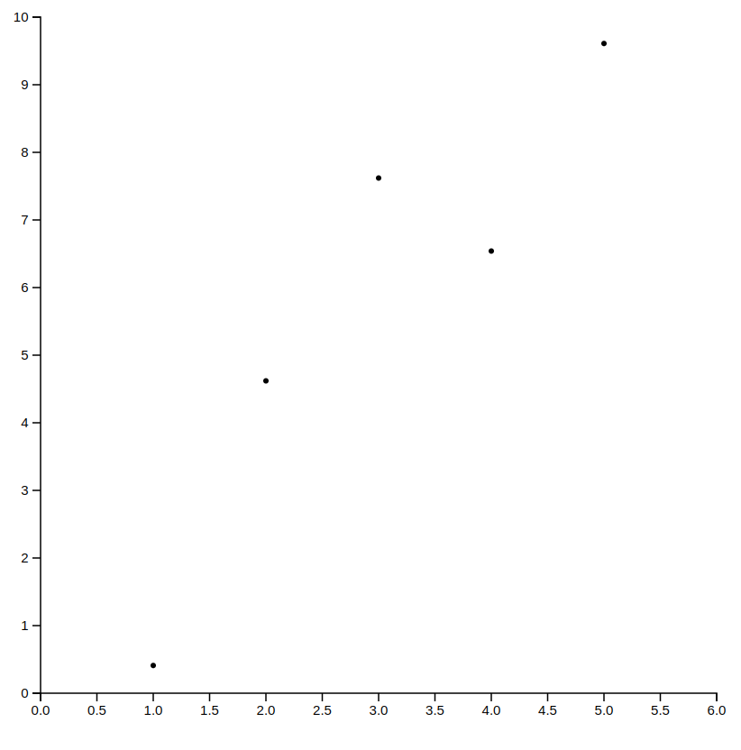
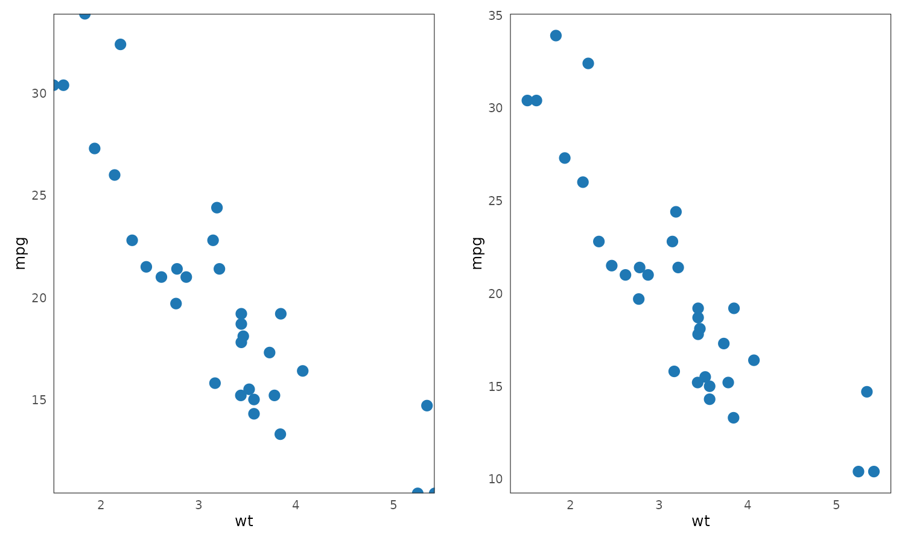
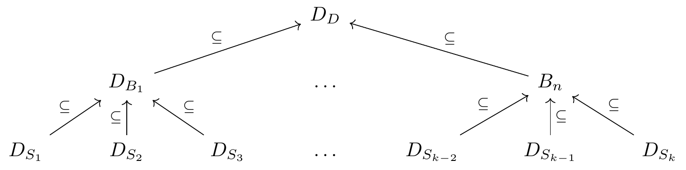
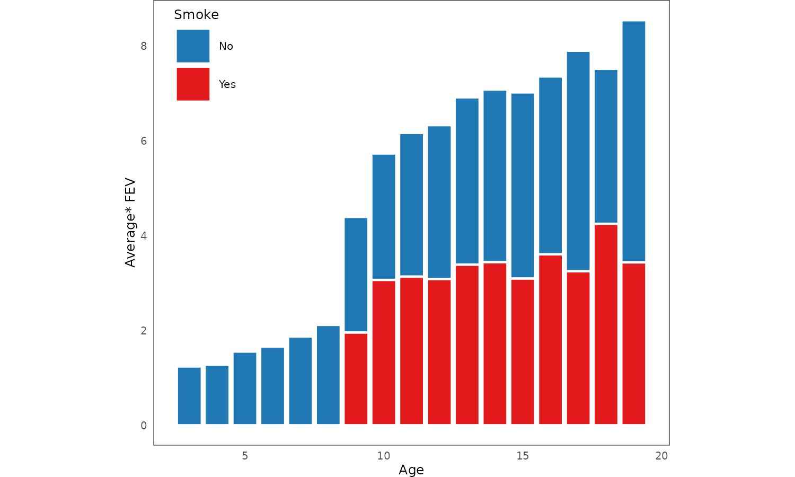
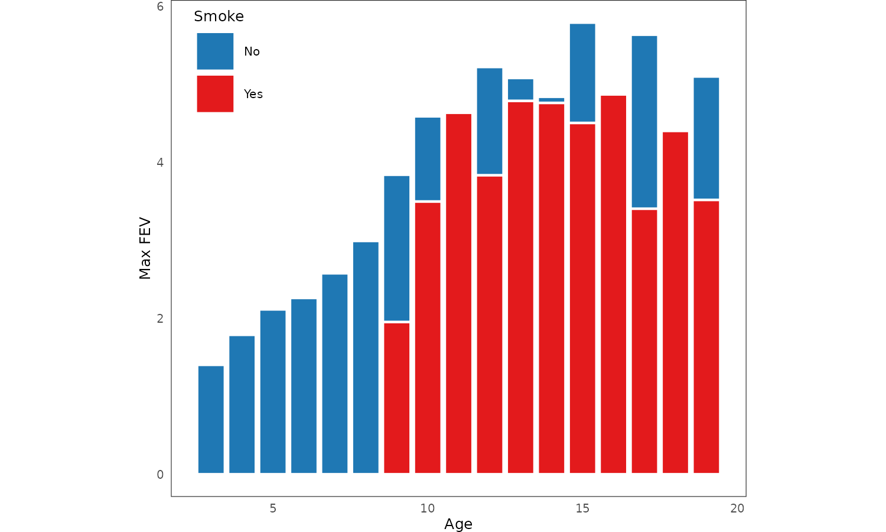
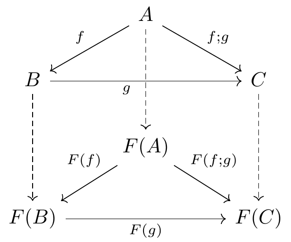

# Abstract

Interactive data visualization has become a staple of modern data presentation. However, creating rich interactive figures still remains a challenging task. Certain useful and sophisticated interactive features are often absent from existing tools, or are supported to only a limited degree. This implementation gap may stem from a subtle yet profound issue: what we can *do* with a visualization is fundamentally determined by what the visualization *is*. Since graphs are not mere images, but instead visual representations of structured information, interactive features need to be congruent with the mathematical properties of the underlying data. While seemingly self-evident, this idea is at tension with the prevailing practices. Many current systems based on the Grammar of Graphics model aim to treat graphics, statistics, and interaction as independent, modular components, which can be freely combined. I argue that this independence model, despite many appealing properties, is fundamentally flawed; visualization components are not independent, but instead deeply interconnected.

In this thesis, I explore this inherent interconnectedness of figure components, the challenges it poses for interactive visualization systems, and propose a simple model based on some fundamental ideas from category theory. Furthermore, I also present `plotscaper`, an R package developed to both refine these theoretical ideas and offer a practical tool for interactive data exploration. My goal is to demonstrate that, in order to design truly consistent and general interactive data visualization systems, we need to ground our thinking in algebraic concepts. 

```{r}
#| echo: false

knitr::opts_chunk$set(
  fig.align = "center"
)

directory <- tempdir()

get_ts_filepath <- function(x) {
  if (endsWith(x, ".ts")) {
    paste0(directory, "/", trimws(gsub("//", "", x)))
  } else {
    tempfile(tmpdir = directory, fileext = ".ts")
  }
}

# Create a TypeScript knitr engine
knitr::knit_engines$set(ts = function(options) {
  code <- paste0(options$code, collapse = "\n")
  out <- ""
  
  if (options$eval) {
    ts_path <- get_ts_filepath(options$code[1]) 
    ts_conn <- file(ts_path)
    writeLines(code, ts_conn)
    
    out <- paste("~/.bun/bin/bun run", ts_path) |> 
      system(intern = TRUE, ignore.stderr = TRUE)
    
    close(ts_conn)
  }
  
  knitr::engine_output(options, code, out)
})

```

```{r}
#| echo: false

pal_paired_1 <- palette.colors(2, "Paired")
pal_paired_3 <- palette.colors(6, "Paired")[c(1, 2, 5, 6, 3, 4)]
pal_light_3 <- pal_paired_3[1:3]
pal_dark_3 <- pal_paired_3[2 * 1:3]

library(ggplot2)

clean_theme <- theme_bw() +
  theme(
  axis.ticks = element_blank(),
  panel.grid = element_blank()
)

theme_set(clean_theme)
options(width = 60)
```

\newcommand\then{⨾}


<!--chapter:end:index.Rmd-->

# Introduction {#introduction}

> It’s written here: "In the Beginning was the Word!" <br>
> Here I stick already! Who can help me? It’s absurd, <br>
> [...] <br>
> The Spirit helps me! I have it now, intact. <br>
> And firmly write: "In the Beginning was the Act!"
>
> Faust, Part I, Johann Wolfgang von Goethe [-@goethe2015]

Humans are intensely visual creatures: roughly 20-30% of our brain is involved in visual processing [@van2003; @sheth2016]. This is reflected in a highly sophisticated and powerful visual processing system [see e.g. @goebel2004; @knudsen2020; for a brief review, see @ware2019], which enables us to perform some very advanced perceptual tasks. For instance, it is well-established that our brain can process certain highly salient visual stimuli in sub-20-millisecond times, outside of conscious attention [@ledoux2000; @ledoux2003], and that we can make extremely rapid, accurate, and parallel visual judgements, through phenomena known as subitizing and pre-attentive processing [@mandler1982; @treisman1985]. These features establish the visual cortex as our most potent information channel, both in terms of bandwidth and throughput.

Importantly, the visual cortex excels at processing not just concrete objects, but also abstract information, a fact that statisticians have been leveraging for a long time. Starting with early charts and maps, data visualization co-evolved alongside mathematical statistics, offering a complementary set of tools and methods [for a review, see @friendly2006 or Section \@ref(brief-history)]. Notably, while mathematical statistics was developed with the primary goal of confirming or disproving hypotheses, data visualization provided an alternative approach: instead of binary decisions, it facilitated unsupervised exploration, "forcing us to notice that which we would never expect to see" [@tukey1977]. This valuable role in revealing the unexpected eventually established data visualization as a respected part of the applied statistician's arsenal.

However, our interaction with the natural world extends beyond sight. When we try to understand some unknown object, we do not just look at it: if we can, we also touch, manipulate, and probe. Within our brain, action and perception are not independent, but are instead interconnected, mutually reinforcing processes [see e.g. @dijkerman2007; @lederman2009]; seeing is believing, but if you can't put your finger on it, how much is that belief really worth? Thus, it was only natural that, eventually, statisticians would start exploiting this relationship between visual perception and action as well. The development of computer graphics and interactive data visualization in the latter part of the twentieth century transformed the idea of "interrogating a chart" from a mere turn of phrase into tangible reality. All of a sudden, it became possible to directly manipulate the visual representation of the data in real time, getting new perspectives and insights at the stroke of a key or click of a button. 

These days, interactive data visualization has become widely popular method of presenting data, however, a number of issues remain unresolved. Specifically, while interactive figures make frequent appearance in online news articles and commercial dashboards, and the data science ecosystem offers a plethora of tools and packages, there are still significant gaps in the utilization and understanding of interactive visualizations. Individual analysts rarely integrate interactive visualizations into their workflows [see e.g. @batch2017], and, despite the fact that many sophisticated interactive features have been developed over the years, their general availability is often fairly limited (see Section \@ref(background)). Finally, a core issue that is yet to be resolved is that of data pipelines: how do we go about transforming raw data into summary statistics that can be displayed by interactive graphics, in an efficient and consistent manner [@wickham2009; @vanderplas2020]?

In this thesis, I explore these gaps and try to identify the underlying issues which make developing interactive data visualization systems challenging. A key argument, echoing Leland Wilkinson's Grammar of Graphics (GoG) model [-@wilkinson2012], is that, although plots are composed of geometric objects, they are not mere pictures. Instead, they contain a large amount of structure, and this becomes particularly noticeable under interaction. I further contend that, while GoG offers a foundational framework for understanding the structure underlying graphics, to be able to fully integrate interaction, the model warrants refinement. To illustrate this point bluntly, I want to raise attention to the discrepancy between the following two quotes:

> "This system cannot produce a meaningless graphic, however. This is a strong claim, vulnerable to a single counter-example. It is a claim based on the formal rules of the system, however, not on the evaluation of specific graphics it may produce."
>
> "Some of the combinations of graphs and statistical methods may be degenerate or bizarre, but there is no moral reason to restrict them."
>
> @wilkinson2012, pp. 15 and 112.

What makes some combinations of graphics and statistics meaningful, while others degenerate or bizarre? I believe that the answer to this question lies at the core of many of the problems with interactive data visualization. Specifically, I argue that, for plots to be well-behaved, there needs to be a special kind of congruence between data, summary statistics, and geometric objects. This is especially true under interaction; what we can *do* with a plot is fundamentally determined by what the plot *is*. To formally describe this congruence between data, statistics, and graphics, I propose a model leveraging some fundamental algebraic structures and concepts from category theory^[Which go beyond those described by @wilkinson2012.].

Finally, to validate and refine these theoretical concepts, I also developed an original open-source interactive data visualization library. Consequently, this thesis also details the design considerations, architecture, and components of this system, along with its application to real-world data. My goal is to demonstrate that many of the theoretical considerations have direct impact on the design characteristics of the system. Ultimately, I content that, to build truly general and efficient interactive data visualization systems, we need to take both the theoretical and practical considerations into account. 

#### Thesis Overview

The thesis is organized as follows. Section \@ref(background) provides a review of the history of interactive data visualization, theoretical considerations regarding interactivity, common interactive features, and broader data visualization theory. Section \@ref(problems) identifies specific challenges in designing interactive data visualization pipelines and introduces the core algebraic theory. Section \@ref(goals), outlines general objectives and goals that guided the development of the interactive data visualization software system created as part of this project. Section \@ref(system) details more specific design considerations, architectural decisions, and key components of the developed software. Section \@ref(applied-example) presents a practical example of exploring a real-world data set using the developed system. Finally, Section \@ref(discussion), discusses lessons learned and potential future research directions.

<!--chapter:end:introduction.Rmd-->

---
output: html_document
editor_options: 
  chunk_output_type: console
---

```{r}
#| echo: false
knitr::opts_chunk$set(
  out.width = "100%",
  out.height = "100%"
) # For LaTeX output to render correctly

include_figure <- function(path) {
  if (knitr::is_html_output()) knitr::include_url(path)
  else knitr::include_graphics(gsub(".html", ".png", path))
}

if (knitr::is_html_output()) {
  knitr::opts_chunk$set(
    out.extra = 'style="border: none;"' # Get rid of iframe borders
  )
}
```

# Background {#background}

## Brief history of interactive data visualization {#brief-history}

Data visualization has a rich and intricate history, and a comprehensive treatment is beyond the scope of the present thesis. Nevertheless, in this section, I will provide a brief overview, with a particular focus on the later developments related to interactive visualization. For a more detailed historical account, readers should refer to @beniger1978, @dix1998, @friendly2006, @friendly2021, or @young2011.

### Static data visualization: From ancient times to the space age {#static-visualization}

The idea of graphically representing abstract information is very old. As one concrete example, a clay tablet recording a land survey during the Old Babylonian period (approximately 1900-1600 BCE) has recently been identified as the earliest visual depiction of the Pythagorean theorem [@mansfield2020]. Other examples of early abstract visualizations include maps of geographic regions and the night sky, and these were also the first to introduce the idea of a system of coordinates [@beniger1978; @friendly2021].

<!-- Citations and references inside figure captions have to be provided externally -->
(ref:mansfielda) [@mansfield2020]

(ref:mansfieldb) [source: Wikimedia Commons, @mansfield2024]

```{r}
#| echo: false
#| fig-cap: "Photos of the tablet Si. 427 which has recently been identified as the earliest depiction of the Pythagorean theorem (ref:mansfielda). Left: the obverse of the tablet depicts a diagram of a field, inscribed with areas. Right: the reverse of the tablet contains a table of numbers, corresponding to the calculation of the areas (ref:mansfieldb)."
knitr::include_graphics("./figures/si427.jpg")
```

For a long time, coordinate systems remained tied to geography and maps, however, with the arrival of the early modern age, this was about to change. In the 16th and 17th centuries, the works of the 9th century algebraist Al-Khwarizmi percolated into Europe, and with them the idea of representing unknown quantities by variables [@kvasz2006]. This idea culminated with Descartes, who introduced the concept of visualizing algebraic relationships as objects in a 2D plane, forging a powerful link between Euclidean geometry and algebra [@friendly2021]. Coordinate systems were thus freed of their connection to geography, and the x- and y-axes of a graph could now be used to represent an arbitrary "space" spanned by two variables.

Descartes' invention of representing abstract relationships as objects in a 2D plane was initially only used to plot mathematical functions. However, it did not take long for people realize that observations real-world observations could be visualized this way as well. A true pioneer in this arena was William Playfair, who popularized visualization as a way of presenting socioeconomic data and invented many types of plots still in use today, such as the barplot, lineplot, and pie chart [@friendly2021]. The collection of data and *statistics* ["things of the state", @etymonline2024] accelerated with the emergence of the early modern nation states, leading to a "golden age" of statistical graphics [@beniger1978; @friendly2021; @young2011]. This period saw the emergence of many other graphical lumnaries, including Étienne-Jules Marey and Charles Joseph Minard [@friendly2021], as well as some ingenious examples of the use of statistical graphics to solve real-world problems, such as John Snow's investigation into the London cholera outbreak [@freedman1999; @friendly2021] and Florence Nightingale's reporting on the unsanitary treatment of wounded British soldiers during the Crimean War [@brasseur2005], both of which lead to a great reduction of preventable deaths. 

Simultaneously, significant developments were also taking place in the field of mathematical statistics. Building upon the foundation laid by mathematical prodigies such as Jakob Bernoulli, Abraham de Moivre, Pierre Simon Laplace, and Carl Friedrich Gauss, early 19th century statistical pioneers such as Adolph Quetelet and Francis Galton began developing statistical techniques for uncovering hidden trends in the newly unearthed treasure trove of socioeconomic data [@fienberg1992; @freedman1999]. In the late 19th and early 20th century, these initial efforts were greatly advanced by the theoretical work of figures such as Karl Pearson, Ronald A. Fisher, Jerzy Neyman, and Harold Jeffreys, who established statistics as a discipline in its own right and facilitated its dissemination throughout many scientific fields [@fienberg1992].

As mathematical statistics gained prominence in the early 20th century, data visualization declined. Perceived as less rigorous than "serious" statistical analysis, it got relegated to an auxiliary position, ushering in "dark age" of statistical graphics [@friendly2006; @young2011]. This development may have been partly driven by the early frequentist statisticians' aspiration to establish statistics as a foundation for determining objective truths about the world and society, motivated by personal socio-political goals [see @clayton2021]. Be it as it may, while statistical graphics also did get popularized and entered the mainstream during this time, only a few interesting developments took place [@friendly2021].      

However, beginning in the late 1950's, a series of developments took place which would restore the prominence of data visualization and make it more widely accessible than ever. Firstly, on the theoretical front, the work of certain academic heavy-weights greatly elevated data visualization and its prestige. Particularly, John Tukey [-@tukey1962; -@tukey1977] fervently championed exploratory data analysis and placed data visualization in its centre. Around the same time, Jacques Bertin published his famous *Sémiologie graphique* [-@bertin1967], which was one of the first works to attempt to lay out a comprehensive system of visual encodings and scales. Secondly, at the more applied level, the development of the personal computer [see e.g. @abbate1999] and high-level programming languages such as FORTRAN in 1954 [@backus1978], made the process of rendering production-grade figures easier and more accessible than ever before. Combined, these developments fueled a surge in the use and dissemination of data visualizations.  

As the millennium drew to a close, the theoretical foundations of static data visualization were solidified by a number of other academics. First, significant contributions were made by William Cleveland, who laid out important principles for scientific data visualization many of which are taken for granted today [@cleveland1985; @cleveland1993]. Of note, his seminal study on the impact of the choice of visual encodings on statistical judgements remains widely cited today [@cleveland1984]. Similarly, Edward Tufte introduced essential principles for the effective visualization design, coining terms such as *chartjunk* and *data-to-ink ratio* [@tufte2001]. Finally, Leland Wilkinson's groundbreaking Grammar of Graphics [-@wilkinson2012] introduced a comprehensive system for designing charts based on simple algebraic rules, influencing nearly every subsequent software package and research endeavor in the field of visualization.

### Early interactive data visualization: By statisticians for statisticians {#early-interactive}

Compared to static data visualization, interactive data visualization is a far more recent development. Consequently, less information is available about its history. In the short time period since its inception, software has evolved rapidly, and, furthermore, much of it has been under proprietary licenses, confounding detailed historical analyses. Nevertheless, the available information still offers some interesting insights.

After the computer-driven revolution of static data visualization in the 1950's (described in Section \@ref(static-visualization)), interactive data visualization would not be left far behind. The very early interactive tools tended to be developed for niche, specialized tasks. For instance, @fowlkes1969 designed a system which allowed the users to view probability distributions under different configurations of parameters and transformations, and @kruskal1964 created a tool for visualizing multidimensional scaling. 

(ref:fisherkeller) [right, @fisherkeller1974]

(ref:asa) [ASA Statistical Graphics Video Library](https://community.amstat.org/jointscsg-section/media/videos)

```{r}
#| echo: false
#| fig-cap: "John Tukey showcasing the PRIM-9 system (left), with an example of a projected scatterplot (ref:fisherkeller). Screenshots were taken from a video available at the (ref:asa)."
knitr::include_graphics("./figures/prim9.png")
```

However, researchers soon recognized the potential of interactive data visualization as a general-purpose tool for data exploration. The first example of such general-purpose system was PRIM-9 [@fisherkeller1974]. PRIM-9 allowed for exploration of multivariate data via interactive features such as projection, rotation, masking, and filtering. Following the success of PRIM-9, the late 1980's saw the emergence of a new generation of tools which provided an even wider range of functionalities. Systems like MacSpin [@donoho1988], Data Desk [@velleman1989], XLISP-STAT [@tierney1990], and XGobi [@swayne1998] introduced features such as interactive scaling, rotation, linked views, and grand tours (for a glimpse into the history, an excellent series of video-documentaries is available at [ASA Statistical Graphics Video Library](https://community.amstat.org/jointscsg-section/media/videos)).

(ref:tierney) [figure reproduced from @tierney1990]

```{r xlisp-stat}
#| echo: false
#| fig-cap: "Example of interactive control of histogram highlighting in XLISP-STAT. Note that, unlike in many current data visualization systems, aggregation plots were sensitive to data order (not commutative). This non-commutative behavior meant that, for instance, a highlighted segment could appear in the middle of a bar (as seen in the figure above) or multiple non-adjacent highlighted cases might appear as 'stripes' (ref:tierney)."


```

#### Open-source Statistical Computing

The proliferation of open-source general-purpose statistical computing software such as S and R further democratized the access to interactive data visualization [see also @leeuw2004]. Building on XGobi's foundation, GGobi [@swayne2003], expanded upon on XGobi and provided an integration layer for R. Other tools like MANET [@unwin1996] and Mondrian [@theus2002] introduced sophisticated features such as selection sequences, allowing the users to combine a series of linked selections via logical operators [see also @unwin2006]. Further, iPlots [@urbanek2003] implemented a general framework for interactive plotting in R, allowing not only for one-shot rendering of interactive figures but also direct programmatic manipulation from R. This package was later expanded expanded for big data capabilities in iPlots eXtreme [@urbanek2011]. Finally, the `cranvas` package [@xie2014] introduced a set of reactive programming primitives that could be used for building the infrastructure underlying interactive graphics directly in R, within the model-view-controller (MVC) framework.   

(ref:theus) [@theus2002]

```{r}
#| echo: false
#| fig-align: "center"
#| fig-cap: "Examples of interactive features in Mondrian (ref:theus): selection operators (left) and mosaic plot with querying (right)."

```

Alongside the more general interactive data visualization frameworks discussed above, there were also many other specialized packages developed. These tended to be designed around specific statistical techniques and models. For instance, `KLIMT` was developed for interactive visualization of classification and regression trees [@urbanek2001; @urbanek2002]. Similarly, packages like `tourr` [@wickham2011], `spinifex` [@spyrison2020], `liminal` [@lee2021; @lee2022a] provided tools for exploring large multivariate data sets via grand tour projections [see @cook1995]. 

There is also one relatively recent milestone in the history of interactive visualization in R which is important to discuss: Shiny [@shiny2024; see also @sievert2020; @wickham2021]. Shiny is general framework for developing interactive web apps in R, which relies a client-server MVC-like architecture, whereby the user defines an R-based server and a web-based UI/controller layer (which is scaffolded in R, but transpiled to HTML, CSS, and JavaScript). Communication between the client and the server is bidirectional and handled via WebSockets [@mdn2024g; facilitated through the `httpuv` package @cheng2024]. The primary advantage of Shiny is that it gives less technical R users the ability to easily create rich interactive web apps, including interactive data visualizations (by re-rendering static plots). The one major downside of Shiny is that, since every interactive event has to do a round-trip from the client to the R server and back again, high-frequency interactions (such as brushing scatterplot points) can become prohibitively slow, particularly at larger data volumes [although there are ways to mitigate this, @sievert2020].   

Finally, it is important to mention that, over time, there seems to have been a trend towards more of the specialized tools within the R community, and fewer of the general, high-level frameworks [although there are some notable exceptions, such as the `loon` package, @waddell2023]. Currently, it seems that R users typically encounter interactive visualizations in the context of Shiny [@shiny2024] dashboards, or through R wrappers of interactive data visualization libraries ported over from the JavaScript ecosystem (see Section \@ref(web-based)).

#### Common features and limitations of early interactive systems

A common thread among the early interactive data visualization systems is that they were designed by statisticians with primary focus on data exploration. High-level analytic features such as linked views, rotation/projection, and interactive manipulation of model parameters made frequent appearance. While these features were powerful, they also contributed to a steeper learning curve, potentially limiting adoption by users without a strong data analytic background. Furthermore, many of these early tools were typically standalone applications, with only later packages like GGobi and iplots offering integration with other data analysis software and languages. Finally, they often offered only limited customization options and this made them less suitable for data presentation.

### Interactive data visualization and the internet: Web-based interactivity {#web-based}

The end of the millennium marked the arrival of a new class of technologies which impacted interactive data visualization just as much as almost every other field of human endeavor. The rise of the internet in the mid 1990's made it possible to create interactive applications that could be accessed by anyone, from anywhere. This was aided by the dissemination of robust and standardized web browsers, as well as the development of JavaScript as a high-level programming language for the web  [for a tour of the language's history, see e.g. @wirfs-brock2020]. Soon, interactive visualizations became just one of many emerging technologies within the burgeoning web ecosystem. 

Early web-based interactive data visualization systems tended to rely on external plugins. Examples of these include Prefuse [@heer2005] and Flare [developed around 2008, @flare2020], which leveraged the Java runtime and Adobe Flash Player, respectively. However, as browser technologies advanced, particularly as JavaScript's performance improved thanks to advances in just-in-time compilation [JIT, see e.g. @clark2017; @dao2020], it became possible to create complex interactive experiences directly in the browser. This led to the emergence of several popular web-native interactive data visualization systems in the early 2010s, many of which remain widely used today. 

#### D3

D3.js [@bostock2022] is one of the earliest and most influential web-based visualization systems. As a general, low-level framework for visualizing data, D3 provides of a suite of specialized JavaScript modules for various aspects of the data visualization workflow, including data parsing, transformation, scaling, and DOM interaction. 

For instance, here's how to create a basic scatterplot in D3:

```{js}
#| eval: false
import * as d3 from "d3";

const plot = document.querySelector<HTMLDivElement>("#d3-plot")!;
const data = [
  { x: 1, y: 0.41 },
  { x: 2, y: 4.62 },
  { x: 3, y: 7.62 },
  { x: 4, y: 6.54 },
  { x: 5, y: 9.61 },
];

const margin = { top: 10, right: 30, bottom: 30, left: 60 };
const width = parseFloat(plot.style.width);
const height = parseFloat(plot.style.height);

// Create a SVG element, resize it, and append it to #d3-plot
const svg = d3
  .select("#d3-plot")
  .append("svg")
  .attr("width", width + margin.left + margin.right)
  .attr("height", height + margin.top + margin.bottom)
  .append("g")
  .attr("transform", 
        "translate(" + margin.left + "," + margin.top + ")");

// Create x and y scales and append them to
const scaleX = d3.scaleLinear().domain([0, 6]).range([0, width]);
const scaleY = d3.scaleLinear().domain([10, 0]).range([0, height]);
svg
  .append("g")
  .attr("transform", "translate(0," + height + ")")
  .call(d3.axisBottom(scaleX));
svg.append("g").call(d3.axisLeft(scaleY));

// Add points
svg
  .append("g")
  .selectAll("dot")
  .data(data)
  .enter()
  .append("circle")
  .attr("cx", (d) => scaleX(d.x))
  .attr("cy", (d) => scaleY(d.y))
  .attr("r", 2);
```

(ref:holtz) [@holtz2022b]

```{r d3-scatterplot}
#| echo: false
#| fig-cap: "Example of a scatterplot built with D3.js. The code was taken from D3 Graph Gallery (ref:holtz) and adjusted to use ES6 syntax and slightly more informative variable names/comments."

```

As you can see from Figure \@ref(fig:d3-scatterplot) and the corresponding code, D3 is a fairly low-level framework. Compared to typical high-level plotting functionalities such as those provided by base R or `ggplot2` [@r2024; @wickham2016], the user has to handle many low-level details such as scaling and appending of primitives explicitly. This is also the case with interaction. While D3 does provide some methods for handling reactive DOM events, it does not itself provide a system for dispatching and coordinating these events - instead, it delegates this responsibility to the user, and encourages the use of reactive Web frameworks such as React [@react2024], Vue [@vue2024], or Svelte [@svelte2024]. 

Finally, D3.js visualizations are rendered as Scalable Vector Graphics (SVG) by default. This ensures lossless scaling but may impact rendering performance at high data volumes. While various unofficial alternative rendering engines based on the HTML 5 Canvas element or WebGL, do exist, there are no official libraries with such functionalities as of this date.

#### Plotly and Highcharts

Building upon the low-level infrastructure that D3 provides, many packages such as Plotly.js [@plotly2022] and Highcharts [@highcharts2024] provide high-level abstractions which make the process of building interactive figures easier for the average user. Unlike D3 which provides low-level utilities such as data transformations, scales, and geometric objects, these packages provide a simple declarative framework for rendering entire plots using a static [JSON] schema.

Here's how we can render the same scatterplot in Plotly, using the R `plotly` package [@sievert2020]:

```{r}
#| eval: false
library(plotly)
data <- data.frame(x = 1:5, y = c(0.41, 4.62, 7.62, 6.54, 9.61))
plot_ly(data, x = ~x, y = ~y)
```

```{r}
#| echo: false
#| eval: false

urls <- list.files("./figures", "scatterplot.html", full.names = TRUE)
outs <- gsub(".html", ".png", urls)

webshot2::webshot(urls, outs, delay = 30)
```

```{r plotly-scatterplot}
#| echo: false
#| fig-cap: "Example of a scatterplot with `plotly`."
include_figure("./figures/plotly-scatterplot.html")
```

Here's the correponding code in JavaScript:

```{js}
#| eval: false
const data = [{
  x: [1, 2, 3, 4, 5],
  y: [0.41, 4.62, 7.62, 6.54, 9.61],
  mode: 'markers',
  type: 'scatter'
}];

Plotly.newPlot('app', data);
```

Clearly, compared to the D3 code used to create Figure \@ref(fig:d3-scatterplot), the code for creating Figure \@ref(fig:plotly-scatterplot) is much terser. Many details, such as the axis limits and margins, point size and colour, gridlines, and widgets, are handled implicitly, via default values and automatic inference. Also, note that the figure provides some interactive features by default, such as zooming, panning, and tooltip on hover. Reactivity is handled automatically using systems built on the native DOM Event Target interface [@mdn2024a].

Highcharts provides a similar JSON-based interface for specifying plots. While perhaps slightly more flexible than Plotly, it also requires more verbose specifications. Because of the similarity, I will not provide a separate example here [interested reader should look up the package's website, @highcharts2024].

Finally, like D3, both plotly.js and Highcharts also render the graphics in SVG by default. However, unlike D3, they both also provide alternative rendering engines based on WebGL [@highschartsboost2022; @plotly2024b]. This makes them more ergonomic for use with large data sets. 

#### Vega and Vega-Lite

Vega [@satyanarayan2015; @vega2024a] is another popular interactive data visualization package. Like Plotly and Highcharts, Vega is also partially built upon the foundation of D3 and uses JSON schema for plot specification. However, Vega is more low-level and implements a lot of custom functionality. This allows it to offer more fine-grained customization of graphics and interactive behavior, leading to greater flexibility.

However, this added flexibility does come at a cost. Compared to the high-level frameworks like Plotly and Highcharts, Vega is significantly more verbose. For instance, creating a scatterplot matrix with linked selection in Vega requires over 300 lines of JSON specification, not including the data and using default formatting [@vega2024b].

Vega-Lite [@satyanarayan2015] attempts to remedy this complexity by providing a high-level interface to Vega. Here's how we can define a scatterplot with zooming, panning, and tooltip on hover in Vega-Lite:

```{r}
#| eval: false

library(vegawidget)

plot_spec <- list(
    `$schema` = vega_schema(),
    width = 500,
    height = 300,
    data = list(values = data),
    mark = list(type = "point", tooltip = TRUE),
    encoding = list(
      x = list(field = "x", type = "quantitative"),
      y = list(field = "y", type = "quantitative")
    ),
    params = list(list(name = "grid", 
                       select = "interval", 
                       bind = "scales"))
  )

plot_spec |> vegawidget()
```

```{r vegalite-scatterplot}
#| echo: false
#| fig-cap: "Example of a scatterplot built with `vegalite`."
# saveWidget(vegawidget(w), "./figures/vegalite-scatterplot.html")
include_figure("./figures/vegalite-scatterplot.html")
```

Just for clarity, the R code above corresponds to the following declarative JSON schema:

```{js}
#| eval: false
{
  $schema: "https://vega.github.io/schema/vega-lite/v5.json",
  width: 500,
  height: 300,
  data: { values: [
    { x: 1, y: 0.41 },
    { x: 2, y: 4.62 },
    { x: 3, y: 7.62 },
    { x: 4, y: 6.54 },
    { x: 5, y: 9.61 }]
  },
  mark: {"type": "point", "tooltip": true},
  encoding: {
    x: { field: "x", type: "quantitative" },
    y: { field: "y", type: "quantitative" }
  },
  params: [{ name: "grid", select: "interval", bind: "scales" }]
};
```

Note that the zooming and panning capability is provided by the `params` property, which declaratively specifies a list of plot parameters that can be modified by interaction [see @vegalite2024a]. In the case above, the specification creates a two-way binding between plot scales and mouse selection events [@vegalite2024b].   

#### Common features and limitations of web-based interactive systems

In general, these contemporary web-based interactive data visualization systems offer a great deal of flexibility, making them well-suited to modern data presentation. However, all of this expressiveness does seem to come at a cost. Compared to the earlier statistical graphics systems, described in Section \@ref(early-interactive), many of the more advanced features that used to be common are either missing or require a significant effort to implement, such that they are only accessible to expert users. This is evidenced by their infrequent appearance in documentation and example gallery pages. 

For instance, the [R Graph Gallery entry on Interactive Charts](https://r-graph-gallery.com/interactive-charts.html) [@holtz2022] features multiple interactive figures implemented in the JavaScript libraries described above. However, all of these examples show only surface-level, single-plot interactive features such zooming, panning, hovering, 3D rotation, and node repositioning. The [Plotly Dash documentation page on Interactive Visualizations](https://dash.plotly.com/interactive-graphing) [@plotly2022] does feature two examples of simple linked cross-filtering, however, the vast majority of visualizations in the [Plotly R Open Source Graphing Library documentation page](https://plotly.com/r/) [@plotly2022] show examples only surface-level interactivity. Similarly, [VegaLite Gallery pages on Interactive Charts](https://vega.github.io/vega-lite/examples/#interactive-charts) [@vegalite2022] feature many examples, however, only a limited number of examples show linked or parametric interactivity (see e.g. [Interactive Multiview Displays](https://vega.github.io/vega-lite/examples/#interactive-multi-view-displays)). Finally, the [Highcharter Showcase Page ](https://jkunst.com/highcharter/articles/showcase.html) [@kunst2022] does not feature any examples of linking.

Even when more advanced features such as linking and parametric manipulation are supported, they are often limited in some way. For instance, take the following quote from the website of Crosstalk, a package designed to enable linking between web-based interactive widgets created with the `htmlwidgets` R package [@htmlwidgets2021] or Shiny [@shiny2024]:

> "Crosstalk currently only works for linked brushing and filtering of views that show individual data points, not aggregate or summary views (where “observations” is defined as a single row in a data frame). For example, histograms are not supported since each bar represents multiple data points; but scatter plot points each represent a single data point, so they are supported."
>
> @crosstalk2025

Of course, with enough effort and programming skill, these web-based visualization systems can still be used to create rich interactive figures with arbitrarily sophisticated features. However, doing so often requires stepping down a level of abstraction and dealing with low-level language primitives, defeating the purpose of using these high-level libraries in the first place. It also creates a barrier to entry for casual users [@keller2024], which may in fact explain why interactive visualizations are nowadays primarily used for data presentation, not data exploration [@batch2017]. Within these frameworks, creating rich interactive visualizations may be a task better suited to dedicated developers working inside large organizations, rather than individual researchers or analysts.

## What even is interactive data visualization? {#what-is-interactive-visualization}

> If it looks like a duck, swims like a duck, and quacks like a duck, then it probably is a duck. 
>
> [...] The irony is that while the phrase is often cited as proof of abductive reasoning, it is not proof, as the mechanical duck is still not a living duck
>
> [Duck Test](https://en.wikipedia.org/wiki/Duck_test) entry, [@wikipedia2022] 

In the previous section (Section \@ref(brief-history)), I provided an overview of the history and present state of interactive data visualization, discussing a number of features and systems. However, while doing so, I avoided one crucial question: what constitutes an interactive data visualization? 

Surprisingly, despite the widespread popularity of interactive data visualizations, there is no universally agreed-upon definition of interactivity [@vanderplas2020]. Within the data visualization literature, the terms "interactive" and "interaction" are rarely explicitly defined. And even when they are, the definitions are often incongruent or even contradictory [see e.g. @dimara2019; @elmqvist2011; @pike2009]. Finally, similar ambiguity extends to other terms related concepts, such as the "dashboard" [@sarikaya2018].     

This lack of a clear consensus makes the task of discussing interactive data visualization difficult. Ignoring the issue could lead to confusion, while a truly comprehensive dive into the terminology surrounding interactive data visualization could become excessively dense, as evidenced by the existence of entire research papers dedicated to the topic [see e.g. @dimara2019; @elmqvist2011]. To address this issue, this section aims to provide a concise overview of how interactivity has been conceptualized in the literature. The goal is to establish a clear framework for understanding "interactive" and "interaction" within the context of this thesis.

### Interactive vs. interacting with {#interactive-interacting}

First, the term "visualization" in "interactive data visualization" can be interpreted in two different ways:

1. As a noun: a concrete chart or figure
2. As a nominalized verb: the process or practice of interacting with such a figure

In the data visualization literature, both meanings are frequently employed, leading to a significant amount of conceptual ambiguity [see @dimara2019; @pike2009; @yi2007]. Some researchers concentrate on the mathematical and computational aspects of interactive data visualization, discussing specific systems and software implementations [see e.g. @buja1996; @kelleher2015; @leman2013; @wills2008]. Others focus on the cognitive or human-computer interaction (HCI) aspects, exploring the impact different interactive techniques have on the users' ability to derive insights from the data [see e.g. @brehmer2013; @dimara2019; @dix1998; @pike2009; @quadri2021; @yi2007]. The problem is further exacerbated by the highly interdisciplinary nature of the field, spanning statistics, computer science, applied mathematics, business analytics, HCI, and cognitive psychology [see @brehmer2013; @dimara2019]. Consequently, literature search of the term "interactive data visualization" can yield a broad set of results, many of which may be only tangentially related.

To address this conceptual ambiguity, I believe it is necessary to clearly define key terms. Throughout thesis, the term *"interactive data visualization"* to primarily denote *concrete charts or figures*. When referring to the *process or practice*, I will attempt to employ more active phrasing, such as *"interacting with a visualization"* or *"user's interaction with a visualization"*. While there may still be a few places where the term "visualization" is used in the nominalized verb form, the intended meaning should be unambiguously inferable from the context.

### Interactive *enough*? {#interactive-enough}

However, even when we use the term "interactive data visualization" to refer to concrete charts or figures, the meaning still remains fairly ambiguous. When can we call a figure interactive? What features does it have to contain? While these questions may seem simple, it is hard to find consensus about them in the data visualization literature [@vanderplas2020]. The criteria for what makes a figure "interactive" vary a lot from researcher to researcher, such that the same figure may be considered interactive by some but not by others. 

Some researchers ascribe to a broad definition of interactive data visualization, such that any figure which can be dynamically manipulated by the user may be considered interactive [@brodbeck2009]. For others, the important factor is the speed of the computer's responses to user input, with faster updates translating to greater interactivity [@becker1987; @buja1996; see also @wilhelm2003]. Some of these researchers also differentiate between "interactive" and "dynamic" manipulation, where interactive manipulation involves discrete actions such as pressing a button or selecting an item from a drop-down menu, whereas dynamic manipulation involves continuous actions, like moving a slider or clicking-and-dragging [@rheingans2002; @jankun2007; see also @dimara2019]. 

However, for many other researchers, interactivity is a much narrower concept, hinging on high-level analytic features that enable efficient exploration of the data. These features include the ability to generate different views of the data (by e.g. zooming, panning, sorting, and filtering), and the reactive propagation of changes between connected or "linked" parts of the figure [@kehrer2012; @buja1996; @keim2002; @unwin1999; @chen2008]. Notably, these are also the features which enable the famous visual information-seeking mantra: "overview first, zoom and filter, then details-on-demand" [@shneiderman2003]. A similar idea also appears in visual analytics research, in the distinction between "surface-level" (or "low-level") and "parametric" (or "high-level") interactions, where surface-level interactions manipulate attributes of the visual domain only (e.g. zooming and panning), whereas parametric interactions manipulate parameters of some underlying mathematical model or algorithm [@leman2013; @self2018; @pike2009]. Ultimately, for researchers ascribing to this narrower view of interactivity, the presence of an interactive feature does not necessarily justify calling a figure "interactive", if it does not promote the acquisition of statistical insights above and beyond those provided by a static figure. For instance, while the ability to pick the colour of scatterplot points via an interactive palette widget may allow us to produce a more aesthetically pleasing result, it does not, generally, generate any new analytical understanding.

Table \@ref(tab:definitions) provides a concise overview of the various perspectives on interactivity discussed above. It is important to note that this table is meant to serve as a reference point for subsequent discussions within the text and is not intended to provide an exhaustive review. For more comprehensive taxonomies of interactive visualization systems and features, see e.g. @dimara2019, @yi2007.

```{r definitions}
#| echo: false

library(kableExtra)

tab <- data.frame(
  type = c("User interaction", 
           "Real-time updates", 
           "Plot- and data-space manipulation",
           "Linked views",
           "Parametric updates"),
  details = c("The user can interactively manipulate the figure in some way",
              "The user's interactions propagate into the visualization with little to no lag",
              'The user can interactively explore different parts of the data set by doing actions which effectively amount to "subsetting" rows of the data (e.g. zooming, panning, and filtering)',
              r"(The user's interactions propagate across multiple plots (e.g. linked highlighting))",
              "The user can manipulate the parameters of some underlying mathematical model or algorithm (e.g. histogram bins, grand tour projections, etc...)") #,
  # papers = c("@brodbeck2009", 
  #            "@becker1987, @buja1996, @jankun2007, and @rheingans2002", 
  #            "@buja1996, @keim2002, @shneiderman2003, and @unwin1999", 
  #            "@buja1996, @keim2002, @kehrer2012, @unwin1999, @theus2008, @wilhelm2008, @wills2008", 
  #            "@leman2013, @pike2009"
  #             )
)

colnames(tab) <- c("Name", "Details") #, "Selected references")

tab |>
  knitr::kable(caption = "Summary of the perspectives on interactivity",
                booktabs = TRUE, escape = FALSE) |>
  kableExtra::kable_styling(full_width = TRUE)
```

### Complexity of interactive features {#complexity-of-features}

The way we define interactivity is not just a matter of taste or preference: it has a significant impact on the complexity and feasibility of our systems. As we will see in Section \@ref(common-features), some simple features are fairly easy to implement, requiring just a thin interactive layer over a static data visualization system, whereas others come with a significant overhead, requiring an entirely different framework than static visualization.

To illustrate the point with a particularly blunt example, many programming languages support a read-evaluate-print loop (REPL). This allows interactive code execution from the command line: the user inputs code, the interpreter evaluates it, outputs results, and waits for more input. If the language supports plotting, using the REPL to generate plots could be interpreted as an exercise in interactive data visualization, since the user can interact with the command line to modify visual output, and, if they type fast enough, updates can appear almost instantly (thus satisfying the user interaction and real-time update definitions of interactivity, see Table \@ref(tab:definitions)). This interpretation would turn many programming languages into "interactive data visualization systems".

However, I contend that this interpretation stretches the contemporary understanding of interactivity. While the command line was historically considered a highly interactive user interface [see e.g. @foley1990; @howard1995], advancements in processor speeds and the proliferation of highly-responsive graphical user interfaces (GUIs) have shifted user expectations. These days, interactivity tends to be associated with direct manipulation of visual elements and immediate feedback [@dimara2019; @urbanek2011; @vanderplas2020]. Consequently, a REPL is unlikely to be considered an interactive data visualization platform by most contemporary users.

But even with figures that are manipulated directly, there still are considerable differences in what different features imply for implementation requirements. Some features, like changing color or opacity of points in a scatterplot affect only the visual attributes of the plot and not the underlying data representation. This makes them simple to implement as they do not require any specialized data structures or complex computations, and the primary cost lies in re-rendering the visualization.

In contrast, some interactive features require a lot more infrastructure. For instance, filtering, linked highlighting, or parametric interaction require specialized data structures and algorithms beyond those that would be required in static plots. This is because, each time the user engages in an interaction, entirely new summaries of the underlying data may need to be computed. 

To give a concrete example, when a user selects several points in a linked scatterplot (see Section \@ref(linked-selection)), we first have to find the ids of all the selected cases, recompute the statistics underlying all other linked plots (such as counts/sums in barplots or histograms), train all of the relevant scales, and only then can we re-render the figure. Likewise, when interactively manipulating a histogram's binwidth, we need to recompute the number of cases in each bin whenever the binwidth changes. To maintain the illusion of smooth, "continuous" interaction [@dimara2019], these computations need to happen fast, and as such, computational efficiency becomes imperative at high data volumes.

### Working definition

As discussed in previous sections, the definition "interactive data visualization" varies across fields and researchers. Moreover, when building interactive data visualization systems, different definitions imply varying levels of implementation complexity. Thus, we need to establish clear criteria for our specific definition. 

Data visualization can be broadly categorized into two primary modes: presentation and exploration. While both modes share a bulk of common techniques, each comes with a different set of goals and challenges [@kosara2016]. Data presentation starts from the assumption that we have derived most of the important insights from our data already, and the goal is now to communicate these insights clearly and make an impactful and lasting impression [@kosara2016]. In contrast, data exploration begins from a position of incomplete knowledge - we accept that there are facts about our data we might not be aware of. Thus, when we explore data with visualizations, the goal is to help us see what we might otherwise miss or might not even think to look for [@tukey1977; @unwin2018].    

However, it is not always the case that more complex visuals necessarily translate to better statistical insights. In static visualization, it is a well-established that plots can include seemingly sophisticated features which do not promote the acquisition of statistical insights in any way [@cairo2014; @cairo2019; @gelman2013; @tufte2001]. Similarly, adding interactivity to a visualization does not always improve its statistical legibility [see e.g. @abukhodair2013; @franconeri2021]. 

I propose to treat interactive features the same way we treat visual features in static visualization. Specifically, I propose the following working definition:

> When building interactive data visualization systems, we should prioritize interactive features which promote statistical understanding.

If we accept this proposition, then several important consequences follow. First, we must favor high-level, data-dependent, parametric interactions over the purely graphical ones. That is not to say that purely graphical interactive features cannot useful. For instance, in the case of overplotting, changing the size or alpha of points in a scatterplot can help us see features that would otherwise remain hidden. Nevertheless, I argue that the ability to see entirely new representations of the data is what makes some interactive data visualizations systems particularly powerful. The interactive features that enable this, such as linked highlighting and parameter manipulation, go beyond aesthetics, and empower the users to explore the data in a much more dynamic way, compared to static graphics.

### Common interactive features {#common-features}

This section describes several common types of interactive features that tend to frequently appear in general interactive data visualization systems. It is only meant as an overview [for more comprehensive taxonomies of interactive features, see @dimara2019; @unwin2006; @yi2007]. For each feature, I highlight its core properties, common use cases, and implementation requirements. 

#### Changing size and opacity

One of the simplest and most widely-implemented interactive features is the ability to adjust the size and opacity of geometric objects. This feature gives the user the ability to dynamically shrink or grow objects and make semi-transparent, fully transparent, or opaque. 

The ability to shrink objects or make them semi-transparent can be particularly useful at high data volumes, since this can reveal trends that may be otherwise hidden due to overplotting. For example, in scatterplots, shrinking points and making them semi-transparent makes it possible to identify high-density regions and can in fact provide an approximation to a 2D kernel density plot [see e.g. @dang2010]. The same applies to all other types of plots where the where objects or glyphs may be plotted on top of each other at high densities, such as parallel coordinate plots [@theus2008].

This feature usually fairly easy to implement, since it involves manipulating visual attributes only. Specifically, in many interactive systems, size and alpha multipliers are independent parameters of the visual representation, which do not depend on the underlying data in any way. In other words, when we manipulate size or opacity of geometric objects in our plots, we do not need to worry about what data these objects represent. Compared to other interactive features, this makes it relatively simple to add this functionality to an existing static visualization system [see @bracsoveanu2017].

#### Zooming and panning

Another two significantly related interactive features are zooming and panning. They are often used in tandem, and both involve interactive manipulation of scale limits. For this reason, I discuss them here simultaneously, in a single subsection.

Zooming, depicted in Figure \@ref(fig:zooming), allows the user to magnify into a specific region of a plot. A common approach involves creating a rectangular selection and the axis scales are then automatically adjusted to match this region, however, other techniques do exist, for instance a symmetric zoom centered on a point using a mouse wheel. Zooming is useful because it allows the user to get a better sense of the trend within the magnified region, and discover patterns that may be otherwise obscured due to overplotting or improper aspect ratio [see e.g. @buja1996; @dix1998; @unwin1999; @theus2008; @yi2007]. 

```{r zooming}
#| echo: false
#| fig-cap: "Zooming involves shrinking the axis limits to obtain a more detailed view of the data. Typically, the user selects a rectangular region of the plot (left) and the plot scales are then adjusted so that the region fills up the entire plot area (right). Notice the change in the axis limits."
knitr::include_graphics("./figures/zooming.png")
```

After zooming, it is useful to retain the ability to navigate the wider plot region while preserving the current zoom level and aspect ratio. Panning addresses this need. By performing some action, typically right-click and drag, the user can move the center of the zoomed-in region around, exploring different areas of the plot. 

```{r panning}
#| echo: false
#| fig-cap: "Panning involves moving the axis limits while retaining the same zoom level and axis ratio. After zooming into a rectangular region (top row), the user can around the plot region, usually by clicking and dragging (bottom row)."
knitr::include_graphics("./figures/panning.png")
```

Zooming and panning can be implemented by manipulating scales only, and this also makes them generally fairly straightforward to implement, similar to changing size and opacity. However, there are a few issues to consider. First, whereas continuous axes can be be zoomed and/or panned by simply modifying the axis limits, zooming discrete axes requires a bit more nuance [see e.g. @wilkinson2012]. Second, it is often desirable to give the user the ability to zoom-in multiple levels deep, and this makes maintaining a reversible history of previous zoom-states essential [@unwin1999]. Third, at times, it can be useful to link scale updates across multiple plots, such that, for example, zooming or panning a plot in a scatterplot matrix produces the same actions in other plots with the same variable on one of the axes. Finally, an advanced feature that can be also quite useful is semantic or logical zooming [@keim2002; @unwin1999; @yi2007]. This technique goes beyond magnifying objects; it also increases the level of detail the objects display as the user zooms in. Semantic zooming can be particularly powerful when combined with hierarchical data such as geographic information, however, it also introduces additional complexity, since the effects of the zoom action propagate beyond x- and y-axis scales. 

#### Querying

Querying is another popular interactive feature that is usually fairly straightforward to implement. As shown in Figure \@ref(fig:querying), the way querying is typically implemented is that when a user mouses over a particular geometric object, a small table of key-value pairs is displayed via a tool-tip/pop-up, showing a summary of the underlying data point(s) [@urbanek2003; @xie2014]. This makes it possible to look up precise values that would otherwise be available only approximately via the visual representation. 

```{r querying}
#| echo: false
#| fig-cap: "Querying involves hovering over an object to display its associated data values in a table or pop-up. Notice that this can include both plotted values (`weight`, `mileage`) as well as values that are not directly represented in the plot (car name, `cylinders`)."
knitr::include_graphics("./figures/querying.png")
```

Querying is useful because it combines the best features of graphics and tables. Specifically, it allows the user to overcome Tukey's famous prescriptions: "graphics are for the qualitative/descriptive [...] never for the carefully quantitative (tables do that better)", and: "graphics are for comparison [...] not for access to individual amounts" [@tukey1993]. By providing the option to query individual objects, the user can seamlessly transition between the high-level analytic overview of the graphic and low-level quantitative detail of a table. This facilitates high-precision analytic tasks, such as identifying specific outliers or calculating exact magnitudes of differences [@unwin2006].

Additionally, querying also allow us to show more information than is displayed via the visual encodings alone (see again Figure \@ref(fig:querying)). Specifically, whereas most plots can encode only two or three variables, we can assign an arbitrary number of key-value pairs to the rows of the query table/pop-up. However, it is crucial to balance the level of detail against visual clutter. Too many rows may overtax the attention of the user and also can lead to clipping/overplotting issues, if the query table cannot fit inside the plotting area. Further, there are [better methods](#bidirectional-communication) for retrieving very detailed information from interactive visualizations.    

Finally, while querying is also one of the more straightforward features, its implementation does present certain challenges. First, a naive implementation might simply display derived data values in the state just before they are mapped to visual attributes via scales, however, these are not always the most informative. For instance, in a stacked barplot, returning the original (unstacked) values is more useful than the stacked ones. Second, aggregate plots such as barplots or histograms do generally present some design decisions [see @unwin2006]. In the case of one-to-one plots such as scatterplots, query data for an object (point) can be obtained by simply retrieving the corresponding row. However, in aggregate plots like barplots and histograms, a single object may correspond to multiple rows. This necessitates summarizing the underlying data, and often there may be no single "correct" summary. For instance, when querying a bar in a barplot, should we return the sum of the underlying continuous variable, some other numeric summary such as the mean or maximum, the set of all unique values, multiple of these summaries, or perhaps something else entirely? Similar ambiguities arise when querying objects which are partially selected or highlighted (see Section \@ref(linked-selection)): should the query return summaries corresponding to the entire object, the highlighted parts, or both?

#### Sorting and reordering

With plots of discrete (unordered) data, a highly useful feature can be to sort or reorder objects based on some criterion [see @unwin2000; @unwin2006]. For example, with barplots, in the absence of other ordering rules, bars are typically ordered by the lexographical order of the x-axis variable. However, sometimes, we can glean interesting patterns by sorting the bars in some other order, for example by their height, see Figure \@ref(fig:sorting).

```{r sorting}
#| echo: false
#| fig-cap: "Sorting or reordering can highlight interesting trends. For instance, sorting lexicographically ordered bars (left) by bar height (right) in the figure above immediately reveals a significant gap between the five tallest bars and the rest (gray dashed line)."
knitr::include_graphics("./figures/sorting.png")
```

There are more sophisticated ways to sort objects in a plot than just sorting bars by height, however. For instance, in plots which show multiple summary statistics, any may serve as the basis for the sorting rule; for instance a boxplot may be sorted by the median, upper and lower quartile, the maximum, and the minimum [@unwin2006]. Likewise, in the presence of selection/highlighting, objects may be sorted by the summary statistic on the highlighted parts. Alternatively, some systems allow users to permute the order of discrete scales manually by swapping the position of categories pairwise, a feature which can be particularly useful in parallel coordinate plots [@unwin2006; @urbanek2011]. Finally, in the presence of many categories, sorting may also be usefully combined with lumping categories below a certain threshold together [@unwin2000].

Like zooming and panning, basic sorting typically involves the manipulation of axis scales only, making it also a fairly straightforward feature to implement. However, the more sophisticated sorting features can pose non-trivial implementation challenges [@unwin2006]. For instance, sorting by custom summary statistics or manually permuting discrete scale order may require specialized system components and behavior.

#### Parametric interaction

As discussed in Section \@ref(complexity-of-features), another valuable class of interactive features are those which affect the computation of the summary statistics underlying the graphic [also called "parametric interaction", @leman2013; @self2018; @urbanek2011, and "model-level interaction", @wilhelm2003]. These features extend beyond simple manipulation of visual attributes, requiring that user interaction penetrates much deeper into the data visualization pipeline. Fundamentally, these features involve the manipulation of the parameters of some underlying mathematical model or algorithm.    

An illustrative and popular example of parameter manipulation is dynamically changing histogram binwidth or anchor. Assuming a fixed binwidth $w$ and an anchor $a$, we can describe a histogram via a function $h$ that, for each observation of a continuous variable $x_i$ returns an index $j$ of the corresponding bin, such that, for an ordered list of bins breaks $b_j$, we have $x_i \in [b_{j}, b_{j + 1})$^[Technically, if there are any values $x_i < a$, we will have negative indices ($j < 0$), and if all values are significantly larger than the anchor, such that $x_i > a + w$, the indices will not start at 1. So, to implement the histogram properly, we should shift all indices by subtracting the minimum index. Finally, if the histogram binwidth is not fixed, $h$ becomes more complex as well.]:

$$h(x_i; a, w) = \lfloor (x_i - a) / w \rfloor + 1$$

Thus, a histogram really is a kind of a mathematical model, and can in fact be seen as a crude form of density estimation [see e.g. @bishop2006, pp. 120-122]. Manipulating histogram bins amounts to manipulating the parameters of the function $h$. Crucially, unlike changes to surface-level visual attributes like size or opacity, changing binwidth or anchor requires recomputing the underlying summary statistics [@urbanek2011]. As noted in Section \@ref(complexity-of-features), these changes can have significant downstream effects. For instance, increasing the binwidth may cause certain bins to contain more data points than the current maximum, potentially requiring the adjustment of the upper y-axis limit, to prevent the bars from overflowing the plotting area.

There are other, more complex types of parametric interaction, than just changing histogram binwidth or anchor. These include, for example, modifying the bandwidth of a kernel density estimator, specifying the number of clusters in a clustering algorithm, or manipulating splitting criteria in classification and regression trees, as well as regularization parameters in smooth fits [for some more examples, see @leman2013; @self2018]. 

Because parametric interaction necessitates recalculating the plot's underlying summary statistics, it is both more computationally expensive and as well as more difficult to implement. The interactive system must be able to respond to user input by recomputing relevant summaries and updating dependent plot parameters. In some systems such as Shiny [@shiny2024], the common approach is to re-render the entire plot from scratch each time any interaction occurs. However, this can become prohibitively expensive when these deep, parametric interactions are combined with rapid interactions closer to the surface of the visualization pipeline. Thus, the development of generic and efficient data visualization pipelines still remains an open research problem [@wickham2009; @vanderplas2020; @xie2014].   

#### Animation and projection

A particularly useful form of parametric interaction involves the ability to control a continuous traversal through a series of states, observing the resulting changes as animation. This technique is especially useful when combined with projective techniques such as the grand tour [see @chen2008; for a recent comprehensive review, see @lee2022b], and for this reason I discuss them both here, within the same subsection.

A common and straightforward application of interactive animation is visualizing transitions in data subsets ordered by a specific variable, such as time. A particularly famous example of this technique is the [interactive animation of the Gapminder data set](https://www.gapminder.org/tools/#$chart-type=bubbles&url=v2) [@rosling2011], which illustrates the joint evolution of GDP and life expectancy for countries worldwide. The interactive control of the timeline (play, pause, and pan) empowers users to explore time-dependent trends within this relatively high-dimensional data set, revealing trends that would be challenging to visualize by other means. For instance, the visualization clearly depicts the profound drop in both GDP and life expectancy during the second world war, followed by the subsequent rapid recovery and growth after 1945.

Interactive animation becomes particularly powerful when coupled with techniques like the grand tour [@asimov1985; @buja1986; @cook1995], designed for exploring high-dimensional datasets. Because data visualizations are typically limited to two dimensions, effectively representing high-dimensional data is challenging. The grand tour technique addresses this issue by projecting the data onto a series of lower-dimensional (two-dimensional) subspaces, interpolating between these projections, and animating the results to create a "tour" of different data views [@cook1995]. By surveying this series of projections, the users may discover high-dimensional outliers, clusters, or non-linear dependencies [@wickham2011], and this discovery can be greatly aided by interactive controls of the animation's timeline or even manual control of the tour's direction [@chen2008; @lee2022b]. Finally, the technique also integrates well with other interactive features, such as linked selection and querying/tooltips [@cook1995; @wickham2011; @lee2022a; @lee2022b].

The implementation complexity of interactive animation varies considerably depending on its application. While animating data subsets based on a single variable, as in the Gapminder visualization [@rosling2011], presents no greater implementation challenges than previously discussed techniques, computing the grand tour path requires specialized algorithms [see, e.g., @chen2008, for a brief description]. However, if the data subsets corresponding to each animation frame are pre-computed, the animation itself is generally fairly straightforward to implement.

#### Representation switching {#representation-switching}

Another specialized kind of parametric (or semi-parametric) interaction involves changing the representation of the underlying data. It is well known that the same data can often be visualized using various sets of visual encodings [@wilkinson2012], with some being more effective for answering specific questions than others. Enabling users to switch between these various representations provides greater flexibility for data exploration [@yi2007]. However, for certain plot types, changing the representation involves more than just altering surface-level visual attributes; it also necessitates recalculating derived statistics.

A typical example is switching between a barplot and a spineplot, see Figure \@ref(fig:barplot-spineplot1). Barplots are effective for comparing absolute quantities. Specifically, by encoding categories along the x-axis and continuous quantities along the y-axis (bar height), we can easily compare the quantities across categories. Color-coding parts of the bars as segments allows us to visualize a second categorical variable, enabling subgroup comparisons of absolute values. However, barplots are less well-suited for comparing the *proportions* represented by these segments, particularly when bar heights vary considerably.

```{r barplot-spineplot1}
#| echo: false
#| fig-cap: "Switching representation can be an effective way to derive new insights from the data. A barplot (left) represents the same underlying data as a spineplot (right), however, the former is better for comparing absolute counts whereas the latter is better for comparing proportions. Note that in the spineplot, it is much easier to see that the proportion of the red cases is the same in categories B and C."
knitr::include_graphics("./figures/barplot-spineplot.png")
```

Spineplots, on the other hand, present a way of visualizing the same sort of data as a barplot while making it much easier to compare proportions. Specifically, in a spineplot, the heights of the bars are all normalized to 1, such that the segments show a proportion of the total, and the original values are instead encoded as the bar width, which is stacked along the x-axis. Thus, the fixed height of bars makes it easy to compare the segments proportionally.

Other examples of representation switching include switching from a histogram to spinogram (a normalized version of the histogram) and switching between aggregate and one-to-one geometric objects [e.g. boxplot and pointclouds, parallel coordinate plots and individual points, see @wilhelm2003].

#### Linked selection {#linked-selection}

Linked selection, also known as linked brushing, linked highlighting, or linked views, is often considered one of the most versatile and powerful interactive data visualization features [see e.g. @becker1987; @buja1996; @wilhelm2003; @heer2012; @ward2015; @ware2019]. Fundamentally, it involves creating a figure with multiple "linked" plots. The user can then click or click-and-drag over objects in one plot, and the corresponding cases are highlighted across all the other plots, see Figure \@ref(fig:linked-selection). This makes it possible to quickly quickly explore trends across different dynamically-generated subsets of the data [@dix1998]. The ability to quickly materialize alternative views of the data makes this a particularly effective tool for data exploration [@wilhelm2008; @wills2008].

(ref:henderson)

```{r linked-selection}
#| echo: false
#| fig-cap: "Linked selection involves highlighting the same cases across all plots. The user can select some objects in one plot, such as points in a scatterplot (top left), and the corresponding cases are higlighted in all the other plots. Source of the underlying data is the `mtcars` dataset (ref:henderson)."
knitr::include_graphics("./figures/linked-selection.png")
```

Despite the fact that the user experience of linked selection is usually fairly intuitive, there are many subtle considerations that go into implementing the feature [for a good overview, see @wilhelm2008]. First, there is the issue of how the user makes the selection. Typically, clicking selects a single objects and clicking-and-dragging selects multiple objects in a rectangular region (similar to how selecting files and folders works on desktop GUIs of most operating systems). In some systems, the users may also drag the selection region around ("brushing"), form a continuous "lasso" selection, select lines in a particular angular range, or points at a particular distance from a centroid [see e.g. @hauser2002; @splechtna2018; @wills2008]. Further, when one variables is continuous and the other is derived (such as the x- and y-axes in a histogram), the interaction may also be simplified by restricting selection/brushing to the primary axis [@satyanarayan2016]. Finally, the selections can be combined by various operators such as OR, AND, NOT, and XOR, to form unions, intersections, and other types of logical subsets [@theus2002; @urbanek2003; @wills2000; @wills2008]. 

Second, there is the issue of who should dispatch and respond to selection events. In presentation-focused interactive data visualization and dashboarding systems, this responsibility is kept flexible, such that some plots may only dispatch, only respond, do both, or neither [@satyanarayan2015; @satyanarayan2016]. However, in systems focused on data exploration, the convention is typically for all plots to both dispatch and respond to selection events, such that they may be interacted with in the same way. [@theus2002; @urbanek2003; @urbanek2011].

Third, there is the issue of what to link. In the case of data represented by a two-dimensional table or data frame, the most common method is to link cases taken on the same observational level (identity linking), such that each row gets assigned a value representing the selection status [@urbanek2003; @wilhelm2008; @wills2008]. However, in the case of more complex data, more advanced linking schemes are also available, such as hierarchical and distance-based linking [@wilhelm2008; @urbanek2011]. 

Third, there is the issue of displaying selection. This issue will be touched upon in more detail later, in Section \@ref(problems). Briefly, @wilhelm2008 identifies three methods for displaying linked selection: replacement, overlaying, and repetition. Replacement involves replacing the entire plot with a new graphic; overlaying involves superimposing the objects representing the selected subsets on top of the original objects; and repetition involves displaying the selected objects alongside the original ones. Wilhelm identifies issues with all three techniques, although he does seem to generally come down in favor of repetition (however, see my argument in Section \@ref(stacking-part-whole)).

A fourth and final issue in linked selection, and arguably one of the core concerns of the present thesis, is consistency. This topic will be coming up again and again, particularly in Section \@ref(problems). Consistent and predictable features are a cornerstone of good user interface design [see e.g. @ruiz2021]. However, as discussed above, the design an interactive data visualization system supporting linked selection presents many design decisions, each with its own set of implementation constraints. Achieving a consistent user interface through the right combination of these decisions is a known challenge [@urbanek2011; @pike2009]. 

For example, while the approach of allowing objects to independently dispatch and display selection events offers great flexibility, it can also lead to a less intuitive user experience. Put simply, when users select objects in one linked plot by clicking them, they might reasonably expect the same behavior in other plots. If that is not the case (if, for instance, other plots support only displaying but not dispatching selection events), their expectations may be violated, leading to a subpar user experience. Thus, giving all plots the ability to dispatch and display selection events may be a desirable goal. However, as I will repeatedly demonstrate in this thesis, this places some fundamental very constraints on the objects in these plots, and the summary statistics they represent. 

As an example of a visualization type which presents some difficulties for linked selection, consider the lineplot in Figure \@ref(fig:line-consistency). In a lineplot, lines are draw by connecting pairs of points in an ordered sequence. This presents some fundamental problems for linked selection. First, when points are selected, should we highlight the line segments *starting* at the selected points, *ending* at the selected points, or e.g., half a of a line segment on each side of the point? Either way, if we highlight the segments, we are faced with the problem that the line object (unlike e.g. a barplot bar) is not commutative with respective to the data order: segments have to be drawn in the order in which they appear in the data, and this can lead to striped "candy-cane-like" patterns which are not easy to interpret. Alternatively, we could draw the selection via two separate lines, then we are faced with the question of how we should dispatch selection events on these lines, which are already conditional on selection. Either way lie complex trade-offs and design decisions. Like turning over a rock and uncovering a bed of creepy-crawlies, linked selection exposes a web of visualization design challenges that defy a simple and generic solution.

```{r line-consistency}
#| echo: false
#| fig-cap: "Displaying selection is not always trivial. A good example is a lineplot (right). Whereas a point in a scatterplot displays a single case (row) and a bar in a barplot displays a closed subset of cases, a line segment in a lineplot segments connects two separate data points. As such, it's not obvious how to handle the case when one point is selected and the other is not. Further, since the geometry of a segmented line is not commutative (row order matters), highlighting segments may result in a striped 'candy cane' pattern that may not be easily interpretable."
knitr::include_graphics("./figures/line-consistency.png")
```

## Overview of broader data visualization topics

This section briefly introduces several broad topics in data visualization: the goals of visualizing data, visual perception, the theory of scales and measurement, and graphics formats. While not specific to interactive visualization, these topics are important background for later discussions. Covering each topic in depth would require a great deal of material (enough for its own thesis), and thus, rather than offering an exhaustive review, this section merely aims to highlight some key points and provide the necessary context.

### Visualization goals {#visualization-goals}

An important fact about data visualization is that, fundamentally, a chart can be used by many different people for many different things [for a review, see e.g. @brehmer2013; @franconeri2021; @sarikaya2018]. For example, applied researchers may create figures as part of their workflow, aiming to better understand the data they had collected, spot errors and anomalies, and come up with new ideas and hypotheses [@brehmer2013; see also @kandel2012]. Conversely, data scientists and data analysts in the public and private sector may visualize already familiar data sets to communicate important information, drive decisions, or convince or persuade stakeholders [@sarikaya2018]. Finally, some figures may be created out of a sense of curiosity or for pure aesthetic enjoyment [@brehmer2013; @tufte2001]. Depending on the end-goals of the user and the desired target audience, certain visualization techniques, methods, or styles may become more useful than others.

As mentioned in Section \@ref(interactive-interacting), much has been written about the goals and experiences a user might have while creating data visualizations. For instance, @brehmer2013 formalized a typology of abstract visualization tasks, based around three adverbs: *why* is a task is performed, *how* it is performed, and *what* does it pertain to. In the *why* part of their typology, they list the following reasons for why a user may engage in the process of visualizing data: to consume (present, discover, or enjoy), produce, search (lookup, browse, locate, and explore), and query (identify, compare, summarize). As another example, @pike2009 list the following high-level goals a user might have when interacting with a visualization: explore, analyze, browse, assimilate, triage, asses, understand, compare. And there are many other typologies and taxonomies of data visualization tasks and goals in the literature.     

Personally, when it comes to classifying interactive data visualization goals, I prefer the following short list provided by @ward2015:

- Exploration: The user wants to examine a data set
- Confirmation: The user wants to verify a fact or a hypothesis
- Presentation: The user wants to use the visualization to convince or inspire an audience 
- Interactive presentation: The user wants to take the audience on a guided tour of key insights

I believe this list maps fairly well onto interactive data visualization systems found in the wild, such as the ones discussed in Section \@ref(brief-history). Specifically, as mentioned before, in the history of interactive data visualization, the earlier statistical systems seemed to primarily focus on exploration and confirmation, whereas the newer web-based systems seem to prioritize presentation. The interactive presentation category is interesting, since, I would argue, it is far more specific and less common than the other categories, however, by singling it out, Ward et al. make an interesting point. By incorporating time and intentionality, sequential interactive presentations, such as those found in the Graphics section of the New York Times [@nytimes2025], really are quite unique.   

### Visual perception {#visual-perception}

Another broad and important research topic in data visualization is visual perception. By engaging the human visual system, graphs serve as information channels, with varying throughput based on their inherent attributes. To maximize the effectiveness of visualizations, researchers have spent significant amount of effort figuring out best ways to engage the visual system. Fortunately, this has been quite fruitful, yielding many precise and actionable guidelines [for a review, see e.g. @franconeri2021; @quadri2021; @vanderplas2020].

A landmark study in this area has been that of @cleveland1984. Through a series of empirical experiments, the authors investigated the accuracy with which people judge quantities based on different visual encodings. They found that quantities encoded as position along a common scale tended to produce by far the most accurate judgements, followed by length-, and angle-based encodings [@cleveland1984]. These findings were later independently replicated on larger samples [see e.g. @heer2010], and extended to other visual encodings such as hue or density [see e.g. @demiralp2014; @saket2017; @reda2018; see also @vanderplas2020]. Ultimately, researchers have used this empirical data to create rankings of visual encodings, with widely accepted order being, roughly: position, length, area, angle, hue/intensity, and shape [see e.g. @mackinlay1986; @franconeri2021; @vanderplas2020; some authors also emphasize task-dependence, see @quadri2021].

Beyond @cleveland1984, there have also been many findings from cognitive research which have been shown to enhance the effectiveness of visualizations. For instance, pre-attentive processing [@treisman1985], a phenomenon in which certain salient features of visual scenes are perceived extremely rapidly and in parallel, regardless of the number of distractors, has been successfully applied to data visualizations [see @vanderplas2020; for some applied examples, see @wilke2019, pp. 34 and 35]. Similarly, research on optical illusions and misperceptions has also been used to highlight many potential data visualization pitfalls [see @franconeri2021; @ware2019].

Psychology has also yielded a more high-level, conceptual set of guidelines for creating effective visualizations: the Gestalt principles of visual perception [see e.g. @cairo2012; @vanderplas2020; @ware2019]. Remarkably, these principles developed in the early 20th century by means of self-experimentation and in the absence of sound understanding of brain physiology, have stood the test of time and have been later independently validated by findings from cognitive neuroscience [@guberman2017; @ware2019]. The key Gestalt principles for data visualization are:

- *Proximity*: Objects close to each other are perceived as part of a group
- *Similarity*: Objects with similar visual attributes are also grouped together
- *Closure/common region*: Regions with closed contours are perceived as a single, unified object
- *Figure and ground*: One part of a visual scene is typically perceived as the primary focus (the "figure"), and the rest is perceived as its surroundings (the "ground")

The Gestalt principles can be applied to visualizations in different ways. At times, they manifest without conscious effort, such as when clouds of similarly coloured points in a scatterplot are automatically perceived as clusters [thanks to principles of proximity and similarity, @rosli2015]. Other times, visualization authors may choose to exploit the principles deliberately to make a specific point, such as by grouping certain data points together by drawing a closed shape around them, or making them stand out by leveraging hue and/or saturation constrast [@cairo2012].

In summary, the intersection of data visualization and visual perception is a very rich and intricate research domain, and this section has provided only an extremely brief introduction. Despite the cursory nature of this overview, I thought it important to include it, as some of the concepts discussed here will be mentioned later on in the thesis. For a more in-depth understanding, readers are referred to @franconeri2021, @vanderplas2020, @ware2019, and @cairo2012.  

### Scales and measurement {#scales-measurement}

Visualizing data involves mapping values to graphical attributes. As discussed in the previous section, certain visual attributes are better for visualizing particular types of data, and vice versa. However, even when we pick an appropriate visual attribute to represent our data with, there are still many choices in how to perform the mapping. For instance, suppose we have some variable $x$ with values $\{ 1, 2, 3 \}$. Should these be treated as magnitudes, a simple ordering, or even just category labels that may be permuted at will? In most data visualization systems, this metadata encoding of values into visual attributes is handled specialized components called scales or coordinate systems, and I will discuss their implementation in detail later, in Section \@ref(scales-composition). However, it is first necessary to discuss some theoretical issues involving scales.  

A particular challenge when discussing scales in data visualization is that the topic unavoidably intersects with a research area that has a particularly long and contentious history: theory of measurement [see e.g. @hand1996; @michell1986; @tal2025]. Theory of measurement (not to be confused with measure theory, with which it nevertheless shares some overlap) is the research area which tries to answer the deceptively simple question: what does it mean to measure something? This seemingly trivial problem has inspired long and fiery debates within the fields of mathematics, philosophy, and social science. Particularly, in psychology, where assigning numerical values non-physical phenomena such as moods and mental states is a central concern, the topic has garnered a significant amount of attention, creating a dense body of research [see e.g. @humphry2013; @michell2021].

Arguably, the most influential work in this field has been that of @stevens1946. In his fairly concise paper, Stevens defined a *scale* as method of assigning numbers to values, and introduced a four-fold classification classification, namely: nominal, ordinal, interval, and ratio scales (see Table \@ref(tab:stevens-scales)).

(ref:eq1)$ x' = f(x)$, where $f$ is a bijection

```{r stevens-scales}
#| echo: false

tab <- data.frame(
  v1 = c("Nominal", "Ordinal", "Interval", "Ratio"),
  v2 = c("Isomorphism",
         "Monotone map",
         "Affine transformation",
         "Linear map"),
  v3 = c("Are $x$ and $y$ the same?", 
         "Is $x$ is greater than $y$?", 
         "How far is $x$ from $y$?",
         "How many times is $x$ greater than $y$?"),
  v4 = c("$x' = f(x)$, where $f$ is a bijection", 
         "$x' = f(x)$, where $f$ is monotone", 
         "$x' = ax + b$, for $a, b \\in \\mathbb{R}$", 
         "$x' = ax$, for $a \\in \\mathbb{R}$")
)

col_names <- c("Scale", 
               "Structure",
               "Comparison", 
               "Valid transformations")

tab |>
  knitr::kable(
    caption = "Types of scales identified by Stevens (1946)",
    col.names = col_names, booktabs = TRUE, escape = FALSE) |>
  kableExtra::kable_styling(full_width = TRUE)

```

The Steven's [-@stevens1946] typology is based on invariance under transformation. Specifically, for each class of scales, we define a set of transformations that preserve valid comparisons. The set of valid transformations shrinks as we move from one class of scales to another.  

For nominal scales, any kind of bijective transformation is valid. Intuitively, we can think of the scale as assigning labels to values, and any kind re-labeling is valid, as long as it preserves equality of the underlying values. For instance, given a nominal scale with three values, we can assign the labels $\{ \text{red}, \text{green}, \text{blue} \}$ or $\{ \text{monday}, \text{tuesday}, \text{wednesday} \}$ in any way we like, as long as each value maps to a unique label. This identifies the underlying mathematical structure as an isomorphism.

Ordinal scales are more restrictive, since, on top of preserving equality, transformations also need to preserve order. For example, if we want to assign the labels $\{ \text{monday}, \text{tuesday}, \text{wednesday} \}$ to an ordinal scale with three values, there is only one way to do it that preserves the underlying order: assign the least values to $\text{monday}$, the middle value to $\text{tuesday}$, and the greatest value to $\text{wednesday}$ (assuming we order the labels/days in the usual day-of-week order). However, there is no notion of distance between the labels: we could just as well assign the values labels in $\mathbb{N}$ such as $\{ 10, 20, 30 \}$, $\{1, 2, 9999 \}$, and so on. Thus, the fundamental mathematical structure is that of a monotone map.

Interval scales need to additionally preserve equality of intervals. This means that, for any three values $a, b,$ and $c$, if the distances between $a$ and $b$ and $b$ and $c$ are equal, $d(a, b) = d(b, c)$, then so should be the distances between the scaled labels, $d^*(f(a), f(b)) = d^*(f(b), f(c)$. For most real applications, this limits interval scales to the class of affine transformations of the form $f(x) = ax + b$. A canonical example of an interval scale is the conversion formula of degrees Celsius to Fahrenheit: $f(c) = 9/5 \cdot c + 32$ [@stevens1946]. This example also highlights an important property of interval scales: the zero point can be arbitrary and ratios are not meaningful. Specifically, since the zero points of both Celsius and Fahrenheit scales were chosen based on arbitrary metrics (freezing temperatures of water and brine, respectively), it does not make sense to say that, e.g. 20°C is "twice as hot" as 10°C, in the same way that it does not make sense to say that 2000 CE is "twice as late" as 1000 CE.  

Finally, ratio scales also need to preserve the equality of ratios. Specifically, if $a/b = b/c$ then $f(a)/f(b) = f(b) / f(c)$. As a consequence, this also means that the scale must have a well-defined zero-point. Examples of ratio scales include physical magnitudes such as height and weight, which have a well-defined zero point [@stevens1946].

Steven's [-@stevens1946] typology sparked a considerable debate, on multiple fronts. First, since the original publication, many authors have sought to either expand upon or criticize Steven's typology. However, despite some monumental efforts towards a unified theory, such as that of @krantz1971, measurement has remained a hotly debated topic to this day [see e.g. @michell2021; @tal2025]. Second, more relevant to statistics, some authors such as @stevens1951 and @luce1959 have used the theory to come up with prescriptive rules for statistical transformations, suggesting that, for example, taking the mean of an ordinal variable is wrong since the meaning of the average operator is not preserved under monotone transformations. However, this issue was hotly contested by others, such as @lord1953, @tukey1986, and @velleman1993, who argued that many well-established statistical practices, such as rank-based tests and coefficients of variations, rely on such "impermissible" statistics but can nevertheless yield valuable insights. More broadly, these authors also argued that data is not meaningful on its own, but instead derives its meaning from the statistical questions it is used to answer [see also @wilkinson2012].        

At this point, the discussion around measurement has arguably become far too dense and theoretical, and most data visualization researchers seem to avoid delving into it too deeply [see e.g. @wilkinson2012]. Nevertheless, there are still some areas where the issues of measurement and Steven's typology do crop up. For instance, when scaling area based on a continuous variable, a common recommendation is to start the scale at zero to ensure accurate representations of ratios [see e.g. @wickham2024], aligning with Steven's definition of a ratio scale. Likewise, the long-standing debate around whether the base of a barplot should always start at zero [see e.g. @cleveland1985; @wilkinson2012] also carries echoes of the measurement debate. Ultimately, it may yet require long time to settle the issues around measurement, however, there are definitely some ideas within the literature that data visualization can benefit from.    

### Graphics formats {#graphics-formats}

In order to draw an image, be in on a computer screen or a piece of paper, we first need some way to encode it. Currently, the two most overwhelmingly popular classes of image encoding formats are raster- or bitmap-based, and vector-based. Both come with an inherent set of advantages and disadvantages, which will be discussed in the relevant subsections below.

#### Raster graphics

Raster (also known as bitmap) graphics represent images as two-dimensional grid of pixels [see e.g. @beatty1983; @foley1996; @shirley2009]. More specifically, images are encoded as an array of bytes, with a header of metadata (the number of rows and columns, the pixel datatype) and subsequent bytes representing individual pixels. Each pixel typically consists of three or four numerical intensities, such as the red, green, and blue color intensities, as well as opacity (alpha channel). 

The raster format is fairly natural, since it maps directly on to how most computer screens (LCD/LED) and printers (laser, ink-jet) represent images [@shirley2009]. Additionally, raster graphics have the advantage of having a constant size, independent of the complexity of the encoded image (a grid of $n \times m$ pixels is always at most just a grid of $n \times m$ pixels), and can be further compressed to minimize space via either lossless (GIF, TIFF PNG) or lossy (JPEG) compression formats. 

However, raster graphics also have certain disadvantages. The constant space complexity can also lead to excessive file sizes for simple yet high-resolution images, and images cannot be easily upscaled, without specialized methods [see e.g. @parsania2014; @chen2019]. Additionally, another major disadvantage is that the raster (array of pixels) represents mutable state: when we draw something on a raster graphic, we replace the corresponding pixels with new values, and there may be no way to recover the original state. As such, when working with raster graphics that change over time, such as in interactive data visualization, a common practice is to keep all of the image state separate from the graphic and do a complete re-render each time the state changes.    

#### Vector graphics

Vector represent a foil to raster graphics. Instead of representing a 2D images via arrays of pixels, they represent them as more abstract specifications involving collections of geometric objects. That is, instead of explicitly defining the value of each pixel on the screen, vector graphics consist of declarative "recipes", specifying *what* should be rendered, but not *how*.

Vector graphics offer certain significant advantages. Notably, they are resolution-invariant, meaning that the same image can be upscaled and downscaled without any loss in quality. This is due to how vector images are rendered: prior to being sent to the output device (screen or printer), they are rasterized, and can adapt to the output device's resolution. Additionally, their declarative nature makes vector graphics stateless, such that all components of a vector graphic are always open to modification, and any modification can always be reversed. This makes vector graphics particularly simple to animate and modify interactively. 

However, the declarative nature of vector graphics also has its costs. Since every geometric object needs to be represented explicitly, the size of the image grows proportional to its complexity. For instance, ignoring compression, the size of a vector image with 1,000 geometric objects should be some factor of thousand times larger than a vector image with one geometric object (i.e. the space complexity is $O(n)$, compared to $O(1)$ of raster images). The complexity-dependence also translates to slower rendering speeds, since large, complex image files require more compute to parse and rasterize. As a side-note, this also makes representing of highly detailed, realistic images, such as photos, challenging.

Currently, the most popular vector graphics format is Scalable Vector Graphics [SVG, @quint2003]. Based on the XML markup language, SVG encodes an image as a tree of nodes representing (primarily) geometric objects, similar to how the browser encodes a webpage as a tree of nodes in the Document Object Model (DOM; represented in plain-text as HTML). SVG files are typically stored in plain-text format, with nodes enclosed by tags which may be given attributes.

## Summary

In this section, I reviewed the history, present state, and some general theory regarding interactive data visualization systems. There are a couple of key points which bear repeating. First, as discussed in Section \@ref(brief-history), there seems to have been a historical split in the interactive data visualization community. Oversimplifying somewhat, the older branch, originating in statistics, has focused primarily on applied data analysis and exploration, while the younger branch, stemming from computer science and the web ecosystem, has emphasized customizability and data presentation. Currently, this historical development has resulted in a scarcity of user-friendly interactive data visualization tools for data exploration, particularly in the R ecosystem [see e.g. @batch2017; @keller2024].

Second, among the past and present interactive data visualization systems, there is an abundance of interactive features. These features range widely in terms of usefulness, complexity, and difficulty of implementation: some are purely graphical whereas others require the presence of specialized data structures. Further, as was briefly foreshadowed in, for example, Section \@ref(linked-selection), many of these features cannot be simply tacked on top of arbitrary graphics, but instead have intricate connections to the style of the visualization itself. These connections, and particularly those related to linked selection, will be the subject of large parts of Section \@ref(problems).

Finally, I also briefly discussed some broader topics in data visualization, including data visualization goals, visual perception, the theory of scales and measurement, and graphics formats. While these topics are not specific to interactive data visualization, I still thought them important to touch on as they will be referred to later, in other parts of the thesis.

In the next section, I will dive deeper into the challenges encountered while developing interactive data visualization systems, by discussing the four primary steps of the data visualization pipeline: partitioning, aggregation, scaling, and rendering.

<!--chapter:end:litreview.Rmd-->

---
output: html_document
editor_options: 
  chunk_output_type: console
---

\newcommand\thena{⨾}

# Challenges {#problems}

Designing an interactive data visualization system presents a unique set of challenges. Some of these have been already touched on in the Section \@ref(background). This section homes in on these inherent challenges, discusses them in greater depth, and begins exploring avenues for possible solutions.

## The structure of this chapter: Data visualization pipeline

When creating visualizations, be they static or interactive, our ultimate goal is to render geometric objects that will represent our data in some way. However, it is rarely the case that we can plot the raw data directly, as is. Instead, before the data can be rendered, it often has to pass through several distinct transformation steps or stages. Together, these steps form a data visualization pipeline [see e.g. @chi2000; @wickham2009; @wu2024]. Each of these steps come with its inherent set of considerations and challenges, particularly when interaction is involved. 

Take, for instance, the typical barplot. There are several steps to drawing a barplot. First, we have to divide the data into subsets, based on the levels of some categorical variable. Second, we need to summarize or aggregate these subsets by some metric, usually either sum or count. Third, we need to take these summaries and map them to visual encodings, such as x-axis position, y-axis position, and length. Finally, we use these encodings and render the individual bars as rectangles on the computer screen [see e.g. @franconeri2021]. 

Thus, the data visualization pipeline can be described by four fundamental steps:

- Partitioning
- Aggregation
- Scaling/encoding
- Rendering

These four steps are common to both static and interactive visualization systems, however, interactivity does introduce some unique challenges. User interaction may affect any of the four stages, and as a result, changes need to be propagated accordingly. Finding a general and efficient solution to this change-propagation remains an open research topic [@wickham2009; @franconeri2021]. Consequently, discussions of the role interaction within the data visualization pipeline are often fairly vague [see @dimara2019; @wu2024].

This chapter attempts to clarify some of this conceptual ambiguity. Mirroring the structure of the  data visualization pipeline, it delves into each of the four steps and explores challenges related to their implementation in interactive systems. The central argument is that interaction is not just a thin veneer that can be layered on top of static graphics; instead, it fundamentally penetrates the abstract machinery of the pipeline. Moreover, for interaction to be predictable, intuitive, and efficient, the components of the pipeline must compose together in specific, well-defined ways, that may be described algebraically using the language of category theory. Mapping out this algebraic composition is crucial for building truly generic and robust interactive data visualization systems [see also @wu2024; @sievert2020].

## Partitioning {#partitioning}

The first step of any data visualization pipeline is to divide the data into parts or subsets. The justification for this initial step lies in our ultimate goal: to represent some aspects of our data by drawing one or (usually) more geometric objects [@wilkinson2012; also known as "marks", @satyanarayan2016; @bostock2022; and "graphic items", @wills2008]. However, before we can do anything else, we need to define the set of data points each geometric object will represent. In the typical case of two-dimensional tables or data frames, this amounts to slicing the data set into multiple smaller sets of rows or tables. 

The partitioning operation is fairly intuitive for aggregate plots, where each object represents several rows of the data. For instance, in a barplot, each bar represents the subset of cases corresponding to a single category, while in histogram, each bar represents the subset of cases which fall within the same bin along some continuous dimension. However, even one-to-one representations of the data may be viewed this way. For example, in scatterplots and parallel coordinate plots, geometric objects (points, lines) can be thought of as representing many small tables of one row each. Similarly, in plots with a single geometric object (e.g. density/radar plots), the corresponding data subset is just the whole data set.

Thus, the process of splitting our data into subsets is in some way fairly straightforward. However, it does raise two fundamental questions:

- How much of the original data should the subsets contain?
- What should be the relations between the subsets?

While common data visualization practices provide implicit solutions to these questions, explicit formulations are rarely given in the data visualization literature. This lack of conceptual clarity is problematic because how we choose to partition our data is a consequential decision; when we split our data into subsets, we make assumptions, about the data itself as well as the goals of the visualization process. In interactive data visualization particularly, the relations between the parts of our data become of key importance. Therefore, discussing the two questions above in greater depth is essential.

### Showing the full data {#show-all-data}

> "If someone hides data from you, it’s probably because he has something to hide." [@cairo2016, pp. 47]

A common recommendation that many data visualization experts provide is that faithful visualizations should show the full data and leave nothing out. The moral behind this recommendation is fairly intuitive. A visualization which hides or obscures information, be it by intent or negligence, cannot be considered a truthful representation of the underlying information [@cairo2016; @cairo2019]. 

However, data hiding can occur in many different ways. First, the data itself can be cherry-picked or massaged [see e.g. @lisnic2024]. This is arguably the most egregious case, and can in some cases amount to malicious statistical practices such as HARKing or p-hacking [see e.g. @kerr1998; @lisnic2024; @head2015]. However, even when showing the full data, some visualizations can obscure or downplay certain data features via poor design or incorrect use of visual encodings [@cairo2016; @cairo2019; @cleveland1985; @ziemkiewicz2009]. Finally, there is the issue of missing or incomplete data, where some data cannot be easily represented because it is simply not there.

An infamous example of data hiding leading to disastrous real-world consequences was the 1986 crash of the Space Shuttle Challenger [see @dalal1989]. During a pre-launch teleconference, engineers debated the effect of temperature on the performance of O-ring gaskets, as the forecasted temperature was significantly lower than during previous launches. The plot in the left panel of Figure \@ref(fig:challenger) was used to argue that there was no correlation between temperature and O-ring failures. However, this plot had one significant flaw: it excluded launches where no failures occurred. After the disaster, when the data including the zero-failure launches was plotted, it revealed a clear trend of increasing number of failures as temperature decreased [see right panel of Figure \@ref(fig:challenger), see also @dalal1989].    

(ref:dalal) [red, the source of right-panel data is @dalal1989]

```{r challenger}
#| echo: false
#| fig-cap: "Relationship between temperature and the number of O-ring failures within the 1986 Challenger data. Left: the original plot as presented during the pre-launch teleconference. Right: a reproduced plot of the same data, including the original data points (black), the excluded data points with zero failures (grey), and an estimated logistic regression fit (ref:dalal)."
knitr::include_graphics("./figures/challenger.png")
```

Not all data hiding involves outright omission, however; it can also arise from subtle design choices. Take, for example, axis limits. @cleveland1985 argues that axis limits should generally be expanded to avoid inadvertently obscuring data near the edges of the plot [see also e.g. @chen2008, pp. 64]:

```{r expanding-axis-limits}
#| echo: false
#| fig-cap: "Without expanding axis limits, objects near the edges of the plot become less salient. Left: axis limits match the data limits exactly, and so the points in the top-left and bottom-right corner of the plot are represented by smaller area and the overall trend is distorted. Right: by expanding axis limits, we can ensure that trend is represented faithfully."

```

Figure \@ref(fig:expanding-axis-limits) illustrates the effect of (not) expanding axis limits. The axis limits of the left scatterplot match the data limits exactly, however, this results in a misrepresentation of the underlying trend, since points near the edges of the plot are represented by smaller area (compared to points in the center of the plot). For instance, the point in the bottom-right corner of the plot lies simultaneously at the x- and y-axis limits, and is thus represented by only one-quarter of the area. In contrast, in the right scatterplot, the axis limits are expanded by a small fraction [5%, `ggplot2` default, @wickham2016], guaranteeing that all data points are represented by equal area^[Technically, this is also a function of the points' radii, and thus to definitely guarantee that no points will overlap the plot's edges, the axis limits would have to be expanded by a fraction that is greater than the radius of the largest point, however, this is rarely done in practice.].

Finally, there is the issue of data hiding due to missing or incomplete data, which is a bit more complicated. While techniques of visualizing data with missing values do exist [see e.g. @unwin1996; @tierney2023], they are often tied to specific visualization types and styles, and few general solutions are available. In fact, properly analyzing the patterns of missingness in the data may call for a separate, dedicated visualization workflow [@tierney2023]. 

Either way, data hiding is something we should be mindful of. Unless there is a clear and justifiable reason, no data should be arbitrarily removed or discarded, and we should pick appropriate visual representations to display all of our data faithfully. In the ideal case, the visualization should present a clear and unambiguous mapping between the graphics and the data [@ziemkiewicz2009].

### Comparison and disjointness {#comparison-disjointness}

> "To be truthful and revealing, data graphics must bear on the question at the heart of quantitative thinking: 'compared to what'?" [@tufte2001, pp. 74].

> "Graphics are for comparison - comparison of one kind or another - not for access to individual amounts." [@tukey1993]

The essence of visualization is comparison [see e.g. @tufte2001; @tukey1993]. That is, when we visualize, we do so with the ultimate goal of comparing our data as geometric objects mapped to a set of visual channels [@bertin1983; @wilkinson2012; @franconeri2021; @wilke2019]. However, an important question to ask is, what is the essence of the things we are comparing? And how do they relate to each other?

An interesting yet underappreciated fact is that, in many common visualizations, geometric objects within the same graphical layer represent disjoint subsets of the data. That is, in most plots, each point, bar, line, or polygon corresponds a unique set of data points (rows of the data), with no overlap with the other objects in that layer. While different layers can represent the same data (e.g., a smooth fit may be overlaid over scatterplot points, and point clouds may be plotted over boxplot boxes), between objects within the same layer, data is rarely shared. This practice, despite being so common to border on a rule, is surprisingly seldom discussed.

There are, of course, counter-examples. For instance, certain visualizations of set-typed data "double up" the contribution of data subsets, such that the same subset of the data may appear in multiple objects [see e.g. @alsallakh2013; @alsallakh2014; @conway2017; @lex2014]. Similarly, two-dimensional kernel density plots are unusual in that each line or polygon represents an isopleth over a joint probability density of all data points^[But, interestingly, one-dimensional kernel density polygons are once again disjoint.]. However, these visualizations represent a fairly small fraction of all plot types. Typically, when we see a plot, we expect each geometric object to represent a distinct set of cases.  

This tendency to visualize disjoint objects may partly come from established norms, however, I contend that there is also a deeper reason: the nature of comparison itself. Specifically, my argument is that, in general, it is far easier to compare and reason about objects which are disjoint, rather than ones which are entangled. This makes disjointness a particularly nice, "natural" property. 

#### Naturality of disjointness

There is evidence about the naturality of disjointness from several fields. First, as statisticians, we know that disjointness underlies one of the fundamental axioms of probability: the sum rule [@kolmogorov2018]. Specifically, when multiple events consist of disjoint subsets of the sample space, we can compute the probability of the union of these events by simply summing up their individual probabilities [see also e.g. @blitzstein2019; @bishop2006]. This fundamental axiom underlies all of statistics [@kolmogorov2018].

Similarly, in computer science, disjointness also plays a crucial role. Specifically, in an area known as generic programming (also known as value semantics), disjointness is one of the fundamental properties for forming software components with whole-part relationships [@stepanov2009, pp. 214]. Unlike components with reference semantics (pointers), these part-whole software components behave like "plain values" (e.g. integers), meaning that they have well defined notions of copy, assignment, equality, and destruction [@stepanov2014]. This greatly simplifies the complexity of programs and allows for equational reasoning, making value semantics a particularly appealing programming model [see also e.g. @parent2013; @parent2018; @vaneerd2023; @vaneerd2024].    

Finally, there is also empirical evidence showing that people generally struggle with reasoning about non-disjoint events. One particularly famous example is the "Linda experiment" from behavioral psychology [@tversky1983]. In this experiment, participants presented with a stereotyped description of a woman (Linda) judged her as more likely to be a "bank teller and a feminist" rather than just a "bank teller", despite the former being a subset of the latter. While generality and the interpretation of the Linda experiment has been debated in the literature, the general finding seems to have been corroborated by other research [see e.g. @benjamin2019].       

#### Disjointness and bijections

But even more fundamentally, disjointness is related to a structure which mathematicians have long considered natural: a [bijection](#functions) or one-to-one mapping [see e.g. @fong2019; @lawvere2009]. Specifically, if we take a set $S$, divide it into disjoint subsets, and then assign each subset a label, there will be a one-to-one mapping between the labels and the subsets (i.e. each label corresponds to an [equivalence class](#partition) on $S$). Practically, this means that we can go back and forth between the subsets and labels, without losing any information, and the converse does not hold when the subsets are non-disjoint.

This bijective property of dijsoint subsets may be particularly useful in data visualization, see Figure \@ref(fig:geoms-bijection). For instance, when drawing a barplot, if we divide our data into disjoint subsets and draw one bar corresponding to each part, then we can go back and forth between data subsets and bars (the function of identifying data subsets from bars is invertible). In plots where the objects are non-disjoint, this correspondence is broken: if we select the set of cases corresponding to a bar, there may be no way to identify the original bar from the cases alone.

```{r geoms-bijection}
#| echo: false
#| fig-cap: "Disjointness induces a one-to-one mapping (bijection) between geometric objects and subsets of the data. Suppose we mark out the cases corresponding to the leftmost bar (red). Top row: when each geometric object (bar) represents unique subset of data points, we can easily go back and forth between the object and its underlying subset (middle panel), and so the function of picking cases corresponding to each object is invertible. Bottom row: if there is an overlap between the cases represented by each object, then there may be no way to identify the original object after we have picked out the corresponding cases."
knitr::include_graphics("./figures/geoms-bijection.png")
```

In static visualizations, non-disjointness impacts interpretability: for any pair of objects, the user has to remember whether they share the underlying data or not. Further, in interactive plots, the consequences may be even more far reaching, and will be discussed in Section \@ref(disjointness-interaction). For now, however, let's first illustrate the idea of disjointness in more detail, on a real-world example.

#### Disjointness in visualizations: Real-world example

To illustrate the idea of disjointness on a real-world example, take the following barplot representing the vote share among the top three parties in the 2023 New Zealand general election [@election2023]:

```{r barplot-bijection}
#| echo: false
#| fig-cap: "Barplot showing disjoint subsets of the data. The bars show the vote share among the top three parties in the 2023 New Zealand general election, with each bar representing a unique subset of voters."
knitr::include_graphics("./figures/barplot-bijection.png")
```

Each bar represents a unique set of voters. Thus, the data subsets represented by the individual bars are disjoint. This is the case in almost all barplots we encounter; however, as far as I am aware, there are no explicit guidelines in the data visualization literature about this. For example, we could hypothetically transform our data to display the combined votes of the National and Labour parties in the leftmost bar, violating this disjoint property:

```{r union-geoms}
#| echo: false
#| fig-cap: "Barplot showing non-disjoint subsets of the data: the leftmost bar represents the union of National and Labour voters."
knitr::include_graphics("./figures/barplot-notbijection.png")
```

However, this way of representing the data has several issues. First, the plot in Figure \@ref(fig:union-geoms) is arguably not very useful for addressing typical visualization goals. For example, when visualizing election data, we care about the relative number of votes each party received. Figure \@ref(fig:union-geoms) makes complicates this comparison. Specifically, since the leftmost bar represents the union of National and Labour votes, we have to perform additional mental arithmetic if we want to compare the votes received by National and Labour directly [@cleveland1985]. Second, we have metadata knowledge [see e.g. @wilkinson2012; @velleman1993] about the underlying information actually being disjoint. Specifically, we know that, in the New Zealand electoral system, each voter can only vote for a single party. Hence, it does not make sense to arbitrarily merge the data in this way. Finally, Figure \@ref(fig:union-geoms) also needlessly duplicates information: the number of votes the National party received is rendered twice, once in the leftmost bar and again in the second-left bar. This goes against the general principle of representing our data parsimoniously [@tufte2001].

Even when our goal is not to compare absolute counts, there are often better disjoint data visualization methods available. For instance, if we were interested in visualizing the *proportion* of votes that each party received, we could instead draw the following plot: 

```{r stacked-proportion}
#| echo: false
#| fig-cap: "Even when proportions are of interest, there are usually disjoint data visualization techniques available. The plot shows proportion of vote share of the top three parties in the 2023 New Zealand general election, with each bar segment again representing a unique subset of voters."
knitr::include_graphics("./figures/barplot-bijection-proportions.png")
```

By stacking the bar segments on top of each other as in Figure \@ref(fig:stacked-proportion), we can easily compare proportion of the total number of votes each party received, while retaining a disjoint representation: each bar segment represents a disjoint subset of the voters.

The example above is fairly clear-cut case of where disjoint data representation is the better choice. However, there are also more ambiguous situations, such as when multiple attributes of the data are simultaneously present or absent for each case. Take, for example, the 2020 New Zealand joint referendum on the legalization of euthanasia and cannabis. In this referendum, the two issues were included on the same ballot and voters would vote on them simultaneously. The legalization of euthanasia was accepted by the voters, with 65.1% of votes supporting the decision, whereas the legalization of cannabis was rejected, with 50.7% of voters rejecting the decision [@referendum2020].

We could visualize the referendum data in the following way:

```{r union-geoms2}
#| echo: false
#| fig-height: 3
#| fig-cap: "Barplot showing a more realistic example of non-disjoint data representation. The bars show the vote share cast by New Zealand voters in the joint 2020 referendum on euthanasia and cannabis. The two bars show (mostly) the same set of ballots, with each ballot contributing to the height of one segment in each bar."
knitr::include_graphics("./figures/referendum-notbijection.png")
```

In Figure \@ref(fig:union-geoms2), both bars include votes cast by the same voter [ignoring the votes where no preference was given for either issue, @referendum2020], making the representation non-disjoint. In 
this case, the visualization works, since the underlying data is genuinely non-independent (each person cast two votes). If we had information about individual votes, it might be interesting to see how many people voted for both euthanasia and cannabis, how many voted for euthanasia but against cannabis, and so on. As was mentioned before, these types of visualizations can be useful for set-typed data [see e.g. @alsallakh2014]. 

However, even though the data here is fundamentally non-independent, there is often a way to represent it in a disjoint way that preserves most of the desirable properties. Specifically, we can split the data and draw it as separate plots or small multiples [@tufte2001]:  

```{r small-multiples}
#| echo: false
#| fig-height: 3
#| fig-cap: "Small multiple figure showing the non-disjoint data represented as disjoint bars. The bars again show the vote share cast by New Zealand voters in the joint 2020 referendum on euthanasia and cannabis, however, this time, each bar within one plot represents a unique subset of the cases."
knitr::include_graphics("./figures/referendum-bijection.png")
```

Here again, in Figure \@ref(fig:small-multiples), each bar (segment) in each plot represents a disjoint subset of voters.

#### Disjointness and interaction {#disjointness-interaction}

As I argued above, disjoint subsets offer a simpler mental model for understanding data visualizations. When each geometric object represents a unique set of data points, it becomes easier to reason about the comparisons being made. Conversely, when objects overlap or share underlying data points, additional cognitive effort is required to track the relationships between them.

Further, I argue that disjointness presents a particularly good model for interactive visualization [see also @wilhelm2008]. The natural correspondence between geometric objects and subsets of the data makes certain interactions more intuitive, and conversely, overlapping subsets can produce unexpected or unintuitive behavior. For instance, when a user clicks on a bar in a linked barplot, they might reasonably expect to highlight *that particular bar*, within the active plot, and the corresponding cases within all the other (passive) plots. If they see parts of other bars within the active plot get highlighted as well, they have to spend additional mental effort thinking about the relation between the objects (bars) and the subsets of the data, since this is no longer one-to-one.

Similar issue arises during querying. When a user queries an object that does not represent a disjoint subset of the data, should the returned summary statistics match the object or the (non-disjoint) subset? And how do we signal this to the user? Again, lack of disjointness introduces subtle ambiguities and complicates the interpretation of the presented information.

This does not mean that non-disjoint subsets cannot be usefuly combined with interaction, in specific contexts [see e.g. @alsallakh2014; @wilhelm2008]. However, I argue that, as a general model, disjointness provides a very good default. Disjoint subsets simplify our mental model, and this may be the reason why some authors discuss interactive features in the context of partitions, which are by definition disjoint [see e.g. @buja1996; @keim2002]. Likewise, many common data analytic operations, such as SQL aggregation queries [`GROUP BY`, @hellerstein1999], operate on disjoint subsets, and this may be another reason why this model is familiar.

### Plots as partitions

In the two preceding sections, I have argued that it is generally desirable for plots in our (interactive) data visualization system to have two fundamental features:

- Completeness: They should show the full data
- Distinctness: Geometric objects should represent distinct subsets of data points

These two features actually map onto two fundamental mathematical properties: [surjectivity](#Functions) and [disjointness](#Partitions). In turn, these two properties define a well-known mathematical structure: a [partition](#Partitions). Therefore, partitions offer a compelling model for structuring our plots. I propose the following definition of a *regular plot*:

:::{.definition name="Regular plot"}
Regular plot is a plot where the geometric objects within one layer represent a partition of the data, such that there is a bijection between these objects and (possibly aggregated) subsets of the original data.   
:::

Note that this definition still allows for plots where geometric objects in different layers represent overlapping data subsets, such as boxplots with overlaid points, or scatterplots with a smooth fit. 

I propose regular plots as a fundamental building block of our interactive data visualization system. By building our interactive figures out of regular plots [as small multiples, @tufte2001], we can ensure that the resulting visualization will be easily interpretable, even when combined with interactive features such as linking and querying.

#### Bijection on cases vs. bijection on subsets

Although I have not been able to find references conceptualizing plots as partitions in the same general way as I do here, some data visualization researchers have used the language of bijections when discussing graphics. For example, @dastani2002 discusses plots as bijections (homomorphisms) between data tables and visual attribute tables. Similarly, @ziemkiewicz2009, and @vickers2012 argue that, in order to be visually unambiguous, plots should represent bijections of the underlying data. Essentially, these researchers argue that plots should represent bijective mappings of the data tables, such that each object represents one row of the data.

This "one-row-one-object" model has one important flaw, however: it sidesteps the issue of aggregation (see also Section \@ref(aggregation)). Specifically, it operates on the assumption that the data arrives pre-aggregated, such that, for instance, when we draw a barplot or a histogram, we start with a table with one row per bar. In practice, this is rarely the case - most data visualization systems incorporate aggregation as an explicit component of the data visualization pipeline [see e.g. @chi2000; @wickham2016; @satyanarayan2015; @satyanarayan2016; @wu2024]. However, this presents a problem: aggregation is, by definition, not injective. Once we aggregate multiple data points into a set of summaries, we cannot recover the original cases [see also @wu2024]. Thus, the model proposed by authors such as @dastani2002, @ziemkiewicz2009, and @vickers2012 would preclude many common, aggregation-based plot types, such as barplots and histograms. @ziemkiewicz2009 do acknowledge that this is a problem, and admit that, at times, aggregation can be an acceptable trade-off, despite the inherent information loss.

However, I propose a different perspective: if we instead model plots as a bijection between *parts of data* and geometric objects, rather than between individual *data points* and geometric objects, then aggregation ceases to be a problem. That is, under this view, after we aggregate a multi-row subsets of the data into single-row summaries, the bijective mapping between data and objects is preserved, since we can use an object to uniquely identify a subset of cases. For instance, if we split our data into ten tables and aggregate each table, we are still left with ten tables of one row each. The individual case data is, of course, lost, however, the question is whether we care about that. If we liken plots to bitmap images, we can imagine aggregation as rescaling an image to a lower resolution while preserving salient features (and not introducing any distortion or artifacts). Clearly, the individual pixels of the original image cannot be recovered, however, if the features are what we care about, then the rescaled image may still be considered a faithful representation. Thus, in my view, aggregation can be included in the bijective model of data visualization. 

#### Products of partitions {#products-of-partitions}

Every plot involves at least one partition that establishes the connection between data and geometric objects. However, many plot types also divide data across multiple dimensions using several partitioning variables. Each data point is then associated with a unique combination (Cartesian product) of these variables. This multidimensional partitioning is particularly common in interactive data visualization, where features such as linking inherently add level of partitioning [@wilhelm2008]. Therefore, it is important to briefly discuss the idea of taking Cartesian products of partitioning variables. While the material might seem simple, I encourage the reader to bear with me as it will become important later.

The idea of partition products may be best illustrated on concrete code examples. First, let's start with an example of a simple partition. In R, the canonical data structure for creating a grouping structure (partition) is the S3 `factor` class. We can use `factor`s to partition our data and compute various aggregate summaries over the parts: 

```{r}
group <- factor(c("A", "A", "A", "B", "B", "C", "C", "C"))
income <- c(170, 150, 200, 300, 150, 230, 220, 140)
age <- c(20, 32, 45, 19, 67, 42, 35, 32)

split(data.frame(income, age), group)
aggregate(cbind(income, age) ~ group, FUN = mean)
aggregate(cbind(income, age) ~ group, FUN = sum)
```

Once we partition our data and compute the summaries, we can visualize them as geometric objects in a plot. For instance, we could render the summarized data above as a simple barplot using `ggplot2` [@wickham2016]:

```{r}
library(ggplot2)
df <- aggregate(income ~ group, FUN = sum)

ggplot(df, aes(group, income)) +
  geom_col(fill = "#1F78B4") +
  labs(x = "Group", y = "Sum of income")
```

However, there is only so much we can glean from our data with simple partitions like the one above. When we have multiple partitioning variables, we can investigate more granular subsets of our data by taking their product. While base R does not have a standalone data structure for products of multiple `factor`s^[It is not too difficult to create this data structure: see Section \@ref(product-factors).], many built-in functions create this data structure implicitly, when supplied with `list()` or formula arguments (using the `+` operator on the right-hand side of the formula to define the product): 

```{r}
gender <- factor(c("M", "F", "F", "M", "F", "M", "F", "F"))
split(data.frame(income, age), list(group, gender))
aggregate(cbind(income, age) ~ group + gender, FUN = mean)
aggregate(cbind(income, age) ~ group + gender, FUN = sum)
```

These product partitions can also be visualized, to display our data at a greater level of details (for instance, as a stacked barplot):

```{r}
df <- aggregate(income ~ group + gender, FUN = sum)

ggplot(df, aes(group, income, fill = gender)) +
  geom_col(col = "white") +
  scale_fill_manual(values = c("#1F78B4", "#E31A1C")) +
  labs(x = "Group", y = "Sum of income", fill = "Gender")
```

In fact, Cartesian products of partitions are so useful and ubiquitous in data visualization that many data visualization systems [particularly ones based on the Grammar of Graphics, @wilkinson2012] construct them automatically. For instance, we can produce the exact same plot without having to explicitly aggregate the data ourselves, by running the following `ggplot` call:

```{r}
df <- data.frame(group, gender, income)

ggplot(df, aes(group, income, fill = gender)) +
  geom_bar(stat = "summary", fun = "sum", col = "white") +
  scale_fill_manual(values = c("#1F78B4", "#E31A1C")) +
  labs(x = "Group", y = "Income", fill = "Gender")
```

It is worth taking a moment to analyze what is happening inside the `ggplot` call. The function takes the variables specified inside the `aes` call and constructs a Cartesian product of partitions. Importantly, it also automatically infers which variables should be used to construct the product and which should instead be aggregated over it. For instance, in the example above, the `income` variable is *not* included in the product. This is because it is a continuous variable mapped to the y-axis, and this, in combination with the geometric object (`geom_bar`), marks it as a an aggregation variable. This behavior is described in the `ggplot2` codebase in the following code comment:

> If the `group` variable is not present, then a new group variable is generated from the interaction of all discrete (factor or character) vectors, excluding `label`.
>
> [`grouping.R` file, `ggplot2` codebase](https://github.com/tidyverse/ggplot2/blob/f46805349d6ca8ca7a99f8966cfa0f29279c2f6c/R/grouping.R#L7) [@wickham2016]

Thus, clearly, products of partitions are a fundamental building block of graphics. However, an important thing to discuss is that there are actually two different ways we view products [see @wilkinson2012, pp. 64]. First, there is the simple, commutative perspective where the order of variables that form the product does not matter. In these "flat" products, the product of $x$ and $y$ is the same as the product of $y$ and $x$. Second, we can also view products as nesting, which does establish a hierarchy. While flat partitions are sufficient to describe for many types of visualizations, some plot types require this hierarchical structure. This issue will be discussed in greater depth in the following section.

#### Limits of flat product partitions {#limits-of-flat-products}

As mentioned in the previous section, a fair number of common plots can be represented via a single flat product of all of the partitioning variables. However, for other types of plots, this simple model is not sufficient. Specifically, certain types of plots exhibit hierarchical dependencies which cannot be represented under this flat model [see also @slingsby2009; @wu2022].

To give a concrete example, let's turn back to the barplot from the previous section (Section \@ref(plots-as-partitions)). To draw the barplot, we first split our data into smaller tables and summarized each table by summing the values. We then passed this data to the visualization library [`ggplot2`, @wickham2016], and represented it as a stacked barplot. This gave us a good visualization for comparing absolute counts across categories.

However, what if, instead of comparing absolute counts, we wanted to compare proportions? It turns out there is another type of visualization, called the spineplot, which can be used to represent the same underlying data as a barplot, however, is much better suited for comparing proportions: 

```{r barplot-spineplot}
#| echo: false
#| fig-cap: "The same underlying data represented as a barplot (left) and a spineplot (right)."
knitr::include_graphics("./figures/barplot-spineplot.png")
```

Like barplots, spineplots represent some summary statistic (usually counts), aggregated within the levels of a product of two categorical variables. However, unlike barplots, spineplots map the underlying statistics to both the y-axis position (height) and the bar width. Furthermore, the y-axis position is normalized, such that the heights of the different segments within the same category add up to one. This normalization makes it possible to compare the relative frequencies within categories directly (notice how the right panel in Figure \@ref(fig:barplot-spineplot) makes it obvious that the proportion of red cases within the B and C categories is the same). Thus, like the barplot, the spineplot is a valuable tool for visualizing categorical data, especially when we can use interactive features to switch from one type of representation to the other. 

However, while barplot and spineplot represent the same underlying data, turning one into the other is not easy, and many common grammar-of-graphics-based visualization systems lack simple declarative means for defining spineplots. For instance, there is no built-in functionality for drawing spineplots in `ggplot2`; to draw the spineplot in the right panel of Figure \@ref(fig:barplot-spineplot) required over 10 lines of external data wrangling code [using standard `dplyr` syntax, @wickham2023]. But what makes spineplots so challenging? The reason for this is that there are hierarchical dependencies between the different components of the graphic [see also e.g. @mcdonald1990; @keller2024]. As a result spineplot cannot be represented by the simple flat partition product model underlying `ggplot2`. In the language of relational algebra, we cannot render a spineplot based on a single aggregated table of summaries which is in the third normal form [3NF, @codd1970]; to compute the normalized heights of bar segments, we need to compute and left-join parent data values, breaking the 3NF. Similar issues apply to other "normalized" types of plots, such as spinograms, as well as other innately hierarchical displays such as treemaps and mosaic plots [see e.g. @theus2002; slingsby2009].

### Partitions, hierarchy, and preorders {#hierarchy}

Thus, a core issue is that certain types of visualizations exhibit hierarchical dependencies (nesting) which cannot be represented by simple, "flat" products of partitions. Let's illustrate the point in more detail, by outlining the hierarchical dependencies in a spineplot. In a spineplot, the data is summarized and stacked *along and across* different levels of aggregation [see also @wu2024]:

- Along the x-axis, we stack the summaries *across the levels of the top-level partitioning variable*
- Along the y-axis, we stack the summaries *across the levels of a product of two partitioning variables* and normalize them by the values *within the levels of the top-level factor*.

For example, assume we have a data set with two categorical variables, with $j$ and $k$ levels respectively. If we want to render a spineplot using these two variables, it is not enough to simply split our data into $j \cdot k$ tables. Instead, we need to partition our data twice: first, split it into $j$ tables, and second, split it into $j \cdot k$ tables. We also need to keep track to which of the larger $j$ tables each of the smaller $j \cdot k$ tables relates to. This inherently induces a hierarchical relationship, where the resulting data subsets form a graph - specifically, a tree - see Figure \@ref(fig:spineplot-tree):

```{r spineplot-tree}
#| echo: false
#| fig-cap: "A diagram of the hierarchical relationship between the subsets of the data represented by a spineplot/barplot. The whole data set is partitioned into bars, which are in turn partitioned into bar segments."
knitr::include_graphics("./figures/spineplot-tree.png")
```

In \@ref(fig:spineplot-tree), each vertical level represents a data partition, and arrows indicate relationships between data subsets, such that a bar subset is composed of segment subsets, and the whole data set is in turn composed of bar subsets. This same tree can be used to represent both barplots and spineplots. For a stacked barplot, this tree structure can be implicit, since, hypothetically, we can work with the lowest level of the partitioning only (provided we can maintain the correct stacking order). However, for spineplots, this hierarchical structure is essential, since we need to apply transformations *across* the levels of the hierarchy: normalize the statistics corresponding to each segment by the values corresponding to the parent bar. This is only possible if each segment has a reference to its parent, necessitating a hierarchical structure.

Thus, to model a broad class of plots, we need ways for encoding hierarchical partitioning of our data. Furthermore, for reasons that will become clear later, it may be beneficial to introduce a more formal, mathematical framework for thinking about this hierarchy. A simple algebraic structure for encoding such class of hierarchies is a preorder.

#### Plots as preorders {#plots-as-preorders}

A [preorder](#preorders) is a binary relation on a set $S$, generally denoted by $\leq$, that is both reflexive and transitive. In simpler terms, given a preordered set $S$, any two elements $a, b \in S$ either relate ($a \leq b$, meaning $a$ is "less than" $b$), or they do not relate at all. Further, the relation obeys some common sense properties: every element relates to itself (reflexivity), and if $a$ relates to $b$ and $b$ relates to $c$, then $a$ relates to $c$ as well (transitivity).
 
We can turn our hierarchy of data subsets in Figure \@ref(fig:spineplot-tree) into a preorder very easily, by simply being more explicit about the relations, see Figure \@ref(fig:barplot-preorder). Specifically, define set $S$ as the set of data subsets $D$, with the individual subsets indexed by identity such that e.g. $D_D$ corresponds to the whole data set, $D_{B_1}, \ldots D_{B_n}$ correspond to bar subsets, and $D_{S_1}, \ldots D_{S_k}$ correspond to segment subsets. Further, define the binary relation $\leq$ as the set inclusion relation $\subseteq$.

```{r barplot-preorder}
#| echo: false
#| fig-cap: "A diagram of a barplot or spinogram, represented as a preorder ordered by set inclusion. $D_D$ represents the whole data set, $D_{B_i}$ represent bar subsets, and $D_{S_j}$ represent individual bar segment subsets. Arrows indicate set inclusion."
 
```

Then, we see that the two properties of preorders do indeed hold: every data subset is included in itself (reflexivity), and if a segment subset is a part of a bar subset, and bar subset is a part of the whole data set, then the segment subset is, clearly, a part of the whole data set as well (transitivity).

While set inclusion ($\subseteq$) is a perfectly valid way to describe the relation between data subsets, a slightly different perspective using set union $(\cup)$ will be more beneficial later. Specifically, instead of stating that a segment subset is included in a bar subset, we can express the relation by stating that a segment subset can be combined with another set to form the bar subset:

```{r barplot-preorder2}
#| echo: false
#| fig-cap: "A more precise version of the diagram of a barplot/spinogram, with the relation identified as set union with the sibling subsets."
knitr::include_graphics("./figures/barplot-preorder2.png") 
```

This definition is still fairly vague, however, it will be made more precise in Section \@ref(preorders-categories). To summarize the key points, our data subset hierarchy can be described as a preorder, where the ordering is defined by a kind of set union operation. This is really the same idea as Figure \@ref(fig:spineplot-tree), we are simply being more explicit about our data assumptions. The real utility of this approach will be revealed later, in Section \@ref(aggregation). However, for now, it may be useful to revise our definition of a regular plot:

:::{.definition name="Regular plot 2"}
Regular plot is a plot where the geometric objects within one layer represent a preorder of data subsets ordered by set inclusion/union (such that there is a bijection between these objects and the data subsets, and the subsets on the same order level represent a partition of the data). 
:::

#### The graph behind the graph

To summarize the main point of this entire section, *graphs are graphs*. As a bit of a playful side-note, this view is not shared by everyone. Particularly, the poster of the following meme shared on the Mathematical Mathematics Memes Facebook group [@mathematicalmathematics2024] might not agree:

(ref:mathematical) [@mathematicalmathematics2024]

```{r meme}
#| echo: false
#| fig-cap: "A joke image shared in the Mathematical Mathematics Memes Facebook group on the 28th of March, 2024 (ref:mathematical)."
#| out-width: 75%
knitr::include_graphics("./figures/graphs-cosplayers.jpg")
```

I hope I have made a reasonably strong case here that many data visualization types really are graphs, and not "delusional cosplayers". By organizing our data subsets into a preorder, we induce a graph-like structure of part-whole relationships. 

However, organizing our data into a hierarchy introduces a new kind of challenge: preserving the inherent relationships. Preorders, as algebraic objects, have structure encoded in their order relations. Intuitively, it would be wrong to disregard this structure in the subsequent steps of the data visualization pipeline. For instance, imagine taking a barplot, dividing the bars into segments, and then stacking half of the segments and dodging the rest. Clearly, something would be wrong with this approach - it would not preserve the part-whole relationships between the underlying data subsets. 

However, what does it *really* mean to preserve the relationships in our data? This question will be explored in detail in the following section, which deals with the next step of the data visualization pipeline: aggregation.   

## Aggregation

> “This system cannot produce a meaningless graphic, however. This is a strong claim, vulnerable to a single counter-example. It is a claim based on the formal rules of the system, however, not on the evaluation of specific graphics it may produce.” 
>
> “Some of the combinations of graphs and statistical methods may be degenerate or bizarre, but there is no moral reason to restrict them.”
>
> @wilkinson2012, The Grammar of Graphics, pp. 15 and 112. 

The second step of any data visualization pipeline is aggregation. Specifically, after we split our data into a hierarchy of parts (a preorder), we need to summarize each part via a set of summary statistics. Further, as I have hinted at in the previous section, these summaries should respect the hierarchical relationships in our data. Thus, while the computing summaries may seem like a fairly straightforward step in the visualization pipeline, there is more complexity here than meets the eye, and this will be the main subject of the current section.

### The relationship between graphics and statistics

A key issue in data visualization, which is also the central theme of the present thesis, concerns the relationship between graphics and statistics. Specifically, when we summarize our data and want to render these summaries as geometric objects, a couple of important questions arise: can we pair arbitrary statistics and geometric objects? Or are there some constraints on which which statistics and geometric objects can be meaningfully combined? Further, does interaction play any role in this?

#### Independence: The grammar-based model

Currently, a highly popular approach based on Wilkinson's Grammar of Graphics [-@wilkinson2012] involves treating graphics and statistics as independent entities. Under this "grammar-based" model, visualizations are constructed out of independent, modular components, such as geometric objects, statistics, scales, and coordinate systems. See, for example, the following quote by Wilkinson [-@wilkinson2012, pp. 14-15]:

> "We have tried to avoid adding functions, graphs, or operators that do not work independently across the system. There are doubtless many statistical graphics the system in this book cannot completely specify. We can add many different graphs, transformations, types of axes, annotations, etc., but there are two limitations we will always face with a formal system.

The grammar-based model offers many advantages, including simplicity, ease of use, and expressive power. This has contributed to its widespread adoption and implementation in many data visualization systems [see e.g. @mcnutt2022; @kim2022; @vanderplas2020; @wickham2010; @satyanarayan2014; @satyanarayan2016]. The canonical example is the famous `ggplot2` package [@wickham2010]. In `ggplot2`, plots are built out of components such as geometric objects (called `geoms`), statistical summaries (`stats`), and scales. These components can be flexibly combined, allowing the user to express a wide range of graphics using a small set of primitives. The expressive power of `ggplot2` has made it one of the most popular R packages of all time.^[Being the top most downloaded CRAN package as of 4th of December 2024, @rmeta2024].

However, despite its advantages, the grammar-based model has one fundamental flaw: graphics and statistics are not truly independent [see also @wu2024]. Instead, any visual representation must be congruent with the mathematical properties of the underlying data. This constraint, while present even in static visualizations, becomes especially critical in interactive contexts. To clarify these ideas, the following section will develop an example that demonstrates the lack of independence between visual representations and statistical summaries.

#### Motivating example: Limits of independence {#stacking-not-graphical}

For this example, I will use famous data set from a study on the effect of smoking on child lung capacity [@tager1979; @kahn2005]. In the study, the researchers measured children's forced expiratory volume (FEV), and recorded it alongside age, height, sex, and smoking status.

A rather surprising feature of this data set is that, at a glance, the children who smoked actually had *greater* lung capacity than non-smokers. In `ggplot2`, we can easily create a boxplot showing the relationship between smoking status and FEV using the following code snippet:

```{r}
#| eval: false
#| fig: "Lung FEV of smokers and non-smokers within the @tager1979 study. Surprisingly, smokers seem to have greater lung volume on average compared with non-smokers."
fev <- read.csv("./data/fev.csv")

library(ggplot2)

ggplot(fev, aes(smoke, fev, fill = smoke)) +
  geom_boxplot()
```

```{r}
#| echo: false
knitr::include_graphics("./figures/grammar-boxplot.png")
```

Before we start extolling the benefits of smoking for juvenile lung health however, it may be a good idea to first investigate some possible confounding. Lung volume develops with age, and the researchers had collected data from children ages three and up. Clearly, there would be few smokers among three-year olds, so we should make sure age is not a confounding variable. 

We can verify that there indeed is a strong correlation between age and FEV like so:

```{r}
#| eval: false
ggplot(fev, aes(age, fev, fill = smoke)) +
  geom_point()
```

```{r}
#| echo: false
knitr::include_graphics("./figures/grammar-scatterplot.png")
```

From the plot above, we can see that age and FEV correlate strongly, and also that smokers tended to be quite a bit older than the non-smokers. To visualize the age-distribution of smokers and non-smokers a bit more clearly, we can draw an ordinary stacked barplot:

```{r}
#| eval: false
ggplot(fev, aes(age, fill = smoke)) +
  geom_bar()
```

```{r grammar-barplot-counts}
#| echo: false
#| fig-cap: "The number of participants by age and smoking status. Notice that the bar segments 'stack', such that the height of the whole bar accurately represents the combined number of smokers and non-smokers."
knitr::include_graphics("./figures/grammar-barplot-counts.png")
```

The plot above clearly shows that there were more far more non-smokers than smokers, and that, on average, smokers tended to older. This provides some support for our confounding hypothesis.

Now, what if we wanted to compare FEV across the different ages? A data visualization novice might do something like below, and draw a stacked barplot of the average FEV within each age group:

```{r}
#| eval: false
ggplot(fev, aes(age, fev, fill = smoke)) +
  geom_bar(stat = "summary", fun = "mean")
```

```{r grammar-barplot-means}
#| echo: false
#| fig-cap: "A fundamentally flawed visualization of the average FEV by age and smoking status. Notice that the total height of the stacked bars is meaningless: it represents the sum of grouped averages, which is not a valid summary of the combined smoker and non-smoker data."

```

At a glance, the plot in \@ref(fig:grammar-barplot-means) looks fine. However, what do the heights of the stacked bars actually represent? Each coloured bar segment represents a mean of the `fev` variable, grouped by the levels defined by the product of the `age` and `smoke` variables. By stacking the bars on top of each other, we are essentially summing up the average FEV of smokers and non-smokers, within the given age category.

#### Some statistics are stackable but others are not {#stackable-or-not}

The plot in Figure \@ref(fig:grammar-barplot-means) is a bad visualization because the bar heights lack a meaningful statistical interpretation - the sum of grouped averages is not something that most visualization consumers would know how to interpret or care about. However, contrast that with the previous example, Figure \@ref(fig:grammar-barplot-counts). There, the heights of the stacked bars represented valid overall counts - the number of smokers and non-smokers within a given age category combined. In Figure \@ref(fig:grammar-barplot-means), this is not the case - the sum of the group means is different from the mean of the combined cases.

One of the causes of this problem is that, in `ggplot2`, stacking is implemented as a purely graphical operation. That is, within the context of the visualization system, stacking operates on geometric objects (rectangles) by summing the corresponding y-axis coordinates. This happens irrespective of the underlying summary statistic, and, as we can see in Figure \@ref(fig:grammar-barplot-means), can lead to meaningless visualizations. *What* we stack matters, and indeed, many data visualization researchers have explicitly warned about this:

>"Stacking is useful when the sum of the amounts represented by the individual stacked bars is in itself a meaningful amount" [@wilke2019, p. 52].

>"Because this gives the visual impression of one element that is the sum of several others, it is very important that if the element’s size is used to display a statistic, then that statistic must be summable. Stacking bars that represent counts, sums, or percentages are fine, but a stacked bar chart where bars show average values is generally meaningless." [@wills2011, p. 112].

>"[...] We do this to ensure that aggregate statistics are always computed over the input data, and so users do not inadvertantly compute e.g., averages of averages, which can easily lead to misinterpretation." [@wu2022]

Clearly then, we cannot stack means by summing them. Is there another way? Before, with the barplot of counts, we had applied the sum operator twice - once to sum the cases in the segment, and again to sum the cases within the bar by summing the segments. Could we do something like that here and take the average of averages? Unfortunately, as @wu2022 points out above, this approach also fails, since the mean of group means is different from the grand mean (unless by accident). 

All in all, one might get the impression that we can only ever meaningfully "stack" or "highlight" sums and counts. However, take a look at the following plot:

```{r}
# Code is not included because this plot cannot be
# with a simple ggplot call (without data wrangling)
```

```{r grammar-barplot-maximums}
#| echo: false
#| fig-cap: "The maximum of maxima is a valid maximum of all cases."

```

Here, in Figure \@ref(fig:grammar-barplot-maximums), we again plot FEV for smokers and non-smokers across the different age groups, however, this time, we display the *maximum FEV* on the y-axis. From this plot, we can see that, in most of the age categories which included smokers (age 9 and up), the child with the greatest lung capacity was a non-smoker, although there were several exceptions (ages 11, 16, and 18). 

Notice one important feature of the plot above: the heights of the "stacked" bars represent a valid overall summary. Taking grouped data, summarizing each group by its maximum, and then taking the maximum of those maxima yields a valid overall maximum. That is, *the maximum of maxima is a valid maximum of all cases*. While the general usefulness of the plot in Figure \@ref(fig:grammar-barplot-maximums) could be debated - given that each bar segment effectively represents a single data point (the group maximum), and that, in small data sets, the maximum can be a highly variable [c.f. @wills2008] - the plot still demonstrates one important, unshakable fact: summaries other than sums and counts can be meaningfully "stacked."

Once we acknowledge this relationship between stacking and the statistics underlying our plot, we are fundamentally departing from the independence model described by @wilkinson2012 and implemented in, for example, `ggplot2` [@wickham2016]. Clearly, the view of stacking as a mere graphical "collision modifier" [@wilkinson2012] is incomplete. While moving beyond the independence model means giving up on the ability to neatly separate geometric objects from the quantities they represent - which is certainly a significant loss - it also opens up new tantalizing avenues for inquiry. What is it that makes certain statistics combine meaningfully together, such that the resulting visualization is valid under stacking? Can we describe this property more formally? And how does this relate to the rest of the data visualization pipeline? Exploring these questions is one of the core aims of the present thesis.

#### Advantages of stacking: Part-whole relations {#stacking-part-whole}

However, before we go on to discuss what makes certain statistics stackable, we must first justify the focus on stacking. Specifically, some might argue that stacking is only one way of presenting partitioned data, and that we could equally well present "unstackable" summaries such as the averages in Figure \@ref(fig:grammar-barplot-means) by plotting the corresponding bars side by side (a technique know as dodging), or by plotting them on top of each other in semi-transparent layers, see Figure \@ref(fig:dodging-layering):

```{r dodging-layering}
#| echo: false
#| fig-cap: "Two alternative means of displaying partitioned data: dodging and layering."
knitr::include_graphics("./figures/grammar-dodging-layering.png") 
```

Much has been written about the relative merits of stacking, dodging, and layering. For example, layering is only useful with few categories, as blending many colors can make it difficult to tell the categories apart [@franconeri2021; @wilke2019]. Further, in a landmark study, @cleveland1984 showed that people tend to be less accurate when reading information from stacked bar charts as opposed to dodged bar charts (see also Section \@ref(visual-perception)). Specifically, since the lower y-axis coordinate of a stacked segment is shifted up by the cumulative height of the segments below, it becomes difficult to accurately compare the segments' length, both within and across bars [@cleveland1984]. Subsequent research has independently validated these findings and expanded upon them [see e.g. @heer2010; @thudt2016; @quadri2021]. Due to this suboptimal statistical legibility, many data visualization researchers have urged caution about stacking [see e.g. @byron2008; @cairo2014; @franconeri2021], and some have even discouraged its use altogether [@kosara2016; @wilke2019]. 

However, I contend that, while dodging and layering are indeed valuable techniques for static visualization, stacking offers significant advantages in interactive contexts. The issue comes down to how the three techniques represent the relatedness of data subsets and leverage the Gestalt principles of visual perception (see Section \@ref(visual-perception)). Dodged and layered bars, the only indication that two bar segments represent related data subsets is their spatial proximity. In contrast, in stacked bars, related segments are both close together in space (proximity) and also combine together to form a single object bound by a closed contour [common region, see e.g. @vanderplas2020; see also @slingsby2009]. 

Thus, in a stacked barplot, we can interpret individual segments as highlighted *parts* of a bar, and this subtle property has important implications for the figure's visual properties and interactive behavior [see also @roberts2000; @wilhelm2008]. More specifically, in the stacked barplot, the heights of the stacked segments sum to the total bar height, providing a fixed upper bound and a clear visual anchor, see Figure \@ref(fig:stacking-vs-dodging). These properties become particularly useful when combined with linked selection. Specifically, during selection, even when the heights of the individual segments change, the total bar height remains constant. This leads to a more predictable visual behaviour: we do not have to track the upper edge of the bars or the overall contour since both remain constant. Further, we also know that we can maintain a fixed upper y-axis limits, and this offers a computational advantage since we know we only need to recompute the axis limits *when the total bar heights change* (e.g. during streaming or when histogram binwidth is modified). Importantly, these advantages extend beyond rectangles (bars): whenever we represent selection by highlighting interior parts of geometric objects, the resulting interaction will behave in a more "consistent" or "natural" manner, and we may be able to take computational shortcuts by caching quantities associated with the whole objects.   

```{r stacking-vs-dodging}
#| echo: false
#| fig-cap: "Stacking has advantages over dodging (and layering) when it comes to displaying linked selection. Plots left to right show simulated static snapshots of more cases being selected (red). In a stacked barplot (top row), the heights of the higlighted segments are always bound by the height of the whole bar, and so the outline of the figure remains constant. In contrast, in a dodged barplot, the bar segment heights are not bounded, leading to the outline of the figure fluctuating dramatically (notice the changing upper y-axis limit)."
knitr::include_graphics("./figures/stacking-vs-dodging.png") 
```

In contrast, dodging and layering lack this degree of visual consistency. In dodged or layered barplots, the individual bar segments are not bound together in a common region. As a result, the plot contour can fluctuate dramatically with selection, creating significant visual noise (see Figure \@ref(fig:stacking-vs-dodging)). Research shows that translating and looming stimuli capture attention [@franconeri2003], and, as such, I contend that the dodged or layered bars may be more visually distracting, due to the fact that less of the figure stays constant throughout interaction. Further, to accommodate the fluctuations in the height of the unbounded bar segments, we are forced to choose between making the upper y-axis limit reactive (erasing the context that the limit provides upon selection), or risking that the segments may grow outside of plotting area. This also has computational implications: if we make the upper y-axis limit reactive, we need to dynamically recompute it on each selection event.

Interestingly, as far as I am aware, there has been little discussion on this topic of perceptual and computational advantages of part-whole object relations and their relationship to interactive graphics. The only two relevant references I have been able to find are Wilhelm [@wilhelm2008] and Sievert [@sievert2020]. Given the key importance of this topic to the main ideas of the present thesis, I will examine the content of these two references in more detail.

In his chapter of the Handbook of Data Visualization, @wilhelm2008 discusses various aspects and challenges of implementing linked selection. Importantly for this thesis, he outlines three strategies for displaying selection: replacement, overlaying, and repetition. To relate these to the previously discussed techniques (stacking, dodging, and layering), overlaying essentially conflates stacking and layering, repetition is equivalent to dodging, and replacement involves re-rendering the entire visualization from scratch upon selection. Wilhelm notes that replacement is a flawed strategy because it discards important contextual information such as axis limits whenever selection happens. He also argues that repetition is less commonly used due to the necessity of having to re-arrange the plot upon selection. Finally, he identifies two issues with overlaying: the fact that the plot parameters are inherited from the plot representing the whole data set, and the fact that parts of the original plot may become obscured by the highlighted subset (e.g. if we overlay a boxplot box with an opaque box representing selection). Ultimately, he appears to favor repetition over the other two methods.

Sievert [@sievert2020, Chapter 17], on the other hand, discusses the computational challenges related to rendering linked views with Shiny [@shiny2024] and `plotly` [@plotly2023]. He discusses the problem of making comparisons when plot context (provided by parameters such as axis limits) is lost during selection, and mentions how retaining the context of the "whole bars" improves computational efficiency, since the entire plot does not have to be re-rendered from scratch. To address this, Sievert provides a solution in the form of a fixed "base layer", which he acknowledges "may seem like a hack", but provides a better user-experience.

My personal view diverges somewhat from that of @wilhelm2008, but aligns fairly closely and extends that of @sievert2020. Contrary to Wilhelm, I contend that, while less flexible than dodging (repetition), layering, or replacement, stacking (overlaying) is the superior method, since it ensures that the context of the whole data set is always preserved. Conversely, the method favoured by Wilhelm - dodging (repetition) - suffers, in my opinion, from the same contextual information loss as replacement. Specifically, when we draw highlighted subsets as separate side-by-side objects, then, in the general case, we have to make axis limits reactive, discarding contextual information, otherwise we risk the objects growing beyond the plotting region. What @wilhelm2008 sees as one of the problems with stacking (overlaying) - the fact that plot parameters are inherited from the whole data - I instead see as a fundamental strength, similar to @sievert2020. Further, I go further than Sievert in positing that the "fixed" base layer should not just be thought of as an accidental workaround, but instead as a fundamental concept. As I argued above, part-whole relations between geometric objects and highlighted segments ensure the preservation of context and may even provide computational advantage. As such, I believe them to be central to the data visualization pipeline. To formalize this idea, it will be necessary to introduce some algebraic ideas, particularly ones from category theory. 

### Stackable summaries: A brief journey into Category Theory {#aggregation-category-theory}

Let's briefly recap the key points so far. In section \@ref(partitioning), I advocated for modeling plots as a hierarchy of partitions, particularly a preorder of data subsets ordered by set union. Starting with the full data set, we divide it into disjoint subsets, each corresponding to a geometric object. These subsets can then be further subdivided, representing parts of those objects (such as those resulting from linked selection). As discussed in Section \@ref(hierarchy), we end up with a tree-like structure that encodes this part-whole relationship, which can be formally described as a preorder.

Further, in Section \@ref(stacking-not-graphical), I demonstrated on the example \@ref(fig:grammar-barplot-maximums) that some "stackable" summary statistics have the property of preserving the part-whole relationships in the data hierarchy, whereas others do not. I have also and pointed to other researchers who have noted this problem. Additionally, I have argued that preserving these part-whole relationship in our visualizations is desirable, particularly when interaction is involved. They simplify certain interactive behaviors, make them more intuitive and "natural," and reduce the workload interactive data visualization systems need to do.

Now it will be finally time to discuss what makes certain statistics stackable. To do this, I will need to use some concepts from category theory. These concepts are described in greater detail in the [Appendix: Mathematical Theory](#mathematical-theory) - the reader is advised to consult this section if they are unfamiliar with the material (links to appropriate sections will also be provided throughout the text). However, first, a quick note on the application of category theory in the data visualization literature.

#### Past applications of category theory to data visualization {#visualization-category-theory}

Category theory has seen some limited application to data visualization, in two distinct areas. First, a handful of researchers have used concepts from it to establish broad theoretical frameworks. For instance, @beckmann1995, @hutchins1999, and @vickers2012 had used concepts such as categories, functors, and algebras to define the visualization process conceptually. Similarly, @kindlmann2014 used functors to define valid perceptual representations of the data, and @hibbard1994 used lattice theory to describe visualization in the presence of incomplete or approximate data (such as finite-precision floating-point numbers). 

Second, other researchers have linked category theory and category theory in a more applied way, in the context of functional programming. Specifically, several functional libraries and domain-specific languages (DSLs) for data visualization have been developed over the recent years, using category theory as the foundational programming model. Examples include @yorgey2012, @petricek2021, @smeltzer2014, and @smeltzer2018. 

As we will see, the way the present thesis leverages category theory is very different, occupying a middle ground. Compared to the broad theoretical models, it is significantly more applied, focusing on properties of concrete summary statistics and geometric objects, and their relation to interactive features. However, compared to the functional programming libraries, it is more abstract, being independent of any specific programming language or implementation. 

#### Generalizing preorders: Categories {#preorders-categories}

Previously, I had formalized the hierarchy of data subsets as a preorder, an algebraic concept with a structure that we want to preserve. However, to truly formalize the concept of preserving structure, we need to take one more step towards abstraction. Specifically, it is necessary to recast preorders as categories, a fundamental concept in category theory.

The definition of a [category](#categories) is quite straightforward. In simple terms, a category $\mathcal{C}$ is just a collection of objects, connected by arrows, that conforms to several properties. More specifically, when we have a category $\mathcal{C}$:

- We have a collection of objects $\text{Ob}(\mathcal{C})$
- For every pair of objects $c_1, c_2 \in \text{Ob}(\mathcal{C})$, there is a set of of arrows (morphisms) $c_1 \to c_2$ (this set of arrows is often denoted as $\mathcal{C}(c_1, c_2)$)

Further:

- Every object $c \in \text{Ob}(\mathcal{C})$ has special arrow $\text{id}_c$ pointing back to itself (called the identity morphism)
- Arrows compose. That is, if there is an arrow $f$ from object $c_1$ to object $c_2$, and an arrow $g$ from object $c_2$ to object $c_3$, we can define a composite arrow $f \thena g$ from $c_1$ to $c_3$

Finally, the arrows need to conform to two properties:

- Composing with the identity morphism leaves arrows unchanged: $\text{id}_{c_1} \thena f = f \thena \text{id}_{c_2} = f$
- Composition is associative: $f \thena (g \thena h) = (f \thena g) \thena h = f \thena g \thena h$

For example, the following is a diagram of a simple category with two objects and a single non-identity morphism, called $\underline{\textbf{2}}$:

```{r category-two1}
#| echo: false
knitr::include_graphics("./figures/category-two.png")
```

Here, the morphism $f$ simply means we can get from object 1 (left) to object 2 (right). Based on the rules of a category, we can infer that, for example, $(\text{id}_1 \thena f) \thena \text{id}_2 = \text{id}_1 \thena (f \thena \text{id}_2) = f$. As a final note, since the identity arrows are always present, they are often not drawn explicitly in diagrams of categories (however, they are presumed to be there). 

Now, what are the objects? What are the arrows? That is all left for us to specify. For example, the objects and arrows could be elements of a set and relations, sets and functions, or even entire categories and a generalizations of functions called functors (which we will discuss later). This abstract nature of categories can be initially difficult to grasp. However, there are some fairly straightforward examples that can help. 

A key example, relevant to our discussion, are preorders. Specifically, it can be shown that every preorder is in fact a category. Given a preorder on a set $S$, define the objects $c \in \text{Ob}(\mathcal{C})$ as the elements in $s \in S$, and, for any two objects $c_1$ and $c_2$, define at most one morphism $c_1 \to c_2$ if $c_1 \leq c_2$ (and no morphism if $c_1 \not \leq c_2$). Then, the two properties of preorders just fall out of the definition of a category:

- Reflexivity: this is just the identity morphism. For every $c \in \text{Ob}(\mathcal{C})$, we have $\text{id}_c : c \to c$
- Transitivity: this is just composition of morphisms. Given $f: c_1 \to c_2$ ($c_1 \leq c_2$) and $g: c_2 \to c_3$ ($c_2 \leq c_3$), we can define $h: c_1 \to c_3$ as $h = f \thena g$ ($c_1 \leq c_3$)

In our concrete case of preorder of data subsets ordered by set union, we can easily reuse the diagram from Section \@ref(plots-as-preorders) - Figure \@ref(fig:barplot-preorder2) - and re-intepret it as a category $\mathcal{D}$:

```{r barplot-preorder222}
#| echo: false
#| fig-cap: "A barplot preorder, reinterpreted as a category."
knitr::include_graphics("./figures/barplot-preorder2.png") 
```

Here, the objects are again just the data subsets, such as the whole data set $D_D$, the bar subsets $D_{B_i}$, and the segments $D_{S_j}$. The morphisms are the arrows indicating set union. As before, the fact that there is an arrow between $D_{S_1}$ and $D_{B_1}$ simply means that Segment 1 can be combined with another set to form Bar 1 (and the absence of an arrow between $D_{S_1}$ and $D_{S_2}$ indicates that segments are disjoint). Identity morphisms are not explicitly shown, but they are of course present (every subset can be combined with the empty set $\varnothing$ to get back the original set). Finally, as mentioned above, reflexivity and transitivity automatically fall out of the definition of a category.

Further, this categorical definition allows us to describe the relationships in the figure in more detail. Whereas in a preorder, there is only at most one relation between any two objects, and the relation is always the same ($\leq$), in a category, there may be multiple arrows between any two objects, and each set of arrows may be completely different. In our specific case, it first of all allows us to be more explicit about the relations $\cup$: instead of stating that$\cup$ represents union with some unspecified set, we can explicitly define it as *union with all other sibling sets* and label the corresponding arrows appropriately. Labeling the entire graph like this would create a lot of visual clutter, however, the following example demonstrates this approach for a portion of the diagram, specifically the subsets corresponding to Bar 1:

```{r barplot-preorder3}
#| echo: false
#| fig-cap: "A diagram of a part of the barplot/spineplot category, with all of the morphisms described explictly."
knitr::include_graphics("./figures/barplot-preorder3.png") 
```

Figure \@ref(fig:barplot-preorder3) illustrates the simple fact that Bar 1 is formed by combining the data subset of Segment 1 with those of Segments 2 and 3 using the set union operator (and similarly for Segments 2 and 3). In some a, it is simply a more detailed, zoomed-in view of the Figure \@ref(fig:barplot-preorder2). We could in fact go further and add nodes representing all pairwise unions of sets, e.g. $D_{S_1} \cup D_{S_2}$, however, this is not strictly necessary. The important point is that, while before, in Figure \@ref(fig:barplot-preorder2), all arrows had to represent the same relation, in Figure \@ref(fig:barplot-preorder3) the relations are different, and we can even begin to think about having multiple arrows between any pair of objects (for instance, including ones going in the opposite direction).
  
While the benefits of reinterpreting our data hierarchy in this abstract way may still not be entirely apparent, I encourage the reader to bear with me. In the next sections, I will show the advantages of thinking about our data and visualizations categorically.

#### Structure preserving maps: Functors {#structure-functors}

A second fundamental concept in category theory is that of a structure-preserving map or a [functor](#functors). A functor is a mapping from one category to another which preserves the relationships within the first category [this can also be thought of as drawing a diagram of the the first category inside the second category, @fong2019]. 

In more precise terms, a functor $F: \mathcal{C} \to \mathcal{D}$ is a mapping from category $\mathcal{C}$ to category $\mathcal{D}$ such that:

- Every object in $c \in \text{Ob}(\mathcal{C})$ is mapped to some object $d \in \text{Ob}(\mathcal{D})$
- Every morphism $f: c_1 \to c_2$ in $\mathcal{C}(c_1, c_2)$ is mapped to some morphism in $\mathcal{D}(F(c_1), F(c_2))$, i.e. $F(f): F(c_1) \to F(c_2)$

Further, this mapping is subject to two fundamental properties:

- Identities are preserved: $F(\text{id}_c) = \text{id}_{F(c)}$
- Composition is too: $F(f \thena g) = F(f) \thena F(g)$

The first property is fairly intuitive and simply states that objects cannot be separated from their identities. The second property is more interesting, since it tells us that all compositions (chains of arrows) must be preserved. Other than that, we are free to map the objects and arrows as we wish. For instance, we can map multiple objects in $\text{Ob}(\mathcal{C})$ to a single object in $\text{Ob}(\mathcal{D})$, "squish" a morphism (or a chain of morphisms) in $\mathcal{C}$ by mapping it to an identity morphism in $\mathcal{D}$, or "stretch" a morphism in $\mathcal{C}$ by mapping it to a composite morphism in $\mathcal{D}$. However, we cannot "rip" or "tear" any morphism or chain of morphisms in $\mathcal{C}$ into multiple morphisms or chains in $\mathcal{D}$. 

This second property of preserving composition can be described by the following commutative diagram:

```{r functor}
#| echo: false
#| fig-cap: "A commutative diagram showing how a functor $F$ preserves associativity. $A$, $B$, $C$ are objects in category $\\mathcal{C}$, $F(A)$, $F(B)$, $F(C)$ are objects in category $\\mathcal{D}$, $f$ and $g$ are morphisms in $\\mathcal{C}$, and $F(F)$ and $F(g)$ are objects in $\\mathcal{D}$."

```

Here, $A$, $B$, and $C$ are three objects in category $\mathcal{C}$ and $F(A)$, $F(B)$, and $F(C)$ are the same three objects mapped to category $\mathcal{D}$ (and the same for morphisms $f$ and $g$). The diagram commuting means that following any two parallel arrows (same source and destination) gives us the same result. For instance, to get from $A$ to $F(C)$, we may either:

- Map $A \to C$ (via $f \thena g$) and then apply the functor ($F(\text{id}_C)$)
- Map $A \to B$ (via $f$), apply the functor ($F(\text{id}_B)$), and then map $F(B) \to F(C)$ (via $F(g)$) 
- Apply the functor immediately ($F(\text{id}_A)$) and then map $F(A) \to F(C)$ (via $F(f \thena g) = F(f) \thena F(g)$)

The second property of functors states that all of the above paths must lead to the same object $F(C)$ (if $F$ is a functor).

#### Aggregation: A functor from data subsets to summary statistics {#aggregation-functor}

As we have established before, when visualizing data, we may start with the category/preorder of data subsets ordered by sibling subset union, as in Figure \@ref(fig:barplot-preorder2) (reproduced below for reminder). We would like to translate these data subsets into summary statistics, in a way that preserves the inherent structure in the data. As we will see, the appropriate way to do this is via a functor.

(ref:repro1) Figure \@ref(fig:barplot-preorder2)

```{r barplot-preorder22}
#| echo: false
#| fig-cap: "Reproduction of (ref:repro1): Diagram of the barplot/spineplot preorder (category), ordered by set union."
knitr::include_graphics("./figures/barplot-preorder2.png") 
```

But first, let's discuss the summary statistics. Since we want to summarize each data subset, then, it is given that we should end up with an equal number of summaries. For instance, if $D = \{ D_D, D_{B_1}, \ldots D_{B_n}, D_{S_1}, \ldots, D_{S_k} \}$ is the set of data subsets corresponding to the whole data set, bars, and segments, respectively, and $S$ is the set of summaries, then $\lvert D \lvert = \lvert S \lvert$. Further, since the elements of $D$ are actually objects in a category ($\mathcal{D}$), then, intuitively, $S$ should be a part of a category as well, let's call it $\mathcal{S}$. 

If the elements of $S$ are objects in a category $\mathcal{S}$, what should be the morphisms? In the category of data subsets $\mathcal{D}$, the morphisms are given by union with the sibling subsets. In the category of summaries, we want the morphisms to reflect some operation that "behaves like set union", such that it represents the operation of *combining sibling summaries*. We can label this operation with the symbol $\otimes$, such that the resulting category looks as follows:

```{r barplot-preorder4}
#| echo: false
#| fig-cap: "A diagram of barplot/spineplot summary statistic preorder/category, ordered by the combination operator $\\otimes$." 
knitr::include_graphics("./figures/barplot-preorder4.png") 
```

As before, each $\otimes$ in the diagram above corresponds to the operation of combining a summary with the other sibling summaries, such that, for example, the label for the arrow $S_{S_1} \to S_{B_1}$ should be $- \otimes S_{S_1} \otimes S_{S_2}$. In words, "a segment summary combines into a bar summary".

Now comes the key point. Suppose that we have some summary operation $F: D \to S$ which maps data subsets to summaries. To preserve the structure of $\mathcal{D}$, $F$ has to be a functor $F: \mathcal{D} \to \mathcal{S}$, mapping data subsets in $D$ to summaries in $S$ and set unions $D_i \cup D_j$ to combinations of summaries $S_i \otimes S_j$, such that composition and identities are preserved. Specifically, by substituting our morphisms into the composition-preserving property of functors:

$$F(- \cup D_{i} \thena - \cup D_{j}) = F(- \cup D_i) \thena F(- \cup D_j)$$

The expression above appears somewhat unwieldy due to the mixing of function expressions with the binary operator $\cup$ and the composition operator $\thena$. However, $- \cup D_i$ and $- \cup D_j$ are just morphisms, so if we had instead labeled these as $f$ and $g$, we could rewrite the same expression as $F(f \thena g) = F(f) \thena F(g)$ and it would still express the same idea. Even better however, we can greatly simplify the expression by noting two facts:

- $F(- \cup D_i ) = - \otimes F(D_i)$. This follows from the definition of our functor: the union operator in the data category is mapped to combining summaries in the summary category.
- We can omit the composition operator $\thena$. This is due to the fact that $\cup$ and $\otimes$ are associative binary operators (associativity follows from the definition of composition in categories). As an example, if $f(x) = - \otimes 2 = x + 2$, then we can write $[f \thena f](x) = f(f(x)) = ((x + 2) + 2) = x + 2 + 2$.

This leads to the following simplification:

$$F(- \cup D_i \cup D_j) = - \otimes F(D_i) \otimes F(D_j)$$

Finally, without loss of generality, we can choose the empty set $\varnothing$ as the operand ($-$), and then the equation reduces to:

\begin{equation}
F(D_i \cup D_j) = F(D_i) \otimes F(D_j)
(\#eq:summary-functor-composition)
\end{equation}

In other words, when summarizing data, *it should not matter whether we first take the union of the underlying data and then summarize the resulting superset, or first summarize the subsets and then combine the summaries via the combination operator $\otimes$ (i.e. the summary should distribute across set union)*.

Finally, we should note that, to be fully functorial, the operation should also preserve identities:

\begin{equation}
F(\text{id}_{D_i}) = \text{id}_{F(D_i)}
(\#eq:summary-functor-identity)
\end{equation}

#### Functorial summaries and set union

Let's explore the functoriality of summary statistics in more concrete terms. First, as was mentioned in Section \@ref(plots-as-preorders), the identity morphism for a data subset is just union with the empty set, $- \cup \varnothing$. Therefore, preserving identities as per Equation \@ref(eq:summary-functor-identity) amounts to:

\begin{align}
F(\text{id}_{D_i}) &= F(D_i \cup \varnothing) \\
                   &= F(D_i) \otimes F(\varnothing) \\ 
                   &= F(D_i) \otimes e \\
                   &= F(D_i) = \text{id}_{F(D_i)}
\end{align}

This means that the summary operation $F$ must be defined for the empty set, and should return some "neutral" element $F(\varnothing) = e \in S$, which, when combined with any other summary, just returns the same summary back. 

Second, as per Equation \@ref(eq:summary-functor-composition), the summary operation should distribute across set union via the combination operator $\otimes$:

$$F(D_i \cup D_j) = F(D_i) \otimes F(D_j)$$

This distributive property needs to hold over *all* disjoint subsets of the data as these correspond to all possible arrows we can draw in the set union diagram of the data subset preorder (Figure \@ref(fig:barplot-preorder2)). Further, given any set $D_i \in D$, the smallest possible (non-empty) disjoint subset is a single data point (row) $d_j \in D_i$. Thus, the summary operation should distribute over individual data points:

$$F(d_1 \cup d_2 \cup \ldots \cup d_n) = F(d_1) \otimes F(d_2) \otimes \ldots \otimes F(d_n)$$

Thus, from a certain point of view, $F$ *is* the binary combination operator $\otimes$. For instance, if we take $D$ to be a subset of real numbers, $D \subseteq \mathbb{R}$, and the operation $\otimes$ to be addition, then we can simply write:

$$F(d_1 \cup d_2 \cup \ldots d_k) = d_1 + d_2 + \ldots d_n$$

Things become slightly more complicated when $D$ represents more generic, heterogeneous data, i.e. when $d_i \in D$ are tuples (rows). Then, the summary functor $F$ may also "lift" values out of the tuple, and so the $\otimes$ operator would need to perform this lifting while remaining closed under repeated application. For illustration, in code, if we wanted to summarize a data frame by iterating over rows and summing a single numeric variable named `x`, we would need to write something like the following: 

```{r}
df <- data.frame(x = 1:3, y = letters[1:3])
rows <- split(df, 1:3) # Want to iterate the data row-wise

                                     # Either sum, or sum + lift
pick_sum <- function(s, d) ifelse(is.numeric(d), s + d, s + d$x)
Reduce(pick_sum, rows, 0)
```

However, this is more of a technical detail. The key point is that we can encode everything we need about the summarizing function $F$ into the binary operator $\otimes$. To further illustrate this, we can also follow the equality the other way, starting with combining the summaries of two data subsets $F(D_i)$ and $F(D_j)$. Then:

\begin{align}
F(D_i) \otimes F(D_j) &= (d_{i1} \otimes d_{i2} \otimes \ldots d_{in}) \otimes (d_{j1} \otimes d_{j1} \otimes \ldots d_{jk}) \\
&= d_{i1} \otimes d_{i2} \otimes \ldots d_{in} \otimes d_{j1} \otimes d_{j1} \otimes \ldots d_{jk} \qquad \text{(by associativity)} \\
&= F(D_i \cup D_j)
\end{align}

Again, this shows that combining summaries leads to a valid summary of the underlying set union, which is precisely the desired property we set out to find.

Finally, we can also consider the case when $F$ is *not* functorial, i.e. $F(D_i \cup D_j) \neq F(D_i) \otimes F(D_j)$. This corresponds to a situation where the summary of the superset somehow contains some additional "non-additive" information that the summaries of either of the two subsets do not. More generally, these situation where the *whole is more than "sum" of its parts* are called an *interactive* or *generative effects* [@adam2017; @fong2019]. Generative effects apply to a broader class of mappings than just the specific case with set union we have outlined here, however, the idea of (not) preserving composition ($F(f \thena g) \neq F(f) \thena F(g)$) is the same. For our summary statistics to be well-behaved under features like linked selection, they should *not* have any kind of generative effect.   

#### Whole equal to the sum of its parts: Monoids {#monoids}

Above, I have argued that, for plots to be well-behaved under certain kinds of interactions such as linked selection, the summary statistics we display should *"behave like set union"*. Specifically, they should be a functor from the preorder of data subsets, such that combining two summaries gives the same result as summarizing the union of the underlying data. Conversely, the summary of the union should result in no non-additive "surprises" or generative effects. 

The framing of the summary mapping $F$ as functor has lead to two key insights: the summary statistic should be based on some binary associative operation $\otimes$, and the summarized values should be equipped with some "neutral" value that is the result of summarizing an empty set. It turns out there is a well-known algebraic structure with these exact properties: a monoid. 

Formally, a monoid $(M, e, \otimes)$ is a set $M$ equipped with a binary operation $\otimes$ and a special neutral element $e$, such that the operation is:

- Unital: $m \otimes e = e \otimes m = m$ for all $m \in M$
- Associative: $(m_1 \otimes m_2) \otimes m_3 = m_1 \otimes (m_2 \otimes m_3) = m_1 \otimes m_2 \otimes m_3$

These are exactly the properties we were looking for. In other words, if the summary statistic is a monoid, it behaves like set union. The summary functor $F$ then just acts the following way:

- For the empty set, it just returns the neutral value: $F(\varnothing) = e$
- For a non-empty set $D_i$, it "folds" the set by repeatedly applying the combination operator: $F(D_i) = F(\{d_{i1} , d_{i2}, \ldots, d_{in} \}) = d_{i1} \otimes d_{i2} \otimes \ldots \otimes d_{in}$

Monoids are well-known in category theory and functional programming. When $M$ is the set of real numbers, a typical example is the summation $(\mathbb{R}, 0, +)$ (which we are familiar with as the "default" summary statistic in typical barplots). Other examples include the product $(\mathbb{R}, 1, \cdot)$ and maximum operators $(\mathbb{R}, \max, -\infty)$. However, the set $M$ does not have to be only numbers. For example, the set of strings with the concatenation operator $\text{++}$ and the empty string $\text{""}$ as the neutral element forms a valid monoid:

$$\text{"hello" ++ ""} = \text{"" ++ "hello" } = \text{"hello"} $$
\begin{align}
\text{"quick " ++ (" brown" ++ " fox")} &= \text{("quick " ++ " brown ") ++ " fox"} \\
&= \text{"quick brown fox"}
\end{align}


While most summary statistics we care about in data visualization are quantitative, the fact that some non-numeric data summaries can behave like set union may be still interesting to ponder.

Further, even the set union $\cup$ operation itself forms a monoid, with the empty set $\varnothing$ as the neutral/identity element. Thus, in a certain way, the mapping of data subsets to summaries $F$ can be seen as a mapping between two monoids: a *monoid homomorphism* (which is just an abstract algebra term for a functor between monoids). However, $F$ is more than just a monoid homomorphism; monoids alone do not capture the hierarchical structure of $\mathcal{D}$ and $\mathcal{P}$. Instead, $F$ is a mapping between two categories that have the features of both a monoid *and* preorder. As a sidenote, a monoid that is also a preorder is called, unsurprisingly, a *monoidal preorder* [@nlab2024e]. Thus, $F$ could technically be called a *"monoidal preorder homomorphism"*, however, I believe it is far easier and clearer to simply refer to $F$ as a functor.

As a final note, a key consequence of the associativity of monoids is linearizability. Specifically, an arbitrary expression tree built with an associative binary function $f$, e.g. $f(f(x, y), f(z, f(u, w)))$ can always be rewritten as a linear sequence of steps (e.g. $f(x, f(y, f(z, f(u, w))))$). This effectively flattens the expression tree into a linear chain [@adam2017].

#### Programming with monoids {#programming-with-monoids}

Monoids translate well to code and are in fact frequently used in programming, particularly functional and generic programming [see e.g. @milewski2018; @stepanov2009; @stepanov2014]. Further, with few assumptions, we can even directly test whether an arbitrary summary function conforms to a monoid. For instance, in R, if we replace the set union operation with vector/array concatenation (the `c()` function), and provided that we have some three representative data vectors `x`, `y`, and `z`, we can test associativity as follows:

```{r}
#| results: "hold"
x <- 1:10
y <- 11:20
z <- 21:30

#     F(f; g)       =     F(f);F(g)
sum(c(c(x, y), z)) == sum(c(sum(c(x, y)), z))
mean(c(c(x, y), z)) == mean(c(mean(c(x, y)), z))
```

Likewise, we can easily test the unitality property for a given neutral element `e`. We could even create a wrapper function to test whether a given function with a neutral element forms monoid:

```{r}
#| results: "hold"

is_unital <- function(fn, e, x) {
  # Test two-sided unitality
  (fn(c(e, x)) == fn(c(x, e))) && (fn(c(e, x)) == fn(x))
}

is_associative <- function(fn, x, y, z) {
  fn(c(c(x, y), z)) == fn(c(fn(c(x, y)), z))
}

is_monoid <- function(fn, e, x, y, z) {
  is_unital(fn, e, x) && is_associative(fn, x, y, z)
}

string_concat <- function(x) paste0(x, collapse = "")
l2_norm <- function(x) sqrt(sum(x^2)) # Aka euclidean norm/vector length

is_monoid(sum, 0, x, y, z)
is_monoid(max, -Inf, x, y, z)
is_monoid(prod, 1, x, y, z)
is_monoid(string_concat, "", "a", "b", "c")
is_monoid(l2_norm, 0, x, y, z)
is_monoid(mean, 0, x, y, z)
is_monoid(median, 0, x, y, z)
is_monoid(sd, 0, x, y, z)
```

A couple of points. First, based on what we have shown before, we could simplify our task by defining `fn` as a binary function which takes two (scalar) arguments instead of a vector. This binary formulation would demonstrate that, for example, `mean2 == median2 == function(x, y) (x + y) / 2` (median of even number of elements is the average of the middle two), and so if we can show that `(x + y) / 2` is not associative, we disprove both `mean2` and `median2` being monoids. More intuitively, with three or more values, applying `median2` amounts to repeatedly averaging values pairwise, and this operation is clearly different from picking the middle value. Furthermore, the binary formulation of `fn` also makes it easier to identify whether neutral element `e` exists or not. For instance, it is not difficult to see that there is no (constant) value `e` such that `(x + e) / 2 == x` for all `x`. Thus, generally, it might be more advantageous to always formulate `fn` as a binary function. However, in the code block above, I used the vector formulation to allow for comparison with R standard library functions such as `mean`, `median`, and `sd`.

Second, the properties of associativity and unitality need to hold for *all* possible inputs in the function's domain. Thus, if a function passes the `is_monoid` test for any three specific values, this is not sufficient for proving that it is monoidal. For instance, while it is the case that `mean(c(c(2, 4), 3)) == mean(c(mean(c(2, 4)), 3))`, this does not prove that `mean` is associative^[In fact, with a bit of high-school algebra, it can be shown that the average function will appear associative for any triplets $x, y, z$ where $3x + 3y + 6z = 4x + 4y + 4z$ holds.]. However, a single counter-example does definitely prove that a summary function is *not* monoid, as is the case, for example, with `mean`, `median`, and `sd` functions above. Thus, while not a fool-proof method, functions like `is_monoid` function can serve as a valuable sanity check.

Finally, monoids also imply certain computational advantages. Specifically, because the operation of reducing a set of $n$ elements via a monoid translates into $n - 1$ binary operations, we know we can always compute the result in linear ($O(n)$) time (provided that the product $\otimes$ itself is constant). Additionally, due to associativity, monoids are easily parallelizable (embarassingly parallel), making them useful in distributed computing strategies such as MapReduce [@lin2013]. Finally, when the total product consists of repeated products of the same element (i.e. $a \otimes a \otimes a \otimes \ldots$), the result can be computed in sub-linear $O(\log n)$ time, by applying the squaring algorithm [also known as the Russian peasant or Egyptian multiplication algorithm, see @stepanov2009; @stepanov2014].

#### Groups and inverses {#groups-inverses}

Suppose we have our summary functor $F$ which summarizes a data subset $D_i$ by repeatedly applying some monoidal operation $\otimes$. As we have shown, given two data subsets $D_i$ and $D_j$, $F(D_i) \otimes F(D_j) = F(D_i \cup D_j)$. More concretely, with data subsets $D_1, D_2, D_3, \ldots$, it is the case that, for example:

\begin{align}
&F(D_1) = F(D_1) \\
&F(D_1) \otimes F(D_2) = F(D_1 \cup D_2) \\
&F(D_1) \otimes F(D_2) \otimes F(D_3) = F(D_1 \cup D_2 \cup D_3) \\
&F(D_1) \otimes F(D_2) \otimes F(D_3) \otimes \ldots = F(D_1 \cup D_2 \cup D_3 \cup \ldots)
\end{align}

Now, comparing the statistic $F(D_1)$ with $F(D_1) \otimes F(D_2)$ amounts to comparing the summaries of $D_1$ with that of $D_1 \cup D_2$. For instance, in a barplot where $D_{S_1}$ and $D_{S_2}$ represent segment subsets that together form a bar subset, $D_{B_1} = D_{S_1} \cup D_{S_2}$, comparing $F(D_{S_1})$ and $F(D_{S_1}) \otimes F(D_{S_2})$ amounts to comparing the summary on the subset $D_{S_1}$ with that of $D_{S_1} \cup D_{S_2}$, i.e. the summary of all cases in the bar.

Why is this important? It is critical to note that *comparing $D_i$ with $D_i \cup D_j$ is different from comparing $D_i$ with $D_j$ directly*. That is, while $F(D_i) \otimes F(D_j) = F(D_i \cup D_j)$ is a valid summary of $D_i \cup D_j$, *there is no guarantee that we will be able to recover $F(D_j)$ from it*. In other words, $F(D_i) \otimes F(D_j)$ may collapse information contained in either $F(D_i)$ or $F(D_j)$ individually. If we want to use the combined summary $F(D_i) \otimes F(D_j) = F(D_i \cup D_j)$ to compare $D_i$ and $D_j$ *as disjoint subsets*, then we also require the presence of an inverse operator $\otimes^{-1}$, such that:

$$F(D_i) \otimes F(D_j) = F(D_i \cup D_j) \iff F(D_i \cup D_j) \otimes^{-1} F(D_j) = F(D_i)$$

Specifically, at times, we may also want some inverse operator $\otimes^{-1}$ that would allow our statistic *to also preserve/distribute over set difference* ($\setminus$). Specifically, we could imagine taking the diagram in Figure \@ref(fig:barplot-preorder2) and adding a second set of arrows pointing in the opposite direction, labeled with $\setminus$. Then, for $F$ to be a functor, it would have to preserve the composition of these set difference arrows as well.

Fortunately, we do not have to search for a monoid with an inverse operator; this is precisely the definition of another class of algebraic structures: groups. Groups are well-studied in group theory and subject to many interesting results [see e.g., @pinter2010]. However, for our purposes here, a group is just a monoid equipped with the inverse operator $\otimes^{-1}$, such that:

$$x \otimes y = z \iff (z \otimes^{-1} x = y) \wedge (z \otimes^{-1} y = x)$$

When the inverse operator is not present, we can still compare $D_i$ with $D_i \cup D_j$, however, direct comparisons of $D_i$ and $D_j$ may no longer be possible after applying the combination operator $\otimes$. For instance, a typical example of a monoid which lacks inverse is the maximum operator. It is easy to show that maximum is associative:

$$\max(x, \max(y, z)) = \max(\max(x, y), z) = \max(x, y, z)$$

And it also has a neutral element, namely $-\infty$. Thus maximum is a valid monoid. However, maximum lacks an inverse $\otimes^{-1}$:

$$\not \exists \otimes^{-1} \text{ s. t. } \max(x, y) \otimes^{-1} y = x$$


Thus, for example, if it is the case that:

$$\max(x, y) = 8$$

Then, even if we know that $y = 8$, there is no way to recover the value of $x$. In a certain sense, maximum irretrievably discards some of the information contained in its operands. This happens despite the combined value still being a valid summary of the underlying data: due to associativity, a maximum of maximums is always a valid maximum of all cases. However, there is no meaningful way to reverse the effect of the maximum operator: once we pick the larger of two values, the smaller is lost. 

```{r monoids-groups-inverses}
#| echo: false
#| fig-cap: "While monoids facilitate the comparison of a single selection groups against the whole data set (or of nested data subsets, more generally), groups allow the display of multiple disjoint selection groups (subsets). The top row shows bars stacked using the sum ($+$) operator, whereas the bottom row shows bars stacked using the maximum operator. The panels left to right show different permutations (orderings) of the selection groups (coloured segments). Notice that, when summing, the presence of the inverse operator guarantees that we can always visually recover all selection groups regardless of their permutation (the blue, red, and green segments are present in all three top-row pannels). Conversely, when taking the maximum, certain permutations may collapse information about the individual subsets, effectively 'hiding' segments (even though the presented information remains a valid summary of the underlying data)."

```

The presence (absence) of inverses translates into tangible differences in interactive behavior, see Figure \@ref(fig:monoids-groups-inverses). Specifically, when implementing linked selection, some interactive data visualization systems allow the user to select only a single group, whereas others allow multiple selection groups to be present at the same time. This seemingly superficial implementation details has a significant impact on the kinds of statistics we can display effectively. Specifically, with single-group selection, the user defines a single "special" subset $D_i$ that can be compared against the whole data set $D = D_i \cup \neg D_i$. Crucially, the "rest" of the data set, $\neg D_i$, plays a secondary role: we only care about it in as much as it contributes to the superset $D$. As such, it is enough if the combination operator $\otimes$ forms a monoid. However, in multi-group selection, we actually care about comparing the individual selection groups $D_i, D_j, D_k, \ldots$ as disjoint subsets. Thus, we require the inverse operator $\otimes^{-1}$.

Therefore, groups and monoids support two fundamentally different modes of selection. If we care about using parts of a geometric object to highlight some "special" subset against the subset representing the rest of the data (or highlighting nested subsets more generally), then it is enough for the underlying summary statistic to form a monoid. However, if we directly want to compare disjoint subsets, then we also need the inverse operator and the underlying summary needs to be a group.

This distinction even has interesting implications for data interpretation more broadly. For instance, the reason why the maximum operator "works" in Figure \@ref(fig:grammar-barplot-maximums) is because we are comparing a special subset of the study participants (smokers) against the subset of all participants (smokers *and* non-smokers). In other words, with the smoking status variable, it makes sense to compare one category against the union of both categories. This is not the case for all categorical variables, however. For instance, with a gender variable, it rarely makes sense to think of men as a special subset of men and women, or vice versa; the vast majority of time, we are interested in comparing men and women directly, as disjoint subsets. Conversely, this is also the case why monoids work with single-group linked selection: the selected points really are a "special" subset, and the subset representing the "rest" of the data is only interesting in that it is part of "all" of the data points to compare against. However, with multiple selection groups, disjoint comparisons become essential.     

#### Other properties: Monotonicity and commutativity {#monotonicity-commutativity}

There are other algebraic properties of set union we may wish to preserve in our visualizations. The two most important ones are monotonicity and commutativity.

##### Monotonicity

One property of set union which it may also be very useful to preserve is monotonicity. In a monoid $(M, e, \otimes)$ with and associated preorder $(M, \leq)$ (i.e. the monoid and preorder jointly form a monoidal preorder), monotonicity is defined as follows:

$$x_1 \leq x_2 \wedge y_1 \leq y_2 \implies x_1 \otimes y_1 \leq x_2 \otimes y_2$$

Union of disjoint sets is monotonic, in two different ways. First, if we let the comparison operator be set inclusion, $\subseteq$, then it is the case that $A_1 \subseteq A_2 \wedge B_1 \subseteq B_2 \implies A_1 \cup A_2 \subseteq B_1 \cup B_2$. Second, if we let the comparison operator be the comparison of set cardinalities, $A \leq B \implies \lvert A \lvert \leq \lvert B \lvert$, then $\lvert A_1 \lvert \leq \lvert A_2 \lvert \wedge \lvert B_1 \lvert \wedge \lvert B_2 \lvert  \implies \lvert A_1 \cup B_1 \lvert \leq \lvert A_2 \cup B_2 \lvert$ (since $\lvert A \cup B \lvert = \lvert A \lvert + \lvert B \lvert$, by disjointness). 

Likewise, when drawing geometric objects composed of parts, we typically consider the parts to be "less" than the whole, i.e. having a smaller area or length. As discussed in Section \@ref(stacking-part-whole), this has certain advantages: we can use the fact that the quantities corresponding to the parts are bounded by the quantities corresponding to the whole to avoid unnecessary computation. However, there are also examples of geometric objects where the *whole is equal to the sum of its parts, but where the parts are not necessarily "less" than the whole*. As an example, such is the case in the following visualization of vector addition:

```{r lineplot-monotonicity}
#| echo: false
#| fig-cap: "Some geometric representations may form a monoid without exhibiting monotonic growth. The plot shows a line (gray, dashed) formed by adding up three vector segments (red, blue, and green). The operation of concatenating vectors end-to-end is associative (order of concatenation does not change the final endpoint) and unital (zero vector forms the monoidal unit), however, it is not monotonic since the combined vector may be shorter than any of its constituent components."

```

Figure \@ref(fig:lineplot-monotonicity) shows a line formed by the addition of three two-dimensional vectors. Vector addition forms a monoid, since for any three vectors $\vec{x}, \vec{y}, \vec{z}$, the addition operation is associative, $(\vec{x} + \vec{y}) + \vec{z} = \vec{x} + (\vec{y} + \vec{z})$, and unital, $\vec{x} + \vec{0} = \vec{0} + \vec{x} = x$ (where $\vec{0}$ is the zero vector). Consequently, the final position reached by summing vectors $\vec{x}$, $\vec{y}$, and $\vec{z}$ is independent of the order of addition. However, vector addition is not monotonic with respect to vector length. In other words, even if it the case that $\lvert \vec{x}_1 \lvert \leq \lvert \vec{x}_2 \lvert \wedge \lvert \vec{y}_1 \lvert \leq \lvert \vec{y}_2 \lvert$, it may not be the case that $\lvert \vec{x}_1 + \vec{y}_1 \lvert \leq \lvert \vec{x}_2 + \vec{y}_2 \lvert$. For instance, if $\vec{x}$ and $\vec{y}$ are opposite vectors of equal magnitude, then their combined length will be 0, which will be less than the combined length of any two shorter, non-opposite vectors.

Thus, it is possible to conceive of monoidal statistics and visual representations which are not monotonic, however, these may suffer from some of the same issues discussed in Section \@ref(stacking-part-whole). For instance, in Figure \@ref(fig:lineplot-monotonicity), the segment representing the combined vector does not provide any kind of bound on the segments representing the constituent vectors. As such, if we tried to implement this graphic with interactive features such as linked selection, we would either have to make the axis limits reactive or otherwise infer the maximum possible value they can take. 

##### Commutativity

#### Transforming summaries: Stacking, normalizing, and shifting {#transforming-summaries}

Finally, once we have computed our tree/category of summaries $\mathcal{S}$ via the functor $F: \mathcal{S} \to \mathcal{D}$, we may also need to transform these summaries further, while respecting the structure of the tree. Indeed, such is the precise nature of stacking, as well as normalization in plots such as spineplots and spinograms.

Specifically, consider the diagram of $\mathcal{S}$ again:

(ref:repro2) Figure \@ref(fig:barplot-preorder4) 

```{r}
#| echo: false
#| fig-cap: "Reproduction of Figure (ref:repro2): Diagram of the barplot/spineplot summary statistic preorder (category), ordered by the combination operator $\\otimes$."
knitr::include_graphics("./figures/barplot-preorder4.png")
```

##### Stacking

To stack statistics, we need to apply our summary/combination operator $\otimes$ cumulatively, across the child nodes corresponding to the object we want to stack. For instance, in a typical barplot, to stack summaries of segments into the summary of single whole bar $S_{B_i}$, we can cumulatively sum the child/segment summaries (sums or counts). More specifically, to compute the summaries underlying a stacked bar $B_1$, we compute $S_{S_1}$, $S_{S_1} + S_{S_2}$, $S_{S_1} + S_{S_2} + S_{S_3}, \ldots$, and so on. To turn this "typical" barplot into barplot of maximums (Figure \@ref(fig:grammar-barplot-maximums)), we can simply replace the sum operator with the maximum operator: e.g., compute $S_{S_1}$, $\max(S_{S_1}, S_{S_2})$, $\max(\max(S_{S_1}, S_{S_2}), S_{S_3}), \ldots$. As shown before, the properties of monoids ensure that the stacked summary is a valid summary of the underlying set, $S_{S_1} \otimes S_{S_2} \otimes S_{S_3} \otimes \ldots = S_{B_1}$.

Importantly, stacking can be applied at different levels of the hierarchical structure. Spinograms provide a good example. In spinograms, segments are stacked vertically, within bars, and also bars are stacked horizontally, to form the monolithic rectangle corresponding to the whole data set. Thus, on top of segment-stacking, e.g., $S_{S_1} \otimes S_{S_2} \otimes S_{S_3} \otimes \ldots = S_{B_1}$, we also have whole-object-stacking, $S_{B_1} \otimes S_{B_2} \otimes S_{B_3} \otimes \ldots = S_{D}$. 

Similar to stacking multiple selection groups, horizontally stacking summary statistics that lack the inverse operator may produce some rather bizzare-looking spinograms. For instance, if we stack maximums and the first histogram bin contains the greatest data value, then the spinogram will consist of only a single bar (all of the bar values stack to the same value). Nevertheless, the plot will be a valid summary of the underlying data. Again, the underlying issue is the lack of the inverse operator and the distinction between monoids and groups.

##### Normalizing

To normalize statistics, we can apply a binary function that takes as the second argument the value of the parent statistic. For instance, if we have some already stacked segments, e.g. $S_{S_1}$, $S_{S_1} + S_{S_2}$, $S_{S_1} + S_{S_2} + S_{S_3}$, we can normalize them between [0, 1] by dividing by the parent bar statistic: $S_{S_1} / S_{B_1}$, $(S_{S_1} + S_{S_2}) / S_{B_1}$, $(S_{S_1} + S_{S_2} + S_{S_3}) / S_{B_1}$. Thus, as was mentioned in Section \@ref(hierarchy), we need the hierarchical structure to divide *across the levels of the hierarchy*.

It is worth considering whether functions other than simple division could serve as "normalizing" functions. For example, weighted division (e.g. $\sqrt{S_{S_1}} / \sqrt{S_{B_1}}$) could be used to down-weigh large values. It may also possible to apply a binary function that is entirely different from division. To be fair, these alternative ways of normalizing data may result in plots which are difficult to interpret, and I have not been able to come up with a real, practical application. Nevertheless, this alternative view of normalization does present intriguing possibilities.

##### Shifting {#shifting}

One final point to mention is that the monoidal structure of the summary statistics presents the possibility of "shifting" values towards the neutral element. For instance, with a list of sums (e.g. $\{ 4, 2, 3, 2 \}$), we may use the neutral element (0) to "shift the values leftwards" ($\{ 0, 4, 2, 3 \}$). 

This method is useful, for example, when horizontally stacking values in a spinogram. Specifically, it ensures we have a way to represent the left edge of the first bar (the `x0` aesthetic). For instance, if we stack bars horizontally using the cumulative product, e.g. $\{ 4, 2, 3, 2 \} \to \{ 4, 8, 24, 48 \}$, then we want the statistics for the left edge of the bars to be $\{ 1, 4, 8, 24, \}$ (notice that the first value - the neutral element - is 1; also, the right edge will be just the stacked summaries, $\{ 4, 8, 24, 48 \}$). Care must be taken when the neutral element is not finite: for instance, with the maximum operator, the neutral element is negative infinity ($-\infty$), which is not representable in most types of plots; however, if all summarized values are non-negative, we may use zero as the neutral element (i.e. the monoid becomes $(\mathbb{R}^+, 0, \max)$ instead of $(\mathbb{R}, -\infty, \max)$).    

Finally, like with normalizing, while the practical utility of shifting values beyond spineplots and "typical" statistics like sums and counts may be limited, it does expand the way we may think about the relationship between summary statistics and our graphs. The existence of a well-defined "zero-point" is also useful more generally, for instance, when setting the lower y-axis limit in a barplot.

## Scaling and encoding {#scaling}

Suppose we have partitioned our data and computed all relevant summary statistics. Now we need a way to to encode these summaries into visual attributes that we can then present on the computer screen. In most data visualization systems, this is done by specialized components called scales or coordinate systems [see e.g. @murrell2005; @wickham2016; @wilkinson2012; @petricek2020].

As discussed in Sections \@ref(scales-measurement) and \@ref(visual-perception), there exists is a fair amount of literature on the theoretical properties of scales and their relationship to the mechanisms of visual perception [see e.g. @krzywinski2013; @michell1986; @wilkinson2012; @stevens1946]. However, when it comes to applying this knowledge and implementing scales in concrete data visualization systems, few research papers are available, and most only discuss the problem in vague, abstract terms [for some rare counter-examples, see e.g. @murrell2005; @ziemkiewicz2009]. To learn about how to actually implement scales scales, one has to go digging through open-source code repositories, which are rarely the most concise educational resources.

This gap between theory and practice is quite unfortunate in my opinion, since scales are an integral part of the data visualization pipeline. Further, they are the foundation of many interactive features, such as zooming, panning, and reordering. Finally, within existing data visualization systems, it is often the case that a large portion of the code is dedicated to scales. For instance, within the `ggplot2` codebase, the file containing the definition of the `Scale` class has the greatest number of lines, by quite a significant margin [as of 4th of December 2024, @ggplot2repo2024], see Figure \@ref(fig:ggplot2-linecounts):

```{r ggplot2-linecounts}
#| echo: false
#| fig-cap: "The top 10 longest source files within the `ggplot2` codebase. Notice that `scale-.R` files contains significantly more lines than the other files."
knitr::include_graphics("./figures/ggplot2-linecounts.png")
```

For the reasons outlined above, I believe it is important to discuss the issue of applied scaling in more depth. The information here is based largely on how scales have been implemented in existing data visualization codebases, such as the `ggplot2`package [@wickham2016] or `d3-scale` module of D3 [@d3-scale2024; used also by e.g. Vega @satyanarayan2015], as well as on personal insights gained while implementing my package.

#### Scales as functions {#scales-as-functions}

From a high-level perspective, a scale is just a function $s: D \to V$ which maps data values $d \in D$ to values of some visual attribute $v \in V$, such as the x- and y-position, length, area, radius, or color [@wilkinson2012; @petricek2020]. This function may or may not be invertible, such that, at times, each value of the visual attribute may be uniquely identifiable with a single data value, or not.

One of the most common examples of a scale is a function where both $D$ and $V$ are subsets of the real numbers:

$$s: [d_{min}, d_{max}] \to [v_{min}, v_{max}] \qquad d_{min}, d_{max}, v_{min}, v_{max} \in \mathbb{R}$$

For example, suppose our data takes values in the range from 1 to 10 and we want to plot it along the x-axis, within a 800 pixels wide plotting region. Then, our scale is simply:

$$s_x: [1, 10] \to [0, 800]$$

Now, there is an infinite number of functions that fit this signature. However, one particularly nice and simple candidate is the following function^[The function signature should really include the data and visual attribute limits as well, i.e. $s(d; d_{min}, d_{max}, v_{min}, v_{max})$, I omitted those here to prevent the signature from becoming too busy.]:

::: {.definition #linear-mapping name="Simple linear mapping"}
$$s(d) = v_{min} + \frac{d - d_{min}}{d_{max} - d_{min}} \cdot (v_{max} - v_{min})$$
:::

if we substitute our concrete values into the formula, this becomes:

$$s_x(d) = 0 + \frac{d - 1}{10 - 1} \cdot (800 - 0) = [(d - 1) / 9] \cdot 800$$

The function acts on the data in the following way:

- $s_x(1) = (1 - 1) / 9 \cdot 800 = 0$
- $s_x(10) = (10 - 1) / 9 \cdot 800 = 800$
- $s_x(d) \in [0, 800]$ for any $d \in [1, 10]$

That is, the function maps the data value 1 to pixel 0 (left border of the plotting region), value 10 to to pixel 800 (right border of the plotting region), and any value in between 1 and 10 inside the interval 0 to 800, proportionally to where in the data range it is located. In computer science, this function is also often known as *linear interpolation* [or *lerp* for short, see e.g. @shirley2009]

#### Limits of modeling scales with simple functions {#simple-scale-limits}

Simple linear maps like the one in Definition \@ref(def:linear-mapping) can work fine for basic data visualization systems. However, once we begin adding more features to our scales, this design can become prohibitive. Consider, for example, what happens if we want to:

- Expand the scale limits
- Scale discrete data
- Apply non-linear transformations
- Pan, zoom, reverse, reorder, or otherwise modify the scale interactively

While a single function could handle all these tasks, adding all of the required arguments might make it overly complex and difficult to reason about. Let's take the first point in the list above as a motivating example. Consider what happens to data points at the limits of the data range under the simple linear mapping:   

```{r}
#| fig-align: 'center'
set.seed(123456)
x <- 1:10
y <- rnorm(10, 0, 5)
col <- ifelse(1:10 %in% c(1, 10), "indianred", "grey80")

# xaxs = "i" makes sure the x-axis limits match the data range exactly
plot(x, y, col = col, cex = 3, xaxs = "i", pch = 19)
```

The plot above shows values scaled using the simple linear mapping along the x-axis, that is, $s: [1, 10] \to [0, 800]$ (effect of the `xaxs = "i"` argument). Notice that, since the positions of the points representing the values 1 and 10 (highlighted in red) get mapped to pixel values 0 and 800 (the left and right border of the plot), only half of each point is visible. This is problematic: as was discussed in Section \@ref(show-all-data), a fundamental principles of graphical integrity is that our graphics should not downplay or hide certain features of the data [@tufte2001]. Since the points near the axis limits are represented by only a fraction of the area of the rest, they become less visually salient, and this is particularly problematic since these points are more likely to be outliers.    

To address this problem, most data visualization systems automatically expand the range of the domain by some pre-specified percentage:

```{r}
#| fig-align: 'center'
# By default, the base R plot() function automatically expands the x- and y-axis
# limits by approximately 4% on each end, see `xaxs` in ?graphics::par
plot(x, y, col = col, cex = 3, pch = 19)
```

We could achieve this by expanding our data range by some pre-specified percentage, for example, a symmetric 10% margin on each side:

\begin{equation}
  s(d) = v_{min} + \bigg[ 0.1 + \frac{d - d_{min}}{d_{max} - d_{min}} \cdot (0.9 - 0.1) 
            \bigg] \cdot (v_{max} - v_{min}) 
  (\#eq:margins)
\end{equation}

Now, if we wanted these margins to be modifiable parameters as well, we should include them in the function signature:

\begin{equation}
  s(d; m_{lower}, m_{upper}) = v_{min} + \bigg[ m_{lower} + \frac{d - d_{min}}{d_{max} - d_{min}} \cdot (m_{upper} - m_{lower}) 
            \bigg] \cdot (v_{max} - v_{min}) 
\end{equation}

Likewise, we should probably include the data and visual attribute limits in the function signature as well, i.e. $s(d; d_{min}, d_{max}, v_{min}, v_{max}, m_{lower}, m_{upper})$. However, as you can see, the function signature as well as the body start becoming fairly busy and hard to reason about, making this design prohibitive. For example, if we wanted to map some discrete data values to the same visual attribute codomain $V$, would we have to design an entirely new mapping function? Similarly, what if we want apply some other transformation, such as flipping the scale's direction? It would be useful if there were some way to abstract out the data domain $D$ and the visual attribute codomain $V$, such that we could apply some common operations to the scale regardless of its specific implementation.

#### Solution: Scales as function composition {#scales-composition}

The linear mapping formula in Equation \@ref(eq:margins) can guide us in decomposing the scale function into smaller, more manageable parts. Let's look at it again:

$$  s(d) = v_{min} + \bigg[ 0.1 + \frac{d - d_{min}}{d_{max} - d_{min}} \cdot (0.9 - 0.1) 
            \bigg] \cdot (v_{max} - v_{min}) $$

If we look closely, we may be able to see that the function can be split into three parts:

\definecolor{steelblue}{RGB}{70, 130, 180}
\definecolor{indianred}{RGB}{205, 92, 92}
\definecolor{seagreen}{RGB}{46, 139, 87}

\begin{equation}
s(d) = \color{steelblue}{v_{min} +} \bigg[ \color{seagreen}{0.1 +} \color{indianred}{\frac{\color{black}{d} - d_{min}}{d_{max} - d_{min}}} \color{seagreen}{\cdot (0.9 - 0.1)} \bigg] \color{steelblue}{\cdot (v_{max} - v_{min})}
(\#eq:scale-composition)
\end{equation}

That is, the linear mapping can be interpreted as a composition of three simpler functions:

- $\color{indianred}{n_D(d) = (d - d_{min}) / (d_{max} - d_{min})}$ takes a data value $d \in D$ and maps it to the interval $[0, 1]$^[More on this below.]
- $\color{seagreen}{r(p) = 0.1 + p \cdot (0.9 - 0.1)}$ takes a value in $[0, 1]$ and maps it elsewhere in $[0, 1]$
- $\color{steelblue}{u_V(p) = v_{min} + p \cdot (v_{max} - v_{min})}$ takes a value in $[0, 1]$ and maps it to a visual attribute value $v \in V$ 

In other words, instead of thinking of scale as direct mapping from $D$ to $V$ directly, we can break the transformation into three distinct steps. This leads us to the following definition of a scale:

::: {.definition #scale name="Scale as function composition"}

A scale $s: D \to V$ can be created by composing:

- A *data normalizing* function $n_D: D \to \mathbb{R}$, mapping data values to the real numbers $\mathbb{R}$
- A linear *rescale* function $r: \mathbb{R} \to \mathbb{R}$
- An *visual attribute unnormalizing* function $u_V: \mathbb{R} \to V$, mapping real numbers to the visual attribute codomain

Such that:

$$s(d) = u_V(r(n_D(d)))$$

or, more tersely:

$$s = n_D \thena r \thena u_V$$
:::

This is the proposed model of scales in a nutshell. However, there are several important points which bear explaining in more detail. 

##### Reusability and discrete scales

First, by expressing scales as the composition of three functions, we gain the flexibility of three adjustable components. By choosing a specific data normalizing function $n_D$, a rescale function $r$, or visual attribute unnormalizing function $u_V$, we can express a wide range of scales. Further, by swapping only one or two of the components, we may be able to create entirely new scales while reusing a lot of the functionality.

For instance, take the linear mapping from Equation \@ref(eq:scale-composition). To turn it into a discrete scale, we could simply replace the linear mapping normalize function $n_D(d) = (d - d_{\min}) / (d_{\max} - d_{\min})$ by some discrete mapping $n_D$:

$$s(d) = v_{min} + \bigg[ 0.1 + n_D(d) \cdot (0.9 - 0.1) \bigg] \cdot (v_{max} - v_{min})$$
For example, if our data takes on discrete values such that, e.g. $d \in \{ Berlin, Prague, Vienna \}$, one simple discrete mapping may be to place the discrete values at equidistant points along the $[0, 1]$ interval:

$$n_D(d) = \begin{cases} 0.25 & \text{ if } d = Berlin \\ 0.5 & \text{ if } d = Prague \\ 0.75 & \text{ if } d = Vienna  \end{cases}$$

The function will then correctly map the discrete values in $D = \{ Berlin, Prague, Vienna \}$ to the interval given by $[v_{\min}, v_{\max}]$, with the 10% margins. Further, we could just as easily replace the unnormalizing function $u_V$ by some discrete mapping, provided we wanted to scale to some discrete visual attribute values (e.g. to a discrete colour palette). 

##### The intermediate interval {#scaling-intermediate}

Second, note that in Definition \@ref(def:scale), the intermediate interval is identified as $\mathbb{R}$. This is technically correct, however, note that, for data values $d \in D$ which fall into some *typical* subset (such as $[d_{\min}, d_{\max}]$ for continuous $D$), $n_D$ should *generally* return values in the unit interval $[0, 1]$ (and, conversely, $u_V$ should map values in $[0, 1]$ to typical values of the visual attribute).

The reason why the intermediate interval is identified as $\mathbb{R}$ instead of $[0, 1]$ is because, at times, we may want to be able to map values which fall outside of the typical range of the data or the visual attribute. For instance, suppose we zoom into a region of a scatterplot and there is a point with its center just outside of the new plot limits. If the point's radius is greater than the distance of its center to the plot border, a part of the point will still overlap the plotting region and we should render it, even though the x- and y- coordinates lie outside the data range.

However, for most intents and purposes, we can act as if the intermediate interval was $[0, 1]$. This is somewhat arbitrary - any interval $[a, b]$ with $a, b \in \mathbb{R}$ will work - however, $[0, 1]$ offers a convenient interpretation. Specifically, values $p \in [0, 1]$ can be interpreted as percentages: for example, $n_D(d) = 0.5$ indicates data value is at the 50th percentile of the data range, and should, therefore, be generally mapped to the middle of the visual attribute range (other factors that we will discuss later aside). Values outside of $[0, 1]$ represent data values extending beyond the data (visual attribute) range. For example, $n_D(d) = 1.2$ suggests that the data point lies 20% beyond the upper limit of the data range (provided that $D$ is continuous).

Finally, note that the terms *normalizing* and *unnormalizing* are also arbitrary, however, I believe they make for useful labels. We can interpret them as 1D equivalent of vector normalization, mapping a one-dimensional vector in $D$ to and from the extended unit interval $[0, 1]$ (and vice-versa for $V$). Further, note that I had already also used the term *normalizing* in Section \@ref(transforming-summaries), when discussing transformations of aggregated summaries. While using the same term to refer to two different operations may cause some confusion, the underlying concept is very similar: converting values to (and, in the case of scales, from) the interval $[0, 1]$. For this reason, rather than coming up with a new term (which may be less semantically fitting), I chose to refer to both concepts the same way. 

##### Implementing scale features via the intermediate interval

The three-component scale model becomes particularly useful when implementing many of the standard features of scales. Specifically, plot margins, as well as interactive features such as zooming and panning, can be implemented by manipulating the parameters of the rescale function $r$ only. This is advantageous for reuse, since these operations can apply homomorphically, independent of the data domain $D$ or the visual attribute codomain $V$.

###### Margins

One feature we have seen already implemented via the rescale function are plot margins. For example, suppose we want to implement margins on the x-axis scale. Starting with a simple "identity" rescale function:

$$r(p) = p$$

we can shift data values closer to the centre of visual attribute range by introducing "limits" into the rescale function. For example, to implement symmetric 10% margins on each side, we can rescale with $(0.1, 0.9)$ limits:   

$$r(p) = 0.1 + p \cdot (0.9 - 0.1)$$

However, the limits do not have to be symmetric. For example, we could implement a 10% left margin and 30% right margin like so:

$$r(p) = 0.1 + p \cdot (0.7 - 0.1)$$

Importantly, the margins are independent of the data domain $D$ and the visual attribute codomain $V$. As long as the data normalizing function correctly maps values $D \to \mathbb{R}$ and the visual attribute unnormalizing function correctly maps values $\mathbb{R} \to V$, the scale will correctly implement margins. 

###### Panning

Now, suppose we also want to pan the plot 25% to the right. Again, all we need to do is to change the parameters of the rescale function for the x-axis scale. For example, using the scale with 10% symmetric margins above, we can simply increment the margins by 0.25:

\begin{align}
r(p) &= (0.1 + 0.25) + p \cdot [(0.9 + 0.25) - (0.1 + 0.25)] \\
    &= 0.35 + p \cdot (1.15 - 0.35)
\end{align}


Now, the "least" data point $d \in D$ gets mapped to 0.35 (10% margin + 25% to the right), whereas the "greatest" data point gets mapped to 1.15 (25% to the right - 10% margin). Notice that, again, this is entirely independent of $D$ and $V$. That is, for instance, we can pan a continuous scale the exact same way we can pan a discrete scale.

###### Zooming

Zooming can also be implemented entirely using the rescale function $r$. The key here is to notice that if we set the limits outside of $[0, 1]$, the scale essentially gets stretched such that the least and the greatest data values get mapped outside of the visual attribute range (leading to a zoom behavior). 

For instance, setting the limits to $-(0.5, 1.5)$ effectively zooms into the middle 50% of the range, since the 25th percentile data value gets mapped to zero and the 75th percentile data value gets mapped to one:

$$r(0.25) = -0.5 + 0.25 \cdot [1.5 - (-0.5)] = 0$$
$$r(0.75) = -0.5 + 0.75 \cdot [1.5 - (-0.5)] = 1$$

Care must be taken when zooming in the presence of pre-existing limits, such as those caused by margins or multiple levels of zoom. In that case, we need to re-normalize the new limits within the context of the current limits. Coming up with the right formula requires a little bit of careful algebra; details of the algorithm are given in Section \@ref(scales).  

##### Inverses {#scaling-inverses}

Another advantage of the three component scale system is that if both $n_D$ and $u_V$ have inverses (or at least retractions), we can easily implement an inverse scale function. Specifically, let $(n_D)^{-1} = u_D$ and $(u_V)^{-1} = n_V$ such that $u_D: \mathbb{R} \to D$ and $n_V = V \to \mathbb{R}$, and $u_D \circ n_D = n_V \circ u_V = \text{id}$, the identity function. Then:

$$s^{-1}(v) = u_D(r^{-1}(n_V(v)))$$

(the inverse of the rescale function $r$, $r^{-1}$, effectively always exists, since the function is just a simple linear map)

The inverse scale function allows us to go from the values of the visual attribute to the values of the data domain. This may be useful in certain situations, such as when we want to find the closest data point to a given x- and y-axis coordinate.

However, as was mentioned above, $n_D$ and $u_V$ may not always have a full inverse. For example, such is the case with the discrete mapping $n_D$:

$$n_D(d) = \begin{cases} 0.25 & \text{ if } d = Berlin \\ 0.5 & \text{ if } d = Prague \\ 0.75 & \text{ if } d = Vienna  \end{cases}$$
We can construct a function which reverts the effect of $n_D$:

$$u_D(p)^ = \begin{cases} Berlin & \text{ if } p = 0.25 \\ Prague & \text{ if } p = 0.5 \\ Vienna & \text{ if } p = 0.75  \end{cases}$$
Such that $u_D(n_D(d)) = d$ for all $d \in D$. However, the converse is not necessarily true: it is not the case that $n_D(u_D(p)) = p$ for all $p \in \mathbb{R}$, since $u_D(p)$ is only defined for $p \in \{ 0.25, 0.5, 0.75 \}$. We could construct $u_D$ in such a way that it e.g. maps the intermediate value $p$ to the "closest" value in $D$, such that, e.g. $p < 0.375$ gets mapped to $Berlin$, $0.375 \leq p < 0.625$ gets mapped to $Prague$, and $p \geq 0.625$ get mapped to $Vienna$. This way, $u_D(p)$ will be defined for all $p \in \mathbb{R}$, however, it is still not the case that $n_D(u_D(p)) = p$ for all $p \in \mathbb{R}$. And such will be the case for any finite $D$, or more generally, any time the dimensionalities of $D$ and $V$ do not match. However, even when the functions have only a one-sided inverse (a retraction), the inverse scale function may still prove quite useful. 

##### Scale transformations

> "Transformation is a critical tool for visualization or for any other mode of data analysis
because it can substantially simplify the structure of a set of data."
> 
> @cleveland1993, pp. 48


#### Comparison to past implementations of scales {#scales-comparison}

Many popular data visualization systems implement a multi-component model of scales similar to the one outlined above, however, they typically omit the $r$ function and implement the $n_D$ and $u_V$ mappings quite differently. For example, in `D3` [@bostock2011], scales are implemented in a functional style, such that the data domain and the visual attribute codomain are passed as tuples or arrays of values to a higher-order `scale*` function (such as `scaleLinear`, `scalePoint`, or `scaleBand`), which then returns a new function that can be used for scaling. The domain and codomain can also be modified afterwards, using the `scale*.domain` and `scale*.range` methods respectively (JavaScript functions are objects and can have other functions/methods attached to them). 

For illustration, here are few examples from the official documentation [@d3-scale2024]:

```{ts}
#| eval: false
const x = d3.scaleLinear([10, 130], [0, 960]);
x(20); // 80
const color = d3.scaleLinear([10, 100], ["brown", "steelblue"]);
color(20); // "rgb(154, 52, 57)"
// The domain and codomain can be changed after initialization
const y = d3.scaleLinear().domain([10, 130]); 
```

Internally, the `scale*` functions rely on other specialized functions to translate from its domain to the codomain (such as the `normalize()` and `scale()` functions for continuous and discrete/ordinal domains, respectively, and various `interpolate()` functions for codomains). 

Similarly, in `ggplot2` [@wickham2016], all scales inherit from the `Scale` base class, with each subtype implementing `limits` and `palette` properties. The `limits` property is a vector which corresponds to the data domain and the `palette` property is a function which corresponds roughly to the visual codomain (the x- and y-position behave slightly differently, due to being transformed via coordinate systems). Internally, the package uses the `rescale` function from the `scales` package [@wickham2023] to map data values to $[0, 1]$ and then the `palette` function is responsible for mapping these normalized values to the visual attribute. For illustration, here's the full definition of the `map` method on the `ScaleContinuous` class (I've added comments for clarity):

```{r}
#| eval: false
map = function(self, x, limits = self$get_limits()) {
  # Limits are just a tuple, rescale maps x to [0, 1]
  x <- self$rescale(self$oob(x, range = limits), limits) 

  uniq <- unique0(x)
  # Palette is a function which returns a vector of attribute values
  pal <- self$palette(uniq) 
  scaled <- pal[match(x, uniq)]

  ifelse(!is.na(scaled), scaled, self$na.value)
}
```

Thus, a key difference between the models of scales discussed above, and the model I propose, is that the domain and codomain are generally implemented as different types. In `D3`, internally, the functions used to translate from $D \to \mathbb{R}$ are fundamentally different from those used to translate from $\mathbb{R} \to V$. This difference is even more pronounced in `ggplot2`, where `limits` is a simple vector/tuple whereas `palette` is a function. 

I contend that having different types for the domain and codomain has several disadvantages. First, it impedes code reuse, since we cannot simply use the same object in either place. Second, it complicates the mental model: the user has to hold a completely different concept for the domain and codomain in their head. Finally, the models of scales outlined above are designed to work in only one direction: from the data to the visual attribute. To go the other way around, from the visual attribute to the data, other, specialized functions have to be implemented.

Instead, I propose a unified model where the data domain and visual attribute codomain differ only in the context they are used. Details will be discussed in Section \@ref(scales). 

## Rendering

Assuming we have done the work of splitting our data into subsets, summarizing these subsets, and encoding the resulting summaries as visual encodings/aesthetics, only the final part of the visualization pipeline remains: rendering. During this stage, we take all of our pre-computed quantities and render these into a visual representation on the computer screen. This process relies on several different components, which will be discussed in the present section.

### Frames {#frames}

Frames or canvases are a key component of the rendering pipeline [see @wilkinson2012; @wilhelm2003]. Put simply, a frame describes a two-dimensional region where the graphical elements which make up a plot are placed. It may be abstracted over the underlying image encoding format (see Section \@ref(graphics-formats)), although some authors also directly refer to a frame as a "set of pixels" [@wilhelm2003]; however, this is what it will ultimately reduce to within the output device (screen or printer). Further, frame dimensions, usually limited by the window/viewport size but not always [see e.g. @wilhelm2003], are often measured in pixels, and scales (see Section \@ref(scales)) provide a mapping from data coordinates to these dimensions.   

While a single frame may be used to construct and entire plot or even a figure, generally, in most data visualization systems multiple frames are used. For instance, in many data visualization systems, a single plot is composed of multiple semi-transparent frames layered on top of each other, with each frame being responsible for rendering a different class of graphical elements. This layering has several important benefits. First, it simplifies rendering logic, since by rendering different classes of elements in separate layers, rendering order becomes less critical. For instance, in a scatterplot, if we use one layer to render the points, and another, higher-placed layer (greater z-index) to render some annotations, we can be always sure that the annotations will be plotted on top of the points and not vice versa, regardless of the order we render them. Second, layering also allows for greater computational efficiency via strategic updates [@urbanek2011; @wilhelm2008]. For instance, during linked selection, if the user clicks and drags to select a rectangular region, we can do fast updates to the layer rendering the selection rectangle (since re-rendering a single rectangle is cheap) and throttle updates on the layer representing selected objects (since many objects have to be re-rendered, e.g. thousands of points in a scatterplot). Layers representing graphical elements independent of selection, such as axes, often do not have to be re-rendered at all.      

@urbanek2011 identifies the following four fundamental graphical layers (ordered from top-most to bottom-most):

- Interaction layer
- Selection layer
- Objects layer
- Background layer

Additionally, in some data visualization systems, certain elements of the visualization may be rendered out-of-frame entirely. For instance, in web-based interactive visualization frameworks, some elements may be represented via external DOM nodes, e.g. a query pop-up may be represented via an independent `<div>`/`<table>` element. This can simplify rendering logic: for instance, in the case of the query pop-up, we can offload the work of rendering the table to the browser instead of having it to implement it ourselves. Similarly, many GUI platforms (including browsers) provide ready-made interactive inputs, such as buttons or sliders. 

### Geoms

To visualize information, every plot relies on a primary set of graphical elements which directly represent the data. These objects, hereafter referred to as "geoms", are of primary concern as they are essential for identifying trends. They also tend to be the most computationally expensive class of graphical elements to render. This high cost is due to the fact that the number of geoms often scales with the size of the data. For instance, in scatterplots and parallel coordinate plots, the number of geoms is typically equal to the number of rows. Likewise, in categorical plots like barplots and fluctuation diagrams, larger data set size often implies a greater number of unique categories to be rendered. Furthermore, many interactive features, such as zooming, panning, reordering, selection, and parametric interaction affect the visual attributes of geoms (either directly or by modifying the summary statistics underlying the plot), which makes re-rendering a frequent operation.

As mentioned in Section \@ref(frames), geoms can be rendered in multiple frames stacked vertically in layers. This layering can be used to create more complex visualizations, or to streamline the rendering process. For instance, in data visualization systems such as `ggplot2` [@wickham2016] enable the creation of new visualization types by vertically layering compatible geoms, such as plotting individual points over boxplot boxes. Another popular example is plotting a computed regression fit over scatterplot points. Conversely, in interactive data visualization systems, layering is used to enhance rendering efficiency, by plotting a dynamic highlighting layer on top of a static "base" layer [@urbanek2011]. 

#### Rendering geoms: A functor from summary statistics to graphics {#rendering-functor}

Importantly, just as we can think of aggregation as a functor from the category of data subsets to the category of summary statistics (see Section \@ref(aggregation-functor)), so can we interpret rendering as a functor from the category of summary statistics to the category of graphics or geometric objects (geoms). Specifically, if the statistics underlying the plot form a hierarchy, then so should the geometric objects representing them, and the mapping from one to the other should preserve the inherent structure. 

Formally, supposing that $F: \mathcal{D} \to \mathcal{S}$ is a functor from the category of data subsets to the category of summary statistics, then we can also define a functor $H: \mathcal{S} \to \mathcal{G}$ from the category of summary statistics to the category of geoms. By virtue of functor composition (see Section \@ref(functors)), this automatically creates a new functor $F \thena H$, which corresponds to a mapping from the category of data subsets to the category of geoms. All together, this defines the following structure-preserving mappings:

$$\mathcal{D} \to \mathcal{S} \to \mathcal{G}$$

In more practical terms, this suggests that the geoms representing our data should have a structure which is compatible with that of the summary statistics. If the summary statistics are monoids, then the geoms should be too: they need an "empty" geom and a binary associative operation for merging two geoms into one. For most simple geometric objects, these properties are trivially satisfied. For example, rectangles and circular regions can be combined through stacking or layering, and line segments can be concatenated end-to-end. Importantly, this combination operation does not always necessarily have to involve "summing" underlying values. For instance, when combining two barplot bars, we can "cut off" the excess height of the taller bar and append the resulting segment to the shorter one, or equivalently, draw the shorter bar on top of the taller. When applied to bars sorted by height, this operation is unital and associative, yet does not result in summing the underlying values (see also Section \@ref(groups-inverses)).

### Auxiliary graphical elements {#auxiliary-elements}

Beyond geoms, plots also contain auxiliary graphical elements such as grid lines, axis labels, and ticks. In contrast to geoms, these auxiliary graphical elements are typically fewer in a number and require less frequent re-rendering. For instance, a continuous axis is typically represented by only 4-6 labels (as an example, in R, the `pretty` function uses `n = 5` as the default number of *desired* intervals used to find axis breaks). Thus, rendering two continuous axes requires drawing just 8-12 text strings, which, in many plots, is considerably fewer than the number of geoms. Furthermore, interaction does not always require re-rendering the auxiliary elements. For instance, as was mentioned in Section \@ref(stacking-part-whole), in monoidal plots like stacked barplots and histograms, axis limits are constant throughout linked selection, and so the axis labels do not need to be re-rendered. While other types of interactions, such as zooming and panning, do require re-rendering of axis labels, this is usually still relatively inexpensive when compared to the rendering of geoms. Finally, some auxiliary graphical elements require little to no re-rendering. For instance, the only time when axis titles need to be re-rendered is during representation switching, such as when transforming a barplot to a spineplot.

For many auxiliary graphical elements derive all of the required information from the plot scales. For instance, axis labels, ticks, and grid lines can be obtained from the x- and y-scales. Axis titles are also often specified during scale construction or inferred from the data if not explicitly set. Beyond that, many data visualization systems also allow users to insert custom primitives such as text annotations, polygons, or lines. These can be used to enhance the visualization: for instance, polygons can be used as ribbons to highlight specific data ranges, and lines can be used to show trend lines computed from an arbitrary statistical model. However, it is important to note that, in interactive data visualization systems, due to being provided externally, these auxiliary graphical elements cannot be integrated with data-dependent interactions such as linked selection. 

## Summary

Creating data visualizations involves a complex series of steps which together form the data visualization pipeline. This pipeline typically includes partitioning the data into subsets, computing summary statistics on these subsets, scaling the summaries and encoding them as visual attributes, and finally rendering them as geometric objects. Interactivity can affect all four stages of this process, and any resulting changes need to be propagated appropriately.

Importantly, a core argument I have made throughout this section is that the four steps of the data visualization are not independent, of each other or of user interaction. Specifically, the geometric objects we draw need to be congruent with the summary statistics computed on the underlying data, as well as with any interactions we may wish to incorporate. In other words, what we can *do* with our visualization is fundamentally determined by what the visualization *is*. This perspective goes against the model established in the Grammar of Graphics [@wilkinson2012], which views plots as composed out of independent, modular components. While this independence model has many appealing properties, I argue that it is inadequate for reasoning about visualizations exhibiting hierarchical structure, such as those which naturally arise when highlighting parts of objects as a result of linked selection (see Section \@ref(stacking-not-graphical)).

As an alternative, I proposed a simple algebraic model based on some fundamental concepts from category theory. Specifically, I conceptualize the whole data visualization pipeline as a functor (see Section \@ref(structure-functors)), mapping objects from a category (hierarchy) of data subsets to a category of objects. This functor is in turn composed of two other functors, the first which maps data subsets to sets of summary statistics (see Section \@ref(aggregation-functor)), and another which maps the summary statistics to geometric objects (see Section \@ref(rendering-functor)). The key point is that, for the visualization to be valid, the two mappings need to preserve the underlying structure. This naturally identifies certain algebraic structures as candidates for our statistics and geometric objects: namely, groups and monoids.

The model allow us to identify which combinations of graphics and statistics will produce meaningful objects composed of parts, which in turn allow us to identify which visualizations will behave well under features like linked selection. Further, it also allows us to identify what kinds of linked selection will work. For instance, if our visualization (graphics and underlying statistics) is composed of monoids, we know it will behave well under single-group linked selection. However, if we want to highlight several selection groups simultaneously, then we also require the presence of inverses, necessitating groups.

<!--chapter:end:problems.Rmd-->

---
output: html_document
editor_options: 
  chunk_output_type: console
---

```{r}
#| echo: false
include_figure <- function(path) {
  if (knitr::is_html_output()) knitr::include_url(path)
  else knitr::include_graphics(gsub(".html", ".png", path))
}

if (knitr::is_html_output()) {
  knitr::opts_chunk$set(
    out.width = "100%",
    out.height = "100%",
    out.extra = 'style="border: none;"' # Get rid of iframe borders
  )
}
```

# Goals {#goals}

Beyond developing the theory described in Section \@ref(problems), another key objective of this doctoral project was to develop a compatible interactive data visualization system. This was realized through the creation and publication of the R package `plotscaper` (available on [CRAN](https://cran.r-project.org/web/packages/plotscaper/index.html)) and the underlying JavaScript package `plotscape` (available on [NPM](https://www.npmjs.com/package/@abartonicek/plotscape)). This section outlines some general considerations that informed the more specific design choices which will be discussed later on (Section \@ref(system)).

## User profile

A key first step in designing any kind of system is understanding the target audience. This is especially the case in interactive data visualization systems, which cater to a diverse range of users. As was discussed in Section \@ref(background), users of interactive data visualization systems can differ in their goals, experience, and motivation. These user requirements inform the design of interactive visualization systems. At one end of the spectrum, some interactive data visualization systems are designed with fairly minimal expectations of the user's level of experience or motivation. Conversely, other systems assume a highly motivated "expert" users with a sufficient level of domain expertise [@dimara2019] or the ability to contend with low-level execution details such as rendering or reactive event graph [@satyanarayan2015; @satyanarayan2016]. 

My goal was to design a package which would be accessible to a wide range of R users. Specifically, I wanted to empower novice users to quickly and easily create interactive figures for data exploration. Simultaneously, I wanted to provide more advanced users with the flexibility to leverage the full range of features and engage in deeper customization. Balancing these user requirements required some careful consideration. Overall, I generally opted for a simple design, abstracting away many low-level implementation details. Further, I prioritized several key features: a simple API with sensible defaults, a clean and intuitive user interface, and a robust set of built-in interactive capabilities.

## Programming interface

A key concern was designing a simple and intuitive application programming interface ([API]). Specifically, I wanted to make it easy for the average user to learn the package quickly and produce fairly complete and useful interactive figures with only a few lines of R code. The goal was to empower even users with limited programming experience to take advantage of interactive graphics.

Achieving this level of accessibility required several design choices. First, the API had to be relatively familiar. I tried to accomplish this by drawing inspiration from established packages. Specifically, the main inspirations for the `plotscaper` API were the popular `ggplot2` package [@wickham2016], as well as the `iplots` package [@urbanek2003; @urbanek2011]. However, `plotscaper`'s design goals also necessitated some deviations from these packages' APIs, see Section \@ref(system). Second, to further streamline the user experience, many of the components such as scales were given sensible defaults. Conversely, this also meant that extensive graphical customizability was not a primary concern: the goal was to empower the users to start exploring their data quickly, rather than spend time making fine-grained adjustments to the design of their figures. Third, to broaden its appeal, the package had to integrate seamlessly with existing tools within the R ecosystem. These included the popular RStudio [IDE] [@rstudio2024] and the RMarkdown document-authoring system [@xie2018].    

## User interface

While ease of writing user code was a key consideration, equally important was the ease of interpreting and interacting with the resulting visualizations. The visual design of the figures needed to facilitate acquisition of statistical insights, and the figures' behavior had to be clear and intuitive. As was discussed in Section \@ref(background), effective visual design is crucial, as poor design can make figures less legible or even misleading [see e.g. @tufte2001; @cairo2014; @cairo2019; @franconeri2021]. Similarly, the design of interactions can either enhance or hinder the acquisition of insights.

```{r plotscaper-design}
#| echo: false
#| fig-cap: "A simple example of a default `plotscaper` figure. Note the clean design: I opted for no axis ticks or grid lines, and generally muted auxiliary graphical elements to emphasize the data."
include_figure("figures/plotscaper_example1.html")
```

A general rule I applied to the design of the user interface `plotscaper` was "less is more". Specifically, following Tufte's [-@tufte2001] example, I aimed to design figures that would prioritize showing the data above all else, see Figure \@ref(fig:plotscaper-design). Visually, this was achieved by minimizing auxiliary graphical elements such as axis ticks, labels, and grid lines. I also tried to strive for a minimalist "pen and paper" look and feel, as if the figures were drawn in a notebook. For color, I decided to use muted colors for non-data elements and an established color palette for representing the data. Finally, when it came to interactive features, I tried to approach those with similar degree of minimalism. I tried to avoid distracting interactive features, such as having query tool-tips always appear on hover by default, and in general tried to design the user interactions in a way that would complement but not overwhelm the visual experience.

## Interactive features

The next important question was which interactive features to support. As was discussed in Section \@ref(background), there are many interactive data visualization features, and some are more useful than others. Furthermore, the amount of time and effort required to implement these features also varies considerably. Therefore, choosing the right set of features to prioritize was a key design consideration.

As was hinted at throughout Section \@ref(background), and particularly in Section \@ref(linked-selection), the key feature to implement was generalized linked selection or brushing. Linked selection is highly desirable because it allows users to quickly explore trends across dynamically-generated subsets of their data, making it one of the most useful tools in interactive data visualization [@buja1996; @heer2012; @wilhelm2003; @wilhelm2008; @wills2008; @ware2019; @ward2015]. However, making a generalized version of linked selection is not trivial. First, all plots need to be able react to user interaction - such as clicking-and-dragging - by detecting which objects are inside the selection region, accumulating the corresponding cases, and dispatching this information as a selection event. Second, the system needs to keep track of which cases are currently selected and react to selection events from the plots by updating and dispatching its own events. Finally, the plots must also react to the events from the system by recomputing all of the necessary summary statistics and re-rendering. Doing this in an a way that is efficient and which generalizes well requires some care.

Further, as also discussed in Sections \@ref(linked-selection) and \@ref(stacking-part-whole), linked selection also presents some challenges for *displaying* the corresponding information. Naive solutions, like re-rendering the entire plot upon selection, produce unsatisfactory visual behavior, see for example the following quote by Wilhelm:

> "[Re-rendering the entire plot] only works fine when we have individual plot symbols for each observation, as in scatterplots for example, where some attributes are changed by the user interaction. But even when replacing plot parameters the user loses the possibility to compare the current plot with previous versions. The user can only compare the current image with a mental copy of the previous image and hence the comparison might get distorted."
>
> Adalbert @wilhelm2008, Chapter II.9 of the Data Visualization Handbook, pp. 210

Combined, these issues make linked selection a feature that is difficult to simply add on top of an existing static data visualization system. Instead, the feature has to be directly integrated into the data visualization pipeline, or rather, the data visualization pipeline has to be built *around it*. Therefore, during `plotscaper`'s development, developing an efficient and consistent model for linked selection took a significant amount of programming time and effort. 

Two other more advanced features I wanted to support were parameter manipulation and representation switching. These features give the user the ability to quickly see alternative views of their data and discover trends that they may otherwise miss (see Sections \@ref(representation-switching)). This makes them highly desirable. Similar to linked selection, these features affect more than just the surface-level graphical attributes of plots, requiring a direct integration in the data visualization pipeline. 

Querying was another feature which I deemed desirable. Querying can be highly useful in interactive workflows: upon seeing an interesting visual trend in their data, a user may often be interested in the precise data values that produced that graphic. While this feature is arguably simpler to implement than features like linked selection or parameter manipulation discussed above, there are still some important nuances. For instance, it is important to note that the information the user is interested in are *not* the values of the visual attributes per se, but instead the underlying summary statistics, and these can at times differ. For instance, when querying a stacked barplot, we do not care about the stacked (cumulated) values, but instead about the values corresponding to individual segments. Further, at times, users may find it useful to query statistics which are not directly represented in the graphic (but still relate to the underlying data subset). As such, querying is not a purely graphical operation either, and does require some careful thought.

Another major development goal was communication between the figure (client) and an R session (server). The ability to call functions in an interactive R session to manipulate or query the figure directly can be invaluable in data exploration. However, clearly, compared to static data visualization, this feature requires a live connection for exchanging messages between the server and the client. Further, if we want the figure to not only react to messages, but also be able to send information back, the connection needs to be bi-directional [making the fundamental model that of sockets rather than some unidirectional architecture such as REST, see @fielding2002].

There were also several beneficial features which were relatively straightforward to implement: changing size and alpha, zooming, and panning. What made these features easier to implement is that they directly manipulate more surface-level attributes of the plot (i.e. scales), without altering earlier stages of the visualization pipeline. Despite their simplicity, these features can still be highly useful in interactive workflows. For example, zooming and panning can help to reveal trends within narrow ranges of the data, while adjustments to size and alpha can mitigate overplotting. Therefore, implementing these features was an easy choice.

Finally, there were also several interactive features discussed in Section \@ref(common-features) which I choose not to implement, including selection operators, semantic zooming, and grand tours (and animation in general). The primary reason for this was that these features are quite advanced and specialized, making them better suited to dedicated packages rather than general interactive data visualization frameworks. There were also some more feature-specific reasons. For instance, while selection operators (ability to combine selections with logical operators such as AND, OR, or XOR, and chain sequences of these operations) can be a powerful tool for more advanced users, its utility for novices is debatable. Specifically, in line with @wills2000, who argued that selection systems should be simple, powerful, and forgiving, I opted for a simple transient/persistent selection model. Similarly, semantic zooming, while also powerful in specific contexts, did not seem worth the effort since it is limited to only a certain number of plot types such as maps. Finally, grand tours and animation also seemed to be beyond the scope of the package.

## Summary

The practical part of this project had two primary objectives: to create a versatile package for interactive data exploration and to explore the challenges discussed in Section \@ref(problems). The aim was to provide a tool which would be accessible to wide range of users, while also allowing some more advanced customization options. Achieving this required a simple API and an intuitive graphical interface. To support complex interactive workflows, I chose to implement a comprehensive suite of interactive features, including generalized linked selection, parameter manipulation, representation switching, querying, client-server communication, zooming, panning, and size/alpha adjustments.

In the next section, I will discuss concrete details regarding the implementation of the package, regarding both its high-level API (`plotscaper`) as well as the more low-level platform (`plotscape`). 


<!--chapter:end:goals.Rmd-->

---
output: html_document
editor_options: 
  chunk_output_type: console
alway_allow_html: true
---

```{r}
#| echo: false
include_figure <- function(path, height = 400) {
  if (knitr::is_html_output()) knitr::include_url(path, height)
  else knitr::include_graphics(gsub(".html", ".png", path))
}

if (knitr::is_html_output()) {
  knitr::opts_chunk$set(
    out.width = "100%",
    out.height = "100%",
    out.extra = 'style="border: none;"' # Get rid of iframe borders
  )
}
```

# System description {#system}

This section contains a detailed description of the two software packages developed as part of this doctoral project: ([plotscape](https://github.com/bartonicek/plotscape) and [plotscaper](https://github.com/bartonicek/plotscaper)):

- `plotscape`: Written in TypeScript/JavaScript, provides a "low-level" interactive visualization framework and utilities
- `plotscaper`: Written in R, provides a "high-level" wrapper/API for R users 

A couple of general notes. Firstly, the low-level platform (`plotscape`) was written with client-side web technology stack: JavaScript, HTML, and CSS. Web technologies provide a simple and portable way to do interactive apps in R and have become the de facto standard, thanks to good integration via packages such as `htmlwidgets` [@htmlwidgets2021] and Shiny [@sievert2020]. Second, functionality was split across two packages out of practical concerns. To achieve optimal performance and fine-grained control, `plotscape` was implemented from scratch in TypeScript/JavaScript rather than relying on some JS-in-R wrapper library. `plotscaper` was then developed to provide a user-friendly R wrapper around `plotscape`'s functionalities.  

As of the time of writing, `plotscape` comprises of about 6,400 significant lines of code (SLOC; un-minified, primarily TypeScript but also some CSS, includes tests, etc...), and `plotscaper` contains about 500 SLOC of R code (both counted using [`cloc`](https://github.com/AlDanial/cloc)). The unpacked size of all (minified) files is about 200 kilobytes for `plotscape` and 460 kilobytes for `plotscaper`, which is fairly modest compared to other interactive data visualization alternatives for R^[For instance, the `plotly` package has about 7.3 megabytes, which amounts to over 15x difference.]. Both packages have fairly minimal dependencies, which should hopefully make them easy to maintain them going forward.

Since the two packages address fairly well-separable concerns - high-level API design vs. low-level interactive visualization utilites - I decided to organize this section accordingly. Specifically, I first discuss general, high-level API concerns alongside `plotscaper` functionality. Then I delve into the low-level implementation details alongside `plotscape`. There are of course cross-cutting concerns and those will be addressed towards ends of the respective sections. However, first, let's briefly review the core requirement of the package(s).

## Core requirements

To re-iterate, from Section \@ref(goals), the core requirements for the high-level API (`plotscaper`) were:

- Facilitate creation and manipulation of interactive figures for data exploration
- Be accessible to a wide range of users with varying levels of experience
- Integrate well with popular tools within the R ecosystem

These overarching goals, explored further in Section \@ref(high-level-api), translated into more requirements:

- Simple and intuitive API for creating and manipulating multi-panel interactive figures (see e.g. Sections \@ref(figure-plot), \@ref(variables-encodings), and \@ref(scene-and-schema))
- Support for interactive features such as generalized linked selection, parameter manipulation and representation switching, and other standard features like zooming, panning, and querying (discussed throughout)
- Two-way communication between figures and interactive R sessions (see Section \@ref(client-server))
- Static embedding capabilities for R Markdown/Quarto documents (see Section \@ref(html-embedding))

To realize these goals, it was necessary to design the low-level platform (`plotscape`) which could support them. The primary purpose of `plotscape` was to provide utilities for the interactive data visualization pipeline:

- Splitting the data into a hierarchy of partitions
- Computing and transforming summary statistics (e.g. stacking, normalizing)
- Mapping these summaries to visual encodings (e.g. x- and y-axis position, width, height, and area)
- Rendering geometric objects and auxiliary graphical elements
- Responding to user input and server requests, propagating any required updates throughout the pipeline (reactivity)

Section \@ref(low-level-implementation) focuses on the concerns surrounding these more fine-grained implementation details. Specifically, it discusses:

- The programming paradigm used in `plotscape` (Section \@ref(programming-paradigm))
- Row vs. column based data representation (Section \@ref(row-column))
- Reactivity (Section \@ref(reactivity))
- Specific components of the system and their relations (Section \@ref(components))

Note that the most granular implementation details of `plotscape` are discussed in Section \@ref(components) (along with concrete code examples), so some readers may find it easier to start with this section.

## High-level API (`plotscaper`) {#high-level-api}

In Section \@ref(goals), I already discussed some broad, theoretical ideas related to the package's functionality. Here, I focus more on the concrete API - what `plotscaper` code looks like, how are the users supposed to understand it, and why was the package designed this way. The goal is to provide a rationale for key design decisions and choices.

### API design {#api-design}

As mentioned in Section \@ref(goals), a primary inspiration for `plotscaper`'s API was the popular R package `ggplot2`. In `ggplot2`, plots are created by chaining together a series of function calls, each adding or modifying a component of an immutable plot schema:

```{r}
#| fig-show: "hide"
library(ggplot2)

# Plots are created by chaining a series of function calls
ggplot(mtcars, aes(wt, mpg)) +
  geom_point() +   # The overloaded `+` serves as pipe operator
  scale_x_continuous(limits = c(0, 10))
```

```{r}
# The ggplot() call creates an immutable plot schema
plot1 <- ggplot(mtcars, aes(wt, mpg))
names(plot1)
length(plot1$layers)

# Adding components such as geoms or scales returns a new schema
plot2 <- ggplot(mtcars, aes(wt, mpg)) + geom_point()
names(plot2)
length(plot2$layers)
```

`ggplot2` is well-loved by R users, as evidenced by the package's popularity. However, its API presents certain limitations when building interactive figures. Specifically:

- Its design primarily centers around individual plots. While facetting does make it possible to create multi-panel figures consisting of repeats of the same plot type [see `facet_wrap()` and `facet_grid()`, @wickham2016], creating mixed plot-type multi-panel figures requires the use of external packages such as `gridExtra` [@auguie2017] or `patchwork` [@pedersen2024]. As discussed in Section \@ref(background), in interactive graphics, multi-panel figures are essential and should be considered first-class citizens.
- While the immutable schema model works well for static graphics, in interactive graphics, the ability to modify an already rendered figure via code can be extremely useful. For example directly setting a histogram binwidth to a precise value via a function call offers superior control compared to using an imprecise widget such as a slider.
- Many of the `ggplot2`'s core functions make heavy use of quotation and non-standard evaluation [NSE, @wickham2019]. While this style is fairly popular within the R ecosystem and does offer syntactic conciseness, it also complicates programmatic use [@wickham2019]. For instance, in `ggplot2`, to plot all pairwise combinations of the variables in a dataframe, we cannot simply loop over their names and supply these as arguments to the default `aes` function - instead, we have to parse the names within the dataframe's environment (this is what the specialized `aes_string` function does). Again, in interactive contexts, the ability to easily manipulate figures with code is often highly useful, and this makes NSE a hindrance (more on this later).  
- The package was developed before widespread adoption of the pipe operator [both `%*%` from `magrittr`, @bache2022; and the native R `|>` pipe, @r2024] and its use of the overloaded `+` operator is a noted design flaw [see @wickham2014].

In `plotscaper`, I addressed these issues as follows. First, a function-chaining approach similar to `ggplot2` was adopted, however, with a focus on multi-panel figure composition. Most functions modify the entire figure, however, specialized functions with selectors can also target individual plots (see Sections \@ref(basic-example) and \@ref(figure-plot). Second, to enable mutable figure modification while retaining the benefits of immutability, most functions can operate on both immutable figure schemas and references to live figures, with the operations being applied homomorphically (this will be discussed in Section \@ref(scene-and-schema)). Finally, non-standard evaluation was avoided altogether, and functions can be composed using any valid pipe operator^[Throughout the examples in this thesis, I use the base R `|>` operator, however, the `%>%` operator from the `magrittr` package [@bache2022] would work equally well.]. 

### Basic example {#basic-example}

The code below shows an example of a simple interactive figure created with `plotscaper`. More advanced and realistic applications are shown in Section \@ref(applied-example); this is example is only meant to provide a simple illustration:

```{r}
#| eval: false
library(plotscaper)

create_schema(mtcars) |>
  add_scatterplot(c("wt", "mpg")) |>
  add_barplot(c("cyl")) |>
  set_scale("plot1", "x", min = 0) |>
  render()
```

```{r plotscaper-example1}
#| echo: false
#| fig-cap: "An example of a simple interactive figure in `plotscaper`."
include_figure("./figures/plotscaper_example1.html")
```

We first initialize the figure schema by calling `create_schema` with the input data. Next, we chain a series of `add_*` calls, adding individual plots. Furthermore, we can manipulate attributes of individual plots by using specialized functions. For instance, in the example above, `set_scale` is used to set the lower x-axis limit of the scatterplot to zero. When a schema is provided as the first argument, these functions append immutable instructions to the schema, a process which will be detailed in Section \@ref(scene-and-schema). Finally, call to `render` instantiates the schema, creating an interactive figure. Several aspects of this workflow warrant further explanation which will be provided in the subsequent sections.

#### Figure vs. plot and selectors {#figure-plot}

First, note that, as discussed in Section \@ref(api-design), all `plotscaper` functions take as their first argument the entire figure. This differs from `ggplot2` functions, which typically operate on a single plot (unless facetting is applied). Thus, the primary target of manipulation is the entire figure, rather than a single plot. This design necessitates the use of selectors for targeting individual plots, as seen in the `set_scale` call above. I decided to use a simple string selector for this purpose. While alternative selection strategies, such as overloading the extraction (`$`) operator or using a dedicated selector function were also considered, upon considering the inherent trade-offs, I decided to go with the straightforward method of string selectors. This design choice is open to being revisited in future major releases of the package.

#### Variable names

Second, `plotscaper` also uses simple string vectors to specify data variable names. This means that the function arguments are *not* treated as quoted symbols^[The terminology here is a bit unfortunate, since the *unquoted* string arguments *are* surrounded by quotes.]. For example, we use `add_scatterplot(c("x", "y", "z"))` instead of `add_scatterplot(c(x, y, z))`. While this style requires two extra key strokes for each variable and might feel less familiar to some R users, I believe that its suitability for programmatic use makes it a worthwhile trade-off. For instance, a user of `plotscaper` can easily create an interactive scatterplot matrix (SPLOM) like so:

```{r}
#| eval: false
column_names <- names(mtcars)[c(1, 3, 4)]
schema <- create_schema(mtcars)

for (i in column_names) {
  for (j in column_names) {
    if (i == j) schema <- add_histogram(schema, c(i))
    else schema <- add_scatterplot(schema, c(i, j))
  }
}

schema |> render()
```

```{r plotscaper-example2}
#| echo: false
#| fig-cap: "An example of a programmatically-created scatterplot matrix (SPLOM)."
include_figure("./figures/plotscaper-example2.html", 800)
```

While this scatterplot matrix could be also recreated with quotation/NSE using functions like `substitute` from base R [@r2024] or `enquo` from `rlang` [@rlang2024], doing so requires the knowledge of quasiquotation which is part of [advanced R](https://adv-r.hadley.nz/quasiquotation.html#quasiquotation). Many R users may be familiar with calling functions using "naked" variable names, however, actual proficiency with using quotation effectively may be less common. Furthemore, R's NSE is a form of metaprogramming [@wickham2019]. While powerful, over-reliance on metaprogramming is often discouraged in modern developer circles, due to it potential to impact performance, safety, and readability [see e.g. @phung2009; the discussion at @handmadehero2025]. Thus, to promote simplicity and programmatic use, I chose simple string vectors over quoted function arguments in `plotscaper`.

#### Variables and encodings {#variables-encodings}

Third, note that, in `plotscaper`, variable names are *not* meant to map directly to aesthetics such as x- or y-axis position or size. In other words, unlike `ggplot2`, `plotscaper` does not try to establish a direct correspondence between original data variables and the visual encodings/aesthetics. The reason for this is tha, in many common plot types, aesthetics do not actually represent variables found in the original data, but instead ones which have been derived or computed. Take, for instance, the following `ggplot` call:

```{r}
#| eval: false
#| fig-cap: "A simple `ggplot2` call to create a histogram. Note that, unlike with e.g. `geom_scatter`, the variables mapped to the x- and y-axis are not found directly in the data (the `aes` call) but are instead derived in the background."
ggplot(mtcars, aes(x = mpg)) + 
  geom_histogram()
```

```{r}
#| echo: false

```

Overtly, it may seem as if the `aes` function maps the `mpg` variable to the x-axis. This would be the case if, for example, `geom_point` had been used, however, with `geom_histogram`, this interpretation is incorrect. Specifically, the x-axis actually represents the left and right edges of the histogram bins, a derived variable not found in the original data. Similarly, the y-axis shows bin counts, another derived variable. Setting custom histogram breaks makes this lack of a direct correspondence even clearer:     

```{r}
#| eval: false
#| fig-cap: "A `ggplot2` call to create a histogram, with custom breaks. The lack of direct correspondence between `aes` and variables mapped to the axes should now be more obvious: the x-axis variable really depends more on the `breaks` argument to `geom_histogram`, rather than the underlying data."
ggplot(mtcars, aes(x = mpg)) + 
  geom_histogram(breaks = c(10, 15, 35))
```

```{r}
#| echo: false
knitr::include_graphics("./figures/ggplot-histogram-aes2.png")
```

Now it is easier to see that what gets mapped to the x-axis is *not* the `mpg` variable. Instead, it is the variable representing the histogram breaks. The `mpg` variable gets mapped to the plot only implicitly, as the summarized counts within the bins (the y-axis variable). Thus, in `ggplot` call, the semantics of `aes(x = mpg, ...)` are fundamentally different in `geom_histogram` as compared to, for example, `geom_scatter`.

While this lack of a direct correspondence between data and aesthetics may seem like a minor detail, it is in fact a fundamental design gap. As discussed in Section \@ref(problems), `ggplot2` is based on the Grammar of Graphics model [@wilkinson2012], which centers around the idea of composing plots out of independent, modular components. The fact that the semantics of `aes` are tied to `geom`s (and `stat`s) means that these classes of `ggplot2` functions are not truly independent. This issue is even further amplified in interactive graphics. For instance, when switching the representation of histogram to spinogram, we use the same underlying data but the aesthetic mappings are completely different. The expression `aes(x = mpg)` would be meaningless in a spinogram, since both the x- and y-axes display binned counts - `mpg` only facilitates binning and is not displayed anywhere in the plot directly. 

So what to do? To be perfectly frank, I have not found a perfect solution. In Section \@ref(problems), I proved that, in the general case involving transformations like stacking, `stats` and `geoms` *cannot* be truly independent. Barring that, the problem with specifying aesthetics in plots like histograms is that, in some sense, we are putting the cart before the horse: ultimately, we want to plot derived variables, so we should specify these in the call to `aes`, however, we do not know what the derived variables will be before we compute them (requiring the knowledge of `stat`s and `geom`s). So perhaps the schema creation process should organized in a different way. As per Section \@ref(problems), we could mirror the data visualization pipeline by structuring the code like:    

```{r}
#| eval: false
data |> 
  partition(...) |> 
  aggregate(...) |> 
  encode(...) |> 
  render(...)
```

In broad strokes, this is how the data visualization pipeline is implemented in `plotscape` (see Section \@ref(low-level-implementation)). However, this model does have one important downside: it does not lend itself easily to a simple declarative schema like that of `ggplot2`. Despite several attempts, and some partial successes (see Section \@ref(summaries)), on the whole, I have been unsuccessful in developing a comprehensive way to specify such a schema. The difficulties stem from the hierarchical dependencies between the various pipeline stages, as well as the added complexity of integrating reactivity into the pipeline (see also Section \@ref(declarative-schemas)).

This difficulty with declarative schemas is why I opted for the more traditional, nominal style of specifying plots in `plotscaper`(i.e. using functions like `add_scatterplot` or `add_barplot`). While this approach may seem less flexible, I hope I have demonstrated that the underlying limitations are *not* an exclusive to `plotscape`/`plotscaper`, but extend to `ggplot2` and all other GoG-based data visualization systems. I have simply chosen make these limitations more explicit. If a better solution is found, it may be integrated into future releases of the package.

A final point to mention is that it could be argued that one benefit of the `ggplot2` model where partitioning and aggregation logic (`stat`s) is implicitly tied to `geom`s is that it makes it easier to combine several kinds of `geom`s in one plot. For instance, `geom_histogram` can be combined with `geom_rug`, while single-case `geom_points` can be combined with aggregate summaries computed via `stat_summary`. Ignoring the conceptual problem of non-independence discussed above, this approach works fine for static graphics, where performance is not a key concern. However, in interactive graphics, computing a separate set of summaries for each `geom` layer may create unnecessary computational bottlenecks. Therefore, interactive graphics may benefit from sharing aggregated data whenever possible, and this is only possible if the partitioning and aggregation steps of the data visualization pipeline are lifted out of `geom`s. 

### The scene and the schema {#scene-and-schema}

A key part of the `plotscaper` API is the distinction between two classes of objects representing figures: schemas and scenes. Put simply, a schema is an immutable ledger or blueprint, specifying how a figure is created, while a scene is a live, rendered version of the figure which can be directly modified. Both can be manipulated using (largely) the same set of functions, implemented as `S3` methods which dispatch on the underlying class.

As shown before, schema can be created with the `create_schema` function: 

```{r}
#| echo: false
library(plotscaper)
```

```{r}
schema <- create_schema(mtcars) |>
  add_scatterplot(c("wt", "mpg")) |>
  add_barplot(c("cyl"))

schema
str(schema$queue)
```

As you can see, the object created with `create_schema` is essentially just a `list` of messages. Modifying the schema by calling functions such as `add_scatterplot` or `set_scale` simply appends a new message to the list, similar to how objects of class `ggplot` are modified by the corresponding functions and the `+` operator in `ggplot2` [@wickham2016]. This design makes it easy to transport schemas (e.g. as JSON) and modify them programmatically. Finally, rendering the schema into a figure requires an explicit call to `render`. Note that this approach is different from the popular R convention of rendering implicitly via a `print` method; however, there is a good reason for this design choice which will be discussed later. 

The call to `render` turns the schema gets turned into a live, interactive figure by constructing an `htmlwidgets` widget [@htmlwidgets2021]. This bundles up the underlying data and `plotscape` code (JavaScript, HTML, CSS) into a standalone HTLM document, which may be served live, such as in RStudio viewer, or statically embedded in another HTML document, such as one produced with RMarkdown. All of the schema messages also get forwarded to the widget and applied sequentially, creating the figure.

Note that, under this model, the schema merely records state-generating steps, not the state itself. In other words, all of the state lives on the scene (the client-side figure). This design avoids state duplication between the R session (server) and web-browser-based figure (client), eliminating the need for synchronization.

While this client-heavy approach deviates from the typical client-server architecture, where most of state resides on the server, it is essential for achieving highly-responsive interactive visualizations. By keeping most of the state on the client, we avoid round-trips to the server, resulting in fast updates in response to user interaction. For instance, linked selection updates, triggered by mousemove events, can be computed directly on the client and instantly rendered. Conversely, this is also why server-centric frameworks like Shiny [@shiny2024] struggle with latency-sensitive interactive features like linked selection. Finally, as will be discussed below, while the R session (server) may occasionally send and receive messages, their latency requirements are significantly less stringent, making a "thin" server perfectly viable.

### Client-server communication {#client-server}

When inside an interactive R session (e.g., in RStudio IDE [@rstudio2024]), creating a `plotscaper` figure via calling `render` also automatically launches a WebSockets server [using the `httpuv` package, @cheng2024]. This server allows live, two-way communication between the R session (server) and the figure (client). By assigning the output of the `render` call to a variable, users can save a handle to this server, which can be then used to call functions which query the figure's state or cause mutable, live updates. For instance:

```{r}
#| eval: false
# The code in this chunk is NOT EVALUATED - 
# it only works only inside interactive R sessions,
# not inside static RMarkdown/bookdown documents.

scene <- create_schema(mtcars) |>
  add_scatterplot(c("wt", "mpg")) |>
  add_barplot(c("cyl")) |>
  render()

# Render the scene
scene

# Add a histogram, modifying the figure in-place
scene |> add_histogram(c("disp"))

# Set the scatterplot's lower x-axis limit to 0 (also in-place)
scene |> set_scale("plot1", "x", min = 0)

# Select cases corresponding to rows 1 to 10
scene |> select_cases(1:10)

# Query selected cases - returns the corresponding
# as a numeric vector which can be used in other
# functions or printed to the console
scene |> selected_cases() # [1] 1 2 3 4 5 6 7 8 9 10

```

As noted earlier, most `plotscaper` functions are polymorphic `S3` methods which can accept either a schema or a scene as the first argument. When called with schema as the first argument, they append a message to the schema, whereas when called with scene as the first argument, they send a WebSockets request, which may either cause a live-update to the figure or have the client respond back with data (provided we are inside an interactive R session). In more abstract terms, with respect to these methods, the `render` function is a functor/homomorphism, meaning that we can either call these methods on the schema and then render it, or immediately render the figure and then call the methods, and the result will be the same (provided no user interaction happens in the meantime). The exception to this rule are state-querying functions such as `selected_cases`, `assigned_cases`, and `get_scale`. These functions send a request to retrieve the rendered figure's state and so it makes little sense to call them on the schema^[Of course, we *could* always parse the list of messages to compute the figure's state on demand, as it will be when the figure gets rendered. For instance with `create_schema(...) |> assign_cases(1:10, 2) |> assign_cases(5:10, 3)` we could parse the messages to infer that the first five group indices will belong to group 2 and the second five will belong to group 3. However, since the user has to explicitly write the code to modify the figure's state, the utility of this hypothetical parsing mechanism is debatable.].

### HTML embedding

As `htmlwidgets` widgets, `plotscaper` figures are essentially static webpages. As such, they can be statically embedded in HTML documents such as those produced by RMarkdown [@rmarkdown2024] or Quarto [@allaire2024]. More specifically, when a `plotscaper` figure is rendered, `htmlwidgets` [@htmlwidgets2021] is used to bundle the underlying HTML, CSS and JavaScript. The resulting widget can then be statically embedded in any valid HTML document, or saved as a standalone HTML file using the `htlwidgets::saveWidget` function. This is in fact how `plotscaper` figures are rendered in the present thesis. 

As mentioned above, since client-server communication requires a running server, statically rendered figures cannot be interacted with through code, in the way described in Section \@ref(client-server). However, within-figure interactive features such as linked selection and querying happen entirely client-side, and as such work seamlessly in static environments. This makes `plotscaper` a convenient tool for use in interactive reports, such as those created by RMarkdown [@rmarkdown2024] or Quarto [@allaire2024].

## Overview of the system model

In Section \@ref(problems), I outlined key concerns that arise when designing interactive data visualization systems, and laid out a rough sketch of the interactive data visualization pipeline and the components it must contain. Here, I will give a broad overview of the implementation of this pipeline in `plotscape`. I will also begin relating this pipeline to concrete components of `plotscape` figures and plots, which will be discussed in more depth later, in Section \@ref(components). Finally, as it is one of the core topics of the present thesis, I will end with a brief discussion on the problem of hierarchical data summaries underlying plots, in which I will re-iterate some of the points from Section \@ref(problems), discuss the constraints for the API for computing, transforming, and encoding these summaries, and link these to their implementation in `plotscape`. 

### The interactive data visualization pipeline {#model-pipeline}

Figure \@ref(fig:model-diagram) summarizes the interactive data visualization pipeline as implemented in `plotscape`/`plotscaper`:

```{r model-diagram}
#| echo: false
#| fig-cap: "A diagram of the interactive data visualization pipeline."
knitr::include_graphics("./figures/model_diagram.png")
```

This pipeline describes the data flow that takes places in a single interactive plot. The key thing to note that the core of the pipeline is the following (linear) chain of transformations: 

$$\text{data} \to \text{partitions} \to \text{summaries} \to \text{encodings}$$

Specifically, as discussed throughout Section \@ref(problems), data is first divided into a hierarchy of partitions, which are then aggregated and turned into sets of summaries. These summaries are then transformed and mapped to aesthetic encodings, which are finally rendered as geometric objects (and also used to train the plots' scales). 

Interactivity can enter the pipeline in several places. The deepest level of interaction involves the Marker, a shared data structure that manages linked selection across multiple plots. When a user engages in linked selection, the Marker updates, triggering a recalculation of data partitions, summaries, and aesthetic encodings. This essentially means the entire pipeline needs to be recomputed. Similarly, altering partitioning parameters like histogram binwidth also leads to the same "deep" cascade of updates. A somewhat less deep interaction is representation switching. This merely updates the mapping between summaries and aesthetic encodings without needing to update data partitions or the summaries themselves. Finally, the most superficial are direct scale updates. These do not need to touch the underlying data at all.

This is a simplified model, however, it does highlight some interesting features and there are a couple of important things to note. First, the model allow us to reason about the computational complexity of reactive updates. Updates tend to be the most computationally expensive in the deep sections of the pipeline and get progressively cheaper as we move towards the surface. For example, updates to the data, Marker, or the partitions require large parts of the pipeline to be recomputed, whereas direct updates to scales typically have a fairly isolated impact (only on the rendered output). Further, the model also allows us to reason about complexity of features that are not yet implemented. For instance, while, so far, I have not found a use-case for direct interactive updates of summaries (note the absence of an arrow between User Input and Summaries in Figure \@ref(fig:model-diagram)), we could imagine adding reactive parameters to this part of the pipeline as well, such that we may, for example, summarize the data by computing the sum of top $n$ values, with $n$ being a reactive parameter. Then, the complexity of the resulting updates would lie somewhere between modifying partitions and representation switching.

Second, as discussed throughout Section \@ref(problems), although the different stages of the pipeline are fairly self-contained, they are not fully independent. At times, the more superficial stages may require information from the deeper levels. For instance, stacking takes place during the Aesthetic Encoding step of the pipeline, however, it is not merely a graphical operation since it requires information about how the summary statistics have been aggregated (see also Section \@ref(aggregation)). Likewise, at times, we may want to use the neutral element used during the summarization as the lower limit of the y-axis scale (see Section \@ref(shifting)). Finally, during querying, while we may superficially work with geometric objects and their underlying aesthetic encodings (i.e. just the visual output), we really want to display the untransformed summary statistics (Summaries). Therefore, throughout the pipeline, it is necessary to retain appropriate metadata and backlinks that can be used by the later stages.

Now I will briefly outline the core software components of `plotscape`, in more concrete terms. First, I will describe the components the fundamental unit of the system, which is a figure made up of multiple plots: the [Scene]. Then, I will discuss the components which make up individual plots. This overview will be fairly conceptual and the individual components will be discussed in more detail in Section \@ref(components).

### Scene model

As discussed in Section \@ref(high-level-api), every `plotscape`/`plotscaper` figure is composed of one or more interactive plots. Thus, the central component is the so-called [Scene] which represents the entire figure containing the plots (see Figure \@ref(fig:scene-diagram)). To support linked selection (which affects all plots simultaneously), the scene contains a specialized [Marker](marker) object. For communication with an external server (R client), a client (WebSockets) object is also included. Lastly, the Scene contains^[This could also be implemented by class inheritance, by making the Scene object extend an Observer class.] an event listener object to coordinate user input and interactions between all components. The relations between the various components are described by the following diagram:

```{r scene-diagram}
#| echo: false
#| fig-cap: "Diagram of a scene. Solid arrows indicate composition, dashed arrows indicate other kinds of relationships (e.g. event-dispatch, argument passing in method calls)."

```

### Plot model

Further, every `plotscape`/`plotscaper` plot is also composed of several different, related components (see Figure \@ref(fig:plot-diagram)). First, related to Section \@ref(model-pipeline), there are the components directly related to the data visualization pipeline. The data is aggregated into a hierarchy of [Summaries](summaries), which are in turn composed of special *reduced* variables or [Reduceds](aggregation-summaries). These reduced variables are not simple "flat" arrays of values, but contain aggregation metadata ([Factors](factors) and [Reducers](reducers)), as well as pointers to the parent-level values. This enables hierarchy-aware transformations such as stacking or normalization (e.g. in spineplot). The aggregated summaries are translated into aesthetic encodings and used to train the plot [Scales](scales), which are composed of domain and codomain objects of the same type ([Expanse](expanses)). Further, the translated summaries are also mapped to geometric objects or geoms, which are used in rendering and collision-detection (used to identify selected cases during linked selection). User input and scene events are handled by an event listener object, which may update reactive plot parameters and propagate these changes to the plot's scales or even the underlying summaries. Finally, the data-dependent geoms, as well as other, auxiliary kinds of graphical objects (e.g. axis labels/titles) are rendered as visual output. 

```{r plot-diagram}
#| echo: false
#| fig-cap: "Diagram of a `plotscape` plot. Solid arrows indicate composition, dashed arrows indicate other kinds of relationships (e.g. event-dispatch, argument passing in method calls)."

```

### Hierarchical data summaries: computation, transformation, and encoding

As discussed in Section \@ref(hierarchy), a core problem in the design of interactive data visualization systems supporting linked selection is the presence of hierarchical dependencies within the represented data. Specifically, to draw objects composed of parts, and apply transformations such as stacking and normalization (see Section \@ref(transforming-summaries)), it is necessary to encode the hierarchical relationships in the data. However, coming up with a convenient API for describing these relationships is not simple, and so I would like to spend a bit more time discussing it here. 

As discussed in Section \@ref(hierarchy), rendering certain kinds of plots composed of geometric objects with highlighted parts representing selection requires a tree-like structure (see e.g. Figure \@ref(fig:spineplot-tree)). In other words, our system needs to be able to represent a hierarchy of connected data tables of the following shape: 

```{r}
#| echo: false
#| fig-cap: "A diagram of the data partition hierarchy."
knitr::include_graphics("./figures/hierarchical_data.png")
```

To give a more concrete example, consider the summary statistics we need to compute to draw a spineplot. We may initially consider computing a simple table of summaries computed over the product of two partitioning variables:

```{r}
aggregate(mpg ~ cyl + am, FUN = sum, data = mtcars)
```

However, such a simple, "flat" table of summaries is not enough. To compute the heights of the normalized bar segments, we also require parent-level data. One way to add this information is via a join operation [specifically, a left outer join, see @codd1970]:

:::{.example name="Naive aggregation for spineplot" #spineplot-code}
```{r}
parent_data <- aggregate(mpg ~ cyl, FUN = sum, data = mtcars)
child_data <- aggregate(mpg ~ cyl + am, FUN = sum, data = mtcars)

child_data |>
  merge(parent_data, by = "cyl", all.x = TRUE) |> # Join parent-level data
  within({                                        # Compute transformations
    stacked_and_normalized <- as.numeric(sapply(split(mpg.x, cyl), cumsum)) / mpg.y
    normalized <- mpg.x / mpg.y
    stacked <- as.numeric(sapply(split(mpg.x, cyl), cumsum)) # Ignores order
  })
```
:::

#### Problems with naive joins

The code in Example \@ref(exm:spineplot-code) may seem like a reasonable way to compute the summary data for a spineplot, however, it has a couple of important issues. First, the example models the hierarchical relationship inherent to spineplots (as well as other types of plots, see Section \@ref(limits-of-flat-products)) only implicitly. Specifically, there is nothing in the first two lines of Example \@ref(exm:spineplot-code) to indicate that the two aggregated data sets are related. The user may know that `parent_data` and `child_data` are hierarchically related, however, in the context of the program, these are two independent variables. This approach is suboptimal and error-prone: a better solution may be to encode the hierarchical relationship explicitly, into the data structure itself.

Second, the naive join method needlessly duplicates information. We want to compute a consistent set of summaries over different levels of granularity, and, as such, most of the code in the first two lines of Example \@ref(exm:spineplot-code) is redundant. Specifically, the only thing that changes are the partitioning variables on the right hand side of the formula (i.e. `~ cyl` and `~ cyl + am`). Further, since we create the hierarchy of partitions by taking repeated products of the partitioning variables, specifying each level of partitioning explicitly is redundant: we can simply specify the partitioning variables in order and let the system take the products implicitly (i.e. instead of `~ cyl` and `~ cyl + am`, we can simply specify `cyl` and `am`). Finally, when joining the two aggregated data sets (via `merge`), we have to create new columns and rename existing ones (e.g. see the columns `mpg.x` and `mpg.y` in the output of Example \@ref(exm:spineplot-code)). This solution can lead to name clashes and also creates unnecessary memory allocations, since the parent-level data has to be repeated for each level of the child partition.

Third, the naive join method does not preserve the appropriate metadata. Specifically, the output of the `aggregate` function is a simple dataframe, with the aggregated summaries being just a simple `numeric` column. However, as I argued throughout Section \@ref(problems) (in particular, Section \@ref(stacking-not-graphical)), to correctly apply operations like stacking, we need to know *how* the summaries have been computed. Therefore, it is essential to preserve metadata about the summarizing function, as well as the partition over which the result has been computed. 

Fourth and final, at times, it may be useful to compute multiple different summary statistics across several different variables. This is not possible with the `aggregate` function, which takes a single `FUN` which specifies the summary function (`sum`) applied to the left-hand side of the formula (`mpg`). However, to allow for a diverse range of graphics, it may be useful to be able to compute multiple kinds of summaries across the same partitioning scheme, similar to how we can specify multiple aggregation functions within a single SQL `SELECT` statement [@codd1970]. This could be useful, for example, if we want to map one summary to a barplot bars' heights and a different summary to the bars' widths.

#### Solution: Computing summaries in one go

Altogether, I argue that a more effective way to describe the hierarchical summarization process underlying many types of plots is a single operation (function call). This operation takes as its inputs a set of summary statistics to compute and a list of partitions to compute them over, and returns a list of aggregated data sets. To give a simplified example, note the following pseudo-code:

```{r}
#| eval: false
compute(
  data = mtcars,
  partition_by = c(cyl, am),
  summaries = list(stat1 = sum(mpg), stat2 = max(wt))
  )
```

This approach has several key benefits. First, it automatically and concisely encodes the hierarchical structure. By specifying a list of partitioning variables, we can let the system take the partition products and link the different levels together. Second, by specifying a list/dictionary of summaries, we can append the function that has been used to compute the summary function as metadata to the result. For instance, within the body of the `compute` function, we could append the appropriate metadata as follows:   

```{r}
#| eval: false
attr(result$stat1, "reducer") <- list(summaryfn = sum, initialfn = function() 0)
attr(result$stat2, "reducer") <- list(summaryfn = max, initialfn = function() -Inf)
```

This gets to the idea of reduced variables and reducers, which will be discussed in more depth in Section \@ref(aggregation-summaries).

#### Encoding summaries

After we have computed a hierarchy of summaries (via some hypothetical function like `compute`), we are left with a list of data sets which represent summaries encoded at different levels of aggregation or granularity. We can then easily map these data sets to aesthetic encodings and apply transformations like stacking (since the aggregated variables contain metadata about how they have been computed). Further, an important thing to note is that the data sets computed at different levels of partitioning can be encoded in different ways and used for different purposes. For instance, for many types of aggregate plots, the most granular data set can be used to encode object segments, which will be rendered via the graphical device, whereas a less granular data set may be used to encode object boundaries, which can be used to train scales and for collision detection during linked selection. 

For instance, the following code describes how we may compute and encode data for a barplot:

```{r}
#| eval: false
summarized_data <- compute(
  data = mtcars,
  partition_by = c(cyl, am),
  summaries = list(stat = sum(mpg))
  )

# Computed over cyl
barplot_object_data <- encode(
  summarized_data[1],
  encodings = list(x = cyl, y = 0, width = 1, height = stat)
)

# Computed over product of cyl and am
barplot_segment_data <- encode(
  summarized_data[2],
  encodings = list(x = cyl, y = 0, width = 1, height = stack(stat))
)
```

The `encoded_object_data` data set represents the whole barplot bars and may be used for training scales and collision detection, while the `encoded_segment_data` data set represents the more granular bar segments, which are actually rendered. Notice how the `stack` function is only applied to the segment data, since this represents the finest level of partitioning. 

Separating the summary and encoding step has the additional benefit that representation switching becomes very simple. For instance, to turn the barplot into a spineplot, we could use the same summary data and simply swap the encoding scheme:

```{r}
#| eval: false
spineplot_object_data <- encode(
  summarized_data[1],
  encodings = list(x = cyl, y = 0, width = stat, height = 1)
)

spineplot_segment_data <- encode(
  summarized_data[2],
  encodings = list(x = cyl, y = 0, width = stat, height = normalize(stack(stat)))
)
```

## Low-level implementation (`plotscape`) {#low-level-implementation}

This section describes the actual platform used to produce and manipulate interactive figures, as implemented in `plotscape`. I begin with the discussion of some broader concerns, specifically the choice of programming paradigm (Section \@ref(programming-paradigm)), data representation (Section \@ref(row-column)), and reactivity model (Section \@ref(reactivity). Finally, I provide a detailed listing of the system's components and their functionality (Section \@ref(components)). Some readers may potentially find it easier to start with Section \@ref(components), as this presents the most concrete and granular information.

Key concepts are explained via example code chunks. All of these represent valid TypeScript code, and selected examples are even evaluated, using the [Bun](https://bun.sh/) TypeScript/JavaScript runtime [@bun2025]. The reason why TypeScript was chosen over R for the examples is that explicit type signatures make many of the concepts much easier to explain. Further, since `plotscape` is written in TypeScript, many of the examples are taken directly from the codebase, albeit sometimes modified for consistency or conciseness.

### Programming paradigm {#programming-paradigm}

The first broad issue worth briefly discussing is the choice of programming paradigm for `plotscape`. A programming paradigm is a set of rules for thinking about and structuring computer programs. Each paradigm offers guidelines and conventions regarding common programming concerns, including data representation, code organization, and control flow. 

While most programming languages tend to be geared towards one specific programming paradigm [see e.g. @van2009], the languages I chose for my implementation - JavaScript/TypeScript and R - are both multi-paradigm languages [@chambers2014; @mdn2024c]. As C-based languages, both support classical procedural programming. However, both languages also have first-class function support, allowing for a functional programming style [@chambers2014; @mdn2024e], and also support object-oriented programming, via prototype inheritance in the case of JavaScript [@mdn2024d] and the S3, S4, and R6 object systems in the case of R [@wickham2019]. This made it possible for me to try out several different programming paradigms while developing `plotscape`/`plotscaper`. 

I did not find it necessary to discuss the choice of programming paradigm in Section \@ref(high-level-api), since I did not delve into any specific implementation details there. However, I believe it is important to discuss it now, as I will be going into implementation details in the following sections. Therefore, in the following subsections, I will briefly outline four programming paradigms - object-oriented, functional, and data-oriented programming - discussing their key features, trade-offs, and suitability for interactive data visualization. I will then provide a rationale for my choice of programming paradigm and discuss my specific use of it in `plotscape`.

#### Procedural programming

Procedural programming, also known as imperative programming^[Technically, some authors consider procedural programming a subset of imperative programming, such that procedural programming is imperative programming with functions (procedures) and scopes, however, the terms are often used interchangeably.], is perhaps the oldest and most well-known programming paradigm. Formalized by John Von Neumann in 1945 [@von1993; for a review, see @knuth1970; @eigenmann1998], it fundamentally views programs as linear sequences of discrete steps that modify mutable state [@frame2014]. These steps can be bundled together into functions or procedures, however, ultimately, the whole program is still thought of as a sequence of operations. In this way, it actually closely maps onto how computer programs get executed on the underlying hardware [beyond some advanced techniques such as branch prediction and speculative execution, the CPU executes instructions sequentially, see e.g. @parihar2015; @raghavan1998].

Compared to the other three programming paradigms discussed below, the procedural programming paradigm is, generally, a lot less prescriptive. It essentially acts as a framework for classifying fundamental programming constructs (variables, functions, loops, etc.), and offers minimal guidance on best practices or program structure. Most programming languages offer at least some procedural constructs, and thus many programs are at least partly procedural.

As for the suitability of procedural programming for interactive data visualization, there are some pros and cons. The fact that programs written in procedural style map fairly closely onto CPU instructions means that, generally, they tend to be highly performant; for instance, it is generally considered good practice to use procedural (imperative) code in "hot" loops [see e.g. @acton2014]. However, a purely procedural style can introduce challenges when developing larger systems. Specifically, since the procedural style imposes few restrictions on the program structure, without careful management, it can lead to complex and hard-to-extend code.   

#### Functional programming {#functional}

Functional programming is another fairly well-known and mature programming paradigm. With roots in the lambda calculus of Alonzo Church [@church1936; @church1940; for a brief overview, see e.g. @abelson2022; @frisby2025], functional programming centers around the idea of function composition. In this paradigm, programs are built from pure, side-effect-free functions which operate on immutable data. Further, functions are treated as first-class citizens, allowing functions to take other functions as arguments or return them (functions which do this are called "higher-order functions"). This approach ultimately leads to programs that resemble data pipelines, transforming input to output without altering mutable state.

A key benefit of the functional approach is referential transparency [see e.g. @abelson2022; @frisby2025; @milewski2018; @stepanov2009]. Because pure functions have no side effects, expressions can always be substituted with their values and vice versa. For example, the expression `1 + 2` can be replaced by the value `3`, so if we define a function `function add(x, y) { return x + y; }`, we can always replace its call with the expression `x + y`. This property is incredibly useful as it allows us to reason about functions independently, without needing to consider the program's state. However, referential transparency only holds if the function does not modify any mutable state; assigning to non-local variables or performing IO operations breaks this property, necessitating consideration of program state when the function is called.

Relevant to this thesis, functional programming is also closely linked to mathematics, particularly category theory [see @milewski2018]. Many algebraic concepts discussed in Section \@ref(problems) – including preorders, functors, and monoids – have direct counterparts in many functional programming languages. These are often implemented as type classes, enabling polymorphism: for instance, in Haskell [@haskell1970], users can define an arbitrary monoid type class which then allows aggregation over a list [@haskell2019].

Again, when it comes to interactive data visualization, the functional programming style presents some fundamental trade-offs. While properties like referential transparency are attractive, all data visualization systems must ultimately manage mutable state, specifically the graphical device. Further, user interaction also adds additional complexity which is challenging to model in a purely functional way (although it is certainly possible; see Section \@ref(streams)). This might explain the lack of purely functional interactive data visualization libraries, despite the existence of functional libraries for static visualization [see e.g. @petricek2021]. Nevertheless, many functional programming concepts remain valuable even outside of purely functional systems. For example, a system may work with mutable state while remaining largely composed of pure functions [by "separating calculating from doing", see @normand2021; @vaneerd2024].

#### Object-oriented programming {#oop}

Compared to the two programming paradigms discussed before, object oriented programming (OOP) is a more recent development, however, it is also a fairly mature and widely-used framework. It first appeared in the late 1950's and early 1960's, with languages like Simula and Smalltalk, growing to prominence in the 1980's and 1990's and eventually becoming an industry standard in many areas [@black2013].

The central idea of object-oriented programming is that of an objects. Objects are self-contained units of code which own their own, hidden, private state, and expose only a limited public interface. Objects interact by sending each other messages [@meyer1997], a design directly inspired by communication patterns found in the networks of biological cells [as reported by one of the creators of Smalltalk and author of the term "object-oriented" @kay1996]. Beyond that, while concrete interpretations of object oriented programming differ, there are nevertheless several ideas which tend to be shared across most OOP implementations.

These core ideas of OOP are: abstraction, encapsulation, polymorphism, and inheritance [@booch2008]. Briefly, first, abstraction means objects should be usable without the knowledge of their internals. Users should rely solely on the public interface (behavior) of an object simplifying reasoning and reducing complexity [@black2013; @meyer1997]. Second, encapsulation means that the surface area of an object should be kept as small as possible and the internal data should be kept private [@booch2008]. Users should not access or depend on this hidden data [@meyer1997]. The primary goal of encapsulation is continuity, allowing developers to modify an object's private properties without affecting the public interface [@booch2008; @meyer1997]. Third, polymorphism means that objects supporting the same operations should be interchangeable at runtime [@booch2008]. Polymorphism is intended to facilitate extensibility, allowing users to define their objects that can be integrated into an existing system. Finally, inheritance is a mechanism used for code reuse and implementing polymorphism, where objects may inherit properties and behavior from other objects.

Object-oriented programming (OOP) has been widely adopted, especially for graphical user interfaces (GUIs). Given the significant GUI component in interactive data visualization systems, OOP might seem like an obvious first choice. Furthermore, OOP's claimed benefits of continuity and extensibility appear highly valuable for library design. However, more recently, OOP has also come under criticisms, for several reasons. First, while the ideas of reducing complexity via abstraction, encapsulation, and polymorphism seem attractive, applied implementations of OOP do not always yield these results. Specifically, a common practice in OOP is for objects to communicate by sending and receiving pointers to other objects; however, this breaks encapsulation, causing the objects to become entangled and creating "incidental data structures" [@hickey2011; @parent2015; @will2016]. Second, by its nature, OOP strongly encourages abstraction, and while good abstractions are undeniably useful, they take long time to develop. Poor abstractions tend to appear first [@meyer1997], and since OOP tends to introduce abstractions early, it can lead to overly complex and bloated systems [@vaneerd2024]. Third and final, OOP can also impact performance. Objects often store more data than is used by any single one of their methods, and further, to support runtime polymorphism, they also have to store pointers to a virtual method tables. Consequently, an array of objects will almost always take up more memory than an equal-sized array of plain values, resulting in increased cache misses and decreased performance [@acton2014].   

#### Data-oriented programming {#dop}

Compared to the three previously discussed paradigms, data-oriented programming (DOP) is a more recent and less well-known programming paradigm. In fact, due to its novelty, the term is also used somewhat differently across different contexts, broadly in two ways. First, DOP sometimes refers to a more abstract programming paradigm, concerned with structure and organization of code and inspired by the Clojure style of programming [@hickey2011; @hickey2018; @sharvit2022; @parlog2024]. In this way, it also shares many similarities with the generic programming paradigm popularized by Alexander Stepanov and the related ideas around value semantics [@stepanov2009; @stepanov2013; @parent2013; @parent2015; @parent2018; @vaneerd2023; @vaneerd2024], and there are even some direct ties [see @vaneerd2024]. Second, DOP (or "data oriented design", DOD) also sometimes refers to a more concrete set techniques and ideas about optimization. Originating in video-game development, these primarily focus on low-level details like memory layout and CPU cache line utilization [@acton2014; @bayliss2022; @kelley2023; @nikolov2018; @fabian2018].  Interestingly, despite these two distinct meanings of the term DOP, both converge on similar ideas regarding the structure and organization of computer programs, and as such, I believe it is justified to discuss them here as a single paradigm.

The core idea of DOP is a data-first perspective: programs should be viewed as transformations of data [@acton2014; @fabian2018; @sharvit2022]. This has several consequences, the most important of which is the separation of code (behavior) and data [@fabian2018; @sharvit2022; @vaneerd2024]. Data should be represented by plain data structures, composed of primitives, arrays, and dictionaries [a typical example would be [JSON](#JSON), @hickey2011; @hickey2018; @sharvit2022]. In other words, the data should be trivially copyable and behave like plain values [see @stepanov2009; @stepanov2013]. Furthermore, it should be organized in a way that is convenient and efficient; there is no obligation for it to model abstract or real-world entities [@acton2014; the fundamental blueprint is that of the relational model, @codd1970; @moseley2006; @fabian2018]. Code, on the other hand, should live inside modules composed of stateless functions [@fabian2018; @sharvit2022]. The primary benefit of this approach is that, by keeping data and code separate, we can reason about both in isolation, without entanglement [@vaneerd2024]. It also allows us to introduce abstraction gradually, by initially relying on generic data manipulation functions [@fabian2018; @sharvit2022]. Finally, it also enables good performance: by storing plain data values and organizing them in a suitable format (for example, structure of arrays, see Section \@ref(row-column)), we can ensure optimal cache line utilization [@acton2014; @fabian2018; @kelley2023;]. 

As might be apparent, data oriented programming shares some similarities with procedural and functional programming, but there are also some key differences. Compared to the lasseiz-faire approach of procedural programming, DOP tends to be a lot more opinionated about the structure of programs. Furthermore, while its focus on stateless functions might suggest a resemblance to functional programming, DOP generally does not prohibit mutation, and its emphasis on plain data over abstract behavior contrasts with the often highly abstract nature of purely functional code. As such, in my view, the ideas in DOP represent a distinct and fully-formed programming paradigm. 

While DOP is a novel programming paradigm, there is a precedence for similar ideas in data visualization systems. Specifically, the popular tendency of defining plots via declarative schemas (see e.g. Section \@ref(variables-encodings)) seems to align well with DOP principles. While this generally tends to be a feature of the packages' public facing APIs, not necessarily the implementation code, the popularity of JSON-like schemas might suggest that this style might be useful in designing data visualization packages more broadly.  

#### Final choice of programming paradigm and rationale

Thanks to TypeScript/JavaScript (and R) being a multi-paradigm programming language, I was able to experiment with several programming paradigms. During initial prototyping, I used primarily procedural style, but I also explored some functional programming concepts. Later, I completely rewrote the package using traditional OOP style, but found some aspects of it frustrating and challenging. Particularly, with multiple communicating objects, I found it difficult to cleanly separate concerns and reason about complex interactive behavior. Eventually, I discovered DOP and ultimately settled on that style, finding that the plain data model greatly simplified a lot of the problems I had.

In my view, the primary advantage of DOP was the ability to reason about data and behavior separately. Many parts of the system, such as dataframes and scales (see Sections \@ref(dataframe) and \@ref(scales)), make sense to think about as primarily composed of plain data. Modeling them this way helps avoid much of the entanglement which is arguably inherent to traditional OOP objects. Specifically, plain data structures composed of primitives, arrays, and dictionaries naturally tend to form simple tree-like structures, rather than more complex graphs with potential circular references, simplifying reasoning [@parent2013; @parent2015; @vaneerd2024]^[Technically, in JavaScript, there is no difference on the language level: all array and dictionary ([POJO](#JSON)) variables are pointers to (heap-allocated) objects, so they can be referenced in multiple places. However, conceptually, I still found it much easier to think about data structures in the DOP way.]. Further, defining behavior in pure function modules made it much easier to refactor and test. I also believe it encouraged a more conservative coding style: the requirement to pass all data explicitly as arguments, rather than relying on implicit class properties (members), made me more disciplined, by encouraging me to pass on only the necessary data and nothing more. Finally, it greatly simplified scenarios requiring double (multiple) dispatch; instead of deciding which class a method should belong to and which it should dispatch on, I could simply write a free function dispatching on both.

The only place where I found myself reverting to OOP-like idioms was in the several areas requiring polymorphism. Specifically, while for most of the system, polymorphism is pure overhead (in my opinion), for certain components like scales, the ability to dispatch based on the underlying data type is desirable. Further, giving the users the ability to extend the system by implementing their own components is of course useful. However, instead of using classes, I implemented a custom dispatch mechanism myself. While, hypothetically, traditional OOP classes may be a decent solution here, I found that maintaining consistent style with the rest of the codebase was preferable. 

While I did not attempt a purely (or even largely) functional implementation of `plotscape`, I believe there are several reasons why it might not be the optimal choice either. First, as mentioned in Section \@ref(functional), data visualization inherently requires dealing with significant amount of mutable state (the graphical device). Further, user interaction adds another element that is challenging to model in a purely functional style. While techniques for handling both do exist [see e.g. @abelson2022; @frisby2025], and so do functional programming data visualization libraries [see e.g. @petricek2021], I personally question whether the increased complexity is worthwhile. Second, similar to OOP, a purely functional style tends to introduce a high amount of abstraction. While good abstractions are incredibly powerful, I found that, generally, refactoring poorly-organized plain data containers was much easier than refactoring abstract constructs, be they classes or higher-kinded types.  

Finally, while my preference for DOP might also be partly due to the fact that, over the course of the project, I naturally improved as a programmer, I do not believe that this is the full explanation. Even after settling on DOP, I have experimented with other paradigms but consistently find myself returning to DOP. While there are of course many less-than-perfectly-tidy areas of the `plotscape` codebase that could be refactored, I still believe that this less programming paradigm allowed me, a solo developer with limited time, to go further and develop more features without becoming overwhelmed by inherent complexity. Therefore, I felt it necessary to explain my choice of programming paradigm.  

#### Style used in code examples

Another part of the reason why I spent time discussing the choice of the programming paradigm used in `plotscape` is because it is reflected in many of the code examples used throughout the rest of this chapter. Specifically, in these examples, I typically define a data container as a TypeScript `interface` and a collection of related functions in a `namespace` of the same name. Since TypeScript transpiles to JavaScript, and all of the type information is compile-time only, type (`interface`) and value (`namespace`) overloading like this is perfectly valid.

In some ways, this interface-namespace style might seem like object-oriented programming (OOP) with extra steps, i.e. where someone might write `const foo = new Foo(); const bar = foo.bar()`, I write `const foo = Foo.create(); const bar = Foo.bar(foo)`, however, there are a couple of important differences. First, unlike a class that tightly couples data and behavior, the interface-defined type is solely a data container, and the namespace is merely a container for free functions. As such, both can be reasoned about in isolation. Second, TypeScript's structural typing enables calling the namespace functions with *any* variable matching the type signature, not just class instances, significantly improving code reusability. Finally, unlike classes, the interface-defined types are simple data containers without polymorphism, and this eliminates the need for dynamic dispatch (in the general case), potentially improving performance. Overall, the style aligns with the data-oriented programming principles discussed in Section \@ref(dop).

### Data representation: Row-oriented vs. column-oriented {#row-column}

Data visualization is fundamentally about the data; however, the same data can often be represented in multiple ways. This is important as different data representations have can offer different trade-offs, including ease of use and performance. In most data analytic applications, the fundamental data model is that of a two-dimensional table or dataframe. However, because computer memory is inherently one-dimensional, a choice must be made: should these tables be stored as arrays of heterogeneous records (rows) or as a dictionaries of homogeneous arrays (columns)?

In popular, in-memory data analytics applications, the column-store seems to be the prevaling model. This model organizes tables as dictionaries of columns, such that each column is a homogeneous array containing values of the same type. Unlike a matrix, however, different columns can store values of different types (e.g. floats, integers, or strings). Dataframe objects may also store optional metadata, such as row names, column labels, or grouping structures [@r2024; @bouchet-valat2023]. Popular examples of this design include the S3 `data.frame` class in base R [@r2024], the `tbl_df` S3 class in the `tibble` package [@muller2023], the `DataFrame` class in the Python `pandas` [@pandas2024], the `DataFrame` class in the `polars` [@polars2024], or the `DataFrame` type in the Julia `DataFrame.jl` package [@bouchet-valat2023].

However, there are also some fairly well-known examples of row-oriented systems. Particularly, the popular JavaScript data visualization and transformation library D3 [@bostock2022] models data frames as arrays of rows, with each row being a JavaScript object. Likewise, row-stores are also highly popular in databases, particularly in online transaction processing (OLTP) systems such as PostgreSQL, SQLite, or MySQL, where tables are generally stored as arrays of records, both in memory and on disk [see e.g. @petrov2019; @abadi2013; @pavlo2024].

Finally, within the broader programming context, the two data models are also known as the struct-of-arrays (SoA) and array-of-structs (AoS) layouts, corresponding roughly to the column- and row-store, respectively [see e.g. @acton2014; @kelley2023]. Here, the distinction is a bit more nuanced, since the stored data may be interpreted as more than just plain values, making either representation more or less natural in certain programming paradigms (see Section \@ref(programming-paradigm)). For example, in object-oriented programming (OOP), the fundamental unit of code is an object (see Section \@ref(oop)). Since objects are meant to encapsulate their properties - both data and behaviour (via a pointer to a virtual method table) - the AoS layout, which keeps object properties adjacent in memory, is the more natural choice in OOP [see e.g. @bayliss2022].

#### Ease of use

When it comes to user experience, the row-oriented (AoS) model may be slightly easier for novice users; however, this difference is probably fairly minor. While many data analysis workflows involve row-oriented operations, which, in the row-oriented model, can be performed by indexing the array of rows once (rather than requiring indexing across multiple columns), many column-oriented applications also provide support for row operations, either through library functionality [e.g., pandas, @pandas2024], or directly at the language level [e.g., R, @r2024]. Furthermore, the prevalence of column-oriented workflows within the data science ecosystem means that many users will be already familiar with this layout. Therefore, on balance, I believe that, in terms of user experience, there is little difference between the two data layouts.
 
#### Performance {#row-column-performance}

A key factor determining the performance of row-oriented vs. column-oriented storage is the intended use. Specifically, depending on how the store is intended to be used, one layout may provide better performance characteristics than the other.

The column-oriented (SoA) layout tends to be the more performant option for storage and operations across multiple rows, particularly aggregation [see e.g. @acton2014; @kelley2023; @pavlo2024]. This is due to the fact that it benefits from better memory alignment and, as a result, improved cache locality. Because all values within a column share the same size, this eliminates the need for padding, often resulting in a significantly smaller memory footprint [see e.g. @rentzsch2005; @kelley2023; @pavlo2024]. Furthermore, this uniform sizing also facilitates easier pre-fetching of values during column-wise operations. Specifically, the CPU can cache contiguous chunks of values, often leading to greatly improved performance for operations such as summing a long list of values [@abadi2013; @acton2014; @kelley2023; @pavlo2024]. This has made the column-oriented layout the preferred solution in online analytical processing (OLAP) databases [@abadi2013; @pavlo2024].

In contrast, the row-oriented (AoS) layout performs better at single-row read and write operations. Because all values for a record are stored contiguously, they can be retrieved without needing to be fetched and assembled from disparate memory locations. Similarly, writes are faster as only a single memory location needs to be modified. These characteristics have made the row-oriented layout the traditional choice in OLTP databases [@abadi2013; @pavlo2024].

An important point to mention is that, in high-level languages like JavaScript, the underlying memory representation may differ significantly from the apparent structure. For instance, to optimize key access, the V8 engine stores JavaScript objects (dictionaries) as "hidden classes": essentially a pointer to the object's shape and an array of values [@bruni2017; @veight2024]. Nevertheless, objects are still allocated on the heap, unlike packed arrays of small integers (SMIs) or floats, which consequently tend to offer much better performance characteristics [see e.g. @veight2017; @bruni2017; @stange2024].     

#### Final choice of data representation and rationale

As an interactive data visualization system, plotscape needed to support fast data transformations. Particularly, for linked selection, efficient aggregations were key. As such, the column-oriented data layout was chosen. While this approach differs from that of the most popular web-based data visualization framework [D3, Bostock, 2022], it aligns with the majority of other data analytic languages and libraries.

### Reactivity {#reactivity}

A key implementation detail of all interactive applications is reactivity: how a system responds to input and propagates changes. However, despite the fact that interactive user interfaces (UIs) have been around for a long time, there still exist many different, competing approaches to handling reactivity. A particularly famous^[Or perhaps infamous.] example of this is the web ecosystem, where new UI frameworks seem to keep emerging all the time, each offering its unique spin on reactivity [see e.g. @ollila2022]. This makes choosing the right reactivity model challenging. 

Furthermore, reactivity is paramount in interactive data visualization systems due to many user interactions having cascading effects. For instance, when a user changes the binwidth of an interactive histogram, the counts within the bins need to be recomputed, which in turn means that scales may need to be updated, which in turn means that the entire figure may need to be re-rendered, and so on. Also, unlike other types of UI applications, interactive data visualizations have no upper bound on the number of UI elements - the more data the user can visualize the better. This makes efficient updates crucial. While re-rendering a button twice may not be a big deal for a simple webpage or GUI application, unnecessary re-renders of a scatterplot with tens-of-thousands of data points may cripple an interactive data visualization system. 

Because of the reasons outlined above, reactivity was key concern for `plotscape`. While developing the package, I had evaluated and tried out several different reactivity models, before finally settling on a solution. Given the time and effort invested in this process, I believe it is valuable to give a brief overview of these models and discuss their inherent advantages and disadvantages, before presenting my chosen approach in Section \@ref(reactivity-solution). 

#### Observer pattern {#observer}

One of the simplest and most well-known methods for modeling reactivity is the Observer pattern [@gamma1995]. Here's a simple implementation: 

```{ts}
// Observer.ts
export namespace Observer {
  export function create<T>(x: T): T & Observer {
    return { ...x, listeners: {} };
  }

  export function listen(x: Observer, event: string, cb: () => void) {
    if (!x.listeners[event]) x.listeners[event] = [];
    x.listeners[event].push(cb);
  }

  export function dispatch(x: Observer, event: string) {
    if (!x.listeners[event]) return;
    for (const cb of x.listeners[event]) cb();
  }
}

const person = Observer.create({ name: `Joe`, age: 25 });
Observer.listen(person, `age-increased`, () =>
  console.log(`${person.name} is now ${person.age} years old.`)
);

person.age = 26;
Observer.dispatch(person, `age-increased`);
```

Internally, an `Observer` object stores a dictionary where the keys are the events that the object can dispatch or notify its listeners of, and values are arrays of callbacks^[In simpler implementations, a single array can be used instead of the dictionary; the listeners are then notified whenever the object "updates".]. Listeners listen (or "subscribe") to specific events by adding their callbacks to the relevant array. When an event occurs, the callbacks in the appropriate array are iterated through and executed in order.

The `Observer` pattern easy to implement and understand, and, compared to alternatives, also tends to be fairly performant. However, a key downside is that the listeners have to subscribe to the `Observer` manually. In other words, whenever client code uses `Observer` values, it needs to be aware of this fact and subscribe to them in order to avoid becoming stale. Further, the logic for synchronizing updates has to be implemented manually as well. For instance, by default, there is no mechanism for handling dispatch order: the listeners who were subscribed earlier in the code are called first^[This can be solved by adding a priority property to the event callbacks, and sorting the arrays by priority.]. Moreover, shared dependencies can cause glitches and these have to be resolved manually as well. See for instance the following example:

```{ts}
import { Observer } from "./Observer"

function update(x: { name: string; value: number } & Observer, 
                value: number) {
  x.value = value;
  console.log(`${x.name} updated to`, x.value);
  Observer.dispatch(x, `updated`);
}

const A = Observer.create({ name: `A`, value: 1 });
const B = Observer.create({ name: `B`, value: A.value * 10 });
const C = Observer.create({ name: `C`, value: A.value + B.value });

Observer.listen(A, `updated`, () => update(B, A.value * 10));
Observer.listen(A, `updated`, () => update(C, A.value + B.value));
Observer.listen(B, `updated`, () => update(C, A.value + B.value));

update(A, 2); // C will get updated twice
```

The example above shows the so-called diamond problem in reactive programming^[Not to be confused with the diamond problem in OOP, which relates to multiple inheritance.]. We have three reactive variables `A`, `B`, and `C`, such that `B` depends on `A`, and `C` depends simultaneously on `A` and `B`. Since `C` depends on `A` and `B`, it has to subscribe to both. However, `C` is not aware of the global context of the reactive graph: it does not know that `B` will update any time `A` does. As such, an update to `A` will trigger *two* updates to `C` despite the fact that, intuitively, it should only cause one. 

Without careful management of dependencies, this reactive graph myopia that the `Observer` pattern exhibits can create computational bottlenecks, particularly in high-throughput UIs such as interactive data visualizations. Consider an interactive histogram where users can either modify binwidth or directly set breaks. If both are implemented as reactive parameters, a poorly managed dependency graph (e.g., breaks dependent on binwidth, and rendering dependent on both) will result in unnecessary re-renders, impacting performance at high data volumes.

#### Streams {#streams}

A radically different approach to reactivity is offered by streams [see e.g. @abelson2022]. Instead of events directly modifying data state, streams separate event generation from event processing, modeling the latter as pure, primarily side-effect-free transformations. These transformations can then be composed via usual function composition to build arbitrarily complex processing logic. Finally, due to the separation between the stateful event producers and stateless event transformations, this approach aligns closely with methods such as generators/iterators as well as functional programming more broadly [@abelson2022; @fogus2013], and has implementations in numerous functional programming languages and libraries, most notably the polyglot Reactive Extensions library [also known as ReactiveX, @reactive2024].

Consider the following implementation of a stream which produces values at 200-millisecond intervals and stops after 1 second: 

```{ts}
function intervalSteam(milliseconds: number, stopTime: number) {
  let streamfn = (x: unknown) => x;
  const result = { pipe };

  function pipe(fn: (x: any) => unknown) {
    const oldStreamfn = streamfn;
    streamfn = (x: unknown) => fn(oldStreamfn(x));
    return result;
  }

  const startTime = Date.now();
  let time = Date.now();

  const interval = setInterval(() => {
    time = Date.now();
    const diff = time - startTime;
    if (diff >= stopTime) clearInterval(interval);
    streamfn(diff);
  }, milliseconds);

  return result;
}

const stream = intervalSteam(200, 1000)


stream
  .pipe((x) => [x, Math.round((x / 7) * 100) / 100])
  .pipe((x) =>
    console.log(
      `${x[0]} milliseconds has elapsed`
      + `(${x[1]} milliseconds in dog years)`
    )
  );
```

As you can see, the event producer (stream) is defined separately from the event processing logic, which is constructed by piping the result of one operation into the next. Because of the associativity of function composition, the stream actually exhibits properties of a functor, meaning that the order of composition - either through direct function composition or `.pipe` chaining - does not affect the result. Additionally, while the stream transformations themselves are (generally) stateless, they can still produce useful side-effects (as can be seen on the example of the `console.log` call above). Further, because of this fact, they also lend themselves well to modeling asynchronous or even infinite data sequences [@abelson2022; @fogus2013].

While streams can be extremely useful in specific circumstances, their utility as a general model for complex UIs (beyond asynchronous operations) is debatable. Specifically, the inherent statefulness of UIs conflicts with the stateless nature of streams: stateless computations inside the stream have to leak into the rest of the application *somewhere*. Delineating which parts of the logic should go into streams versus which should be bound to UI components adds unnecessary complexity for little real benefit. Consequently, streams are likely not the optimal choice for interactive data visualization, where some mutable state is unavoidable. 

#### Virtual DOM

Within the web ecosystem, a popular way of handling reactivity involves something called the virtual DOM (VDOM). This approach, popularized by web frameworks such as React [@react2024] and Vue [@vue2024], involves constructing an independent, in-memory data structure which provides a virtual representation of the UI in the form of a tree. Reactive events are bound to nodes or "components" of this tree, and, whenever an event occurs, changes cascade throughout the VDOM, starting with the associated component and propagating down through its children. Finally, the VDOM is compared or "diffed" against the actual UI, and only the necessary updates are applied. Note that, despite being named after the web's DOM, the VDOM represents a general concept, not tied to any specific programming environment.

The VDOM provides a straightforward solution to reactive graph challenges such as the diamond problem described in Section \@ref(observer). It can work very well in specific circumstances, as evidenced by the massive popularity of web frameworks such as React or Vue. However, compared to alternatives, it also comes with some significant performance trade-offs. Specifically, events near the root component trigger a cascade of updates which propagates throughout a large portion of the tree, even when there is no direct dependence between these events and the child components. Moreover, since the only way for two components to share a piece of state is through their parent, the model naturally encourages a top-heavy hierarchy, further compounding the issue. Finally, depending on the nature and implementation of the UI, the diffing process may be more trouble than its worth: while in a webpage, updating a single button or a div element is a relatively fast operation, in a data visualization system, it may be more efficient to re-render an entire plot from scratch rather than trying to selectively update it.

#### Signals {#signals}

Another approach to reactivity that has been steadily gaining traction over the recent years, particularly within the web ecosystem, are signals (also known as fine-grained reactivity). Popularized by frameworks such Knockout [@knockout2019] and more recently Solid JS [@solid2024], this approach has recently seen a wave adoptions by many other frameworks including Svelte [@svelte2024] and Angular [@angular2025], and has even seen adoption outside of the JavaScript ecosystem, such as in the Rust-based framework Leptos [@leptos2025].

Signal-based reactivity is built around a core pair of primitives: signals and effects. Signals are reactive values which keep track of their listeners, similar to the `Observer` pattern (Section \@ref(observer)). However, unlike `Observer`s, signals do not need to be subscribed to manually. Instead, listeners automatically subscribe to signals by accessing them, which is where effects come in. Effects are side-effect-causing functions which respond to signal changes, typically by updating the UI, and play a key role in the signal-based automatic subscription model.

While signal-based reactivity might appear complex, its basic implementation is surprisingly straightforward. The following example is based on a presentation by Ryan Carniato, the creator of Solid JS [-@carniato2023]:

```{ts}
export namespace Signal {
  export function create<T>(x: T): [() => T, (value: T) => void] {
    // A set of listeners, similar to Observable
    const listeners = new Set<() => void>();

    function get(): T {
      listeners.add(Effect.getCurrent());
      return x;
    }

    function set(value: T) {
      x = value;
      for (const l of listeners) l();
    }

    // Returns a getter-setter pair
    return [get, set];
  }
}

export namespace Effect {
  const effectStack = [] as (() => void)[]; // A stack of effects

  export function getCurrent(): () => void {
    return effectStack[effectStack.length - 1];
  }

  export function create(effectfn: () => void) {
    function execute() {
      effectStack.push(execute);  // Pushes itself onto the stack
      effectfn();                 // Runs the effect
      effectStack.pop();          // Pops itself off the stack
    }

    execute();
  }
}

const [price, setPrice] = Signal.create(100);
const [tax, setTax] = Signal.create(0.15);

// Round to two decimal places
const round = (x: number) => Math.round(x * 100) / 100
const priceWithTax = () => round(price() * (1 + tax()));
// ^ Derived values automatically become signals as well

Effect.create(() =>
  console.log(
    `The current price is` + ` ` +
      `${priceWithTax()}` + ` ` +
      `(${price()} before ${tax() * 100}% tax)`
  )
);

setPrice(200);
setTax(0.12);
```

The key detail to notice is the presence of the global stack of effects. Whenever an effect is called, it first pushes itself onto the stack. It then executes, accessing any signals it needs along the way. These signals in turn register the effect as a listener, by accessing it as the top-most element of the effect stack. When the effect is done executing, it pops itself off the stack. Now, whenever one of the accessed signals changes, the effect re-runs again. Crucially, making a derived reactive value is as simple as writing a callback: if an effect calls a function using a signal, it also automatically subscribes to that signal (see the example of `priceWithTax` above). Importantly, the effect subscribes *only* to this signal and not the derived value itself. In other words, effects only ever subscribe to the leaf nodes of the reactive graph (signals). Derived values computed on the fly (and, if necessary, can be easily memoized^[Memoizing a derived value can be done by creating a new signal and an effect that runs when the original value gets updated.]), and event ordering is simply managed via the runtime call stack.

Signals provide an elegant solution to many problems with reactivity. They automate subscription to events, prevent unnecessary updates, ensure correct update order, and, due to their fine-grained nature, are generally highly performant compared to more cumbersome methods like the virtual DOM. However, again, signals do also introduce their own set of trade-offs. Chief among these, signal's reliance on the call stack for event ordering necessitates their implementation as functions (getter-setter pairs), rather than plain data values. While techniques like object getters/setters or templating [as seen in SolidJS, @solid2024] can be used to hide this fact, it does nevertheless add an extra layer of complexity. Similarly, many features important for performance, like memoization and batching, also require treating signals as distinct from plain data. Having code consist of two sets of entities - plain data and signals - ultimately impacts developer ergonomics.

#### Reactivity in `plotscape` and final thoughts {#reactivity-solution}

At the start of the project, I had used the `Observer` pattern for modeling reactivity. However, I had the idea of letting the users to define reactive parameters that could be used at arbitrary points in the data visualization pipeline. This had led me to explore the various models of reactivity described above, and even do a full rewrite of `plotscape` with signals at one point.

However, eventually, I ended up reverting back to the `Observer` pattern. The primary reason was developer ergonomics. While many properties of signals like the automatic event subscription were appealing, the need to manage both data and signals as distinct entities proved cumbersome. Specifically, deciding which components of my system and their properties should be plain data versus signals added an additional overhead and complicated refactoring. With a bit of practice and careful design, I found that I was able to use the `Observer` pattern without introducing unnecessary re-renders. Moreover, I also found that, in the interactive data visualization pipeline, reactivity can be aligned with the four discrete stages: partitioning, aggregation, scaling, and rendering. Specifically, reactive values can be introduced in batch right at the start of each of these four steps, greatly simplifying the reactive graph. Introducing reactivity at other points seem to offer limited practical benefit. Thus, despite the limitations of the `Observer` pattern, the structured nature of the problem (interactive data visualization pipelines) ultimately makes it a decent solution in my eyes.

### System components {#components}

This section discusses the core components of `plotscape`, detailing their functionality, implementation, and interconnections. The goal is to give an overview and provide a rationale for the design of key parts of the system. As before, TypeScript code examples are provided, and, in general, these map fairly closely to the real codebase.  

#### Indexable {#Indexable}

One of the fundamental considerations when implementing a data visualization system is how to represent a data variable: a generalized sequence of related values. Clearly, the ability to handle fixed-length arrays is essential, however, we may also want to be able to treat constants or derived values as variables. To give an example, in a typical barplot, the y-axis base is a constant, typically zero. While we could hypothetically append an array of zeroes to our data, it is much more convenient and memory efficient to simply use a constant (`0`) or a callback/thunk (`() => 0`). Similarly, at times, arrays of repeated values can be more optimally represented as two arrays: a short array of "labels" and a long array of integer indices (i.e. what base R's `factor` class does). Thus, representing data effectively calls for a generalization of a data "column" which can encompass data types beyond fixed-length arrays.

The type `Indexable<T>` represents such a generalization of a data column. It is simply a union of three simple types: 

```{ts}
#| eval: false 
Indexable<T> = T | T[] | ((index: number) => T)
```

In plain words, an `Indexable<T>` can be one of the following three objects: 

- A simple (scalar) value `T`
- A fixed-length array of `T`'s (`T[]`)
- A function which takes an index as an argument and returns a `T`

That is, `Indexable`s generalize arrays, providing value access via an index. Arrays behave as expected, scalar values are always returned regardless of the index, and functions are invoked with the index as the first argument (this functionality is provided by [`Getter`](#Getter)s). As a final note, `Indexable`s are somewhat similar to Leland Wilkinson's idea of data functions [see @wilkinson2012, pp. 42], although there are some differences (Wilkinson's data functions are defined more broadly).

#### Getter {#Getter}

A `Getter<T>` is used to provide a uniform interface to accessing values from an `Indexable<T>`. It is simply a function which takes an index and returns a value of type `T`. To construct a `Getter<T>`, we take an `Indexable<T>` and dispatch on the underlying subtype. For illustration purposes, here is a simplified implementation: 

```{ts}
// Getter.ts
export type Getter<T> = (index: number) => T;

export namespace Getter {
  export function create<T>(x: Indexable<T>): Getter<T> {
    if (typeof x === `function`) return x;
    else if (Array.isArray(x)) return (index: number) => x[index];
    else return () => x;
  }
}

```

we can then create and use `Getter`s like so:

```{ts}
import { Getter } from "./Getter"

const getter1 = Getter.create([1, 2, 3])
const getter2 = Getter.create(99);
const getter3 = Getter.create((index: number) => index - 1);

console.log(getter1(0));
console.log(getter2(0));
console.log(getter3(0));
```

Note that, by definition, every `Getter<T>` is also automatically an `Indexable<T>` (since it is a function of the form `(index: number) => T`). This means that we can use `Getter`s to create new `Getter`s. There are also several utility functions for working with `Getter`s. The first is `Getter.constant` which takes in a value `T` and returns a thunk returning `T` (i.e. `() => T`). This is useful, for example, when `T` is an array and we always want to return the whole array (not just a single element):

```{ts}
#| echo: false
// Getter.ts
export namespace Getter {
  export function of<T>(x: Indexable<T>): Getter<T> {
    if (typeof x === `function`) return x;
    else if (Array.isArray(x)) return (index: number) => x[index];
    else return () => x
  }
  
  export function constant(indexable: Indeable<T>) {
    return () => indexable;
  }
  
  export function proxy<T>(
    indexable: Indexable<T>,
    indices: number[],
  ): Getter<T> {
    const getter = of(indexable);
    const proxyGetter = (index: number) => getter(indices[index]);
    return proxyGetter;
  }
}
```

```{ts}
import { Getter } from "./Getter"

const getter4 = Getter.constant([`A`, `B`, `C`])

console.log(getter4(0))
console.log(getter4(1))
```

Another useful utility function is `Getter.proxy`, which takes a `Getter` and an array of indices as input and returns a new `Getter` which routes the access to the original values through the indices:

```{ts}
import { Getter } from "./Getter"

const getter5 = Getter.proxy([`A`, `B`, `C`], [2, 1, 1, 0, 0, 0]);
console.log([0, 1, 2, 3, 4, 5].map(getter5))
```

This function becomes particularly useful when implementing other data structures such as `Factor`s.

#### Dataframe {#dataframe}

In many data analytic workflows, a fundamental data structure is that of a two-dimensional table or dataframe. As discussed in Section \@ref(row-column), we can represent this data structure as either a dictionary of columns or a list of rows, with the column-wise representation having some advantages for analytical workflows. As such, in `plotscape`, I chose to represent `Dataframe` as a dictionary columns. Furthermore, in `plotscape`, a key difference is that all columns are not required to be fixed-length arrays; instead, they can be any [`Indexable`](#indexable)s:

```{ts}
#| eval: false
interface Dataframe {
  [key: string]: Indexable
}
```

For example, the following is a valid instance of a `Dataframe`:

```{ts}
#| eval: false
const data = {
  name: [`john`, `jenny`, `michael`],
  age: [17, 24, 21],
  isStudent: true,
  canDrive: (index: number) => data.age[index] > 18,
};
```

Most functions in `plotscape` operate column-wise, however, here's how the dataframe above would look like as a list of rows if we materialized using a `Dataframe.rows` function^[Not actually exported by `plotscape` but easily implemented.]:

```{ts}
#| echo: false
// Dataframe.ts

function get(x: any, index: number): any {
  if (typeof x === `function`) return x(index);
  else if (Array.isArray(x)) return x[index];
  else return x;
}

export namespace Dataframe {
    export function findLength(data): number {
      let result = -1;

      for (const col of Object.values(data)) {
        if (!Array.isArray(col)) continue;
        result = col.length;
    }

      return result;
    }

    export function row(data: any, index: number) {
    const result = {};

    for (const [k, v] of Object.entries(data)) {
      result[k] = get(v, index);
    }

    return result;
  }
  
  export function rows(data: any) {
    const result = [];
    const length = findLength(data);

    for (let i = 0; i < length; i++) {
      result.push(row(data, i));
    }

    return result;
  }
}
```

```{ts}
import { Dataframe } from "./Dataframe"

const data = {
  name: [`john`, `jenny`, `michael`],
  age: [17, 24, 21],
  isStudent: true,
  canDrive: (index: number) => data.age[index] > 18,
};

console.log(Dataframe.rows(data))
```

One important thing to mention is that, since the `Dataframe` columns can be different `Indexable` subtypes, we need to make sure that information about the number of rows is present and non-conflicting. That is, all fixed-length columns must have the same length, and, if there are variable-length columns (constants, derived variables/functions) present, we need to make sure that at least one fixed-length column is present in the data (or that the variable-length columns carry appropriate metadata).

While in a traditional OOP style, these length constraints might be enforced by a class invariant, checked during instantiation and maintained inside method bodies, `plotscape` adopts a more loose approach by checking the length constraints dynamically, at runtime. This is done whenever the integrity of a `Dataframe` becomes a key concern, such as when initializing a [`Scene`](#Scene) or when rendering. The approach is more in line with JavaScript's dynamic nature: in JavaScript, all variables (except for primitives) are objects, and there is nothing preventing the users from adding or removing properties at runtime, even to class instances. Further, with `Dataframe`s of typical dimensionality (fewer columns than rows, $p << n$), the performance cost of checking column's length is usually negligible when compared to row-wise operations, such as computing summary statistics or rendering. If performance were to become an issue for high-dimensional datasets ($p >> n$), the approach could always be enhanced with memoization or caching.    

#### Factors

As discussed in Section \@ref(problems), when visualizing, we often need to split our data into a set of disjoint subsets organized into partitions. Further, as mentioned in Section \@ref(hierarchy), these partitions may be organized in a hierarchy, such that multiple subsets in one partition may be unioned together to form another subset in a coarser, parent partition. 

`Factor`s provide a way to represent such data partitions and the associated metadata. They are similar to base R's `factor` S3 class, although there are some important differences which will be discussed below. `Factor` has the following interface:

```{ts}
#| eval: false
interface Factor<T extends Dataframe> {
  cardinality: number;
  indices: number[];
  data: T
  parent?: Factor;
}
```

Here, `cardinality` represents the number of unique parts that a partitions consists of (e.g. 2 for a binary variable, 3 for a categorical variable with 3 levels, and so on). Data points or cases map to the parts via a "dense" array of `indices`, which take on values in `0 ... cardinality - 1` and have length equal to the length of the data^[The `indices` indices being "dense" means *all* values in the range `0 ... cardinality - 1` appear in the array at least once.]. Each case is identified by its position in the array. For example, take the following array of indices:

```{ts}
#| eval: false
[0, 1, 1, 0, 2, 0]
```

Keeping in mind JavaScript's zero-based indexing, this array identifies cases one, four, and six as belonging to the first part/level (`0`), cases two and three as belonging to the second part (`1`), and case five as belonging to the third parts (`2`).

The data associated with factor's levels is stored in the `data` property, which is composed of arrays/`Indexables` of equal length as the factor's cardinality. For instance, if a factor is created from a categorical variable with three levels - `A`, `B`, and `C` - then `data` may look something like this: 

```{ts}
#| eval: false
{ labels: ["A", "B", "C"] }
// In row-oriented form: [{ label: "A" }, { label: "B" }, ... ]
```

Finally, the optional `parent` property is a pointer to the factor representing the parent partition.  

There are a couple of important things to discuss. First, `cardinality` technically duplicates information, since it is simply the number of unique values in `indices`. However, for many operations on `Factor`s, it is beneficial to be able to access cardinality in constant $O(1)$ time. Such is the case, for example, when constructing [product factors](#Product factors) or when initializing arrays of summaries. Of course, this means that the relationship between `cardinality` and `indices` has to be invariant under any factor transformations. 

Second, the metadata associated with the parts is stored in the `data` property of type [`Dataframe`](#Dataframe). This represents a departure from e.g. base R's `factor` class, where all metadata is stored as a flat vector of levels. For instance:

```{r}
cut(1:10, breaks = c(0, 5, 10))
```

With `Factor`, the same information would be represented as:

```{ts}
#| eval: false
const factor: Factor = {
  cardinality: 2,
  indices: [0, 0, 0, 0, 0, 1, 1, 1, 1, 1],
  data: {
    binMin: [0, 5],
    binMax: [5, 10],
  },
};
```

I contend that, compared to a flat vector/array, storing `Factor` metadata in a `Dataframe` offers several distinct advantages. First, when partitioning data, we often want to store multiple metadata attributes. For example, when we bin numeric variable, like in the example above, we want to store both the lower and upper bound of each parts' bin. The approach used in `cut` is to store multiple (two) pieces of metadata as a tuple, however, this becomes cumbersome as the dimensionality of the metadata grows. Further, if metadata is stored in a `Dataframe`, it becomes far easier to combine when taking [a product of two factors](#Product factors). Since factor product is a foundational operation in `plotscape`, underpinning fundamental features such as linked brushing, I argue that it is sensible to store metadata on `Factor` in a full `Dataframe` form.

While all `Factor`s share the same fundamental structure - a data partition with associated metadata - factors can be created using various constructor functions. These constructor functions differ in what data they take as input and what metadata they store on the ouput, giving rise to several distinct `Factor` subtypes. These will be the subject of the next few sections.

##### Bijection and constant factors

`Factor.bijection` and `Factor.constant` are two fairly trival factor constructor. `Factor.bijection` creates the finest possible data partition by assigning every case to its own part, whereas `Factor.constant` does the opposite and assigns all cases to a single part. The names of the reflect the mathematical index mapping functions: the bijective function $f(i) = i$ for `Factor.bijection` and the constant function $f(i) = 0$ for `Factor.constant`. Consequently, the cardinality of `Factor.bijection` is equal to the length of the data, while the cardinality of `Factor.constant` is always one. Both can be assigned arbitrary metadata (which must have length equal to the cardinality).

The two factor constructor functions have the same signature:

```{ts}
#| eval: false
function bijection<T extends Dataframe>(n: number, data?: T): 
  Factor<T>
  
function constant<T extends Dataframe>(n: number, data?: T): 
  Factor<T> 
```

In either case, `n` represents the length of the data (the number of cases), and `data` represents some arbitrary metadata, of equal length as `n`. The variable `n` is used to construct an array of `indices`, which in the case of `Factor.bijection` is an increasing sequence starting at zero (`[0, 1, 2, 3, ..., n - 1]`), whereas in the case of `Factor.constant` it is simply an array of zeroes (`[0, 0, 0, 0, ..., 0]`). 

Technically, in both of these cases, having an explicit array of indices is not necessary, and we could implement much of the same functionality via a callback (i.e. `(index: number) => index` for `Factor.bijection` and `(index: number) => 0` for `Factor.constant`). However, for many operations involving factors, it is necessary to store the length of the data (`n`), and while it would be possible to define a separate `n`/`length` property on `Factor`, in the context of other factor types, I found it simpler to allocate the corresponding array. While this does incur a small memory cost, there is no computational overhead, since, by definition, the partition represented by a bijection or constant factor does not change^[Unless the length of the data changes. I have not implemented data streaming for `plotscape` yet, however, it would be easy to extend bijection factor for streaming by simply pushing/popping the array of indices.]. 

`Factor.bijection` and `Factor.constant` have their own specific use cases. `Factor.bijection` represents a one-to-one mapping such as that seen in scatterplots and parallel coordinate plots. In contrast, `Factor.constant` represent a constant mapping which assigns all cases to a single part. This is useful for computing summaries across the entirety of the data, such as is required for spinogram^[Other use-cases may be plots involving a single geometric object such as density plots and radar plots, however, these are currently not implemented in `plotscape`.].

As a final interesting side-note, both `Factor.bijection` and `Factor.constant` can be interpreted through the lense of category theory, as terminal and initial objects within the category of data partitions, with morphisms representing products between partitions. That is, the product of any factor with a `Factor.bijection` always yields another `Factor.bijection` (making this a terminal object), whereas the product of any factor with `Factor.constant` will simply yield that factor (making this an initial object).   

##### Discrete factors

Another fairly intuitive factor constructor is `Factor.from`. It simply takes an array of values which can be coerced to string labels (i.e. have the `.toString()` method) and creates a discrete factor by treating each unique label as a factor level (this is essentially what base R's `factor` class does). This gives rise to the following function signature:

```{ts}
#| eval: false
type Stringable = { toString(): string };
function from(x: Stringable[], options?: { labels: string[] }): 
  Factor<{ label: string[] }> 
```

When creating a discrete factor with `Factor.from`, the resulting factor's length matches the input array `x`. To compute the factor `indices`, the constructor needs to be either provided with an array of `labels` or these will be computed from `x` directly (by calling the `.toString()` method and finding all unique values). Assigning indices requires looping through the $n$ values `x` and further looping through $k$ `labels`, resulting in $O(n)$ time complexity (assuming $k$ is constant with respect to the size of the data). The factor metadata simply contains this array of `label`s (singular form `label` is used since it is the name of a dataframe column). Each index in `indices` then simply maps to one `label`. Finally, for easier inspection, `label`s may be sorted alphanumerically, though this does not affect computation in any way.

The typical use case for `Factor.from` is the barplot. Here, we take an array of values, coerce these to string labels (if the values were not strings already), find all unique values, and then create an array of indices mapping the array values to the unique labels. The indices can then be used to subset data when computing summary statistics corresponding to the barplot bars.

##### Binned factors

Arrays of continuous values can be turned into factors by binning. `Factor.bin` is the constructor function used to perform this binning. It has the following signature:

```{ts}
#| eval: false
type BinOptions = { 
  breaks?: number[]; 
  nBins?: number; 
  width?: number; 
  anchor?: number; 
}

function bin(x: number[], options?: BinOptions): 
  Factor<{ binMin: number[]; binMax: number[] }>;
```

Again, as in the case of `Factor.from`, the length of the factor created with `Factor.bin` will match the length of `x`. To compute the factor `indices`, the values in `x` need to be assigned to histogram bins delimited by breaks. The breaks are computed based on either default values or the optional list of parameters (`options`) provided to the construct function. Note that the parameters are not orthogonal: for instance, histogram with a given number of bins (`nBins`) cannot have an arbitrary binwidth (`width`) and vice versa. Thus, if a user provides multiple conflicting parameters, they are resolved in the following order: `breaks` > `nBins` > `width`. Finally, the metadata stored on the `Factor.bin` output includes the limits of each bin `binMin` and `binMax`, giving the lower and upper bound of each bin, respectively.

Indices are assigned to bins using a half-open intervals on breaks of the form `(l, u]`, such that a value `v` is assigned to to a bin given by `(l, u]` if it is the case that `l < v <= u`. Assigning indices to bins requires looping through the $n$ values of `x`, and further looping through $k$ `breaks`^[In the general case where the histogram bins are not necessarily all of equal with; if all bins are known to have the same width, we can compute the bin index in constant $O(1)$ time], resulting in $O(n)$ time complexity (assuming $k$ is fixed with respect to the size of the data). 
An important point to mention is that a naive approach of assigning bins to cases may lead to some bins being left empty, resulting in `cardinality` which is less than the number of bins and "sparse" `indices` (gaps in index values). For instance, binning the values `[1, 2, 6, 1, 5]` with breaks `[0, 2, 4, 6]` leaves the second bin (`(2, 4]`) empty, and hence the corresponding index value (`1`) will be absent from `indices`. To address this, `plotscape` performs an additional $O(n)$ computation to "clean" the indices and ensure that the array is dense (i.e. `indices` take on values in `0 ... cardinality - 1`, and each value appears at least once). While this additional computation may not be strictly necessary (i.e. some other systems may use "sparse" factor representation), I found the dense arrays of indices much easier to work with, particularly when it comes to operations like combining factors via products and subsetting the corresponding data. Further, even though this approach necessitates looping over `indices` twice, the combined operation still maintains an $O(n)$ complexity.    

##### Product factors {#product-factors}

As discussed in Section \@ref(products-of-partitions), a fundamental operation that underpins many popular types of visualizations, particularly when linked selection is involved, is the Cartesian product of two partitions. That is, assuming we have two `Factor`s which partition our data into parts, we can create a new `Factor` consists of all unique intersections of those parts.   

To illustrate this idea better, take two factors represented by the following data (the `data` property is omitted for conciseness):

```{ts}
#| eval: false
{ cardinality: 2, indices: [0, 0, 1, 0, 1, 1] };
{ cardinality: 3, indices: [0, 1, 2, 0, 1, 2] };
```

If we take their product, we should end up with the following factor^[Or a factor isomorphic to that one, up to the permutation of indices.]:

```{ts}
#| eval: false
{ cardinality: 4, indices: [0, 1, 3, 0, 2, 3] };
```

There are a couple of things to note here. First, note that the cardinality of the product factor (4) is greater than either of the cardinalities of the constituent factors (2, 3), but less than the product of the cardinalities ($2 \cdot 3 = 6$). This will generally be the case: if the first factor has cardinality $a$ and the second cardinality $b$, the product will have cardinality $c$, such that:

- $c \geq a$ and $c \geq a$^[Equality only if either one or both of the factors are constant, or if there exists an isomorphism between the factors' indices.]
- $c \leq a \cdot b$^[Equality only if all element-wise combinations of indices form a bijection/are unique.] 

This is all fairly intuitive, however, actually computing the indices of a product factor presents some challenges. A naive idea might be to simply sum/multiply pairs of indices element-wise, however, this approach does not work: the sum/product of two different pairs of indices might produce the same value (e.g. in a product of two factors with cardinalities of $2$ and $3$, there are two different ways to get $4$ as the sum of indices: $1 + 3$ and $2 + 2$). Further, when taking the product of two factors, we may want to preserve the factor order, in the sense that cases associated with lower values of the first factor should get assigned lower indices. Because sums and products are commutative, this does not work. 

One crude solution shown in Section \@ref(products-of-partitions) is to treat the factor indices as strings and concatenate them elementwise. This works, but produces an unnecessary computational overhead. There is a better way. Assuming we have two factors with cardinalities $c_1$ and $c_2$, and two indices $i_1$ and $i_2$ corresponding to the same case, we can compute the product index $i_{\text{product}}$ via the following formula:

\begin{align}
k &= \max(c_1, c_2) \\
i_{\text{product}} &= k \cdot i_{\text{1}} + i_{\text{2}}
(\#eq:product-indices)
\end{align}

This formula is similar to one discussed in  @wickham2013. Since $i_1$ and $i_2$ take values in $0 \ldots c_1 - 1$ and $0 \ldots c_2 - 1$, respectively^[Using zero-based indexing.], the product index is guaranteed to be unique: if $i_1 = 0$ then $i_{\text{product}} = i_2$, if $i_1 = 1$ then $i_{\text{product}} = k + i_2$, if $i_1 = 2$ then $i_{\text{product}} = 2k + i_2$, and so on. Further, since the the index corresponding to the first factor is multiplied by $k$, it intuitively gets assigned a greater "weight" and the relative order of the two factors is preserved. See for example Table \@ref(tab:product-indices) of product indices of two factors with cardinalities 2 and 3:

```{r product-indices}
#| echo: false
tab <- expand.grid(i_2 = 0:2, i_1 = 0:1)
tab$i_product <- 3 * tab$i_1 + tab$i_2
tab <- tab[, c(2, 1, 3)]

colnames(tab) <- c("Factor 1 index", "Factor 2 index", "Product index")
knitr::kable(tab, caption = "An example of product indices computed across two factors.",
             booktabs = TRUE)
```

Finally, given a product index $i_{\text{product}}$, we can also recover the original indices (assuming $k$ is known):

\begin{align}
i_1 &= \lfloor i_{\text{product}} / k \rfloor \\
i_2 &= i_{\text{product}} \mod k
\end{align}

This is useful when constructing the product factor data: we need to take all unique product indices and use them to proxy the data of the original two factors.

It should be mentioned that, as with binning, computing product indices based on Equation \@ref(eq:product-indices) creates gaps. Again, `plotscape` solves this by keeping track of the unique product indices and looping over the indices again to "clean" them, in $O(n)$ time. Further, since we want to retain factor order, `plotscape` also sorts the unique product indices before running the second loop. Hypothetically, with $n$ data points, there can be up $n$ unique product indices (even when $c_1, c_2 < n$ both), and therefore this sorting operation makes creating and updating product indices have $O(n \cdot \log n)$ worst-case time complexity. However, I contend that, in the average case, the length of the unique product indices will be some smaller fraction of the length of the data. Further, profiling during development did not identify this operation as a performance bottleneck. However, if this sorting procedure did turn out to be a bottleneck at some point, there may be other more performant algorithms/data structures available^[For instance, one hypothetical option would be to store the computed product indices in a min-heap [see e.g. @cormen2022]. Min-heaps have a $O(\log n)$ time complexity for deleting the lowest element, which may seem like an improvement, however, to clean all indices, we would still need to delete all $n$ nodes, which would again result in $O(n \cdot \log n)$ time complexity, and therefore there would be little real advantage over sorting. Another option would be to simply trade time complexity for space complexity and maintain a "holey" array of all possible product indices with length $c_1 \cdot c_2$, which would only need to be compacted once all indices are computed.].

Finally, `Factor.product` is the only factor constructor which actually assigns to the `parent` property of the output `Factor`. Specifically, the first factor always gets assigned as the parent of the product, creating a hierarchical structure. Technically, there are situations where a product of two factors is simply a "flat" product and not a hierarchy. This is the case, for example, when taking the product of two binned variables in a 2D histogram - the two factors are conceptually equal. However, in practice, this distinction rarely matters. Any computation involving a flat product can simply ignore the `parent` property, and the data is for all other intents and purposes equivalent. This similarity of flat and hierarchical products was also noted by Wilkinson, who used the terminology of cross and nest operators [@wilkinson2012, pp. 61]. 

#### Marker

An important component which also serves the function of a `Factor` but deserves its own section is the `Marker`. `Marker` is used to represent group assignment during linked selection, making it a key component of `plotscape`. Moreover, while most of the components discussed so far can exist within the context of a single plot, `Marker` further differs by the fact that it is shared by all plots within the same figure.

`Marker` has the following `Factor`-like interface which will be gradually explained below^[The actual implementation in the current version of `plotscape` differs slightly in several key aspects, however, I chose to use this simplified interface here for clarity.]:

```{ts}
#| eval: false
interface Marker {
  cardinality: number;
  indices: number[];
  data: { layer: number[] };
  transientIndices: number[];
}
```

However, before delving into this interface, let's first discuss some important theoretical concepts related to `Marker`.

##### Transient vs. persistent selection {#transient-persistent}

A key concept in the implementation of `Marker` is the distinction between transient and persistent selection [see also @urbanek2011]. By default, `plotscape` plots are in transient selection mode, meaning that linked selection operations (e.g. clicking, clicking-and-dragging) assign cases the transient selection status. This transient selection status is cleared by subsequent selection events, as well as many other interactions including panning, zooming, representation switching, and change of parameters. To make the results of selection persist across these interactions, the user can assign cases to persistent selection groups (currently, this is down by holding down a numeric key and performing regular selection). Persistent selections are removed only by a dedicated action (double-click).

Importantly, a single data point can be simultaneously assigned to a persistent group *and* also be transiently selected. For example, a data point may belong to the base (unselected) group, transiently selected base group, persistent group one, transiently selected persistent group one, and so on. This means that `plotscape` has a very minimal version of selection operators [see @unwin1996; @theus2002] baked-in: transient and persistent selection are automatically combined via intersection (the `AND` operator). While a full range of selection operators provides much greater flexibility, I contend that this simple transient-persistent model already provides a lot of practical utility. Specifically, it enables a common action in the interactive data visualization workflow: upon identifying an interesting trend with selection, a user may be interested in how the trend changes when conditioning on *another* (`AND`) subset of the data. The transient-persistent model makes this possible, without introducing the overhead having to learn how to use various selection operators. 

```{r transient-persistent-product}
#| echo: false
#| fig-cap: "A screenshot of a `plotscaper` figure showing five different selection group assignments: base/no selection (light blue), group one (light green), group two (light red/pink), transiently selected group one (dark green), and transiently selected group two (dark red). The three remaining group assignments - transiently selected base, group three, transiently selected group three - are not shown (to prevent the figure from becoming too busy). Finally, note that, in the barplot (right), the transiently selected bar segments appear at the base of the bars."

```

Final thing to note is that, during rendering, transient selection status is represented by paired colour shades, see Figure \@ref(fig:transient-persistent-product). That is, each persistent selection group is assigned a unique color, and transient selection is indicated by a darker shade of the same color. This pairing clearly visually differentiates the two selection modes while preserving the identity of the persistent groups.

##### Group assignment indices {#group-indices}

The key responsibility of `Marker` is to manage linked selection status (the transient-persistent model discussed in Section \@ref(transient-persistent) above). It does this very similarly to a `Factor`, by maintaining an array of group assignment `indices`. In `plotscape`, each data point can be assigned one of four primary (persistent) groups based on linked selection: base (no selection), persistent selection group one, persistent selection group two, and persistent selection group three. Further, as also discusssed above, each of those groups can be further split in two based on transient selection state (selected or unselected), resulting in $4 \times 2 = 8$ distinct group assignments (such that the `cardinality` of `Marker` is always 8). These group assignments are coded into indices as follows:  

```{r index-table}
#| echo: false
tab <- data.frame(
  group = c("Base", "Group one", "Group two", "Group three", 
            "Transient base", "Transient group one", "Transient group two", "Transient group three"),
  index = c(7, 6, 5, 4, 3, 2, 1, 0)
  )

knitr::kable(tab, caption = "Mappings between groups assignment and `Marker` indices.", 
             booktabs = TRUE)
```

As you can see from Table \@ref(tab:index-table), selection groups are mapped to indices in reverse order. Transient group indices have lower values than persistent ones, and persistent groups are sorted in descending order. This reverse ordering is designed to simplify stacking operations. Group assignment inherently implies importance or salience, and, and during stacking, we often want the more "important" selected groups have to higher precedence than less significant, unselected ones [see also @urbanek2011]. For instance, in stacked barplots, the visually salient highlighted bar segments are generally placed at the base (y-axis intercept), and likewise, in dotplots, the highlighted circles are placed at the center, meaning that both have to come first in the aggregation order. Having the group indices coded in reverse order eliminates the need for sorting during later stages of the data visualization pipeline.  

With four persistent groups (including base), many operations involving transient selection can be efficiently implemented using the third bit of the index. Specifically, as can be seen in Table \@ref(tab:index-table), persistent indices range from 0 to 3 and transient indices range from 4 to 7. Thus, to determine whether a case is selected, we can do a simple bitwise check of the third bit. Likewise, to add or remove transient selection, we can set the third bit appropriately. 

It is important to mention that, while not a necessity, having four persistent groups works well when for the main purpose of `Marker`s: taking products with other factors. With four groups, the number of unique group assignments is eight and the maximum index values is `2^3 - 1 = 7`, resulting in dense `Marker` indices (i.e. all index values from 0 to `cardinality - 1` are valid). If we wanted to implement more persistent selection groups, we could do so by setting a higher bit (e.g. the fourth bit for up to eight persistent groups and sixteen unique indices in total), however, we may break the correspondence between cardinality and the number of unique indices. Practically, this may not cause any issues, as long as we ensure that the `Marker` cardinality is set to $2^{\text{index of the transient bit}}$ which may be different from the number of unique indices. However, I argue that, in most circumstances, four persistent selection groups are enough. It is well-known that human visual capacity is limited, and having more than $4 \times 2 = 8$ different group assignments represented by different colors within the same figure may overtax the visual system. Still, the ability to have arbitrary number of persistent groups may be implemented in future versions in `plotscape`, but it has not been a priority up to this point.

##### Updating group assignment indices

As may be already apparent, key operations that marker has to support have to do with updating the group assignment indices. The `Marker` namespace exports the following three functions for this very purpose:

```{ts}
#| eval: false
namespace Marker {
  export function clearAll(marker: Marker): void {}
  export function clearTransient(marker: Marker): void {}
  export function update(marker: Marker, group: number, 
                         selectedIndices: number[]): void {}
}
```

`Marker.clearAll` clears all group assignments by setting them all indices to the base value (`7`). `Marker.clearTransient` clears transient indices only. This is also where the `transientIndices` property on the `Marker` interface becomes useful. Since transient selection is removed by *any* selection group assignment, we know that the indices that were last assigned to transient selection are *all* the transient indices there are. As such, we can optimize the removal of transient selection by simply keeping track of which indices were assigned to transient selection last, and once `Marker.clearTransient` is called, simply iterating through these indices (instead of the whole array of indices). 

Finally, the `Marker.update` is the key function for `Marker`. It changes behavior based on the `group` argument. When `group` is one of the persistent groups, it simply iterates through `selectedIndices`, setting each corresponding index in the marker's `indices` array to the `group`'s value. When `group` has the special transient selection value, it instead adds the transient selection status to each marker index, using the bitwise operation described in Section \@ref(group-indices). Finally, it should be mentioned that, since any new selection automatically removes transient selection, `Marker.update` always first calls `Marker.clearTransient`.   

#### Aggregation: Reducers, reduceds, and summaries {#aggregation-summaries}

As discussed in Section \@ref(aggregation), a key challenge when computing statistical summaries in interactive data visualization systems is doing so in a way that preserves the inherent hierarchy in the data. For instance, when stacking bar segments in a barplot that has been partitioned via linked selection, we want the stacking operation to respect the inherent hierarchical relationships between the segments and the bars. Further, as also demonstrated in Section \@ref(aggregation), this setup suggests particular algebraic structures: groups and monoids.

`Reducer`s and associated data structures and procedures provide a way of addressing this challenge. 

##### Reducers {#reducers}

A `Reducer<T>` is simply a data container that stores functionality and metadata associated with a monoid on type `T`. It has the following interface:

```{ts}
#| eval: false
interface Reducer<T> {
  name: string;
  initialfn: () => T;
  reducefn: (prev: T, next: T) => T;
}
```

That is, a `Reducer<T>` has a name, a zero-argument function (or a "thunk") producing a value of type `T`, and a binary function which takes two values of type `T` and produces another `T`. The `Reducer` namespace exports these `Reducer`s. Here are a couple of examples:

```{ts}
#| eval: false
export namespace Reducer {
  export const sum: Reducer<number> = {
    name: `sum`,
    initialfn: () => 0,
    reducefn: (x, y) => x + y,
  };

  export const product: Reducer<number> = {
    name: `product`,
    initialfn: () => 1,
    reducefn: (x, y) => x * y,
  };

  export const max: Reducer<number> = {
    name: `max`,
    initialfn: () => -Infinity,
    reducefn: (x, y) => Math.max(x, y),
  };

  export const concat: Reducer<string> = {
    name: `concat`,
    initialfn: () => ``,
    reducefn: (x, y) => x + y,
    // (string concatenation also uses `+` operator in JavaScript)
  };
}
```

For reasons discussed in Section \@ref(aggregation), a `Reducer` *should* be a monoid, meaning that the operation represented by `reducefn` should be associative, and unital (with respect to `initialfn`). That is, the following should hold:

```{ts}
#| eval: false
reducefn(reducefn(a, b), c) === reducefn(a, reducefn(b, c))
reducefn(a, initialfn()) === reducefn(initialfn(), a) === a
```

These constraints are not actually enforced by the system: as discussed in Section \@ref(programming-with-monoids), they would need to be checked with *all possible inputs*, which is not practical for large input domains such as floating point numbers or strings. However, to users familiar with functional programming, the `Reducer` interface should hopefully be evocative of monoids. 

##### Reduced

We can use a `Reducer<T>` to aggregate or fold an array of values of type `T` (`T[]`) over a `Factor`, resulting in an array of values of type `T` of the same length as the `Factor`'s cardinality. The underlying procedure is fairly straightforward and looks something like this:

```{ts}
#| eval: false
function reduce<T>(x: T[], factor: Factor, 
                   reducer: Reducer<T>): T[] {
  const result = Array<T>(factor.cardinality);
  
  // Initialize values
  for (let j = 0; j < factor.cardinality; j++) {
    result[j] = reducer.initialfn();
  }
  
  // Aggregate
  for (let i = 0; i < factor.indices.length; i++) {
    const index = factor.indices[i];
    result[index] = reducer.reducefn(result[index], x[i]);
  }
  
  return result;
}
```

After we apply this operation, we could just return the result array `T[]` as in the example above, however, in the general case, this approach would discard important information. Specifically, as discussed in Section \@ref(aggregation), in a data visualization system, we rarely want to treat summaries as a simple "flat" array of values; instead, to be able to apply transformation such as stacking or normalization, we need to retain the information about *how* these values have been produced (`Reducer`), over which partition (`Factor`), and *which* other arrays of summaries they relate to. This is what the `Reduced` data type is for^[Note that, in the example below, we assign string key properties to an array. This would be prohibited in many languages but is perfectly valid in JavaScript/TypeScript due to its highly dynamic nature.]:

```{ts}
#| eval: false
interface Reduced<T = unknown> extends Array<T> {
  factor: Factor<T>,
  reducer: Reducer<T>,
  parent?: Reduced<T>
  original?: Reduced<T>
}
```

The way we use `Reduced` is that we replace the return type of the `reduce` function, and then, inside the function's body, we simply assign the `Factor` and `Reducer<T>` arguments as the `factor` and `reducer` properties to the `result`, after it's been computed:

```{ts}
#| eval: false
function reduce<T>(x: T[], factor: Factor, 
                   reducer: Reducer<T>): Reduced<T> {
  
  ...
  
  result.factor = factor;
  result.reducer = reducer;
  
  return result
}
```

That is, now we have the `factor` and `reducer` stored directly alongside array of summaries for future use when applying later transformations like stacking and normalization. This is also where the optional `parent` and `original` properties come in. The `parent` property refers to an array of summaries on the parent partition/`Factor`, whereas `original` refers to the original array of summaries, before any transformations like stacking/normalization have been applied (this is primarily useful when querying).

Speaking of stacking and normalization, the `Reduced` namespace also exposes the `stack`, `normalize`, and `shiftLeft` functions with the following type signatures:

```{ts}
#| eval: false
export namespace Reduced {
  export function stack<T>(reduced: Reduced<T>): Reduced<T> {}
  export function normalize<T>(reduced: Reduced<T>, 
                               normalizefn: (x: T, y: T) => T): 
                                  Reduced<T> {}
  export function shiftLeft<T>(reduced: Reduced<T>): Reduced<T> {}
}
```

These functions all take `Reduced` as the first argument and compute transformations that make use of the `factor`, `reducer`, and `parent` properties, returning a new `Reduced`. For instance, the `stack` function computes a new array of stacked values, using the `factor`, `parent`, and `reduced` properties. Similarly, the `normalize` also creates and populates it with normalized values which are created by dividing the values in the original array by their corresponding `parent` values^[Technically, with the way `normalize` is implemented, the normalizing function can be any arbitrary binary function, not just division. This could be used, for example, in weighted normalization: instead of using standard division `(x, y) => x / y`, we could add a transformation e.g. `(x, y) => Math.sqrt(x) / Math.sqrt(y)`.]. The `shiftLeft` function creates a new array where the values are shifted by one, such that the first element is the monoidal unit (`reducer.initialfn()`), and the last element is the second to last element of the original array (the primary use-case of this is the spineplot).  

##### Summaries {#summaries}

With the building blocks of `Indexable`s, `Factor`s, `Reducer`s and `Reduced`s, we now have everything we need to compute the hierarchy of summaries described in Section \@ref(aggregation) and more specifically Section \@ref(aggregation-functor). This is the exact purpose of the constructor function exported from the `Summaries` namespace:^[Technically, the type signature of the real function as implemented in `plotscape` is a lot more complicated since it heavily relies on generics to correctly infer the type of the summarized data, however, the basic idea is the same.]:

```{ts}
#| eval: false
type ReducerTuple<T = unknown> = [Indexable<T>, Reducer<T>];
function create(summaries: Record<string, ReducerTuple>, 
                factors: Factor[]): Dataframe[]
```

The `Summaries.create` function takes in a dictionary of `Indexable-Reducer` pairs with matching generic and an array of `Factor`s. It then repeatedly combines the factors pair-wise using `Factor.product` and then computes summaries for each new product factor using the `Indexable-Reducer` pairs in `summaries`. This results in an array of `Dataframe`s with equal length as `factors`, holding the combined data. For example:

```{ts}
#| eval: false
const factor1 = Factor.from([`a`, `a`, `b`, `a`, `b`, `c`])
const factor2 = Factor.from([0, 0, 0, 1, 1, 1])
const factor3 = Factor.product(factor1, factor2)
const summaries = { stat: [[10, 12, 9, 15, 11, 10], Reducer.sum] }

const summarized = Summaries.create(summaries, [factor1, factor3])
Dataframe.rows(summarized[0]) 
// [ { label: `a`, stat: 37 }, 
//   { label: `b`, stat: 20 }, 
//   { label: `c`, stat: 10 } ]

Dataframe.rows(summarized[1]) 
// [ { label: `a`, label$: `0`, stat: 22 }, 
//   { label: `a`, label$: `1`, stat: 15 }, 
//   ... ]
```

Thus, the overt behavior of the `Summaries.create()` is to compute summaries using `Reducer`s and combine the resulting data with the corresponding `Factor` data. However, under the hood, the function also does a couple more things. First, it links all reduced variables created from `summaries` with their parent-data counterpart (by assigning the `parent` property on the `Reduced`s). It also sets up a reactive graph, such that when a factor is updated, its corresponding data is updated, and so are its child factors and their corresponding data.

Finally, to actually render the summarized data, the summaries need to be translated to aesthetic mappings. This happens via the `Summaries.translate()` function. Again, overtly, this function simply maps the array of `Dataframe`s, however, under the hood it also manages reactivity. For instance, the following is a translating function in the definition of a histogram, taken almost directly from the codebase: 

```{ts}
#| eval: false
const zero = () => 0;
const coordinates = Summaries.translate(summarized, [
  (d) => d,
  (d) => ({
      x0: d.binMin,
      y0: zero,
      x1: d.binMax,
      y1: d.stat,
  }),
  (d) => ({
    x0: d.binMin,
    y0: zero,
    x1: d.binMax,
    y1: Reduced.stack(d.stat),
  }),
]);
```

Notice that the translating function actually maps three data sets. The first, representing a summary on the whole data set, is not used directly in histograms but its utility will be explained below. The second, representing summaries across histogram bins (whole bars), is used for axis limits and collision detection during selection. The third, representing summaries across the product of histogram bins and `Marker` status (bar segments), is used for rendering. Notice that, in the case of the `y1` variable in the third data set, we use the `Reduced.stack()` function to stack the bar segments on top of each other, within the appropriate factor level and using the associated `Reducer`.

The reason why the histogram data is summarized across three partitions - constant, bins, bins and marker - is to facilitate seamless transition between histograms and spinograms. Histograms and spinograms represent largely the same underlying data (summaries computed across bins), however, spinograms additionally require a whole-dataset summary to establish the upper (right) x-axis limit. By pre-computing summaries on the constant partition, we enable switching between histograms and spinograms without having to re-calculate the summaries, requiring only change in translation/aesthetic mapping. For illustration, here's how the translation of the same underlying data into a spinogram looks like in `plotscape`: 

```{ts}
#| eval: false
const coordinates = Summaries.translate(summarized, [
  (d) => d,
  (d) => ({
    x0: Reduced.shiftLeft(Reduced.stack(d.stat)),
    y0: zero,
    x1: Reduced.stack(d.stat),
    y1: one,
  }),
  (d) => ({
    x0: Reduced.shiftLeft(Reduced.stack(Reduced.parent(d.stat))),
    y0: zero,
    x1: Reduced.stack(Reduced.parent(d.stat)),
    y1: Reduced.normalize(Reduced.stack(d.stat), (x, y) => x / y),
  }),
]);
```

#### Scales {#scales}

As discussed in Section \@ref(scaling), to visualize data, we need to translate values from the domain of the data to the domain of the graphical device (computer screen). In many data visualization packages, this work is done by specialized components called scales. The theoretical model of scales `plotscape` uses was already discussed in Section \@ref(scaling), with the key takeway being that a scales are fundamentally composed of two components: its domain and codomain. In Section \@ref(scales-comparison), I briefly discussed the fact that many popular data visualization systems treat the domain and codomain as fundamentally different entities. I argued that this creates unnecessary complexity, and instead suggested a unified model where both the domain and codomain are represented by the same types. In this section, I will discuss the `plotscape`'s implementation of scales, `Scale`.  

In Section \@ref(scaling), I mentioned that a key idea for creating a generic model of scales involves conceptualizing scales as composed of two components, each translating values to and from their respective domain and the real numbers $\mathbb{R}$. In `plotscape`, these components are called `Expanse`s and will be discussed later, in Section \@ref(expanses). However, for now, assume we have some generic type `Expanse<T>` and a corresponding namespace which exposes two functions:

```{ts}
#| eval: false

interface Expanse<T = unknown> {}

export namespace Expanse {
  export function normalize<T>(expanse: Expanse<T>, 
                               x: T): number {}
  
  export function unnormalize<T>(expanse: Expanse<T>, 
                                 x: number): T {}
}
```

Now, assuming we have some type and namespace `Expanse` that behaves this way, we can define the `Scale` interface as follows:

```{ts}
#| eval: false
interface Scale<T, U> {
  domain: Expanse<T>;
  codomain: Expanse<U>;

  zero: number;
  one: number;
  direction: 1 | -1;
  scale: number;
  mult: number;
}
```

The two primary properties of `Scale` are `domain` and `codomain`, both of type `Expanse`. The utility of the other properties relates to concepts discussed in Section \@ref(scaling-intermediate) and will be discussed later. However, for now, we can focus solely on `domain` and `codomain`. These two properties are sufficient to implement the core functionality of `Scale`: the `pushforward` and `pullback` functions. To explain what these functions do, it may be easiest to just show the code:

```{ts}
#| eval: false
namespace Scale {
  export function pushforward<T, V>(scale: Scale<T, V>, x: T): V {
    const { domain, codomain } = scale;
    const normalized = Expanse.normalize(domain, x)
    return Expanse.unnormalize(codomain, normalized);
  }

  export function pullback<T, V>(scale: Scale<T, V>, x: V): T {
    const { domain, codomain } = scale;
    const normalized = Expanse.normalize(codomain, x)
    return Expanse.unnormalize(domain, normalized)
  }
}
```

The `Scale.pushforward` function takes as its arguments a `Scale<T, U>` and a value of type `T` (corresponding to the scale's domain). It then converts this value to a `number`, using `Expanse.normalize` with `domain` as the first argument. Finally, it converts this number back to the value of type `V` (corresponding to the scale's codomain), using `Expanse.unnormalize`, with the `codomain` as the first argument. Conversely, the `Scale.pullback` function performs the reverse operation: it first normalizes the value within codomain and then unnormalizes it within the domain. In this way, `Scale.pullback` acts as an inverse mapping of the type discussed in Section \@ref(scaling-inverses). Put simply, the `Scale` acts as just a kind of connector or "plumbing" between its corresponding `domain` and `codomain`, converting values from one space to the other.

Thus, most of the heavy lifting related to scaling is done by the `domain` and `codomain` properties, both of type `Expanse`. However, before we go on to discuss `Expanse`, we should explore the remaining `Scale` properties.

##### Scale properties

Besides `domain` and `codomain`, scale also has five numeric properties: `zero`, `one`, `direction`, `scale`, and `mult`. These properties act as parameters of the (implicit) intermediate domain. They facilitate a range of domain-and-codomain-agnostic scale operations, including zooming, panning, growing/shrinking, and reversing, and are applied during calls to `Scale.pushforward` or `Scale.pullback`. For instance, here's how a "more full"^[This is *almost* the exact implementation, with the only difference being that in `plotscape`, `domain` and `codomain` can additionally be array-valued, so `Scale.pushforward` includes logic for handling this.] implementation of `Scale.pushforward` looks like:

```{ts}
#| eval: false
export function pushforward<T, U>(scale: Scale<T, U>, x: T): U {
  const { domain, codomain, zero, one, direction, scale, mult } = scale
  
  // Normalize to [0, 1]
  let normalized = Expanse.normalize(domain, x);  
  // Grow/shrink
  normalized = normalized * scale * mult;         
  // Apply margins
  normalized = zero + normalized * (one - zero);  
  // Apply direction
  normalized = 0.5 * (1 - direction) + direction * normalized;  
  
  return codomain.unnormalize(normalized);
}
```

Let's break down how these properties affect `Scale.pushforward`. First, normalized values get multiplied by the `scale` and `mult`:

```{ts}
#| eval: false
normalized = normalized * scale * mult;
```

Together, these `scale` and `mult` jointly define a multiplicative factor that gets applied to all values during scaling. The reason for separating them into two properties is to allow for both default and interactive scaling. Often, we want to apply a default scaling factor (`scale`) while still enabling users to dynamically adjust the overall magnitude of multiplication (`mult`). For instance, in a barplot, bars might have a default maximum width corresponding to a fraction of the total plot width (`scale`), but users should still be able to interactively resize them (via `mult`).

Second, as discussed in Section \@ref(scaling-intermediate), the `zero` and `one` properties apply proportional margins to the normalized values:

```{ts}
#| eval: false
normalized = zero + normalized * (one - zero);
```

For instance, assuming that  by `Expanse.normalize` maps the "minimum" and "maximum" values of the domain to 0 and 1, respectively, setting `zero` to 0.1 and `one` to 0.9 expands the scale and applies a symmetric 10% margin on both ends. Importantly, this expansion is consistent across all concrete `Expanse` subtypes used for the `domain` and `codomain`. Further, as also discussed in Section \@ref(scaling-intermediate), incrementing both values by the same amount effectively shifts the scale. Consequently, the implementation of panning is as simple as:

```{ts}
#| eval: false
export function move(scale: Scale, amount: number): void {
  scale.zero += amount;
  scale.one += amount;
}
```

Again, this implementation of panning is also domain-and-codomain-agnostic. Further, it can result in `zero` and `one` values outside of $[0, 1]$, which is fine since, as mentioned in Section \@ref(scaling-intermediate), at times we may want to map points outside of the codomain (e.g. scatterplot points with x- and y- coordinates outside of the plot but with plot-overlapping radius). Finally, we can also use the `zero` and `one` properties to zoom into a specific region of the scale, using the `Scale.expand` function. The logic of this function is a bit more complicated, but can be understood with careful application of (highschool) algebra:

```{ts}
#| eval: false
function invertRange(min: number, max: number): number {
  const rangeInverse = 1 / (max - min);
    return [-min * rangeInverse, (1 - min) * rangeInverse];
}

export function expand(scale: Scale, 
                       zero: number, one: number): void {
  const { zero: currentZero, one: currentOne, direction } = scale;
  const currentRange = currentOne - currentZero;

  // Reflect if direction is backwards
  if (direction === -1) [zero, one] = [1 - zero, 1 - one];

  const normalizeCurr = (x) => (x - currentZero) / currentRange;
  // Normalize the zoom values within the current range
  [zero, one] = [zero, one].map(normalizeCurr);
  [zero, one] = invertRange(zero, one);

  // Reflect back
  if (direction === -1) [zero, one] = [1 - zero, 1 - one];
    
  scale.zero = zero
  scale.one = one
}
```

The `Scale.expand` function zooms into a proportional region of the scale, using the two numeric arguments as boundaries of this region. For instance, `Expand.scale(scale, 0.25, 0.75)` zooms into the middle 50% of the scale. The key part of this operation is the `invertRange` function. This takes a numeric interval given by $[\min, \max]$ and inverts this, such that, when the simple linear normalizing function $n(x) = (x - \min) / (\max - \min)$ is applied to 0 and 1 with the new values, the result will be $n(0) = a$ and $n(1) = b$, respectively. The rest of the `Scale.expand` function is just book-keeping, handling the case where `zero`, `one`, and `direction` have been set to non-default values.  

Third and finally, the `direction` property gets applied to the normalized values in the following way:

```{ts}
#| eval: false
normalized = 0.5 * (1 - direction) + direction * normalized;
```

The line of code above is essentially a branchless conditional. When `direction` is 1, then the first term in the sum evaluates to zero and the result is just the value `normalized`. Conversely, when `direction` is -1, the first term evaluates to one and the result is `1 - normalized`, effectively reversing the normalized value. This approach avoids explicit branching, which can be expensive, particularly when the branches are unpredictable. Although the JavaScript engine may be able to optimize a simple `if/else` statement if it was used here, and branch prediction would likely be accurate within long-running loops, this micro-optimization may nevertheless be useful since scaling represents a "hot" code path: it has to occur during any rendering/selection.

With this detailed explanation, the behavior of `Scale.pushforward` should be clear. The `Scale.pullback` function follows a similar pattern, but with inverse transformations applied in reverse order (i.e. `direction` first, then `zero` and `one`, and finally `scale` and `mult`). This concludes our examination of the `Scale` class. We will now proceed to discuss the type and behavior of its `domain` and `codomain` components: `Expanse`s.

#### Expanses {#expanses}

As discussed in the previous section, a `Scale` maps values between two spaces, defined by the `domain` and `codomain` properties, both of type `Expanse`. In other words, a `Scale` primarily acts as a sort of a connector, while the `Expanse` properties handle the core underlying transformations. Specifically, `Expanse<T>` is a generic type designed to convert values of type `T` to and from numerical representations, a process facilitated by the previously mentioned `normalize` and `unnormalize` functions. Beyond these core functions, it may be also beneficial to have additional generic functionality on each `Expanse<T>` subtype, namely the ability to "train" the expanse on new values and return a list of potential axis breaks. This leads to the following interface: 

```{ts}
#| echo: false
export interface Expanse<T> {
  normalize<T>(expanse: Expanse<T>, x: T): number
  unnormalize<T>(expanse: Expanse<T>, x: number): T
  
  train(x: T[]): void
  breaks(): T[]
}
```

Note that, up until this point, `interface`s have been used to define components as a plain data containers, however, with `Expanse<T>`, it is now used differently: to define abstract functionality. The reason for this is that `Expanse<T>` is the first component of the system which absolutely requires runtime polymorphism. Specifically, the implementation of `normalize` and `unnormalize` has to vary significantly across different `Expanse<T>` subtypes, by necessity. For instance, converting numbers to numbers is a fundamentally different task than converting strings to numbers. Further, even when the same generic type `T` is used, there may be use cases for different implementations of the conversion process (as we will explore later). This makes polymorphism necessary. In current version of `plotscape`, I maintain the data-oriented approach of separate data-behaviour containers and hand-roll the polymorphism by dispatching on a type property, however, a case could be made for adopting object-oriented principles here and writing expanse subtypes as classes which implement the `Expanse<T>` interface (or even implementing `Expanse<T>` as an abstract class).

This is really all there is to say about the `Expanse<T>` interface. The real functionality lies within its subtypes, which we will now explore.

#### Continuous expanses

The most straightforward type of expanse is `ExpanseContinuous`, implementing an interface of `Expanse<number>`. It generalizes the linear mapping discussed in Section \@ref(scales-as-functions), values to and from a range given by `[min, max]`. Typically (but not always), this amounts to mapping a data value equal to `min` to zero and data value equal to `max` to 1, with intermediate values interpolated to `(0, 1)`. Here is a simplified interface for the `ExpanseContinuous` data container:

```{ts}
#| eval: false
interface ExpanseContinuous {
  min: number;
  max: number;
  offset: number;
  trans: (x: number) => number;
  inv: (x: number) => number;
  ratio: boolean;
}
```

As mentioned above, the `min` and `max` denote the lower and upper bound of the data range, respectively. The `offset` property allows us to shift the data values by some pre-specified constant. This is useful, for example, when we want to ensure that the width of a spineplot bar is exactly 1 pixel less than the available space. The `trans` and `inv` properties allow us to apply non-linear transformations; they should, intuitively, be inverses of each other, and by default, they are set to the identity function (`(x) => x`). Finally, the `ratio` property, a boolean flag, indicates if the expanse is part of a ratio scale (see Section \@ref(scales-measurement)). If `ratio` is `true`, the `min` value is fixed at zero and cannot be modified, even by training on new data.

The `normalize` and `unnormalize` functions in the `ExpanseContinuous` namespace are generalizations of the linear map:

```{ts}
// ExpanseContinuous.ts
export namespace ExpanseContinuous {
    export function normalize(expanse: ExpanseContinuous, 
                              x: number) {
      const { min, max, offset, trans } = expanse;
      return (trans(x - offset) - trans(min)) / 
        (trans(max) - trans(min));
  }

  export function unnormalize(expanse: ExpanseContinuous, 
                              value: x) {
      const { min, max, offset, trans, inv } = expanse;
      return inv(trans(min) + x * (trans(max) - trans(min))) + 
        offset;
  }
}
```

Note that these functions take into account the non-linear transformations (`trans`, `inv`) and the `offset`. First, `offset` is applied to the value immediately, before normalization (or after, in the case of `unnormalize`). Second, the non-linear transformations are applied to the expanse's limits as well as to the value, i.e. the value is `normalize`d within the transformed space. The `unnormalize` function reverses this process, and also has to apply the inverse function. In mathematical notation:

\begin{align}
p = n(x) &= [f(x - \text{offset}) - f(\min)] / [f(\max) - f(\min)] \\
x = u(p) &= f^{-1} \big[ f(\min) + x \cdot (f(\max) - f(\min)) \big] + \text{offset}
\end{align}

One can easily check that $n$ and $u$ are inverses of each other by taking one equation and solving for $x$ or $p$, respectively (assuming that $f^{-1}$ exists).

Back to code. The `ExpanseContinuous.normalize` and `ExpanseContinuous.unnormalize` work as expected:

```{ts}
import { ExpanseContinuous } from "./ExpanseContinuous"

const identity = (x) => x;
const expanse = { 
  min: 0, max: 16, offset: 0, 
  trans: identity, inv: identity 
};

console.log(ExpanseContinuous.normalize(expanse, 4));
// Technically, we should now also set inverse to square
expanse.trans = Math.sqrt; 
console.log(ExpanseContinuous.normalize(expanse, 4));
```

Finally, the `ExpanseContinuous` namespace also exports a `train` and `breaks` functions. The train functions simply finds a minimum and maximum value of an array of numbers and sets these as the new `min` and `max` (or just sets the `max`, if `ratio` is `true`). Breaks returns a list of "nice" axis breaks which are by computed via an algorithm inspired by base R's `pretty` function [@r2024].

#### Point expanses

`ExpansePoint` is the simpler of two types of discrete expanses, implementing an interface of `Expanse<string>`. It maps string values to equidistant positions within the $[0,1]$ interval, based on an ordered array of labels. Here is a simplified interface for its data container:

```{ts}
#| eval: false
interface ExpansePoint {
    labels: string[];
    order: number[];
}
```

The `labels` array stores the unique string values present in the data, sorted alphabetically. The `order` array is a simple array of indices of equal length as `labels` representing the order in which the labels get assigned to points in the $[0, 1]$ interval. By default, it is simply the increasing sequence `0 ... labels.length - 1`.

The `normalize` and `unnormalize` functions the `ExpansePoint` namespace exports simply map labels to equidistant point in the `[0, 1]` interval or vice versa, while respecting the `order`:

```{ts}
// ExpansePoint.ts
export namespace ExpansePoint {
  export function normalize(expanse: ExpansePoint, x: string) {
    const { labels, order } = expanse;
    const index = order[labels.indexOf(x)];
    if (index === -1) return index;
    return index / (labels.length - 1);
  }

  export function unnormalize(expanse: ExpansePoint, x: number) {
    const { labels, order } = expanse;
    const index = Math.round(x * (labels.length - 1));
    return labels[order[index]];
  }
}
```

The `normalize` function maps a label to `[0, 1]` based on its position within the `labels` array (which may be shuffled by `order`), whereas the `unnormalize` function finds the closest label corresponding to numeric position by reversing the process. This works largely as we would expect:

```{ts}
import { ExpansePoint } from "./ExpansePoint"

const cities = ["Berlin", "Prague", "Vienna"]
const expanse = { labels: cities, order: [0, 1, 2] };

console.log(cities.map((city) => {
  return ExpansePoint.normalize(expanse, city)
}));

expanse.order[0] = 1; // Swap the order of the first two values
expanse.order[1] = 0;

console.log(cities.map((city) => {
  return ExpansePoint.normalize(expanse, city)
}));
```

However, it is important to note that, due to the fact that there is a finite number of `labels`, the `unnormalize` function is *not* a full, two-sided inverse of `normalize`, merely a one-sided inverse or retraction [see e.g. @lawvere2009]. That is, while composing `unnormalize` with `normalize` results in the identity function, the converse is not true. For instance:

```{ts}
import { ExpansePoint } from "./ExpansePoint"

const cities = ["Berlin", "Prague", "Vienna"]
const expanse = { labels: cities, order: [0, 1, 2] };

// Unnormalize works as a one-way inverse (retraction)
console.log(
  cities.map((x) => {
    return ExpansePoint.unnormalize(
      expanse,
      ExpansePoint.normalize(expanse, x)
    );
  })
);

// But not the other way around
console.log(
  ExpansePoint.normalize(
    expanse, ExpansePoint.unnormalize(expanse, 0.6)
  )
);
```

Finally, like `ExpanseContinuous`, the `ExpansePoint` namespace also contains a `train` function, which loops through a string array, finds all unique values, and assigns these to labels, as well as a `breaks` function, which simply returns the array of `labels` (ordered by `order`). Further, the namespace also contains a `reorder` function which modifies the `order` property based on a new array indices, allowing the labels to be shuffled. 

#### Band expanses

While `ExpansePoint` places values at equidistant points along $[0, 1]$, `ExpanseBand` places values at the midpoints of bands of which may be assigned variable widths or "weights". The simplified interface of `ExpanseBand` is the following:

```{ts}
#| eval: false
export interface ExpanseBand {
  labels: string[];
  order: number[];
  weights: number[];
  cumulativeWeights: number[];
}
```

The `labels` and `order` properties match those of `ExpansePoint`. The additional `weights` and `cumulativeWeights` are numeric arrays which record the width of each band. `weights` store the individual band widths, whereas `cumulativeWeights` stores their cumulative sums. The reason why `cumulativeWeights` are stored is that, by having the bands have variable widths, we can no longer rely on the label index to correctly identify position. To give an example, with weights `1`, `1`, and `2`, the second band takes up quarter of the available space and the correct normalized value should be 0.375 (halfway between 0.25 and 0.5). However, to compute this value, the cumulative sum of the preceding weights as well as the total sum of all weights are required. While we could compute cumulative sum of weights on each `normalize` or `unnormalize` call, this would introduce performance overhead. As such, it is better to store `cumulativeWeights` and only recompute them each time `weights` or `order` changes. 

The `normalize` and `unnormalize` functions in the `ExpanseBand` namespace map labels to and from the midpoint of their corresponding bands:

```{ts}
export namespace ExpanseBand {
  export function normalize(expanse: ExpanseBand, x: string) {
    const { labels } = expanse;
    const index = labels.indexOf(x);
    return getMidpoint(expanse, index);
  }
  
  function getMidpoint(expanse: ExpanseBand, index: number) {
    const { order, cumulativeWeights } = expanse.props;
    index = order[index];

    const lower = cumulativeWeights[index - 1] ?? 0;
    const upper = cumulativeWeights[index];
    const max = last(cumulativeWeights);

    return (lower + upper) / 2 / max;
  }

  export function unnormalize(expanse: ExpanseBand, x: number) {
    const { labels, order, cumulativeWeights } = expanse;

    const weight = x * last(cumulativeWeights);
    let index = 0;

    while (index < cumulativeWeights.length - 1) {
      if (cumulativeWeights[index] >= weight) break;
      index++;
    }

    return labels[order[index]];
  }

}
```

Compared to `ExpansePoint`, the logic of `normalize` and `unnormalize` is a bit more complicated. To `normalize` a label, we need to first find the index of the label and then return the corresponding midpoint of the band, taking `weights` and `order` into account. To `unnormalize`, we actually have to loop through the array of `cumulativeWeights` to find the first weight that is smaller than the position: as far as I know, there is no way to determine which bin a normalized value belongs to in $O(1)$ time^[This is not much of a problem since, right now, `ExpanseBand.unnormalize` is not actually used anywhere in the system (all scales implemented thus far only use only `ExpanseBand.normalize`). However, it is important to be mindful of this.]. 

##### Compound and split expanses

The final two `Expanse` subtypes, `ExpanseCompound` and `ExpanseSplit`, represent a significant departure from the scalar-valued `Expanse` subtypes discussed earlier. Unlike the others, these subtypes are designed to handle array-valued data. While their implementation logic is relatively straightforward, a detailed discussion would significantly complicate the general explanation of `Expanse` type and behavior. Additionally, their current use-case in `plotscape` is fairly limited (albeit important) - they are used for parallel coordinate plots only. Therefore, I will only provide a brief, conceptual explanation. Interested readers are encouraged to explore the `plotscape` codebase for a deeper understanding.

`ExpanseCompound` is designed to handle heterogeneous arrays (tuples) of values by applying `normalize` and `unnormalize` functions in parallel, using an internal array of `Expanse`s. That is, to construct `ExpanseCompound`, we need to provide an array of `Expanse`s, and when calling `normalize`, we need to make sure that we call it with an array of values which match the underlying `Expanse` types. `ExpanseSplit` instead uses a single `Expanse` to `normalize`/`unnormalize` a homogeneous array of values. Finally, when either `ExpanseCompound` or `ExpanseSplit` is used as `domain` and `codomain` of a `Scale`, the arrity of the other `Expanse` must match.

As was briefly mentioned above, `ExpanseCompound` and `ExpanseSplit` are used in parallel coordinate plots. Specifically, `ExpanseCompound` is used as the `domain` of the y-axis scale, such that values of several different variables can be normalized in parallel. Further, because of the genericity `Expanse` interface, it is easy to mix continuous and discrete expanse subtypes. Additionally, when all expanses constituting the `ExpanseCompound` are continuous, it is also possible to set them to the same limits (by finding the minimum and maximum values across all `Expanse` objects). Finally,`ExpanseSplit` is used as the `codomain`, mapping the array of normalized values produced by the `domain` to the plot's y-axis coordinates.

#### Plot {#plot}

Another key component of `plotscape` is, of course, the `Plot`. `Plot`s are responsible for rendering data and handling user-initiated interactive events. Thus, using the lense of the model-view-controller architecture [MVC, see e.g. @xie2014], `Plot` serves as a fundamental view-controller component, alongside `Scene` (see Section \@ref(scene))^[The model part is handled by components like `Summaries`]. While `Plot` logic is fairly substantial (over 700 SLOC, at the time of writing), much of it consists of somewhat arbitrary implementation details, which are likely not as interesting as those of the previously discussed parts of the system. For this reason, I decided to keep the discussion of `Plot` fairly brief and conceptual. Interested readers are encouraged to explore `Plot`'s definition in the `plotscape` codebase.

As a final general note, `Plot` is also a component where an object-oriented programming (OOP) approach might be useful. Unlike with `Expanse`, this is not primarily due to polymorphism (though some subcomponents of `Plot` could benefit from polymorphism, as we will discuss later), but because `Plot` is tightly coupled to the user interface (UI). Representing `Plot` as a class instance that encapsulates state rather than plain data container decoupled from functionality might represent a more ergonomic design decision within the context of the UI. For consistency reasons, I have maintained the decoupled data-oriented approach here, but I may reconsider this in future versions of the package.

##### Data {#plot-data}

The primary responsibility of each `Plot` is to render data. As discussed in Section \@ref(aggregation-summaries), before being assigned to the `Plot`, this data is pre-aggregated and mapped to aesthetic coordinates. Thus, `Plot` is only responsible for actions involving the data, such as rendering and selection, but not the data itself. 

Importantly, data is not a single `Dataframe`, but instead an array of `Dataframes`, each representing a different level of partitioning. This allows `Plot` to leverage varying data granularities for tasks like selection and rendering. For instance, when rendering, we typically want to use the finest data partition (e.g. bar segments, partitioned by selection status). On the other hand, linked selection can be implemented more efficiently by relying on the coarser data set representing whole objects (e.g. bars), reducing the number of objects that need to be iterated through.

##### Scales {#plot-scales}

To actually render data, data values need to be mapped to `Plot` coordinates via scales. The `Scale` type and functionality has already been introduced in Section \@ref(scales): here, `scales` are just a dictionary with aesthetic mappings as keys and `Scale`s as values.

Currently, each `Plot` in `plotscape` uses the following list of aesthetic mappings and corresponding `Scale`s:

- x
- y
- size
- width
- height
- area
- area percentage (`areaPct`)

Most of these are fairly self-explanatory. Tmap data to the plot's x and y coordinates, respectively. Their `codomain` maxima correspond to the plot's width and height (ignoring margins). The `size` scale maps to glyph sizes, like scatterplot points. By default, it is a ratio scale (minimum is fixed at zero, for both `domain` and `codomain`), uses a square-root transformation, and has a fixed maximum^[With respect to the dimensions of the plot; it can still be modified by interaction.]. The `width` and `height` scales correspond to the plot's dimensions, similar to `x` and `y`, however, with the minimum value fixed at zero and both margins subtracted from the maximum. They are used, for instance, to scale the width and height of barplot bars, semi-independently^[`width` and `height` are not truly independent of `x` and `y` due to e.g. zooming having to affect both] of position. The `area` scale is based on the minimum of `width` and `height` and also has a square-root transformation applied to it. Finally, the `areaPct` scale is a scale used for scaling fixed-coordinate objects (e.g. for growing/shrinking rectangles in a 2D histogram). 

Most of the scales (excluding `size` and `areaPct`) are automatically adjusted when the plot is resized. They may be also modified by user events such as zooming, panning, or shrinking/growing the size of objects. All scales are also provided default values which are reverted to when the reset event is triggered. This is all orchestrated by `Plot`.

Finally, it is crucial to note that in many concrete plot types, scales are trained on data computed at a coarser partition level (representing whole objects), rather than the finest partition level (representing object segments). For example, in histograms, scales for the x- and y-axes are trained on data corresponding to whole bins, not the product of bins and `Marker` status. This approach significantly enhances rendering efficiency, as scale and axis updates are only required when, for instance, bin widths change, rather than each time selection occurs. As discussed in Section \@ref(aggregation-category-theory), this requires making certain algebraic assumptions, namely that the computed summaries are monoidal and monotonic. While this is currently a hard-coded requirement, a potential future direction would be to provide a fallback mechanism such that the scale updates would be based on the finest partition when the summaries are not monoidal monotones.

##### Rendering {#plot-rendering}

Intuitively, every `Plot` needs a dedicated space for rendering data and auxiliary graphical elements such as axis labels and titles. This requires the ability to render basic geometric objects, such as points, lines, rectangles, and text. Furthermore, as discussed in Section \@ref(frames), rendering can be simplified and optimized by organizing objects into vertical layers (z-indices). Therefore, our `Plot` implementation should support this layering capability.

Currently, `Plot` utilizes a dictionary of `Frame` subcomponents for rendering. A `Frame` is essentially a wrapper around the HTML `canvas` element, providing additional utility functions related resizing, clipping, and rendering of graphical primitives. During data rendering, the appropriate `Frame` is selected based on a provided layer value, and the data is rendered accordingly. Finally, each `Frame` can also have associated attributes, such as color (for selection groups), margins, or opacity.

While the current `canvas`-based rendering approach has served well during `plotscape`'s development, it lacks genericity. Specifically, in the future, it could be interesting to explore alternative rendering strategies, such as GPU-based rendering using WebGL [@webgl2025]. Unfortunately, the current hard-wired nature of the rendering approach does not make this easy. Therefore, to allow users to define custom rendering backends, a useful approach could be to refactor the `Plot` class to use a generic `Renderer` interface supporting runtime polymorphism (OOP-based or otherwise). This could prove highly beneficial, since, based on profiling, rendering is the main computational bottleneck of the system (and thus GPU-based rendering could potentially lead to great improvements in performance). 

#### Events and interactive features

This sections details interactive events dispatched directly on `Plot`, and the interactive features associated with them.

##### Activation and deactivation

The simplest events on a `Plot` are activation and deactivation. A `Plot` is activated by a click, with other plots being automatically deactivated (as discussed in Section \@ref(scene)). When active, a `Plot` actively listens to and dispatches plot-specific events, such as events related to mouse movement and specific keyboard key presses. Conversely, a deactivated `Plot` ignores these plot-specific events but may still responds to other events like calls to re-render or resize, as well as global events tied to mouse-clicks or keyboard presses (e.g. the reset event).

##### Growing/shrinking objects

When a plot is active, it may receive grow and shrink events that trigger adjustments to the  `width`, `height`, `size`, `area`, and `areaPct` scales. The response to these events may be adjusted in specific plot types. The response to these events is customizable for specific plot types. For example, in a histogram, grow/shrink events should modify the size of rectangles by adjusting histogram bins, rather than directly altering the scales. Therefore, we override the default event handlers to achieve this specialized behavior.

##### Mouse-move interaction: selection, panning, and zooming {#plot-mousemove}

Each `Plot` supports three mouse-move interaction modes: select, pan, or query. While a plot is active, mouse-move events are dispatched appropriately based on the active mode. Briefly, select mode is the default, and selection is initiated with a left-click. Panning mode is activated by clicking and holding down the right mouse button. Querying is triggered by pressing a designated keyboard key (`Q`) and hovering over objects.

####### Selection

The primary interactive feature in `plotscape` is linked selection. As discussed in Section \@ref(goals), one of the primary goals of `plotscape` was to implement generic linked selection, such that any plot can simultaneously dispatch and display selection events. This requires that all rendered data objects can be selected.

To perform selection, we have to iterate through a list of coordinates of geometric objects and identify the corresponding cases. As discussed in Section \@ref(plot-data), for aggregate plots, this process can be optimized by iterating over *whole* objects rather than their *parts*. For instance, when selecting bars in a stacked barplot, we can iterate through the coordinates of the entire bars, rather than the (more numerous) coordinates of individual bar segments, which are used for rendering. During the iteration loop, whenever we determine that an object is inside the selection (or overlaps it) using dedicated collision-detection functions, we add its corresponding cases to a list (the cases are stored as part of `Factor` data). Finally, an update event to the `Marker` with the list of cases as data.

Currently, `plotscape` loops through all of the rendered objects each time selection happens. This process could be made more efficient by employing dedicated data structures such as quadtrees to quickly isolate objects with non-zero chance of being in the selection region. However, as mentioned in Section \@ref(plot-rendering), the main computational bottleneck seems to be rendering, and, as such, currently, optimizing selection may yield only marginal benefits.

####### Panning

As briefly mentioned in section \@ref(plot-scales), plot scales can be manipulated by panning. Specifically, when a user right-clicks and drags, the panning mode is engaged, resulting in the update of the x and y-axis scales. These scale updates are performed using the logic described in Section \@ref(scales), and the rest of the implementation is fairly straightforward.

####### Querying

Querying is the last of the three interactive mouse-move modes. It is activated via the `Q` keyboard key (by default). When a users presses and holds the `Q` key and mouses over a geometric object in the plot, a pop-up table will show up, displaying the underlying summary statistics related to the object.

Similar to selection, object querying involves iterating through the list of objects to identify the one corresponding to the mouse coordinates. However, unlike selection, which must examine all candidates, querying can terminate early upon finding the first match. While overplotting (e.g., in scatterplots) could technically result in multiple matches, this poses no issue for default query statistics, as these are based on aesthetics and will be identical for all overplotted objects. The issue becomes more complicated with custom querying statistics, a feature which `plotscape` supports, as these, unlike aesthetics, may not be identical across overplotted objects. Since custom query statistics are a fairly advanced feature that may be used by only a fraction of the users, I did not spend time implementing a reconciliation mechanism which would address this, however, this could be improved in future versions of the package.   

As a final note, the query results table is implemented as a separate HTML `table` element, rather than being rendered in a plot `Frame` (`canvas` element) directly. This allows us to leverage HTML and CSS for styling and formatting, simplifying implementation. Additionally, it also means that querying does not cause the data layers to re-render, improving performance.

#### Zooming

Another useful interactive feature is zooming. Again, this feature is implemented through functionality discussed in Section \@ref(scales), and can be triggered via the zoom action (the `Z` key, by default).

Importantly, zooming in `plotscape` is intentionally integrated with selection. Specifically, after a user transiently selects objects in a (rectangular) region, they can initiate the zoom action to zoom into that region. This design is meant to take advantage of the conceptual link between selection and zooming: a selected region inherently signifies a region of interest, making it a logical zoom target. Furthermore, by zooming into a visible, highlighted region, the user can more easily maintain awareness of the change in plot coordinates. One drawback of this approach is that, compared to symmetric zoom methods like zooming onto a point, zooming into non-square selection regions necessarily distorts the plot aspect ratio. However, while this change in aspect ratios can be potentially disorienting when the difference is large, it can also be considered a useful feature when a different aspect ratio is actually desired. To provide users with greater flexibility, future versions of the package could implement symmetrical zooming as a compatible alternative to selection-region-based zooming.

Additionally, every `Plot` can be zoomed into multiple levels deep. This nested zooming is implemented by maintaining a stack of zoom coordinates. At any point, the user may pop one level of zoom, reverting to the previous zoom level. Alternatively, they can trigger the plot reset event (`R` key by default), reverting back to the default zoom level. 

#### Scene {#scene}

As discussed in Section \@ref(api-design), a key part of an interactive system design is the ability to create and manage figures composed of multiple (connected) interactive plots. In `plotscape`, this responsibility is handled by the `Scene` component, making it a view-controller event, similar to `Plot` but more high-level (see Section \@ref(plot)). Again, as with the `Plot` component, the design involves a number of implementation details which will only be glossed over in this section; an interested reader is refered to the `plotscape` codebase. Finally, similar to `Plot`, due to its direct ties to UI, `Scene` is another component that may make sense to be implemented as an OOP class. 

##### Plots

The primary responsibility of `Scene` is to serve as a container for `Plot`s. These are stored in a simple dynamic array which grows as more plots are added to a `Scene`. Further, to speed up look-ups of individual plots, plot references may also be stored in a dictionary. In current version of `plotscape`, this dictionary stores plot types as keys and arrays of plot references as values, such that, e.g., all histograms are stored under the `histo` key of the dictionary. When new plots are added, they are appended to the array as well as the dictionary, and also automatically subscribed to the `Scene` events.

On the DOM side, the `Scene` has a `container` property into which the containers of the individual plots are placed. This container is a simple `div` element which by default uses the CSS `grid` layout. When new plots are added, the dimensions of this layout are automatically updated to preserve a roughly square shape, using the following formulas to calculate the number of rows and columns:

- $\text{number of columns} = \lceil \sqrt{ \text{number of plots}}  \rceil$
- $\text{number of rows} = \lceil (\text{number of plots}) / (\text{number of columns}) \rceil$

This results in a column-first oriented layout, with columns expanding before rows when the plot count exceeds the number of available grid cells. The users may also set the layout manually (such as via the `set_layout` `plotscaper` function).    

##### Marker

As mentioned before in Section \@ref(marker), the `Marker` is shared between plots and as such is stored as a property on the `Scene` object. The `Scene` manages the dispatching of `Marker`-related events and their propagation to plots.

##### WebSockets client

To facilitate two-way communication with an external server, the `Scene` component also maintains a WebSockets client [@mdn2024g]. This client is created during `Scene` initialization, using a URL which either has a default value or may be provided as part of the `Scene` initialization options. The `Scene` subscribes to this client and manages all incoming and outgoing messages via dedicated event handler functions. Messages sent to and from the client are encoded as JSON and contain sender, target, and event type information, along with optional data.

##### Events and Keybindings

`Scene` additionally manages listening and forwarding of events from multiple source. These include plots, the `Marker`, the WebSockets client, and global user inputs, particularly keyboard events. The `Scene` is responsible for propagating and synchronizing these events across its properties.

The list of events managed by the `Scene` includes the following, categorized for clarity:

- **Layout management**: set dimensions, set layout, clear layout, resize (scene and all plots)
- **Selection**: clear all selection, clear transient selection, set transient indices, assign permanent indices, query transient indices, query permanent indices (both return an array)
- **Plot management**: add/remove a plot, pop the array of plots (remove the last added plot), activate/deactivate a plot, deactivate all plots, reset all plots to default values, zoom into a specific region of a plot, normalize a plot (e.g. barplot to spineplot), query a plot's scale (returns a JSON)

Further, some of these events are tied to `KeyboardEvent`s on the `window` object. While default keybindings are provided, users can interactively reassign them using a keybindings widget located in the top-right corner of the `Scene` container.


<!--chapter:end:system.Rmd-->


```{r}
#| echo: false
include_figure <- function(path) {
  if (knitr::is_html_output()) knitr::include_url(path)
  else knitr::include_graphics(gsub(".html", ".png", path))
}

if (knitr::is_html_output()) {
  knitr::opts_chunk$set(
    out.width = "100%",
    out.height = "100%",
    out.extra = 'style="border: none;"' # Get rid of iframe borders
  )
}
```

```{r}
#| echo: false
#| eval: false
# Script to generate screenshots
urls <- list.files("./figures", "^example.+html", full.names = TRUE)
outs <- gsub(".html", ".png", urls)

webshot2::webshot(urls, outs, delay = 30)
```

# Applied example {#applied-example}

> Please note that the data set used in this section is fairly large (~70,000 rows) and so the figures take some time to load (please allow ~30 seconds).

This section demonstrates a typical interactive workflow with `plotscaper`. The goal is to showcase the package's key features and capabilities by exploring a large, real-world data set, pertaining to a pressing issue: mental health.

Mental health is a global concern. In developed nations, mental health disorders are primary contributor to years lived with disability, significantly impacting both the well-being of individuals and the economic productivity of entire countries [@who2022]. This issue, however, extends beyond developed nations. The global burden of mental health disorders has been steadily rising over the recent decades, a trend which is particularly concerning in low-income countries where access to mental health services is even more limited [@patel2018].

Having had personal experience with friends and relatives impacted by mental health issues, as well as having majored in psychology during my undergraduate studies, I have had a long-standing interest in the topic. It is clear to me that mental health is a key challenge that the world is facing today, and the first step towards solving it will require clearly identifying key trends and patterns. For this reason, I chose to dedicate this section to an exploration of a large longitudinal mental health data set.  

### About the data set

The [Institute of Health Information and Statistics of the Czech Republic](https://www.uzis.cz/index-en.php) (IHIS, ÚZIS in Czech) is a government agency established by the Czech Ministry of Health. Its primary responsibility is the collection, processing, and reporting of medical data within the country of Czechia [@uzis2024]. Of interest, the institute provides high-quality, open-access medical data, including information about the use and manufacture of pharmaceutics, fiscal and employment records from healthcare facilities, and various epidemiological data sets.

The Long-term Care data set [@soukupova2023] contains longitudinal information about long-term psychiatric care in Czechia. More specifically, it contains aggregated data on individuals released from psychiatric care facilities between 2010 and 2022. It includes information such the region of the treatment facility, the sex of the patients, age category, diagnosis based on the international ICD-10 classification [@icd2024a; @icd2024b], the number of hospitalizations, and the total number of days spent in care by the given subset of patients. 

Here's the data set at a quick glance:

```{r}
df <- read.csv("./data/longterm_care.csv")
dplyr::glimpse(df)
```

The data contains over 68,000 rows, totaling over 410,000 individual-patient hospitalizations. Each row records the number patients with a particular set of of characteristics released from a treatment facility during a given year, and the number of days the patients spent in treatment in total.

In the original version of the data set, the column names as well as the labels of the categorical variables are in Czech. To make the analysis more easily accessible to non-Czech speakers, I took the liberty of translating most of these to English (excluding the `region` variable). The translation script is available in the [thesis repository](https://github.com/bartonicek/thesis/blob/master/longterm_care_translate.R). Additionally, the [data set website](https://www.nzip.cz/data/2060-dlouhodoba-psychiatricka-pece) contains a JSON schema with a text description of each of the variables [@soukupova2023]. I translated these descriptions as well and provide them below, in Table \@ref(tab:longterm-care-schema):

```{r longterm-care-schema}
#| echo: false
schema <- read.csv("./data/longterm_care_schema.csv")
schema |>
  knitr::kable(col.names = c("Translated name", "Original name", "Description"), 
             caption = "Schema of the long-term care data set, including the original column names (Czech), as well as translated names and descriptions.",
             booktabs = TRUE) |>
  kableExtra::kable_styling(full_width = TRUE)
```

Before we go on to explore the data set with interactive figures, there are a couple of things to note about the data set. The first is that the data has been pre-aggregated, such that each row represents the combined number of releases within a given subgroup of patients. For example, the first row indicates that, in the year 2019, 13 women aged 40-49 were released from treatment facilities in Olomoucký kraj (region), after receiving short-term care for F10 ICD-10 diagnosis [mental and behavioural disorders due to alcohol use, @icd2024a] for a sum total of 196 days:

```{r}
df[1, ]
```

The reason for this aggregation is likely to anonymize the data and reduce the risk of identifying individual patients [see e.g. @pina2024]. However, when creating visualizations, we need to take the fact that each row represents a group of patients into account. For instance, when drawing a barplot, simply plotting row counts would not be appropriate, since that would ignore the size of the patient groups. Instead, to represent the data properly, we should aggregate (sum) either `cases` or `days`, depending on the question of interest. The same applies to all other aggregation plots, such as histograms [i.e. weighted histograms, see e.g. @unwin2008] and fluctuation diagrams.

Fortunately, as we will see, `plotscaper` makes it easy to create these weighted types visualizations. And further, while the information this aggregated data provides inherently less granular information than patient-level records, we will see that it still preserves a large amount of structure.

### Interactive exploration

#### The relationship between cases and days

We start by exploring the relationship between the two primary continuous variables of interest: `cases` (the number of patients in a given subgroup released from care) and `days` (the total number of days the given subgroup of patients spent in care). Intuitively, we would expect a positive, linear relationship between these variables, such that a larger patient groups should spend more days in care. We can use `plotscaper` to visualize this relationship via a scatterplot:

```{r}
#| eval: false
library(plotscaper) # Load in the package

df |>
  create_schema() |> # Create a declarative schema for the figure
  add_scatterplot(c("cases", "days")) |> # Add a scatterplot
  render() # Render the schema into an interactive figure
```

```{r example-cases-days}
#| echo: false
#| fig-cap: "Relationship between the number of cases in a patient subgroup and the total number of days spent in care."
include_figure("./figures/example-cases-days.html")
```

Interestingly, the points did not show a simple linear trend. Instead, they seemed to cluster in three distinct "leaflets", each exhibiting a roughly linear trend. This suggests the presence of a pooling effect, such that the overall trend is the result of combining three distinct groups. Closer inspection of the data reveals that the `stay_category` variable has three levels: short-term (< 3 months), medium-term (3-6 months), and long-term (6+ months) care. Color-coding the cases indeed confirms that the three levels of `stay_category` correspond to the leaflets:

```{r}
#| eval: false
df |>
  create_schema() |>
  add_scatterplot(c("cases", "days")) |>
  add_barplot(c("stay_category", "cases")) |> # y-axis is weighted by cases
  assign_cases(which(df$stay_category == "short"), 1) |> # Mark short-term green
  assign_cases(which(df$stay_category == "long"), 2) |> # Mark long-term red
  render()
```

```{r example-cases-stay-cat}
#| echo: false
#| fig-cap: "The relationship between cases and days is subject to a pooling effect: while patient groups within each care duration category (short-term, medium-term, and long-term) exhibit a linear relationship individually, this does not hold when the groups are considered together."
include_figure("./figures/example-cases-stay-cat.html")
```

> Click on the barplot bars to confirm there is a fairly minimal overlap between points belonging to the three categories (selected points will be brought to the foreground). To remove all selection, double-click the figure.

However, the pooling effect does not itself explain the absence of points between the three leaflets. If the distribution of cases and days within each of the three `stay_category` levels were uniform, we should expect to see more points in the gaps between the leaflets. This additionally suggests a potential selection process, where patients are less likely to be discharged at durations near the category boundaries. We can confirm this by plotting the average number of days spent in care:

```{r}
#| eval: false
# Compute the average number of days spent in treatment
df$avg_days <- df$days / df$cases 

df |>  
  create_schema() |>
  add_scatterplot(c("cases", "avg_days")) |>
  add_barplot(c("stay_category", "cases")) |>
  assign_cases(which(df$stay_category == "short-term"), 1) |>
  assign_cases(which(df$stay_category == "long-term"), 2) |>
  set_scale("scatterplot1", "y", # Log-transform the y-axis
            transformation = "log10", default = TRUE) |>
  render()
```

```{r example-cases-avg-days}
#| echo: false
include_figure("./figures/example-cases-avg-days.html")
```

Now we can clearly see the gaps between the three different distributions along the y-axis. 

> Try querying the points near the y-axis gaps by pressing the `Q` key and hovering over them. You should observe that the gaps roughly span the 60-90 day and 150-210 day ranges, corresponding to 2-3 months and 5-7 months, respectively. 

The trend we see in the scatterplot above strong indication of a selection process is at work. Specifically, it seems that patients who stay in treatment for more than two months are likely to be transferred to medium-term care and kept around for longer, and, likewise, those who stay in treatment for more than five months are likely to be moved to long-term care. There are likely administrative of health-insurance related reasons for this trend, nevertheless, it is still an interesting pattern to take note of.

#### Number of cases over time

A key question is how have the numbers of patients in treatment evolved over time. We can investigate this by plotting the same scatterplot as we did in the section above, as well as two barplots showing the total number of cases and the total number days in treatment, within each year. We can also include a histogram of the number of days, for a good measure:

```{r}
#| eval: false
schema <- df |>
  create_schema() |>
  add_scatterplot(c("cases", "days")) |>
  add_barplot(c("year", "cases")) |>
  add_barplot(c("year", "days")) |>
  add_histogram(c("days", "days")) |> # Again, make sure to weigh the y-axis
  set_parameters("histogram1", width = 20) # Set histogram binwidth to 20 days

schema |> render()
```

```{r example-cases-days-time}
#| echo: false
include_figure("./figures/example-cases-days-time.html")
```

From the barplots, we can immediately see an interesting pattern: while the numbers of cases seem to have declined over time, the number of days patients spent in care seem to seems to have remained fairly constant. This suggest that while there are fewer patients over all, they are being hospitalized for longer.

We can confirm this interactively. Click on the bars corresponding to the year 2010 and 2022, in either of the two barplots (feel free to mark either of the bars by holding down the `1` or `2` keys and clicking them). You should see that, compared to 2010, there were more patients in long term care in 2022, and the relationship between the number of cases and the number of days in care was steeper.

On its own, the declining number of cases over time might appear as a positive development; however, the constant number days in treatment suggests a more worrying trend. Specifically, treatment facility placements are limited resource [@who2022], and the fact that days in treatment have stayed constant while cases have declined may indicate that the Czech healthcare system is becoming burdened by patients in long-term care, reducing its capacity to serve new clients.

Another way we can scrutinize the trend more closely by zooming into the histogram:

```{r}
#| eval: false
schema |> 
  assign_cases(which(df$year == 2010), 1) |>
  assign_cases(which(df$year == 2022), 2) |>
  zoom("histogram1", c(-100, 0, 3e03, 1e05), units = "data") |>
  render()
```

```{r example-cases-days-time-zoom}
#| echo: false
include_figure("./figures/example-cases-days-time-zoom.html")
```

> You can zoom into a plot in two ways: programmatically using the `zoom` function (as shown above), or manually by clicking and dragging to select a rectangular region and pressing the `Z` key. You can chain multiple zooms to magnify small regions of the plot. To undo zooming, press either the `X` to revert back one level of zoom, or `R` to reset the figure to its default state (including the default zoom level).

By clicking on the two bars, you should be able to see that, compared to 2010, the 2022 distribution of days spent in treatment had a fatter tail, suggesting that there were more patients who spent very long time in care.

#### Age and child and adolescent mental health

The global mental health decline affects adults and children alike, however, childhood mental health disorders are particularly concerning. If these disorders manifest during critical developmental periods, they can have serious, often life-long consequences, causing irreversible changes in brain physiology even with successful treatment [see e.g. @keeley2021]. Children also have less agency than adults in managing their mental health, relying heavily on caregivers and schools for support. For these reasons and more, monitoring the mental health of children and adolescents is critical.

Fortunately, the overall proportion of children and adolescents in the data set was fairly low, amounting to <9% of all cases and <6% of the total number of days spent in treatment:

```{r}
aggregate(cbind(cases, days) ~ care_category, sum, data = df) |>
  lapply(function(x) { if (is.numeric(x)) return(x / sum(x)) else x }) |>
  data.frame()
```

To investigate how these numbers evolved over time, we can make use of the following figure:

```{r}
#| eval: false
# Create a figure layout with two small plots in the left
# column, and one tall plot in the right column
layout <- matrix(c(
  1, 3,
  2, 3
), nrow = 2, byrow = TRUE)

df |>
  create_schema() |>
  add_barplot(c("year", "cases")) |>
  add_barplot(c("year", "days")) |>
  add_barplot(c("care_category", "cases")) |>
  set_layout(layout) |> # Set the layout
  render() 
```

```{r example-cases-days-children}
#| echo: false
include_figure("./figures/example-cases-days-children.html")
```

So far, we have been using a fairly simple interactive workflow that could be easily recreated via code, taking only one or two interactive actions at a time. However, now it is time to see the full potential of interactivity by chaining several interactive actions together. To explore how the proportion of child and adolescent patients evolved over time, try taking the following steps:

> 1. Mark the cases corresponding to children: click on the corresponding bar in the right barplot while holding down the `1` key.
2. Normalize the two leftmost barplots: click each of on the plots to activate it and press the `N` key while the plot is active (you can revert back to absolute counts by pressing the `N` key again).
3. Zoom into the regions of the leftmost barplots containing selected cases: click-and-drag to select a rectangular region and pressing the `Z` key.

By following these steps, you should end up with a figure similar to the one below:

```{r}
#| eval: false
df |>
  create_schema() |>
  add_barplot(c("year", "cases")) |>
  add_barplot(c("year", "days")) |>
  add_barplot(c("care_category", "cases")) |>
  assign_cases(which(df$care_category == "child")) |>
  plotscaper::normalize("barplot1") |>
  plotscaper::normalize("barplot2") |>
  zoom("barplot1", c(0, 0, 1, 0.15)) |>
  zoom("barplot2", c(0, 0, 1, 0.15)) |>
  set_layout(layout) |>
  render() 
```

```{r example-cases-days-children-marked}
#| echo: false
#| fig-cap: "While the proportion of days spent in treatment by children and adolescent has declined, the proportion of cases that children and adolescents make up has increased."
include_figure("./figures/example-cases-days-children-marked.html")
```

Interestingly, the two barplots show the opposite trend. While the proportion of the treatment days used by children and adolescents has declined over time, the proportion of total cases they make up has increased. The relative increase in cases appears to be driven by an overall decline in patient numbers: in absolute counts, the number of child and adolescent patients has remained fairly constant between 2010 to 2022, while the total patient count has decreased.

We can also get a more granular breakdown by plotting the age category variable:

```{r}
#| eval: false
df |>
  create_schema() |>
  add_barplot(c("age_category", "cases")) |>
  add_barplot(c("year", "cases")) |>
  add_barplot(c("age_category", "days")) |>
  add_barplot(c("year", "days")) |>
  render()
```


```{r example-cases-days-age}
#| echo: false
include_figure("./figures/example-cases-days-age.html")
```

Again, if we interrogate the figure by employing interactive actions such as selection, zooming, and normalization, we can discover that one age category in which there has been steady growth in both the proportion of cases and days spend in treatment are 70-79 year olds. This aligns with the limited placement availability hypothesis: while these patients account for a relatively small fraction of the total cases, they represent a disproportionately large and increasing proportion of days in treatment. Later, we will also see evidence that many of these patients suffer from neurodegenerative diseases, which require intensive long-term care. It may be the case that, with increasing life-expectancy, the healthcare system is not able to handle the influx of older patients, limiting the availability of placements. 

#### Prevalence of diagnoses

Another important information we can glean from the data set is the prevalence of different diagnoses and their demographic characteristics. The data set identifies mental disorders according to ICD-10, an internationally recognized disease classification system published by the World Health organization which organizes various diseases into categories based on aetiology [@icd2024a]. 

It is first necessary to discuss the coding scheme of the diagnoses. The codes were directly translated from the Czech version of the data set [@soukupova2023]. The vast majority diagnoses come from the F category, which represents mental and behavioral disorders, although there are also few references to the G category, which classifies diseases of the nervous system. Further, note that while some levels of the `diagnosis` variable represent a singular ICD-10 diagnosis (e.g. `f10`), others represent a range of diagnoses (e.g. `f11-f19`), a union (e.g. `f0 and g30`), or an exclusive difference (e.g. `f4 without f42`). 

Importantly, some of the codes also represent a range of diagnoses *implicitly*. For instance, whereas `f10` code refers to the F10 diagnosis (alcohol-use disorders), the part `f4` in `f4 without f42` does *not* refer to the F04 diagnosis (organic amnesic syndrome, not induced by alcohol and other psychoactive substances) but instead to the F40-F48 range of diagnoses [neurotic, stress-related and somatoform disorders, @icd2024a]. Likewise, `f2` represents F20-F29 (schizophrenia, schizotypal and delusional disorders), `f7` represents F70-F79 (mental retardation), and `f5` represents F50-F59 (behavioural syndromes associated with physiological disturbances and physical factors). I have confirmed this via personal communication with the data set's authors [@melicharova2025].

Table \@ref(tab:icd10) lists codes used in the data, in order of their prevalence (the number of all cases across all time), along with a short description based on the ICD-10 [@icd2024a], and some clarifying notes in parentheses that I myself have added: 

```{r icd10}
#| echo: false
icd10 <- read.csv("./data/longterm_care_icd10.csv", header = FALSE)

icd10 |>
  kableExtra::kbl(booktabs = TRUE,
                col.names = c("Code", "Description"),
                caption = "The data diagnosis code and ICD-10 description") |> 
  kableExtra::kable_styling(full_width = TRUE)
```

To explore the prevalence of the various diagnoses as well as their demographic characteristics, we create another interactive figure. For this figure, I decided to plot the following variables: `diagnosis`, `age_category`, `sex`, and `reason_for_termination`. These seemed like the most interesting demographic variables. The `region` variable could also be an interesting choice, however, initial exploration did not reveal any interesting trends so I decided to omit it. 

From now on, I will describe interesting features of the data in text rather than through individual figures. You are encouraged to verify these findings by interacting with the figures and using the techniques discussed so far.

```{r}
#| eval: false
# Create ordering for barplots based on frequency
order_df <- aggregate(cases ~ diagnosis, sum, data = df)
order_df <- order_df[order(order_df$cases), ]

order_df2 <- aggregate(cases ~ reason_for_termination, sum, data = df)
order_df2 <- order_df2[order(order_df2$cases), ]

df |>
  create_schema() |>
  add_barplot(c("diagnosis", "cases")) |>
  add_barplot(c("age_category", "cases")) |>
  add_barplot(c("sex", "cases")) |>
  add_barplot(c("reason_for_termination", "cases")) |>
  # Sort the bars by prevalence (can also do interactively by pressing `O` key)
  set_scale("barplot1", "x", breaks = order_df$diagnosis) |> 
  set_scale("barplot4", "x", breaks = order_df2$reason_for_termination) |> 
  render()
```

```{r example-cases-diagnosis}
#| echo: false
#| fig-cap: "Majority of patient load was taken up by the top five most common disorders: alcohol-use disorders, schizophrenia, Alzheimer's disease, neurotic and stress-related disorders, and psychoactive substance disorders."
include_figure("./figures/example-cases-diagnosis.html")
```

The barplot in the top left panel of the Figure \@ref(fig:example-cases-diagnosis) shows that the five most common disorders accounted for the majority of patient cases. Each of these disorders affected over 40,000 patients between 2010 and 2022, representing over 75% of all cases (319,557 out of 414,242).     

> Press the `Q` key and hover over the bars in the top left panel of Figure \@ref(fig:example-cases-diagnosis) to see what diagnosis each represents.

In order of prevalence, the top five disorders were, were: alcohol-use disorders, schizophrenia, Alzheimer's disease, neurotic and stress-related disorders, and disorders caused by psychoactive substances (excluding alcohol). Overall, the high prevalence of these disorders is fairly, given that their high socio-economic impact is well-known to psychiatrists. Nevertheless, it may be illustrative to take a closer look at this data and examine demographic trends.  

First, alcohol use disorders were the most common diagnosis. This is not surprising, since, globally, alcohol use disorders rank among the most common disorders and are associated with high mortality due to chronic health conditions and injury [@carvalho2019]. In the data set, this diagnosis was about twice as common in men and showed a fairly symmetric, normal-shaped age distribution, occurring the most frequently in 40-49 and 50-59 year-olds (this can be seen by selecting the corresponding bar in the top-left panel of figure Figure \@ref(fig:example-cases-diagnosis) and normalizing the age-category barplot). 

The second most prevalent category of diagnoses were schizophrenia, schizotypal, and delusional disorders. While the individual lifetime prevalence of schizophrenia is not as high as some other disorders on this list, the reason for its high representation in the data set is likely its chronic and serious nature. Among those with mental illness, people with schizophrenia have one of the lowest life expectancies [see e.g. @chang2011], and often require multi-year or even life-long hospitalization [@messias2007]. This debilitating nature of schizophrenia has prompted some experts to describe it as "arguably one of the most severe health conditions affecting mankind" [see e.g. @messias2007; @tandon2024]. In the data set at hand, schizophrenic disorders had a fairly balanced sex ratio and a fairly flat age distribution.

Third most prevalent disorder categories was Alzheimer's disease. The high prevalence of this disorder is unfortunately also to be expected, as, in developed countries, Alzheimer's disease tends the leading cause of long-term psychiatric care in old age [see e.g. @cao2020; @langa2017]. It also tends to be more prevalent in women. These patterns could be seen fairly well in the data set: the age distribution of Alzheimer's disease was strongly skewed, occurring much more frequently in older patients (and, in fact, making up the majority of >70 year-old patients), and the diagnosis was about ~40% more prevalent in women than in men. We can also see that Alzheimer's patient made up the vast majority of patients who had died in care, further reinforcing its status as a disease of old age.

The fourth most prevalent category of disorders were neurotic, stress-related, and somatoform disorders (excluding the obsessive-compulsive disorder, F42) which was classified as its own category in the data set. This category includes disorders such as specific phobias, generalized anxiety disorder, and the post-traumatic stress disorder [@icd2024a]. These disorders are known to be relatively common, occur roughly twice as often in women as in men, and have a generally even age distribution, with decline in prevalence in older age [@bandelow2015]. This pattern could be seen well in the data set, with women making up the majority of the cases and the age distribution being fairly uniform, until a drop-off starting at about 60-69 years of age. In fact, these disorders were the most common diagnosis for women under 40:

```{r}
df$age_category_n <- as.numeric(factor(df$age_category, ordered = TRUE))
under_40 <- unique(df$age_category_n[df$age_category == "30–39"])

subset(df, sex == "female" & age_category_n <= under_40) |>
  (\(x) aggregate(cases ~ diagnosis, sum, data = x))() |>
  (\(x) x[order(-x$cases), ])() |>
  head(5) |> knitr::kable(align = "ll", row.names = FALSE, booktabs = TRUE)
```


The fifth and final of the top five diagnoses were disorders due to use of psychoactive substances. This finding is also not particularly surprising, since, among European countries, Czechia ranks moderately high in consumption psychoactive substances, particularly ecstasy and cannabis [@mounteney2016]. By contrast to some of the earlier categories, this diagnosis was significantly more common in males and in young people, showing a skewed age distribution with peak in the 20-29 category. Interestingly, the patients in this category also made up a fairly high proportion of those who had their care terminated early. It is hard to say what this means exactly (a more detailed coding schema for this variable is not available), however, other disorders with high proportion of early terminations included personality disorders (F60-F61 and F62-F69), suggesting that perhaps some patients may be released from care early because of serious behavioral problems.  

Overall, the high prevalence of the top five diagnoses seemed to stem from their broad scope which encompassed a wide range of disorders. For instance, alcohol and other psychoactive substance use disorders can manifest in diverse symptoms, including dependence, psychosis, and amnesic syndrome  [@icd2024a]. Similarly, as was mentioned above, the stress-related diagnosis covers a broad spectrum of conditions. Alzheimer's disease was one notable exception, representing a fairly specific diagnosis with well-established physiological markers such as the presence of amyloid plaques and neurofibrillary tangles [see e.g. @deture2019]. It could be the case that, under a different classification scheme, Alzheimer's disease would be the most prevalent disorder. 

Regardless, the diagnoses which followed the top five tended to be more specific, generally encompassing only one or two ICD-10 codes. Such was the case, for example, for depressive episode and recurrent depressive disorder (F32-F33), specific and mixed personality disorders (F60-F61), and so on. While it could be the case that these disorders would rank higher if some of the top five diagnoses were more granular as well, it is also possible that these disorders require less long-term care due to being more amenable to outpatient treatment methods [see e.g. @roiser2012].    

#### Prevalence of diagnoses over time

We can also scrutinize the prevalence of different mental disorders over time. Again, we need to distinguish between the number of cases versus the number of days patients spent in care. We can use the following figure:

```{r}
#| eval: false
df |>
  create_schema() |>
  add_barplot(c("diagnosis", "cases")) |>
  add_barplot(c("year", "cases")) |>
  add_barplot(c("year", "days")) |>
  set_layout(matrix(c(1, 1, 2, 3), nrow = 2, byrow = TRUE)) |>
  set_scale("barplot1", "x", breaks = order_df$diagnosis) |>
  render()
```

```{r example-cases-diagnosis-time}
#| echo: false
include_figure("./figures/example-cases-diagnosis-time.html")
```

Overall, over time, the proportion of both cases and days in treatment the various diagnoses made up seemed to remain fairly constant, with perhaps a slight general decreasing trend in the number of cases. Of the top five diagnoses, the one which seemed to buck this trend was schizophrenia (F20-F29), which had a fairly marked increasing trend in the proportion of days. Furthermore, the number of cases related to psychoactive substance use disorders (excluding alcohol) seemed to also be rising slightly.

Of the rarer disorders, the one in which there seemed to be a significant relative rise in both the proportion of cases and days in treatment were mental and behavioral disorders associated with physiological disturbances and physical factors (F50-F59). This category includes disorders such as anorexia, bulimia, sleep disorders, and sexual dysfunction disorders. Given that this category was more prevalent in women and young people (as can be seen by interrogating Figure \@ref(fig:example-cases-diagnosis)), the likely explanation for this trend is rise in the number of cases of anorexia and bulimia. There also seemed to be slight of a decrease in the number of days spent in treatment by patients with stress-related disorders (F40-F49 without F42) and depression disorders (F32 and F33).

We can quickly verify these findings by fitting simple linear regressions for each diagnosis. First, we can model the number of cases by year (see Table \@ref(tab:cases-by-year)). For most diagnoses, there seemed to be a decreasing trend, such that there were fewer cases with that particular diagnosis over time. The only diagnosis for which there was significant *increasing* trend was F50-F59, confirming the observations made in the interactive figure.

```{r cases-by-year}
#| echo: false

library(kableExtra)

fits <- lapply(split(df, df$diagnosis), function(x) {
  broom::tidy(lm(cases ~ year, data = x), conf.int = TRUE)[2, ]
  }) |> (\(x) do.call(`rbind`, x))()

fits$diagnosis <- rownames(fits)
fits <- subset(fits, select = c(diagnosis, estimate,
                                  conf.low, conf.high, p.value))
names(fits) <- c("diagnosis", "beta", "lower 95% CI", "upper 95% CI", "p-value")
fits$`p-value` <- ifelse(fits$`p-value` < 0.001, "< 0.001", round(fits$`p-value`, 3))
fits$beta <- round(fits$beta, 2)
fits$`lower 95% CI` <- round(fits$`lower 95% CI`, 2)
fits$`upper 95% CI` <- round(fits$`upper 95% CI`, 2)

order_df3 <- aggregate(cases ~ diagnosis, sum, data = df)
order_df3 <- order_df3[order(-order_df3$cases), ]
fits <- fits[match(1:14, match(fits$diagnosis, order_df3$diagnosis)), ]

knitr::kable(fits, align = "lllll", booktabs = TRUE,
             caption = "Simple linear regressions of the number of cases by year for each diagnosis") |>
  kable_styling() |>
  column_spec(2, color = ifelse(fits$beta < 0, "red", "black")) |>
  column_spec(3, color = ifelse(fits$`lower 95% CI` < 0, "red", "black")) |>
  column_spec(4, color = ifelse(fits$`upper 95% CI` < 0, "red", "black"))
```

Similarly, we can also investigated the trend in the number of days spent in care for each kind of diagnosis over time (see Table \@ref(tab:days-by-year)). For most diagnoses, the number of days spent in care seemed to increase over time, with particularly large increases observed for schizophrenia (F20-F29), Alzheimer's disease (F02 and G30), mental retardation (F70-F79), and personality disorders (F62-F69). The two diagnoses for which the number of days in treatment actually significantly decreased were, interestingly, stress-related disorders (F40-F49 without F42) and depression disorders (F32 and F33).    

```{r days-by-year}
#| echo: false

library(kableExtra)

fits <- lapply(split(df, df$diagnosis), function(x) {
  broom::tidy(lm(days ~ year, data = x), conf.int = TRUE)[2, ]
  }) |> (\(x) do.call(`rbind`, x))()

fits$diagnosis <- rownames(fits)
fits <- subset(fits, select = c(diagnosis, estimate,
                                  conf.low, conf.high, p.value))
names(fits) <- c("diagnosis", "beta", "lower 95% CI", "upper 95% CI", "p-value")
fits$`p-value` <- ifelse(fits$`p-value` < 0.001, "< 0.001", round(fits$`p-value`, 3))
fits$beta <- round(fits$beta, 2)
fits$`lower 95% CI` <- round(fits$`lower 95% CI`, 2)
fits$`upper 95% CI` <- round(fits$`upper 95% CI`, 2)

order_df3 <- aggregate(cases ~ diagnosis, sum, data = df)
order_df3 <- order_df3[order(-order_df3$cases), ]
fits <- fits[match(1:14, match(fits$diagnosis, order_df3$diagnosis)), ]

knitr::kable(fits, align = "lllll", booktabs = TRUE,
             caption = "Simple linear regressions of the number of days by year for each diagnosis") |>
  kable_styling() |>
  column_spec(2, color = ifelse(fits$beta < 0, "red", "black")) |>
  column_spec(3, color = ifelse(fits$`lower 95% CI` < 0, "red", "black")) |>
  column_spec(4, color = ifelse(fits$`upper 95% CI` < 0, "red", "black"))
```

#### Characteristics of patient cohorts over time

One final things we are going to investigate are characteristics of patient cohorts. Specifically, given that each row of data represents one patient cohort within a given year, of a given sex, diagnosis, and so on, we can investigate whether there were any interesting patterns within the patient cohorts over time. One way we can do this is via the following figure:

```{r}
#| eval: false
df |>
  create_schema() |>
  add_barplot(c("diagnosis", "cases")) |>
  add_barplot(c("year", "cases"), list(reducer = "max")) |>
  add_barplot(c("year", "days"), list(reducer = "max")) |>
  set_scale("barplot1", "x", breaks = order_df$diagnosis) |>
  set_layout(matrix(c(1, 1, 2, 3), nrow = 2)) |>
  render()
```

```{r example-cases-diagnosis-max}
#| echo: false
#| fig-cap: "While Alzheimer's patients accounted for the longest hospitalized cohorts prior to 2016, following 2016, the longest hospitalized cohorts tended to be schizophrenia patients."
include_figure("./figures/example-cases-diagnosis-max.html")
```

In Figure \@ref(fig:example-cases-diagnosis-max), I show plots of diagnoses, as well as a summary of days and cases over time. However, note that, whereas all barplots of days and cases over time shown before had sum (of cases and days) as the y-axis summary statistic, the two barplots in the lower half of figure Figure \@ref(fig:example-cases-diagnosis-max) show maximum, not sum. These plots effectively tell us the size and the number of days in treatment for the largest/longest hospitalized patient cohort within a given year. Based on theory in Section \@ref(problems), we know that these plots will behave well under linked selection (with one selection group).

By investigating the diagnoses, we can discover some interesting trends in the patient cohorts. Specifically, by comparing the schizophrenia (F20-F29) and the Alzheimer's disease diagnoses (F0 and G30), we can see that they show a complementary trend in the maximum number of days hospitalized. Specifically, whereas Alzheimer's disease generally accounted for the longest-hospitalized patient cohorts up until 2016, schizophrenia accounted for the longest-hospitalized patient cohorts for five of the six years following 2016 (excluding 2020, where Alzheimer's disease narrowly beat it out). This occurred despite schizophrenia patient cohorts shrinking in size over time and the fact that Alzheimer's disease was more restricted in terms of age-range, so we would naturally expect larger cohorts (due to "lumping"). On that note, developmental disorders (F80-F99), despite the making up only a small proportion of the total number cases, made up many of the largest patients cohorts year over year. This is understandable given that these patients came almost exclusively from the youngest age group and were otherwise relatively homogeneous.

## Summary

I have used the Long-term Care data set [@soukupova2023] to demonstrate the typical data analytic workflow using `plotscaper`. By creating interactive figures and leveraging a suite of interactive features such as linked selection, representation switching, querying, and zooming and panning, we were able to quickly discover many interesting features about the data set, highlighting the usefulness of the package and interactive data visualization in general.

Some key take-away points were:

- Since 2010, the number of cases has generally decreased, while the number of treatment days has remained constant, suggesting that fewer individuals are receiving long-term psychiatric care, but for longer durations. This suggests a limited placement availability hypothesis, where the healthcare system may be struggling to accommodate new patients due to existing patient load. 
- The trend of decreasing number of cases and increasing number of days was reversed for children, who represented a growing proportion of patients but a smaller proportion of treatment days over time.
- The proportion of treatment days represented by older patients (60-69 and 70-79 year olds) has increased over time, further supporting the limited placement hypothesis, since these patients often require longer care.
- There were few patients staying in care for periods of between 2-3 months and 5-7 months, suggesting that there may be potential selection mechanisms influencing hospitalization duration (e.g. administrative reasons).
- The five most common diagnoses were, in order: alcohol use disorders, schizophrenia, Alzheimer's disease, stress-related disorders, and psychoactive substance use disorders. Patient demographics for these disorders showed some very strong trends which largely aligned with the existing literature.
- One diagnostic category which actually shown a significant increase in the number of cases over time were behavioural syndromes associated with physiological disturbances and physical factors. Given that this category includes disorders like anorexia and bulimia, and that the majority of cases were young women, this suggests that, while rare, eating disorders may be on the rise, and should be given attention.
- While initially, the longest hospitalized patient cohorts tended to be Alzheimer's patients, over time, schizophrenia patients became the longest hospitalized patient cohorts


<!--chapter:end:example.Rmd-->

---
output: html_document
editor_options: 
  chunk_output_type: console
---
# Discussion

This thesis explored the role of interaction in data visualization pipelines. More specifically, I investigated how interaction affects the four stages of data visualization pipelines - partitioning, aggregation, scaling, and rendering - and explored the inherent problems and challenges. The main thrust of the argument was that the popular model implied by the Grammar of Graphics [@wilkinson2012], which treats statistics and geometric objects as independent entities, is inadequate for describing the complex relationships between the components of interactive figures [see also @wu2024]. As an alternative, I proposed a simple category-theoretic model, conceptualizing the data visualization pipeline as a functor. 

The essence of the proposed model is as follows. Ultimately, when we visualize, we want to represent our data with a set of geometric objects. To do this, we need to partition our data into a collection of subsets. However, often, particularly with features like linked selection, we want to further partition these subsets, to be able to display highlighted parts of objects. This naturally creates a hierarchical structure: a tree (preorder) of data subsets ordered by set union. 

Importantly, to maintain consistency during interactions like linked selection, the subsequent steps of the data visualization pipeline should preserve this structure. Put simply, the geometric objects in our plots and the underlying summary statistics should *behave like set union*. To describe this formally, in category theoretic terms, we can conceptualize the mapping from data subsets to summary statistics and from summary statistics to geometric objects as a functor (leading to a single, data-to-objects functor, by composition). Further, by reasoning about the properties of functors and set union, we can identify specific algebraic structures that our statistics (and geometric objects) should conform to: groups and monoids. Specifically, to behave consistently, the operations underlying our plots should be associative and unital, and potentially also invertible, monotonic, and commutative. When these algebraic constraints are satisfied, the geometric objects in our plots will compose well, meaning that their parts will add up to a meaningful whole, and this ensures that features like linked selection remain consistent.     

To test the proposed model, I developed `plotscaper`, an R package for interactive data exploration (along with `plotscape`, its TypeScript-based backend). Together, the theoretical model and the software formed a crucial feedback loop, allowing me to refine important concepts. Specifically, many of the model's key concepts emerged from practical challenges I encoutered during the packages' development, and, by translating theory into code, I was able to empirically test and refine assumptions about the structure and behavior of interactive data visualizations. 

However, `plotscaper` was also developed to provide a practical tool for data exploration, not just theory testing. As outlined in Section \@ref(background), within the R ecosystem, there is currently no shortage of interactive data visualization packages and frameworks; however, many offer only fairly basic interactive features out of the box. Implementing complex features such as linked selection, representation switching, or parametric interaction (see section \@ref(common-features)) often requires substantial programming expertise and time-investment, creating a barrier to entry for casual users [see e.g. @batch2017]. Thus, a secondary goal of this project was to try to address this perceived gap, and this goal seems to have been met with moderate success. Despite its experimental status and the fact that it is competing with a number of far larger and better-established interactive data visualization frameworks, `plotscaper` has been downloaded over^[The number only includes downloads from the RStudio CRAN mirror.] `r cranlogs::cran_downloads("plotscaper", from = "2024-10-01", to = Sys.Date())$count |> sum()` times in the `r as.numeric(Sys.Date() - as.Date("2024-10-18"))` days since its initial release, see Figure \@ref(fig:plotscaper-downloads):

```{r plotscaper-downloads}
#| echo: false
#| fig-cap: "The cumulative number of downloads of the `plotscaper` package, starting at the date of its initial release (18th of October 2024)."
library(ggplot2)

df <- cranlogs::cran_downloads("plotscaper", from = "2024-10-18", to = Sys.Date() - 2)
df$cum_count <- cumsum(df$count)

theme_set(theme_bw(base_size = 12) +
          theme(axis.ticks = element_blank(),
                panel.grid = element_blank()))

ggplot(df, aes(date, cum_count)) +
  geom_line(col = "#1F78B4") +
  scale_x_date(date_labels = "%b %Y") +
  labs(x = "Date", y = "Cumulative downloads")
```

Despite all of these relative successes, both the theoretical model and its practical implementation in `plotscaper` have, of course, their limitations and opportunities for future improvement. These will be the subject of the next few sections.
 
## Features and limitations of the theoretical model

First, it is important discuss the limitations of the theoretical model presented in this thesis. This model, described in Section \@ref(problems), conceptualizes the data visualization pipeline as a structure-preserving mapping, also known as a functor. Specifically, a key initial assumption is that, when visualizing data, we start with a hierarchy of data subsets. These subsets are disjoint (share no overlapping data) and are ordered by set inclusion/union. To produce meaningful graphics, the subsequent steps of the data visualization pipeline should preserve this inherent structure and *behave like set union*. In category theoretic terms, this means that the aggregation and rendering steps of the data visualization pipeline have to be functors. Based on the properties of set union, this naturally identifies algebraic structures as groups and monoids. 

This proposed model of the data visualization pipeline naturally raises several questions and potential criticisms. Some of these have been already pre-emptyed in Section \@ref(problems), however, they will be further discussed and expanded upon in the following subsections. My objective is to clearly articulate the model's advantages, while also acknowledging its limitations and suggesting opportunities for future work.

### Why the model is necessary

First, let's briefly restate the main argument presented throughout Section \@ref(problems). As discussed in Section \@ref(partitioning), ultimately, when visualizing data, we want to represent our data with geometric objects. These objects need to map onto some underlying data subsets. We create these subsets by partitioning based on some variable, such as a categorical variable in a barplot or a binned continuous variable in a histogram. Often, we also want to further partition the subsets by conditioning on another variable or variables. In particular, in interactive data visualization, features such as linked selection naturally impose this hierarchical partitioning on our data, by partitioning on selection status [and in the presence of aggregated views like barplots, see e.g. @wills2008].

After partitioning our data into subsets, we compute summary statistics on these subsets, map these summaries to aesthetic encodings, and finally render these encodings as geometric objects. Importantly, when the partitioning is hierarchical, the geometric objects we use to represent our data need to reflect this. To do this, data visualizations practitioners employ techniques like stacking, dodging, or layering. While dodging and layering are popular in static data visualization, in interactive visualization, stacking offers some unique advantages (see Section \@ref(stacking-part-whole)). Specifically, since objects formed with stacking better map onto the part-whole relationships in the underlying data, they have more consistent behavior under interaction, and also simplify certain computations.       

However, an important issue related to stacking is that the way we visually represent data is *not* independent of the way we summarize it. As discussed in Section \@ref(stackable-or-not), past data visualization researchers have noted the fact that while some summary statistics such as sums or counts can be effectively stacked, others like averages or quantiles cannot [see e.g. @wilke2019; @wills2011; @wu2022]. For instance, while the sum of sums or maximum of maximums represent valid overall statistics, the average of averages is different from grand mean. Further, the issue clearly extends to other types of plots than just barplots: some statistics allow us to represent objects composed of parts, while others do not. 

Early in the project, I was lucky to come across some ideas from functional programming, which in turn lead me to the key insight that these part-whole relationships underlying geometric objects and summary statistics can be described algebraically, by using some fundamental concepts from category theory. This lead me to develop a simple algebraic model of graphics, relying on functors, monoids, and groups. By grounding our reasoning in this algebraic model, we can quickly identify which combinations of statistics and geometric objects will compose into part-whole relationships, and thus behave well under features like linked selection. For instance, since the average operator is not a monoid, it will not compose into part-whole relations, and thus we know that it will present certain challenges if we try to combine it with linked selection. Further, the model also allows us to identify what *kinds* of linked selection will work. For instance, because the maximum and convex hull operators are monoids, they will work well when comparing nested subsets (e.g. single selection group vs. all cases). However, because they lack an inverse, they will be inappropriate for comparing disjoint subsets (multiple distinct selection groups, see Section \@ref(groups-inverses)). 

### Disjointness

As discussed above, the models fundamentally rests on a hierarchy of data subsets organized into partitions, such that all subsets within a partition are disjoint. This is a core assumption of the model. While this assumption holds true for most common plot types, certain visualizations deviate from this model. Specifically, visualizations where geometric objects within the same graphical layer represent overlapping data subsets do not adhere to this assumption. Examples include specific visualizations of set-typed data [see e.g. @alsallakh2014] or two-dimensional kernel density plots (see Section \@ref(comparison-disjointness)). However, these non-disjoint visualizations represent only a small fraction of all available plot types. In the vast majority of "standard" plots - including barplots, histograms, scatterplots, density plots, heatmaps, violin plots, boxplots, lineplots, and parallel coordinate plots - each geometric object represents a distinct subset of cases^[As a short exercise, I tried going through `ggplot2`'s list of [`geoms`](https://ggplot2.tidyverse.org/reference/) and identifying all non-disjoint data representations. The only examples I have been able to find have been find were `geom`s based on two-dimensional kernel density estimates, i.e. `geom_density_2d` and `geom_density_2d_filled` (each line or polygon represents densities computed across all datapoints).].

In Section \@ref(comparison-disjointness), I argued that this tendency towards disjoint data representations is not a mere convention or accident, but instead stems from a fundamental naturality of disjointness. Disjointness underlies many fundamental concepts in statistics, programming, and mathematics, and, in general, seems to align better with our cognitive processes (see Section \@ref(comparison-disjointness)). Put simply, it is far easier to reason about and manipulate objects which are distinct rather than ones which are entangled [see also @hickey2011]. Therefore, I contend that disjointness is particularly well-suited to interactive data visualization. Conversely, with non-disjoint data representations, certain interactive features may become difficult or even impossible to implement. For example, how would one implement meaningful linked selection with a two-dimensional kernel density plots, without referencing the underlying (disjoint) data points? To summarize, while not the only option, I contend that disjointness provides a good default model for interactive graphics. 

### Associativity and unitality {#associativity-unitality}

The core idea of the model is preservation of the properties of set union. Among these, the two most important ones are associativity and unitality. Associativity ensures that we can perform the summary operations in any order, while unitality guarantees that empty data subsets are handled properly. Further, as discussed in Section \@ref(monoids), together, these two properties identify a central class of algebraic structures: monoids.

This connection between set union and monoids is not novel. For instance, monoids have long been known to have desirable properties for parallel computing [see e.g. @parent2018; @fegaras2017; @lin2013]. As a side note, the challenges we face when visualizing data are in some ways remarkably similar to those in parallel computing: often, we want to break the data into parts, compute some summaries, and the combine these back together to yield some meaningful aggregate. More broadly, monoids are also popular functional programming [see e.g. @milewski2018], and form the basis of certain algorithms in generic programming [@stepanov2009; @stepanov2013]. Finally, monoids and other concepts from category theory have also been used in certain areas of relational database theory [see e.g. @fong2019; @gibbons2018]

However, to my knowledge, I am the first to make the connection between monoids and many popular visualization types. As discussed in Section \@ref(visualization-category-theory), while there has been some limited number of applications of category theory to data visualization, the way I have used category-theoretic concepts differs significantly from all of these. On one hand, it is significantly more applied than some other past applications [see e.g. @beckmann1995; @hutchins1999; @vickers2012], due to the fact that it relates to concrete statistics, geometric objects, and interactive features, rather than broad ideas about the nature of the visualization process. On the other hand, it is also more theoretical than other applications, since it does not require any specific implementation; the work presented in this thesis is not a functional programming library. During my survey of the data visualization literature, I did not find any references explicitly linking common plot types such as barplots or histograms to groups and monoids. The only hints of similar ideas I have been able to find has been in the documentation of Crossfilter, a JavaScript library for exploring large multi-dimensional data sets [@crossfilter2023, @crossfilter2025]. However, this documentation only discusses properties like associativity and commutativity, without connecting them to algebraic structures.

Associativity and unitality have some interesting implications for data visualization systems. Firstly, due to the previously mentioned connections to parallel computing, associativity suggests that a data visualization system built around monoids can be easily parallelized. This enables improved performance and make it suitable for distributed computing. Secondly, unitality also has interesting consequences. Specifically, it ensures that empty data subsets have unambiguous representations, and, conversely, lack of unitality may cause ambiguities. For example, the average operator is not unital, since the average of an empty set is not defined. This can create issues when visualizing data, such as drawing a bar plot where some categories are empty. While we might choose to omit bars for empty categories, this leads to an ambiguous representation, such that absence of a bar can indicate one of two things: either there were *no* cases in the category and their average is undefined, or there *were* cases and their average was equal to the y-axis intercept. In contrast, since the sum is unital, the representation is always clear: a missing bar unambiguously indicates a sum of zero, regardless of whether there were cases in the category or not. This also provides a potential alternative perspective on a perennial debate in data visualization: should the base of the barplot always start at zero or not [see e.g. @cleveland1985; @wilkinson2012]? Since the monoidal unit represents the default state of "no data", it can serve as the default choice for the base, such that, for example, a barplot of products may have one as its base.  

### Groups and inverses {#discussion-groups-inverses}

As discussed in Section \@ref(groups-inverses), another useful property of set union which it may be useful to preserve is the presence of an inverse. Specifically, if we have two sets $A$ and $B$ and take their union $A \cup B$, we can always recover either set by taking the difference with the other: $A = (A \cup B) \setminus B$ and $B = (A \cup B) \setminus A$. While monoids do not necessarily possess an inverse, those that do are called groups. Groups are a well-known algebraic structure, and have certain advantages over monoids which will be reviewed in this section.

First and foremost, as discussed in Section \@ref(groups-inverses), groups allows us to preserve not only set union, but also set difference. This has an important implication for interactive visualization: it allows us to compare selections across multiple distinct groups. Specifically, while with monoids, we can compare data subsets of the form $A$, $A \cup B$, $A \cup B \cup C$, with groups, we can always compare $A$, $B$, and $C$ directly, as disjoint subsets. This identifies monoids as suitable for single-group (transient vs. none) selection, whereas (algebraic) groups are necessary for multiple persistent selection groups.  

More broadly, this distinction underscores an intriguing philosophical problem regarding the interpretation of data partitions: partitioning variables can sometimes be interpreted in two distinct ways. Specifically, in some cases, certain levels of a partitioning variable can also be interpreted as nested subsets of the others. Such is the case, for example, with the above-mentioned single-group linked selection: we can interpret the selected cases as a *special subset of all cases*. Likewise, another example, discussed in Section \@ref(groups-inverses), is interpreting smokers as a special subset of all study participants. However, in other cases, this nested interpretation is not appropriate. For instance, with a political party affiliation or gender variable, it is typically inappropriate to consider one level as nested within others; instead, a *direct* comparison between the different levels is usually desired. However, as I demonstrated in Section \@ref(groups-inverses), to preserve composition of objects, this direct comparison requires the presence of inverses, which imposes an additional constraint on the summary statistics we can visualize. Finally, it is important to note that this distinction is generally *not* encoded in the data itself. Common data structures such as string arrays or R's `factor`s typically do not specify whether factor levels represent nested or disjoint subsets, necessitating metadata knowledge. 

Second, under specific conditions, groups can also provide useful computational shortcuts.  For instance, in the context of linked selection, the inverse operator enables efficient updates. Specifically, consider a scenario with a million selected scatterplot points; if one point is deselected, the inverse operator allows us to subtract contribution of that single data point. In contrast, since monoids lack an inverse, all summary statistics need to be recomputed from scratch each time selection changes. Therefore, in the presence of large volume data sets, groups can provide a distinct advantage.

Whether to choose groups or monoids as the foundational algebraic model for objects within an interactive data visualization system presents an interesting design consideration. Fundamentally, both structures encode the concept of objects composed of parts, but they differ in the nature of this composition: monoidal composition implies nesting, whereas group composition allows for disjointness. Further, as discussed above, groups offer advantages such as supporting multi-group linked selection and enabling computational shortcuts. However, the definition of a group is also more restrictive than that of a monoid; for instance, the maximum and convex hull operators, while monoids, lack inverses and therefore do not satisfy the criteria for groups \@ref(groups-inverses). Overall, since monoids are the more general structure, and can be usefully combined with single-group linked selection as well as many other interactive features, I would in general recommend these as the basis of objects in interactive data visualization systems. However, data visualization practitioners should be cautioned against using multi-group selection in the absence of inverses, similar to how past authors have warned against stacking statistics other than sums (see Section \@ref(stacking-not-graphical)).

### Additional properties: Monotonicity, commutativity, and others

Beyond associativity, unitality, and inverses, set union possesses several other algebraic properties that may be useful to preserve in specific contexts. While I consider these somewhat less essential, as their absence does not inherently invalidate the part-whole model (discussed throughout Section \@ref(problems)), they can still offer certain advantageous in specific circumstances. Consequently, I believe their discussion here is warranted.

Of these additional properties of set union, monotonicity and associativity are, in my view, the two most significant (see Section \@ref(monotonicity-commutativity)). First, let's discuss monotonicity. In the context of set union, monotonicity implies that the cardinality of the union of two subsets is always greater than or equal to the cardinality of either subset: $\lvert A \cup B \rvert \geq \lvert A \rvert \land \cup B \rvert \geq \lvert B$. Therefore, it seems reasonable that our summary statistics should also perhaps exhibit this property, yielding greater values when summarizing larger data subsets. And indeed, monotonicity is often useful since many geometric objects also exhibit unidirectional growth: bars increase in height, circles expand in radius, and so forth. However, there are also some geometric representations which can depict additive changes in negative directions. For instance, as discussed in Section \@ref(monotonicity-commutativity), a polyline composed of vector segments can simultaneously "grow" in positive and negative directions along the x- and y-axes, through the addition of vectors with negative components. This means that, for depicting objects composed of parts, monotonicity is not strictly required, however, it does align with many common geometric object types such as bars or circular areas, and can also have certain other benefits, for instance for simplifying the calculation of axis limits (see Section \@ref(monotonicity-commutativity)). 

Second, as for commutativity, an operation is commutative if the order of the elements does not matter. For set union, this is always the case, by definition: sets are unordered collections, and, as such, $A \cup B = B \cup A$. However, in applied data analysis, data is frequently stored in two-dimensional tables with an inherent row order, and this can sometimes influence data summaries and their visual representation. For instance, lineplots are typically non-commutative: given that a line connects multiple points, different row arrangements will yield visually distinct lines^[Where appropriate, the issue can be mitigated by sorting the data points by the x-axis variable.]. Furthermore, certain plot types may be commutative in some systems and not others. For example, while most systems render barplot and histogram highlighting commutatively - representing highlighted cases as a single segment at the base - some systems highlight individual cases as lines, potentially creating diffuse, striped patterns (see, for example, Figure \@ref(fig:xlisp-stat)). Regarding summary statistics, while many common operators such as sums, averages, or maximums are commutative, there also are some examples of non-commutative monoids, such as string concatenation and matrix multiplication, which could, hypothetically, be used for summaries. Overall, commutativity generally appears to be desirable, as it renders row order unimportant, thereby reducing cognitive load and offering potential advantages in the context of distributed computing or resampling techniques (e.g. bootstrapping).

Finally, there are few other properties of set union which, in my view, are less important but which it may be useful to briefly touch on here. The first is idempotence. Given any set $A$, the union of that set with itself is itself, $A \cup A = A$. While some statistical operators, such as minimum, maximum, and convex hull, exhibit this property, I have not identified a specific use case for it in graphics, interactive or otherwise. Second, just as the monoidal neutral element corresponds to the empty set ($\varnothing$, such that $A \cup \varnothing = A$), there may also be a so-called terminal element or object [see e.g. @fong2019] that behaves like the universal set $\Omega$ under union, such that $A \cup \Omega = \Omega$. For instance, in the case of sums, products, or maximums of numbers, our data may contain special $\infty$ or `Inf` value, which, when combined with any other value, is always yielded back: $x + \infty = x \cdot \infty = \max(x, \infty) = \infty$ for all $x$. Hypothetically, this terminal element could be leveraged for more efficient aggregation, since we know that, once we encounter this terminal value, we can terminate the aggregation loop. However, I have not been able to think of any examples, beyond trivial ones^[E.g. logical conjunction and disjuction with $\text{FALSE}$ and $\text{TRUE}$], where the terminal element would be easily and generally representable by graphics (for instance, how do we represent a bar of height $\infty$?), and, as such, the utility of this hypothetical optimization is debatable^[Further, checking for the terminal element would require adding a branching (`if`) statement inside the body of the aggregation loop. In performance-critical code sections, branching can introduce performance bottlenecks, especially when the branching condition is unpredictable [see e.g. @fabian2018]. While terminal values may occur infrequently (a data set may not have any), making branching fairly predictable, it may still be more efficient, on balance, to simply aggregate over all data, even if that includes terminal values.]. Lastly, set union distributes over set intersection. However, the relation of set intersection to the part-whole object model is not clear, particularly when the parts are disjoint subsets. An analogue to set intersection would require that the summary statistic has a complementary binary operation, distinct from an inverse (which is identified with set difference, see \@ref(discussion-groups-inverses)), which would need to distribute over the primary aggregation operation. Furthermore, unlike inverses and neutral elements, this complementary distributive operation does not need to be unique (for instance, maximum distributes over both products and minimums). As such, I do not really see a benefit of identifying a single such operation.

### Model constraints

A potential point of contention is that the constraints the model imposes are too rigid. Specifically, requiring all plots to be groups or monoids would exclude a significant fraction of popular visualization types and styles. Conversely, many non-monoidal plot types, such as boxplots, have been successfully implemented alongside linked selection in the past [see e.g. @theus2002; @urbanek2011]. Thus, a valid question one might have is whether the limitations imposed by the model are justified by its practical utility.

I contend that this is the wrong perspective, since the model is not meant to be prescriptive. Instead, it simply provides a framework for identifying visualizations which are "naturally" compatible with features like linked selection. We are free to violate this naturality whenever we see fit, however, we should also be aware of the fact that doing this may require some ad hoc design choices. For instance, since a boxplot box is not a monoid, there is no such thing as highlighting a "part of a boxplot box". We can solve this issue by e.g. plotting the highlighted cases as a second box next to the original one [see e.g. @theus2002; @urbanek2011], however, we may lose some of the nice properties of part-whole relations in monoidal plots (see Section \@ref(stacking-part-whole)). Thus, the real strength of the model lies in its ability to identify inherent trade-offs in the design and implementation of interactive graphics.  

### Potential future directions

The model described in Section \@ref(problems) is, in its current state, far from exhaustive. Ultimately, it amounts to conceptualizing the data visualization pipeline as a functor, from the category of data subsets to the category of geometric objects (with category of summary statistics being the intermediate domain). While I believe this arguably simple model allow us to capture and reason about a fairly large number of common graphics, .

One already discussed feature of the model which may be further refined is the set of algebraic properties of set union that we wish the model (functor) to preserve. Specifically, I identified associativity and unitality as the two key properties which it is necessary to preserve if we wish to render meaningful part-whole relationships. I also discussed inverses, monotonicity, and commutativity as other potentially desirable properties. However, a deeper analysis of the properties of graphics might reveal some of these additional properties to be essential, or even identify other relevant properties that should be incorporated into the model. Furthermore, while I identified the fundamental operation as set union, a case could perhaps be made that perhaps, given that real-world data is often ordered and contains duplicates, the fundamental operation may be better identified as the union of bags or concatenation of tuples (ordered collections). Exploring the implications of this alternative perspective could yield valuable insights.

More fundamentally, beyond the simple category-theoretic concepts used throughout this thesis, there may be other, more advanced concepts which may be useful for describing the behaviour of graphics. For instance, since we describe plots as functors, a preliminary idea I have considered is to model interactive representation switching as natural transformation [transformation of one functor into another which respects composition of morphisms, see @fong2019]. Moreover, just as we can conceptualize a visualization as a functor from data to geometric objects, we could perhaps conceptualize the process of reasoning about a plot as the opposite functor, with the two functors forming an adjunction [@fong2019]. These are both merely tentative ideas, and there are likely many other concepts in applied category theory that could be hypothetically useful for advancing theory of (interactive) graphics.

Further, an important gap in the model concerns plots in which geometric objects do not represent distinct data entities. Two-dimensional kernel density plots offer an interesting example, as each polygon in them represents an isopleth over a joint probability density, and thus does not uniquely identify a distinct set of data points. However, my review of example galleries from popular data visualization libraries such as `ggplot2` [@wickham2016] and `matplotlib` [@matplotlib2025], revealed only few such instances. While other examples undoubtedly exist within the data visualization and scientific literature, it seems that, in the vast majority of popular plot types, individual geometric objects within the same layer represent distinct subsets of the data. Nevertheless, extending the algebraic model to include non-disjoint data representations could constitute an interesting avenue for future research.  

## Features and limitations of the delivered software

During this project, I had time to think through and test out different implementations of the various features of the interactive data visualization system. While I succeeded in some areas, there were also others which could still use further improvement. 

### Scope and features

Currently, `plotscaper` offers a number of features for creating and manipulating interactive figures, many of which have been discussed either in Section \@ref(system) or in Section \@ref(applied-example). While these features can be used to create a fairly substantial range of useful interactive figures, there are of course many limitations and gaps when compared to other, better-established established data visualization packages. These will be discussed in this section. 

First, `plotscaper` currently offers six plot types: scatterplots, barplots, histograms, fluctuation diagrams, histograms, two-dimensional histograms, and parallel coordinate plots. Additionally, normalized representations, such as spineplots and spinograms, are available for all aggregate plots. While these six plot types can already be used to create a wide range of useful interactive figures, there are numerous other plots which could be highly desirable in applied data analysis. Density plots, radar plots, mosaic plots, and maps, for example, may be compatible with the `plotscaper` model and could be potential additions in future versions of the package. Furthermore, a relatively simple addition which could be useful would be horizontal barplots. Finally, all plots are specified nominally, meaning that, for example, to add a scatterplot, we call the `add_scatterplot` function. While a system for specifying plots declaratively in R would be appealing, implementing such a system has presented challenges, and the issue will be discussed in more depth in Section \@ref(declarative-schemas). This somewhat limits the package's extensibility, however, users familiar with TypeScript can still create arbitrary new plot types using `plotscape` code.

Second, as described in Section \@ref(system), `plotscaper` currently uses a simple transient-persistent product model for linked selection. Users can transiently select cases or assign them to permanent groups via click or click-and-drag interactions. The combination of transient and persistent selection results in $2 \times 4 = 8$ possible selection states per case.  This model facilitates simple conditional queries, such as "how many cases assigned to group X are also transiently selected?" For example, users can assign a bar in a barplot to a permanent group and transiently select a point cluster in a scatterplot to easily identify cases belonging to both. However, this model is, of course, fairly limited: it does not allow to combine selections with logical operators such as negation or exclusive difference. Implementing more comprehensive selection operators [see e.g. @urbanek2003; @urbanek2011; @theus2002; @wilhelm2008] would enable more sophisticated analytical workflows. Finally, selection geometry is currently restricted to point-clicks or rectangular regions defined by clicking-and-dragging. While these are fairly simple and intuitive, alternative selection strategies, such as a movable selection brush, a circular region expanding around a point, or arbitrary lasso/polygon, could prove beneficial in specific contexts [see e.g. @wills2008].

Third, there are several other interactive features which could also be further polished, particularly. For instance, while it is currently possible to sort barplot bars by height, expanding sorting capabilities to other plot types and implementing alternative sorting schemes, such as sorting by the heights of highlighted segments, could be beneficial. Similarly, manual axis reordering in parallel coordinate plots could prove valuable. For continuous scales, the ability to interactively switch to alternative transformations, such as a logarithmic scale, would also be useful. Regarding querying, while the system currently supports querying of custom statistics aggregated via `Reducer`s, expanding the scope to non-monoidal statistics warrants consideration, as the requirements for statistics displayed in the query table are less stringent than those mapped to visual aesthetics. More generic model for parametric interaction (which will be touched on in Section \@ref(declarative-schemas)) would also be useful. Finally, there is wide a range of other, more ambitious features such as animation (time aesthetic) or semantic zooming, which could provide great utility in certain use-cases but which also present a substantial implementation overhead. 

Third, plot and figure customization in `plotscaper` is currently fairly limited. While users can adjust attributes such as the figure layout and plot scales, surface-level graphical attributes like colors, margins, and axis styling are not yet exposed. Although the support for adding these customization options does exist, their implementation was not prioritized. They may be added in future package versions, when the API stabilizes more.

Fourth, as will be discussed in more depth in Section \@ref(performance), while `plotscaper` provides decent performance even on moderately sized data sets (thousands or tens of thousands of data points), a particularly valuable feature for performance-sensitive applications would be the ability to register custom rendering backends. For example, GPU-based rendering could enable visualization of much larger datasets [to get some ideas of the scope, see e.g. @highschartsboost2022; @lekschas2024; @unwin2006]. Conversely, having the ability to switch to an SVG-based rendering backend could also be beneficial in certain scenarios. Currently, the rendering logic in `plotscaper` is fairly tightly integrated with the rest of the system, however, decoupling this logic would definitely be a priority for a potential major rewrite.  

Fifth and finally, there are also many opportunities for additional features in the client-server communication. For instance, the ability to render arbitrary graphical elements (e.g. computed regression lines) within existing `plotscaper` plots or figures would be highly beneficial. Similarly, features such as dynamically switching `Reducer`s or sending the underlying summary statistics to the server (similar to querying) warrant consideration. Furthermore, more fine-grained selection controls could also prove useful. mportantly, many of these features may be implementable relatively quickly, as the underlying infrastructure is already in place.

### Declarative schemas and extensibility {#declarative-schemas}

As discussed in Section \@ref(system), one limitation of the delivered system is the absence of a simple declarative schema-based approach for specifying plots. While declarative schemas, popularized by the Grammar of Graphics [GoG, @wilkinson2012], have become a highly popular in modern data visualization libraries [see e.g. @wickham2016; @satyanarayan2016; @plotly2023], my system deviates from this paradigm. Although certain core components within `plotscape` are modeled declaratively (as shown in Section \@ref(summaries)), the overall plot definitions remain largely procedural, and the user-facing API (`plotscaper`) relies on nominal plot types^[Currently there are six different types of plots implemented.]. While users familiar with TypeScript can still create new plot types using the underlying `plotscape` code, this approach does limit the extensibility of the software for R users.  

However, as I argued in Section \@ref(variables-encodings), the issue underlying this lack of a full declarative plot specification is not unique to my system. Instead, I contend that many currently available declarative data visualization libraries offer partial or incomplete solutions, and frequently conceal key implementation details [see also @wu2024]. For example, operations like grouping, binning, stacking, and normalization are frequently handled implicitly, with limited user control. In essence, there are gaps in the GoG model which, as far as I am aware, none of the currently available declarative data visualization libraries address. To quote @wu2024:

> Despite these broad-ranging benefits, we observe that this [GoG-based] semantic delineation obscures the process of visual mapping in a way that makes it difficult to reason about visualizations and their relationships to user tasks.
> 
> We observe that the core reason for this dissonance between visualization specifications and functions is that the Visual Mapping step represents two distinct substeps. The first involves additional transformations over the data tables in order to compute, e.g., desired statistics and spatially place marks that are specific to the visualization design. We term these Design-specific Transformations. The second is the visual encoding that maps each row in the transformed table to a mark and data attributes to mark attributes using simple scaling functions.

During the course of my project, I have independently reached several conclusions similar to those of @wu2024^[I became aware of Eugene Wu's work only after he contacted me concerning the publication of a paper I co-authored during this project's development: @bartonicek2024]. Most importantly, I have also come to the conclusion that separating the aggregation (Design-specific Transformation) and scaling (visual encoding) stages is highly desirable. By mapping data variables directly onto aesthetics, most declarative data visualization libraries entangle these two concepts together, hindering efficient and generic implementation of interactive features like representation switching.

However, specifying declarative schemas for separate aggregation and visual encoding stages presents challenges. While working on `plotscaper`, I attempted to devise a method for specifying these schemas, but despite some partial successes (see Section \@ref(aggregation-summaries)), a truly comprehensive solution ultimately eluded me. I opted to make this implementation gap explicit in `plotscaper` by specifying plots nominally. Nevertheless, I believe that a useful outcome of this effort is that I have been able to identify three key factors which contribute to this difficulty of developing declarative schemas for interactive data visualization, and these are detailed below. 

The first factor which complicates declarative schemas in interactive graphics is the already mentioned weak correspondence between data variables and visual encodings. Specifically, as discussed in Section \@ref(variables-encodings), often, what we plot are *not* variables found in the original data, but instead variables which have been computed or derived in some way. This is exists even in static graphics; however, it is further amplified in interactive graphics, where dynamic remapping of variables to aesthetics is often desirable (such as when transforming a barplot to a spineplot). Thus, directly mapping data variables to aesthetics seems to be an inadequate approach. However, to map derived variables to aesthetics, we have to explicitly specify *what* we compute and *how*. For example, to fully specify a histogram, we have to describe the fact that we want to bin cases based on some continuous variable, compute the counts within bins, stack these counts, also within bins, and finally map the bin borders to the x-axis variable and the counts to the y-axis variable. While I have been able to get reasonably far with providing a mechanism for specifying declarative schema for this process (see Section \@ref(variables-encodings)), ultimately, I was not able to integrate it with the rest of the system without some amount of procedural code.

The second factor which presents a challenge to declarative schemas in interactive data visualization is the hierarchical nature of graphics (see Section \@ref(hierarchy)). Specifically, while in static graphics, we can often act as if the data underlying our plots is "flat", interactivity necessitates hierarchical data structures. Interactive features like linked selection and parametric manipulation trigger updates to summary statistics, requiring hierarchical organization for efficient updates, especially when features like stacking and normalization are present (see Sections \@ref(transforming-summaries) and \@ref(aggregation-summaries)). Furthermore, hierarchical data can also be leveraged to provide more efficient scale and axis updates (see Section \@ref(plot-scales)), and display multiple levels of information during querying (e.g. displaying summary statistics for both objects and segments). However, specifying declarative schemas with hierarchical data is inherently more challenging than with flat data, due to both increased surface area (multiple data sets) and hierarchical dependencies. Currently, in `plotscape`, these hierarchical dependencies are represented by aggregated variables having references to parent-level variables, factors over which they have been computed, and the reducers which had been used to compute them. These references can then be leveraged by specialized operators such as `Reduced.stack` and `Reduced.normalize`, see Section \@ref(aggregation-summaries). An alternative, unexplored approach could be to partially "flatten" this hierarchical structure via SQL-like table joins (i.e. storing a secondary key to parent data and left-joining). However, the issue of each aggregated variable having to "remember" additional metadata, such as the factor cardinality and aggregation strategy (see Sections \@ref(aggregation) and \@ref(aggregation-summaries)), still remains.

The third and final factor which makes declarative schemas challenging is reactivity. Interactive visualizations need to, by definition, respond to user input; however, what complicates the issue is that the input may affect different stages of the data visualization pipeline, and changes need to be propagated accordingly. For instance, while shrinking or growing the size of points in a scatterplot is a purely graphical computation, shrinking or growing the width of histogram bins requires recomputation of the underlying data, which has downstream effects on the rest of the visualization. Therefore, any declarative schema which wants to incorporate reactivity needs to be able to handle reactive parameters with hierarchical dependencies. While signals (see Section \@ref(signals)) may offer one possible general solution, as discussed in Section \@ref(reactivity-solution), while developing `plotscape` I found the developer ergonomics of signals lacking. Furthermore, I eventually reached the conclusion that most of desired reactivity could be effectively integrated at specific, discrete points within the four stages of the data visualization pipeline. Together with the rest of the pipeline, these points would form form a linear dependency chain, greatly simplifying the reactive graph. Although I did not manage to develop a general declarative mechanism for specifying reactive parameters in this way in time, the following list identifies these potential entry points of reactivity:

- Pre-partitioning: Data streaming, partitioning parameter updates (e.g. histogram bin width, selection)
- Pre-aggregation: Aggregation parameter updates (e.g. regression line regularization)
- Pre-scaling: Scale parameter updates (e.g. sorting, size/alpha adjustments)
- Pre-rendering: Surface-level changes (e.g. layout modifications, DOM resize events)

To summarize, modeling interactive data visualizations declaratively presents significant challenges. Specifically, the weak correspondence between data variables and aesthetics, the inherent hierarchical nature of graphics, and the presence of reactive parameters make the seemingly appealing model of "assign variable $x$ to aesthetic $y$" inadequate for implementing many popular interactive graphics efficiently. Importantly, I contend that these issues are not unique to `plotscaper` and extend to other data visualization systems as well. While a truly general solution may require a significant amount of work, I hope that, by identifying and classifying these issues, this thesis provides insights that may be capitalized on by future research. 

### Performance {#performance}

A key aspect to discuss is the performance of the delivered software. As discussed in Section \@ref(background), responsiveness is crucial for interactive data visualization. Slow systems frustrate users, negating any potential benefits of sophisticated features. Given today's expectation of highly responsive GUIs and the growing size of data sets, performance is an important concern.

Despite not being the sole focus, I am happy to report that `plotscaper` achieves solid performance even on moderately sized data sets. Specifically, I was able to achieve highly responsive point-wise linked selection on data sets with tens of thousands of data points (such as the `diamonds` data set; see the [Performance vignette](https://bartonicek.github.io/plotscaper/articles/performance.html) on `plotscaper`'s package website). This performance is, of course, largely attributable to the highly optimized nature of JavaScript engines such as V8 rather than any targeted optimization. Nevertheless, I did try to be generally mindful of performance while developing the package, by adhering to data oriented practices such as relying on the Structure of Arrays (SoA) data layout.  

Profiling of the package revealed that the primary performance bottleneck was rendering. This manifests quite clearly even on the macro level: figures composed entirely of aggregate plots tend remain responsive even with fairly large data sets, whereas figures with multiple bijective plots (such as scatterplots or parallel coordinate plots) can start to become sluggish even with moderately-sized data sets (thousands or tens-of-thousands of data points). Therefore, alternative rendering strategies may offer significant performance gains. Currently, `plotscaper` relies on the default HTML5 `canvas` rendering context, which provides a simple interface for rendering 2D graphics. GPU-based rendering, particularly WebGL [@webgl2025], could lead to significant performance improvements.

Beyond rendering, there are other parts of the system that may provide opportunities for easy performance wins. For instance, currently, as mentioned in Section \@ref(plot-mousemove), querying and selection both rely on a naive collision-detection loop, such that all objects are looped through until matches are found. An approach using spatial data structures, for example quadtrees [@samet1988], could significantly accelerate these searches. Another area which may be open to performance improvements is reactivity. While reactivity is implemented using the - fairly performant - observer pattern, and event callbacks throttled on hot paths (such as mousemove events), further optimization of the reactive system may be possible. Finally, though less performance critical, client-server communication could also be made more performant. Currently, it is implemented with WebSockets [@cheng2024; @mdn2024g] and JSON-based payloads, which incurs serialization/deserialization overhead on each message. An alternative protocol like TCP could mitigate this.

<!--chapter:end:discussion.Rmd-->

# Conclusion

This thesis explored algebraic relationships underlying interactive data visualization pipelines. Specifically, it investigated the intricate interplay between data, summary statistics, graphics, and interaction. A recurring central theme has been that what we compute (statistics), how we represent it (graphics), and what we do with it (interaction) are not independent concerns. Instead, for graphics to behave well, particularly under interaction, their components need to exhibit a particular kind of congruence, which can be described via the language of category theory. 

This perspective challenges the presently dominant approach in data visualization. In many popular data visualization packages, graphics and statistics (and interaction) are treated as independent, modular components. However, I believe I have been able to demonstrate that this independence model is insufficient for reasoning about visualizations comprehensively, and can lead to meaningless, "bizarre or degenerate" graphics. By contrast, the model I propose allows us to identify those combinations of graphics and statistics which will be meaningful, by virtue of composition, and those which will be degenerate or bizzare, due to lack thereof. Further, it also allows us to reason about when certain types of interactions, particularly linked selection, will combine with the graphic to produce certain predictable, natural results.

Further, I also tested and refined many of the ideas surrounding the model by developing an original interactive data visualization library for R: `plotscaper`. Beyond theory testing, `plotscaper` was developed to provide a practical tool for data exploration, a goal which appears to have been achieved with moderate success, as evidence by the package's download statistics in the relatively short time interval since its initial release. Developed largely from scratch and with minimal dependencies, the creation of the `plotscaper` necessitated the resolution of numerous fundamental programming issues and architectural concerns. Many of these challenges and their solutions are also documented throughout this thesis, with the goal of providing directions for potential future research and development.

In conclusion, I find the algebraic structure of data visualizations and its relationship to interactivity to be a fascinating topic. I consider myself lucky to have stumbled upon few intriguing ideas that allowed me to see graphics in an entirely new light. Yet, I recognize that the model presented in this thesis is far from exhaustive, and significant opportunities remain for future research. Since the model is built on some simple, foundational concepts from category theory, it is natural to assume that category theory may yield many further, much deeper insights regarding the nature of the relationships between graphics, statistics, and interaction. Nevertheless, I hope it is clear that even these simple ideas provide a powerful tool for reasoning about graphics and even possess a significant applied utility. Ultimately, developing truly generic and robust interactive data visualization systems may require grappling with these ideas further.

<!--chapter:end:conclusion.Rmd-->

---
output: html_document
editor_options: 
  chunk_output_type: console
---

# Appendix: Glossary

#### API {#API}

The term "API" (application programming interface) is used in many different ways in many different contexts. However, in general, it tends to describe a bounded surface area that a program or service provides for interaction with other programs or services [see e.g. @bloch2006; @ofoeda2019]. For instance, the set of objects that a package or library exports, and the way these exported objects are structured and organized, can be considered an API.  However, the term API can also describe a protocol or a data format. The term is also sometimes used interchangeably with "Web API," which refers to a set of rules for communicating with specific web servers, typically using the HTTP protocol.

#### JSON {#JSON}

Short for "JavaScript Object Notation", JSON is a flexible data format based on the JavaScript object type [also known as the "plain old JavaScript object", POJO, see @ecma2024; see also e.g. @bourhis2017; @pezoa2016]. On the top level, a JSON is a key-value store with string keys and values of any of the following types: string, number, boolean, null (an undefined/missing value), an array (which can contain any other valid JSON values), or another JSON object. 

For example, the following is a valid JSON:

```{ts}
#| eval: false
{
  "name": "Adam",
  "age": 30,
  "friends": [{ "name": "Sam", "age": 30 }, { "name": "Franta", "age": 26 }],
  "can drive": true,
  "problems": null
}
```

The JSON specification is more restrictive compared to the full JavaScript object type (as implemented in the browser and various JavaScript runtimes). JavaScript runtime objects are very flexible - they can contain non-string keys (numbers or symbols) and non-primitive values such as functions/methods. In contrast, JSON is a fairly "simple" format designed for declaring and transporting data. For this reason, JSON is often used as the medium for sending data to and from Web APIs [@bourhis2017; @pezoa2016] as well as for configuration documents.

The main advantages of JSON are that it is a simple, flexible, and human-readable format. Also, due to its recursive nature (JSON arrays and objects can contain other JSON arrays and objects), it can be used to express a wide variety of hierarchical data structures which would not be efficient to express in "flat" data formats such as CSV. However, this flexibility also comes with some disadvantages. The recursive nature of the format makes parsing JSON files inherently more time- and compute-intensive, and, since the values in a JSON can be of any type (as long as it is a valid JSON type), it is often necessary to validate JSON inputs [@pezoa2016].      

#### GoG

An acronym of the popular Grammar of Graphics model described by @wilkinson2012. Essentially, this model treats data visualizations as composed of semi-independent, modular components, which include variables, statistics, scales, coordinate systems, aesthetics, and geometries. This model has seen implementations in numerous data visualization systems, such as `ggplot2` [@wickham2016], Vega and Vegalite [@satyanarayan2016], or Tableau [@tableau2023]. 

#### IDE

An Integrated Development Environment (IDE) is a software application that streamlines software development by providing utilities and automation tools for various stages of the workflow, such as writing code, testing, debugging, building, and version control. A core component is a text editor, which may be enhanced by various features such as syntax highlighting and code completion. IDEs may also include integrated debuggers, version control systems, and other tools. Some IDEs primarily focus on a single programming language [such as @rstudio2024], whereas others offer full multi-language support [e.g. Visual Studio Code, @microsoft2025].    

#### SVG

Short for "Scalable Vector Graphics", SVG is a flexible markup language for defining vector graphics [@mdn2024b]. Based on XML, SVG graphics are specified as a hierarchy of elements enclosed by tags. These tags may be given attributes, further modifying their behavior.

For example, the following is a valid SVG:

```
<svg width="400" height="400">
  <circle cx="200" cy="200" r="50" fill="skyblue"></circle>
  <rect x="150" y="150" width="50" height="50" fill="firebrick"></rect>
</svg>
```

And this is its output, as interpreted by a Web browser:

<svg width="300" height="300">
  <rect x="0" y="0" width="300" height="300" fill="antiquewhite"></rect>
  <circle cx="150" cy="150" r="100" fill="skyblue"></circle>
  <rect x="50" y="50" width="100" height="100" fill="firebrick"></rect>
</svg>

Compared to typical raster formats such as PNG or JPEG, in which the image is defined as an array of bytes (pixels), SVG's primary advantage is its lossless quality: images can be arbitrarily scaled or transformed without affecting the image's quality. SVG images can also be easily manipulated and animated by modifying the elements' attributes (for example, to move the red rectangle in the image above to the right, we could simply increment its "x" attribute). However, the main disadvantage of SVG is that the file size scales with the number of objects in the image. As such, SVG images with many small objects (such as points on a scatterplot) can become prohibitively large and slow to render. 


<!--chapter:end:glossary.Rmd-->


```{r}
#| echo: false

```

\newcommand\thenb{⨾}

# Appendix: Mathematical theory

This chapter provides an overview of essential concepts from category theory and abstract algebra, as well as more general mathematics. Starting with some foundational topics, such as functions, relations, and orders, it slowly builds up to more advanced concepts such as categories, monoids, and functors. Readers familiar these concepts may feel free to skip ahead. However, even the fundamental concepts will be used throughout the thesis, so a refresher might be beneficial. 

The material follows primarily from @fong2019, @lawvere2009, @baez2023, @pinter2010, and @milewski2018. For an accessible introduction to the topic, interested readers are encouraged to consult these references, particularly @fong2019 and @lawvere2009.

#### Relations {#relations}

A relation is one of the simplest mathematical structures. Given two sets $X$ and $Y$, a relation $R$ between $X$ and $Y$ is a subset of the Cartesian product of the two sets, $R \subseteq X \times Y$. In other words, a relation can be thought of as the subset of pairs $(x, y) \in X \times Y$ for which the condition "$x$ and $y$ relate" holds. Note that $X$ and $Y$ can be the same set, such that $R \subseteq X \times X$. 

There are many different types of relations. One of the most fundamental relations is equality; in this case, "$x$ and $y$ relate" means that, for our purposes, $x$ and $y$ are the same, i.e. $x = y$. Other examples of relations include the usual order relations $<$, $\leq$, $>$, or $\geq$, and the divides operator $\mid$ ($x \mid y$ means "$x$ divides $y$ without remainder").

Since a relation is a subset of the product set $X \times Y$, we can visualize it as a matrix, with values of $X$ as rows, values of $Y$ as columns, and the related pairs $(x, y)$ marked out in some specific way. For example, here's how we can display the order relation $\leq$ on the set $X = \{ 1, 2, 3 \}$:

```{r}
#| echo: false
#| fig-cap: "A relation is a subset of the Cartesian product of two sets.
#| The diagram shows the usual order relation $\\leq$.
#| We can see that 1 is less than or equal to every other element, 
#| 2 is less than or equal to 2 and 3, and 3 is less than or equal to 3 only.
#| Note the symmetry between rows and columns - this is due to the fact that
#| the same set ($X$) is display on both dimensions." 


```

A relation $R$ can be signified with an infix symbol (such as $\star$), such that, if $x$ and $y$ relate, $(x, y) \in R$, then we write $x \star_R y$ or $x \star y$ ($R$ implicit), for example, $x = y$, $x \leq y$, and so on. Alternatively, for less common types of relations, $R$ can also be used as the infix symbol, such that $x R y$ means "$x$ and $y$ relate under $R$". If two elements do not relate, $(x, y) \not \in R$, we typically do not write this out explicitly - the lack of relation is indicated by its absence.

Relations can have properties. For example, some types of relations are *reflexive*, such that every element relates to itself: $x \star x$ for all $x \in X$. This is the case for equivalence relations. In fact, we can define equivalence relations using just three properties:

::: {.definition name="Equivalence relation"} {#equivalence-relations}
A relation $\sim$ on $X$ is called an equivalence relation if it is:

1. *Reflexive*: $x \sim x$ for all $x \in X$
2. *Symmetric*: $x \sim y$ if and only if $y \sim x$ for all $x, y \in X$
3. *Transitive*: if $x \sim y$ and $y \sim z$, then $x \sim z$
:::

Equivalence relations encode the notion that two things are the same, *for whatever our purpose is*. We can further use them to assign objects in $X$ to *equivalence classes*, which divide $X$ into groups of equivalent objects:

::: {.definition name="Equivalence class"}
Given a set $X$ and an element $a \in X$, an equivalence class of $a$ is defined as follows:

$$[a] = \{ x \in X : x \sim a \}$$
:::

While relations might seem like very simple constructions, they are incredibly versatile. The next few sections will discuss three important examples of relations: functions, partitions, and preorders. 

#### Functions {#functions}

A function is a special kind of relation which encodes a mapping between two sets. More specifically, let $S$ be the set of sources (also called the *domain*) and $T$ be the set of possible targets (also called the *codomain*). Then, we can think of a function as a relation $F \subseteq S \times T$ of valid source-target pairs $(s, t)$, such that for every $s \in S$ in there exists a unique $t \in T$ with $(s, t) \in F$ (see Figure \@ref(fig:function-subset)). In other words, every source relates to exactly one target:

```{r function-subset}
#| echo: false
#| fig-cap: "A function is a type of relation.
#|  Specifically, it is a subset of the Cartesian product of its domain ($S$) and codomain ($T$),
#|  such that each element in the domain marks out exactly one element in the codomain (shown in red). 
#| The depicted function has the following characteristics:
#|  $F: \\{ 1, 2, 3 \\} \\to \\{ 1, 2, 3 \\}$, such that $F(1) = 1$, $F(2) = 1$, and $F(3) = 2$.
#|  One possible example of a function which conforms to this diagram
#|   might be $f(x) = \\lfloor x / 2 \\rceil$ 
#|  (divide $x$ by two and round to the nearest whole number). 
#|  Note that, for any function, each source maps to exactly one target
#|  (exactly one dot in each column), 
#|  however, some targets may not be reached from any source and others
#|  may be reachable from many sources (zero or multiple dots in any row)."


```

We can classify functions based on the shape of the relation between the domain and the codomain (see Figure \@ref(fig:function-types)). If every target in the function's codomain has a path leading to it from some source, such that no target is unreachable, then we call the function *surjective* or *onto*. More formally:

::: {.definition name="Surjectivity"}
A function $f$ is surjective if, for all $t \in T$, there exists a $s \in S$ such that $f(s) = t$. 
:::


Alternatively, if each source in the function's domain leads to a unique target, such that no two sources map to the same target, then we call such a function *injective* or *one-to-one*. That is: 

::: {.definition name="Injectivity"}
A function is injective if, for all $s_1, s_2 \in S$, if $f(s_1) = t$ and $f(s_2) = t$, then $s_1 = s_2$. 
:::

Finally, if a function is both surjective and injective, meaning that every target can be reached from, and only from, a unique source, then we call such a function *bijective* or a *bijection*.

::: {.definition name="Bijectivity"}
A function is a bijection and only if it is both surjective and injective, which is also the case if and only if it is invertible. 
:::

```{r, function-types}
#| echo: false
#| fig-cap: "Types of functions. 
#| Left: in a *surjective* function, each target can be reached from some source. 
#| Middle: in an *injective* function, there is a unique source for each target.
#| Right: in a *bijection*, each target can be reached from, and only from, a unique source."

 
```

##### More on bijections {#bijections}

Bijections are special since they encode the idea of reversible transformations. Any bijective function $f$ has an associated inverse $f^{-1}$ such that $f^{-1}(f(x)) = x$ and $f(f^{-1}(y)) = y$ for all $x$ and $y$ in the function's domain and codomain, respectively. In other words, we can keep translating the value from the domain to codomain and back without losing any information. Later we will see that, when the elements $x$ and $y$ possess additional structure, we call a bijection that preserves this structure an [*isomorphism*](#isomorphism).

To give an example of a bijection, suppose I have a group of friends $x \in X$ that each went to one city $y \in Y$ in Europe during the holiday. I can construct a function $f: X \to Y$ that sends each friend to his or her holiday destination. If every city $y \in Y$ was visited by at least one friend, then the function is surjective. If each friend went to a different destination, then the function is injective. If both are true - that is, if every city on our list was visited by exactly one friend - then the function is bijective. 

In the context of this example, a bijection means that we can just as well use the names of cities $y \in Y$ when we speak of friends $x \in X$. If Sam went to Rome, and he is the only person who went to Rome, I can say "the person who went to Rome" and it will be clear who I am talking about. Thus, bijections apply interchangeability and reversibility. Conversely, a lack of bijection implies that a transformation may lead to information loss. If two people went to Rome and I say "the person who went to Rome", I am inevitably discarding the information about the identity of that person.

##### Composition

An important property of functions is that they can be composed. Specifically, if the domain of one function matches the codomain of another, the functions can be composed by piping the output of the first function as the input of the second. We then end up with a new, composite function: 

::: {.definition name="Function composition"}
Given two functions $f: X \to Y$ and $g: Y \to Z$, we can form a new function $h: X \to Z$ by composing the two functions together such that:

$$h(x) = g(f(x))$$

There are several different ways to denote function composition. One is to write out the composition explicitly using the variable $x$ as in the example above. However, mathematical texts often omit the explicit reference to the variable ($x$) and write the composition in one of several ways:

1. $h = g \circ f$ (read: "apply $g$ after $f$")
2. $h = gf$ (same as above)
3. $h = f \thenb g$ (read "apply $f$ then $g$")
:::

Throughout this thesis, I will use the bracket notation ($h(x) = g(f(x))$) when explicitly referring to the variable, and the postfix/fat semicolon notation ($h = f \thenb g$) otherwise. 

Surjectivity, injectivity, and bijectivity propagate through composition: composition of two surjective functions is surjective, composition of two injective functions is injective, and composition of two bijective functions is bijective. However, the converse does not necessarily hold: a bijective function does not have to be composed of two bijections:

```{r bijection}
#| echo: false
#| fig-cap: "A bijection does not necessarily have to be composed of bijections. The function $f$ is not surjective, and the function $g$ is not injective, nevertheless, their composition $f \\thenb g$ yields a bijective function."


```

For other interesting examples of inverse function composition problems, see @lawvere2009.

##### The image and the pre-image

There are other things we can do with functions. For example, given a subset of sources, we can ask about the *image* - the set of targets we can reach from those sources:

::: {.definition name="Image"}
For some subset $S_i \subseteq S$, its image under $f$ is defined as $f_!(S_i) = \{ f(s) \in T \lvert s \in S_i \}$. 
:::

Likewise, given a subset of targets, we can ask about the *pre-image* - the set of sources that could have produced those targets. That is:

::: {.definition name="Pre-image"}
For some subset $T_i \subseteq T$, its pre-image under $f$ is defined as $f^*(T_i) = \{ s \in S \lvert f(s) \in T_i \}$. 
:::

An important fact to note is that, although the pre-image $f^*$ is also sometimes called the "inverse image", it is *not* the inverse of the image $f_!$, for most functions (ones which are not bijections). That is, by applying the pre-image after image or vice versa, we cannot expect to always come up with the same set as we started with. Specifically, if we have a non-injective function and apply the pre-image after the image, we may come up with *more* sources that we started with, $S_i \subseteq f^*(f_!(S_i))$ (equality if injective), and similarly, if we have a non-surjective function and apply the image after the pre-image, we might end up with *fewer* targets than we started with, $f_!(f^*(T_i)) \subseteq T_i$ (again, equality if surjective). 

As an example, suppose again I have the function $f$ which maps each friend to a holiday destination. The image of that function, $f_!$, maps a set of friends to the set of all cities that at least one of them went to, and similarly, the pre-image, $f^*$, maps a set of cities to the set of friends that went to them.  
Now, suppose that Sam and Dominic went to Rome, and I ask:

> *"who went to [the city that Sam went to]?"*

I will get both Sam and Dominic back, since:

$$f^*(f_!(\{ Sam \})) = f^*(\{ Rome \}) = \{ Sam, Dominic \}$$

That is, I will get back Sam and Dominic *even though I had initially only asked about Sam*. Similarly, if no friends had visited Paris and I ask:

> *"what are the cities that [people who went to Paris or Rome] went to?"*

then I will get Rome only, since 

$$f_!(f^*(\{Paris, Rome \})) = f_!(\{ Sam, Dominic \}) = \{ Rome \}$$

This odd relationship between the the image and the pre-image is due to the fact that the image is actually something called *left adjoint* [@baez2023; @fong2019]. Adjoints can be thought of as the "best approximate answer to a problem that has no solution" [no inverse, @baez2023], and they come in pairs - a left and a right adjoint - with the left adjoint being more permissive or "liberal" and the right adjoint being more strict or "conservative" [@baez2023]. Proper treatment of adjoints is beyond the scope of this thesis, however.

#### Partitions {#partitions}

Another interesting simple mathematical constructions are partitions. Like functions, partitions are a type of relation, and can in fact be constructed using functions. That is, if we have a "labeling" function $f$, we can construct a partition as follows:

::: {.definition name="Partition as function"}
Given some set $X$, a set of part labels $P$, and a surjective function $f: X \to P$, we can partition $A$ by assigning every element $x \in X$ a part label $p \in P$, by simply applying the function: $f(x) = p$.
:::

We can also define partitions using equivalence classes. By taking any part label $p \in P$, we can recover the corresponding subset of $X$ by pulling out its pre-image: $f^*(\{p\}) = X_p \subseteq X$. We can then define a partition without reference to $f$:

::: {.definition name="Partition as equivalence class"}
A partition of $A$ consists of a set of part labels $P$, such that, for all $p \in P$, there is a non-empty subset $A_p \subseteq A$ which forms an equivalence class on $A$ and:

$$X = \bigcup_{p \in P} X_p \qquad \text{and} \qquad \text{if } p \neq q, \text{ then } X_p \cap X_q = \varnothing$$
I.e. the parts $X_p$ jointly cover the entirety of $X$ and parts cannot share any elements.
:::

We can rank partitions by their coarseness. For any set $X$, the coarsest partition is one with only one part label $P = \{ 1 \}$, such that each element of $X$ gets assigned $1$ as label. Conversely, the finest partition is one where each element gets assigned its own unique part label, such that $\lvert X \lvert = \lvert P \lvert$. 

Given two partitions, we can form a finer (or at least as fine) partition by taking their intersection, i.e. by taking the set of all unique pairs of labels that co-occur for any $x \in X$ as the new part labels. For example, suppose $X = \{ 1, 2, 3 \}$ and partition 1 assigns part labels:

$$p_1(x) = \begin{cases} 
a & \text{if } x = 1 \text{ or } x = 2 \\
b & \text{if } x = 3
\end{cases}$$

and partition 2 assigns part labels the following way:

$$
p_2(a) = \begin{cases}
s & \text{if } x = 1 \\
t & \text{if } x = 2 \text{ or } x = 3
\end{cases}
$$

Then the intersection partition will have the following part labels $P_3 = \{ (a, s), (a, t), (b, t) \}$ such that:

$$
p_3(a) = \begin{cases}
(a, s) & \text{if } x = 1 \\
(b, s) & \text{if } x = 2 \\ 
(b, t) & \text{if } x = 3
\end{cases}
$$
#### Preorders {#preorders}

Another important class of relations are ones that have to do with order. Among these, one of the simplest constructions is a preorder:

::: {.definition name="Preorder"}
A preorder is a set $X$ equipped with a binary relation $\leq$ that conforms to the following two properties:

1. *Reflexivity*: $x \leq x$ for all $x \in X$
2. *Transitivity*: if $x \leq y$ and $y \leq z$, then $x \leq z$, for all $x, y, z \in X$
:::

Simply speaking, this means that, if we pick any two elements in the set $X$, they either relate and one element is "less than or equal to" the other (in whatever sense we care about), or they do not relate at all.

One simple example of a preorder is the family tree, see Figure \@ref(fig:family-tree). Here, the underlying set is the family: $X = \{  \text{daughter, son, mother, father, grandmother, ...} \}$ and the binary relation is ancestry or familial relation. Thus, for example, $\text{daughter} \leq \text{father}$, since the daughter is related to (is offspring of) the father, and $\text{father} \leq \text{father}$, since a person is related to themselves (for the sake of this example). However, there is no relation ($\leq$) between $\text{father}$ and $\text{mother}$ since they are not related. Finally, since $\text{daughter} \leq \text{father}$ and $\text{father} \leq \text{grandmother}$, then, by reflexivity, $\text{daughter} \leq \text{grandmother}$.

```{r family-tree}
#| echo: false
#| fig-cap: "An example of a simple preorder: family tree ordered by familial relation."

knitr::include_graphics("./figures/family-tree.png")
```

Another common example of a preorder is the set of natural numbers $\mathbb{N}$, ordered by the usual order relation, or by the division relation: $x \leq y$ iff $x \mid y$ ($x$ divides $y$ without remainder).

##### Specializing preorders

We can specialize preorders by imposing additional properties, such as:

3. If $x \leq y$ and $y \leq x$, then $x = y$ (anti-symmetry)
4. Either $x \leq y$ or $y \leq x$ (comparability)

If a preorder conforms to property 3, we speak of a partially ordered set or *poset*. If it conforms to both 3 and 4, then it is called a *total order*. 

##### Structure preserving maps: Monotone maps

Preorders are interesting because they give us a first taste of something will be discussed over and over again: structure-preserving maps. Specifically, given two preorders $(X, \leq_X)$ and $(Y, \leq_Y)$, and a function $f: X \to Y$, we can classify this function based on whether it preserves the order in $(X, \leq_X)$ or not. That is, we call a function $f$ order-preserving or a "monotone map", if:

::: {.definition name="Monotone map"}
A monotone map $f: X \to Y$ is a function between two preorders $(X, \leq_X)$ and $(Y, \leq_Y)$, such that, for all $x_1, x_2 \in X$:

$$\text{if} \;\; x_1 \leq_X x_2 \;\; \text{then} \;\; f(x_1) \leq_Y f(x_2) $$
:::

For example, suppose we are interested in the set of functions $\mathbb{R} \to \mathbb{R}$ mapping from and to the preorder of reals ordered by the usual order relation $\leq$, $(\mathbb{R}, \leq)$. Then, the function $f(x) = \log(x)$ is an example of a monotone map, since:

$$\text{if} \;\; x_1 \leq_{\mathbb{N}} x_2 \;\; \text{then} \;\; \log(x_1) \leq_{\mathbb{R}} \log(x_2)$$

Other examples of monotone maps $\mathbb{R} \to \mathbb{R}$ include linear functions of the form $y = ax + b$ where $a \geq 0$. However, there are many other types of functions which do not preserve order, e.g. $g(x) = \sin(x)$ or $h(x) = -x$. Finally, to give an example of a function with different domain and codomain from $\mathbb{R}$, if we take as our domain the powerset of some set $X$, ordered by inclusion relation, $(\mathcal{P}(X), \leq)$, then one simple order preserving map $\mathcal{P}(X) \to \mathbb{N}$ is the function which simply returns the .

Monotone maps compose: if $f: X \to Y$ is a monotone map, and $g: Y \to Z$ is a monotone map, then their composite $h: X \to Z$ is also a monotone map. Further, if there are two monotone maps $f: X \to Y$ and $g: Y \to X$ which are inverses to each other, then we speak of a order isomorphism. That is, if an bijective function $f: X \to Y$ not only preserves the identity of the elements, but also the fundamental structure (order), then $(X, \leq)$ and $(Y, \leq)$ are in some sense interchangeable.  

#### Monoids

In the previous subsection, we discussed one example of taking a set and imposing some kind of structure on it: namely, we took a set and imposed an order relation on it and called the result a preorder. However, we can impose many other kinds of structure on collections of objects (sets). One such type of a structure is a monoid.  

A monoid is an algebraic structure that represents a "whole equal to the sum of its parts", if we relax our idea about what it means to "sum". More formally:

::: {.definition name="Monoid"}
A monoid is a tuple $(M, e, \otimes)$ consisting of:

- A set of objects $M$
- A neutral element $e$ called the *monoidal unit*
- A binary operation (function) $\otimes: M \times M \to M$ called the *monoidal product*

Such that the binary operation $\otimes$ has the following properties:

1. Unitality: $m \otimes e = e \otimes m = m$ for all $m \in M$
2. Associativity: $m_1 \otimes (m_2 \otimes m_3) = (m_1 \otimes m_2) \otimes m_3 = m_1 \otimes m_2 \otimes m_3$ for all $m_1, m_2, m_3 \in M$
:::

In simple terms, when we have a monoid $(M, \otimes, e)$, we have some elements $m \in M$ and a way to combine them, such that, when we combine the same group of elements, we always get back the same result, no matter in what order we do it in (associativity: brackets do not matter). We also have some neutral element $e$ that, when combined with any other element, does nothing and simply yields back the original element. 

::: {.theorem name="Uniqueness of the neutral element"}
The neutral element in a monoid is always unique. 
:::

Proof: suppose $e_1$ and $e_2$ are elements in $M$ that have the unital property. Then $e_1 \otimes e_2 = e_1$ but also $e_1 \otimes e_2 = e_2$ (treating either as "the" neutral element). So, $e_1 = e_2$.

#### Simple examples of monoids

One common example of a monoid is summation on natural numbers (including zero), $(\mathbb{N}, 0, +)$:

\begin{align}
1 + 0 = 0 + 1 = 1 & \qquad \text{(unitality)} \\
1 + (2 + 3) = (1 + 2) + 3 = 1 + 2 + 3 & \qquad \text{(associativity)}
\end{align}

Another example of a monoid are products of real numbers $(\mathbb{R}, 1, \times)$:

\begin{align} 
1 \cdot 2 = 2 \cdot 1 = 2 & \qquad \text{(unitality)} \\
2 \cdot (2 \cdot 3) = (1 \cdot 2) \cdot 3 = 1 \cdot 2 \cdot 3 & \qquad \text{(associativity)}
\end{align}

Even the maximum and minimum operators are monoids, as long as we take the extended real/natural numbers as our set $M$. Here's an example with the maximum operator on the extended real number line, $(\mathbb{R}, -\infty, \max)$:

\begin{align}
\max(x, -\infty) = \max(-\infty, x) = x & \qquad \text{(unitality)} \\
\max(x, \max(y, z)) = \max(\max(x, y), z) & \qquad \text{(associativity)}
\end{align}

However, there are also many mathemamatical operators which do not conform to the definition of a monoid. One such counterexample is exponentiation. Exponentiation does not meet the definition of a monoid, since it is not associative:

$$x^{(y^z)} \neq (x^y)^z$$

and there is no two-sided neutral element:

$$x^1 = x \qquad \text{but} \qquad 1^x \neq x$$

Likewise, the operation of taking an average of two numbers is not associative:

$$\frac{\frac{x + y}{2} + z}{2} \neq \frac{x + \frac{y + z}{2}}{2} \\$$

And there is no neutral element since there is no number that we could average $x$ with to get back the same value (that does not depend on $x$):

$$\not\exists c \; \text{s.t.} \; \frac{x + c}{2} = x$$

Therefore, the average operator is not a monoid either.

##### Beyond numbers

However, the definition of a monoid is broader than just simple operations on numbers, and can extend to far more exotic structures. For example, multiplication of $n \times n$ square matrices $(\mathbf{M}_{n \in \mathbb{Z}}, \mathbf{I}, \cdot)$, is a monoid. Also, the operation of appending a value to a vector and taking the Euclidean norm can too be recast as a monoid [@stepanov2009]:

$$||(||(x, y)||_2, z)||_2 = \sqrt{\bigg(\sqrt{(x^2 + y^2)}\bigg)^2 + z^2} = \sqrt{(x^2 + y^2) + z^2} = ||(x, y, z)||_2$$

Even completely non-number like entities can form monoids. For example, the operation of concatenating strings is a monoid, since it is associative and comes equipped with a neutral element (the empty string):

\begin{align}
\text{"hello"} + \text{""} = \text{""} + \text{"hello"} = \text{"hello"} & \qquad \text{(unitality)} \\ 
(\text{"quick"} + \text{"brown"}) + \text{"fox"} = \text{"quick"} + (\text{"brown"} + \text{"fox"}) & \qquad \text{(associativity)}
\end{align}

Likewise, the concatenation of lists or arrays also forms a monoid [see @milewski2018].

#### Specializing monoids

As with [preorders](#Preorders), we can make more specialized version of monoids by imposing additional properties. One such property is commutativity:

3. Commutativity: $m_1 \otimes m_2 = m_2 \otimes m_1$ for all $m_1, m_2 \in M$

Both associativity and commutativity can both be viewed as saying "order does not matter" in some sense, however, they are fundamentally different. While associativity is about the "temporal" order of operations, commutativity is about the "spatial" order of terms. Let's illustrate this on an example. 

Suppose we have three wires of different colours $\{ \text{red}, \text{green}, \text{blue} \}$. We can connect these wires, and let's call this operation our monoidal product. Let's also imagine that the $\text{red}$ wire is connected to a power source and the $\text{blue}$ wire is connected to a light bulb, and the $\text{green}$ wire amplifies the current from the power source such that it is enough to power the light bulb. To turn on the lightbulb, we need to connect the wires in the following order: $\text{red} \to \text{green} \to \text{blue}$. The temporal order in which we do this does not matter: we can connect $\text{green} \to \text{blue}$ first and $\text{red} \to \text{green}$ second or vice versa, either way we get the same result (the lightbulb turns on). However, the spatial order in which we connect the wires *does* matter: if we connect $\text{red} \to \text{blue}$, then the current will not be enough to power the light bulb. Hence, the operation is associative (temporal order does not matter) but not commutative (spatial order matters).  

Further interesting kinds of structure can arise when the set $M$ is itself a part of a preorder $(M, \leq)$. Then, we may want the monoidal product to be monotonic, such that it does not break the ordering imposed by $\leq$:  

4. Monotonicity: $m_1 \leq m_1 \otimes m_2$ and $m_2 \leq m_1 \otimes m_2$ for all $m_1, m_2 \in M$

This means that when we combine two things, we get back something that's at least as big as the bigger of the two things. Summation of natural numbers $(\mathbb{N}, \leq, 0, +)$ again works, but for example summation of integers $(\mathbb{Z}, 0, +)$ or multiplication of reals $(\mathbb{R}, \leq, 1, \times)$ does not. 

Mathematicians tend to give these structures with different sets of properties different names. For example, the tuple $(M, \leq, e, \otimes)$, where the monoidal product $\otimes$ has the properties of unitality, associativity, commutativity, and monotonicity is called a symmetric monoidal preorder [@fong2019]. For our purposes here, I will not dive too deep into this taxonomy, however, interested reader should consult @fong2019 or [nLab](https://ncatlab.org/nlab/show/HomePage).   

##### Structure preserving maps: Monoid homomorphisms {#monoid-homomorphism}

As with preorders, when we have functions which map from one monoid to another, we can ask whether they preserve properties we care about. Before, this was order; now, we want the operations to preserve the fundamental properties of the monoidal product, unitality and associativity:

:::{.definition name="Monoid homomorphism"}
Let $(M, e_M, \otimes_M)$ and $(N, e_N, \otimes_N)$ be monoids. A function $f: M \to N$ is called a monoid homomorphism if it:

1. Preserves product: $f(m_1 \otimes_M m_2) = f(m_1) \otimes_N f(m_2)$
2. Preserves unitality: $f(e_M) = e_N$
:::

(technically, 2. can be deduced from 1., if we let $m_1$ or $m_2$ equal $e_M$)

To give an example of a monoid homomorphism, suppose that our first monoid is string concatenation, $(String, "", ++)$ and the second is natural numbers with addition, $(\mathbb{N}, 0, +)$. Then, one simple monoid homomorphism $f$ is simply counting the number of characters in a string:

$$10 = f(\text{"helloworld"}) = f(\text{"hello"} \text{++} \text{"world"}) = f(\text{"hello"}) + f(\text{"world"}) = 5 + 5$$
$$e_N = 0 = f("") = f(e_M)$$

Like monotone maps, monoid homomorphisms also compose. Proof: suppose $f: X \to Y$ and $g: Y \to Z$ are monoid homomorphisms. Then the composite function $f \thenb g$ preserves the product:

\begin{align}
(f \thenb g)(x_1 \otimes x_2) & = g(f(x_1 \otimes_X x_2)) \\
& = g(f(x_1) \otimes_Y f(x_2)) \\
& = g(f(x_1)) \otimes_Z g(f(x_2)) \\
& = (f \thenb g)(x_1) \otimes_Z (f \thenb g)(x_2)
\end{align}

As well as the identity element:

$$(f \thenb g)(e_X) = g(f(e_X)) = g(e_Y) = e_Z$$

And again, as with monotone maps, if we have two monoid homomorphisms which form a bijection, we can speak of a monoid isomorphism. A famous example is the bijection between multiplication of real numbers $(\mathbb{R}, 1, \cdot)$ and the summation of real numbers $(\mathbb{R}, 0, +)$, where the monoid homomorphisms are $f(x) = \log(x)$ and $g(y) = e^y$.

#### Groups

Another well-known example of algebraic structures are groups. Groups are studied in group theory, and encode the idea of reversible transformations and symmetry. Despite the difference in term, groups are really just a monoid with one additional property:

:::{.definition name="Group"}
A group is a monoid with an inverse operator. Specifically, as with a monoid, we have the tuple $(G, e, \otimes)$, which includes a set $G$, a neutral element $e$, and a product $\otimes$, and the product fullfills the following properties:

1. Unitality: $g \otimes e = e \otimes g = g$, for all $g \in G$
2. Associativity: $g_1 \otimes (g_2 \otimes g_3) = (g_1 \otimes g_2) \otimes g_3 = g_1 \otimes g_2 \otimes g_3$, for all $g_1, g_2, g_3 \in G$

Additionally, the monoidal product $\otimes$ has an inverse^[Note, that in group theory, it is common to omit explicit references to the operator and write the group products without it, such that, e.g. $g \otimes h$ is written as $gh$. In that case, instead of the inverse *operator*, we speak of inverse *elements*, such that, for each $g \in G$ there is an $g^{-1}$ such that $g^{-1}g = gg^{-1} = e$. However, this really is a distinction without difference since we can easily define the inverse element using the inverse operator and the neutral element: $g^{-1} = (e \otimes^{-1}g)$. Thus, for the sake of keeping with the notation in the previous sections, I will use the inverse operator explicitly.] $\otimes^{-1}$, such that the following property holds:

3. Invertibility: $g \otimes^{-1} g = g^{-1} \otimes g = e$, for all $g \in G$
:::

Invertibility implies that, when we take a product of any two elements, we can always recover either element by "subtracting away" the other via the inverse product. This means that the group transformations are, in a sense, "lossless" - after we apply a transformation, we can always revert back to the original state by applying the inverse.

##### Simple examples of groups

To give a concrete example, summation of integers $(\mathbb{Z}, 0, +)$ is a group^[Again, in group theory, the unit and the product are often referred to only implicitly, so we would instead just speak of the "group of integers $\mathbb{Z}$"], since, when we sum two integers, we can always recover either summand by subtracting away the other from the result:

$$x + y = z \implies z - x = y \wedge z - y = x$$

Other popular examples of groups include the groups of symmetries of geometric objects, such as a rectangle and triangle [these are also called the dihedral groups of order 2 and 6 respectively, see @pinter2010]. Other important class of groups are permutation groups, which are groups where the elements $g \in G$ are permutations of some underlying set $X$ and the group product is given by composition (in fact, as we will see below, every group is isomorphic to some permutation group).

To give some examples of structures which are not groups, we could use the same counterexamples as we did with monoids, of operations which are not associative and/or do not come equipped with a neutral element. However, far more interesting are monoids which without an inverse element. One such counterexample is the maximum operator $(\mathbb{R}, -\infty, \max)$. 

Suppose $\max(x, y) = x$. Is there any way to recover $y$ from this formula, if we know $x$? No. The monoidal product "collapses" the information contained in either element, and there is no way to revert this transformation.

##### Structure preserving maps: Group homomorphisms {#group-homomorphism}

Like with monoids, groups can be transformed in ways that respect the group structure. Most of the setup is the same as it was for monoids, in Section \@ref(monoid-homomorphism), however, there is one more requirement on the function $f: G \to H$:

:::{.definition name="Group homomorphism"}
Group homomorphism is a [monoid homomorphism](#monoid-homomorphism) where the product $\otimes$ has one additional property:

3. Preserves inverses^[Alternatively, we can denote the same property without reference to the unit and the group product as: $f(g^{-1}) = f(g)^{-1}$. Arguably, here it leads to a nicer definition, however, again, I decided to use the explicit formulation for sake of consistency.]: $f(e_G \otimes^{-1} g) = e_H \otimes^{-1}f(g)$
:::

Again, like with monoids, if a group homomorphism $f: G \to H$ is a bijection, then we speak of a group isomorphism.

#### Categories {#categories}

While discussing mathematical structures like preorders, monoids, and groups, some common have been cropping up: namely, structure, equality, and structure-preserving maps. Now it is time to shift gears and define these common themes more generally. To do this, we can make use of one powerful concept: categories [@fong2019; @lawvere2009].

:::{.definition name="Category"}

To define a category $\mathcal{C}$, we specify:

- A collection of objects $\text{Ob}(\mathcal{C})$
- For every two objects $c, d \in \text{Ob}(\mathcal{C})$, we define a set of morphisms (arrows) $\mathcal{C}(c, d)$ 
- For any object $c \in \text{Ob}(\mathcal{C})$, we define a special morphism $\text{id}_c \in \mathcal{C}(c, c)$, called the identity morphism
- For every three objects $c_1, c_2, c_3 \in \text{Ob}(\mathcal{C})$ and two morphisms $f \in \mathcal{C}(c_1, c_2)$ and $g \in \mathcal{C}(c_2, c_3)$, we define a composite morphism $f \thenb g \in \mathcal{C}(c_1, c_3)$  

Such that the composition operation is:

1. Unital: $\text{id}_{c_1} \thenb f = f$, and $f \thenb \text{id}_{c_2}=f$
2. Associative: $(f \thenb g) \thenb h = f \thenb (g \thenb h) = f \thenb g \thenb h$

(for all $f \in \mathcal{C}(c_1, c2)$, $g \in \mathcal{C}(c_2, c3)$, and $f \in \mathcal{C}(c_3, c4)$, and $c_1, c_2, c_3, c_4 \in \text{Ob}(\mathcal{C})$)

:::

In simple terms, when we have a category says, we have some objects $c \in \text{Ob}(\mathcal{C})$ which relate to each other via the morphisms, and these morphisms obey some common sense properties. First, the morpshisms compose: if we can get from $c_1$ to $c_2$ and $c_2$ to $c_3$, we can get from $c_1$ to $c_3$. Second the composition is associative, meaning that the order in which we compose does not matter. Finally, we always have a way of "staying in the same place", which is the identity morphism.

To give a concrete example, here is a diagram of a simple category with two objects and a non-identity morphism, typically denoted as $\underline{\textbf{2}}$:

```{r category-two}
#| echo: false
knitr::include_graphics("./figures/category-two.png")
```

The properties of a category simply tells us that staying in one place before or after moving to a different place is that same as just moving, $\text{id}_1 \thenb f = f \thenb \text{id}_2 = f$, and that how we choose to "lump" the different parts of our journey together does not matter, $(\text{id}_1 \thenb f) \thenb \text{id}_2 = \text{id}_1 \thenb (f \thenb \text{id}_2)$.

The power of categories is their flexibility. This lies in the definitions of "objects" and "morphisms", which are left vague on purpose. The result is that we can use categories to define a broad class of structures, even very simple, familiar one. For instance, we could define a category where the objects can be elements in a set, and the morphisms can serve as indicator of some kind of relationship. Then the category would encode a [relation](#relations). 

However, there is nothing stopping us from defining categories with more complex objects and relations. For example, as we will see, it is possible to define categories where the objects themselves are other categories, and the morphisms are [transformations between categories](#functors).

##### Isomorphisms within categories {#isomorphism}

Before we go on to discuss specific examples of categories, there is one more important concept we need to mention. So far, we have been speaking of isomorphisms in fairly vague terms, as bijections which "preserve structure". Now it is time to define what this structure-preserving bijection means, and categories provide one way of doing just this:

::: {.definition name="Isomorphism"}
Within a category, a morphism $f: x \to y$ is called an isomorphism if there exists another morphism $g: y \to x$ such that:

- $f \thenb g = \text{id}_X$
- $g \thenb f = \text{id}_Y$

$f$ and $g$ are then inverses to each other, such that $f = g^{-1}$ and $g = f^{-1}$, equivalently.
:::

Notice that the definition above is similar to that of a bijection, however, we are gently stripping away reference to specific elements, such as with $g(f(x)) = x$ and are instead only referring to the morphisms $f \thenb g = id_{x}$. While this difference might seem superficial, it is important, because it turns out we can encode more information in morphisms than we can in elements. Specifically, while before we talked about transformations which preserve the identity of elements *and* some additional structure, defining isomorphisms purely in terms of morphisms allows us to do away with this distinction.   

Note that I have mentioned that the definition above is *one* way of defining isomorphisms, *within a category*. Without getting ahead of ourselves too much, it turns out there is another way of defining isomorphisms, *between categories*. This duality of definition of isomorphism does not cause problems, since, as was mentioned above, the definition of a category is broad enough such that the objects in a category can be other categories, and the morphisms can be transformations between categories. More on this later.   

##### Algebraic structures described as categories {#algebraic-as-categories}

It might not seem that the broad, abstract definition of a category can buy us much. However, as we will see, it allows us to reason about all of the algebraic structures we have discussed so far. To start off:

:::{.proposition}
A preorder is a category where there is at most one morphism between any two objects.
:::

Before, we defined a preorder as tuple consisting of a set and a relation, $(X, \leq)$. Further, we had to specify two additional properties that the relation has to uphold: namely, reflexivity and associativity. 

It turns out, if we define preorder as a category with at most one morphism between each pair of objects, the properties of reflexivity and associativity automatically fall out of the definition. Specifically, let the elements $x \in X$ be the objects in the category $\mathcal{X}$ corresponding to the preorder $(X, \leq)$, and let the relation $\leq$ be represented by presence of a morphism between two objects (of which can there be only one). 

1. Reflexity: $x \leq x$ for all $x \in X$. This is just the identity morphism $\text{id}_x$, which always exists and is the only morphism in $\mathcal{X}(x, x)$ for all $x \in X = \text{Ob}(\mathcal{X})$
2. Associativity: $x \leq y$ and $y \leq z$ $\implies x \leq z$. This is the consequence of associativity of composition in categories: if there is a morphism $x \to y$ and $y \to z$, then we automatically get a morphism $f \thenb g: x \to z$.

The example above of casting a preorder as a category was fairly intuitive, since the elements $x \in X$ mapped to objects and the relation $\leq$ mapped to morphisms. However, with other types of algebraic structures, the mapping can be a bit more intricate. For example:

::: {.proposition}
A monoid is a category with a single object.
:::

Here, we need to break away from the intuitive way of thinking of objects as elements in a set and morphisms as functions, and instead take a more creative approach. Specifically, we can take a monoid $(M, e, \otimes)$ and define it as a category with a single "dummy" object and morphisms to and from this object. For example, here's how we can define summation of natural numbers $(\mathbb{N}, 0, +)$ categorically:

```{r monoid-category}
#| echo: false
knitr::include_graphics("./figures/monoid-category.png")
```

The object in the category does not really represent anything, and all of the information is encoded in morphisms and their composition. Specifically, the identity morphism is equal to the monoidal unit zero, and the only other morphism, $+1$, represents addition by one. Composition of morphisms represents repeated addition. Then, any natural number $n \in \mathbb{N}$ can be represented as a composition of arrows, $1 = 1$, $2 = 1 \thenb 1$, $3 = 1 \thenb 1 \thenb 1$, etc... [this is in fact similar to Peano axiomatization of natural numbers, see e.g. @stepanov2014]. 

It is not too difficult to go from this categorical definition of monoids to the categorical definition of groups:

::: {.proposition}
A group is a category with a single object where every morphism is an isomorphism.
:::

In other words, the only difference from a category representing a monoid is that every arrow (morphism) has to have an inverse. This is trivially satisfied for the identity morphism, since that is its own inverse: $id_{\bullet} \thenb id_{\bullet} = id_{\bullet}$. Every other morphism needs to have its mate (the inverse), such that when the two are composed, the result is the identity morphism. For instance, the addition of integers $(\mathbb{Z},0 +)$ can be represented thus:

```{r group-category}
#| echo: false

```


#### Functors {#functors}

Just as category theory provides a unified framework for defining common algebraic structures, it also offers a way to describe transformations between them. The fundamental class of these transformations is the functor, which generalizes the notion of structure-preserving maps:

:::{.definition name="Functor"}

Given two categories $\mathcal{C}$ and $\mathcal{D}$, to specify a functor $F: \mathcal{C} \to D$, we define:

- For every object $c \in \text{Ob}(\mathcal{C})$, an object $F(c) \in \text{Ob}(\mathcal{D})$
- For every morphism $f: c_1 \to c_2$ in $\mathcal{C}(c_1, c_2)$, a morphism $F(f): F(c_1) \to F(c_2)$

Such that the action of the functor $F$ on the morphisms in $\mathcal{C}$:

1. Preserves identities: for every object $c \in \text{Ob}(\mathcal{C})$, $F(\text{id}_c) = \text{id}_{F(c)}$
2. Preserves composition: for every three objects $c_1, c_2, c_3 \in \text{Ob}(\mathcal{C})$ and two morphisms $f: c_1 \to c_2$ and $g: c_2 \to c_3$, $F(f \thenb g) = F(f) \thenb F(g)$
:::

Functors allow us to generalize the notion of structure-preserving maps, such as monotone maps and monoid and group homomorphisms. For instance, if $(C, \leq_C)$ and $(D, \leq_D)$ are preorders and $\mathcal{C}$ and $\mathcal{D}$ are the corresponding categories, then a functor $F: \mathcal{C} \to \mathcal{D}$ sends every $c \in C$ ($\text{Ob}(\mathcal{C})$) to a $d \in D$ ($\text{Ob}(\mathcal{D})$), such that if $c_1 \leq_{C} c_2$ (there exists morphism $c_1 \to c_2$) then $F(c_1) \leq_{D} F(c_2)$ (there exists morphism $F(c_1) \to F(c_2)$).

Further, just as we can compose arrows (functions), we can also compose functors. Specifically, let $F: \mathcal{C} \to \mathcal{D}$ and $G: \mathcal{D} \to \mathcal{E}$ be functors and define $F \thenb G$ as first applying $F$ and then $G$. Then:

$$(F \thenb G)(\text{id}_c) = G(F(\text{id}_c)) = G(\text{id}_{F(c)}) = \text{id}_{G(F(c))}$$
$$(F \thenb G)(f \thenb g) = G(F(f \then g)) = G(F(f) \then F(g)) = F(G(f)) \then F(G(g))$$

Thus, clearly, $F \thenb G$ is a functor.

<!--chapter:end:math.Rmd-->

# References


<!--chapter:end:references.Rmd-->

