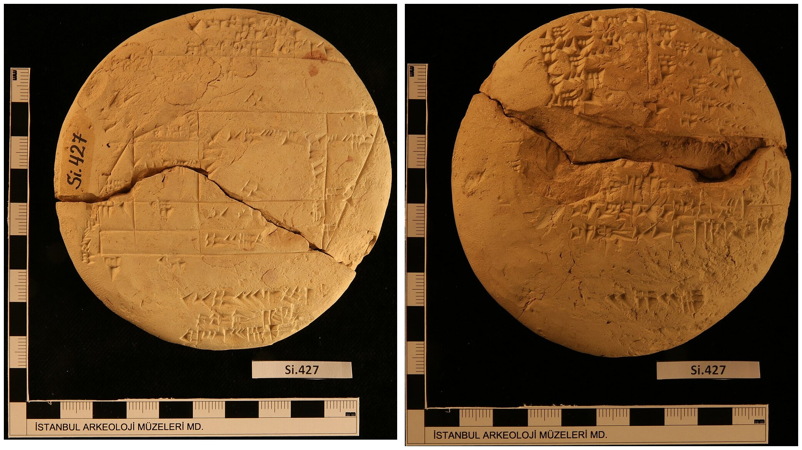

# Introduction

## Brief history of interactive data visualization

Data visualization has a rich and intricate history, and a comprehensive treatment is beyond the scope of the present thesis. Nevertheless, in this section, I will provide a brief overview, with a particular focus on the later developments related to interactive visualization. For a more detailed historical account, readers should refer to @beniger1978, @dix1998, @friendly2006, @friendly2021, or @young2011.

### Static data visualization: From ancient times to the space age

The idea of graphically representing abstract information is very old. As one concrete example, a clay tablet recording a land survey during the Old Babylonian period (approximately 1900-1600 BCE) has recently been identified as the earliest visual depiction of the Pythagorean theorem [@mansfield2020]. Other early examples of abstract visualizations included maps of geographic regions and the night sky, and these were also the first to introduce the idea of coordinate systems [@beniger1978; @friendly2021].

```{r}
#| echo: false
#| fig-cap: "Photos of the tablet Si. 427 which has recently been identified as the earliest depiction of the Pythagorean theorem [@mansfield2020]. Left: the obverse of the tablet depicts a diagram of a field, inscribed with areas. Right: the reverse of the tablet contains a table of numbers, corresponding to the calculation of the areas. Source: Wikimedia Commons [@mansfield2024]."

```

For a long time, coordinate systems remained tied to geography and maps. However, with the arrival of the early modern age, this was about to change. In the 16-17th century, the works of the 9th century algebraist Al-Khwarizmi percolated into Europe, and with them the idea of representing unknown quantities by variables [@kvasz2006]. This idea culminated with Descartes, who introduced the concept of visualizing algebraic relationships as objects in a 2D plane, forging a powerful link between Euclidean geometry and algebra [@friendly2021]. Coordinate systems were thus freed of their connection to geography, and the x- and y-axes could now be used to represent an arbitrary "space" spanned by two variables.

Descartes' invention was initially only used to plot abstract mathematical relationships, however, it would not be long until people figured out that observations of the real world could be visualized as well. A true pioneer in this arena was William Playfair, who used visualizations for presenting socioeconomic data, and invented many types of plots still in use today, such as the barplot, lineplot, and pie chart [@friendly2021]. With the emergence of modern nation states in the 19th century, the collection of data and *statistics* ["things of the state", @etymonline2024] became widespread, leading to a "golden age" of statistical graphics [@beniger1978; @friendly2021; @young2011]. This period saw the emergence of other graphical lumnaries, such as Étienne-Jules Marey and Charles Joseph Minard [@friendly2021], as well as some ingenious examples of the use of statistical graphics to solve real-world problems. These include John Snow's investigation into the London cholera outbreak [@freedman1999; @friendly2021] and Florence Nightingale's reporting on the unsanitary treatment of wounded British soldiers during the Crimean War [@brasseur2005], both of which lead to a great reduction of preventable deaths. 

Simultaneously, the field of mathematical statistics was also experiencing significant developments. Building upon the foundation laid by mathematical prodigies such as Jakob Bernoulli, Abraham de Moivre, Pierre Simon Laplace, and Carl Friedrich Gauss, early 19th century pioneers such as Adolph Quetelet and Francis Galton began developing statistical techniques for uncovering hidden trends in the newly unearthed treasure trove of socioeconomic data [@fienberg1992; @freedman1999]. In the late 19th and early 20th century, these initial efforts were greatly advanced by the theoretical work of figures such as Karl Pearson, Ronald A. Fisher, Jerzy Neyman, and Harold Jeffreys, who established statistics as a discipline in its own right and facilitated its dissemination throughout many scientific fields [@fienberg1992].

As mathematical statistics gained prominence in the early 20th century, data visualization declined. Perceived as less rigorous than "serious" statistical analysis, it got relegated to an auxiliary position, ushering in "dark age" of statistical graphics [@friendly2006; @young2011]. This development may have been partly driven by the early frequentist statisticians' aspiration to establish statistics as a foundation for determining objective truths about the world and society, motivated by personal socio-political goals [see @clayton2021]. Be it as it may, while statistical graphics also did get popularized and entered the mainstream during this time, only a few interesting developments took place [@friendly2021].      

However, beginning in the late 1950's, a series of developments took place which would restore the prominence of data visualization, as well as making it more accessible than ever. Firstly, at the theoretical level, the work of Tukey [-@tukey1962; -@tukey1977] and Bertin [-@bertin1967] established data visualization as valuable discipline in its own right. Secondly, at the practical level, the development of personal computers [see e.g. @abbate1999] and high-level programming languages such as FORTRAN in 1954 [@backus1978], made the process of rendering production-grade figures near-effortless in comparison to the earlier hand-drawn techniques. Combined, these developments lead to a surge in the use and dissemination of data visualization.  

### Early interactive data visualization: By statisticians for statisticians

With the boom of static data visualization mid-20th century, interactive data visualization would not be left far behind. The very early interactive data visualization systems tended to be designed for niche, specialized tasks. For example, @fowlkes1969 designed a system which allowed the users to view probability plots under different configurations of parameters and transformations, whereas @kruskal1964 created a tool for visualizing multidimensional scaling. 

However, soon, researchers began exploring interactive data visualization as a general-purpose tool for data exploration. The first such general-purpose system was PRIM-9 [@fisherkeller1974]. PRIM-9 allowed for exploration of multivariate data via interactive features such as projection, rotation, masking, and filtering. Later systems provided an even wider range of features. For example, MacSpin [@donoho1988], Data Desk [@velleman1989], LISP-Stat [@tierney1990], and XGobi [@swayne1998] implemented features such as interactive scaling, rotation, linked views, and grand tours (excellent video-documentaries of some of these early interactive data visualization systems are available at [ASA Statistical Graphics Video Library](https://community.amstat.org/jointscsg-section/media/videos)).

Later, with the proliferation of open-source, general-purpose statistical computing software such as S and R, interactive data visualization tools became more widely available. The successor system to XGobi, GGobi [@swayne2003], expanded on XGobi and made it embedable within the R runtime. Mondrian [@theus2002] allowed for sophisticated linked interaction between many different types of plots including scatteplots, histograms, barplots, scatterplot, mosaic plots, parallel coordinates plots, and maps. Finally, iPlots [@urbanek2003] implemented a general framework for interactive plotting that was not only embedded in R but could be directly programmatically manipulated, and was later further expanded and made performant for big data in iPlots eXtreme [@urbanek2011].      

What all of these interactive data visualization systems had in common is that they were designed by statisticians for statisticians, with data exploration as the primary goal. High-level analytic features such as linked selection/brushing, rotation and projection, and interactive manipulation of model parameters made frequent appearance. While being a clear strength, the more advanced nature of these systems may have also slowed their adoption, as they demanded more expertise from their users to be used effectively. Finally, these tools often offered fairly limited customizability, and this made them less well suited for data presentation. 

### Interactive data visualization and the Web: World-wide interactivity

The end of the millennium marked the arrival of a new class of technologies which impacted interactive data visualization just as much as almost every other field of human endeavor. The advent of the internet in the mid 1990's made it possible to create interactive applications that could be accessed by anyone, from anywhere. This was aided by the dissemination of robust and standardized Web browsers, as well as development of JavaScript as a high-level programming language for the Web  [for a tour of the history, see @wirfs-brock2020]. Soon, interactive data visualization became just one of many emerging technologies within the fledgling Web ecosystem. 

Early interactive data visualization systems for the Web tended to rely on external plugins. Examples of these included Prefuse [@heer2005] and Flare [developed around 2008, @flare2020], which relied on Java runtime and Adobe Flash Player, respectively. However, as browser technologies improved, particularly as JavaScript got significantly more performant thanks to advances in just-in-time (JIT) compilation, it became possible to create complex interactive experiences directly in the browser. As a result, the early 2010's saw the emergence of several popular Web-native interactive data visualization systems. 

One of the oldest and most prominent among these Web-native visualization systems is D3.js [@bostock2022]. D3 is a general, low-level framework for visualizing data, and consists of a suite of specialized JavaScript modules designed for various aspects of the data visualization workflow, including data parsing, transformation, scaling, and DOM interaction. Importantly, while D3 does provide methods for handling interactive events, it does not itself provide a system for dispatching and coordinating these events - it instead delegates this responsibility to the user and encourages the use of reactive Web frameworks such as React [@react2024], Vue [@vue2024], or Svelte [@svelte2024]. Finally, D3.js visualizations are rendered as Scalable Vector Graphics (SVG) by default, ensuring lossless scaling but impacting performance at high data volumes. While various unofficial alternative rendering engines, based on the HTML 5 Canvas element or WebGL, do exist, as of this date, no such official libraries exist as of this date.

There are many packages that build upon the fairly low-level framework that D3 provides, providing a more high-level interface. Two prominent among these are plotly.js [@plotly2022] and Highcharts [@highcharts2024]. While D3 provides low-level utilities such as data transformations, scales, and geometric objects, these packages provide more high-level utilities such as functions for rendering complete plots and registering reactive events, which are under the hood automatically handled via systems based on the native DOM Event Target interface [@mdn2024a]. Like D3, both plotly.js and Highcharts also render the graphics in SVG by default, however, unlike D3, they both also provide alternative rendering engines based on WebGL [@highschartsboost2022; @plotly2024b]. 

A somewhat different approach is taken by another popular visualization package built partially on D3 - Vega [@satyanarayan2015; @vega2024a]. Vega provides a declarative framework for defining (interactive) data visualizations using a static [JSON] schema. Compared to plotly.js or Highcharts, Vega is significantly more expressive, allowing for fine-grained customization of graphics and interactive behavior, standing essentially just one level above D3. However, as a consequence, it is also significantly more verbose. For example, a full specification of a scatterplot matrix with linked brushing takes over 300 lines of JSON [not including the data and using default formatting such as would be created with `JSON.stringify(schema, null, "\t")`, @vega2024b].          

While these contemporary Web-based interactive data visualization systems offer great deal of flexibility and customizability, I argue that this comes at the cost of making them practical for applied researchers and data scientists. Most importantly, it seems that there is some ambiguity about what counts as interactive features. For example, in the [R Graph Gallery entry on Interactive Charts](https://r-graph-gallery.com/interactive-charts.html) [@holtz2022], which features several examples of interactive visualization derived from the above-mentioned JavaScript interactive data visualization libraries, the visualizations feature interactions such zooming, panning, hovering, 3D rotation, and repositioning a node within a network graph. However, in all of these examples, the user only manipulates surface-level graphical attributes of a single plot. In contrast, the [Plotly Dash documentation page on Interactive Visualizations](https://dash.plotly.com/interactive-graphing) [@plotly2022] does feature two examples of linked hovering and cross-filtering, i.e. examples of linked interactivity. However, it should be noted that vast majority of visualizations in the [Plotly R Open Source Graphing Library documentation page](https://plotly.com/r/) [@plotly2022] allow for only surface-level interactions. Similarly, [VegaLite Gallery pages on Interactive Charts](https://vega.github.io/vega-lite/examples/#interactive-charts) and [Interactive Multiview Displays](https://vega.github.io/vega-lite/examples/#interactive-multi-view-displays)  [@vegalite2022] feature many examples, however, only a few show limited examples of linked or parametric interactivity.  Finally, the [Highcharter Showcase Page ](https://jkunst.com/highcharter/articles/showcase.html) [@kunst2022] does not feature any examples of linking or parametric interactivity.

What all of the packages listed above have in common is that most featured interaction is typically surface-level and takes place within a single plot, and the few examples that feature interesting types of interactivity (linked or parametric) often require a complicated setup. The main reason for this is most likely that all of these packages have been designed to be very general-purpose and flexible, and the price to pay for this flexibility is that complex types of interactivity require complex code. Another reason is that these packages have been built for static visualizations first, and interactivity second. Further, since all of these packages are native to JavaScript, the expectation may be that if more interesting types of interactivity are desired, the interactive "back-end" may be written separately, outside of the package. Finally, the typical use case for these packages seems to be presentation, not EDA.  

Be it as it may, there is a fairly high barrier for entry for creating interesting types of interactivity (i.e. linked or parametric) with these packages. This may not be an issue for large organizations which can afford to hire computer science specialists to work on complex interactive dashboards and visualizations full-time. However, to the average applied scientist or data scientist, the upfront cost of producing a useful interactive data visualization may be too high, especially if one is only interested in exploratory data analysis for one's own benefit. This may be the reason why interactive visualizations are nowadays mainly used for data communication, not data exploration [@batch2017]. On a higher level, the current options for interactive data visualization may reflect a broader cultural differences between Computer Science and Statistics, where Computer Science may be more oriented towards business and large-team collaboration, whereas Statistics may be more focused on applied research and individual/small-team workflow.    

## What even is interactive data visualization? {#what-is-interactive-visualization}

> If it looks like a duck, swims like a duck, and quacks like a duck, then it probably is a duck. 
>
> [...] The irony is that while the phrase is often cited as proof of abductive reasoning, it is not proof, as the mechanical duck is still not a living duck
>
> [Duck Test](https://en.wikipedia.org/wiki/Duck_test) entry, [@wikipedia2022] 

What is interactive data visualization? Surprisingly, despite the widespread popularity of interactive visualizations, if you ask researchers, you may get many different and at times even incongruent answers [see e.g. @dimara2019; @elmqvist2011; @pike2009]. Within the literature, the terms "interactive" and "interaction" are used in many different ways and across a wide variety of contexts, with an explicit definition being rarely given. 

The lack of a clear consensus about what "interactive data visualization" is makes the task of discussing existing work challenging. On one hand, ignoring the issue might leave the reader confused about the relevant concepts. On the other, a comprehensive account of the terminology surrounding interactive data visualization would almost surely become too dense; entire research papers have been dedicated to this topic [see e.g. @dimara2019; @elmqvist2011]. Therefore, in the following section, I have tried to strike a balance by providing a concise yet informative-enough account of how interactivity has been conceptualized within the existing literature. Ultimately, the goal is to provide the reader with context and define what the terms "interactive" and "interaction" should mean for the scope of the present thesis.

The following section is laid out as follows. I start with a brief overview of the history of the field, of data visualization more generally and interactive data visualization more specifically. Then I discuss the different ways the term "interactive data visualization" has been used throughout the literature, and finally I arrive at a working definition of interactivity for the scope of the present thesis.

### Interactive vs. interacting with

First, when we say "interactive data visualization", are we referring to a concrete figure or chart, or are we referring to the process of interacting with such a figure? In other words, are we using the term "visualization" as a noun or a verb? Here already we can see a significant overloading of the term [@dimara2019; @pike2009; see also @yi2007]. The split between these two meanings is quite noticeable within the interactive data visualization literature. On one hand, there are some papers which focus on the mathematical and computational aspects of interactive data visualization, discussing specific systems and implementations [see e.g. @buja1996; @kelleher2015; @leman2013; @wills2008]. On the other hand, there are papers which approach the topic from a more cognitive or human-computer interaction (HCI) point of view: exploring what impact different kinds of visualization and interaction styles have on the user's ability to derive insights from the data [see e.g. @dimara2019; @dix1998; @pike2009; @quadri2021; @yi2007]. 

There is of course a significant overlap between these two uses of the term "interactive data visualization": most papers discuss both concrete implementations of interactive data visualization systems and the user's actions and experiences while using those systems. Nevertheless, the fact that the term is used to refer to both the user's actions and experiences as well as the object of these actions and experiences can make can make literature search complicated - whenever searching for any subtopic within one of the two fields, one will inevitably find hits from the other. It also highlights an important fact about interactive data visualization as a research area: rather than being a single field, it is actually an intersection of several different fields, including statistics, computer science, applied mathematics, business analytics, human-computer interaction, and cognitive psychology [@dimara2019]. 

While I do plan to discuss some elementary features of the psychology of *interacting* with visualizations, when used throughout this thesis, the term *"interactive data visualization"* will refer to concrete charts or figures, typically displayed on a computer screen. When referring to the *practice* of interactive data visualization, I will attempt to use more active phrasing such as *"interacting with a visualization"* or *"user's interaction with a visualization"*, to indicate that what is being referred to is the activity or process of visualization, rather than any concrete object or implementation. 

### What counts as "interactive enough"?

But even when we use the term "interactive data visualization" to refer to concrete charts or figures, the meaning still remains ambiguous. What is the bar for calling a figure "interactive"? What features should an interactive figure have? Among data visualization researchers, there are considerable differences of opinion, such that the same figure may be considered interactive by some but not by others. And these differences are important - they are not just a matter of opinion or aesthetic taste. When building interactive data visualization systems, what we consider "interactive" has a profound impact on the implementation details and requirements of the system.  

Consider a scatterplot with a color palette widget that can be used to select the color of the points. Does such a feature justify the scatterplot being called an "interactive data visualization"? There are some researchers who will answer affirmatively - for them, interactivity is something fundamental, and if the user is able to manipulate some visual aspect of the figure, that's enough to call the visualization interactive. To some, almost any user manipulation qualifies [@brodbeck2009]. Other researchers emphasize speed of the computer's responses to user interaction, with faster updates translating to greater interactivity [@becker1987; @buja1996]. Complicating matters further, some of these researchers also make the distinction between "interactive" and "dynamic" manipulation, where interactive manipulation involves discrete actions such as pressing a button or selecting an item from a drop-down menu, whereas dynamic manipulation involves continuous actions, like moving a slider or clicking-and-dragging to highlight a rectangular area [@rheingans2002; @jankun2007; see also @dimara2019]. 

Yet, for other researchers, simple features such as changing the color of points in a scatterplot are far too low of a bar. For many, true interactivity hinges on high-level analytic features which allow the practitioner to derive insights from the data which would be much harder or time-intensive to derive from static visualizations. These features include the ability to generate different views of the data (by e.g. zooming, panning, sorting, and filtering), and the reactive propagation of changes between connected or "linked" parts of a figure [@kehrer2012; @buja1996; @keim2002; @unwin1999]. Similarly, in visual analytics research, a distinction is made between "surface-level" (or "low-level") and "parametric" (or "high-level") interactions, where surface-level interactions manipulate attributes of the visual domain only (e.g. zooming and panning), whereas parametric interactions manipulate attributes of mathematical models or algorithms underlying the visualization [@leman2013; @pike2009]. 

Table \@ref(tab:definitions) summarizes the several ways of defining interactivity as discussed above. Note that the list is not supposed to be exhaustive; more complete taxonomies of interactive visualization systems and features have been described before [see e.g. @dimara2019; @yi2007]. Instead, I want to use the list to broadly summarize the ways researchers have thought about interactivity, and to have a place to refer the reader to when discussing these ideas later on in the text.

```{r definitions}
#| echo: false

library(kableExtra)

tab <- data.frame(
  type = c("User interaction", 
           "Real-time updates", 
           "Plot- and data-space manipulation",
           "Linked views",
           "Parametric updates"),

  details = c("The user can interactively manipulate the visualization in some way",
              "The user's interactions propagate into the visualization with little to no lag",
              'The user can interactively explore different parts of the data set by doing actions which effectively amount to "subsetting" rows of the data (e.g. zooming, panning, and filtering)',
              r"(The visualization consists of connected or "linked" parts and the user's interactions with one part propagate to the other parts (e.g. linked highlighting))",
              "The user can manipulate the parameters of some underlying mathematical model or algorithm (e.g. histogram bins, grand tour projections, etc...)")
)

colnames(tab) <- c("Feature", "Details")

knitr::kable(tab, caption = "Definitions of Interactivity") |> kable_styling(full_width = FALSE)
# odd_rows <- (1:nrow(tab))[1:nrow(tab) %% 2 == 1]
# 
# flextable(tab) |>
#   theme_booktabs(bold_header = TRUE) |>
#   set_table_properties(width = 1, layout = "autofit") |>
#   bg(i = odd_rows, bg = "grey95") |>
#   border_inner_h(border = fp_border_default(color = "grey80"))

```

### Complexity of interactive features

The different definitions of interactivity are not just differences of opinion or taste - they also have a significant impact on implementation requirements. To start with a perhaps slightly over-exaggerated example, many programming languages come equipped with a read-evaluate-print loop (REPL) which can be used to interactively execute code from the command line. The user writes code, presses ENTER, and the language interpreter evaluates the code, returns any output, and waits for more input from the user. Now, if the language in question supports plotting, then, under the permissive "user interaction" definition, it could be argued that even the act of running code from a command line to produce new plots could be considered an "interactive data visualization system", since the user's interaction with the REPL produces changes to the visual output. And, hypothetically, if the user could type fast enough, they would see the updates appear almost instantly, satisfying the "real-time update" definition.

Does this mean that every programming language which has a REPL and supports plotting automatically ships with an interactive data visualization system? I would argue that no: most people nowadays probably do not consider the command line to be an interactive data visualization system. But perhaps it has not always been this way. Several decades ago, the command line played a much bigger role as an interactive user interface [see e.g. @foley1990; @howard1995]. Compared to waiting seconds or minutes for code to compile, a REPL is indeed a much more interactive experience. However, with the rise in processor speed and the proliferation of highly interactive graphical user interfaces (GUIs), users have come to expect visualizations that can be interacted with *directly* [@dimara2019]. As such, our perceptions of what is "interactive" are not constant but change over time; as technologies improve, we come to expect more direct and responsive user interfaces.

Now, let's set the somewhat exaggerated example of the REPL aside, and focus on what today would be considered more "typical" examples interactive data visualization systems. That is, systems in which the user can interact with the visualizations directly, by pressing keys or mouse buttons. Then, there still are considerable differences in what different features imply for implementation requirements.  

There are features which manipulate visual attributes of the plot only, independent of the data. These include, for example, changing the size, color, or opacity of points in a scatterplot. Features like this are usually fairly simple to implement because they do not affect the underlying data representation: a point displays the same data (as indicated by its xy-coordinates) no matter whether it is green or orange. Also, these graphical-only features typically do not require specialized data structures, and have low time- and space-complexity: for example, when interactively changing the opacity of points in a scatterplot, we only need to update one scalar value - the points' opacity - and as such most of the user-experienced time will be spent re-rendering, rather than on any computation.     

In contrast, some interactive features require specialized data structures and complex algorithms, above and beyond those that are required for static plots. For instance, each time the user engages in interactive features such as filtering, linked highlighting, or parametric interaction, new summaries of the underlying data may need to be computed. When a user selects several points in a linked scatterplot, we first have to find the ids of all the corresponding cases, recompute the statistics underlying all other linked plots (such as counts/sums in barplots or histograms), train all of the relevant scales, and only then can we re-render the plot. Likewise, if we interactively manipulate a histogram's binwidth, we need to recompute the number of cases in each bin each time the binwidth changes. To maintain the illusion of smooth, "continuous" interaction [@dimara2019], these computations need to happen fast, and as such, computational efficiency becomes imperative.

### Working definition

As was discussed in previous sections, the definition "interactive data visualization" varies across fields and researchers. Moreover, when building an interactive data visualization system, this distinction matters, since different interactive features inherently come with different levels of complexity. Thus, how should we go about deciding what to consider "interactive" for our purposes? 

Data visualization can be broadly categorized into two primary modes: presentation and exploration. While both modes share a bulk of common techniques, each comes with a different set of goals and challenges [@kosara2016]. Data presentation starts from the assumption that we have derived most of the important insights from our data already, and the goal is now to communicate these insights clearly and make an impactful and lasting impression [@kosara2016]. In contrast, data exploration begins from a position of incomplete knowledge - we accept that there are facts about our data we might not be aware of yet. Thus, when we explore data with visualizations, the goal is to help us see what we might otherwise miss or might not even think to look for [@tukey1977; @unwin2018].    

However, it is not always the case that more complex visuals necessarily translate to better statistical insights. In static visualization, it is a well-established fact that plots can include sophisticated-looking and seemingly appealing features which do not promote the acquisition of statistical insights in any way [@cairo2014; @cairo2019; @gelman2013; @tufte2001]. Similarly, adding interactivity to a visualization does not always improve its statistical legibility [see e.g. @abukhodair2013; @franconeri2021]. 

I propose to approach interactive features the same way we treat visual features in static visualization. Specifically, I propose the following working definition:

> To justify being called an "interactive data visualization", the interactive features in a visualization should promote statistical understanding.

If we accept this proposition, then there are several important consequences that follow. First, we must favour high-level, data-dependent, parametric interactions over the purely graphical ones.

That is not to say that purely graphical interactive features are not useful. For example, in the presence of overplotting, manipulating size or alpha of objects can help us features (areas of high density) that would otherwise remain hidden. Likewise, zooming and panning, while often being counted among the more high-level features, require manipulation of existing axis limits only and can be done without reference to the original data. Still, I argue that the ability to see new summaries of the data is what makes some interactive data visualizations systems ultimately more powerful (and also more challenging to implement). The interactive features that enable this, such as filtering, linked highlighting, and parameter manipulation, go beyond aesthetics, and empower the users to explore the data dynamically, uncovering hidden patterns and relationships that may otherwise remain hidden. 

### Brief taxonomy of common interactive features

This section describes several common types of interactive features that facilitate interactive data exploration. 

Visual information seeking mantra: overview first, zoom and filter, then details-on-demand [@shneiderman2003].

## The highlighting problem

As was discussed in the previous section, linked selection is one of the most highly ranked interactive features in interactive data visualization. It allows us to mark specific cases in one plot, and see the corresponding summary statistics in all the other plots. In this way, it allows us to quickly explore different dynamically-generated subsets of our data, within the context of the whole data set.

### Linked selection and stacking

When we engage in linked selection, we want to highlight parts of objects corresponding to the selected cases. Thus, fundamentally, we need to break each object into parts. We then need some way of representing those parts, in a way that visually preserves the hierarchical nature of the relationship (it needs to be clear that the parts are still parts of the whole object).

In data visualization, there are three common methods for dealing with objects that have been split into parts: stacking, dodging, and layering. Let's briefly illustrate these on the example of the barplot. We start with the whole bars and then break each bar into multiple segments based on the levels of another variable (such as selection status). Now, what we do with these segments will differ based on the technique we use. When stacking, we plot the bar segments vertically on top of each other. When dodging, we plot the bars side-by-side, as "clusters". Finally, when layering, we plot bar segments in separate graphical layers and use partial transparency to mitigate overplotting.

```{r}
#| echo: false
#| fig-cap: "Examples of the three methods for dealing with objects that 
#| have been split into parts: stacking, dodging, and layering."
#| fig-height: 3
library(ggplot2)
library(patchwork)

mtcars$cyl <- factor(mtcars$cyl)
mtcars$am <- factor(mtcars$am)

p0 <- ggplot(mtcars, aes(cyl, fill = am, group = am)) +
  scale_fill_manual(values = pal_dark_3) +
  guides(fill = "none") +
  labs(x = NULL, y = NULL) +
  clean_theme

p1 <- p0 + geom_bar() + labs(title = "Stacking")
p2 <- p0 + geom_bar(position = position_dodge()) + labs(title = "Dodging")
p3 <- p0 + 
  geom_bar(position = position_identity(), alpha = 0.75) + 
  labs(title = "Layering")

p1 + p2 + p3
```

Much has been written about the relative merits of stacking, dodging, and layering. For example, layering is only useful with few categories, as blending many colors can make it difficult to tell the categories apart [@franconeri2021; @wilke2019]. Further, in a landmark study, @cleveland1984 showed that people tend to be less accurate when reading information from stacked bar charts as opposed to dodged bar charts. Specifically, since the lower y-axis coordinate of a stacked segment is pushed up by the cumulative height of the segments below, it becomes difficult to accurately compare segments' length, both within and across bars [@cleveland1984]. Subsequent research has independently validated these findings and expanded upon them [see e.g. @heer2010; @thudt2016; @quadri2021]. Due to this suboptimal statistical legibility, many data visualization researchers have urged caution about stacking [see e.g. @byron2008; @cairo2014; @franconeri2021], and some have even discouraged its use altogether [@kosara2016; @wilke2019]. 

However, much of this research has been done with on static visualizations. I argue that, in interactive data visualization, there are additional constraints that affect the calculus of which method is the best.

First, if we want to support the ability to interactively manipulate the alpha channel and do linked selection with multiple (3+) selection groups, we can effectively eliminate layering as an option. Having two different sources of alpha channel (layering and user input) would make the interaction confusing and limit its range (e.g. if we use 75% alpha to do layering, then the effective range of values the user can manipulate is 0-75%). Further, with multiple selection groups, it would become hard to tell the selection status apart. It is much better to keep the two interactive features (selection and alpha manipulation) orthogonal and use a separate visual attribute (color and transparency) for each.

Thus, the choice is between stacking and dodging. While, as was discussed above, dodging is the preferred choice in static data visualization, I propose that 

First, I propose that stacking is the superior method for *displaying* selection. Thanks to the four Gestalt principles of proximity, similarity, closure, and common region, in a stacked barplot, each bar presents itself as a single visual entity. In other words, since the stacked segments are placed right on top of each other, and share width and a closed border, they are perceived as part of a unified whole (the bar). This remains true throughout selection - no matter how the heights of the highlighted segments change, the height of the whole stacked bar remains constant, and so does the overall outline of the plot.

To address the highlighting problem, we need to first discuss some key mathematical concepts.

## Theory of data visualization systems

### Scales

Every data visualization system needs some way of translating abstract data values into concrete graphical attributes such as position, size, or colour. Given the ubiquitous need for scales, one might expect them to be a "solved issue", within the relevant literature. However, this is far from the truth. Specifically, the issues of scales and measurement are still being grappled with in the areas of mathematics and philosophy of science to this day [for a gentle yet thorough introduction, see @tal2015].

Scales are another area of data visualization in which there has been considerable debate, with many terms being overloaded and relating to concepts from different fields. This is due to the fact that the issue of how to compare, rank, and translate values has a long and complicated history. In particular, the issue of measurement has been hotly debated in the field of psychometrics and mathematical psychology, leading to the development of the *theory of measurement* (which has some overlap with, but is not the same as, *measurement theory* in mathematics). 

One paper that has been key to the debate around scales and measurement has been the seminal work of @stevens1946. In this paper, Stevens defined a *scale* as a method of assigning numbers to values, allowing for various kinds of comparisons. Further, by considering transformations which preserve the comparisons, Stevens identified 4 types of scales: *nominal*, *ordinal*, *interval*, and *ratio* [see also @michell1986; @velleman1993].

```{r scales}
#| echo: false

tab <- data.frame(
  v1 = c("Nominal", "Ordinal", "Interval", "Ratio"),
  v2 = c("Equivalence relation",
         "Total order",
         "Lebesque measure",
         ""),
  v3 = c("Are $x$ and $y$ the same?", 
         "Is $x$ is greater than $y$?", 
         "How far is $x$ from $y$?",
         "How many times is $x$ greater than $y$?"),
  v4 = c("$x' = f(x)$, where $f$ is a bijection", 
         "$x' = f(x)$, where $f$ is a monotonic bijection", 
         "$x' = ax + b$, for $a, b$ real", 
         "$x' = ax$, for $a$ real")
)

col_names <- c("Scale", 
               "Structure",
               "Comparison", 
               "Valid transformations")
knitr::kable(tab, col.names = col_names, 
             caption = "Types of scales identified by Stevens (1946)")

```

Table \@ref(tab:scales) shows a loose reproduction of Table 1 from @stevens1946. Note that the family of valid transformations gets smaller in each row, meaning that the scales carry more information [@velleman1993]. Let's discuss the scales individually.    

##### Nominal scales

*Nominal* scales correspond to equivalence relations. An equivalence relation is a binary relation $\sim$ on some set $X$ which, for all $x, y, z \in X$, has the following properties:

- *Reflexivity*: $x \sim x$
- *Symmetry*: $x \sim y \text{ if and only if } y \sim x$
- *Transitivity*: $x \sim y \text{ and } y \sim z \text{ then } x \sim z$

Intuitively, we can think of the numbers on a nominal scale as "labels". Thus, the only question which we can ask a nominal scale is whether two labels are the same or different. Examples of variables with nominal scale include variables of which we typically think of as categorical, such as color, species, or political party. It does not make sense to say "blue is *more* than green" or "cat is *more* than dog" without specifying some other axis of comparison. It does make sense, however, to say "Daisy and Molly are the same species of animal (cat)" or "these two glasses are of different colors".

For nominal scales, any permutation is a valid transformation [@stevens1946]. For example, if we use the numbers $\{ 1, 2, 3 \}$ to represent the species $S = \{ \text{cat}, \text{dog}, \text{hamster} \}$, respectively, we can re-assign the numbers in any order we want and the properties of the scale are preserved.   

It is arguable whether any nominal quantities exist in and of themselves or whether they only ever exists as abstract social constructions over underlying continuous reality. Color is a discretization of the visible light spectrum (frequency of electromagnetic radiation), and the pre-Darwinian concept of a species is likewise an abstraction over continuously varying distribution of genes [although there have been some attempts to ground the definition of a discrete species in the theory of genetics, e.g. as a population of individuals which can produce viable offsprings, see @mayr1999]. Further, even many subjective concepts which are typically described as discrete such as emotions may be abstractions over underlying continuous phenomena [@barrett2013]. 

However, even if nominal quantities are entirely socially constructed, this does not mean they are arbitrary or useless. SEARLE     

##### Ordinal scales

*Ordinal* scales correspond to total orders. A total order is a relation $\leq$ on $X$ which, for all $x, y, z \in X$, has the following properties:

1) *Reflexivity*: $x \leq x$
2) *Antisymmetry*: $\text{if } x \leq y \leq x \text{ then } x = y$
3) *Transitivity*: $x \leq y \text{ and } y \leq z \text{ then } x \leq z$
4) *Totality* or *comparability* or *strong connectedness*: $\text{for all } x, y, \text{ either } x \leq y \text{ or } y \leq x$

Examples of total orders include the usual ordering $\leq$ on natural numbers $\mathbb{N}$: $1 \leq 2 \leq 3 \leq \ldots$ or the alphabetical order on letters: $A \leq B \leq C \ldots \leq Z$.  

As total orders, ordinal scales allow us to rank quantities. A good example of an ordinal variable is placement in a race or competition. If Emma and Charlotte ran a marathon, and Emma placed 2nd and Charlotte 3rd, we can say that Charlotte ran finished the race earlier than Emma. However, we do not know whether she crossed the finish line 15 minutes or 2 hours earlier, or whether or not her average pace was less than half of that of Emma. 

Some authors have related ordinal scales to *weak orders* [see @michell1986]. Weak orders [also known as *total preorders*, see @nlab2024d] generalize total orders by allowing for ties (properties 2. and 4. above do not need hold). While this seems like a useful property, I opted to relate ordinal scales to total orders here instead, since there is currently ambuiguity in the way the term *weak order* is used in the literature [see e.g. @nlab2024a; @nlab2024b; @stackexchange2024], and, for practical data analysis, the distinction is fairly inconsequential. For instance, in the marathon example above, if Emma and Charlotte both placed second, after Lucy and before Lily, we could frame the outcome of the race as the following weak order on the set $M$ of marathoners: $\text{Lucy} \leq \text{Emma, Charlotte} \leq \text{Lily} \leq ...$. However, the underlying set of ranks $R \subset \mathbb{N}$ still retains a total ordering: $1 \leq 2 \leq 3 \leq \ldots$ and we can specify a surjective monotonically increasing function $r: M \to R$ which maps each marathoner to her rank. Clearly, we can map any weak order to a total order by applying a functor which enforces anti-symmetry in this way [@fong2019; @nlab2024d].

The only transformations which are permissible for ordinal scales are those which preserve order, that is, monotonic increasing transformations [@stevens1946; @michell1986]. For example, transforming our set of ranks $R$ by taking the log or square root of each rank leaves the order relations between them unchanged.  

##### Interval scales

*Interval* scales. 

Interval scales allow us to calculate a distance between two points. However, they do not have a natural "zero point" or intercept. As such we cannot use them to determine the ratio between two quantities. Examples of interval scales include the calendar date and geographical position. It does not make sense to say that the year 1000 CE is "twice as much" as 500 CE, since the birth of Jesus Christ is (religious beliefs aside) an arbitrary zero point: we could set 0 CE at any other point in time, such as the founding of Athens or the release of Taylor Swift's first album, and all of the properties we care about when tracking historical time would be preserved. Likewise, it does not make sense to say that 90° longitude is "three times" that of 30° longitude: the location of the prime meridian is also the product of arbitrary historical cirumstances.  

###### Ratio scales

Unlike interval scales, ratio scale have a well-defined natural zero point. For example, 

##### Criticism of On the Theory of Scales of Measurement

In the original paper, Stevens had also made the claim that the type of scale determined which statistical tests and summaries were "permissible" for the data. For example, according to Stevens, while mean is an appropriate summary of an interval scale (since expectation is linear), it would not be a permissible summary of ordinal data. This claim was later disputed by researchers      
