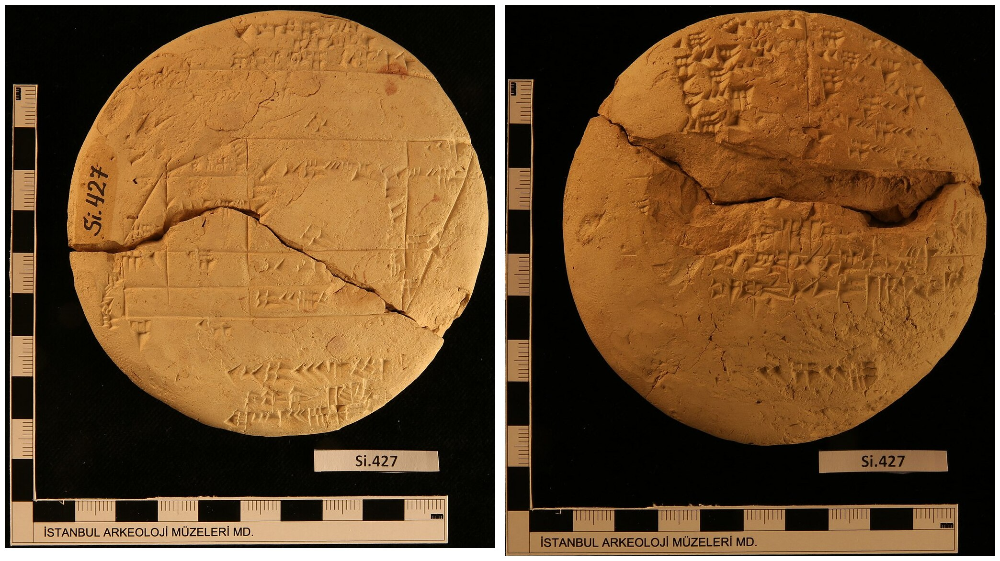

# Literature review

## Brief history of interactive data visualization

Data visualization has a rich and intricate history, and a comprehensive treatment is beyond the scope of the present thesis. Nevertheless, in this section, I will provide a brief overview, with a particular focus on the later developments related to interactive visualization. For a more detailed historical account, readers should refer to @beniger1978, @dix1998, @friendly2006, @friendly2021, or @young2011.

### Static data visualization: From ancient times to the space age

The idea of graphically representing abstract information is very old. As one concrete example, a clay tablet recording a land survey during the Old Babylonian period (approximately 1900-1600 BCE) has recently been identified as the earliest visual depiction of the Pythagorean theorem [@mansfield2020]. Other examples of early abstract visualizations include maps of geographic regions and the night sky, and these were also the first to introduce the idea of coordinate systems [@beniger1978; @friendly2021].

```{r}
#| echo: false
#| fig-cap: "Photos of the tablet Si. 427 which has recently been identified as the earliest depiction of the Pythagorean theorem [@mansfield2020]. Left: the obverse of the tablet depicts a diagram of a field, inscribed with areas. Right: the reverse of the tablet contains a table of numbers, corresponding to the calculation of the areas. Source: Wikimedia Commons [@mansfield2024]."

```

For a long time, coordinate systems remained tied to geography and maps. However, with the arrival of the early modern age, this was about to change. In the 16-17th century, the works of the 9th century algebraist Al-Khwarizmi percolated into Europe, and with them the idea of representing unknown quantities by variables [@kvasz2006]. This idea culminated with Descartes, who introduced the concept of visualizing algebraic relationships as objects in a 2D plane, forging a powerful link between Euclidean geometry and algebra [@friendly2021]. Coordinate systems were thus freed of their connection to geography, and the x- and y-axes could now be used to represent an arbitrary "space" spanned by two variables.

Descartes' invention of drawing abstract relationships as objects in a 2D plane was initially only used to plot mathematical functions. However, it would not be long until people realized that observations of the real world could be visualized as well. A true pioneer in this arena was William Playfair, who popularized visualization as a way of presenting socioeconomic data and invented many types of plots still in use today, such as the barplot, lineplot, and pie chart [@friendly2021]. Further, with the emergence of modern nation states in the 19th century, the collection of data and *statistics* ["things of the state", @etymonline2024] became widespread, leading to a "golden age" of statistical graphics [@beniger1978; @friendly2021; @young2011]. This period saw the emergence of other graphical lumnaries, such as Étienne-Jules Marey and Charles Joseph Minard [@friendly2021], as well as some ingenious examples of the use of statistical graphics to solve real-world problems, including John Snow's investigation into the London cholera outbreak [@freedman1999; @friendly2021] and Florence Nightingale's reporting on the unsanitary treatment of wounded British soldiers during the Crimean War [@brasseur2005], both of which lead to a great reduction of preventable deaths. 

Simultaneously, the field of mathematical statistics was also experiencing significant developments. Building upon the foundation laid by mathematical prodigies such as Jakob Bernoulli, Abraham de Moivre, Pierre Simon Laplace, and Carl Friedrich Gauss, early 19th century pioneers such as Adolph Quetelet and Francis Galton began developing statistical techniques for uncovering hidden trends in the newly unearthed treasure trove of socioeconomic data [@fienberg1992; @freedman1999]. In the late 19th and early 20th century, these initial efforts were greatly advanced by the theoretical work of figures such as Karl Pearson, Ronald A. Fisher, Jerzy Neyman, and Harold Jeffreys, who established statistics as a discipline in its own right and facilitated its dissemination throughout many scientific fields [@fienberg1992].

As mathematical statistics gained prominence in the early 20th century, data visualization declined. Perceived as less rigorous than "serious" statistical analysis, it got relegated to an auxiliary position, ushering in "dark age" of statistical graphics [@friendly2006; @young2011]. This development may have been partly driven by the early frequentist statisticians' aspiration to establish statistics as a foundation for determining objective truths about the world and society, motivated by personal socio-political goals [see @clayton2021]. Be it as it may, while statistical graphics also did get popularized and entered the mainstream during this time, only a few interesting developments took place [@friendly2021].      

However, beginning in the late 1950's, a series of developments took place which would restore the prominence of data visualization and make it more accessible than ever. Firstly, on the theoretical front, the work of certain academic heavy-weights greatly elevated data visualization and its prestige. Particularly, John Tukey [-@tukey1962; -@tukey1977] fervently championed exploratory data analysis and placed data visualization in its centre. Around the same time, Jacques Bertin published his famous *Sémiologie graphique* [-@bertin1967], which was one of the first works to attempt to lay out a comprehensive system of visual encodings and scales. Secondly, at the more applied level, the development of personal computers [see e.g. @abbate1999] and high-level programming languages such as FORTRAN in 1954 [@backus1978], made the process of rendering production-grade figures easier and more accessible than ever before. Combined, these developments fueled a surge in the use and dissemination of data visualizations.  

As the millennium drew to a close, several other important developments solidified the foundation of static data visualization. First, William Cleveland made significant contributions to the field, laying out many important principles for scientific data visualization [@cleveland1985; @cleveland1993]. Of note, his seminal study on the impact of the choice of visual encodings on statistical judgements remains widely cited today [@cleveland1984]. Similarly, Edward Tufte introduced essential principles for designing effective graphics, coining terms such as *chartjunk* and *data-to-ink ratio* [@tufte2001]. Finally, Leland Wilkinson's groundbreaking Grammar of Graphics [-@wilkinson2012] introduced a comprehensive system for designing charts based on simple algebraic rules, influencing nearly every subsequent software package and research endeavor in the field of visualization.

### Early interactive data visualization: By statisticians for statisticians {#early-interactive}

With the boom of static data visualization in the 1950's, interactive data visualization would not be left far behind. It started with tools designed for niche, specialized tasks. For example, @fowlkes1969 designed a system which allowed the users to view probability plots under different configurations of parameters and transformations, whereas @kruskal1964 created a tool for visualizing multidimensional scaling. 

However, soon, researchers soon recognized the potential of interactive data visualization as a general-purpose tool for exploring data. The first such general-purpose system was PRIM-9 [@fisherkeller1974]. PRIM-9 allowed for exploration of multivariate data via interactive features such as projection, rotation, masking, and filtering. Following PRIM-9, the late 1980's saw the emergence of a new generation of systems which provided an even wider range of capabilities. Tools like MacSpin [@donoho1988], Data Desk [@velleman1989], LISP-Stat [@tierney1990], and XGobi [@swayne1998] introduced features such as interactive scaling, rotation, linked views, and grand tours (for a glimpse into these systems, excellent video-documentaries are available at [ASA Statistical Graphics Video Library](https://community.amstat.org/jointscsg-section/media/videos)).

The proliferation of open-source, general-purpose statistical computing software such as S and R further democratized the access to interactive data visualization tools. Building on XGobi's foundation, GGobi [@swayne2003], expanded upon on XGobi and provided an integration layer for R. Other tools like Mondrian [@theus2002] introduced sophisticated linked interaction between many different types of plots including scatteplots, histograms, barplots, scatterplot, mosaic plots, parallel coordinates plots, and maps. Additionally, iPlots [@urbanek2003] implemented a general framework for interactive plotting in R, allowing not only for one-shot rendering interactive figures from R but also for direct programmatic manipulation. This package was later expanded expanded for big data capabilities in iPlots eXtreme [@urbanek2011].      

A common thread among these interactive data visualization systems is that they were designed by statisticians with primary focus on data exploration. High-level analytic features such as linked views, rotation/projection, and interactive manipulation of model parameters made frequent appearance. While these features were powerful, they also contributed to a steeper learning curve, potentially limiting adoption by users without a strong data analytic background. Additionally, these tools often had fairly limited options for customization, making them less well suited for data presentation.

### Interactive data visualization and the internet: Web-based interactivity

The end of the millennium marked the arrival of a new class of technologies which impacted interactive data visualization just as much as almost every other field of human endeavor. The rise of the internet in the mid 1990's made it possible to create interactive applications that could be accessed by anyone, from anywhere. This was aided by the dissemination of robust and standardized web browsers, as well as the development of JavaScript as a high-level programming language for the web  [for a tour of the history, see @wirfs-brock2020]. Soon, interactive visualizations became just one of many emerging technologies within the burgeoning web ecosystem. 

Early web-based interactive data visualization systems tended to rely on external plugins. Examples of these include Prefuse [@heer2005] and Flare [developed around 2008, @flare2020], which leveraged the Java runtime and Adobe Flash Player, respectively. However, as browser technologies advanced, particularly as JavaScript's performance improved thanks to advances in just-in-time compilation [JIT, see e.g. @clark2017; @dao2020], it became possible to create complex interactive experiences directly in the browser. This led to the emergence of several popular web-native interactive data visualization systems in the early 2010s, many of which remain widely used today. 

#### D3

D3.js [@bostock2022] is one of the earliest and most influential web-based visualization systems. As a general, low-level framework for visualizing data, D3 provides of a suite of specialized JavaScript modules for various aspects of the data visualization workflow, including data parsing, transformation, scaling, and DOM interaction. 

For instance, here's how to create a scatterplot in D3:

```{js}
#| eval: false
import * as d3 from "d3";

const app = document.querySelector<HTMLDivElement>("#app")!;
const url =
  `https://raw.githubusercontent.com/holtzy/` +
  `data_to_viz/master/Example_dataset/2_TwoNum.csv`;
const data = await d3.csv(url);
const [x, y] = [`GrLivArea`, `SalePrice`]; // The x, y variable keys

const margin = { top: 10, right: 30, bottom: 30, left: 60 };
const width = parseFloat(app.style.width);
const height = parseFloat(app.style.height);

// Create a SVG element, resize it, and append it to #app
const svg = d3
  .select("#app")
  .append("svg")
  .attr("width", width + margin.left + margin.right)
  .attr("height", height + margin.top + margin.bottom)
  .append("g")
  .attr("transform", "translate(" + margin.left + "," + margin.top + ")");

// Create x and y scales and append them to the plot
const scaleX = d3.scaleLinear().domain([0, 4000]).range([0, width]);
const scaleY = d3.scaleLinear().domain([500000, 0]).range([0, height]);
svg
  .append("g")
  .attr("transform", "translate(0," + height + ")")
  .call(d3.axisBottom(scaleX));
svg.append("g").call(d3.axisLeft(scaleY));

// Add points
svg
  .append("g")
  .selectAll("dot")
  .data(data)
  .enter()
  .append("circle")
  .attr("cx", (d) => scaleX(d[x]))
  .attr("cy", (d) => scaleY(d[y]))
  .attr("r", 1);
```

```{r d3-scatterplot}
#| echo: false
#| fig-cap: "Example of a scatterplot in D3.js. The code was taken from D3 Graph Gallery [@holtz2022b] and adjusted to use ES6 syntax and slightly more informative variable names/comments."
knitr::include_graphics("./figures/d3-scatterplot.png")
```

As you can see from Figure \@ref(fig:d3-scatterplot), D3 is a fairly low-level framework. Notice that, compared with high-level plotting capabilities such as those provided by base R or `ggplot2` [@r2024; @wickham2016], the user has to handle many low-level details such as scaling and appending of primitives explicitly. This is also the case with interaction. While D3 does provide methods for handling interactive DOM events, it does not itself provide a system for dispatching and coordinating these events - it instead delegates this responsibility to the user and encourages the use of reactive Web frameworks such as React [@react2024], Vue [@vue2024], or Svelte [@svelte2024]. 

Finally, D3.js visualizations are rendered as Scalable Vector Graphics (SVG) by default. This ensures lossless scaling but may impact rendering performance at high data volumes. While various unofficial alternative rendering engines based on the HTML 5 Canvas element or WebGL, do exist, there are no such official libraries as of this date.

#### Plotly and Highcharts

Building upon the low-level infrastructure that D3 provides, many packages such as Plotly.js [@plotly2022] and Highcharts [@highcharts2024] provide high-level abstractions which make the process of building complex interactive figures more streamlined for the average user. Unlike D3 which provides low-level utilities such as data transformations, scales, and geometric objects, these packages provide functions for rendering entire plots and registering reactive events, built on the native DOM Event Target interface [@mdn2024a].

For example, here's how to render a scatterplot in Plotly:

```{js}
#| eval: false
const data = [{
  x: [1, 2, 3, 4],
  y: [10, 15, 13, 17],
  mode: 'markers',
  type: 'scatter'
}];

Plotly.newPlot('app', data);
```

<script src="https://cdn.plot.ly/plotly-2.35.2.min.js" charset="utf-8"></script>
<div id="app" style="width: 500px; height: 500px"></div>

```{js}
#| echo: false
const data = [{
  x: [1, 2, 3, 4],
  y: [10, 15, 13, 17],
  mode: 'markers',
  type: 'scatter'
}];
Plotly.newPlot('app', data);
```
<!-- This is a dummy code chunk to provide a figure label to the JS block above -->
```{r plotly-scatterplot}
#| echo: false
#| out-width: 0px
#| out-height: 0px
#| fig-cap: "Example of a scatterplot in Plotly.js. The code was taken from the official Plotly documentation [@plotly2024c] and slightly simplified."
plot(0, 0)
```
As you can see, compared with the D3 code used to create Figure \@ref(fig:d3-scatterplot), the code for creating Figure \@ref(fig:plotly-scatterplot) is much terser. Many details, such as the axis limits and margins, point size and colour, gridlines, and widgets, are handled implicitly. Also, notice that the figure provides some interactive features by default, such the ability to zoom and pan and a tooltip on hover.

Finally, like D3, both plotly.js and Highcharts also render the graphics in SVG by default. However, unlike D3, they both also provide alternative rendering engines based on WebGL [@highschartsboost2022; @plotly2024b]. This makes them more ergonomic for use with large data sets. 

#### Vega and Vegalite

Vega [@satyanarayan2015; @vega2024a] is another popular package, which, despite also being built partially upon the foundation of D3, takes a different approach. It provides a declarative framework for defining (interactive) data visualizations using a static [JSON] schema. Compared to Plotly.js and Highcharts, Vega offers significantly more granular customization of graphics and interactive behavior, making it significantly more expressive but also more verbose. For example, specifying a scatterplot matrix with linked selection in Vega requires over 300 lines of JSON, not including the data and using default formatting [@vega2024b]. 

#### Some conclusions

In general, these contemporary web-based interactive data visualization systems offer a great deal of flexibility and customizability, making the well suited for modern data presentation. However, all of this expressiveness does come at a cost. Compared to the earlier statistical graphics systems, described in Section \@ref(early-interactive), many of the more advanced features that used to be common are now either missing or require so much effort to implement that they are only accessible to power-users, as evidenced by their absence in the documentation and gallery pages of the corresponding packages. For instance, the [R Graph Gallery entry on Interactive Charts](https://r-graph-gallery.com/interactive-charts.html) [@holtz2022] features multiple interactive figures implemented in the above-mentioned JavaScript libraries, however, they all feature only surface-level single-plot interactive features such zooming, panning, hovering, 3D rotation, and node repositioning. The [Plotly Dash documentation page on Interactive Visualizations](https://dash.plotly.com/interactive-graphing) [@plotly2022] does feature two examples of simple linked cross-filtering, however, the vast majority of visualizations in the [Plotly R Open Source Graphing Library documentation page](https://plotly.com/r/) [@plotly2022] show examples only surface-level interactivity. Similarly, [VegaLite Gallery pages on Interactive Charts](https://vega.github.io/vega-lite/examples/#interactive-charts) and [Interactive Multiview Displays](https://vega.github.io/vega-lite/examples/#interactive-multi-view-displays)  [@vegalite2022] feature many examples, however, there are only few, limited examples of linked or parametric interactivity. Finally, the [Highcharter Showcase Page ](https://jkunst.com/highcharter/articles/showcase.html) [@kunst2022] does not feature any examples of linking.

Of course, it is still possible to implement advanced features such as complex linked views and parametric interaction in these web-based visualization frameworks, however, it often requires a) writing a lot of code, or b) stepping outside of the visualization library to make use of the more general features provided by the reactive framework or JavaScript. This creates a barrier to entry for taking advantage of these more interesting types of interactivity. This may not be an issue for large organizations which can afford to hire specialists to work on visualizations full-time. However, to the average scientist or data analyst, the upfront cost of producing interactive visualizations may be too high, especially if one is only interested in exploratory data analysis. This may be the reason why interactive visualizations are nowadays mainly used for data communication, not data exploration [@batch2017].

## What even is interactive data visualization? {#what-is-interactive-visualization}

> If it looks like a duck, swims like a duck, and quacks like a duck, then it probably is a duck. 
>
> [...] The irony is that while the phrase is often cited as proof of abductive reasoning, it is not proof, as the mechanical duck is still not a living duck
>
> [Duck Test](https://en.wikipedia.org/wiki/Duck_test) entry, [@wikipedia2022] 

While giving a brief overview of the history and the present state of interactive data visualization in the previous section, I skirted around one important: what even is interactive data visualization? Surprisingly, despite the widespread popularity of interactive visualizations, there is no clear consensus for what makes a figure interactive. Within the data visualization literature, the terms "interactive" and "interaction" are used inconsistently, with researchers providing incongruent and at times even contradictory definitions [see e.g. @dimara2019; @elmqvist2011; @pike2009].  

The lack of a clear consensus complicates discussion of interactive data visualization. Ignoring the issue could risk leaving the reader confused, while a comprehensive exploration of the terminology could become overly complex, as evidenced by the dearth of research papers dedicated to the topic [see e.g. @dimara2019; @elmqvist2011]. To address this issue, this section aims to provide a concise yet informative account of how interactivity has been conceptualized in the literature. The goal is to establish a clear framework for understanding the terms "interactive" and "interaction" within the context of this thesis.

### Interactive vs. interacting with

First, the word "visualization" in the term "interactive data visualization" can be interpreted in two different ways:

1. Noun, as in *interactive data visualization* is a concrete chart or figure
2. Verb, as in *interactive data visualization* is the process of interacting with a figure

Data visualization literature frequently features both uses of the term, leading to significant overloading [@dimara2019; @pike2009; see also @yi2007]. Further, this dual interpretation has lead to a kind of a split in the literature. Some researchers focus on the mathematical and computational aspects of interactive data visualization, discussing specific systems and implementations [see e.g. @buja1996; @kelleher2015; @leman2013; @wills2008]. Others prioritize the more cognitive or human-computer interaction (HCI) aspects of interactive data visualization, exploring what impact different kinds of visualization and interaction styles have on the user's ability to derive insights from the data [see e.g. @dimara2019; @dix1998; @pike2009; @quadri2021; @yi2007]. 

There is of course a significant overlap - most papers discuss both concrete implementations of interactive data visualization systems and the user's intentions and experiences while using those systems. However, the dual intepretation of "interactive data visualization" does complicate literature search. It also highlights the interdisciplinary nature of the field, showing its connections to statistics, computer science, applied mathematics, business analytics, HCI, and cognitive psychology[@dimara2019]. While this interdisciplinary nature of interactive data visualization is certainly a strength, it can also lead to confusion, and as such I think it is necessary to clearly define key terms. 

To ensure clarity throughout thesis, the term *"interactive data visualization"* will primarily refer to concrete charts or figures. When referring to the *practice* of interactive data visualization, I will attempt to use more active phrasing such as *"interacting with a visualization"* or *"user's interaction with a visualization"*, to indicate that what is being referred to is the activity or process of visualization, rather than any concrete object or implementation. 

### What is "interactive enough"?

Even when we use the term "interactive data visualization" to refer to concrete charts or figures, the meaning still remains fairly ambiguous. What is the bar for calling a figure "interactive"? What features should interactive figures have? These criteria vary a lot between data visualization researchers, such that the same figure may be considered interactive by some but not by others. This is important, since the criteria may impact the requirements and implementation details of interactive data visualization systems.  

Some researchers adopt a broad definition of interactive data visualization, considering almost any figure combined with graphical user interface (GUI) as interactive, as long as it allows for some level of user manipulation  [@brodbeck2009]. For others, the speed of the computer's responses to user input is important, with faster updates translating to greater interactivity [@becker1987; @buja1996]. Some also differentiate between "interactive" and "dynamic" manipulation, such that interactive manipulation involves discrete actions such as pressing a button or selecting an item from a drop-down menu, whereas dynamic manipulation involves continuous actions, like moving a slider or clicking-and-dragging to highlight a rectangular area [@rheingans2002; @jankun2007; see also @dimara2019]. 

However, many other researchers ascribe to a much narrower view of interactive data visualizations, which hinges on high-level analytic features that allow efficient exploration of the data. These features include the ability to generate different views of the data (by e.g. zooming, panning, sorting, and filtering), and the reactive propagation of changes between connected or "linked" parts of a figure [@kehrer2012; @buja1996; @keim2002; @unwin1999; @chen2008]. An often cited guideline is the visual information seeking mantra: overview first, zoom and filter, then details-on-demand [@shneiderman2003]. Similarly, in visual analytics research, a distinction is made between "surface-level" (or "low-level") and "parametric" (or "high-level") interactions, where surface-level interactions manipulate attributes of the visual domain only (e.g. zooming and panning), whereas parametric interactions manipulate attributes of mathematical models or algorithms underlying the visualization [@leman2013; @pike2009]. 

Table \@ref(tab:definitions) provides a concise summary of the several perspectives on interactivity discussed above. It meant to serve as a reference point for future discussions within the text, though it is important to note that this is not an exhaustive list. For a more comprehensive taxonomy of interactive visualization systems and features, see e.g. @dimara2019, @yi2007.

```{r definitions}
#| echo: false

library(kableExtra)

tab <- data.frame(
  type = c("User interaction", 
           "Real-time updates", 
           "Plot- and data-space manipulation",
           "Linked views",
           "Parametric updates"),

  details = c("The user can interactively manipulate the figure in some way",
              "The user's interactions propagate into the visualization with little to no lag",
              'The user can interactively explore different parts of the data set by doing actions which effectively amount to "subsetting" rows of the data (e.g. zooming, panning, and filtering)',
              r"(The user's interaction propagate across multiple plots (e.g. linked highlighting))",
              "The user can manipulate the parameters of some underlying mathematical model or algorithm (e.g. histogram bins, grand tour projections, etc...)"),
  papers = c("@brodbeck2009", 
             "@becker1987, @buja1996, @jankun2007, and @rheingans2002", 
             "@buja1996, @keim2002, @shneiderman2003, and @unwin1999", 
             "@buja1996, @keim2002, @kehrer2012, @unwin1999, @theus2008, @wilhelm2008, @wills2008", 
             "@leman2013, @pike2009")
)

colnames(tab) <- c("Name", "Details", "Selected references")
knitr::kable(tab, caption = "Summary of the perspectives on interactivity") |> kable_styling(full_width = FALSE)

# odd_rows <- (1:nrow(tab))[1:nrow(tab) %% 2 == 1]
# 
# flextable(tab) |>
#   theme_booktabs(bold_header = TRUE) |>
#   set_table_properties(width = 1, layout = "autofit") |>
#   bg(i = odd_rows, bg = "grey95") |>
#   border_inner_h(border = fp_border_default(color = "grey80"))

```

### Complexity of interactive features

The way we define interactivity is not just a matter of taste or preference: it has a significant impact on the complexity and feasibility of our systems. Some simple features, such as zooming or changing size and alpha, are fairly simple to implement and require just a thin interactive layer over a static data visualization system. Other more advanced features, such as linked selection, demand a significant overhead, reaching all the way to fundamental data processing steps.

To start with a perhaps slightly over-exaggerated example, many programming languages come equipped with a read-evaluate-print loop (REPL) which can be used to interactively execute code from the command line. The user writes code, presses ENTER, and the language interpreter evaluates the code, returns any output, and waits for more input from the user. Now, if the language in question supports plotting, then, under the permissive "user interaction" definition, it could be argued that even the act of running code from a command line to produce new plots could be considered an "interactive data visualization system", since the user's interaction with the REPL produces changes to the visual output. And, hypothetically, if the user could type fast enough, they would see the updates appear almost instantly, satisfying the "real-time update" definition.

Does this mean that every programming language which has a REPL and supports plotting automatically ships with an interactive data visualization system? I would argue that no: most people nowadays probably do not consider the command line to be an interactive data visualization system. But perhaps it has not always been this way. Several decades ago, the command used to be considered a prime example of an interactive user interface [see e.g. @foley1990; @howard1995]. Compared to waiting seconds or minutes for code to compile, a REPL is indeed a much more interactive experience. However, with the rise in processor speed and the proliferation of highly interactive graphical user interfaces (GUIs), users have come to expect visualizations that can be interacted with *directly* [@dimara2019]. As such, our perceptions of what is "interactive" are not constant but change over time; as technologies improve, we come to expect more direct and responsive user interfaces.

Now, let's set the somewhat exaggerated example of the REPL aside, and focus on what today would be considered more "typical" examples interactive data visualization systems. That is, systems in which the user can interact with the visualizations directly, by pressing keys or mouse buttons. Then, there still are considerable differences in what different features imply for implementation requirements.  

There are features which manipulate visual attributes of the plot only, independent of the data. These include, for example, changing the size, color, or opacity of points in a scatterplot. Features like this are usually fairly simple to implement because they do not affect the underlying data representation: a point displays the same data (as indicated by its xy-coordinates) no matter whether it is green or orange. Also, these graphical-only features typically do not require specialized data structures, and have low time- and space-complexity: for example, when interactively changing the opacity of points in a scatterplot, we only need to update one scalar value - the points' opacity - and as such most of the user-experienced time will be spent re-rendering, rather than on any computation.     

In contrast, some interactive features require specialized data structures and complex algorithms, above and beyond those that are required for static plots. For instance, each time the user engages in interactive features such as filtering, linked highlighting, or parametric interaction, new summaries of the underlying data may need to be computed. When a user selects several points in a linked scatterplot, we first have to find the ids of all the corresponding cases, recompute the statistics underlying all other linked plots (such as counts/sums in barplots or histograms), train all of the relevant scales, and only then can we re-render the plot. Likewise, if we interactively manipulate a histogram's binwidth, we need to recompute the number of cases in each bin each time the binwidth changes. To maintain the illusion of smooth, "continuous" interaction [@dimara2019], these computations need to happen fast, and as such, computational efficiency becomes imperative.

### Working definition

As was discussed in previous sections, the definition "interactive data visualization" varies across fields and researchers. Moreover, when building an interactive data visualization system, this distinction matters, since different interactive features inherently come with different levels of complexity. Thus, how should we go about deciding what to consider "interactive" for our purposes? 

Data visualization can be broadly categorized into two primary modes: presentation and exploration. While both modes share a bulk of common techniques, each comes with a different set of goals and challenges [@kosara2016]. Data presentation starts from the assumption that we have derived most of the important insights from our data already, and the goal is now to communicate these insights clearly and make an impactful and lasting impression [@kosara2016]. In contrast, data exploration begins from a position of incomplete knowledge - we accept that there are facts about our data we might not be aware of yet. Thus, when we explore data with visualizations, the goal is to help us see what we might otherwise miss or might not even think to look for [@tukey1977; @unwin2018].    

However, it is not always the case that more complex visuals necessarily translate to better statistical insights. In static visualization, it is a well-established fact that plots can include sophisticated-looking and seemingly appealing features which do not promote the acquisition of statistical insights in any way [@cairo2014; @cairo2019; @gelman2013; @tufte2001]. Similarly, adding interactivity to a visualization does not always improve its statistical legibility [see e.g. @abukhodair2013; @franconeri2021]. 

I propose to approach interactive features the same way we treat visual features in static visualization. Specifically, I propose the following working definition:

> To justify being called an "interactive data visualization", the interactive features in a visualization should promote statistical understanding.

If we accept this proposition, then there are several important consequences that follow. First, we must favour high-level, data-dependent, parametric interactions over the purely graphical ones.

That is not to say that purely graphical interactive features are not useful. For example, in the presence of overplotting, manipulating size or alpha of objects can help us features (areas of high density) that would otherwise remain hidden. Likewise, zooming and panning, while often being counted among the more high-level features, require manipulation of existing axis limits only and can be done without reference to the original data. Still, I argue that the ability to see new summaries of the data is what makes some interactive data visualizations systems ultimately more powerful (and also more challenging to implement). The interactive features that enable this, such as filtering, linked highlighting, and parameter manipulation, go beyond aesthetics, and empower the users to explore the data dynamically, uncovering hidden patterns and relationships that may otherwise remain hidden. 

### Common interactive features

This section describes several common types of interactive features that tend to make frequent appearance across interactive data visualization systems. It is only meant as an overview [for comprehensive taxonomies of interactive features, see @dimara2019; @yi2007]. For each feature, I highlight its properties, common uses, and implementation requirements. 

#### Changing size and alpha

One of the simplest and most widely-implemented interactive features is the ability to adjust the size and transparency of geometric objects. In other words, the user may dynamically shrink or grow the objects and make them more or less opaque. This can be particularly useful at high data volumes, as reducing the size or alpha might show certain trends that would be otherwise hidden. For example, in scatterplots, shrinking points and making them semi-transparent reduces overplotting and can provide an approximation to a 2D kernel density plot [see e.g. @dang2010]. Similar technique can work for parallel coordinates plot as well [@theus2008].

This feature is usually quite easy to implement, since it involves the visual attributes only. In other words, when we manipulate size or alpha of geometric objects in our plots, we usually do not need to worry about what data these objects represent or where it came from. As such, it is relatively simple to implement this feature "on top" of an existing static visualization layer [see @bracsoveanu2017].

#### Zooming and panning

Zooming and panning are two fundamental interactive features, often used in tandem. Because of their association, and the fact that they both involve interactive manipulation of scale limits, I discuss them here simultaneously, in a single subsection.

Zooming, depicted in Figure \@ref(fig:zooming), allows the user to magnify a specific region of a single plot. Typically, this is done creating a rectangular selection and the plot scales are then automatically adjusted to match this region. Zooming allows the user to get a better sense of the trend within the magnified region, and discover patterns that may be otherwise obscured due to overplotting or improper aspect ratio [see e.g. @buja1996; @dix1998; @unwin1999; @theus2008; @yi2007]. 

```{r zooming}
#| echo: false
#| fig-cap: "Zooming involves shrinking the axis limits to obtain a more detailed view of the data. Typically, the user selects a rectangular region of the plot (left) and the plot scales are then adjusted so that the region fills up the entire plot area (right). Notice the change in the axis limits."
knitr::include_graphics("./figures/zooming.png")
```

However, after zooming into a region, it is often helpful retain the ability to traverse the wider plot area, while maintaining the same level of zoom and aspect ratio. This is what panning is for. By performing an action like right-clicking and dragging, the user can shift the center of the zoomed in region around the plot. 

```{r panning}
#| echo: false
#| fig-cap: "Panning involves moving the axis limits while retaining the same zoom level and axis ratio. After zooming into a rectangular region (top row), the user can around the plot region, usually by clicking and dragging (bottom row)."
knitr::include_graphics("./figures/panning.png")
```

Since these features can be implemented with scales only, implementing zooming and panning might seem relatively straightforward, however, even here, there are few issues to consider. First, whereas continuous axes can be be zoomed and/or panned by simply modifying the axis limits, zooming other types of scales such as discrete ones require a bit more consideration [see e.g. @wilkinson2012]. Second, with nested zooming, maintaining a reversible history of previous states is essential [@unwin1999]. Third, at times, it can be useful to link scale updates across multiple plots, such that, for example, zooming or panning a plot in a scatterplot matrix produces the same updates in other plots with the same variables on one of the axes. Finally, an advanced feature that can be also quite useful when combined with hierarchical data such as geographic information is logical or semantic zooming [@keim2002; @unwin1999; @yi2007]. In logical zooming, magnification does not only increase the size of the zoomed-in objects, but also the level of detail the objects show, making this a more complex feature than general zooming involving scales only.

#### Querying

Querying is another popular interactive feature that is usually fairly simple to implement. As shown in Figure \@ref(fig:querying), the way querying is typically implemented is that when a user mouses over a particular geometric object, a tooltip or a small table is displayed, showing values corresponding to the underlying data point(s) [@urbanek2003]. This makes it possible to look up precise values that would otherwise be available only approximately via the visual representation. 

```{r querying}
#| echo: false
#| fig-cap: "Querying involves hovering over an object to display its associated data values in a table or pop-up. Notice that this can include both plotted values (weight, mileage) as well as values that are not directly represented in the plot (car name, cylinders)."

```

Querying is useful because it allows us to combine the best features of graphics and tables. Specifically, it allows us overcome the dichotomy pointed out by John Tukey in his famous paper on the role of graphics in data exploration: "graphics are for the qualitative/descriptive [...] never for the carefully quantitative (tables do that better)" and "graphics are for comparison [...] not for access to individual amounts" [@tukey1993]. By providing the option to query geometric objects, it allows the user to seamlessly transition between the high-level analytic overview that the graphic provides and the low-level quantitative information of the table.

Additionally, querying also allow us to show more information than can be displayed via the visual encodings alone (see again Figure \@ref(fig:querying)). Specifically, whereas most plots can encode only two or three variables, we can assign an arbitrary number of key-value pairs to the rows query table. However, it is crucial to balance the need for detail against the risk of visual clutter. Too many rows may overtax the attention of the visualization consumer and also lead to clipping/overplotting issues if the table cannot fit the plotting area. Further, there are [better methods](#bidirectional-communication) for retrieving very detailed information from interactive visualizations.    

While querying one-to-one representations of the data such as points in a scatterplot is relatively simple, querying aggregate objects such as bars in a barplot/histograms presents some challenges. In the case of one-to-one representations, we can always simply retrieve the corresponding row of the data, however, in the case of aggregate objects, a single object may correspond to multiple rows and there may be no obvious way to summarize them. For instance, when querying a continuous variable corresponding to a bar in a barplot, should we return its sum, its maximum, the set of all unique values, or perhaps something entirely different? Likewise, querying objects in the presence of selection or higlighting presents some problems.

#### Switching representations

The same data can often by visualized in multiple ways, by representing it via different sets of visual encodings [@wilkinson2012]. However, some encodings may work better for answering certain questions than others. By enabling the users to switch the visual representation, we empower them to explore their data with grater flexibility [@yi2007].

A typical example is switching between a barplot and a spineplot, see Figure \@ref(fig:barplot-spineplot1). Barplots are an effective representation for comparing absolute quantities. Specifically, by encoding a categorical variable as the x-axis position and a continuous variable as the y-axis position/bar length, we can easily compare the y-axis quantities across the levels of the x-axis variable. Often, we further split the bars into segments and encode a second categorical variable as the segment colour, to be able to compare quantities within subgroups. 

```{r barplot-spineplot1}
#| echo: false
#| fig-cap: "Switching representations can be an effective way to derive new insights from the data. A barplot (left) represents the same underlying data as a spineplot (right), however, the former is better for comparing absolute counts whereas the latter is better for comparing proportions. Note that in the spineplot, it is much easier to see that the proportion of the red cases is the same in categories B and C."
knitr::include_graphics("./figures/barplot-spineplot.png")
```

However, since the heights of the bars are different, barplots are not very effective for comparing proportions, especially when the bar heights vary significantly. Spineplots, on the other hand, present a way of visualizing the same sort of data as a barplot while making it much easier to compare proportions. Specifically, in a spineplot, the heights of the bars are all normalized to 1, such that the segments show a proportion of the total, and the absolute values are instead encoded as the bar width. The fixed height of bars makes it easy to compare the proportions the segments represent.

Other examples of switching of representations include the spineplot (a normalized version of the histogram).

#### Linked selection

Linked selection, also known as linked brushing, highlighting, or views, is often considered as one of the most useful interactive data visualization features [see e.g. @buja1996; @wilhelm2003; @heer2012; @ward2015; @ware2019]. Fundamentally, it involves creating a figure with multiple "linked" plots. The user can then click or click-and-drag over objects in one plot, and the corresponding cases are highlighted across all the other plots, see Figure \@ref(fig:linked-selection). This makes it possible to quickly quickly explore trends across different dynamically-generated subsets of the data [@dix1998]. The ability to quickly materialize alternative views of the data makes this a particularly effective tool for data exploration [@wilhelm2008; @wills2008].

```{r linked-selection}
#| echo: false
#| fig-cap: "Linked selection involves highlighting the same cases across all plots. The user can select some objects in one plot, such as points in a scatterplot (top left), and the corresponding cases are higlighted in all the other plots."
knitr::include_graphics("./figures/linked-selection.png")
```

Despite the fact that the user experience of linked selection is usually fairly intuitive, there are many subtle considerations that go into implementing the feature [for a good overview, see @wilhelm2008]. First, there is the issue of how the user makes the selection. Typically, clicking selects a single objects and clicking-and-dragging selects multiple objects in a rectangular region (similar to how selecting files and folders works on desktop GUIs of most operating systems). In some systems, the users may also drag the selection region around ("brushing"), form a continuous "lasso" selection, select lines in a particular angular range, or points at a particular distance from a centroid [see e.g. @hauser2002; @splechtna2018; @wills2008]. Further, when one variables is continuous and the other is derived (such as the x- and y-axes in a histogram), the interaction may also be simplified by restricting selection/brushing to the primary axis [@satyanarayan2016]. Finally, the selections can be combined by various operators such as OR, AND, NOT, and XOR, to form unions, intersections, and other types of logical subsets [@theus2002; @urbanek2003; @wills2008]. 

Second, there is the issue of who should dispatch and respond to selection events. In presentation-focused interactive data visualization and dashboarding systems, this responsibility is kept flexible, such that some plots may only dispatch, only respond, do both, or neither [@satyanarayan2015; @satyanarayan2016]. However, in systems focused on data exploration, the convention is typically for all plots to both dispatch and respond to selection events, such that they may be interacted with in the same way. [@theus2002; @urbanek2003; @urbanek2011].

Third, there is the issue of what to link. In the case of data represented by a two-dimensional table or data frame, the most common method is to link cases taken on the same observational level (identity linking), such that each row gets assigned a value representing the selection status [@urbanek2003; @wilhelm2008; @wills2008]. However, in the case of more complex data, more advanced linking schemes are also available, such as hierarchical and distance-based linking [@wilhelm2008; @urbanek2011]. 

Third, there is the issue of how to display the selection. 

## The highlighting problem

As was discussed in the previous section, linked selection is one of the most highly ranked interactive features in interactive data visualization. It allows us to mark specific cases in one plot, and see the corresponding summary statistics in all the other plots. In this way, it allows us to quickly explore different dynamically-generated subsets of our data, within the context of the whole data set.

### Linked selection and stacking

When we engage in linked selection, we want to highlight parts of objects corresponding to the selected cases. Thus, fundamentally, we need to break each object into parts. We then need some way of representing those parts, in a way that visually preserves the hierarchical nature of the relationship (it needs to be clear that the parts are still parts of the whole object).

In data visualization, there are three common methods for dealing with objects that have been split into parts: stacking, dodging, and layering. Let's briefly illustrate these on the example of the barplot. We start with the whole bars and then break each bar into multiple segments based on the levels of another variable (such as selection status). Now, what we do with these segments will differ based on the technique we use. When stacking, we plot the bar segments vertically on top of each other. When dodging, we plot the bars side-by-side, as "clusters". Finally, when layering, we plot bar segments in separate graphical layers and use partial transparency to mitigate overplotting.

```{r}
#| echo: false
#| fig-cap: "Examples of the three methods for dealing with objects that 
#| have been split into parts: stacking, dodging, and layering."
#| fig-height: 3
library(ggplot2)
library(patchwork)

mtcars$cyl <- factor(mtcars$cyl)
mtcars$am <- factor(mtcars$am)

p0 <- ggplot(mtcars, aes(cyl, fill = am, group = am)) +
  scale_fill_manual(values = pal_dark_3) +
  guides(fill = "none") +
  labs(x = NULL, y = NULL) +
  clean_theme

p1 <- p0 + geom_bar() + labs(title = "Stacking")
p2 <- p0 + geom_bar(position = position_dodge()) + labs(title = "Dodging")
p3 <- p0 + 
  geom_bar(position = position_identity(), alpha = 0.75) + 
  labs(title = "Layering")

p1 + p2 + p3
```

Much has been written about the relative merits of stacking, dodging, and layering. For example, layering is only useful with few categories, as blending many colors can make it difficult to tell the categories apart [@franconeri2021; @wilke2019]. Further, in a landmark study, @cleveland1984 showed that people tend to be less accurate when reading information from stacked bar charts as opposed to dodged bar charts. Specifically, since the lower y-axis coordinate of a stacked segment is pushed up by the cumulative height of the segments below, it becomes difficult to accurately compare segments' length, both within and across bars [@cleveland1984]. Subsequent research has independently validated these findings and expanded upon them [see e.g. @heer2010; @thudt2016; @quadri2021]. Due to this suboptimal statistical legibility, many data visualization researchers have urged caution about stacking [see e.g. @byron2008; @cairo2014; @franconeri2021], and some have even discouraged its use altogether [@kosara2016; @wilke2019]. 

However, much of this research has been done with on static visualizations. I argue that, in interactive data visualization, there are additional constraints that affect the calculus of which method is the best.

First, if we want to support the ability to interactively manipulate the alpha channel and do linked selection with multiple (3+) selection groups, we can effectively eliminate layering as an option. Having two different sources of alpha channel (layering and user input) would make the interaction confusing and limit its range (e.g. if we use 75% alpha to do layering, then the effective range of values the user can manipulate is 0-75%). Further, with multiple selection groups, it would become hard to tell the selection status apart. It is much better to keep the two interactive features (selection and alpha manipulation) orthogonal and use a separate visual attribute (color and transparency) for each.

Thus, the choice is between stacking and dodging. While, as was discussed above, dodging is the preferred choice in static data visualization, I propose that 

First, I propose that stacking is the superior method for *displaying* selection. Thanks to the four Gestalt principles of proximity, similarity, closure, and common region, in a stacked barplot, each bar presents itself as a single visual entity. In other words, since the stacked segments are placed right on top of each other, and share width and a closed border, they are perceived as part of a unified whole (the bar). This remains true throughout selection - no matter how the heights of the highlighted segments change, the height of the whole stacked bar remains constant, and so does the overall outline of the plot.


## Theory of data visualization systems

### Scales

Every data visualization system needs some way of translating abstract data values into concrete graphical attributes such as position, size, or colour. Given the ubiquitous need for scales, one might expect them to be a "solved issue", within the relevant literature. However, this is far from the truth. Specifically, the issues of scales and measurement are still being grappled with in the areas of mathematics and philosophy of science to this day [for a gentle yet thorough introduction, see @tal2015].

Scales are another area of data visualization in which there has been considerable debate, with many terms being overloaded and relating to concepts from different fields. This is due to the fact that the issue of how to compare, rank, and translate values has a long and complicated history. In particular, the issue of measurement has been hotly debated in the field of psychometrics and mathematical psychology, leading to the development of the *theory of measurement* (which has some overlap with, but is not the same as, *measurement theory* in mathematics). 

One paper that has been key to the debate around scales and measurement has been the seminal work of @stevens1946. In this paper, Stevens defined a *scale* as a method of assigning numbers to values, allowing for various kinds of comparisons. Further, by considering transformations which preserve the comparisons, Stevens identified 4 types of scales: *nominal*, *ordinal*, *interval*, and *ratio* [see also @michell1986; @velleman1993].

```{r scales}
#| echo: false

tab <- data.frame(
  v1 = c("Nominal", "Ordinal", "Interval", "Ratio"),
  v2 = c("Equivalence relation",
         "Total order",
         "Lebesque measure",
         ""),
  v3 = c("Are $x$ and $y$ the same?", 
         "Is $x$ is greater than $y$?", 
         "How far is $x$ from $y$?",
         "How many times is $x$ greater than $y$?"),
  v4 = c("$x' = f(x)$, where $f$ is a bijection", 
         "$x' = f(x)$, where $f$ is a monotonic bijection", 
         "$x' = ax + b$, for $a, b$ real", 
         "$x' = ax$, for $a$ real")
)

col_names <- c("Scale", 
               "Structure",
               "Comparison", 
               "Valid transformations")
knitr::kable(tab, col.names = col_names, 
             caption = "Types of scales identified by Stevens (1946)")

```

Table \@ref(tab:scales) shows a loose reproduction of Table 1 from @stevens1946. Note that the family of valid transformations gets smaller in each row, meaning that the scales carry more information [@velleman1993]. Let's discuss the scales individually.    

##### Nominal scales

*Nominal* scales correspond to equivalence relations. An equivalence relation is a binary relation $\sim$ on some set $X$ which, for all $x, y, z \in X$, has the following properties:

- *Reflexivity*: $x \sim x$
- *Symmetry*: $x \sim y \text{ if and only if } y \sim x$
- *Transitivity*: $x \sim y \text{ and } y \sim z \text{ then } x \sim z$

Intuitively, we can think of the numbers on a nominal scale as "labels". Thus, the only question which we can ask a nominal scale is whether two labels are the same or different. Examples of variables with nominal scale include variables of which we typically think of as categorical, such as color, species, or political party. It does not make sense to say "blue is *more* than green" or "cat is *more* than dog" without specifying some other axis of comparison. It does make sense, however, to say "Daisy and Molly are the same species of animal (cat)" or "these two glasses are of different colors".

For nominal scales, any permutation is a valid transformation [@stevens1946]. For example, if we use the numbers $\{ 1, 2, 3 \}$ to represent the species $S = \{ \text{cat}, \text{dog}, \text{hamster} \}$, respectively, we can re-assign the numbers in any order we want and the properties of the scale are preserved.   

It is arguable whether any nominal quantities exist in and of themselves or whether they only ever exists as abstract social constructions over underlying continuous reality. Color is a discretization of the visible light spectrum (frequency of electromagnetic radiation), and the pre-Darwinian concept of a species is likewise an abstraction over continuously varying distribution of genes [although there have been some attempts to ground the definition of a discrete species in the theory of genetics, e.g. as a population of individuals which can produce viable offsprings, see @mayr1999]. Further, even many subjective concepts which are typically described as discrete such as emotions may be abstractions over underlying continuous phenomena [@barrett2013]. 

However, even if nominal quantities are entirely socially constructed, this does not mean they are arbitrary or useless. SEARLE     

##### Ordinal scales

*Ordinal* scales correspond to total orders. A total order is a relation $\leq$ on $X$ which, for all $x, y, z \in X$, has the following properties:

1) *Reflexivity*: $x \leq x$
2) *Antisymmetry*: $\text{if } x \leq y \leq x \text{ then } x = y$
3) *Transitivity*: $x \leq y \text{ and } y \leq z \text{ then } x \leq z$
4) *Totality* or *comparability* or *strong connectedness*: $\text{for all } x, y, \text{ either } x \leq y \text{ or } y \leq x$

Examples of total orders include the usual ordering $\leq$ on natural numbers $\mathbb{N}$: $1 \leq 2 \leq 3 \leq \ldots$ or the alphabetical order on letters: $A \leq B \leq C \ldots \leq Z$.  

As total orders, ordinal scales allow us to rank quantities. A good example of an ordinal variable is placement in a race or competition. If Emma and Charlotte ran a marathon, and Emma placed 2nd and Charlotte 3rd, we can say that Charlotte ran finished the race earlier than Emma. However, we do not know whether she crossed the finish line 15 minutes or 2 hours earlier, or whether or not her average pace was less than half of that of Emma. 

Some authors have related ordinal scales to *weak orders* [see @michell1986]. Weak orders [also known as *total preorders*, see @nlab2024d] generalize total orders by allowing for ties (properties 2. and 4. above do not need hold). While this seems like a useful property, I opted to relate ordinal scales to total orders here instead, since there is currently ambuiguity in the way the term *weak order* is used in the literature [see e.g. @nlab2024a; @nlab2024b; @stackexchange2024], and, for practical data analysis, the distinction is fairly inconsequential. For instance, in the marathon example above, if Emma and Charlotte both placed second, after Lucy and before Lily, we could frame the outcome of the race as the following weak order on the set $M$ of marathoners: $\text{Lucy} \leq \text{Emma, Charlotte} \leq \text{Lily} \leq ...$. However, the underlying set of ranks $R \subset \mathbb{N}$ still retains a total ordering: $1 \leq 2 \leq 3 \leq \ldots$ and we can specify a surjective monotonically increasing function $r: M \to R$ which maps each marathoner to her rank. Clearly, we can map any weak order to a total order by applying a functor which enforces anti-symmetry in this way [@fong2019; @nlab2024d].

The only transformations which are permissible for ordinal scales are those which preserve order, that is, monotonic increasing transformations [@stevens1946; @michell1986]. For example, transforming our set of ranks $R$ by taking the log or square root of each rank leaves the order relations between them unchanged.  

##### Interval scales

*Interval* scales. 

Interval scales allow us to calculate a distance between two points. However, they do not have a natural "zero point" or intercept. As such we cannot use them to determine the ratio between two quantities. Examples of interval scales include the calendar date and geographical position. It does not make sense to say that the year 1000 CE is "twice as much" as 500 CE, since the birth of Jesus Christ is (religious beliefs aside) an arbitrary zero point: we could set 0 CE at any other point in time, such as the founding of Athens or the release of Taylor Swift's first album, and all of the properties we care about when tracking historical time would be preserved. Likewise, it does not make sense to say that 90° longitude is "three times" that of 30° longitude: the location of the prime meridian is also the product of arbitrary historical cirumstances.  

###### Ratio scales

Unlike interval scales, ratio scale have a well-defined natural zero point. For example, 

##### Criticism of On the Theory of Scales of Measurement

In the original paper, Stevens had also made the claim that the type of scale determined which statistical tests and summaries were "permissible" for the data. For example, according to Stevens, while mean is an appropriate summary of an interval scale (since expectation is linear), it would not be a permissible summary of ordinal data. This claim was later disputed by researchers      
