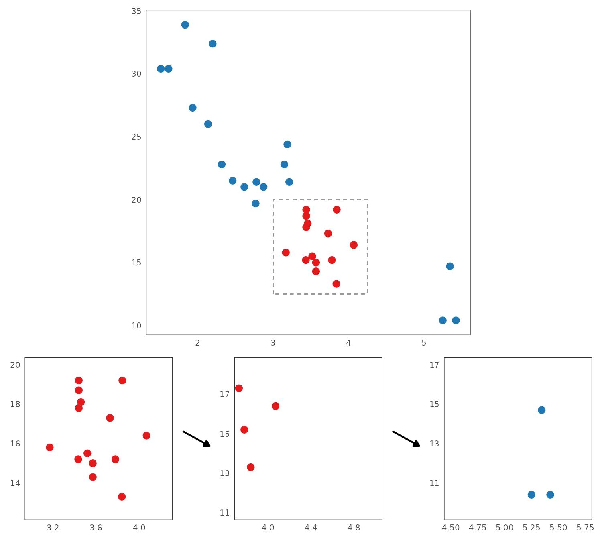

# Background {#litreview}

## Brief history of interactive data visualization {#brief-history}

Data visualization has a rich and intricate history, and a comprehensive treatment is beyond the scope of the present thesis. Nevertheless, in this section, I will provide a brief overview, with a particular focus on the later developments related to interactive visualization. For a more detailed historical account, readers should refer to @beniger1978, @dix1998, @friendly2006, @friendly2021, or @young2011.

### Static data visualization: From ancient times to the space age

The idea of graphically representing abstract information is very old. As one concrete example, a clay tablet recording a land survey during the Old Babylonian period (approximately 1900-1600 BCE) has recently been identified as the earliest visual depiction of the Pythagorean theorem [@mansfield2020]. Other examples of early abstract visualizations include maps of geographic regions and the night sky, and these were also the first to introduce the idea of coordinate systems [@beniger1978; @friendly2021].

```{r}
#| echo: false
#| fig-cap: "Photos of the tablet Si. 427 which has recently been identified as the earliest depiction of the Pythagorean theorem [@mansfield2020]. Left: the obverse of the tablet depicts a diagram of a field, inscribed with areas. Right: the reverse of the tablet contains a table of numbers, corresponding to the calculation of the areas. Source: Wikimedia Commons [@mansfield2024]."
knitr::include_graphics("./figures/si427.jpg")
```

For a long time, coordinate systems remained tied to geography and maps. However, with the arrival of the early modern age, this was about to change. In the 16-17th century, the works of the 9th century algebraist Al-Khwarizmi percolated into Europe, and with them the idea of representing unknown quantities by variables [@kvasz2006]. This idea culminated with Descartes, who introduced the concept of visualizing algebraic relationships as objects in a 2D plane, forging a powerful link between Euclidean geometry and algebra [@friendly2021]. Coordinate systems were thus freed of their connection to geography, and the x- and y-axes could now be used to represent an arbitrary "space" spanned by two variables.

Descartes' invention of drawing abstract relationships as objects in a 2D plane was initially only used to plot mathematical functions. However, it would not be long until people realized that observations of the real world could be visualized as well. A true pioneer in this arena was William Playfair, who popularized visualization as a way of presenting socioeconomic data and invented many types of plots still in use today, such as the barplot, lineplot, and pie chart [@friendly2021]. Further, with the emergence of modern nation states in the 19th century, the collection of data and *statistics* ["things of the state", @etymonline2024] became widespread, leading to a "golden age" of statistical graphics [@beniger1978; @friendly2021; @young2011]. This period saw the emergence of other graphical lumnaries, such as Étienne-Jules Marey and Charles Joseph Minard [@friendly2021], as well as some ingenious examples of the use of statistical graphics to solve real-world problems, including John Snow's investigation into the London cholera outbreak [@freedman1999; @friendly2021] and Florence Nightingale's reporting on the unsanitary treatment of wounded British soldiers during the Crimean War [@brasseur2005], both of which lead to a great reduction of preventable deaths. 

Simultaneously, the field of mathematical statistics was also experiencing significant developments. Building upon the foundation laid by mathematical prodigies such as Jakob Bernoulli, Abraham de Moivre, Pierre Simon Laplace, and Carl Friedrich Gauss, early 19th century pioneers such as Adolph Quetelet and Francis Galton began developing statistical techniques for uncovering hidden trends in the newly unearthed treasure trove of socioeconomic data [@fienberg1992; @freedman1999]. In the late 19th and early 20th century, these initial efforts were greatly advanced by the theoretical work of figures such as Karl Pearson, Ronald A. Fisher, Jerzy Neyman, and Harold Jeffreys, who established statistics as a discipline in its own right and facilitated its dissemination throughout many scientific fields [@fienberg1992].

As mathematical statistics gained prominence in the early 20th century, data visualization declined. Perceived as less rigorous than "serious" statistical analysis, it got relegated to an auxiliary position, ushering in "dark age" of statistical graphics [@friendly2006; @young2011]. This development may have been partly driven by the early frequentist statisticians' aspiration to establish statistics as a foundation for determining objective truths about the world and society, motivated by personal socio-political goals [see @clayton2021]. Be it as it may, while statistical graphics also did get popularized and entered the mainstream during this time, only a few interesting developments took place [@friendly2021].      

However, beginning in the late 1950's, a series of developments took place which would restore the prominence of data visualization and make it more accessible than ever. Firstly, on the theoretical front, the work of certain academic heavy-weights greatly elevated data visualization and its prestige. Particularly, John Tukey [-@tukey1962; -@tukey1977] fervently championed exploratory data analysis and placed data visualization in its centre. Around the same time, Jacques Bertin published his famous *Sémiologie graphique* [-@bertin1967], which was one of the first works to attempt to lay out a comprehensive system of visual encodings and scales. Secondly, at the more applied level, the development of personal computers [see e.g. @abbate1999] and high-level programming languages such as FORTRAN in 1954 [@backus1978], made the process of rendering production-grade figures easier and more accessible than ever before. Combined, these developments fueled a surge in the use and dissemination of data visualizations.  

As the millennium drew to a close, several other important developments solidified the foundation of static data visualization. First, William Cleveland made significant contributions to the field, laying out many important principles for scientific data visualization [@cleveland1985; @cleveland1993]. Of note, his seminal study on the impact of the choice of visual encodings on statistical judgements remains widely cited today [@cleveland1984]. Similarly, Edward Tufte introduced essential principles for designing effective graphics, coining terms such as *chartjunk* and *data-to-ink ratio* [@tufte2001]. Finally, Leland Wilkinson's groundbreaking Grammar of Graphics [-@wilkinson2012] introduced a comprehensive system for designing charts based on simple algebraic rules, influencing nearly every subsequent software package and research endeavor in the field of visualization.

### Early interactive data visualization: By statisticians for statisticians {#early-interactive}

Compared to static data visualization, interactive data visualization is much more of a recent development. Consequently, less has been written about its history, owing to the shorter timeline, as well as the rapid evolution of software in the time since its inception and the proprietary nature of some systems. Nevertheless, the brief history of interactive data visualization is still rather compelling.

Following the boom of static data visualization in the 1950's, interactive data visualization would not be left far behind. It started with tools designed for niche, specialized tasks. For example, @fowlkes1969 designed a system which allowed the users to view probability plots under different configurations of parameters and transformations, whereas @kruskal1964 created a tool for visualizing multidimensional scaling. 

```{r}
#| echo: false
#| fig-cap: "John Tukey showcasing the PRIM-9 system (left), with an example of a projected scatterplot [right, @fisherkeller1974]. Screenshots were taken from a video available at: [ASA Statistical Graphics Video Library](https://community.amstat.org/jointscsg-section/media/videos))"
knitr::include_graphics("./figures/prim9.png")
```

However, researchers soon recognized the potential of interactive data visualization as a general-purpose tool for exploring data. The first such general-purpose system was PRIM-9 [@fisherkeller1974]. PRIM-9 allowed for exploration of multivariate data via interactive features such as projection, rotation, masking, and filtering. Following PRIM-9, the late 1980's saw the emergence of a new generation of systems which provided an even wider range of capabilities. Tools like MacSpin [@donoho1988], Data Desk [@velleman1989], LISP-Stat [@tierney1990], and XGobi [@swayne1998] introduced features such as interactive scaling, rotation, linked views, and grand tours (for a glimpse into these systems, excellent video-documentaries are available at [ASA Statistical Graphics Video Library](https://community.amstat.org/jointscsg-section/media/videos)).

#### Open-source Statistical Computing

The proliferation of open-source, general-purpose statistical computing software such as S and R further democratized the access to interactive data visualization tools. Building on XGobi's foundation, GGobi [@swayne2003], expanded upon on XGobi and provided an integration layer for R. Other tools like Mondrian [@theus2002] introduced sophisticated linked interaction between many different types of plots including scatteplots, histograms, barplots, scatterplot, mosaic plots, parallel coordinates plots, and maps. Additionally, iPlots [@urbanek2003] implemented a general framework for interactive plotting in R, allowing not only for one-shot rendering interactive figures from R but also for direct programmatic manipulation. This package was later expanded expanded for big data capabilities in iPlots eXtreme [@urbanek2011].      

```{r}
#| echo: false
#| fig-align: "center"
#| fig-cap: "Examples of interactive features in Mondrian [@theus2002]: selection operators (left) and mosaic plot with querying (right)."
knitr::include_graphics("./figures/mondrian.png")
```

Other interactive data visualization packages developed for R tended to focus on specific methods, such as the popular package for exploring multivariate data via grand tours `tourr` [@wickham2011]. However, over time, the pace of development of independent, general-purpose interactive data visualization packages in R seemed to have slowed down somewhat, although there are some notable exceptions such as the `loon` package [@waddell2023]. Currently, R users generally encounter interactive visualizations as part of interactive dashboards built with the Shiny framework [@shiny2024] or using the growing number of JavaScript-based packages ported to R (see Section \@ref(web-based)).

#### Common features and limitations of early interactive systems

A common thread among these interactive data visualization systems is that they were designed by statisticians with primary focus on data exploration. High-level analytic features such as linked views, rotation/projection, and interactive manipulation of model parameters made frequent appearance. While these features were powerful, they also contributed to a steeper learning curve, potentially limiting adoption by users without a strong data analytic background. Furthermore, these early tools were typically standalone applications, with only later packages like GGobi and iplots offering integration with other data analysis software and languages. Finally, they often offerered only limited customization options and this made them less suitable for data presentation.

### Interactive data visualization and the internet: Web-based interactivity {#web-based}

The end of the millennium marked the arrival of a new class of technologies which impacted interactive data visualization just as much as almost every other field of human endeavor. The rise of the internet in the mid 1990's made it possible to create interactive applications that could be accessed by anyone, from anywhere. This was aided by the dissemination of robust and standardized web browsers, as well as the development of JavaScript as a high-level programming language for the web  [for a tour of the history, see @wirfs-brock2020]. Soon, interactive visualizations became just one of many emerging technologies within the burgeoning web ecosystem. 

Early web-based interactive data visualization systems tended to rely on external plugins. Examples of these include Prefuse [@heer2005] and Flare [developed around 2008, @flare2020], which leveraged the Java runtime and Adobe Flash Player, respectively. However, as browser technologies advanced, particularly as JavaScript's performance improved thanks to advances in just-in-time compilation [JIT, see e.g. @clark2017; @dao2020], it became possible to create complex interactive experiences directly in the browser. This led to the emergence of several popular web-native interactive data visualization systems in the early 2010s, many of which remain widely used today. 

#### D3

D3.js [@bostock2022] is one of the earliest and most influential web-based visualization systems. As a general, low-level framework for visualizing data, D3 provides of a suite of specialized JavaScript modules for various aspects of the data visualization workflow, including data parsing, transformation, scaling, and DOM interaction. 

For instance, here's how to create a basic scatterplot in D3:

```{js}
#| eval: false
import * as d3 from "d3";

const plot = document.querySelector<HTMLDivElement>("#d3-plot")!;
const data = [
  { x: 1, y: 0.41 },
  { x: 2, y: 4.62 },
  { x: 3, y: 7.62 },
  { x: 4, y: 6.54 },
  { x: 5, y: 9.61 },
];

const margin = { top: 10, right: 30, bottom: 30, left: 60 };
const width = parseFloat(plot.style.width);
const height = parseFloat(plot.style.height);

// Create a SVG element, resize it, and append it to #d3-plot
const svg = d3
  .select("#d3-plot")
  .append("svg")
  .attr("width", width + margin.left + margin.right)
  .attr("height", height + margin.top + margin.bottom)
  .append("g")
  .attr("transform", "translate(" + margin.left + "," + margin.top + ")");

// Create x and y scales and append them to
const scaleX = d3.scaleLinear().domain([0, 6]).range([0, width]);
const scaleY = d3.scaleLinear().domain([10, 0]).range([0, height]);
svg
  .append("g")
  .attr("transform", "translate(0," + height + ")")
  .call(d3.axisBottom(scaleX));
svg.append("g").call(d3.axisLeft(scaleY));

// Add points
svg
  .append("g")
  .selectAll("dot")
  .data(data)
  .enter()
  .append("circle")
  .attr("cx", (d) => scaleX(d.x))
  .attr("cy", (d) => scaleY(d.y))
  .attr("r", 2);
```

```{r d3-scatterplot}
#| echo: false
#| fig-cap: "Example of a scatterplot in D3.js. The code was taken from D3 Graph Gallery [@holtz2022b] and adjusted to use ES6 syntax and slightly more informative variable names/comments."
knitr::include_graphics("./figures/d3-scatterplot.png")
```

As you can see from Figure \@ref(fig:d3-scatterplot) and the corresponding code, D3 is a fairly low-level framework. Compared to typical high-level plotting functionalities such as those provided by base R or `ggplot2` [@r2024; @wickham2016], the user has to handle many low-level details such as scaling and appending of primitives explicitly. This is also the case with interaction. While D3 does provide methods for handling interactive DOM events, it does not itself provide a system for dispatching and coordinating these events - it instead delegates this responsibility to the user and encourages the use of reactive Web frameworks such as React [@react2024], Vue [@vue2024], or Svelte [@svelte2024]. 

Finally, D3.js visualizations are rendered as Scalable Vector Graphics (SVG) by default. This ensures lossless scaling but may impact rendering performance at high data volumes. While various unofficial alternative rendering engines based on the HTML 5 Canvas element or WebGL, do exist, there are no such official libraries as of this date.

#### Plotly and Highcharts

Building upon the low-level infrastructure that D3 provides, many packages such as Plotly.js [@plotly2022] and Highcharts [@highcharts2024] provide high-level abstractions which make the process of building interactive figures easier for the average user. Unlike D3 which provides low-level utilities such as data transformations, scales, and geometric objects, these packages provide a simple declarative framework for rendering entire plots using a static [JSON] schema.

Here's how to render the same scatterplot in Plotly:

```{js}
#| eval: false
const data = [{
  x: [1, 2, 3, 4, 5, 6],
  y: [0.41, 4.62, 7.62, 6.54, 9.61],
  mode: 'markers',
  type: 'scatter'
}];

Plotly.newPlot('app', data);
```
<script src="https://cdn.plot.ly/plotly-2.35.2.min.js" charset="utf-8"></script>
<div id="app" style="width: 500px; height: 500px"></div>
```{js}
#| echo: false
const data = [{
  x: [1, 2, 3, 4, 5, 6],
  y: [0.41, 4.62, 7.62, 6.54, 9.61],
  mode: 'markers',
  type: 'scatter'
}];
Plotly.newPlot('app', data);
```
<!-- This is a dummy code chunk to provide a figure label to the JS block above -->
```{r plotly-scatterplot}
#| echo: false
#| out-width: 0px
#| out-height: 0px
#| fig-cap: "Example of a scatterplot in Plotly.js. The code was taken from the official Plotly documentation [@plotly2024c] and slightly simplified."
plot(0, 0)
```
Clearly, compared with the D3 code used to create Figure \@ref(fig:d3-scatterplot), the code for creating Figure \@ref(fig:plotly-scatterplot) is much terser. Many details, such as the axis limits and margins, point size and colour, gridlines, and widgets, are handled implicitly, via default values and automatic inference. Also, note that the figure provides some interactive features by default, such as zooming, panning, and tooltip on hover. Reactivity is handled automatically using systems built on the native DOM Event Target interface [@mdn2024a].

Highcharts provides a similar JSON-based interface for specifying plots. While perhaps slightly more flexible than Plotly, it also requires more verbose specifications. Because of the similarity, I will not provide a separate example here [interested reader should look up the library website, @highcharts2024].

Finally, like D3, both plotly.js and Highcharts also render the graphics in SVG by default. However, unlike D3, they both also provide alternative rendering engines based on WebGL [@highschartsboost2022; @plotly2024b]. This makes them more ergonomic for use with large data sets. 

#### Vega and Vega-Lite

Vega [@satyanarayan2015; @vega2024a] is another popular interactive data visualization package. Like Plotly and Highcharts, Vega is also partially built upon the foundation of D3 and uses JSON schema for plot specification. However, Vega is more low-level and implements a lot of custom functionality. This allows it to offer more fine-grained customization of graphics and interactive behavior, leading to greater flexibility.

However, this added flexibility does come at a cost. Compared to the high-level frameworks like Plotly and Highcharts, Vega is significantly more verbose. For instance, creating a scatterplot matrix with linked selection in Vega requires over 300 lines of JSON specification, not including the data and using default formatting [@vega2024b].

Vega-Lite [@satyanarayan2015] attempts to remedy this complexity by providing a high-level interface to Vega. Here's how we can define a scatterplot with zooming, panning, and tooltip on hover in Vega-Lite:

<script src="https://cdn.jsdelivr.net/npm/vega@5.30.0"></script>
<script src="https://cdn.jsdelivr.net/npm/vega-lite@5.21.0"></script>
<script src="https://cdn.jsdelivr.net/npm/vega-embed@6.26.0"></script>

<div id="vegalite-plot" style="width: 500px; height: 500px"></div>

```{js}
const spec = {
  $schema: "https://vega.github.io/schema/vega-lite/v5.json",
  width: 500,
  height: 500,
  data: { values: [
    { x: 1, y: 0.41 },
    { x: 2, y: 4.62 },
    { x: 3, y: 7.62 },
    { x: 4, y: 6.54 },
    { x: 5, y: 9.61 }]
  },
  mark: {"type": "point", "tooltip": true},
  encoding: {
    x: { field: "x", type: "quantitative" },
    y: { field: "y", type: "quantitative" }
  },
  params: [{ name: "grid", select: "interval", bind: "scales" }]
};

vegaEmbed("#vegalite-plot", spec);
```

Note that the zooming and panning capability is provided by the `params` property, which declaratively specifies a list of plot parameters that can be modified by interaction [see @vegalite2024a]. In the case above, the specification creates a two-way binding between plot scales and mouse selection events [@vegalite2024b].   

#### Common features and limitations of web-based interactive systems

In general, these contemporary web-based interactive data visualization systems offer a great deal of flexibility, making them well-suited to modern data presentation. However, all of this expressiveness does seem to come at a cost. Compared to the earlier statistical graphics systems, described in Section \@ref(early-interactive), many of the more advanced features that used to be common are either missing or require a significant effort to implement, such that they are only accessible to expert users. This is evidenced by their infrequent appearance in documentation and example gallery pages. 

For instance, the [R Graph Gallery entry on Interactive Charts](https://r-graph-gallery.com/interactive-charts.html) [@holtz2022] features multiple interactive figures implemented in the JavaScript libraries described above. However, all of these examples show only surface-level, single-plot interactive features such zooming, panning, hovering, 3D rotation, and node repositioning. The [Plotly Dash documentation page on Interactive Visualizations](https://dash.plotly.com/interactive-graphing) [@plotly2022] does feature two examples of simple linked cross-filtering, however, the vast majority of visualizations in the [Plotly R Open Source Graphing Library documentation page](https://plotly.com/r/) [@plotly2022] show examples only surface-level interactivity. Similarly, [VegaLite Gallery pages on Interactive Charts](https://vega.github.io/vega-lite/examples/#interactive-charts) [@vegalite2022] feature many examples, however, only a limited number of examples show linked or parametric interactivity (see e.g. [Interactive Multiview Displays](https://vega.github.io/vega-lite/examples/#interactive-multi-view-displays)). Finally, the [Highcharter Showcase Page ](https://jkunst.com/highcharter/articles/showcase.html) [@kunst2022] does not feature any examples of linking.

Even when advanced features such as linking and parametric manipulation are supported, they are often limited in some way. For example, the following is a quote from the website of Crosstalk, a package designed to enable linking in R, using web-based interactive widgets created with the `htmlwidgets` package [@htmlwidgets2021] or R Shiny [@shiny2024]:

> "Crosstalk currently only works for linked brushing and filtering of views that show individual data points, not aggregate or summary views (where “observations” is defined as a single row in a data frame). For example, histograms are not supported since each bar represents multiple data points; but scatter plot points each represent a single data point, so they are supported."
>
>- @crosstalk2025

Of course, with enough effort, these web-based visualization systems can still be used to create rich figures with advanced interactive features such as linked views and parametric interaction. However, implementing these features often requires stepping down a level of abstraction and dealing with low-level language primitives. This defeats the purpose of using a high-level libraries and creates a barrier to entry for casual users [@keller2024]. It also may explain why interactive visualizations are nowadays mainly used for data presentation, not data exploration [@batch2017]. With the high upfront cost of learning these package's APIs, creating rich interactive figures may be a task best suited for dedicated developers working inside large organizations, rather than individual researchers/analysts.  

## What even is interactive data visualization? {#what-is-interactive-visualization}

> If it looks like a duck, swims like a duck, and quacks like a duck, then it probably is a duck. 
>
> [...] The irony is that while the phrase is often cited as proof of abductive reasoning, it is not proof, as the mechanical duck is still not a living duck
>
> [Duck Test](https://en.wikipedia.org/wiki/Duck_test) entry, [@wikipedia2022] 

In the previous section (Section \@ref(brief-history)), I provided an overview of the history and present state of interactive data visualization, discussing a number of features and systems. However, while doing so, I avoided one crucial question: what constitutes an interactive data visualization? 

Surprisingly, despite the widespread popularity of interactive visualizations, there is no universally agreed-upon definition of interactivity. Within the data visualization literature, the terms "interactive" and "interaction" are rarely explicitly defined. And even when they are, the definitions are often incongruent or even contradictory [see e.g. @dimara2019; @elmqvist2011; @pike2009]. Finally, similar conceptual ambiguity extends to other terms commonly used in the field, such as a "dashboard" [@sarikaya2018].     

This lack of a clear consensus makes the task of discussing interactive data visualization difficult. Ignoring the issue could lead to confusion, while a truly comprehensive dive into the terminology surrounding interactive data visualization could become excessively verbose, as evidenced by the existence of research papers dedicated to the topic [see e.g. @dimara2019; @elmqvist2011]. To address this issue, this section aims to provide a concise overview of how interactivity has been conceptualized in the literature. The goal is to establish a clear framework for understanding "interactive" and "interaction" within the context of this thesis.

### Interactive vs. interacting with {#interactive-interacting}

First, the word "visualization" in "interactive data visualization" can be interpreted in two different ways:

1. As a noun: a concrete chart or figure
2. As a nominalized verb: the process of interacting with a figure

In data visualization literature, both interpretations are frequently used, leading to significant ambiguity [@dimara2019; @pike2009; see also @yi2007]. On one hand, some researchers focus on the mathematical and computational aspects of visualization, discussing specific systems and implementations [see e.g. @buja1996; @kelleher2015; @leman2013; @wills2008]. Others prioritize the more cognitive or human-computer interaction (HCI) aspects of interactive data visualization, exploring what impact different kinds of visualization techniques have on the user's ability to derive insights from the data [see e.g. @brehmer2013; @dimara2019; @dix1998; @pike2009; @quadri2021; @yi2007]. 

Of course, many interactive data visualization papers discuss both implementation and user experience. However, the dual interpretation of the term "interactive data visualization" does complicate literature search. It also highlights the interdisciplinary nature of the field, showing its connections to statistics, computer science, applied mathematics, business analytics, HCI, and cognitive psychology [see @brehmer2013; @dimara2019]. While this interdisciplinary nature of interactive data visualization is certainly a strength, it can also lead to confusion. As such I think it is necessary to clearly define key terms. 

To ensure clarity throughout thesis, the term *"interactive data visualization"* will primarily refer to concrete charts or figures. When referring to the *practice* of interactive data visualization, I will attempt to use more active phrasing such as *"interacting with a visualization"* or *"user's interaction with a visualization"*, to indicate that what is being referred to is the activity or process of visualization, rather than any concrete figure or chart. 

### Interactive *enough*?

Even when we use the term "interactive data visualization" to refer to concrete charts or figures, the meaning still remains fairly ambiguous. What is the bar for calling a figure "interactive"? What features should interactive figures have? Surprisingly, it is hard to find consensus on these topics among data visualization researchers, and the criteria tend to vary a lot, such that the same figure may be considered interactive by some but not by others. 

Some researchers adopt a broad definition of interactive data visualization, considering almost any figure combined with an interactive graphical user interface (GUI) as interactive, as long as it allows for some level of user manipulation  [@brodbeck2009]. For others, the speed of the computer's responses to user input is important, with faster updates translating to greater interactivity [@becker1987; @buja1996]. Some also differentiate between "interactive" and "dynamic" manipulation, such that interactive manipulation involves discrete actions such as pressing a button or selecting an item from a drop-down menu, whereas dynamic manipulation involves continuous actions, like moving a slider or clicking-and-dragging to highlight a rectangular area [@rheingans2002; @jankun2007; see also @dimara2019]. 

However, many other researchers ascribe to a much narrower view of interactive data visualization, which hinges on high-level analytic features that allow efficient exploration of the data. These features include the ability to generate different views of the data (by e.g. zooming, panning, sorting, and filtering), and the reactive propagation of changes between connected or "linked" parts of a figure [@kehrer2012; @buja1996; @keim2002; @unwin1999; @chen2008]. An often cited guideline is the visual information seeking mantra: overview first, zoom and filter, then details-on-demand [@shneiderman2003]. Similarly, in visual analytics research, a distinction is made between "surface-level" (or "low-level") and "parametric" (or "high-level") interactions, where surface-level interactions manipulate attributes of the visual domain only (e.g. zooming and panning), whereas parametric interactions manipulate attributes of mathematical models or algorithms underlying the visualization [@leman2013; @pike2009]. 

Table \@ref(tab:definitions) provides a concise summary of the several perspectives on interactivity discussed above. It meant to serve as a reference point for future discussions within the text, though it is important to note that this is not an exhaustive list. For a more comprehensive taxonomy of interactive visualization systems and features, see e.g. @dimara2019, @yi2007.

```{r definitions}
#| echo: false

library(kableExtra)

tab <- data.frame(
  type = c("User interaction", 
           "Real-time updates", 
           "Plot- and data-space manipulation",
           "Linked views",
           "Parametric updates"),

  details = c("The user can interactively manipulate the figure in some way",
              "The user's interactions propagate into the visualization with little to no lag",
              'The user can interactively explore different parts of the data set by doing actions which effectively amount to "subsetting" rows of the data (e.g. zooming, panning, and filtering)',
              r"(The user's interactions propagate across multiple plots (e.g. linked highlighting))",
              "The user can manipulate the parameters of some underlying mathematical model or algorithm (e.g. histogram bins, grand tour projections, etc...)"),
  papers = c("@brodbeck2009", 
             "@becker1987, @buja1996, @jankun2007, and @rheingans2002", 
             "@buja1996, @keim2002, @shneiderman2003, and @unwin1999", 
             "@buja1996, @keim2002, @kehrer2012, @unwin1999, @theus2008, @wilhelm2008, @wills2008", 
             "@leman2013, @pike2009")
)

colnames(tab) <- c("Name", "Details", "Selected references")
kableExtra::kbl(tab, caption = "Summary of the perspectives on interactivity") |> 
  kable_styling(full_width = FALSE)
```

### Complexity of interactive features

The way we define interactivity is not just a matter of taste or preference: it has a significant impact on the complexity and feasibility of our systems. As we will see in Section \@ref(common-features), some simple features are fairly easy to implement, requiring just a thin interactive layer over a static data visualization system, whereas others come with a significant overhead, requiring an entirely different framework than static visualization.

To make the point with a particularly blunt example, many programming languages support a read-evaluate-print loop (REPL). This allows interactive code execution from the command line: the user inputs code, the interpreter evaluates it, outputs results, and waits for more input. If the language supports plotting, running code to generate plots could be considered an "interactive data visualization system." User interaction with the REPL modifies the visual output, and with fast-enough input, updates could appear almost instantly (thus satisfying the user interaction and real-time update definitions of interactivity, see table). This would make almost every programming language an "interactive data visualization system", requiring no additional effort.

However, I would argue that, today, this view stretches the concept of interactivity. It is true that, historically, the command line was considered a highly interactive user interface [see e.g. @foley1990; @howard1995]. However, with advancements in processor speeds and the widespread adoption of graphical user interfaces (GUIs), user expectations have evolved. Nowadays, we typically associate interactivity with direct manipulation of visual elements and immediate feedback [@dimara2019; @urbanek2011]. Thus, we can see that what's considered "interactive" evolves over time. 

But even with figures that are manipulated directly, there still are considerable differences in what different features imply for implementation requirements. Some features, like changing color or opacity of points in a scatterplot affect only the visual attributes of the plot and not the underlying data representation. This makes them simple to implement as they do not require any specialized data structures or complex computations, and the primary cost lies in re-rendering the visualization.

In contrast, some interactive features require a lot more infrastructure. For instance, filtering, linked highlighting, or parametric interaction require specialized data structures and algorithms beyond those that would be required in static plots. This is because, each time the user engages in an interaction, entirely new summaries of the underlying data may need to be computed. 

To give a concrete example, when a user selects several points in a linked scatterplot (see Section \@ref(linked-selection)), we first have to find the ids of all the selected cases, recompute the statistics underlying all other linked plots (such as counts/sums in barplots or histograms), train all of the relevant scales, and only then can we re-render the figure. Likewise, when interactively manipulating a histogram's binwidth, we need to recompute the number of cases in each bin whenever the binwidth changes. To maintain the illusion of smooth, "continuous" interaction [@dimara2019], these computations need to happen fast, and as such, computational efficiency becomes imperative at high data volumes.

### Working definition

As discussed in previous sections, the definition "interactive data visualization" varies across fields and researchers. Moreover, when building interactive data visualization systems, different definitions imply varying levels of implementation complexity. Thus, we need to establish clear criteria for our specific definition. 

Data visualization can be broadly categorized into two primary modes: presentation and exploration. While both modes share a bulk of common techniques, each comes with a different set of goals and challenges [@kosara2016]. Data presentation starts from the assumption that we have derived most of the important insights from our data already, and the goal is now to communicate these insights clearly and make an impactful and lasting impression [@kosara2016]. In contrast, data exploration begins from a position of incomplete knowledge - we accept that there are facts about our data we might not be aware of. Thus, when we explore data with visualizations, the goal is to help us see what we might otherwise miss or might not even think to look for [@tukey1977; @unwin2018].    

However, it is not always the case that more complex visuals necessarily translate to better statistical insights. In static visualization, it is a well-established that plots can include seemingly sophisticated features which do not promote the acquisition of statistical insights in any way [@cairo2014; @cairo2019; @gelman2013; @tufte2001]. Similarly, adding interactivity to a visualization does not always improve its statistical legibility [see e.g. @abukhodair2013; @franconeri2021]. 

I propose to treat interactive features the same way we treat visual features in static visualization. Specifically, I propose the following working definition:

> When building interactive data visualization systems, we should prioritize interactive features which promote statistical understanding.

If we accept this proposition, then several important consequences follow. First, we must favor high-level, data-dependent, parametric interactions over the purely graphical ones. That is not to say that purely graphical interactive features cannot useful. For instance, in the case of overplotting, changing the size or alpha of points in a scatterplot can help us see features that would otherwise remain hidden. Nevertheless, I argue that the ability to see entirely new representations of the data is what makes some interactive data visualizations systems particularly powerful. The interactive features that enable this, such as linked highlighting and parameter manipulation, go beyond aesthetics, and empower the users to explore the data in a much more dynamic way, compared to static graphics.

### Common interactive features {#common-features}

This section describes several common types of interactive features that tend to frequently appear in general interactive data visualization systems. It is only meant as an overview [for comprehensive taxonomies of interactive features, see @dimara2019; @yi2007]. For each feature, I highlight its properties, common use cases, and implementation constraints. 

#### Changing size and opacity

One of the simplest and most widely-implemented interactive features is the ability to adjust the size and opacity of geometric objects. This feature gives the user the ability to dynamically shrink or grow objects and make semi-transparent, fully transparent, or opaque. 

The ability to shrink objects or make them semi-transparent can be particularly useful at high data volumes, since this can reveal trends that may be otherwise hidden due to overplotting. For example, in scatterplots, shrinking points and making them semi-transparent makes it possible to identify high-density regions and can in fact provide an approximation to a 2D kernel density plot [see e.g. @dang2010]. The same applies to all other types of plots where the where objects or glyphs may be plotted on top of each other at high densities, such as parallel coordinate plots [@theus2008].

This feature usually fairly easy to implement, since it involves manipulating visual attributes only. Specifically, in many interactive systems, size and alpha multipliers are independent parameters of the visual representation, which do not depend on the underlying data in any way. In other words, when we manipulate size or opacity of geometric objects in our plots, we do not need to worry about what data these objects represent. Compared to other interactive features, this makes it relatively simple to add this functionality to an existing static visualization system [see @bracsoveanu2017].

#### Zooming and panning

Another two significantly related interactive features are zooming and panning. They are often used in tandem, and both involve interactive manipulation of scale limits. For this reason, I discuss them here simultaneously, in a single subsection.

Zooming, depicted in Figure \@ref(fig:zooming), allows the user to magnify into a specific region of a plot. A common approach involves creating a rectangular selection and the axis scales are then automatically adjusted to match this region, however, other techniques do exist, for instance a symmetric zoom centered on a point using a mouse wheel. Zooming is useful because it allows the user to get a better sense of the trend within the magnified region, and discover patterns that may be otherwise obscured due to overplotting or improper aspect ratio [see e.g. @buja1996; @dix1998; @unwin1999; @theus2008; @yi2007]. 

```{r zooming}
#| echo: false
#| fig-cap: "Zooming involves shrinking the axis limits to obtain a more detailed view of the data. Typically, the user selects a rectangular region of the plot (left) and the plot scales are then adjusted so that the region fills up the entire plot area (right). Notice the change in the axis limits."
knitr::include_graphics("./figures/zooming.png")
```

After zooming, it is useful to retain the ability to navigate the wider plot region while preserving the current zoom level and aspect ratio. Panning addresses this need. By performing some action, typically right-click and drag, the user can move the center of the zoomed-in region around, exploring different areas of the plot. 

```{r panning}
#| echo: false
#| fig-cap: "Panning involves moving the axis limits while retaining the same zoom level and axis ratio. After zooming into a rectangular region (top row), the user can around the plot region, usually by clicking and dragging (bottom row)."

```

Zooming and panning can be implemented by manipulating scales only, and this also makes them generally fairly straightforward to implement, similar to changing size and opacity. However, there are a few issues to consider. First, whereas continuous axes can be be zoomed and/or panned by simply modifying the axis limits, zooming discrete axes requires a bit more nuance [see e.g. @wilkinson2012]. Second, it is often desirable to give the user the ability to zoom-in multiple levels deep, and this makes maintaining a reversible history of previous zoom-states essential [@unwin1999]. Third, at times, it can be useful to link scale updates across multiple plots, such that, for example, zooming or panning a plot in a scatterplot matrix produces the same actions in other plots with the same variable on one of the axes. Finally, an advanced feature that can be also quite useful is semantic or logical zooming [@keim2002; @unwin1999; @yi2007]. This technique goes beyond magnifying objects; it also increases the level of detail the objects display as the user zooms in. Semantic zooming can be particularly powerful when combined with hierarchical data such as geographic information, however, it also introduces additional complexity, since the effects of the zoom action propagate beyond x- and y-axis scales. 

#### Querying

Querying is another popular interactive feature that is usually fairly straightforward to implement. As shown in Figure \@ref(fig:querying), the way querying is typically implemented is that when a user mouses over a particular geometric object, a tooltip or a small table is displayed, showing values corresponding to the underlying data point(s) [@urbanek2003]. This makes it possible to look up precise values that would otherwise be available only approximately via the visual representation. 

```{r querying}
#| echo: false
#| fig-cap: "Querying involves hovering over an object to display its associated data values in a table or pop-up. Notice that this can include both plotted values (`weight`, `mileage`) as well as values that are not directly represented in the plot (car name, `cylinders`)."
knitr::include_graphics("./figures/querying.png")
```

Querying is useful because it allows us to combine the best features of graphics and tables. Specifically, it allows us overcome the dichotomy pointed out by John Tukey in his famous paper on the role of graphics in data exploration: "graphics are for the qualitative/descriptive [...] never for the carefully quantitative (tables do that better)" and "graphics are for comparison [...] not for access to individual amounts" [@tukey1993]. By providing the option to query geometric objects, it allows the user to seamlessly transition between the high-level analytic overview that the graphic provides and the low-level quantitative information of the table.

Additionally, querying also allow us to show more information than can be displayed via the visual encodings alone (see again Figure \@ref(fig:querying)). Specifically, whereas most plots can encode only two or three variables, we can assign an arbitrary number of key-value pairs to the rows of the query table/pop-up. However, it is crucial to balance the need for detail against the risk of visual clutter. Too many rows may overtax the attention of the user and also can lead to clipping/overplotting issues, if the query table cannot fit the plotting area. Further, there are [better methods](#bidirectional-communication) for retrieving very detailed information from interactive visualizations.    

While querying is also one of the more straightforward features to implement, it does present certain challenges. First, a naive implementation might simply display derived data values in the state just before they are mapped to visual attributes via scales, however, these are not always the most informative. For instance, in a stacked barplot, returning the original (unstacked) values is more useful than the stacked ones. Second, aggregate plots such as barplots or histograms do generally present some design decisions. In the case of one-to-one plots such as scatterplots, query data for an object (point) can be obtained by simply retrieving the corresponding row. However, in aggregate plots like barplots and histograms, a single object may correspond to multiple rows. This necessitates summarizing the underlying data, and often there may be no single "correct" summary. For instance, when querying a bar in a barplot, should we return the sum of the underlying continuous variable, some other numeric summary such as the mean or maximum, the set of all unique values, multiple of these summaries, or perhaps something else entirely? Similar ambiguities arise when querying objects which are partially selected or highlighted (see Section \@ref(linked-selection)): should the query return summaries corresponding to the entire object, the highlighted parts, or both?

#### Sorting and reordering

With plots which display discrete (unordered) data, a highly useful feature can be to sort or reorder objects based on some criterion. For example, with barplots, in the absence of other ordering rules, bars are typically ordered by the lexographical order of the x-axis variable. However, sometimes, we can glean interesting patterns by sorting the bars by their height (and thus the corresponding statistics).

```{r}
#| echo: false
#| fig-cap: "Sorting or reordering can highlight interesting trends. For instance, sorting lexicographically ordered bars (left) by bar height (right) immediately reveals a significant gap between the five tallest bars and the rest (gray dashed line)."
knitr::include_graphics("./figures/sorting.png")
```

#### Parameter manipulation

A general class of interactive features 

#### Animation and projection

#### Changing representation

The same data can often by visualized in multiple ways, by representing it via different sets of visual encodings [@wilkinson2012]. However, some encodings may work better for answering certain questions than others. By enabling the users to switch the visual representation, we empower them to explore their data with grater flexibility [@yi2007].

A typical example is switching between a barplot and a spineplot, see Figure \@ref(fig:barplot-spineplot1). Barplots are an effective representation for comparing absolute quantities. Specifically, by encoding a categorical variable as the x-axis position and a continuous variable as the y-axis position/bar length, we can easily compare the y-axis quantities across the levels of the x-axis variable. Often, we further split the bars into segments and encode a second categorical variable as the segment colour, to be able to compare quantities within subgroups. 

```{r barplot-spineplot1}
#| echo: false
#| fig-cap: "Switching representations can be an effective way to derive new insights from the data. A barplot (left) represents the same underlying data as a spineplot (right), however, the former is better for comparing absolute counts whereas the latter is better for comparing proportions. Note that in the spineplot, it is much easier to see that the proportion of the red cases is the same in categories B and C."
knitr::include_graphics("./figures/barplot-spineplot.png")
```

However, since the heights of the bars are different, barplots are not very effective for comparing proportions, especially when the bar heights vary significantly. Spineplots, on the other hand, present a way of visualizing the same sort of data as a barplot while making it much easier to compare proportions. Specifically, in a spineplot, the heights of the bars are all normalized to 1, such that the segments show a proportion of the total, and the absolute values are instead encoded as the bar width. The fixed height of bars makes it easy to compare the proportions the segments represent.

Other examples of switching of representations include the spinogram (a normalized version of the histogram).

#### Linked selection {#linked-selection}

Linked selection, also known as linked brushing, linked highlighting, or linked views, is often considered one of the most versatile and powerful interactive data visualization features [see e.g. @becker1987; @buja1996; @wilhelm2003; @heer2012; @ward2015; @ware2019]. Fundamentally, it involves creating a figure with multiple "linked" plots. The user can then click or click-and-drag over objects in one plot, and the corresponding cases are highlighted across all the other plots, see Figure \@ref(fig:linked-selection). This makes it possible to quickly quickly explore trends across different dynamically-generated subsets of the data [@dix1998]. The ability to quickly materialize alternative views of the data makes this a particularly effective tool for data exploration [@wilhelm2008; @wills2008].

```{r linked-selection}
#| echo: false
#| fig-cap: "Linked selection involves highlighting the same cases across all plots. The user can select some objects in one plot, such as points in a scatterplot (top left), and the corresponding cases are higlighted in all the other plots. Source of the underlying data is the `mtcars` dataset [@henderson1981]."
knitr::include_graphics("./figures/linked-selection.png")
```

Despite the fact that the user experience of linked selection is usually fairly intuitive, there are many subtle considerations that go into implementing the feature [for a good overview, see @wilhelm2008]. First, there is the issue of how the user makes the selection. Typically, clicking selects a single objects and clicking-and-dragging selects multiple objects in a rectangular region (similar to how selecting files and folders works on desktop GUIs of most operating systems). In some systems, the users may also drag the selection region around ("brushing"), form a continuous "lasso" selection, select lines in a particular angular range, or points at a particular distance from a centroid [see e.g. @hauser2002; @splechtna2018; @wills2008]. Further, when one variables is continuous and the other is derived (such as the x- and y-axes in a histogram), the interaction may also be simplified by restricting selection/brushing to the primary axis [@satyanarayan2016]. Finally, the selections can be combined by various operators such as OR, AND, NOT, and XOR, to form unions, intersections, and other types of logical subsets [@theus2002; @urbanek2003; @wills2000; @wills2008]. 

Second, there is the issue of who should dispatch and respond to selection events. In presentation-focused interactive data visualization and dashboarding systems, this responsibility is kept flexible, such that some plots may only dispatch, only respond, do both, or neither [@satyanarayan2015; @satyanarayan2016]. However, in systems focused on data exploration, the convention is typically for all plots to both dispatch and respond to selection events, such that they may be interacted with in the same way. [@theus2002; @urbanek2003; @urbanek2011].

Third, there is the issue of what to link. In the case of data represented by a two-dimensional table or data frame, the most common method is to link cases taken on the same observational level (identity linking), such that each row gets assigned a value representing the selection status [@urbanek2003; @wilhelm2008; @wills2008]. However, in the case of more complex data, more advanced linking schemes are also available, such as hierarchical and distance-based linking [@wilhelm2008; @urbanek2011]. 

Third, there is the issue of displaying selection. This issue will be touched upon in more detail later, in Section \@ref(problems). Briefly, @wilhelm2008 identifies three methods for displaying linked selection: replacement, overlaying, and repetition. Replacement involves replacing the entire plot with a new graphic; overlaying involves superimposing the objects representing the selected subsets on top of the original objects; and repetition involves displaying the selected objects alongside the original ones. Wilhelm identifies issues with all three techniques, although he does seem to generally come down in favor of repetition (however, see my argument in Section \@ref(stacking-part-whole)).

A fourth and final issue in linked selection, and arguably one of the core concerns of the present thesis, is consistency. This topic will be coming up again and again, particularly in Section \@ref(problems). Consistent and predictable features are a cornerstone of good user interface design [see e.g. @ruiz2021]. However, as discussed above, the design an interactive data visualization system supporting linked selection presents many design decisions, each with its own set of implementation constraints. Achieving a consistent user interface through the right combination of these decisions is a known challenge [@urbanek2011; @pike2009]. 

For example, while the approach of allowing objects to independently dispatch and display selection events offers great flexibility, it can also lead to a less intuitive user experience. Put simply, when users select objects in one linked plot by clicking them, they might reasonably expect the same functionality in other plots. If that is not the case (if, for instance, other plots support only displaying but not dispatching selection events), their expectation will be violated. Thus, it might be reasonable to require that all objects can both dispatch and display selection events. However, this places some fundamental constraints on these objects. For instance, how do we draw a lineplot line where only some of the underlying cases are selected? Do we draw a sequence of differently-coloured line segments, leading to a striped "candy cane" pattern (see Figure \@ref(fig:line-consistency))? Do we draw two separate lines? If so, how do we then dispatch selection events on these lines which are already conditional on selection? Like turning over a rock and disturbing a host of creepy-crawlies, linked selection reveals a complex web of visualization design challenges that defy a satisfying, generic solution.

```{r line-consistency}
#| echo: false
#| fig-cap: "Displaying selection is not always trivial. A good example is a lineplot (right). Whereas a point in a scatterplot displays a single case (row) and a bar in a barplot displays a simple subset of cases, a line segment in a lineplot connects two data points. As such, it is not clear whether to highlight the segment *starting* at the selected point, *ending* at the selected point, or, e.g., half a segment on each side of the point. Further, since the geometry of a segmented line is not commutative (row order matters), we end up with a striped 'candy cane' pattern that is not easily interpretable."
knitr::include_graphics("./figures/line-consistency.png")
```

## General data visualization theory

The following sections briefly explore several key theoretical topics in data visualization: the goals and purpose of visualizations, the mechanisms of visual perception, and the theory of scales and measurement. While mainly discussed in the context of static visualization, these topics are equally relevant to interactive visualization and present some unique challenges. My goal is not to give an exhaustive review - each of these topics is substantial enough to serve as a thesis topic in its own right. Instead, I just want to give a brief overview of these topics, highlight some key points, and discuss how they may relate to my own work. 

### Visualization goals

An important fact about data visualization is that, fundamentally, a chart can be used by many different people for many different things [for a review, see e.g. @brehmer2013; @franconeri2021; @sarikaya2018]. For example, applied researchers may create figures as part of their workflow, aiming to better understand the data they had collected, spot errors and anomalies, and come up with new ideas and hypotheses [@brehmer2013; see also @kandel2012]. Conversely, data scientists and data analysts in the public and private sector may visualize already familiar data sets to communicate important information, drive decisions, or convince or persuade stakeholders [@sarikaya2018]. Finally, some figures may be created out of a sense of curiosity or for pure aesthetic enjoyment [@brehmer2013; @tufte2001]. Depending on the end-goals of the user and the desired target audience, certain visualization techniques, methods, or styles may become more useful than others.

As mentioned in Section \@ref(interactive-interacting), much has been written about the goals and experiences a user might have while creating data visualizations. For instance, @brehmer2013 formalized a typology of abstract visualization tasks, based around three adverbs: *why* is a task is performed, *how* it is performed, and *what* does it pertain to. In the *why* part of their typology, they list the following reasons for why a user may engage in the process of visualizing data: to consume (present, discover, or enjoy), produce, search (lookup, browse, locate, and explore), and query (identify, compare, summarize). As another example, @pike2009 list the following high-level goals a user might have when interacting with a visualization: explore, analyze, browse, assimilate, triage, asses, understand, compare. And there are many other typologies and taxonomies of data visualization tasks and goals in the literature.     

Personally, when it comes to classifying interactive data visualization goals, I prefer the following short list provided by @ward2015:

- Exploration: The user wants to examine a data set
- Confirmation: The user wants to verify a fact or a hypothesis
- Presentation: The user wants to use the visualization to convince or inspire an audience 
- Interactive presentation: The user wants to take the audience on a guided tour of key insights

I believe this list maps fairly well onto interactive data visualization systems found in the wild, such as the ones discussed in Section \@ref(brief-history). Specifically, as mentioned before, in the history of interactive data visualization, the earlier statistical systems seemed to primarily focus on exploration and confirmation, whereas the newer web-based systems seem to prioritize presentation. The interactive presentation category is interesting, since, I would argue, it is far more specific and less common than the other categories, however, by singling it out, Ward et al. make an interesting point. By incorporating time and intentionality, sequential interactive presentations, such as those found in the Graphics section of the New York Times [@nytimes2025], really are quite unique.   

### Visual perception {#visual-perception}

Another important research topic in data visualization is visual perception. Specifically, given that we use visual attributes such as position, color, length, or area to encode various aspects of our data, researchers have tried to answer the question of how to use these attributes in a way that best leverages the human visual system. Fortunately, this research has been quite fruitful, yielding precise and actionable guidelines [for a review, see @franconeri2021; @quadri2021].

A landmark work in this area has been that of @cleveland1984. In this study, the authors conducted a series of empirical experiments in which they investigated people's ability to accurately judge quantities based on different visual encodings. They found that judgments based on position along a common scale were the most accurate, followed by length-based comparisons, and then angle-based comparisons. 

The findings were later corroborated by other authors. @heer2010 replicated the @cleveland1984 study, and included judgements of circular and rectangular areas which were found to be less accurate than position, length, or angle. Other authors have extended these experiments to other visual encodings, such as color or density [e.g. @demiralp2014; @saket2017; @reda2018]. Together, these findings have been used to create rankings of visual encodings, with researchers generally agreeing on the following ordered list: position, length, area, angle, and intensity [from most effective to least, @mackinlay1986; @franconeri2021; @quadri2021].    

### Scales and measurement {#scales-measurement}

Visualizing data involves mapping values to graphical attributes. As discussed in the previous section, certain visual attributes are better for visualizing particular types of data, and vice versa. However, even when we pick an appropriate visual attribute to represent our data with, there are still many choices in how to perform the mapping. For instance, suppose we have some variable $x$ with values $\{ 1, 2, 3 \}$. Should these be treated as magnitudes, a simple ordering, or even just category labels that may be permuted at will? In most data visualization systems, this metadata encoding of values into visual attributes is handled specialized components called scales or coordinate systems, and I will discuss their implementation in detail later, in Section \@ref(scales-composition). However, it is first necessary to discuss some theoretical issues involving scales.  

A particular challenge when discussing scales in data visualization is that the topic unavoidably intersects with a research area that has a particularly long and contentious history: theory of measurement [see e.g. @hand1996; @michell1986; @tal2025]. Theory of measurement (not to be confused with measure theory, with which it nevertheless shares some overlap) is the research area which tries to answer the deceptively simple question: what does it mean to measure something? This seemingly trivial problem has inspired long and fiery debates within the fields of mathematics, philosophy, and social science. Particularly, in psychology, where assigning numerical values non-physical phenomena such as moods and mental states is a central concern, the topic has garnered a significant amount of attention, creating a dense body of research [see e.g. @humphry2013; @michell2021].

Arguably, the most influential work in this field has been that of @stevens1946. In his fairly concise paper, Stevens defined a *scale* as method of assigning numbers to values, and introduced a four-fold classification classification, namely: nominal, ordinal, interval, and ratio scales (see Table \@ref(tab:stevens-scales)).

```{r stevens-scales}
#| echo: false

tab <- data.frame(
  v1 = c("Nominal", "Ordinal", "Interval", "Ratio"),
  v2 = c("Isomorphism",
         "Monotone map",
         "Affine transformation",
         "Linear map"),
  v3 = c("Are $x$ and $y$ the same?", 
         "Is $x$ is greater than $y$?", 
         "How far is $x$ from $y$?",
         "How many times is $x$ greater than $y$?"),
  v4 = c("$x' = f(x)$, where $f$ is a bijection", 
         "$x' = f(x)$, where $f$ is a monotone bijection", 
         "$x' = ax + b$, for $a, b \\in \\mathbb{R}$", 
         "$x' = ax$, for $a \\in \\mathbb{R}$")
)

col_names <- c("Scale", 
               "Structure",
               "Comparison", 
               "Valid transformations")
knitr::kable(tab, col.names = col_names, 
             caption = "Types of scales identified by Stevens (1946)")

```

The Steven's [-@stevens1946] typology is based on invariance under transformation. Specifically, for each class of scales, we define a set of transformations that preserve valid comparisons. The set of valid transformations shrinks as we move from one class of scales to another.  

For nominal scales, any kind of bijective transformation is valid. Intuitively, we can think of the scale as assigning labels to values, and any kind re-labeling is valid, as long as it preserves equality of the underlying values. For instance, given a nominal scale with three values, we can assign the labels $\{ \text{red}, \text{green}, \text{blue} \}$ or $\{ \text{monday}, \text{tuesday}, \text{wednesday} \}$ in any way we like, as long as each value maps to a unique label. This identifies the underlying mathematical structure as an isomorphism.

Ordinal scales are more restrictive, since, on top of preserving equality, transformations also need to preserve order. For example, if we want to assign the labels $\{ \text{monday}, \text{tuesday}, \text{wednesday} \}$ to an ordinal scale with three values, there is only one way to do it that preserves the underlying order: assign the least values to $\text{monday}$, the middle value to $\text{tuesday}$, and the greatest value to $\text{wednesday}$ (assuming we order the labels/days in the usual day-of-week order). However, there is no notion of distance between the labels: we could just as well assign the values labels in $\mathbb{N}$ such as $\{ 10, 20, 30 \}$, $\{1, 2, 9999 \}$, and so on. Thus, the fundamental mathematical structure is that of a monotone map.

Interval scales need to additionally preserve equality of intervals. This means that, for any three values $a, b,$ and $c$, if the distances between $a$ and $b$ and $b$ and $c$ are equal, $d(a, b) = d(b, c)$, then so should be the distances between the scaled labels, $d^*(f(a), f(b)) = d^*(f(b), f(c)$. For most real applications, this limits interval scales to the class of affine transformations of the form $f(x) = ax + b$. A canonical example of an interval scale is the conversion formula of degrees Celsius to Fahrenheit: $f(c) = 9/5 \cdot c + 32$ [@stevens1946]. This example also highlights an important property of interval scales: the zero point can be arbitrary and ratios are not meaningful. Specifically, since the zero points of both Celsius and Fahrenheit scales were chosen based on arbitrary metrics (freezing temperatures of water and brine, respectively), it does not make sense to say that, e.g. 20°C is "twice as hot" as 10°C, in the same way that it does not make sense to say that 2000 CE is "twice as late" as 1000 CE.  

Finally, ratio scales also need to preserve the equality of ratios. Specifically, if $a/b = b/c$ then $f(a)/f(b) = f(b) / f(c)$. As a consequence, this also means that the scale must have a well-defined zero-point. Examples of ratio scales include physical magnitudes such as height and weight, which have a well-defined zero point [@stevens1946].

Steven's [-@stevens1946] typology sparked a considerable debate, on multiple fronts. First, since the original publication, many authors have sought to either expand upon or criticize Steven's typology. However, despite some monumental efforts towards a unified theory, such as that of @krantz1971, measurement has remained a hotly debated topic to this day [see e.g. @michell2021; @tal2025]. Second, more relevant to statistics, some authors such as @stevens1951 and @luce1959 used the theory to define come up with prescriptive rules for statistical transformations, suggesting that, for example, taking the mean of an ordinal variable is wrong since the meaning of the average operator is not preserved under monotone transformations. However, this issue was hotly contested by statisticians such as @lord1953, @tukey1986, and @velleman1993, who argued that many well-established statistical practices, such as rank-based tests and coefficients of variations, rely on such "impermissible" statistics but can nevertheless yield valuable insights. More broadly, these authors also argued that data is not really meaningful on its own, but instead derives its meaning from the statistical questions it is used to answer [see also @wilkinson2012].        

At this point, the discussion around measurement has arguably become far too dense and theoretical, and most data visualization researchers seem to avoid delving into it too deeply [see e.g. @wilkinson2012]. Nevertheless, there are still some areas where the issues of measurement and Steven's typology do crop up. For instance, when scaling area based on a continuous variable, a common recommendation is to start the scale at zero to ensure accurate representations of ratios [see e.g. @wickham2024], aligning with Steven's definition of a ratio scale. Likewise, the long-standing debate around whether the base of a barplot should always start at zero [see e.g. @cleveland1985; @wilkinson2012] also carries echoes of the measurement debate. Ultimately, it may yet require long time to settle the issues around measurement, however, there are definitely some ideas within the literature that data visualization can benefit from.    

