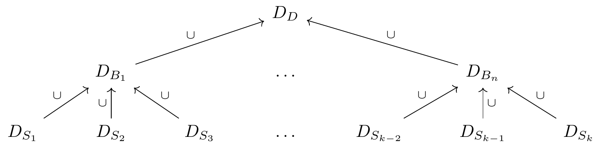

\newcommand\thena{⨾}

# Challenges {#problems}

Designing an interactive data visualization system presents a unique set of challenges. Some of these have been already touched on in the Section \@ref(litreview). This section homes in on these inherent challenges, discusses them in greater depth, and begins exploring avenues for possible solutions.

## The structure of this chapter: Data visualization pipeline

When creating visualizations, be they static or interactive, our ultimate goal is to render geometric objects that will represent our data in some way. However, it is rarely the case that we can plot the raw data directly, as is. Instead, before the data can be rendered, it often has to pass through several distinct transformation steps or stages. Together, these steps form a data visualization pipeline [see e.g. @chi2000; @wickham2009; @wu2024]. Each of these steps come with its inherent set of considerations and challenges, particularly when interaction is involved. 

Take, for instance, the typical barplot. There are several steps to drawing a barplot. First, we have to divide the data into subsets, based on the levels of some categorical variable. Second, we need to summarize or aggregate these subsets by some metric, usually either sum or count. Third, we need to take these summaries and map them to visual encodings, such as x-axis position, y-axis position, and length. Finally, we use these encodings and render the individual bars as rectangles on the computer screen [see e.g. @franconeri2021]. 

Thus, the data visualization pipeline can be described by four fundamental steps:

- Partitioning
- Aggregation
- Scaling/encoding
- Rendering

These four steps are common to both static and interactive visualization systems, however, interactivity does introduce some unique challenges. User interaction may affect any of the four stages, and as a result, changes need to be propagated accordingly. Finding a general and efficient solution to this change-propagation remains an open research topic [@wickham2009; @franconeri2021]. Consequently, discussions of the role interaction within the data visualization pipeline are often fairly vague [see @dimara2019; @wu2024].

This chapter attempts to clarify some of this conceptual ambiguity. Mirroring the structure of the  data visualization pipeline, it delves into each of the four steps and explores challenges related to their implementation in interactive systems. The central argument is that interaction is not just a thin veneer that can be layered on top of static graphics; instead, it fundamentally penetrates the abstract machinery of the pipeline. Moreover, for interaction to be predictable, intuitive, and efficient, the components of the pipeline must compose together in specific, well-defined ways, that may be described algebraically using the language of category theory. Mapping out this algebraic composition is crucial for building truly generic and robust interactive data visualization systems [see also @wu2024; @sievert2020].

## Partitioning

The first step of any data visualization pipeline is to divide the data into parts or subsets. The justification for this initial step lies in our ultimate goal: to draw one or (usually) more geometric objects [@wilkinson2012; also known as graphic items, @wills2008], representing some aspects of our data. Thus, before we can do anything else, we need to define the set of data points each geometric object will represent. In the typical case of two-dimensional tables or data frames, this amounts to slicing the table's rows into smaller sub-tables. 

The partitioning operation is fairly intuitive for aggregate plots, where each object represents multiple rows of the data. For instance, in a barplot, each bar represents a set of cases corresponding to a category, while in histogram, each bar represents a set of cases in which fall within the same bin along some continuous dimension. However, even one-to-one representations of the data can be viewed this way. For example, in a scatterplot or parallel coordinate plots, each geometric object represents one row of the data, which we can view as its own small table. Similarly, plots with a single geometric object (e.g. density/radar plots) have the underlying set equal to the whole data set.

Thus, the process of splitting our data into subsets is in some way fairly straightforward. However, it does raise two fundamental questions:

- How much of the original data should the subsets contain?
- What should be the relations between the subsets?

While common data visualization practices provide implicit solutions to these questions, explicit formulations are rarely given in the data visualization literature. This lack of conceptual clarity is problematic because how we choose to partition our data is a consequential decision; when we split our data into subsets, we make assumptions, about the data itself as well as the goals of the visualization process. In interactive data visualization particularly, the relations between the parts of our data become of key importance. Therefore, discussing the two questions above in greater depth is essential.

### Showing the full data {#show-all-data}

> "If someone hides data from you, it’s probably because he has something to hide." [@cairo2016, pp. 47]

A common recommendation that many data visualization experts provide is that faithful visual representations should show the full data and leave nothing out. The moral behind this recommendation is fairly intuitive. A visualization which hides or obscures information, be it by intent or negligence, cannot be considered a truthful representation of the underlying information [@cairo2016; @cairo2019]. 

However, data hiding can occur in many different ways. First, the data itself can be cherry-picked or massaged [see e.g. @lisnic2024]. This is arguably the most egregious case, and can in some cases amount to malicious statistical practices such as HARKing or p-hacking [see e.g. @kerr1998; @lisnic2024; @head2015]. However, even when showing the full data, some visualizations can obscure or downplay certain data features via poor design or incorrect use of visual encodings [@cairo2016; @cairo2019; @cleveland1985; @ziemkiewicz2009]. Finally, there is the issue of missing or incomplete data, where some data cannot be easily represented because it is simply not there.

An infamous example of data hiding leading to disastrous real-world consequences was the 1986 crash of the Space Shuttle Challenger [see @dalal1989]. During a pre-launch teleconference, engineers debated the effect of temperature on the performance of O-ring gaskets, as the forecasted temperature was significantly lower than during previous launches. The plot in the left panel of Figure \@ref(fig:challenger) was used to argue that there was no correlation between temperature and O-ring failures. However, this plot had one significant flaw: it excluded launches where no failures occurred. After the disaster, when the data including the zero-failure launches was plotted, it revealed a clear trend of increasing number of failures as temperature decreased [see right panel of Figure \@ref(fig:challenger), see also @dalal1989].    

```{r challenger}
#| echo: false
#| fig-cap: "Relationship between temperature and the number of O-ring failures within the 1986 Challenger data. Left: the original plot as presented during the pre-launch teleconference. Right: a reproduced plot of the same data, including the original data points (black), the excluded data points with zero failures (grey), and an estimated logistic regression fit (red). The source of right-panel data is @dalal1989."
knitr::include_graphics("./figures/challenger.png")
```

However, data hiding can also occur in more subtle ways, such as the above-mentioned poor design choices. Consider, for example, axis limits. @cleveland1985 argues that axis limits should generally be expanded to avoid inadvertently obscuring data near the edges of the plot [see also e.g. @chen2008, pp. 64].

```{r expanding-axis-limits}
#| echo: false
#| fig-cap: "Without expanding axis limits, objects near the edges of the plot become less salient. Left: axis limits match the data limits exactly, and so the points in the top-left and bottom-right corner of the plot are represented by smaller area and the overall trend is distorted. Right: by expanding axis limits, we can ensure that trend is represented faithfully."
knitr::include_graphics("./figures/expand-scatterplot.png")
```

Figure \@ref(fig:expanding-axis-limits) illustrates the effect of (not) expanding axis limits. The axis limits of the left scatterplot match the data limits exactly, which results in a misleading representation, since points near the edges of the plot are represented by smaller area (compared to points in the center of the plot). For instance, the point in the bottom-right corner of the plot lies simultaneously at the x- and y-axis limits, and is thus represented by only one-quarter of the area. In contrast, in the right scatterplot, the axis limits are expanded by a small fraction [5%, `ggplot2` default, @wickham2016], guaranteeing that all data points are represented by equal area^[Technically, this is also a function of the points' radii, and thus to definitely guarantee that no points will overlap the plot's edges, the axis limits would have to be expanded by a fraction that is greater than the radius of the largest point, however, this is rarely done in practice.].

Finally, there is the issue of data hiding due to missing or incomplete data, which is a bit more complicated. While techniques of visualizing data with missing values do exist [see e.g. @unwin1996; @tierney2023], they are often tied to specific visualization types and styles, and few general solutions are available. Properly analyzing the patterns of missingness in the data often calls for a full-fledged separate visualization workflow [@tierney2023]. 

Either way, data hiding is something we should be mindful of. Unless there is a clear and justifiable reason, no data should be arbitrarily removed or discarded, and we should pick good visual representations to represent all of our data faithfully. In the ideal case, the visualization should present a clear and unambiguous mapping between the graphics and the data [@ziemkiewicz2009].

### Disjointness and comparison

> "To be truthful and revealing, data graphics must bear on the question at the heart of quantitative thinking: 'compared to what'?" [@tufte2001, pp. 74].

> "Graphics are for comparison - comparison of one kind or another - not for access to individual amounts." [@tukey1993]

An interesting yet underappreciated fact is that, in many common visualizations, geometric objects within the same graphical layer represent disjoint subsets of the data. That is, in most plots, each point, bar, line, or polygon corresponds a unique set of data points (rows of the data), with no overlap with the other objects in that layer. While different layers can represent the same data (e.g., a smooth fit may be overlaid over scatterplot points, and point clouds may be plotted over boxplot boxes), between objects within the same layer, data is rarely shared. This practice, despite being so common to border on a rule, is surprisingly seldom discussed.

Counter-examples do exist, of course. For instance, certain visualizations of set-typed data "double up" the contribution of data subsets, such that the same subset of the data may appear in multiple objects [see e.g. @alsallakh2013; @alsallakh2014; @conway2017; @lex2014]. However, these types of visualizations are fairly rare, and represent the exception to the norm. When we see a barplot, we naturally expect each bar to represent a unique set of cases.   

But where does this tendency of visualizing disjoint parts of our data come from? Part of it may be just established norms. However, I propose that also, more deeply, the popularity of disjointness is rooted the fundamental purpose of data visualization: comparison [@tufte2001; @tukey1993]. When we visualize, we draw our graphics with the ultimate goal of comparing our data along a set of visual channels [@bertin1983; @wilkinson2012; @franconeri2021; @wilke2019], mirroring the comparisons we make about objects and events in the real world. And, I content that, in general, it is far easier to compare and reason about objects which are independent, rather than ones which overlap or share properties. 

#### The primarcy of disjointness

There is evidence from multiple fields to support the primacy of independence/disjointness. First, in computer science, disjointness is one of the fundamental properties of whole-part relationships [@stepanov2009, pp. 214], which are fundamental for building composable and well-behaved software components. Similarly, in probability theory, the basic rules of probability - the sum and product rules - as well as the many theorems which follow from them, have independence as a fundamental pre-condition [@kolmogorov2018]. Finally, empirical evidence from psychology, such as the well-known "Linda experiment" [@tversky1983], shows that people generally struggle with comparing the probabilities of non-disjoint events. Thus it seems that, in many ways, independence/disjointness presents a more natural, intuitive model.

Even more fundamentally, disjointness is related to a structure which mathematicians have long considered natural: a [bijection](#functions) or one-to-one mapping [see e.g. @fong2019; @lawvere2009]. Specifically, if we take a set $S$, split it into disjoint subsets, and then label each subset, then there is a one-to-one correspondence between these labels and the subsets (i.e. each label maps to an [equivalence class](#partition) on $S$). Practically, this means that we can go back and forth between the subsets and the labels, without any information loss.

The bijective property of dijsoint subsets may be particularly useful in data visualization and this in turn may explain the prevalence of disjoint visualizations, see Figure \@ref(fig:geoms-bijection). For instance, when drawing a barplot, if we divide our data into disjoint subsets and draw one bar corresponding to each part, then we can go back and forth between data subsets and bars (the function of identifying data subsets from bars is invertible). In plots where the objects are not disjoint, this correspondence is broken: if we select the set of cases corresponding to a bar, there may be no way to identify the original bar from the cases alone. In static visualizations, this issue impacts interpretability - the user has to remember that two separate objects in a plot may share the underlying data. In interactive plots, the lack of disjointness may have even more far-reaching consequences, which will be discussed in Section \@ref(disjointness-interaction). 

```{r geoms-bijection}
#| echo: false
#| fig-cap: "Disjointness induces a one-to-one mapping (bijection) between geometric objects and subsets of the data. Suppose we mark out the cases corresponding to the leftmost bar (red). Top row: when each geometric object (bar) represents unique subset of data points, we can easily go back and forth between the object and its underlying subset (middle panel), and so the function of picking cases corresponding to each object is invertible. Bottom row: if there is an overlap between the cases represented by each object, then there may be no way to identify the original object after we have picked out the corresponding cases."

```

However, first, let's explore disjointness and its absence in visualizations in more depth, on a real-world example.

#### Disjoint visualizations: Real-world example

To illustrate the idea of disjoint visualizations on concrete, real-world example, take the following barplot representing the vote share among the top three parties in the 2023 New Zealand general election [@election2023]:

```{r barplot-bijection}
#| echo: false
#| fig-cap: "Barplot showing disjoint subsets of the data. The bars show the vote share among the top three parties in the 2023 New Zealand general election, with each bar representing a unique subset of voters."
knitr::include_graphics("./figures/barplot-bijection.png")
```

Each bar represents a unique subset of voters and thus the bars show disjoint data. This is the type of data representation that we encounter most often, however, there are few explicit guidelines about this. Hypothetically, we could transform our data, and use the leftmost bar to show, for example, the union of the votes of National and Labour parties:

```{r union-geoms}
#| echo: false
#| fig-cap: "Barplot showing non-disjoint subsets of the data. Most of the bars show the same data as in Figure \\@ref(fig:geoms-bijection), however, the leftmost bar representing a union of National and Labour voters. The two leftmost bars are thus not disjoint. For a more realistic example, see Figure \\@ref(fig:union-geoms2)."
knitr::include_graphics("./figures/barplot-notbijection.png")
```

However, this way of representing the data has several problems. First, this type of visualization is arguably not very useful for addressing our visualization goals. For example, when visualizing election data such as the one above, we typically want to compare the relative number of votes each party received. Figure \@ref(fig:union-geoms) makes this comparison needlessly difficult. Specifically, since the leftmost bar represents the union of National and Labour votes, we have to perform additional mental calculation if we want to compare the number of votes received by National and Labour directly [@cleveland1985]. Second, we have metadata knowledge [see e.g. @wilkinson2012; @velleman1993] about the data actually being disjoint. We know that, in the New Zealand parliament electoral system, each voter can only vote for a single party. Hence, it does not make sense to arbitrarily combine the data in this way. Finally, Figure \@ref(fig:union-geoms) also needlessly duplicates information: the number of votes the National party received is counted twice, once in the leftmost bar and again in the second-from-left bar. This goes against the general principle of representing our data parsimoniously [@tufte2001].

Even when our goal is not to compare absolute counts, there are usually better disjoint data visualization methods available. For instance, if we were interested in visualizing the *proportion* of votes that each party received, we could instead draw the following plot: 

```{r stacked-proportion}
#| echo: false
#| fig-cap: "Even when proportions are of interest, there are usually disjoint data visualization techniques available. The plot shows proportion of vote share of the top three parties in the 2023 New Zealand general election, with each bar segment again representing a unique subset of voters."
knitr::include_graphics("./figures/barplot-bijection-proportions.png")
```

By stacking the bar segments on top of each other as in \@ref(fig:stacked-proportion), we can easily compare proportion of the total number of votes each party received, while retaining a disjoint representation. Each bar segment now again represents a unique subset of voters.

The example above is fairly clear-cut case of where disjoint data representation is the better choice. However, there are also more ambiguous situations, such as when multiple attributes of the data are simultaneously present or absent for each case. Take, for example, the 2020 New Zealand joint referendum on the legalization of euthanasia and cannabis. In this referendum, the two issues were included on the same ballot and voters would vote on them simultaneously. The legalization of euthanasia was accepted by the voters, with 65.1% of votes supporting the decision, whereas the legalization of cannabis was rejected, with 50.7% of voters rejecting the decision [@referendum2020].

We could visualize the referendum data in the following way:

```{r union-geoms2}
#| echo: false
#| fig-height: 3
#| fig-cap: "Barplot showing a more realistic example of non-disjoint data representation. The bars show the vote share cast by New Zealand voters in the joint 2020 referendum on euthanasia and cannabis. The two bars show (mostly) the same set of ballots, with each single ballot contributing to the height of one segment in each bar."
knitr::include_graphics("./figures/referendum-notbijection.png")
```

In Figure \@ref(fig:union-geoms2), both bars include votes cast by the same voter [ignoring the votes where no preference was given for either issue, @referendum2020], making the representation non-disjoint. In 
this case, the visualization works, since the underlying data is genuinely non-independent (each person cast two votes). If we had information about individual votes, it might be interesting to see how many people voted for both euthanasia and cannabis, how many voted for euthanasia but against cannabis, and so on. As was mentioned before, these types of visualizations can be useful for set-typed data [see e.g. @alsallakh2014]. 

However, even though the data here is fundamentally non-independent, there is often a way to represent it in a disjoint way that preserves most of the desirable properties. Specifically, we can split the data and draw it as separate plots or small multiples [@tufte2001]:  

```{r small-multiples}
#| echo: false
#| fig-height: 3
#| fig-cap: "Small multiple figure showing the non-disjoint data represented as disjoint bars. The bars again show the vote share cast by New Zealand voters in the joint 2020 referendum on euthanasia and cannabis, however, this time, each bar within one plot represents a unique subset of the cases."
knitr::include_graphics("./figures/referendum-bijection.png")
```

Here again, in Figure \@ref(fig:small-multiples), each bar (segment) in each plot represents a disjoint subset of voters.

#### Disjointness and interaction {#disjointness-interaction}

As I argued above, disjoint subsets offer a simpler mental model for understanding data visualizations. When each geometric object represents a unique set of data points, it becomes easier to reason about the comparisons being made. Conversely, when objects overlap or share underlying data points, additional cognitive effort is required to track the relationships between them.

Further, I argue that disjointness presents a particularly good model for interactive visualization [see also @wilhelm2008]. The natural correspondence between geometric objects and subsets of the data makes certain interactions more intuitive, and conversely, overlapping subsets can produce unexpected or unintuitive behavior. For instance, when a user clicks on a bar in a linked barplot, they might reasonably expect to highlight *that particular bar*, within the active plot, and the corresponding cases within all the other (passive) plots. If they see parts of other bars within the active plot get highlighted as well, they have to spend additional mental effort thinking about the relation between the objects (bars) and the subsets of the data, since this is no longer one-to-one.

Similar issue arises during querying. When a user queries an object that does not represent a disjoint subset of the data, should the returned summary statistics match the object or the (non-disjoint) subset? And how do we signal this to the user? Again, lack of disjointness introduces subtle ambiguities and complicates the interpretation of the presented information.

This does not mean that non-disjoint subsets cannot be usefuly combined with interaction, in specific contexts [see e.g. @alsallakh2014; @wilhelm2008]. However, I argue that, as a general model, disjointness provides a very good default. Disjoint subsets simplify our mental model, and this may be the reason why some authors discuss interactive features in the context of partitions, which are by definition disjoint [see e.g. @buja1996; @keim2002]. Likewise, many common data analytic operations, such as SQL aggregation queries [`GROUP BY`, @hellerstein1999], operate on disjoint subsets, and this may be another reason why this model is familiar.

### Plots as partitions

In the two preceding sections, I have argued that it is generally desirable for plots in our (interactive) data visualization system to have two fundamental features:

- Completeness: They should show the full data
- Distinctness: Geometric objects should represent distinct subsets of data points

These two features actually map onto two fundamental mathematical properties: [surjectivity](#Functions) and [disjointness](#Partitions). In turn, these two properties define a well-known mathematical structure: a [partition](#Partitions). Therefore, partitions offer a compelling model for structuring our plots. I propose the following definition of a *regular plot*:

:::{.definition name="Regular plot"}
Regular plot is a plot where the geometric objects within one layer represent a partition of the data, such that there is a bijection between these objects and (possibly aggregated) subsets of the original data.   
:::

Note that this definition still allows for plots where geometric objects in different layers represent overlapping data subsets, such as boxplots with overlaid points, or scatterplots with a smooth fit. 

I propose regular plots as a fundamental building block of our interactive data visualization system. By building our interactive figures out of regular plots [as small multiples, @tufte2001], we can ensure that the resulting visualization will be easily interpretable, even when combined with interactive features such as linking and querying.

#### Bijection on cases vs. bijection on subsets

Although I have not been able to find references conceptualizing plots as partitions in the same general way as I do here, some data visualization researchers have used the language of bijections when discussing graphics. For example, @dastani2002 discusses plots as bijections (homomorphisms) between data tables and visual attribute tables. Similarly, @ziemkiewicz2009, and @vickers2012 argue that, in order to be visually unambiguous, plots should represent bijections of the underlying data. Essentially, these researchers argue that plots should represent bijective mappings of the data tables, such that each object represents one row of the data.

However, this "one-row-one-object" model sidesteps the issue of aggregation (see also Section \@ref(aggregation)). It operates on the assumption that the data is pre-aggregated, such that, for instance, when we draw a barplot or a histogram, we start with a table that has one row per bar. This is rarely the case in practice. Most visualization systems incorporate aggregation as an explicit component of the data visualization pipeline [see e.g. @chi2000; @wickham2016; @satyanarayan2015; @satyanarayan2016; @wu2024]. Howeever, acknowledging aggregation presents a problem for the one-row-one-object model, since aggregation is, by definition, not injective. Once we aggregate multiple data points into a summary or a set of summaries, we cannot recover the original cases [see also @wu2024]. Thus, the model proposed by authors such as @dastani2002, @ziemkiewicz2009, and @vickers2012 would exclude many common aggregation-based types of plots, such as barplots and histograms. @ziemkiewicz2009 indeed do acknowledge that this is a problem, and admit that, at times, aggregation can be an acceptable trade-off, despite the inherent information loss.

However, if we instead model plots as bijection between *parts of data* and the geometric objects, rather than between individual *data points* and geometric objects, aggregation ceases to be a problem. Even after we aggregate a multiple-row subset of the data into a single row summary, this bijection is preserved. Thus, aggregation can be considered a part of the bijection. For instance, if we split our data into ten tables and aggregate each table, we are still left with ten tables of one row each that we can map bijectively to geometric objects.

#### Products of partitions

Many types of plots involve data that has partitioned or split across multiple dimensions. This is especially true in interactive data visualization, where features such as linking automatically induce another level of partitioning [@wilhelm2008]. This necessitates a general mechanism for combining partitions into products.

The concept of "product of partitions" may be best illustrated with code examples. Suppose we want to draw the following barplot:

```{r}
#| echo: false
#| message: false

df <- data.frame(group = factor(c("A", "A", "A", "B", "B", "C", "C", "C")),
                 selection = factor(c(1, 1, 2, 1, 2, 1, 2, 2)),
                 value = c(12, 21, 10, 9, 15, 15, 12, 13))
df2 <- aggregate(value ~ group + selection, FUN = sum, data = df)

knitr::include_graphics("./figures/barplot-partitions-products.png")
```

We start with the following data, which includes a categorical variable (`group`, plotted along the x-axis), a variable representing selection status (`selection`, used to colour the bar segments), and a continuous variable that we want to summarize (`value`):

```{r}
#| echo: false

library(kableExtra)

render_table <- function(x, ...) {
  knitr::kable(x, ...) |> kable_styling(full_width = FALSE)
} 

render_tables <- function(x) {
  n <- length(x)
  n_pairs <- floor(n / 2)

  for (i in seq_len(n_pairs)) {
    cat(knitr::kables(lapply(x[(2 * i - 1):(2 * i)], render_table)))
  }
  
  if (n %% 2 == 1) render_table(x[[length(x)]])
}

render_table(df, row.names = TRUE)
```

To draw individual bar segments, we need to sum `value` across the subsets cases corresponding to each segment. To do this, we first need to split our data into multiple subsets corresponding to the partition formed by taking the product of `group` and `selection` variables.

In R, the general data structure for representing partitions is the `factor` S3 class. In a `factor`, all elements of a vector are assigned a label, such that each label represent one disjoint part of the data. Unfortunately, there is no built-in function for creating a Cartesian product of two factors. However, we can easily emulate it using `paste` function to combine factor levels as strings element-wise:

```{r}
#| results: "asis"
product_factor <- paste(df$group, df$selection)
split_dfs <- split(df, product_factor)
render_tables(split_dfs)
```

We can then summarize each small data set by summing `value`:

```{r}
#| results: "asis"
summarized_dfs <- lapply(split_dfs, function(x) {
  aggregate(value ~ ., data = x, sum)
})

render_tables(summarized_dfs)
```

Finally, to "stack" the segments on top of each other, we need to combine the summaries back together, within the levels of `group` variable. We can do this by grouping the data sets by the `group` variable and taking their cumulative sum:

```{r}
#| results: "asis"
grouped_dfs <- split(summarized_dfs, sapply(summarized_dfs, function(x) x$group))
stacked_dfs <- lapply(grouped_dfs, function(x) {
  x <- do.call(rbind, x)
  x$value <- cumsum(x$value)
  rownames(x) <- NULL # Remove rownames for nicer formatting
  x
})

render_tables(stacked_dfs)
```

Now, we can combine these tables into one `data.frame` and render:

```{r}
#| eval: false
combined_df <- do.call(rbind, stacked_dfs)
# Need to reverse factor and row order for ggplot2 to layer segments correctly
combined_df$selection <- factor(combined_df$selection, levels = c(2, 1))
combined_df <- combined_df[6:1, ] 

ggplot(combined_df, aes(x = group, y = value, fill = selection)) +
  geom_col(position = position_identity())
```

```{r}
#| echo: false
#| message: false
knitr::include_graphics("./figures/barplot-partitions-products.png")
```

What we have just shown is an example of a simple split-apply-combine pipeline [@wickham2011]. This type of a pipeline is necessary in most types of plots and data visualization systems. For instance, the following `ggplot2` call produces a similar data visualization pipeline like the one we described above:

```{r}
#| eval: false
ggplot(data, aes(x, y, fill = fill)) +
  geom_bar(stat = "summary", fun = "sum")
```

To be more explicit, in the `ggplot2` call above, we specify that we want to partition the data set by the Cartesian product of the `x`, `y`, and `fill` variables. See the following comment from the [`ggplot2` documentation](https://github.com/tidyverse/ggplot2/blob/f46805349d6ca8ca7a99f8966cfa0f29279c2f6c/R/grouping.R#L7) [@wickham2016]:

```{r}
# If the `group` variable is not present, then a new group
# variable is generated from the interaction of all discrete (factor or
# character) vectors, excluding `label`.
```

We then compute whatever summary we want (`sum`). Finally, when a `fill` or `col` aesthetic is used with `geom_bar`, `ggplot2` also automatically stack the bars on top of each other by summing their heights. Similar strategy is employed for many other types of stacked plots, including pie charts, histograms, or density plots [@wickham2016]. 

#### Limits of flat product partitions

For many common plot types, a single "flat" product of all factors/partitions works reasonably well. However, for other types of plots, this simple model is not enough. Specifically, certain types of plots exhibit hierarchical relationships between the partitions which cannot be represented under this flat model [see also @slingsby2009; @wu2022].

To give a concrete example, let's turn back to the barplot from the section above (\@ref(plots-as-partitions)). To draw the barplot, we first split our data into smaller tables, summarized each table by summing the values, stacked the summaries by taking their cumulative sum, and finally used the resulting data frame to render bar segments. This gave us a stacked barplot, which is a good visualization for comparing absolute counts across categories. 

However, what if, instead of comparing absolute counts, we wanted to compare proportions? It turns out there is another type of visualization, called the spineplot, which can be used to represent the same underlying data as a barplot, however, is much better suited for comparing proportions: 

```{r barplot-spineplot}
#| echo: false
#| fig-cap: "The same underlying data represented as a barplot (left) and a spineplot (right)."

knitr::include_graphics("./figures/barplot-spineplot.png")
```

Like barplots, spineplots represent some summary statistic (usually counts), aggregated within the levels of a product of two categorical variables. However, unlike barplots, spineplots map the underlying statistics to both the y-axis position (height) and the bar width. Furthermore, the y-axis position is normalized, such that the heights of the different segments within the same category add up to one. This normalization makes it possible to compare the relative frequencies within categories directly (notice how the right panel in Figure \@ref(fig:barplot-spineplot) makes it obvious that the proportion of red cases within the B and C categories is the same). Thus, like the barplot, the spineplot is a valuable tool for visualizing categorical data, especially when we can use interactive features to switch from one type of representation to the other. 

Although barplot and spineplot represent the same underlying data, turning one into the other is not always easy. Specifically, while many grammar-based visualization systems offer a simple declarative syntax for defining barplots, they lack such simple syntax for spineplots. For instance, to draw a spineplot in `ggplot2`, we first need to do a substantial amount of data wrangling (creating the plot in the right panel of Figure \@ref(fig:barplot-spineplot) took over 10 lines of code, using standard `dplyr` syntax). This same hierarchical dependence applies to other "normalized" types of plots, such as spinograms, as well as innately hierarchical displays such as treemaps and mosaic plots [see e.g. @theus2002; slingsby2009].

### Partitions, hierarchy, and preorders {#hierarchy}

Why are spineplots so tricky? The reason is that they force us to confront the hierarchical nature of (interactive) graphics [@mcdonald1990; @keller2024]. Specifically, while in a barplot, we can get by with a single flat partition of the data, in a spineplot, the data is summarized and stacked *along and across* different levels of aggregation [@wu2024]:

- Along the x-axis, we stack the summaries *across the levels of the top-level factor/category*
- Along the y-axis, we stack the summaries *across the levels of a product of two factors* and normalize them by the values *within the levels of the top-level factor*.

For example, assume we have a data set with two categorical variables, with $j$ and $k$ levels respectively. If we want to render a spineplot using these two variables, it is not enough to simply split our data into $j \cdot k$ tables. Instead, we need to partition our data twice: first, split it into $j$ tables, and second, split it into $j \cdot k$ tables. We also need to keep track of which of the $j$ tables on the first level of partitioning *corresponds* to each of the $j \cdot k$ smaller tables. This automatically induces a hierarchical relationship, where the resulting data subsets form a graph - specifically, a tree - see Figure \@ref(fig:spineplot-tree):

```{r spineplot-tree}
#| echo: false
#| fig-cap: "A diagram of the hierarchical relationship between the subsets of the data represented by a spineplot/barplot. The whole data set is partitioned into bars, which are in turn partitioned into bar segments."
knitr::include_graphics("./figures/spineplot-tree.png")
```

In \@ref(fig:spineplot-tree), each vertical level represents a data partition, and arrows indicate relationships between data subsets, such that a bar subset is composed of segment subsets, and the whole data set is in turn composed of bar subsets. This same tree can be used to represent both barplots and spineplots. For a stacked barplot, this tree structure can be implicit, since we can work with the lowest level of the partitioning only (the segments; ignoring details such as maintaining correct stacking order). However, for spineplots, this hierarchical structure is essential. In spineplots, we apply transformations *across* the levels of the hierarchy: we need to normalize the statistics corresponding to each segment by the values within the parent bar. This is only possible if each segment can reference its parent bar in some way.

Thus, to be able to model a broad class of plots, we need a way to encode a hierarchical partitioning of our data. Furthermore, for reasons that will become clear later, it may be beneficial to introduce a more formal, mathematical framework for thinking about this hierarchy. A simple algebraic structure for encoding such class of hierarchies is a preorder.

#### Plots as preorders {#plots-as-preorders}

A [preorder](#preorders) is a binary relation on a set $S$, generally denoted by $\leq$, that is both reflexive and transitive. In simpler terms, given a preordered set $S$, any two elements $a, b \in S$ either relate ($a \leq b$, meaning $a$ is "less than" $b$), or they do not relate at all. Further, the relation obeys some common sense properties: every element relates to itself (reflexivity), and if $a$ relates to $b$ and $b$ relates to $c$, then $a$ relates to $c$ as well (transitivity).
 
We can turn our hierarchy of data subsets in Figure \@ref(fig:spineplot-tree) into a preorder very easily, by simply being more explicit about the relations, see Figure \@ref(fig:barplot-preorder). Specifically, define set $S$ as the set of data subsets $D$, with the individual subsets indexed by identity such that e.g. $D_D$ corresponds to the whole data set, $D_{B_1}, \ldots D_{B_n}$ correspond to bar subsets, and $D_{S_1}, \ldots D_{S_k}$ correspond to segment subsets. Further, define the binary relation $\leq$ as the set inclusion relation $\subseteq$.

```{r barplot-preorder}
#| echo: false
#| fig-cap: "A diagram of a barplot or spinogram, represented as a preorder ordered by set inclusion. $D_D$ represents the whole data set, $D_{B_i}$ represent bar subsets, and $D_{S_j}$ represent individual bar segment subsets. Arrows indicate set inclusion."
knitr::include_graphics("./figures/barplot-preorder.png") 
```

Then, we see that the two properties of preorders do indeed hold: every data subset is included in itself (reflexivity), and if a segment subset is a part of a bar subset, and bar subset is a part of the whole data set, then the segment subset is, clearly, a part of the whole data set as well (transitivity).

While set inclusion ($\subseteq$) is a perfectly valid way to describe the relation between data subsets, a slightly different perspective using set union $(\cup)$ will be more beneficial later. Specifically, instead of stating that a segment subset is included in a bar subset, we can express the relation by stating that a segment subset can be combined with another set to form the bar subset:

```{r barplot-preorder2}
#| echo: false
#| fig-cap: "A more precise version of the diagram of a barplot/spinogram, with the relation identified as set union with the sibling subsets."
 
```

This definition is still fairly vague, however, it will be made more precise in Section \ref(preorders-categories). To summarize the key points, our data subset hierarchy can be described as a preorder, where the ordering is defined by a kind of set union operation. This is really the same idea as Figure \@ref(fig:spineplot-tree), we are simply being more explicit about our data assumptions. The real utility of this approach will be revealed later, in Section \@ref(aggregation). However, for now, it may be useful to revise our definition of a regular plot:

:::{.definition name="Regular plot 2"}
Regular plot is a plot where the geometric objects within one layer represent a preorder of data subsets ordered by set inclusion/union (such that there is a bijection between these objects and the data subsets, and the subsets on the same order level represent a partition of the data). 
:::

#### The graph behind the graph

To summarize the main point of this entire section, *graphs are graphs*. As a bit of a playful side-note, this view is not shared by everyone. Particularly, the poster of the following meme shared on the Mathematical Mathematics Memes Facebook group [@mathematicalmathematics2024] might not agree:

```{r meme}
#| echo: false
#| fig-cap: "A joke image shared in the Mathematical Mathematics Memes Facebook group on the 28th of March, 2024 [@mathematicalmathematics2024]."
#| out-extra: 'style="border:1px solid black;"'
#| out-width: 75%
knitr::include_graphics("./figures/graphs-cosplayers.jpg")
```

I hope I have made a reasonably strong case here that many data visualization types are not "delusional cosplayers". By organizing our data into a preorder, we induce a graph-like, part-whole relationship on the subsets. Thus, graphs really are graphs. 

However, organizing our data into a preorder introduces a new kind of challenge: preserving the inherent structure. Preorders, as algebraic objects, have structure encoded in their order relations. Intuitively, it would be wrong to disregard this structure in the subsequent steps of the data visualization pipeline. For instance, imagine taking a barplot, dividing the bars into segments, and then stacking half of the segments while placing the other half side-by-side. Clearly, something would be wrong with this approach. Visualization methods should respect the inherent hierarchy within our data.

However, what does it *really* mean to respect the structure of our data? This question will be explored in detail in the following section, which deals with the next step of the data visualization pipeline: aggregation.   

## Aggregation

> “This system cannot produce a meaningless graphic, however. This is a strong claim, vulnerable to a single counter-example. It is a claim based on the formal rules of the system, however, not on the evaluation of specific graphics it may produce.” 
>
> “Some of the combinations of graphs and statistical methods may be degenerate or bizarre, but there is no moral reason to restrict them.”
>
> @wilkinson2012, The Grammar of Graphics, pp. 15 and 112. 

The second step of any data visualization pipeline is aggregation. Specifically, after we split our data into a hierarchy of parts (a preorder), we need to summarize each part via a set of summary statistics. Further, as I have hinted at in the previous section, these summaries should respect the hierarchical nature of the data. Thus, while the computing summaries may seem like a fairly straightforward step in the visualization pipeline, there is more complexity here than meets the eye. This will be the main subject of the present section.

### The relationship between graphics and statistics

A key issue in data visualization, which is also the central theme of the present thesis, concerns the relationship between graphics and statistics. Specifically, when we summarize our data and then render these summaries as geometric objects, an important question arises: can we pair arbitrary statistics and geometric objects? Or are there constraints which limit which statistics and geometric objects can be effectively combined, particularly when interaction is involved?

#### Independence: The grammar-based model

The approach of treating graphics and statistics as independent entities is highly appealing. Indeed, it is the cornerstone of the immensely popular "grammar-based" model of visualization, introduced by Wilkinson in his seminal work The Grammar of Graphics [-@wilkinson2012]. Under this model, visualizations are constructed out of independent, modular components, such as geometric objects, statistics, scales, and coordinate systems. See the following quote by Wilkinson [-@wilkinson2012, pp. 14-15]:

> "We have tried to avoid adding functions, graphs, or operators that do not work independently across the system. There are doubtless many statistical graphics the system in this book cannot completely specify. We can add many different graphs, transformations, types of axes, annotations, etc., but there are two limitations we will always face with a formal system.

The grammar-based model offers many advantages, including simplicity and expressive power. This has contributed to its widespread adoption and implementation in many data visualization systems [see e.g. @mcnutt2022; @kim2022; @vanderplas2020; @wickham2010; @satyanarayan2014; @satyanarayan2016]. The canonical example is the famous `ggplot2` package [@wickham2010]. In `ggplot2`, plots are built out of components such as geometric objects (called `geoms`), statistical summaries (`stats`), and scales. These components can be flexibly combined, allowing the user to express a wide range of graphics using a small set of primitives. The expressive power of `ggplot2` has made it one of the most popular R packages of all time.^[Being the top most downloaded CRAN package as of 4th of December 2024, @rmeta2024].

However, despite its advantages, the grammar-based model has one fundamental flaw: graphics and statistics are not truly independent [see also @wu2024]. Instead, the visual representation of data must be congruent with its mathematical properties. This constraint, while present even in static visualizations, becomes especially critical in interactive contexts. Let's illustrate this point with an example of real-world data.

#### Motivating example: Limits of independence {#stacking-not-graphical}

For this example, I will use famous data set from a study on the effect of smoking on child lung capacity [@tager1979; @kahn2005]. In the study, the researchers measured children's forced expiratory volume (FEV), and recorded it alongside age, height, sex, and smoking status.

A rather surprising feature of this data set is that, at a glance, the children who smoked actually had greater lung volume than non-smokers. In `ggplot2`, we can easily create a boxplot showing the relationship between smoking status and FEV using the following short code snippet:

```{r}
#| eval: false
#| fig: "Lung FEV of smokers and non-smokers within the @tager1979 study. Surprisingly, smokers seem to have greater lung volume on average compared with non-smokers."
fev <- read.csv("./data/fev.csv")

library(ggplot2)

ggplot(fev, aes(smoke, fev, fill = smoke)) +
  geom_boxplot()
# There is actually a bit more code involved in producing the plot below,
# but it all just has to do with design/aesthetic flair
```

```{r}
#| echo: false
knitr::include_graphics("./figures/grammar-boxplot.png")
```

Before we start extolling the benefits of smoking for juvenile lung health, it may be a good idea to first look at some confounding variables. Lung volume develops with age, and the researchers had collected data from children ages three and up. Clearly, there were not going to be many smokers among three-year olds, so we should make sure age is not a confounder. 

We can verify that there indeed is a strong relationship between age and FEV like so:

```{r}
#| eval: false
ggplot(fev, aes(age, fev, fill = smoke)) +
  geom_point()
```

```{r}
#| echo: false

```

From the plot above, we can see that age and FEV correlate strongly, and also that the smokers tend to be quite a bit older than the non-smokers. To visualize the distribution of smokers and non-smokers across age a bit more clearly, we can draw an ordinary stacked barplot:

```{r}
#| eval: false
ggplot(fev, aes(age, fev, fill = smoke)) +
  geom_bar()
```

```{r grammar-barplot-counts}
#| echo: false
#| fig-cap: "The number of participants by age and smoking status. Notice that the bar segments 'stack', such that the height of the whole bar accurately represents the combined number of smokers and non-smokers."
knitr::include_graphics("./figures/grammar-barplot-counts.png")
```

The plot above clearly shows that there were more smokers than non-smokers, and that smokers tended to be on average older. This provides a support for our confounding hypothesis.

Now, what if we wanted to compare FEV across the different ages? A data visualization novice might do something like below, and draw a stacked barplot of the average FEV in each age group:

```{r}
#| eval: false
ggplot(fev, aes(age, fev, fill = smoke)) +
  geom_bar(stat = "summary", fun = "mean")
```

```{r grammar-barplot-means}
#| echo: false
#| fig-cap: "A fundamentally flawed visualization of the average FEV by age and smoking status. Notice that the total height of the stacked bars is meaningless: it represents the sum of grouped averages, which is not a valid summary of the combined smoker and non-smoker data."
knitr::include_graphics("./figures/grammar-barplot-means.png")
```

At a glance, the plot in \@ref(fig:grammar-barplot-means) looks fine. However, what do the heights of the stacked bars actually represent? Each coloured bar segment represents a mean of the `fev` variable, grouped by the levels defined by the product of the `age` and `smoke` variables. By stacking the bars on top of each other, we are essentially summing up the average FEV of smokers and non-smokers, within the given age category.

#### Some statistics are stackable but others are not

The visualization in \@ref(fig:grammar-barplot-means) is problematic because the bar heights lack a meaningful statistical interpretation. The sum of group means is not something that most consumers of visualizations would know how to interpret or care about. In the previous example, in Figure \@ref(fig:grammar-barplot-counts), the heights of the stacked bars represented valid overall counts - the number of smokers and non-smokers within a given age category combined. In Figure \@ref(fig:grammar-barplot-means), this is no longer the case - the sum of the group means is different from the mean of the combined cases, and so may be the mean of the group means.

In `ggplot2`, stacking is implemented as a purely graphical operation. That is, within the context of the visualization system, stacking operates on geometric objects (rectangles), irrespective of the underlying summary statistics. However, as we can see from the example above, this can cause problems - *what* we stack matters. Indeed, many data visualization researchers have explicitly warned about this problem:

>"Stacking is useful when the sum of the amounts represented by the individual stacked bars is in itself a meaningful amount" [@wilke2019, p. 52].

>"Because this gives the visual impression of one element that is the sum of several others, it is very important that if the element’s size is used to display a statistic, then that statistic must be summable. Stacking bars that represent counts, sums, or percentages are fine, but a stacked bar chart where bars show average values is generally meaningless." [@wills2011, p. 112].

>"[...] We do this to ensure that aggregate statistics are always computed over the input data, and so users do not inadvertantly compute e.g., averages of averages, which can easily lead to misinterpretation." [@wu2022]

Based on the quotes above, one might get the impression that we can only ever "stack" or "highlight" sums and counts, to get a valid combined summary statistics. However, take a look at the following plot:

```{r}
# Code is not included because this plot cannot be recreated 
# with a simple ggplot2 call (without data wrangling)
```

```{r grammar-barplot-maximums}
#| echo: false
#| fig-cap: "The maximum of maxima is a valid maximum of all cases."
knitr::include_graphics("./figures/grammar-barplot-maximums.png")
```

Here, in Figure \@ref(fig:grammar-barplot-maximums), we again plot FEV for smokers and non-smokers across the different age groups, however, this time, we display the *maximum FEV* on the y-axis. From this plot, we can see that, in most of the age categories which included smokers (age 9 and up), the child with the highest lung capacity was a non-smoker, although there were a few exceptions (ages 11, 16, and 18). 

Notice one important feature of the plot above: the heights of the "stacked" bars represent a valid overall summary. Taking grouped data, summarizing each group by its maximum, and then taking the maximum of those maxima yields a valid overall maximum. That is, *the maximum of maxima is a valid maximum of all cases*. While the general usefulness of the plot in Figure \@ref(fig:grammar-barplot-maximums) could be debated - given that each bar effectively represents a single data point (the group maximum), and that, in small data sets, the maximum can be a highly variable [c.f. @wills2008] - the plot still demonstrates one important, undeniable fact: summaries other than sums and counts can be meaningfully "stacked."

Once we acknowledge this relationship between stacking and the statistics underlying our plot, we are fundamentally departing from the independence model described by @wilkinson2012 and implemented in, for example, `ggplot2` [@wickham2016]. Clearly, the view of stacking as a mere "collision modifier" [@wilkinson2012] is incomplete. While moving beyond the independence model means giving up on the ability to neatly separate geometric objects from the quantities they represent - which is certainly a significant loss - it also opens up new tantalizing avenues for inquiry. What is it that makes certain statistics combine together, such that the resulting visualization is valid under stacking? Can we describe this property formally? And how does this relate to the rest of the data visualization pipeline? Exploring these questions will be one of the core ideas of the present thesis.

#### Advantages of stacking: Part-whole relations {#stacking-part-whole}

However, before we go on to discuss what makes certain statistics stackable, we must first justify the focus on stacking. Specifically, some might argue that stacking is only one way of presenting partitioned data, and that we could equally well present "unstackable" summaries such as the averages in Figure \@ref(fig:grammar-barplot-means) by plotting the corresponding bars side by side (a technique know as dodging), or by plotting them on top of each other in semi-transparent layers, see Figure \@ref(fig:dodging-layering):

```{r dodging-layering}
#| echo: false
#| fig-cap: "Two alternative means of displaying partitioned data: dodging and layering."
 
```

Much has been written about the relative merits of stacking, dodging, and layering. For example, layering is only useful with few categories, as blending many colors can make it difficult to tell the categories apart [@franconeri2021; @wilke2019]. Further, in a landmark study, @cleveland1984 showed that people tend to be less accurate when reading information from stacked bar charts as opposed to dodged bar charts. Specifically, since the lower y-axis coordinate of a stacked segment is pushed up by the cumulative height of the segments below, it becomes difficult to accurately compare segments' length, both within and across bars [@cleveland1984]. Subsequent research has independently validated these findings and expanded upon them [see e.g. @heer2010; @thudt2016; @quadri2021]. Due to this suboptimal statistical legibility, many data visualization researchers have urged caution about stacking [see e.g. @byron2008; @cairo2014; @franconeri2021], and some have even discouraged its use altogether [@kosara2016; @wilke2019]. 

However, I contend that, while dodging and layering are indeed valuable techniques for static visualization, stacking offers significant advantages in interactive contexts. The issue comes down to how the three techniques represent the relatedness of data subsets. In dodging and layering, the only indication of the fact that two subsets are related is their spatial proximity. In contrast, in stacking, the stacked segments are both close together in space (proximity) and also combine together to form a single object [part-whole relationship, see also @slingsby2009]. Thus, in a stacked barplot, we can interpret an individual stacked segments as highlighted *parts* of a bar, whereas the same is not true for dodging or layering. This subtle distinction has important implications for the figure's visual properties and interactive behavior [see also @roberts2000; @wilhelm2008].

Take, for instance, the typical stacked barplot. Here, the heights of the stacked segments sum to total bar height, providing a fixed upper bound and a clear visual anchor, see Figure \@ref(fig:stacking-vs-dodging). This is particularly useful with linked selection. Even when the segment heights change, the total bar height remains constant, allowing us to maintain a fixed upper y-axis limit, for instance. This leads to predictable plot behavior: the highlighted segments will never "grow" outside of the plotting area. Additionally, computational overhead is also reduced, since the axis limits only need to be recomputed *when total bar heights change* (e.g. changing binwidth in a histogram), not when the segment heights change. These advantages extend beyond barplots: whenever we represent selection by highlighting interior parts of geometric objects, the resulting interaction will behave more "consistently" and we can save computational resources by caching the quantities associated with the whole objects.   

```{r stacking-vs-dodging}
#| echo: false
#| fig-cap: "Stacking has advantages over dodging (and layering) when it comes to displaying linked selection. Plots left to right show simulated static snapshots of more cases being selected (red). In a stacked barplot (top row), the heights of the higlighted segments are always bound by the height of the whole bar, and so the outline of the figure remains constant. In contrast, in a dodged barplot, the bar segment heights are not bounded, leading to the outline of the figure fluctuating dramatically (notice the changing upper y-axis limit)."
knitr::include_graphics("./figures/stacking-vs-dodging.png") 
```

This is not the case for dodging and layering. Here, the segment heights are unbounded, meaning that heights of the selected segments may exceed those of unselected segments. This forces us to choose between making the upper y-axis limit reactive (losing the context that the limit provides, whenever selection happens), or risking the segments growing outside the plot area. Moreover, I contend that the lack of visual anchoring creates significant visual noise. Research shows that translating and looming stimuli capture attention [@franconeri2003]. Because selection may translate the top edges of the dodged/layered bar segments in unpredictable ways, it follows that the resulting animation will be more visually distracting and harder to follow.

Surprisingly, little research has explored the perceptual and computational benefits of part-whole object relations. I have been able to find only two relevant references: Wilhelm [@wilhelm2008], who discusses the topic in the context of the visual properties of linked selection, and Sievert [@sievert2020], who focuses more on the computational aspects. Given the key importance of this topic to the main ideas of the present thesis, I will examine the content of these two referenes in more detail.

@wilhelm2008 outlines three strategies for displaying selection: replacement, overlaying, and repetition. Within the context of the three techniques discussed above (stacking, dodging, and layering), overlaying essentially conflates both stacking and layering, repetition is equivalent to dodging, and replacement involves re-rendering the entire visualization upon selection. Wilhelm notes that replacement is a flawed strategy because it entirely discards contextual information such as axis limits. He also argues that repetition is less commonly used due to the necessity of re-arranging the plot upon selection. Finally, he identifies two issues with overlaying: the fact that plot parameters are inherited from the plot representing the whole data set, and the fact that parts of the original plot may become obscured by the highlighted subset. Ultimately, he appears to favor repetition over the other two methods.

Sievert [@sievert2020, Chapter 17], discusses the computational challenges related to rendering linked views with Shiny [@shiny2024] and `plotly` [@plotly2023]. He discusses the problem of making comparisons when plot context (provided by parameters such as axis limits) is lost during selection, and mentions how retaining the context of the "whole bars" improves computational efficiency, since the entire plot does not have to be re-rendered from scratch. To address this, Sievert provides a solution in the form of a fixed "base layer", which he acknowledges "may seem like a hack", but provides a better user-experience.

My conclusion aligns fairly closely with @sievert2020, but diverges somewhat from @wilhelm2008. Contrary to Wilhelm, I contend that, while overlaying/stacking is less flexible than repetition/dodging, layering, and replacement, it is nevertheless the superior method, since it ensures that the context of the whole data set is always preserved. Conversely, repetition/dodging - the method favored by Wilhelm - suffers from the same contextual information loss as replacement. Specifically, if we draw highlighted subsets as separate objects, then, in the general case, we have to make axis limits reactive. What @wilhelm2008 sees as one of the problems with overlaying/stacking - the fact that plot parameters are inherited from the whole data - I instead see as a fundamental strength, similar to @sievert2020. However, unlike Sievert, I go further in positing that something like Sievert's "fixed" base layer should not just be an accidental workaround, but instead a fundamental concept in how the data visualization pipeline is structured. Maintaining part-whole relations between geometric objects and highlighted segments ensures that interaction will be computationally efficient and always preserve context.

### Stackable summaries: A brief journey into Category Theory

Let's briefly recap the key points so far. In section \@ref(partitioning), I advocated for modeling plots as a hierarchy of partitions, particularly a preorder of data subsets ordered by set union. Starting with the full data set, we divide it into disjoint subsets, each corresponding to a geometric object. These subsets can then be further subdivided, representing parts of those objects (such as those resulting from linked selection). As discussed in Section \@ref(hierarchy), we end up with a tree-like structure that encodes this part-whole relationship, which can be formally described as a preorder.

Further, in Section \@ref(stacking-not-graphical), I demonstrated on the example \@ref(fig:barplot-maximums) that some "stackable" summary statistics have the property of preserving the part-whole relationships in the data hierarchy, whereas others do not. I have also and pointed to other researchers who have noted this problem. Additionally, I have argued that preserving these part-whole relationship in our visualizations is desirable, particularly when interaction is involved. They simplify certain interactive behaviors, make them more intuitive and "natural," and reduce the workload interactive data visualization systems need to do.

Now it is finally time to discuss what makes certain statistics stackable. To do this, I will need to use some concepts from category theory. These concepts are described in greater detail in the [Appendix: Mathematical Theory](#mathematical-theory) - the reader is advised to consult this section if they are unfamiliar with the material (links to appropriate sections will also be provided throughout the text). As a final note, although category theory is a very complex field, only introductory concepts - which are sufficient for our purposes - will be used here.

#### Generalizing preorders: Categories {#preorders-categories}

Previously, I had formalized the hierarchy of data subsets as a preorder, an algebraic concept with a structure that we want to preserve. However, to truly formalize the concept of preserving structure, we need to take one more step towards abstraction. Specifically, it is necessary to recast preorders as categories, a fundamental concept in category theory.

The definition of a [category](#categories) is quite straightforward. In simple terms, a category $\mathcal{C}$ is just a collection of objects, connected by arrows, that conforms to several properties. More specifically, when we have a category $\mathcal{C}$:

- We have a collection of objects $\text{Ob}(\mathcal{C})$
- For every pair of objects $c_1, c_2 \in \text{Ob}(\mathcal{C})$, there is a set of of arrows (morphisms) $c_1 \to c_2$ (this set of arrows is often denoted as $\mathcal{C}(c_1, c_2)$)

Further:

- Every object $c \in \text{Ob}(\mathcal{C})$ has special arrow $\text{id}_c$ pointing back to itself (called the identity morphism)
- Arrows compose. That is, if there is an arrow $f$ from object $c_1$ to object $c_2$, and an arrow $g$ from object $c_2$ to object $c_3$, we can define a composite arrow $f \thena g$ from $c_1$ to $c_3$

Finally, the arrows need to conform to two properties:

- Composing with the identity morphism leaves arrows unchanged: $\text{id}_{c_1} \thena f = f \thena \text{id}_{c_2} = f$
- Composition is associative: $f \thena (g \thena h) = (f \thena g) \thena h = f \thena g \thena h$

For example, the following is a diagram of a simple category with two objects and a single non-identity morphism, called $\underline{\textbf{2}}$:

```{r category-two1}
#| echo: false
knitr::include_graphics("./figures/category-two.png")
```

Here, the morphism $f$ simply means we can get from object 1 (left) to object 2 (right). Based on the rules of a category, we can infer that, for example, $(\text{id}_1 \thena f) \thena \text{id}_2 = \text{id}_1 \thena (f \thena \text{id}_2) = f$. As a final note, since the identity arrows are always present, they are often not drawn explicitly in diagrams of categories (however, they are presumed to be there). 

Now, what are the objects? What are the arrows? That is all left for us to specify. For example, the objects and arrows could be elements of a set and relations, sets and functions, or even entire categories and a generalizations of functions called functors (which we will discuss later). This abstract nature of categories can be initially difficult to grasp. However, there are some fairly straightforward examples that can help. 

A key example, relevant to our discussion, are preorders. Specifically, it can be shown that every preorder is in fact a category. Given a preorder on a set $S$, define the objects $c \in \text{Ob}(\mathcal{C})$ as the elements in $s \in S$, and, for any two objects $c_1$ and $c_2$, define at most one morphism $c_1 \to c_2$ if $c_1 \leq c_2$ (and no morphism if $c_1 \not \leq c_2$). Then, the two properties of preorders just fall out of the definition of a category:

- Reflexivity: this is just the identity morphism. For every $c \in \text{Ob}(\mathcal{C})$, we have $\text{id}_c : c \to c$
- Transitivity: this is just composition of morphisms. Given $f: c_1 \to c_2$ ($c_1 \leq c_2$) and $g: c_2 \to c_3$ ($c_2 \leq c_3$), we can define $h: c_1 \to c_3$ as $h = f \thena g$ ($c_1 \leq c_3$)

In our concrete case of preorder of data subsets ordered by set union, we can easily reuse the diagram from Section \@ref(plots-as-preorders) - Figure \@ref(fig:barplot-preorder2) - and re-intepret it as a category $\mathcal{D}$:

```{r}
#| echo: false
 
```

Here, the objects are again just the data subsets, such as the whole data set $D_D$, the bar subsets $D_{B_i}$, and the segments $D_{S_j}$. The morphisms are the arrows indicating set union. As before, the fact that there is an arrow between $D_{S_1}$ and $D_{B_1}$ simply means that Segment 1 can be combined with another set to form Bar 1 (and the absence of an arrow between $D_{S_1}$ and $D_{S_2}$ indicates that segments are disjoint). Identity morphisms are not explicitly shown, but they are of course present (every subset can be combined with the empty set $\varnothing$ to get back the original set). Finally, as mentioned above, reflexivity and transitivity automatically fall out of the definition of a category.

Further, this categorical definition allows for a more precise description of the relationships in the figure.   Whereas in a preorder, the relation is assumed to be homogeneous between all objects, a category allows for distinct morphisms between objects. Thus, instead of simply stating that the relation $\cup$ represents union with some unspecified set, we can explicitly define it as *union with all other sibling sets* and label the corresponding arrows appropriately. While labeling the entire graph would create visual clutter, the following example demonstrates this approach for a portion of the diagram, specifically the subsets corresponding to Bar 1:

```{r barplot-preorder3}
#| echo: false
#| fig-cap: "A diagram of a part of the barplot/spineplot category, with all of the morphisms described explictly."
 
```

Figure \@ref(fig:barplot-preorder3) illustrates the simple fact that Bar 1 is formed by combining the data subset of Segment 1 with those of Segments 2 and 3 using the set union operator (and similarly for Segments 2 and 3). In some way, it is simply a more detailed, zoomed-in view of a section of Figure \@ref(fig:barplot-preorder2). We could in fact go further and add nodes representing pairwise unions of sets, e.g. $D_{S_1} \cup D_{S_2}$, however, this is not strictly necessary.  

Even though the benefits of re-formulating our data hierarchy in this abstract way may still not be entirely apparent, I encourage the reader to bear with me. In the next sections, I will show the advantages of thinking about our data and visualizations categorically.

#### Structure preserving maps: Functors

A second fundamental concept in category theory is that of a structure-preserving map or a [functor](#functors). A functor is a mapping from one category to another which preserves the relationships within the first category [this can also be thought of as drawing a diagram of the the first category inside the second category, @fong2019]. 

In more precise terms, a functor $F: \mathcal{C} \to \mathcal{D}$ is a mapping from category $\mathcal{C}$ to category $\mathcal{D}$ such that:

- Every object in $c \in \text{Ob}(\mathcal{C})$ is mapped to some object $d \in \text{Ob}(\mathcal{D})$
- Every morphism $f: c_1 \to c_2$ in $\mathcal{C}(c_1, c_2)$ is mapped to some morphism in $\mathcal{D}(F(c_1), F(c_2))$, i.e. $F(f): F(c_1) \to F(c_2)$

Further, this mapping is subject to two fundamental properties:

- Identities are preserved: $F(\text{id}_c) = \text{id}_{F(c)}$
- Composition is too: $F(f \thena g) = F(f) \thena F(g)$

The first property is fairly intuitive and simply states that objects cannot be separated from their identities. The second property is more interesting, since it tells us that all compositions (chains of arrows) must be preserved. Other than that, we are free to map the objects and arrows as we wish. For instance, we can map multiple objects in $\text{Ob}(\mathcal{C})$ to a single object in $\text{Ob}(\mathcal{D})$, "squish" a morphism (or a chain of morphisms) in $\mathcal{C}$ by mapping it to an identity morphism in $\mathcal{D}$, or "stretch" a morphism in $\mathcal{C}$ by mapping it to a composite morphism in $\mathcal{D}$. However, we cannot "rip" or "tear" any morphism or chain of morphisms in $\mathcal{C}$ into multiple morphisms or chains in $\mathcal{D}$. 

This second property of preserving composition can be described by the following commutative diagram:

```{r functor}
#| echo: false
#| fig-cap: "A commutative diagram showing how a functor $F$ preserves associativity. $A$, $B$, $C$ are objects in category $\\mathcal{C}$, $F(A)$, $F(B)$, $F(C)$ are objects in category $\\mathcal{D}$, $f$ and $g$ are morphisms in $\\mathcal{C}$, and $F(F)$ and $F(g)$ are objects in $\\mathcal{D}$."
knitr::include_graphics("./figures/functor.png")
```

Here, $A$, $B$, and $C$ are three objects in category $\mathcal{C}$ and $F(A)$, $F(B)$, and $F(C)$ are the same three objects mapped to category $\mathcal{D}$ (and the same for morphisms $f$ and $g$). The diagram commuting means that following any two parallel arrows (same source and destination) gives us the same result. For instance, to get from $A$ to $F(C)$, we may either:

- Map $A \to C$ (via $f \thena g$) and then apply the functor ($F(\text{id}_C)$)
- Map $A \to B$ (via $f$), apply the functor ($F(\text{id}_B)$), and then map $F(B) \to F(C)$ (via $F(g)$) 
- Apply the functor immediately ($F(\text{id}_A)$) and then map $F(A) \to F(C)$ (via $F(f \thena g) = F(f) \thena F(g)$)

The second property of functors states that all of the above paths must lead to the same object $F(C)$ (if $F$ is a functor).

#### Aggregation: A functor from the preorder of data subsets to the preorder of summary statistics {#aggregation-functor}

As we have established before, when visualizing data, we may start with a category/preorder of data subsets ordered by sibling subset union, as in Figure \@ref(fig:barplot-preorder2) (reproduced below for reminder). We would like to translate these data subsets into summary statistics, in a way that preserves the inherent structure in the data. As we will see, the appropriate way to do this is via a functor.

```{r barplot-preorder22}
#| echo: false
#| fig-cap: "Reproduction of Figure \\@ref(fig:barplot-preorder2): a diagram of a barplot/spineplot represented as a preorder/category ordered by set union."
 
```

But first, let's discuss the summary statistics. Since we want to summarize each data subset, then, it is given that we should end up with an equal number of summaries. For instance, if $D = \{ D_D, D_{B_1}, \ldots D_{B_n}, D_{S_1}, \ldots, D_{S_k} \}$ is the set of data subsets corresponding to the whole data set, bars, and segments, respectively, and $S$ is the set of summaries, then $\lvert D \lvert = \lvert S \lvert$. Further, since the elements of $D$ are actually objects in a category ($\mathcal{D}$), then, intuitively, $S$ should be a part of a category as well, let's call it $\mathcal{S}$. 

If the elements of $S$ are objects in a category $\mathcal{S}$, what should be the morphisms? In the category of data subsets $\mathcal{D}$, the morphisms are given by union with the sibling subsets. In the category of summaries, we want the morphisms to reflect some operation that "behaves like set union", such that it represents the operation of *combining sibling summaries*. We can label this operation with the symbol $\otimes$, such that the resulting category looks as follows:

```{r barplot-preorder4}
#| echo: false
#| fig-cap: "A diagram of barplot/spineplot summary statistic preorder/category, ordered by the combination operator $\\otimes$." 
 
```

As before, each $\otimes$ in the diagram above corresponds to the operation of combining a summary with the other sibling summaries, such that, for example, the label for the arrow $S_{S_1} \to S_{B_1}$ should be $- \otimes S_{S_1} \otimes S_{S_2}$. In words, "a segment summary combines into a bar summary".

Now comes the key point. Suppose that we have some summary function $F: D \to S$ which maps data subsets to summaries. To preserve the structure of $\mathcal{D}$, the operation should be a functor $F: \mathcal{D} \to \mathcal{S}$, which maps data subsets in $D$ to summaries in $S$ and set unions $D_i \cup D_j$ to combinations of summaries $S_i \otimes S_j$, such that composition and identities are preserved. Specifically, by substituting our morphisms into the composition-preserving property of functors:

$$F(- \cup D_{i} \thena - \cup D_{j}) = F(- \cup D_i) \thena F(- \cup D_j)$$

The expression above appears somewhat awkward due to the mixing of function expressions with the binary operator $\cup$ and the composition operator $\thena$ (i.e. if instead of $- \cup D_i$ and $- \cup D_j$ we had $f$ and $g$, the expression $F(f \thena g) = F(f) \thena F(g)$ would look much cleaner, even though it expresses the same concept). However, it can be greatly simplified by noting two facts:

- $F(- \cup D_i ) = - \otimes F(D_i)$. This follows from the definition of our functor: the union operator is mapped to combining summaries in the summary category.
- We can omit the composition operator $\thena$. This is due to the fact that $\cup$ and $\otimes$ are associative binary operators (associativity follows from the definition of composition in categories). As an example, if $f(x) = - \otimes 2 = x + 2$, then we can write $[f \thena f](x) = f(f(x)) = ((x + 2) + 2) = x + 2 + 2$)

This leads to the following simplification:

$$F(- \cup D_i \cup D_j) = - \otimes F(D_i) \otimes F(D_j)$$

Finally, without loss of generality, we can choose the empty set $\varnothing$ as the subset being operated on ($-$), and then the equation reduces to:

\begin{equation}

F(D_i \cup D_j) = F(D_i) \otimes F(D_j)
(\#eq:summary-functor-composition)

\end{equation}

In other words, when summarizing data, *it should not matter whether we first take the union of the underlying data and then summarize the resulting superset, or first summarize the subsets and then combine the summaries via the combination operator $\otimes$ (i.e. the summary should distribute across set union)*.

Finally, we should note that, to be fully functorial, the operation should also preserve identities:

\begin{equation}

F(\text{id}_{D_i}) = \text{id}_{F(D_i)}
(\#eq:summary-functor-identity)

\end{equation}

#### Functorial summaries and set union

Let's explore the functoriality of summary statistics in more concrete terms. First, as was mentioned in Section \@ref(plots-as-preorders), the identity morphism for a data subset is just union with the empty set, $- \cup \varnothing$. Therefore, preserving identities as per Equation \@ref(eq:summary-functor-identity) amounts to:

\begin{align}

F(\text{id}_{D_i}) &= F(D_i \cup \varnothing) \\
                   &= F(D_i) \otimes F(\varnothing) \\ 
                   &= F(D_i) \otimes e \\
                   &= F(D_i) = \text{id}_{F(D_i)}
\end{align}

This means that the summary operation $F$ must be defined for the empty set, and should return some "neutral" element $e = F(\varnothing) \in S$, which, when combined with any other summary, just returns the same summary back. 

Second, as per Equation \@ref(eq:summary-functor-composition), the summary should distribute across set union via the combination operator $\otimes$:

$$F(D_i \cup D_j) = F(D_i) \otimes F(D_j)$$

This distributive property should hold over *all* disjoint subsets of the data as these correspond to all possible arrows we can draw in the set union diagram of the data subset preorder (Figure \@ref(fig:barplot-preorder2)). Further, given any set $D_i \in D$, the smallest possible (non-empty) disjoint subset is a single data point (row) $d_j \in D_i$. Thus, the summary operation should distribute over individual data points:

$$F(d_1 \cup d_2 \cup \ldots \cup d_n) = F(d_1) \otimes F(d_2) \otimes \ldots \otimes F(d_n)$$

Thus, from a certain point of view, $F$ *is* the binary combination operator $\otimes$^[Technically, if $d_i$ represents a single data row, with multiple named data values corresponding to columns, the summary operation $F$ should also select the appropriate value(s) while remaining closed under repeated applications. For instance, if we are summarizing a variable named `x`, the following R function fullfills these criteria: `pick_sum <- function(s, d) ifelse(is.numeric(d), s + d, s + d$x); Reduce(pick_sum, lapply(1:3, \(n) list(x = n)), 0)`.]. With a bit of handwaving, we can write:

$$F(d_1 \cup d_2 \cup \ldots d_k) = d_1 \otimes d_2 \otimes \ldots d_n$$

Just to drive the point home, we can also follow the equality the other way, starting with combining the summaries of two data subsets $F(D_i)$ and $F(D_j)$. Then:

\begin{align}

F(D_i) \otimes F(D_j) &= (d_{i1} \otimes d_{i2} \otimes \ldots d_{in}) \otimes (d_{j1} \otimes d_{j1} \otimes \ldots d_{jk}) \\
&= d_{i1} \otimes d_{i2} \otimes \ldots d_{in} \otimes d_{j1} \otimes d_{j1} \otimes \ldots d_{jk} \qquad \text{(by associativity)} \\
&= F(D_i \cup D_j)

\end{align}

Again, this shows that combining summaries leads to a valid summary of the underlying set union, which is precisely the desired property we set out to find.

Finally, we can also consider the case when $F$ is *not* functorial, i.e. $F(D_i \cup D_j) \neq F(D_i) \otimes F(D_j)$. This corresponds to a situation where the summary of the superset somehow contains some additional "non-additive" information that the summaries of either of the two subsets do not. More generally, these situation where the *whole is more than "sum" of its parts* are called an *interactive* or *generative effects* [@adam2017; @fong2019]. Generative effects apply to a broader class of mappings than just the specific case with set union we have outlined here, however, the idea of (not) preserving composition ($F(f \thena g) \neq F(f) \thena F(g)$) is the same. For our summary statistics to be well-behaved under features like linked selection, they should *not* have any kind of generative effect.   

#### Whole equal to the sum of its parts: Monoids

Above, I have argued that, for plots to be well-behaved under certain kinds of interactions such as linked selection, the summary statistics we display should *"behave like set union"*. Specifically, they should be a functor from the preorder of data subsets, such that combining two summaries gives the same result as summarizing the union of the underlying data. Conversely, the summary of the union should result in no non-additive "surprises" or generative effects. 

The framing of the summary mapping $F$ as functor has lead to two key insights: the summary statistic should be based on some binary associative operation $\otimes$, and the summarized values should be equipped with some "neutral" value that is the result of summarizing an empty set. It turns out there is a well-known algebraic structure with these exact properties: a monoid. 

Formally, a monoid $(M, e, \otimes)$ is a set $M$ equipped with a binary operation $\otimes$ and a special neutral element $e$, such that the operation is:

- Unital: $m \otimes e = e \otimes m = m$ for all $m \in M$
- Associative: $(m_1 \otimes m_2) \otimes m_3 = m_1 \otimes (m_2 \otimes m_3) = m_1 \otimes m_2 \otimes m_3$

These are exactly the properties we were looking for. In other words, if the summary statistic is a monoid, it behaves like set union. The summary functor $F$ then just acts the following way:

- For the empty set, it just returns the neutral value: $F(\varnothing) = e$
- For a non-empty set $D_i$, it "folds" the set by repeatedly applying the combination operator: $F(D_i) = F(\{d_{i1} , d_{i2}, \ldots, d_{in} \}) = d_{i1} \otimes d_{i2} \otimes \ldots \otimes d_{in}$

Monoids are well-known in category theory and functional programming. When $M$ is the set of real numbers, a typical example is the summation $(\mathbb{R}, 0, +)$ (which we are familiar with as the "default" summary statistic in typical barplots). Other examples include the product $(\mathbb{R}, 1, \cdot)$ and maximum operators $(\mathbb{R}, \max, -\infty)$. However, the set $M$ does not have to be only numbers. For example, the set of strings with the concatenation operator $\text{++}$ and the empty string $\text{""}$ as the neutral element forms a valid monoid:

$$\text{"hello" ++ ""} = \text{"" ++ "hello" } = \text{"hello"} $$
$$\text{"quick " ++ (" brown" ++ " fox")}  \text{} = \text{("quick " ++ " brown ") ++ " fox"} = \text{"quick brown fox"}$$

While most summary statistics we care about in data visualization are quantitative, the fact that some non-numeric data summaries can behave like set union may be still interesting to ponder.

Further, even the set union $\cup$ operation itself forms a monoid, with the empty set $\varnothing$ as the neutral/identity element. Thus, in a certain way, the mapping of data subsets to summaries $F$ can be seen as a mapping between two monoids: a *monoid homomorphism* (which is just an abstract algebra term for a functor between monoids). However, $F$ is more than just a monoid homomorphism; monoids alone do not capture the hierarchical structure of $\mathcal{D}$ and $\mathcal{P}$. Instead, $F$ is a mapping between two categories that have the features of both a monoid *and* preorder. As a sidenote, a monoid that is also a preorder is called, unsurprisingly, a *monoidal preorder* [@nlab2024e]. Thus, $F$ could technically be called a *"monoidal preorder homomorphism"*, however, I believe it is far easier and clearer to simply refer to $F$ as a functor.

As a final note, a key consequence of the associativity of monoids is linerizability. Specifically, an arbitrary expression built with an associative binary function $f$, e.g. $f(f(x, y), f(z, f(u, w)))$ can always be rewritten as a linear sequence of steps (e.g. $f(x, f(y, f(z, f(u, w))))$). This effectively flattens the expression tree into a linear chain [@adam2017].

#### Programming with monoids

Monoids translate well to code and are in fact frequently used in programming, particularly functional programming [see e.g. @milewski2018; @stepanov2009; @stepanov2014]. Further, we can even test whether an arbitrary summary function conforms to our specific functorial properties. For instance, in R, if we replace the set union operation with vector/array concatenation (the `c()` function), and provided that we have some three representative data vectors `x`, `y`, and `z`, we can test associativity as follows:

```{r}
#| results: "hold"
x <- 1:10
y <- 11:20
z <- 21:30

#     F(f; g)       =     F(f);F(g)
sum(c(c(x, y), z)) == sum(c(sum(c(x, y)), z))
mean(c(c(x, y), z)) == mean(c(mean(c(x, y)), z))
```

Likewise, we can easily test the unitality property with a given neutral element `e`. We could even create a wrapper function to test whether a given function with a neutral element forms monoid:

```{r}
#| results: "hold"

is_unital <- function(fn, e, x) {
  # Test two-sided unitality
  (fn(c(e, x)) == fn(c(x, e))) && (fn(c(e, x)) == fn(x))
}

is_associative <- function(fn, x, y, z) {
  fn(c(c(x, y), z)) == fn(c(fn(c(x, y)), z))
}

is_monoid <- function(fn, e, x, y, z) {
  is_unital(fn, e, x) && is_associative(fn, x, y, z)
}

string_concat <- function(x) paste0(x, collapse = "")
l2_norm <- function(x) sqrt(sum(x^2)) # Aka euclidean norm/vector length

is_monoid(sum, 0, x, y, z)
is_monoid(max, -Inf, x, y, z)
is_monoid(prod, 1, x, y, z)
is_monoid(string_concat, "", "a", "b", "c")
is_monoid(l2_norm, 0, x, y, z)
is_monoid(mean, 0, x, y, z)
is_monoid(median, 0, x, y, z)
is_monoid(sd, 0, x, y, z)
```

A couple of points. First, based on what we have shown before, we could simplify our task by defining `fn` to a binary function which takes two (scalar) arguments instead of a vector. This binary formulation would demonstrate that, for example, `mean2 == median2 == function(x, y) (x + y) / 2` (median of even number of elements is the average of the middle two), and so if we can show that `(x + y) / 2` is not associative, we disprove both `mean2` and `median2` being monoids. Also, more intuitively, with three or more values, applying `median2` amounts to repeatedly averaging values pairwise, and this operation is clearly different from simply picking the middle value. Furthermore, the binary formulation of `fn` also makes the absence of a neutral element `e` clearer. For instance, it is not difficult to see that there is no (constant) value `e` such that `(x + e) / 2 == x` for all `x`. Thus, generally, it might make more sense to always formulate `fn` as a binary function. However, in the code block above, I used the vector formulation to ensure consistency with function definitions of `mean`, `median`, and `sd`. 

Second, the properties of associativity and unitality should hold for *all* possible values. Thus, testing that a function passes the `is_monoid` test for any three specific values is not sufficient. For instance, while it is the case that `mean(c(c(2, 4), 3)) == mean(c(mean(c(2, 4)), 3))`, this does not prove that `mean` is associative^[In fact, with a bit of high-school algebra, it can be shown that the average function is associative for any triplets $x, y, z$ where $3x + 3y + 6z = 4x + 4y + 4z$]. However, a single counter-example does definitely prove that a summary function is *not* monoid, as is the case, for example, with `mean`, `median`, and `sd` functions above. Thus, while not a fool-proof method, the `is_monoid` function serves as a valuable sanity check for potential monoid candidates.

Finally, monoids also imply certain computational advantages. Specifically, because the operation of reducing a set of $n$ elements via a monoid translates into $n - 1$ binary operations, we know we can always compute the result in linear ($O(n)$) time (provided that the product $\otimes$ itself is constant). Additionally, due to associativity, monoids are easily parallelizable (embarassingly parallel), making them useful distributed computing strategies such as MapReduce [@lin2013]. Finally, when the total product consists of repeatedly combining the same element (i.e. $a \otimes a \otimes a \otimes \ldots$), the result can be computed in sub-linear $O(\log n)$ time, by applying the ancient Egyptian/Russian peasant multiplication-via-squaring algorithm [@stepanov2009; @stepanov2014]^[This method can also be extended to situations where we take the the product of a commutative series with fixed increment, see Appendix \@ref(gauss-russian-monoids)].     

#### Groups and inverses

Suppose we have our summary functor $F$ which summarizes a data subset $D_i$ by repeatedly applying some monoidal operation $\otimes$. As we have shown, given two data subsets $D_i$ and $D_j$, $F(D_i) \otimes F(D_j) = F(D_i \cup D_j)$. More concretely, with data subsets $D_1, D_2, D_3, \ldots$, it is the case that, for example:

\begin{align}

&F(D_1) = F(D_1) \\
&F(D_1) \otimes F(D_2) = F(D_1 \cup D_2) \\
&F(D_1) \otimes F(D_2) \otimes F(D_3) = F(D_1 \cup D_2 \cup D_3) \\
&F(D_1) \otimes F(D_2) \otimes F(D_3) \otimes \ldots = F(D_1 \cup D_2 \cup D_3 \cup \ldots)

\end{align}

Now, comparing the statistic $F(D_1)$ with $F(D_1) \otimes F(D_2)$ amounts to comparing the summaries of $D_1$ with that of $D_1 \cup D_2$. For instance, in a barplot where $D_{S_1}$ and $D_{S_2}$ represent segment subsets that together form a bar subset, $D_{B_1} = D_{S_1} \cup D_{S_2}$, comparing $F(D_{S_1})$ and $F(D_{S_1}) \otimes F(D_{S_2})$ amounts to comparing the summary on the subset $D_{S_1}$ with that of $D_{S_1} \cup D_{S_2}$, i.e. the summary of all cases in the bar.

Why is this important? It is critical to note that *comparing $D_i$ with $D_i \cup D_j$ is different from comparing $D_i$ with $D_j$ directly*. That is, while $F(D_i) \otimes F(D_j) = F(D_i \cup D_j)$ is a valid summary of $D_i \cup D_j$, *there is no guarantee that we will be able to recover $F(D_j)$ from it*. $F(D_i) \otimes F(D_j)$ may collapse information contained in $F(D_i)$ and $F(D_j)$ individually. If we want to use the combined summary $F(D_i \cup D_j)$ to compare $D_i$ and $D_j$ *as disjoint subsets*, then we also require the presence of an inverse operator $\otimes^{-1}$:

$$F(D_i) \otimes F(D_j) = F(D_i \cup D_j) \iff F(D_i \cup D_j) \otimes^{-1} F(D_j) = F(D_i)$$

Specifically, we want some inverse operator $\otimes^{-1}$ that would allow our statistic *to also preserve/distribute over set difference* ($\setminus$). Specifically, we could imagine taking the diagram in Figure \@ref(fig:barplot-preorder2) and adding a second set of arrows pointing in the opposite direction, labeled with $\setminus$. Then, for $F$ to be a functor, it would have to preserve the composition of these set difference arrows as well.

Fortunately, we do not have to search for a monoid with an inverse operator; this is precisely the definition of another famous algebraic structure: a group. Groups are well-studied in group theory and subject to many interesting results [see e.g., @pinter2010]. However, for our purposes, a group is just a monoid equipped with the inverse operator $\otimes^{-1}$, subject to^[The inverse operator needs to be two-sided, since so is set difference.]:

$$x \otimes y = z \iff (z \otimes^{-1} x = y) \wedge (z \otimes^{-1} y = x)$$

When the inverse operator is not present, we can still compare $D_i$ with $D_i \cup D_j$, however, direct comparisons of $D_i$ and $D_j$ may no longer be possible after combining with $\otimes$. For instance, a typical example of a monoid which lacks inverse is the maximum operator. It is easy to show that maximum is associative:

$$\max(x, \max(y, z)) = \max(\max(x, y), z)$$

And it also has a neutral element, namely $-\infty$, thus maximum is a valid monoid. However, maximum lacks an inverse $\otimes^{-1}$:

$$\not \exists \otimes^{-1} \text{ s. t. } \max(x, y) \otimes^{-1} y = x$$


Thus, for example, if it is the case that:

$$\max(x, y) = 8$$

Then, even if we know that $y = 8$, there is no way to recover the value of $x$. Thus, in a certain sense, maximum irretrievably discards information contained in its operands. This is different from generative effects/not preserving composition/lack of associativity, which is about validity: a maximum of maximums is always equal to the maximum of all cases. It is just that there is no meaningful way to "subtract" from a maximum: once we choose the larger value, the smaller is lost. 

This abstract distinction between groups and monoids, and the presence (absence) of inverses translates into tangible differences in interactive behavior. When implementing linked selection, some interactive systems allow the user to define only a single selection group, whereas others allow multiple. This seemingly minor difference in implementation has a large impact on the kinds of statistics we are able to effectively represent. Specifically, with single-group selection, the user defines a single "special" subset that is then compared against the entirety of the data, i.e. a highlighted subset $D_i$ that is compared against some superset $D_j \supseteq D_i$. Crucially, the "rest" of the data, $D_j \setminus D_i$, plays a secondary role: we only care about it in as much as it contributes to the superset $D_j$. As such, it is enough if the combination operator $\otimes$ is a part of a monoid. However, in multi-group selection, we actually care about comparing the individual disjoint subsets $D_i, D_j, D_k, \ldots$ that result from selection. Thus, we require the inverse operator $\otimes^{-1}$ and $\otimes$ needs to be a part of a group.

Thus, monoids and groups present two fundamentally different models for linked selection. If we care about using parts of a geometric object to compare some "special" highlighted subset $D_i$ against the subset representing the rest of the data $D_j \supseteq D_i$, then it is enough for the underlying summary statistic to be a monoid. However, if $D_i$ and $D_j$ are disjoint, $D_i \cap D_j = \varnothing$, and we care about comparing $D_i$ and $D_j$ directly, then we also need the inverse operator $\otimes^{-1}$ and the underlying summary needs to be a group.

This distinction even has interesting implications for data interpretation. For instance, the reason why the maximum operator works well in Figure \ref(fig:barplot-maximums) is because we are comparing a "special subset" of the study participants ("smokers") against that of all participants ("smokers *and* non-smokers"). In other words, with the smoking status variable, it makes sense to compare one category with a union of both. This is not the case for all categorical variables, however. For instance, with a gender variable, it would rarely make sense to think of "men" as a special subset of "men and women", or vice versa; the vast majority of time, we are interested in comparing men and women directly, as disjoint subsets. Conversely, this is also the case why monoids work with single-group linked selection: the selected points really are a "special" subset, and the subset representing the "rest" of the data is only interesting in that it is part of "all" of the data points to compare against. However, with multiple selection groups, disjoint comparisons become essential.      

#### Transforming summaries: Stacking, normalizing, and shifting

Finally, once we have computed our tree/category of summaries $\mathcal{S}$ via the functor $F: \mathcal{S} \to \mathcal{D}$, we may also need to transform these summaries further, while respecting the structure of the tree. Indeed, such is the precise nature of stacking, as well as normalization in plots such as spineplots and spinograms.

Specifically, consider the diagram of $\mathcal{S}$ again:

```{r}
#| echo: false
#| fig-cap: "Reproduction of Figure \\@ref(fig:barplot-preorder4): a diagram of barplot/spineplot summary statistic preorder/category, ordered by the combination operator $\\otimes$."

```

##### Stacking

To stack statistics, we need to apply our summary/combination operator $\otimes$ cumulatively, across the child nodes corresponding to the object we want to stack. For instance, in a typical barplot, to stack summaries of segments into the summary of single whole bar $S_{B_i}$, we can cumulatively sum the child/segment summaries (sums or counts). More specifically, to compute the summaries underlying a stacked bar $B_1$, we compute $S_{S_1}$, $S_{S_1} + S_{S_2}$, $S_{S_1} + S_{S_2} + S_{S_3}, \ldots$, and so on. To turn this "typical" barplot into barplot of maximums (Figure \@ref(fig:grammar-barplot-maximums)), we can simply replace the sum operator with the maximum operator: e.g., compute $S_{S_1}$, $\max(S_{S_1}, S_{S_2})$, $\max(\max(S_{S_1}, S_{S_2}), S_{S_3}), \ldots$. As shown before, the properties of monoids ensure that the stacked summary is a valid summary of the underlying set, $S_{S_1} \otimes S_{S_2} \otimes S_{S_3} \otimes \ldots = S_{B_1}$.

Importantly, stacking can be applied at different levels of the hierarchical structure. Spinograms provide a good example. In spinograms, segments are stacked vertically, within bars, and also bars are stacked horizontally, to form the monolithic rectangle corresponding to the whole data set. Thus, on top of segment-stacking, e.g., $S_{S_1} \otimes S_{S_2} \otimes S_{S_3} \otimes \ldots = S_{B_1}$, we also have whole-object-stacking, $S_{B_1} \otimes S_{B_2} \otimes S_{B_3} \otimes \ldots = S_{D}$. 

Similar to stacking multiple selection groups, horizontally stacking summary statistics that lack the inverse operator may produce some rather bizzare-looking spinograms. For instance, if we stack maximums and the first histogram bin contains the greatest data value, then the spinogram will consist of only a single bar (all of the bar values stack to the same value). Nevertheless, the plot will be a valid summary of the underlying data. Again, the underlying issue is the lack of the inverse operator and the distinction between monoids and groups.

##### Normalizing

To normalize statistics, we can apply a binary function that takes as the second argument the value of the parent statistic. For instance, if we have some already stacked segments, e.g. $S_{S_1}$, $S_{S_1} + S_{S_2}$, $S_{S_1} + S_{S_2} + S_{S_3}$, we can normalize them between [0, 1] by dividing by the parent bar statistic: $S_{S_1} / S_{B_1}$, $(S_{S_1} + S_{S_2}) / S_{B_1}$, $(S_{S_1} + S_{S_2} + S_{S_3}) / S_{B_1}$. Thus, as was mentioned in Section \@ref(hierarchy), we need the hierarchical structure to divide *across the levels of the hierarchy*.

It is worth considering whether functions other than simple division could serve as "normalizing" functions. For example, weighted division (e.g. $\sqrt{S_{S_1}} / \sqrt{S_{B_1}}$) could be used to down-weigh large values. It may also possible to apply a binary function that is entirely different from division. To be fair, these alternative ways of normalizing data may result in plots which are difficult to interpret, and I have not been able to come up with a real, practical application. Nevertheless, this alternative view of normalization does present intriguing possibilities.

##### Shifting

One final point to mention is that the monoidal structure of the summary statistics presents the possibility of "shifting" values towards the neutral element. For instance, with a list of sums (e.g. $\{ 4, 2, 3, 2 \}$), we may use the neutral element (0) to "shift the values leftwards" ($\{ 0, 4, 2, 3 \}$). 

This method is useful, for example, when horizontally stacking values in a spinogram. Specifically, it ensures we have a way to represent the left edge of the first bar (the `x0` aesthetic). For instance, if we stack bars horizontally using the cumulative product, e.g. $\{ 4, 2, 3, 2 \} \to \{ 4, 8, 24, 48 \}$, then we want the statistics for the left edge of the bars to be $\{ 1, 4, 8, 24, \}$ (notice that the first value - the neutral element - is 1; also, the right edge will be just the stacked summaries, $\{ 4, 8, 24, 48 \}$). Care must be taken when the neutral element is not finite: for instance, with the maximum operator, the neutral element is negative infinity ($-\infty$), which is not representable in most types of plots; however, if all summarized values are non-negative, we may use zero as the neutral element (i.e. the monoid becomes $(\mathbb{R}^+, 0, \max)$ instead of $(\mathbb{R}, -\infty, \max)$).    

Finally, like with normalizing, while the practical utility of shifting values beyond spineplots and "typical" statistics like sums and counts may be limited, it does expand the way we may think about the relationship between summary statistics and our graphs. The existence of a well-defined "zero-point" is also useful more generally, for instance, when setting the lower y-axis limit in a barplot.

## Scaling and encoding {#scaling}

Suppose we have partitioned our data and computed all relevant summary statistics. Now we need a way to to encode these summaries into visual attributes that we can then present on the computer screen. In most data visualization systems, this is done by specialized components called scales or coordinate systems [see e.g. @murrell2005; @wickham2016; @wilkinson2012; @petricek2020].

As discussed in Sections \@ref(scales-measurement) and \@ref(visual-perception), there exists is a fair amount of literature on the theoretical properties of scales and their relationship to the mechanisms of visual perception [see e.g. @krzywinski2013; @michell1986; @wilkinson2012; @stevens1946]. However, when it comes to applying this knowledge and implementing scales in concrete data visualization systems, few research papers are available, and most only discuss the problem in vague, abstract terms [for some rare counter-examples, see e.g. @murrell2005; @ziemkiewicz2009]. To learn about how to actually implement scales scales, one has to go digging through open-source code repositories, which are rarely the most concise educational resources.

This gap between theory and practice is quite unfortunate in my opinion, since scales are an integral part of the data visualization pipeline. Further, they are the foundation of many interactive features, such as zooming, panning, and reordering. Finally, within existing data visualization systems, it is often the case that a large portion of the code is dedicated to scales. For instance, within the `ggplot2` codebase, the file containing the definition of the `Scale` class has the greatest number of lines, by quite a significant margin [as of 4th of December 2024, @ggplot2repo2024], see Figure \@ref(fig:ggplot2-linecounts):

```{r ggplot2-linecounts}
#| echo: false
#| fig-cap: "The top 10 longest source files within the `ggplot2` codebase. Notice that `scale-.R` files contains significantly more lines than the other files."
knitr::include_graphics("./figures/ggplot2-linecounts.png")
```

For the reasons outlined above, I believe it is important to discuss the issue of applied scaling in more depth. The information here is based largely on how scales have been implemented in existing data visualization codebases, such as the `ggplot2`package [@wickham2016] or `d3-scale` module of D3 [@d3-scale2024; used also by e.g. Vega @satyanarayan2015], as well as on personal insights gained while implementing my package.

#### Scales as functions

From a high-level perspective, a scale is just a function $s: D \to V$ which maps data values $d \in D$ to values of some visual attribute $v \in V$, such as the x- and y-position, length, area, radius, or color [@wilkinson2012; @petricek2020]. This function may or may not be invertible, such that, at times, each value of the visual attribute may be uniquely identifiable with a single data value, or not.

One of the most common examples of a scale is a function where both $D$ and $V$ are subsets of the real numbers:

$$s: [d_{min}, d_{max}] \to [v_{min}, v_{max}] \qquad d_{min}, d_{max}, v_{min}, v_{max} \in \mathbb{R}$$

For example, suppose our data takes values in the range from 1 to 10 and we want to plot it along the x-axis, within a 800 pixels wide plotting region. Then, our scale is simply:

$$s_x: [1, 10] \to [0, 800]$$

Now, there is an infinite number of functions that fit this signature. However, one particularly nice and simple candidate is the following function^[The function signature should really include the data and visual attribute limits as well, i.e. $s(d; d_{min}, d_{max}, v_{min}, v_{max})$, I omitted those here to prevent the signature from becoming too busy.]:

::: {.definition #linear-mapping name="Simple linear mapping"}
$$s(d) = v_{min} + \frac{d - d_{min}}{d_{max} - d_{min}} \cdot (v_{max} - v_{min})$$
:::

if we substitute our concrete values into the formula, this becomes:

$$s_x(d) = 0 + \frac{d - 1}{10 - 1} \cdot (800 - 0) = [(d - 1) / 9] \cdot 800$$

The function acts on the data in the following way:

- $s_x(1) = (1 - 1) / 9 \cdot 800 = 0$
- $s_x(10) = (10 - 1) / 9 \cdot 800 = 800$
- $s_x(d) \in [0, 800]$ for any $d \in [1, 10]$

That is, the function maps the data value 1 to pixel 0 (left border of the plotting region), value 10 to to pixel 800 (right border of the plotting region), and any value in between 1 and 10 inside the interval 0 to 800, proportionally to where in the data range it is located. In computer science, this function is also often known as *linear interpolation* [or *lerp* for short, see e.g. @shirley2009]

#### Limits of modeling scales with simple functions {#simple-scale-limits}

Simple linear maps like the one in Definition \@ref(def:linear-mapping) can work fine for basic data visualization systems. However, once we begin adding more features to our scales, this design can become prohibitive. Consider, for example, what happens if we want to:

- Expand the scale limits
- Scale discrete data
- Apply non-linear transformations
- Pan, zoom, reverse, reorder, or otherwise modify the scale interactively

While a single function could handle all these tasks, adding all of the required arguments might make it overly complex and difficult to reason about. Let's take the first point in the list above as a motivating example. Consider what happens to data points at the limits of the data range under the simple linear mapping:   

```{r}
#| out-width: 800px
#| fig-align: 'center'
set.seed(123456)
x <- 1:10
y <- rnorm(10, 0, 5)
col <- ifelse(1:10 %in% c(1, 10), "indianred", "grey80")

# xaxs = "i" makes sure the x-axis limits match the data range exactly
plot(x, y, col = col, cex = 3, xaxs = "i", pch = 19)
```

The plot above shows values scaled using the simple linear mapping along the x-axis, that is, $s: [1, 10] \to [0, 800]$ (effect of the `xaxs = "i"` argument). Notice that, since the positions of the points representing the values 1 and 10 (highlighted in red) get mapped to pixel values 0 and 800 (the left and right border of the plot), only half of each point is visible. This is problematic: as was discussed in Section \@ref(show-all-data), a fundamental principles of graphical integrity is that our graphics should not downplay or hide certain features of the data [@tufte2001]. Since the points near the axis limits are represented by only a fraction of the area of the rest, they become less visually salient, and this is particularly problematic since these points are more likely to be outliers.    

To address this problem, most data visualization systems automatically expand the range of the domain by some pre-specified percentage:

```{r}
#| out-width: 800px
#| fig-align: 'center'
# By default, the base R plot() function automatically expands the x- and y-axis
# limits by approximately 4% on each end, see `xaxs` in ?graphics::par
plot(x, y, col = col, cex = 3, pch = 19)
```

We could achieve this by expanding our data range by some pre-specified percentage, for example, a symmetric 10% margin on each side:

\begin{equation}

  s(d) = v_{min} + \bigg[ 0.1 + \frac{d - d_{min}}{d_{max} - d_{min}} \cdot (0.9 - 0.1) 
            \bigg] \cdot (v_{max} - v_{min}) 
  (\#eq:margins)

\end{equation}

Now, if we wanted these margins to be modifiable parameters as well, we should include them in the function signature:

\begin{equation}

  s(d; m_{lower}, m_{upper}) = v_{min} + \bigg[ m_{lower} + \frac{d - d_{min}}{d_{max} - d_{min}} \cdot (m_{upper} - m_{lower}) 
            \bigg] \cdot (v_{max} - v_{min}) 

\end{equation}

Likewise, we should probably include the data and visual attribute limits in the function signature as well, i.e. $s(d; d_{min}, d_{max}, v_{min}, v_{max}, m_{lower}, m_{upper})$. However, as you can see, the function signature as well as the body start becoming fairly busy and hard to reason about, making this design prohibitive. For example, if we wanted to map some discrete data values to the same visual attribute codomain $V$, would we have to design an entirely new mapping function? Similarly, what if we want apply some other transformation, such as flipping the scale's direction? It would be useful if there were some way to abstract out the data domain $D$ and the visual attribute codomain $V$, such that we could apply some common operations to the scale regardless of its specific implementation.

#### Solution: Scales as function composition {#scales-composition}

The linear mapping formula in Equation \@ref(eq:margins) can guide us in decomposing the scale function into smaller, more manageable parts. Let's look at it again:

$$  s(d) = v_{min} + \bigg[ 0.1 + \frac{d - d_{min}}{d_{max} - d_{min}} \cdot (0.9 - 0.1) 
            \bigg] \cdot (v_{max} - v_{min}) $$

If we look closely, we may be able to see that the function can be split into three parts:

\begin{equation}

s(d) = \color{steelblue}{v_{min} +} \bigg[ \color{seagreen}{0.1 +} \color{indianred}{\frac{\color{black}{d} - d_{min}}{d_{max} - d_{min}}} \color{seagreen}{\cdot (0.9 - 0.1)} \bigg] \color{steelblue}{\cdot (v_{max} - v_{min})}
  
(\#eq:scale-composition)

\end{equation}

That is, the linear mapping can be interpreted as a composition of three simpler functions:

- $\color{indianred}{n_D(d) = (d - d_{min}) / (d_{max} - d_{min})}$ takes a data value $d \in D$ and maps it to the interval $[0, 1]$^[More on this below.]
- $\color{seagreen}{r(p) = 0.1 + p \cdot (0.9 - 0.1)}$ takes a value in $[0, 1]$ and maps it elsewhere in $[0, 1]$
- $\color{steelblue}{u_V(p) = v_{min} + p \cdot (v_{max} - v_{min})}$ takes a value in $[0, 1]$ and maps it to a visual attribute value $v \in V$ 

In other words, instead of thinking of scale as direct mapping from $D$ to $V$ directly, we can break the transformation into three distinct stages. This leads us to the following definition of a scale:

::: {.definition #scale name="Scale as function composition"}

A scale $s: D \to V$ can be created by composing:

- A *data normalizing* function $n_D: D \to \mathbb{R}$, mapping data values to the real numbers $\mathbb{R}$
- A linear *rescale* function $r: \mathbb{R} \to \mathbb{R}$
- An *visual attribute unnormalizing* function $u_V: \mathbb{R} \to V$, mapping real numbers to the visual attribute codomain

Such that:

$$s(d) = u_V(r(n_D(d)))$$

or, more tersely:

$$s = n_D \thena r \thena u_V$$
:::

This is the proposed model of scales in a nutshell. However, there are several important points which bear explaining in more detail. 

##### Reusability and discrete scales

First, by expressing scales as the composition of three functions, we gain the flexibility of three adjustable components. By choosing a specific data normalizing function $n_D$, a rescale function $r$, or visual attribute unnormalizing function $u_V$, we can express a wide range of scales. Further, by swapping only one or two of the components, we may be able to create entirely new scales while reusing a lot of the functionality.

For instance, take the linear mapping from Equation \@ref(eq:scale-composition). To turn it into a discrete scale, we could simply replace the linear mapping normalize function $n_D(d) = (d - d_{\min}) / (d_{\max} - d_{\min})$ by some discrete mapping $n_D$:

$$s(d) = v_{min} + \bigg[ 0.1 + n_D(d) \cdot (0.9 - 0.1) \bigg] \cdot (v_{max} - v_{min})$$
For example, if our data takes on discrete values such that, e.g. $d \in \{ Berlin, Prague, Vienna \}$, one simple discrete mapping may be to place the discrete values at equidistant points along the $[0, 1]$ interval:

$$n_D(d) = \begin{cases} 0.25 & \text{ if } d = Berlin \\ 0.5 & \text{ if } d = Prague \\ 0.75 & \text{ if } d = Vienna  \end{cases}$$

The function will then correctly map the discrete values in $D = \{ Berlin, Prague, Vienna \}$ to the interval given by $[v_{\min}, v_{\max}]$, with the 10% margins. Further, we could just as easily replace the unnormalizing function $u_V$ by some discrete mapping, provided we wanted to scale to some discrete visual attribute values (e.g. to a discrete colour palette). 

##### The intermediate interval

Second, note that in Definition \@ref(def:scale), the intermediate interval is identified as $\mathbb{R}$. This is technically correct, however, note that, for data values $d \in D$ which fall into some *typical* subset (such as $[d_{\min}, d_{\max}]$ for continuous $D$), $n_D$ should *generally* return values in the unit interval $[0, 1]$ (and, conversely, $u_V$ should map values in $[0, 1]$ to typical values of the visual attribute).

The reason why the intermediate interval is identified as $\mathbb{R}$ instead of $[0, 1]$ is because, at times, we may want to be able to map values which fall outside of the typical range of the data or the visual attribute. For instance, suppose we zoom into a region of a scatterplot and there is a point with its center just outside of the new plot limits. If the point's radius is greater than the distance of its center to the plot border, a part of the point will still overlap the plotting region and we should render it, even though the x- and y- coordinates lie outside the data range.

However, for most intents and purposes, we can act as if the intermediate interval was $[0, 1]$. This is somewhat arbitrary - any interval $[a, b]$ with $a, b \in \mathbb{R}$ will work - however, $[0, 1]$ offers a convenient interpretation. Specifically, values $p \in [0, 1]$ can be interpreted as percentages: for example, $n_D(d) = 0.5$ indicates data value is at the 50th percentile of the data range, and should, therefore, be generally mapped to the middle of the visual attribute range (other factors that we will discuss later aside). Values outside of $[0, 1]$ represent data values extending beyond the data (visual attribute) range. For example, $n_D(d) = 1.2$ suggests that the data point lies 20% beyond the upper limit of the data range (provided that $D$ is continuous).

Finally, note that the terms *normalizing* and *unnormalizing* are also arbitrary, however, I believe they make for useful labels. We can interpret them as 1D equivalent of vector normalization, mapping a one-dimensional vector in $D$ to and from the extended unit interval $[0, 1]$ (and vice-versa for $V$).

##### Implementing scale features via the intermediate interval

The three-component scale model becomes particularly useful when implementing many of the standard features of scales. Specifically, plot margins, as well as interactive features such as zooming and panning, can be implemented by manipulating the parameters of the rescale function $r$ only. This is advantageous for reuse, since these operations can apply homomorphically, independent of the data domain $D$ or the visual attribute codomain $V$.

###### Margins

One feature we have seen already implemented via the rescale function are plot margins. For example, suppose we want to implement margins on the x-axis scale. Starting with a simple "identity" rescale function:

$$r(p) = p$$

we can shift data values closer to the centre of visual attribute range by introducing "limits" into the rescale function. For example, to implement symmetric 10% margins on each side, we can rescale with $(0.1, 0.9)$ limits:   

$$r(p) = 0.1 + p \cdot (0.9 - 0.1)$$

However, the limits do not have to be symmetric. For example, we could implement a 10% left margin and 30% right margin like so:

$$r(p) = 0.1 + p \cdot (0.7 - 0.1)$$

Importantly, the margins are independent of the data domain $D$ and the visual attribute codomain $V$. As long as the data normalizing function correctly maps values $D \to \mathbb{R}$ and the visual attribute unnormalizing function correctly maps values $\mathbb{R} \to V$, the scale will correctly implement margins. 

###### Panning

Now, suppose we also want to pan the plot 25% to the right. Again, all we need to do is to change the parameters of the rescale function for the x-axis scale. For example, using the scale with 10% symmetric margins above, we can simply increment the margins by 0.25:

\begin{align}

r(p) &= (0.1 + 0.25) + p \cdot [(0.9 + 0.25) - (0.1 + 0.25)] \\
    &= 0.35 + p \cdot (1.15 - 0.35)

\end{align}


Now, the "least" data point $d \in D$ will get mapped to 0.35 (10% margin + 25% to the right), whereas the "greatest" data point will get mapped to 1.15 (25% to the right - 10% margin). Notice that, again, this is entirely independent of $D$ and $V$. That is, for instance, we can pan a continuous scale the exact same way we can pan a discrete scale.

###### Zooming

Zooming can also be implemented entirely using the rescale function $r$. The key here is to notice that if we set the limits outside of $[0, 1]$, the scale essentially gets stretched such that the least and the greatest data values get mapped outside of the visual attribute range (leading to a zoom behavior). 

For instance, setting the limits to $-(0.5, 1.5)$ effectively zooms into the middle 50% of the range, since the 25th percentile data value gets mapped to zero and the 75th percentile data value gets mapped to one:

$$r(0.25) = -0.5 + 0.25 \cdot [1.5 - (-0.5)] = 0$$
$$r(0.75) = -0.5 + 0.75 \cdot [1.5 - (-0.5)] = 1$$

Care must be taken when zooming in the presence of pre-existing limits, such as those caused by margins or multiple levels of zoom. In that case, we need to re-normalize the new limits within the context of the current limits. Coming up with the right formula requires a bit of careful algebra; details of the algorithm are given in Section \@ref(scales).  

##### Inverses

Another advantage of the three component scale system is that if both $n_D$ and $u_V$ have inverses (or at least retractions), we can easily implement an inverse scale function. Specifically, let $(n_D)^{-1} = u_D$ and $(u_V)^{-1} = n_V$ such that $u_D: \mathbb{R} \to D$ and $n_V = V \to \mathbb{R}$, and $u_D \circ n_D = n_V \circ u_V = \text{id}$, the identity function. Then:

$$s^{-1}(v) = u_D(r^{-1}(n_V(v)))$$

(the inverse of the rescale function $r$, $r^{-1}$, effectively always exists, since the function is just a simple linear map)

The inverse scale function allows us to go from the values of the visual attribute to the values of the data domain. This may be useful in certain situations, such as when we want to find the closest data point to a given x- and y-axis coordinate.

However, as was mentioned above, $n_D$ and $u_V$ may not always have a full inverse. For example, such is the case with the discrete mapping $n_D$:

$$n_D(d) = \begin{cases} 0.25 & \text{ if } d = Berlin \\ 0.5 & \text{ if } d = Prague \\ 0.75 & \text{ if } d = Vienna  \end{cases}$$
We can construct a function which reverts the effect of $n_D$:

$$u_D(p)^ = \begin{cases} Berlin & \text{ if } p = 0.25 \\ Prague & \text{ if } p = 0.5 \\ Vienna & \text{ if } p = 0.75  \end{cases}$$
Such that $u_D(n_D(d)) = d$ for all $d \in D$. However, the converse is not necessarily true: it is not the case that $n_D(u_D(p)) = p$ for all $p \in \mathbb{R}$, since $u_D(p)$ is only defined for $p \in \{ 0.25, 0.5, 0.75 \}$. We could construct $u_D$ in such a way that it e.g. maps the intermediate value $p$ to the "closest" value in $D$, such that, e.g. $p < 0.375$ gets mapped to $Berlin$, $0.375 \leq p < 0.625$ gets mapped to $Prague$, and $p \geq 0.625$ get mapped to $Vienna$. This way, $u_D(p)$ will be defined for all $p \in \mathbb{R}$, however, it is still not the case that $n_D(u_D(p)) = p$ for all $p \in \mathbb{R}$. And such will be the case for any finite $D$, or more generally, any time the dimensionalities of $D$ and $V$ do not match. However, even when the functions have only a one-sided inverse (a retraction), the inverse scale function may still prove quite useful. 

##### Scale transformations

> "Transformation is a critical tool for visualization or for any other mode of data analysis
because it can substantially simplify the structure of a set of data."
> 
> @cleveland1993, pp. 48


#### Comparison to past implementations of scales

Many popular data visualization systems implement a multi-component model of scales similar to the one outlined above, however, they typically omit the $r$ function and implement the $n_D$ and $u_V$ mappings quite differently. For example, in `D3` [@bostock2011], scales are implemented in a functional style, such that the data domain and the visual attribute codomain are passed as tuples or arrays of values to a higher-order `scale*` function (such as `scaleLinear`, `scalePoint`, or `scaleBand`), which then returns a new function that can be used for scaling. The domain and codomain can also be modified afterwards, using the `scale*.domain` and `scale*.range` methods respectively (JavaScript functions are objects and can have other functions/methods attached to them). 

For illustration, here are few examples from the official documentation [@d3-scale2024]:

```{ts}
#| eval: false
const x = d3.scaleLinear([10, 130], [0, 960]);
x(20); // 80
const color = d3.scaleLinear([10, 100], ["brown", "steelblue"]);
color(20); // "rgb(154, 52, 57)"
// The domain and codomain can be changed after initialization
const y = d3.scaleLinear().domain([10, 130]); 
```

Internally, the `scale*` functions rely on other specialized functions to translate from its domain to the codomain (such as the `normalize()` and `scale()` functions for continuous and discrete/ordinal domains, respectively, and various `interpolate()` functions for codomains). 

Similarly, in `ggplot2` [@wickham2016], all scales inherit from the `Scale` base class, with each subtype implementing `limits` and `palette` properties. The `limits` property is a vector which corresponds to the data domain and the `palette` property is a function which corresponds roughly to the visual codomain (the x- and y-position behave slightly differently, due to being transformed via coordinate systems). Internally, the package uses the `rescale` function from the `scales` package [@wickham2023] to map data values to $[0, 1]$ and then the `palette` function is responsible for mapping these normalized values to the visual attribute. For illustration, here's the full definition of the `map` method on the `ScaleContinuous` class (I've added comments for clarity):

```{r}
#| eval: false
map = function(self, x, limits = self$get_limits()) {
  # Limits are just a tuple, rescale maps x to [0, 1]
  x <- self$rescale(self$oob(x, range = limits), limits) 

  uniq <- unique0(x)
  # Palette is a function which returns a vector of attribute values
  pal <- self$palette(uniq) 
  scaled <- pal[match(x, uniq)]

  ifelse(!is.na(scaled), scaled, self$na.value)
}
```

Thus, a key difference between the models of scales discussed above, and the model I propose, is that the domain and codomain are generally implemented as different types. In `D3`, internally, the functions used to translate from $D \to \mathbb{R}$ are fundamentally different from those used to translate from $\mathbb{R} \to V$. This difference is even more pronounced in `ggplot2`, where `limits` is a simple vector/tuple whereas `palette` is a function. 

I contend that having different types for the domain and codomain has several disadvantages. First, it impedes code reuse, since we cannot simply use the same object in either place. Second, it complicates the mental model: the user has to hold a completely different concept for the domain and codomain in their head. Finally, the models of scales outlined above are designed to work in only one direction: from the data to the visual attribute. To go the other way around, from the visual attribute to the data, other, specialized functions have to be implemented.

Instead, I propose a unified model where the data domain and visual attribute codomain differ only in the context they are used. Details will be discussed in Section \@ref(scales). 

## Rendering

Assuming we have done the work of splitting our data into subsets, summarizing these subsets, and encoding the resulting summaries as visual encodings/aesthetics, only the final part of the visualization pipeline remains: rendering. During this stage, we take all of our pre-computed quantities and render these into a visual representation on the computer screen. This process relies on several different components, which will be discussed in the present section.

### Graphics format

The first issue related to rendering that is important to discuss is the format used to encode and render the graphics. Currently, the two most overwhelmingly popular classes of image encoding formats are raster- or bitmap-based, and vector-based. Both come with an inherent set of advantages and disadvantages, which will be discussed in the relevant subsections below.

#### Raster images

Raster (also known as bitmap) graphics represent images as two-dimensional grid of pixels [see e.g. @beatty1983; @folley1996]. More specifically, images are encoded as an array of bytes, with a header of metadata (the number of rows and columns, the pixel datatype) and subsequent bytes representing individual pixels. Each pixel typically consists of three or four numerical intensities, such as the red, green, and blue color intensities, as well as opacity (alpha channel). 

The raster encoding is fairly natural

#### Vector images

Scalable Vector Graphics [SVG, @quint2003] is the most popular vector graphics format. Based on the XML markup language, SVG encodes a graphic as a tree of nodes, similar to the Document Object Model (DOM) used on the web and encoded via HTML. SVG files are typically stored in plain-text format, with nodes enclosed by tags which may be given attributes.

#### Frames

Frames or canvases are a key component of the rendering pipeline [see @wilkinson2012; @wilhelm2003]. Put simply, a frame describes a two-dimensional region where most of the graphical elements are placed. 

Ultimately, every frame will reduce to a set of pixels, and so it is natural to think of them as such. However, it is important to mention that there are alternative representations. For example, the scalable vector graphics ([SVG](SVG)) format describes  

Further, while in many data visualization systems, frames contain *all* of the graphical elements, this is not always the case. In web-based interactive visualization frameworks, for example, some elements of the plot may be represented via external DOM nodes. For instance, a query pop-up may be represented via a `div`/`table` element, entirely independent from the `canvas`/`svg` element used to render the data.  

Further, frames may represent all of the graphical elements related to a plot, although, at times, in web-based interactive visualization frameworks, certain graphical elements may also be represented via external DOM nodes (for instance, a pop-up window resulting from querying may be represented via a `div` element). Frame dimensions, usually limited by the window/viewport size but not always [see @wilhelm2003], are measured in pixels, with scales (see Section @ref(scales)) mapping plot coordinates to these dimensions. Finally, as will be discussed in Section \@ref(layers), a single plot usually consists of multiple frames stacked on top of each other in layers, particularly in interactive graphics.

### Graphical layers {#layers}

Layering is a common technique in raster graphics, particularly when interaction is involved. Instead of using a single graphical canvas or frame for rendering, different classes of graphical elements are rendered on separate, semi-transparent layers which are stacked vertically and ordered by a z-index. 

Rendering elements in distinct layers offers two key benefits: simplified rendering logic and improved performance. First, by separating the rendering of different classes of elements into different layers, rendering order becomes less critical, since we know that the classes will be plotted on top of each other in the correct order (e.g. we do not have to worry about plotting axes before geometric objects or vice versa). Second, separate graphical layers allow for computationally efficient strategic updates [@urbanek2011; @wilhelm2008]. For instance, during linked selection, if the user clicks and drags to select a rectangular region, we can do fast updates to the layer rendering the selection rectangle (since re-rendering a single rectangle is cheap) and throttle updates on the layer representing selected objects (since many objects have to be re-rendered, e.g. thousands of points in a scatterplot). Layers representing graphical elements independent of selection, such as axes, do not have to be re-rendered at all.      

@urbanek2011 identifies the following four fundamental graphical layers (ordered from top-most to bottom-most):

- Interaction layer
- Selection layer
- Objects layer
- Background layer

#### Graphical elements

The graphical elements may include geometric objects which are direct representations of the data, such as points, lines, or areas, as well as auxiliary elements such as axis breaks and labels, grid-lines, titles, and additional annotations.

