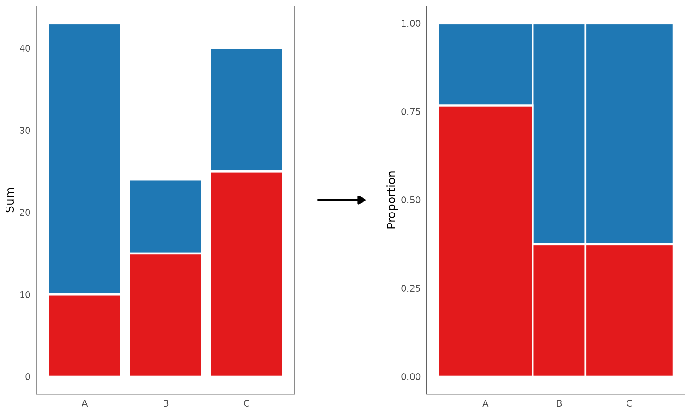

# Problem Set

Designing an interactive data visualization system presents a unique set of challenges. Some of these have been already touched on in the [Introduction](#Introduction). This section discusses these inherent challenges in greater depth, and begins exploring avenues for possible solutions.

## Data visualization pipeline

When creating visualizations, it is rare to encounter data that can be rendered directly. Instead, the data often has to pass through several distinct stages or transformations before it can finally be rendered. Together, these stages form a data visualization pipeline [see e.g. @chi2000; @wickham2009; @wu2024]. 

Take for example the typical barplot. To draw a barplot, there are several steps we need to take. First, we have to divide the data into parts, based on the levels of some categorical variable. Second, we need to summarize or aggregate each part by some metric, usually either sum or count. Third, we need to take these summaries and map them to visual encodings, such as x-axis position, y-axis position, and length. Finally, we use these encodings to render the individual bars. 

In the next few sections, I discuss these four fundamental steps of the data visualization pipeline - partitioning, aggregation, scaling and encoding, and rendering - and explores challenges related to their implementation. Particularly, some unique issues that come up in interactive data visualization are pointed out and discussed. Ultimately, my goal is to show that certain parts of the pipeline, particularly the aggregation step, are more complex than often given credit for, and that many current data visualization packages handle this complexity only implicitly, limiting the scope of their application [see also @wu2024].  

## Partitioning

The initial step of any data visualization pipeline is splitting data into parts. When working with typical two-dimensional tables or data frames, this operation can be imagined as slicing the table into smaller subsets of rows. Even during this arguably simple initial step, two fundamental questions arise:

- How much of the original data should these subsets contain?
- What should be the relationship between these subsets?

While these questions may seem simple, answering them requires making assumptions about the data and visualization goals. Common data visualization practices, whether consciously or not, are based on these assumptions, and so it is crucial to discuss them.

### Showing the full data

> "If someone hides data from you, it’s probably because he has something to hide." [@cairo2016, pp. 47]

A common recommendation that many data visualization experts provide is that faithful visual representations should show the full data and leave nothing out. The moral behind this recommendation seem fairly obvious. Visualizations which hide or obscure information, be it by negligence or by intent, cannot be considered truthful representations of the underlying data [@cairo2016; @cairo2019]. 

However, data hiding can occur in many different ways. First, the data itself can be cherry-picked or massaged [see e.g. @lisnic2024]. This is arguably the most egregious case, and can in some cases amount to malicious statistical practices such as HARKing or p-hacking [see e.g. @kerr1998; @lisnic2024; @head2015]. Second, even when showing the full data, some visualizations can obscure or downplay certain data features via poor design or incorrect use of visual encodings [@cairo2016; @cairo2019; @cleveland1985; @ziemkiewicz2009]. Finally, there is the issue of missing or incomplete data, where some data cannot be represented because it simply is not there.      

To give one concrete example of data hiding, consider axis limits. @cleveland1985 argues that axis limits should generally be expanded to avoid inadvertently obscuring data near these limits [see also e.g. @chen2008, pp. 64]. Take the following two scatterplots:

```{r}
#| echo: false
#| fig-cap: "Without expanding axis limits, objects at or near the limits become less salient. Left: axis limits match the data limits exactly, and so the points in the top-left and bottom-right corner of the plot are represented by smaller area and the overall trend is distorted. Right: by expanding axis limits, we can ensure that trend is represented faithfully."

knitr::include_graphics("./figures/expand-scatterplot.png")
```

In the left scatterplot, the axis limits match the data limits exactly, whereas in the right plot, they are expanded by a small fraction [5%, `ggplot2` default, @wickham2016]. The left scatterplot provides a misleading representation of the underlying trend, as data points near the axis limits (top-left and bottom-right corners) are represented by a smaller area, compared to points near the centre of the plot. For instance, the point in the bottom-right corner of the plot lies simultaneously at the limits of the x- and y-axis, and is thus represented by one-quarter of the area of the points in the center.

Clearly then, we can dismiss the first two data-hiding issues - cherry picking and incorrect use of design - as they involve deliberate misrepresentation. Unless there is a clear and justifiable reason, no data should be arbitrarily removed or discarded, and we should take care to provide good representations such that all data is represented faithfully. The issue of missing or incomplete data is a bit more complicated. While techniques of visualizing data with missing values do exist [see e.g. @unwin1996; @tierney2023], these methods often depend on the specific visualization type and style. Nevertheless, in the ideal case, the visualization should present a clear and unambiguous mapping between the graphics and the data [@ziemkiewicz2009]. 

### Disjointness and comparison

> "To be truthful and revealing, data graphics must bear on the question at the heart of quantitative thinking: 'compared to what'?" [@tufte2001, pp. 74].

> "Graphics are for comparison - comparison of one kind or another - not for access to individual amounts." [@tukey1993]

An interesting yet underappreciated fact is that, in many common types of visualizations, geometric objects tend to represent distinct subsets of the data. That is, in most plots, each point, bar, line, or polygon typically represents a unique set of data points (rows of the data), with no overlap between objects within the same graphical layer. Despite being so common to border on a rule, this practice is often overlooked.

We can find counterexamples of this practice. For instance, certain visualizations of set-typed data "double up" the contribution of data subsets, such that the same subset of the data may appear in multiple objects [see e.g. @alsallakh2013; @alsallakh2014; @conway2017; @lex2014]. However, these types of visualizations are the exception rather than the norm. In other words, when we see a barplot, we expect each bar to represent a unique set of cases.   

So where does this unconscious "law" of showing disjoint parts of the data come from? I believe that it is rooted in the fundamental purpose of data visualization: comparison [@tufte2001; @tukey1993]. When we visualize, we draw our graphics with the ultimate goal of comparing our data along a set of visual channels [@bertin1983; @wilkinson2012; @franconeri2021; @wilke2019]. This mirrors the comparisons we make in the real world, where we compare properties of physical objects. And, as I would like to argue, it is often far easier to reason about multiple objects when they are independent or disjoint. In statistics, we see a example of this in the sum and product rules of probability, which require independence as pre-requisite [@kolmogorov2018]. Likewise, in psychology, is now-all-too-famous experimental evidence that people struggle with comparing non-disjoint events [the "Linda experiment", @tversky1983]. Thus, disjointness presents a more intuitive, "natural" model.

Fundamentally, the intuitive appeal of disjoint parts may originate in the fact that they reflect a structure which mathematicians have long considered natural: a [bijection](#functions) [see e.g. @fong2019; @lawvere2009]. Specifically, if we take a set, split it into disjoint subsets, and label them, then there is a one-to-one correspondence between these subsets and the subset labels (i.e. the parts form an [equivalence class](#partition)). Practically, this means that we can go back and forth between the subsets and the corresponding labels, without losing any information.

A diagram of this natural correspondence between objects and data subsets is shown in Figure \@ref(fig:geoms-bijection). Specifically, when drawing a barplot, if we divide our data into disjoint subsets and draw one bar corresponding to each part, then the function mapping the objects (bars) to the data subsets is invertible: we can pick a bar, identify the corresponding cases, and then use those cases to pick out the original bar. In plots where the objects do not represent disjoint subsets of the data, this correspondence is broken: if we select cases corresponding to a single bar, there may be no simple way of identifying the original bar from the cases alone.

```{r geoms-bijection}
#| echo: false
#| fig-cap: "Disjointness induces a one-to-one mapping (bijection) between geometric objects and subsets of the data. Suppose we mark out the cases corresponding to the leftmost bar (red). Top row: when each geometric object (bar) represents unique subset of cases, we can easily go back and forth between the object and its underlying data subset (middle panel), and so the function which picks the cases corresponding to each object is invertible. Bottom row: if there is an overlap between the cases represented by each object, then there may be no way to identify the original object after we have picked out the corresponding cases."

knitr::include_graphics("./figures/geoms-bijection.png")
```

#### Real data example

To illustrate the idea of disjoint parts on concrete, real-world data, take the following barplot representing the vote share among the top three parties in the 2023 New Zealand general election [@election2023]:

```{r barplot-bijection}
#| echo: false
#| fig-cap: "Barplot showing disjoint subsets of the data. The bars show the vote share among the top three parties in the 2023 New Zealand general election, with each bar representing a unique subset of voters."

knitr::include_graphics("./figures/barplot-bijection.png")
```

Each bar represents a unique subset of voters and thus the bars show disjoint data. This is the type of data representation that we encounter most often, however, there are few explicit guidelines about this. Hypothetically, we could transform our data, and, for example, show the union of the votes of National and Labour parties in the leftmost bar:

```{r union-geoms}
#| echo: false
#| fig-cap: "Barplot showing non-disjoint subsets of the data. Most of the bars show the same data as in Figure \\@ref(fig:geoms-bijection), however, the leftmost bar representing a union of National and Labour voters. The two leftmost bars are thus not disjoint. For a more realistic example, see Figure \\@ref(fig:union-geoms2)."

knitr::include_graphics("./figures/barplot-notbijection.png")
```

However, this way of representing the data has several problems. First, there is the issue of whether this type of representation addresses our visualization goals. For example, when visualizing election data such as the one above, we typically want to compare the relative number of votes each party received. The second barplot in Figure \@ref(fig:union-geoms) this comparison difficult. Specifically, since the leftmost bar represents the union of National and Labour votes, we have to perform additional mental calculation if we want to compare the number of votes received by National and Labour directly [@cleveland1985]. Second, we have metadata knowledge [see e.g. @wilkinson2012; @velleman1993] about the data being disjoint - we know that, in the New Zealand parliament electoral system, each voter can only vote for a single party. Finally, the plot above duplicates information: in Figure \@ref(fig:union-geoms), the number of votes the National party received is counted twice, once in the leftmost bar and again in the second-from-left bar. This goes against the general principle of representing our data in the most parsimonious way [@tufte2001].

Even when our goal is not to compare absolute counts, there are usually better disjoint data visualization techniques available. For example, if we were interested in visualizing the proportion of votes that each party received, we could draw the following plot: 

```{r stacked-proportion}
#| echo: false
#| fig-cap: "Even when proportions are of interest, there are usually disjoint data visualization techniques available. The plot shows proportion of vote share of the top three parties in the 2023 New Zealand general election, with each bar segment again representing a unique subset of voters."

knitr::include_graphics("./figures/barplot-bijection-proportions.png")
```

By stacking the bar segments on top of each other, we can easily compare proportion of the total number of votes while retaining a parsimonious representation of our data. Each bar segments now again represents a unique subset of voters.

The example above is fairly clear-cut case of where disjoint data representation is the better choice. However, there are also more ambiguous situations, such as when multiple attributes of the data are simultaneously present or absent for each case. Take, for example, the 2020 New Zealand joint referendum on the legalization of euthanasia and cannabis. In this referendum, the two issues were included on the same ballot and voters would vote on them simultaneously. The legalization of euthanasia was accepted by the voters, with 65.1% of votes supporting the decision, whereas the legalization of cannabis was rejected, with 50.7% of voters rejecting the decision [@referendum2020].

We could visualize the referendum data in the following way:

```{r union-geoms2}
#| echo: false
#| fig-height: 3
#| fig-cap: "Barplot showing a more realistic example of non-disjoint data representation. The bars show the vote share cast by New Zealand voters in the joint 2020 referendum on euthanasia and cannabis. The two bars show (mostly) the same set of ballots, with each single ballot contributing to the height of one segment in each bar."


```

Here, both bars include votes which were cast by the same voter [ignoring the votes where no preference was given for either issue, @referendum2020], making the representation non-disjoint. In 
this case, the visualization works, since the underlying data is genuinely non-disjoint (each person cast two votes). If we had information about individual votes, it might be interesting to see how many people voted for both euthanasia and cannabis, how many voted for euthanasia but against cannabis, and so on. Similar types of visualization can work well for set-typed data [see e.g. @alsallakh2014]. 

However, even though the data here is fundamentally non-disjoint, there is a way to represent it in a disjoint way that preserves most of the desirable properties - draw separate plots or small multiples [@tufte2001]:  

```{r}
#| echo: false
#| fig-height: 3
#| fig-cap: "Small multiple figure showing the non-disjoint data represented as disjoint bars. The bars again show the vote share cast by New Zealand voters in the joint 2020 referendum on euthanasia and cannabis, however, this time, each bar within one plot represents a unique subset of the cases."

knitr::include_graphics("./figures/referendum-bijection.png")
```

Here again, each bar (segment) in each plot represents a disjoint subset of voters.

#### Disjointness and interaction

As I argued above, disjoint subsets offer a simpler mental model for understanding data visualizations. When each geometric object represents a unique set of data points, it becomes easier to reason about the comparisons being made. In contrast, when objects overlap or share data points, it requires additional cognitive effort to track the relationships between them.

I would also argue that disjointness presents a particularly good model for interactive visualization [see also @wilhelm2008]. The natural correspondence between geometric objects and subsets of the data makes certain interactions more intuitive, and conversely, overlapping subsets can produce surprising or unexpected behavior. For instance, when a user clicks on a bar in a linked barplot, they might reasonably expect to highlight that particular bar within the active plot and the corresponding cases within all the other (passive) plots. If they see parts of other bars within the active plot get highlighted as well, they have to expend additional mental effort thinking about the relationship between the objects (bars) and the subsets of the data, since it is no longer one-to-one.

Similar issue arises during querying. When a user queries an object that does not represent a disjoint subset of the data, should the returned summary statistics match the object or the (non-disjoint) subset? Again, this issue complicates the interpretation of the presented information.

This does not mean that non-disjoint subsets and linking cannot be useful in specific contexts [see e.g. @alsallakh2014; @wilhelm2008], however, I argue that disjointness generally provides a good default. Disjoint subsets simplify our mental model, and this may be the reason why some authors discuss interactive features in the context of partitions [see e.g. @buja1996; @keim2002]. Likewise, many common data analytic operations, such as SQL aggregation queries [`GROUP BY`, @hellerstein1999], operate on disjoint subsets, and this may be another reason why this model is more familiar.

### Plots as partitions

In the two preceding sections, I have argued the plots in our interactive data visualization system should, in general, have have two properties:

- Plots should show the full data (surjective mapping)
- Geometric objects within these plots should represent distinct subsets (disjoint parts)

These two properties suggest a fundamental model for a plot: that of a [partition](#Partitions). Specifically, I propose the following definition of a *regular plot*:

:::{.definition name="Regular plot"}
Regular plot is a plot where the geometric objects within one layer represent a partition of the data, such that there is a bijection between these objects and (possibly aggregated) subsets of the original data.   
:::

I propose that regular plots should form the fundamental building block of our interactive figures. By arranging a series of regular plots into an interactive figure [as small multiples, @tufte2001], we can ensure that the resulting visualization will be easily interpretable, even when combined with interactive features such as linking and querying.

#### Bijection on cases vs. bijection on subsets

While I have not been able to find references explicitly linking plots to partitions in such a general way, some data visualization researchers have used the language of bijections when discussing graphics. For example, @dastani2002 discusses plots as bijections (homomorphisms) between data tables and visual attribute tables. Similarly, @ziemkiewicz2009, and @vickers2012 argue that, in order to be visually unambiguous, plots should represent bijections of the underlying data.

However, this "one-row-one-object" model skirts around the issue of aggregation. It only works if we assume that the data comes to us pre-aggregated, such that, for example, barplots and histograms are direct representations of their marginal tables. However, if we do admit that aggregation is not a completely independent process and is instead a part of the data visualization pipeline [@chi2000; @wickham2016], then we have a problem. 

Aggregation is, by definition, a one-way process: after we aggregate our data into a set of summaries, we cannot recover the original cases [see also @wu2024]. However, many popular plots such as barplots and histograms rely on aggregation. Under the model proposed by @dastani2002, @ziemkiewicz2009, and @vickers2012, these types of plots would be impermissible. @ziemkiewicz2009 do acknowledge that, at times, aggregation can be an acceptable trade-off, despite the inherent information loss.

I propose the following solution. Instead of modeling plots as bijections between *cases* and the geometric objects, I model them as bijections between *parts of data* and the geometric objects. In other words, the domain of the bijection are not individual rows of the original data table, but entire "slices" of rows. With this approach, aggregation can be considered as part of the bijection. For example, if we split our data into ten tables and aggregate each table, we are still left with ten tables of one row each.   

Finally, Wilkinson [-@wilkinson2012, pp 210] and @keim2002 have linked stacked plots to (hierarchical) partitions.

#### Partition products 

Many types of plots involve data partitioned across multiple dimensions. This is especially true in interactive data visualization, where linking automatically induces another level of partitioning [@wilhelm2008]. This necessitates a general mechanism for creating a product of multiple partitions.

To give a concrete example, suppose we want to draw the following barplot:

```{r}
#| echo: false
#| message: false

df <- data.frame(group = factor(c("A", "A", "A", "B", "B", "C", "C", "C")),
                 selection = factor(c(1, 1, 2, 1, 2, 1, 2, 2)),
                 value = c(12, 21, 10, 9, 15, 15, 12, 13))
df2 <- aggregate(value ~ group + selection, data = df, sum)

knitr::include_graphics("./figures/barplot-partitions-products.png")
```

We start with the following data, which includes a categorical variable (`group`, plotted along the x-axis), a variable representing selection status (`selection`, used to colour the bar segments), and a continuous variable that we want to summarize (`value`):

```{r}
#| echo: false

library(kableExtra)

render_table <- function(x, ...) {
  knitr::kable(x, ...) |> kable_styling(full_width = FALSE)
} 

render_tables <- function(x) {
  n <- length(x)
  n_pairs <- floor(n / 2)

  for (i in seq_len(n_pairs)) {
    cat(knitr::kables(lapply(x[(2 * i - 1):(2 * i)], render_table)))
  }
  
  if (n %% 2 == 1) render_table(x[[length(x)]])
}

render_table(df, row.names = TRUE)
```

To draw the individual bar segments, we need to sum `value` across the subsets cases corresponding to each segment. To do this, we first need to split our data into multiple subsets according to the product of `group` and `selection` variables. In R, the general data structure for representing partitions is the `factor` S3 class, and, while there is no built-in function for combining two factors, we can simulate it using `paste` function to combine factor levels as strings element-wise:

```{r}
#| results: "asis"
product_factor <- paste(df$group, df$selection)
split_dfs <- split(df, product_factor)
render_tables(split_dfs)
```

We can then summarize each small data set by summing `value`:

```{r}
#| results: "asis"
summarized_dfs <- lapply(split_dfs, function(x) {
  aggregate(value ~ ., data = x, sum)
})

render_tables(summarized_dfs)
```

Finally, to "stack" the segments on top of each other, we need to combine the summaries back together, within the levels of `group` variable, and take their cumulative sum:

```{r}
#| results: "asis"
grouped_dfs <- split(summarized_dfs, sapply(summarized_dfs, function(x) x$group))
stacked_dfs <- lapply(grouped_dfs, function(x) {
  x <- do.call(rbind, x)
  x$value <- cumsum(x$value)
  rownames(x) <- NULL
  x
})

render_tables(stacked_dfs)
```

Now, we can combine these tables into one `data.frame` and render:

```{r}
#| eval: false
combined_df <- do.call(rbind, stacked_dfs)
combined_df$selection <- factor(combined_df$selection, levels = c(2, 1))
# Need to reverse row order for ggplot2 to layer segments in the correct order
combined_df <- combined_df[6:1, ] 

ggplot(combined_df, aes(x = group, y = value, fill = selection)) +
  geom_col(position = position_identity(), col = "white")
```

```{r}
#| echo: false
#| message: false

knitr::include_graphics("./figures/barplot-partitions-products.png")
```

What we have just shown is an example of a simple split-apply-combine pipeline [@wickham2011]. This type of a pipeline is required for most types of plots, and happens implicitly in most `ggplot2` calls such as this one:

```{r}
#| eval: false
ggplot(data, aes(x, y, fill = fill)) +
  geom_bar()
```

To be more explicit, in the `ggplot2` call above, we specify that we want to partition the data set by the Cartesian product of the `x`, `y`, and `fill` variables. We then compute whatever statistical aggregations we need on the resulting subsets. See the following comment from the [`ggplot2` documentation](https://github.com/tidyverse/ggplot2/blob/f46805349d6ca8ca7a99f8966cfa0f29279c2f6c/R/grouping.R#L7) [@wickham2016]:

```{r}
# If the `group` variable is not present, then a new group
# variable is generated from the interaction of all discrete (factor or
# character) vectors, excluding `label`.
```

#### Limits of simple product partitions

For many types of plots, the simple strategy of taking a single "flat" product of all factors/partitions works reasonably well. However, for other types of plots, this simple model is not enough. 

To give a concrete example, let's turn back to the barplot from the section above (\@ref(plots-as-partitions)). To draw the barplot, we first split our data into smaller tables, summarized each table by summing up the values, stacked the summaries by taking their cumulative sum, and finally used the resulting data frame to render bar segments. This gave us a stacked barplot, which is a good visualization for comparing absolute counts across categories. 

However, what if, instead of comparing absolute counts, we wanted to compare proportions? It turns out there is another type of visualization, called the spineplot, which can be used to represent the same underlying data as the barplot, however, is much more useful for comparing proportions: 

```{r barplot-spineplot}
#| echo: false
#| fig-cap: "The same underlying data represented as a barplot (left) and a spineplot (right)."


```

Like barplots, spineplots represent some summary statistic (usually counts), aggregated within the levels of the product of two categorical variables. However, unlike barplots, spineplots map the underlying statistics to both the y-axis position and width. Furthermore, the y-axis position is normalized, such that the heights of the different segments within the same category add up to one. This normalization makes it possible to compare the relative frequencies within categories directly (notice how the right panel in Figure \@ref(fig:barplot-spineplot) makes it obvious that the proportion of red cases within the B and C categories is the same). Thus, like barplot, the spineplot is a valuable tool for visualizing categorical data, especially when we can use interactive features to switch from one type of representation to the other. 

However, despite the fact that barplot and spineplot represent the same underlying data, turning one into the other is not always trivial. Specifically, while many grammar-based visualization systems offer a simple declarative syntax for defining barplots, they lack such simple syntax for spineplots. For example, in `ggplot2`, there is currently no way to define a spineplot without first having to reshape the data, and creating the plot right panel in Figure \@ref(fig:barplot-spineplot) took over 10 lines of external code (using standard `dplyr` syntax).

#### Partitions and hierarchy: The graph behind the graph

```{r}
#| echo: false
#| fig-cap: "A joke image shared in the Mathematical Mathematics Memes Facebook group on the 28th of March, 2024 [@mathematicalmathematics2024]. In this section, I would like to make the case that charts (right) do in fact have a graph structure, in other words, graphs are graphs, not \"delusional cosplayers\"."
#| out-extra: 'style="border:1px solid black;"'
#| out-width: 75%
knitr::include_graphics("./figures/graphs-cosplayers.jpg")
```

Why are spineplots so tricky? The reason is that they force us to confront the hierarchical nature of graphics. Specifically, while in a barplot, we can get away with a single flat partition of the data, in a spineplot, the data is summarized and transformed *along and across* different levels of aggregation [@wu2024]:

- Along the x-axis, we stack the summaries *across the levels of the top-level factor/category*
- Along the y-axis, we stack the summaries *across the levels of a product of two factors* and normalize them by the values *within the levels of the top-level factor*.   

So, when we want to render a spineplot based on two categorical variables with $j$ and $k$ levels, it is not enough to simply break our data into $j \cdot k$ tables. Instead, we need to partition our data in two steps: first, break the original data into $j$ tables based on the levels of the top level factor, and second, break the resulting sub-tables into $j \cdot k$ tables, based on the levels of the second factor. This automatically induces a hierarchical relation, such that the resulting data subsets form a tree, see Figure \@ref(fig:spineplot-tree):

```{r spineplot-tree}
#| echo: false
#| fig-cap: "A diagram of the hierarchical relationship between the subsets of the data represented by a spineplot/barplot. The whole data set is partitioned into bars, which are in turn partitioned into bar segments. The arrows represent a union relationship, such that a bar is a union of the corresponding segments, and whole the data set is a union of all bars."
knitr::include_graphics("./figures/spineplot-tree.png")
```

In the diagram above, each vertical level represents on partition of the data, and the relationship between parts is designated by arrows, such that a node where multiple arrows meet represents a union of the corresponding subsets. 

This same tree can be used to represent both the barplot and the spineplot. For a barplot, it is not strictly necessary, since we can get by with only the lowest level of the partitioning (segments), provided we skirt around some issues such as stacking order. However, for a spineplot, the hierarchical structure is absolutely essential, since we need to apply transformations *across* the levels of the hierarchy. Specifically, we need to normalize (divide) the statistics corresponding to each segment by the values within the parent bar. This is only possible if the segment has some sort of reference to the parent statistic.

Clearly then, modeling plots as a single flat partition does not provide enough generality, and we should instead conceptualize them as a hierarchy of partitions. Therefore, we should refine our definition of a regular plot:

:::{.definition name="Regular plot 2"}
Regular plot is a plot where the geometric objects within one layer represent *a hierarchy of partitions* of the data, such that there is a bijection between these objects and (possibly aggregated) subsets of the original data.   
:::

However, now we face another issue: when we organize our data into a hierarchy of subsets, we impose structure on our data. Clearly, the subsequent steps of the data visualization pipeline should respect this structure. For example, if we have barplot bars that have been divided into segments, it would not make sense to stack some segments on top of each other and plot others side-by-side. However, the question of what it means to "respect the structure" of the data is more complicated than it may seem. It will be explored in the following section, which deals with the next step of the data visualization pipeline: aggregation.   

@keim2002 stacked plots are suited for hierarchically-partitioned data. 

## Aggregation

> “This system cannot produce a meaningless graphic, however. This is a strong claim, vulnerable to a single counter-example. It is a claim based on the formal rules of the system, however, not on the evaluation of specific graphics it may produce.” 
>
> “Some of the combinations of graphs and statistical methods may be degenerate or bizarre, but there is no moral reason to restrict them.”
>
> @wilkinson2012, The Grammar of Graphics, pp. 15 and 112. 

After we have split our data into parts, we need a way of summarizing each part via some set of summary statistics. While the computing summaries may seem like a fairly straightforward part of the data visualization pipeline, there is more complexity than meets the eye. This section explores this problem in more depth.

### Graphics and statistics are not independent

A popular approach in data visualization involves composing graphics out of independent, modular components. This is the core idea of the so-called "grammar-based" model of visualization, introduced by Wilkinson in his Grammar of Graphics [-@wilkinson2012]. Since its inception, this model has gained widespread popularity, and has been implemented in numerous data visualization systems [see e.g. @mcnutt2022; @kim2022; @vanderplas2020; @wickham2010; @satyanarayan2014; @satyanarayan2016]. Its popularity is likely due to the many benefits it offers, including simplicity, flexibility, and expressive power. 

A prominent example of a grammar-based data visualization system is the famous `ggplot2` package [@wickham2010]. In `ggplot2`, plots are built out of components such as geometric objects (called `geoms`), statistical summaries (`stats`), and scales. These components can be combined at will, allowing the user to express a wide range of graphics using just few primitives. The expressive power of `ggplot2` has made it one of the most popular R packages.^[Being the top most downloaded CRAN package as of 4th of December 2024, @rmeta2024]

However, despite all its advantages, the grammar-based model also suffers from one fundamental flaw: graphics and statistics are not independent. Instead, the way we choose to represent the data has to align with the properties of the data. Let's illustrate this point on a real-world example.

##### Stacking: not (only) about graphics

For this example, I will use now-famous data set from a study on the effect of smoking on child lung capacity [@tager1979; @kahn2005]. In the study, the researchers measured children's forced expiratory volume (FEV), and recorded it alongside age, height, sex, and smoking status.

A rather surprising feature of this data set is that, at a glance, the children who smoked actually had greater lung volume than non-smokers. In `ggplot2`, we can easily create a boxplot showing the relationship between smoking status and FEV using the following short code snippet:

```{r}
#| eval: false
#| fig: "Lung FEV of smokers and non-smokers within the @tager1979 study. Surprisingly, smokers seem to have greater lung volume on average compared with non-smokers."
fev <- read.csv("./data/fev.csv")

library(ggplot2)

ggplot(fev, aes(smoke, fev, fill = smoke)) +
  geom_boxplot()
# There is actually a bit more code involved in producing the plot below,
# but it all just has to do with design/aesthetic flair
```

```{r}
#| echo: false
knitr::include_graphics("./figures/grammar-boxplot.png")
```

Before we start extolling the benefits of smoking for juvenile lung health, it may be a good idea to first look at some confounding variables. Lung volume develops with age, and the researchers had collected data from children ages three and up. Clearly, there were not going to be many smokers among three-year olds, so we should make sure age is not a confounder. 

We can verify that there indeed is a strong relationship between age and FEV like so:

```{r}
#| eval: false
ggplot(fev, aes(age, fev, fill = smoke)) +
  geom_point()
```

```{r}
#| echo: false
knitr::include_graphics("./figures/grammar-scatterplot.png")
```

From the plot above, we can see that age and FEV correlate strongly, and also that the smokers tend to be quite a bit older than the non-smokers. To visualize the distribution of smokers and non-smokers across age a bit more clearly, we can draw an ordinary stacked barplot:

```{r}
#| eval: false
ggplot(fev, aes(age, fev, fill = smoke)) +
  geom_bar()
```

```{r grammar-barplot-counts}
#| echo: false
#| fig-cap: "The number of participants by age and smoking status. Notice that the bar segments \"stack\", such that the height of the whole bar correctly represents the number of smokers and non-smokers combined."
knitr::include_graphics("./figures/grammar-barplot-counts.png")
```

The plot above clearly shows that there were a lot more smokers than non-smokers, and that smokers tended to be on average older than the non-smokers. This provides a support for our confounding hypothesis.

Now, what if we wanted to compare the distribution of FEV across the different ages? A data visualization novice might do something like this:

```{r}
#| eval: false
ggplot(fev, aes(age, fev, fill = smoke)) +
  geom_bar(stat = "summary", fun = "mean")
```

```{r grammar-barplot-means}
#| echo: false
#| fig-cap: "A poor visualization of the average FEV by age and smoking status. Notice that the height of the stacked bars is meaningless: it represents the sum of the group averages, which is not a valid summary of the combined smoker and non-smoker data."
knitr::include_graphics("./figures/grammar-barplot-means.png")
```

At a glance, the plot above looks fine. However, what do the heights of the stacked bars represent? Each coloured bar segment represents a mean of the `fev` variable, grouped by the levels defined by the product of the `age` and `smoke` variables. By stacking the bars on top of each other, we are essentially summing up the average FEV of smokers and non-smokers, within the given age category.

However, this type of visualization is problematic, because the sum of group means is not a meaningful summary statistic. In other words, it is not something that most consumers of data visualizations would care about or know how to interpret. Before, in Figure \@ref(fig:grammar-barplot-counts), we had stacked counts, and the height of the stacked bars represented a valid overall count - the number of smokers and non-smokers within a given age category combined. This is not the case here - in Figure \@ref(fig:grammar-barplot-means), the sum of the group means is different from the mean of the combined cases (and so would be the mean of group means).   

This problem is familiar to data visualization researchers and many have explicitly warned about this:

>"Stacking is useful when the sum of the amounts represented by the individual stacked bars is in itself a meaningful amount" [@wilke2019, p. 52].

>"Because this gives the visual impression of one element that is the sum of several others, it is very important that if the element’s size is used to display a statistic, then that statistic must be summable. Stacking bars that represent counts, sums, or percentages are fine, but a stacked bar chart where bars show average values is generally meaningless." [@wills2011, p. 112].

>"[...] We do this to ensure that aggregate statistics are always computed over the input data, and so users do not inadvertantly compute e.g., averages of averages, which can easily lead to misinterpretation." [@wu2022]

Does this mean we can only ever stack counts and sums? Take a look at the following plot:

```{r}
# Code is not included because this type of plot cannot be made 
# with a simple ggplot2 call (without pre-processing)
```

```{r}
#| echo: false
knitr::include_graphics("./figures/grammar-barplot-maximums.png")
```

Here we plot the maximum FEV for smokers and non-smokers across the different ages. From this plot, we can see that in most of the age categories which included smokers (age 9 and up), the FEV of the non-smoker with the highest lung capacity was greater than that of a smoker with the greatest lung capacity, although there are several exceptions (ages 11, 16, and 18). 

However, notice one important feature of the plot above: the heights of the "stacked" bars represent a valid overall summary. That is, *the maximum of the maximums is a valid maximum of the combined cases*. This suggests that other statistics may be "stackable", besides counts and sums.

#### Why choose stacking over dodging and layering?

But before we go on to discuss what makes statistics stackable, we need to address one particular issue. It might not be immediately clear why I focus on stacking so much. Indeed, some might argue that stacking is only one way of presenting partitioned data, and that we could equally well present the averages in Figure \@ref(fig:grammar-barplot-means) by plotting the corresponding bars side by side (a technique know as dodging), or by plotting them on top of each other in semi-transparent layers:

```{r}
#| echo: false
#| fig-cap: "Two alternative means of displaying partitioned data: dodging and stacking."
knitr::include_graphics("./figures/grammar-dodging-layering.png") 
```

However, I argue that, in the context of interactive visualization, stacking has certain advantages that dodging and layering do not [see @roberts2000; @wilhelm2008]. Specifically, the fundamental strength of stacking is that parts of the objects "add up" to the whole. As a result, the whole object provides a kind of a bound on the highlighted subsets, greatly simplifying certain interactive behaviors.

For instance, in a stacked barplot, the heights of the individual segments add up to the height of the whole bars. This is useful when combined with linked selection, since, even when the heights of the highlighted segments change, the heights of the whole bars remain the same. As a result, we can keep the upper y-axis limit fixed. The same is not true for dodging and layering. Here, the heights of the bars are not necessarily bound by any value. For instance, in a dodged barplot the heights of the highlighted segments may become greater than those of the unselected segments. This means that we either have to make the upper y-axis limits reactive in response to selection, losing the context that the limit provides, or risk the bars "overflowing" beyond the bounds of the plot.  

This issue is also discussed by @wilhelm2008, who conceptualizes it as three linked visualizations strategies: replacement, overlaying, and repetition. Overlaying and repetition are essentially equivalent to stacking and dodging, whereas replacement means that the entire visualization gets replaced whenever linked selection occurs. Wilhelm argues that replacement is a flawed strategy, since it means that the context of the previous visualization such as axis limits is lost whenever selection occurs. Likewise, he suggests that repetition is a less popular strategy since it requires the plot to be re-arranged when selection happens. Finally, he also points out two problems with overlaying: the fact that plot parameters are inherited from the plot representing the whole data set, and that parts of the original plot may become obscured by the highlighted subset. Overall, he seems to favor repetition over the other two methods. 

My conclusion is different from that of @wilhelm2008: I argue that, while overlaying/stacking is less flexible than the other two methods, it is nevertheless the best, since it ensures that the context of the whole data is always preserved. Conversely, repetition/dodging suffers from the same problem that replacement does. Specifically, if we draw highlighted subsets as separate objects, then we either have to make the axis limits reactive (leading to a loss of context), or risk that the highlighted objects may extend beyond these limits. What @wilhelm2008 sees as one of the problems of overlaying - the fact that plot parameters are inherited from the whole data - I instead see as a fundamental strength. The part-whole relationship between the highlighted segments ensures that interaction preserves context, and also reduces the amount of computation that needs to be done.

### Stackable summaries

Now it is finally time to discuss what makes certain statistics stackable. To do this, I will use some fundamental concepts from category. These concepts are described at greater length in the [Appendix: Mathematical Theory](#mathematical-theory) - the reader is advised to consult this section if they are unfamiliar with this material.

In section \@ref(partitioning), I discussed the idea of modeling our plots as a hierarchy of partitions. Specifically, starting with the full data, we can divide the data into disjoint subsets, each representing one geometric objects, and then divide these subsets again, representing parts of geometric objects (such as induced by selection status). Thus, as was discussed in Section [REFERENCE], this hierarchical partitioning results in a tree-like structure.

I further posit that, when aggregating our data into summaries, we want to choose summary statistics which preserve this hierarchical structure. In other words, statistics which are stackable preserve the preorder relation on the subsets of the data, whereas statistics which are not do not.


#### Transforming summaries

## Scaling

Suppose we have partitioned our data and computed the relevant summary statistics. Now we need a way to to encode these summaries into visual attributes that we can then present on the computer screen. In most data visualization systems, this is done by specialized components called scales or coordinate systems [see e.g. @murrell2005; @wickham2016; @wilkinson2012; @petricek2020].

Scales involve two important challenges: the theoretical problem of mapping data to visual encodings, and the more applied problem of implementing such a scaling system. While much has been written on the theoretical properties of scales, considerably less information is available on the practical implementation of scales. Further, interactive data visualization presents some fairly unique and interesting problems for the implementation of scales, and these are also rarely discussed. For this reason, I provide only a brief overview of some of the key areas of the theory of scales, and devote more space to the applied problems, as I feel these deserve equal share of attention.   

### Theory of scales

Within the data visualization literature, there exists a fairly large body of research on the theoretical properties of scales. A full treatment is beyond the scope of the present thesis. However, in this section, I will attempt to briefly summarize some important findings and concepts.

#### Philosophy, psychology, and measurement {#theory-of-measurement}

One challenge when discussing scales in data visualization is that the topic unavoidably intersects with a research area that has a particularly long and contentious history: theory of measurement [see e.g. @hand1996; @michell1986; @tal2025]. Theory of measurement (not to be confused with measure theory, with which it nevertheless shares some overlap) is the research area which tries to answer the deceptively simple question: what does it mean to measure something? This seemingly trivial problem has inspired long and fiery debates within the fields of mathematics, philosophy, and social science. Particularly, in psychology, where assigning numerical values non-physical phenomena such as moods and mental states is a central concern, the topic has garnered a significant amount of attention, creating a dense body of research [see e.g. @humphry2013; @michell2021].

Arguably, the most influential work in this field has been that of @stevens1946. In his fairly concise paper, Stevens defined a *scale* as method of assigning numbers to values, and introduced a four-fold classification classification, namely: nominal, ordinal, interval, and ratio scales (see Table \@ref(tab:stevens-scales)).

```{r stevens-scales}
#| echo: false

tab <- data.frame(
  v1 = c("Nominal", "Ordinal", "Interval", "Ratio"),
  v2 = c("Isomorphism",
         "Monotone map",
         "Affine transformation",
         "Linear map"),
  v3 = c("Are $x$ and $y$ the same?", 
         "Is $x$ is greater than $y$?", 
         "How far is $x$ from $y$?",
         "How many times is $x$ greater than $y$?"),
  v4 = c("$x' = f(x)$, where $f$ is a bijection", 
         "$x' = f(x)$, where $f$ is a monotone bijection", 
         "$x' = ax + b$, for $a, b \\in \\mathbb{R}$", 
         "$x' = ax$, for $a \\in \\mathbb{R}$")
)

col_names <- c("Scale", 
               "Structure",
               "Comparison", 
               "Valid transformations")
knitr::kable(tab, col.names = col_names, 
             caption = "Types of scales identified by Stevens (1946)")

```

The Steven's [-@stevens1946] typology is based on invariance under transformation. Specifically, for each class of scales, we define a set of transformations that preserve valid comparisons. The set of valid transformations shrinks as we move from one class of scales to another.  

For nominal scales, any kind of bijective transformation is valid. Intuitively, we can think of the scale as assigning labels to values, and any kind re-labeling is valid, as long as it preserves equality of the underlying values. For instance, given a nominal scale with three values, we can assign the labels $\{ \text{red}, \text{green}, \text{blue} \}$ or $\{ \text{monday}, \text{tuesday}, \text{wednesday} \}$ in any way we like, as long as each value maps to a unique label. This identifies the underlying mathematical structure as an isomorphism.

Ordinal scales are more restrictive, since, on top of preserving equality, transformations also need to preserve order. For example, if we want to assign the labels $\{ \text{monday}, \text{tuesday}, \text{wednesday} \}$ to an ordinal scale with three values, there is only one way to do it that preserves the underlying order: assign the least values to $\text{monday}$, the middle value to $\text{tuesday}$, and the greatest value to $\text{wednesday}$ (assuming we order the labels/days in the usual day-of-week order). However, there is no notion of distance between the labels: we could just as well assign the values labels in $\mathbb{N}$ such as $\{ 10, 20, 30 \}$, $\{1, 2, 9999 \}$, and so on. Thus, the fundamental mathematical structure is that of a monotone map.

Interval scales need to additionally preserve equality of intervals. This means that, for any three values $a, b,$ and $c$, if the distances between $a$ and $b$ and $b$ and $c$ are equal, $d(a, b) = d(b, c)$, then so should be the distances between the scaled labels, $d^*(f(a), f(b)) = d^*(f(b), f(c)$. For most real applications, this limits interval scales to the class of affine transformations of the form $f(x) = ax + b$. A canonical example of an interval scale is the conversion formula of degrees Celsius to Fahrenheit: $f(c) = 9/5 \cdot c + 32$ [@stevens1946]. This example also highlights an important property of interval scales: the zero point can be arbitrary and ratios are not meaningful. Specifically, since the zero points of both Celsius and Fahrenheit scales were chosen based on arbitrary metrics (freezing temperatures of water and brine, respectively), it does not make sense to say that, e.g. 20°C is "twice as hot" as 10°C, in the same way that it does not make sense to say that 2000 CE is "twice as late" as 1000 CE.  

Finally, ratio scales also need to preserve the equality of ratios. Specifically, if $a/b = b/c$ then $f(a)/f(b) = f(b) / f(c)$. As a consequence, this also means that the scale must have a well-defined zero-point. Examples of ratio scales include physical magnitudes such as height and weight, which have a well-defined zero point [@stevens1946].

Steven's [-@stevens1946] typology sparked a considerable debate, on multiple fronts. First, since the original publication, many authors have sought to either expand upon or criticize Steven's typology. However, despite some monumental efforts towards a unified theory, such as that of @krantz1971, measurement has remained a hotly debated topic to this day [see e.g. @michell2021; @tal2025]. Second, more relevant to statistics, some authors such as @stevens1951 and @luce1959 used the theory to define come up with prescriptive rules for statistical transformations, suggesting that, for example, taking the mean of an ordinal variable is wrong since the meaning of the average operator is not preserved under monotone transformations. However, this issue was hotly contested by statisticians such as @lord1953, @tukey1986, and @velleman1993, who argued that many well-established statistical practices, such as rank-based tests and coefficients of variations, rely on such "impermissible" statistics but can nevertheless yield valuable insights. More broadly, these authors also argued that data is not really meaningful on its own, but instead derives its meaning from the statistical questions it is used to answer [see also @wilkinson2012].        

At this point, the discussion around measurement has become far too dense and theoretical, and most data visualization researchers seem to avoid delving into it too deeply [see e.g. @wilkinson2012]. Nevertheless, there are still some areas where the issues of measurement and Steven's typology do crop up. For instance, when scaling area based on a continuous variable, a common recommendation is to start the scale at zero to ensure accurate representations of ratios [see e.g. @wickham2024], aligning with Steven's definition of a ratio scale. Likewise, the long-standing debate around whether the base of a barplot should always start at zero [see e.g. @cleveland1985; @wilkinson2012] also carries echoes of the measurement debate. Ultimately, it may yet require long time to settle the issues around measurement, however, there are definitely some ideas within the literature that data visualization can benefit from.    

#### Visual perception and encodings

Another important research area is how scales apply to visual perception. Specifically, given that we use visual attributes such as position, color, length, or area to encode various aspects of our data, researchers have tried to answer the question of how to use these attributes in a way that best leverages the human visual system. Fortunately, this research has been quite fruitful, yielding precise and actionable guidelines [for a review, see @franconeri2021; @quadri2021].

A landmark work in this area has been that of @cleveland1984. In this study, the authors conducted a series of empirical experiments in which they investigated people's ability to accurately judge quantities based on different visual encodings. They found that judgments based on position along a common scale were the most accurate, followed by length-based comparisons, and then angle-based comparisons. 

The findings were later corroborated by other authors. @heer2010 replicated the @cleveland1984 study, and included judgements of circular and rectangular areas which were found to be less accurate than position, length, or angle. Other authors have extended these experiments to other visual encodings, such as color or density [e.g. @demiralp2014; @saket2017; @reda2018]. Together, these findings have been used to create rankings of visual encodings, with researchers generally agreeing on the following ordered list: position, length, area, angle, and intensity [from most effective to least, @mackinlay1986; @franconeri2021; @quadri2021].    

#### Scale transformations

> "Transformation is a critical tool for visualization or for any other mode of data analysis
because it can substantially simplify the structure of a set of data."
> 
> @cleveland1993, pp. 48


### Scales in practice

While there exists a large body of literature concerned with what we should and should not do with scales, information about what scales actually are and how to implement them is scarce. Partly to blame may be fatigue from the endless debates around theory of measurement (see Section \@ref(theory-of-measurement)). Be it as it may, many data visualization researchers seem content to talk about scales in fairly abstract terms, making an occasional nod to Steven's -@stevens1946 typology [see e.g. @aparicio2015; @dastani2002; for some rare counter-examples see e.g. @murrell2005; @petricek2020; @ziemkiewicz2009].  

However, the reality of real-world data visualization code-bases is quite different. Here, a significant portion of effort is dedicated to implementing scales and coordinate systems. For instance, within the `ggplot2` codebase, the file containing the definition of the `Scale` class has the greatest number of lines, by quite a significant margin [as of 4th of December 2024, @ggplot2repo2024], see Figure \@ref(fig:ggplot2-linecounts):

```{r ggplot2-linecounts}
#| echo: false
#| fig-cap: "The top 10 longest source files within the `ggplot2` codebase. Notice that `scale-.R` files contains significantly more lines than the other files."
knitr::include_graphics("./figures/ggplot2-linecounts.png")
```


From a high-level perspective, a scale is just a function $s: D \to V$ which translates values of the data $d \in D$ to values of some visual attribute $v \in V$, such as the x- and y-position, length, area, radius, or color [@wilkinson2012; @petricek2020]. 

