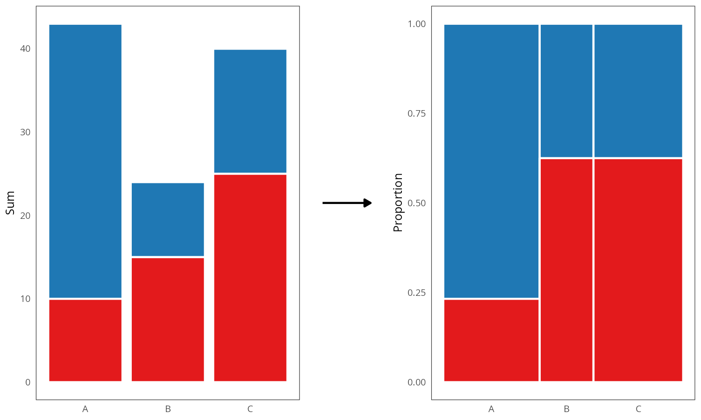

```{r}
#| echo: false
knitr::opts_chunk$set(
  out.width = "100%",
  out.height = "100%"
)

include_figure <- function(path, height = 400) {
  if (knitr::is_html_output()) knitr::include_url(path, height)
  else knitr::include_graphics(gsub(".html", ".png", path))
}

if (knitr::is_html_output()) {
  knitr::opts_chunk$set(
    out.extra = 'style="border: none;"' # Get rid of iframe borders
  )
}
```

# System description {#system}

This section contains a detailed description of the two software packages developed as part of this doctoral project: ([plotscape](https://github.com/bartonicek/plotscape) and [plotscaper](https://github.com/bartonicek/plotscaper)):

- `plotscape`: Written in TypeScript/JavaScript, provides "low-level" interactive visualization utilities
- `plotscaper`: Written in R, provides a "high-level" wrapper/API for R users 

Web-technologies were chosen because they provide a simple and portable way to do interactive apps in R, having become the de facto standard thanks to good integration that packages such as `htmlwidgets` [@htmlwidgets2021] and Shiny [@sievert2020]. The functionality was split across two packages out of practical concerns; rather than relying on some JS-in-R wrapper library, `plotscape` was implemented in vanilla TypeScript/JavaScript directly, to achieve optimal performance and fine-grained control. `plotscaper` was then developed to provide a user-friendly R wrapper around `plotscape`'s functionalities.  

As of the time of writing, `plotscape` comprises of about 6,400 significant lines of code (SLOC; un-minified, primarily TypeScript but also some CSS, includes tests, etc...), and `plotscaper` contains about 500 SLOC of R code (both counted using [`cloc`](https://github.com/AlDanial/cloc)). The unpacked size of all files (including minified JS) is about 200 kilobytes for `plotscape` and 460 kilobytes for `plotscaper`, which is fairly modest compared to other interactive data visualization alternatives for R^[For instance, the `plotly` package takes up about 7.3 megabytes, which amounts to over 15x difference.]. Both packages have fairly minimal dependencies.

Since the two packages address fairly well-separable concerns - high-level API design vs. low-level interactive visualization utilites - I organize this section accordingly. First, I discuss general, high-level API concerns alongside `plotscaper`. Second, I delve into the low-level implementation details alongside `plotscape`. There are of course cross-cutting concerns with both packages and those will be addressed towards ends of the respective sections. However, first, let's briefly review the core requirement of the package(s).

## Core requirements

To re-iterate, from Section \@ref(goals), the core requirements for the high-level API (`plotscaper`) were:

- Provide a framework for creating and manipulating interactive figures geared towards data exploration
- Be accessible to a wide range of users with varying levels of experience
- Integrate well with popular tools within the R ecosystem, such as the RStudio IDE and RMarkdown

These will be the subject of Section \@ref(high-level-api). However, to realize these goals, it was also necessary to design the low-level platform (`plotscape`) which could support them. The primary purpose of `plotscape` was to provide utilities for the interactive data visualization pipeline:

- Splitting the data into a hierarchy of partitions
- Computing and transforming summary statistics (e.g. stacking, normalizing)
- Mapping these summaries to visual encodings (e.g. x- and y-axis position, width, height, and area)
- Rendering geometric objects and auxiliary graphical elements
- Responding to user input and WebSockets requests, and propagating any required updates throughout the pipeline

Section \@ref(low-level-implementation) will discuss the above-mentioned tasks, and the data structures and algorithms used to support them.

## High-level API (`plotscaper`) {#high-level-api}

In Section \@ref(goals), I already discussed some broad, theoretical ideas related to the package's functionality. Here, I focus more on the concrete API - what `plotscaper` code looks like, how are users supposed to understand it, and why was the package designed this way. The goal is to provide a rationale for key design decisions and choices.

### API design {#api-design}

As mentioned in Section \@ref(goals), a primary inspiration for `plotscaper`'s API was the popular R package `ggplot2`. In `ggplot2`, plots are created by chaining together a series of function calls, each adding or modifying a component of an immutable plot schema:

```{r}
#| fig-show: "hide"
library(ggplot2)

# In ggplot, plots are created by chaining a series of function calls
ggplot(mtcars, aes(wt, mpg)) +
  geom_point() + # The overloaded `+` operator serves to compose these calls
  scale_x_continuous(limits = c(0, 10))
```

```{r}
# The call to ggplot() creates an immutable plot schema object

plot1 <- ggplot(mtcars, aes(wt, mpg))
names(plot1)
length(plot1$layers)

# Adding components such as geoms returns a new schema object
plot2 <- ggplot(mtcars, aes(wt, mpg)) + geom_point()
names(plot2)
length(plot2$layers)
```

`ggplot2` is well-loved by R users, as evidenced by the package's popularity. However, its API presents certain limitations when building interactive figures. Specifically:

- Its design primarily focuses on individual plots. While facetting does make it possible to create multi-panel figures consisting of repeats of the same plot type [see `facet_wrap()` and `facet_grid()`, @wickham2016], multi-panel figures with mixed plot types require the use of external packages such as `gridExtra` [@auguie2017] or `patchwork` [@pedersen2024]. As discussed in Section \@ref(background), in interactive graphics, multi-panel figures composed of different plot types are essential, and as such, the single-plot model of `ggplot2` is not sufficient.
- While the immutable schema model works well for static graphics, in interactive graphics, the ability to modify an already rendered figure can be extremely useful. For example, by directly mutating the figure state via a function call, we can easily set an interactive histogram binwidth to a precise value, rather than having to rely on some imprecise widgets/controls such as a slider.   
- Many of the `ggplot2`'s core functions make heavy use of quotation and non-standard evaluation [NSE, @wickham2019]. While this style is fairly popular within the R ecosystem and does offer certain elegance/syntactic conciseness, it also complicates programmatic use [@wickham2019]. For instance, in `ggplot2`, to plot all pairwise combinations of the variables in a dataframe, we cannot simply loop over their names and supply these as arguments to the default `aes` function - instead, we have to parse the names within the dataframe's environment (this is what the specialized `aes_string` function does). Again, in interactive contexts, the ability to easily manipulate figures with code is often highly desirable, and this makes NSE a hindrance (more on this later).  
- The package was developed before widespread adoption of the pipe operator [both `%*%` from `magrittr`, @bache2022; and the native R `|>` pipe, @r2024] and its use of the overloaded `+` operator is a noted design flaw [see @wickham2014].

To address the single-plot focus limitation, a function-chaining approach similar to `ggplot2` was adopted, however, with a focus on multi-panel figure composition. Functions primarily target the entire figure, adding or removing plots. However, specialized functions with selectors can also be used to modify individual plots. To enable mutable figure modification while retaining the benefits of immutability, most functions accept both immutable schemas and references to live figures (details in the following section). Finally, non-standard evaluation was avoided altogether, and functions can be composed using any valid pipe operator (in my examples, I prefer the base R `|>` operator). 

### Basic example of `plotscaper` code

The code below shows a basic example of an interactive figure. More advanced and realistic applications are shown in Section \@ref(applied-example); this is example is only meant to provide a simple illustration of how interactive figures are built with `plotscaper`:

```{r}
#| eval: false
library(plotscaper)

create_schema(mtcars) |>
  add_scatterplot(c("wt", "mpg")) |>
  add_barplot(c("cyl")) |>
  set_scale("plot1", "x", min = 0) |>
  render()
```

```{r plotscaper-example1}
#| echo: false
#| fig-cap: "An example of a simple interactive figure in `plotscaper`."
include_figure("./figures/plotscaper_example1.html")
```

We first initialize the figure schema by calling `create_schema()` with the input data. Next, we chain a series of `add_*()` calls, adding individual plots. Further, we can also manipulate attributes of individual plots, by using, for instance, the `set_scale()` function to set the lower x-axis limit of the scatterplot to zero. All of these functions append instructions to the schema (more on that later, in Section \@ref(scene-and-schema)). Finally, the schema is instantiated into a figure via the call to `render()`. There are several features of this process that bear explaining.

#### Figure vs. plot and selectors

First, note that, as discussed in Section \@ref(api-design), all functions take as their first argument the entire figure and most also manipulate it, unlike in `ggplot2` where the first argument is typically the schema of a single plot (unless when faceting is used). Thus the fundamental object being manipulated is the entire figure, rather than a single plot. Consequently, this design also necessitates the use of selectors for targeting individual plots, as seen in the `set_scale()` call above. I decided to use a simple string selector for this purpose. While alternative selection strategies, such as overloading the extraction (`$`) operator or using a separate selector function were considered, these all presented their own sets of trade-offs. In the end, I found the string selector to be the simplest and most straightforward solution. However, this design choice is open to being revisited in future major releases of the package.

#### Variable names

Second, variable names are specified by simple string vectors. Formally, this means that the function arguments are *not* quoted (which is a bit unfortunate terminology since they *are* surrounded by quotation marks), i.e. in `plotscaper` we write `add_scatterplot(c("x", "y", "z"))` instead of `add_scatterplot(c(x, y, z))`. While this style may be less familiar to some R users, and it does mean that, generally, specifying an encoding does require two extra key strokes, I believe the simplicity of using `plotscaper` programmatically makes it a worthwhile trade-off. For instance, in `plotscaper`, we can easily create an interactive scatterplot matrix (SPLOM) like so:

```{r}
#| eval: false
column_names <- names(mtcars)[c(1, 3, 4)]
schema <- create_schema(mtcars)

for (i in column_names) {
  for (j in column_names) {
    if (i == j) schema <- add_histogram(schema, c(i))
    else schema <- add_scatterplot(schema, c(i, j))
  }
}

schema |> render()
```

```{r plotscaper-example2}
#| echo: false
#| fig-cap: "An example of a programmatically-created figure (a scatterplot matrix)."
include_figure("./figures/plotscaper-example2.html", 800)
```

While Figure \@ref(plotscaper-example2) could also be of course replicated with quotation/NSE, doing so may require knowledge of [advanced R](https://adv-r.hadley.nz/quasiquotation.html#quasiquotation). While it is the case that many R users are used to the style of calling functions with "naked" variable names, a lot fewer likely posses the ability to write and manipulate these functions effectively. Even more fundamentally, R's NSE is a form of meta-programming [@wickham2019], which, despite its power, is often discouraged due to its potential impact on performance, safety, and readability [see e.g. @phung2009; the discussion at @handmadehero2025]. To encourage programmatic use of `plotscaper`, I chose simple string vectors over quoted arguments, as the inherent trade-off just did not seem worth it.

#### Variables and encodings

Third, note that, unlike in `ggplot2`, variable names are *not* meant to map directly to aesthetics such as x- or y-axis position or size. The reason for this is that, unlike `ggplot2`, `plotscaper` does not try to establish a direct correspondence between variables in the original data and the visual encodings/aesthetics. This is due to the fact that, in many common plot types, aesthetics do not represent variables found in the original data, but instead ones which have been derived in some way. Take, for instance, the following `ggplot()` call:

```{r}
ggplot(mtcars, aes(x = mpg)) +
  geom_histogram()
```

Overtly, it may seem as if the `aes` function simply maps the `mpg` variable to the x-axis. However, this is not correct. Specifically, what is actually mapped to the x-axis are the left and right edges of the histogram bins. These represent derived variables not found in the original data. Likewise, the y-axis variable represents counts within bins which are also a derived variable, and its mapping is created only implicitly. It is easier to see this lack of a direct correspondence when we set custom histogram breaks:     

```{r}
ggplot(mtcars) +
  geom_histogram(aes(x = mpg), breaks = c(10, 15, 35))
```

Now it is easier to see that what gets mapped to the x-axis is *not* the `mpg` variable, but instead a variable entirely external to the data: the histogram breaks. The `mpg` variable gets mapped to the plot only implicitly, by providing support for the binning. Thus, in `ggplot2`, the semantics of `aes(x = mpg, ...)` are completely different with `geom_histogram()` as compared to, for example, `geom_scatter()`.  

This may seem like a minor nitpick, however, it is in fact a fundamental gap in the design. As discussed in Section \@ref(problems), `ggplot2` is based on the Grammar of Graphics model [@wilkinson2012], which centers around the idea of composing plots out of independent, modular components. The fact that the semantics of `aes()` are tied to the `geom` (and `stat`) means that the apparent modularity of `ggplot2` components is a mere illusion.

So what to do? To be perfectly frank, I do not have a perfect solution. In Section \@ref(problems), I demonstrated that, in the general case involving transformation like stacking, `stats` and `geoms` *cannot* be truly independent. Ignoring that, the problem with specifying the aesthetics in a histogram is that, in some sense, we are putting the cart before the horse: ultimately, we want to plot derived variables, so we should specify these in the call to `aes()`, however, we do not know what these variables will be before we add `geom_histogram()`. So the schema should really be organized differently. As per Section \@ref(problems), we could mirror the data visualization pipeline by doing something like:    

```{r}
#| eval: false
data |> partition(...) |> aggregate(...) |> encode(...) |> render(...)
```

In fact, in broad strokes, this is how the data visualization pipeline is implemented in `plotscape` (see Section \@ref(low-level-implementation)). 

However, this model does have one significant downside: it does not lend itself to a simple declarative schema like that of `ggplot2`. I have tried to coming up with such a schema, however, my efforts were largely unsuccessful. As a result, I opted in for the more traditional, nominal style of specifying plots in `plotscaper`, using the various `add_*` functions. While this style may seem less flexible, I hope I have made the case here that the underlying limitations are *not* an exclusive to `plotscape`/`plotscaper`, but extend to `ggplot2` and all other GoG-based data visualization systems. I have simply chosen to leave these limitations explicit, and again, if a solution is found, it can be integrated into future releases of the package.

A final point to mention is that, it could be argued that the benefit of the `ggplot2` model where partitioning and aggregation logic is implicitly tied to the `geom`s is that it makes it easier to mix different kinds of   

### The scene and the schema {#scene-and-schema}

An key part of the `plotscaper` API is the distinction between the figure schema and scene. The schema is an immutable blueprint or ledger, while scene scene is the live, rendered version of the figure. Both can be manipulated using largely the same set of functions. However, while schema manipulation simply appends to the ledger, scene manipulation leads to direct, mutable state-change. Consequently, scene can be only manipulated inside interactive R sessions  (e.g., RStudio IDE [@rstudio2024]), while schemas can also be rendered statically (e.g., in RMarkdown).

Here is an example of the figure schema, using the same code as above:

```{r}
#| echo: false
library(plotscaper)
```

```{r}
schema <- create_schema(mtcars) |>
  add_scatterplot(c("wt", "mpg")) |>
  add_barplot(c("cyl"))

schema
str(schema$queue)
```

The schema is essentially just a `list()` of messages. Later, during the call to `render()`, these messages are encoded as JSON and sent to the client where they are parsed sequentially to build up the figure. Thus, the schema still provides the benefits of an immutable record, allowing the figure state to be recreated. Further, the schema may be manipulated programmatically, e.g. by pruning or modifying some of the messages. Finally, since the schema is just a JSON, it can be easily transported.

Notably, the schema records state-generating steps, not the state itself. This design avoids state duplication between the R session/server and the client-side JavaScript object, ensuring that all of the figure state resides on the client. This eliminates the need for synchronization and ensures that the client-side state is the one source of truth.

The `render()` call creates a live figure - a *scene* - by constructing an `htmlwidgets` widget [@htmlwidgets2021] that packages up `plotscape` code, HTML, CSS, and all of the messages provided by the schema. When inside an interactive R session, it also launches an `httpuv` server [@cheng2024] for live communication with the figure. Users can modify the figure by assigning the scene object to a variable and calling functions with this variable as they would with a schema, enabling mutable, live updates.

```{r}
#| eval: false
# NOT EVALUATED - works only inside interactive R sessions,
# not RMarkdown/bookdown documents
scene <- create_schema(mtcars) |>
  add_scatterplot(c("wt", "mpg")) |>
  add_barplot(c("cyl")) |>
  render()

# Adds a histogram, mutating the current figure
scene |> add_histogram(c("disp"))

# Selects cases by rows
scene |> select_cases(1:10)

# Query selected cases
scene |> selected_cases() # 1 2 3 4 5 6 7 8 9 10
```

As noted earlier, most `plotscaper` functions are polymorphic in that they work on both the schema and the scene: when called with schema as the first argument, they append to the schema, whereas when called with scene as the first argument (and while inside an interactive R session), they send a WebSockets request through the `httpuv` server to live-update the figure (and the figure may respond with another WebSockets message back). The one exception to the polymorphism are state-querying functions (such as `selected_cases()`, `assigned_cases()`, and `get_scale()`) which send a request to retrieve the rendered figure's state and as such can operate on the scene only.


The one exception are state-querying functions, which include . These functions retrieve the figure's state and return it as output in R (without modifying the figure in any way). For example, `selected_cases()` returns the indices of the currently selected cases as a numeric vector. These functions are designed to interactively query the figure's state, and as such it does not make sense to use them with the stateless schema.

### HTML document embedding

Since `plotscaper` figures are just `htmlwidgets` widgets, they can be statically embedded in HTML documents such as those produced by RMarkdown [@rmarkdown2024] or Quarto [@allaire2024]. More specifically, when a `plotscaper` figure is rendered, `htmlwidgets` [@htmlwidgets2021] is used to construct a widget skeleton (consisting of HTML, CSS, and JavaScript) and injects the JavaScript corresponding to `plotscape`. The resulting widget can then be statically embedded in any kind of HTML document. This is how the `plotscaper` figures are rendered in the present thesis. As mentioned above, this means that the figure cannot be interacted live through code, however, within-figure interactive features such as linked selection and querying still work regardless (since these happen entirely on the JavaScript side). 

## Low-level implementation (`plotscape`) {#low-level-implementation}

This section describes the actual platform used to produce and manipulate interactive figures, as implemented in `plotscape`. It contains a detailed listing of the system's components, along with descriptions of what each component does.

### Reactivity

### System components

This section details the code components of `plotscape`. To explain key concepts, this section uses TypeScript pseudo-code examples (in fact, the TypeScript code is valid code and some will be evaluated in the examples). The reason why TypeScript was chosen over R is that many of the examples are clearer with type signatures.

Many of the examples include a type named after the component and an associated namespace of the same name. TypeScript allows type and value name overloading, such that a type (e.g. `type Foo = Bar[]`) and a runtime variable (`const Foo = "bar"`) with the same name can exist within the same scope. Namespaces are runtime variables so they do not clash with types names. 

This type-namespace style might seem strange, and in some ways it might seem like object-oriented programming (OOP) with extra steps, i.e. where someone might write `const foo = new Foo(); const bar = foo.bar()`, I write `const foo = Foo.create(); const bar = Foo.bar(foo)`, however, I did choose this style for a reason. First, thanks to TypeScript's structural typing, the functions exported from a namespace can be used with *any* variables which match their signature, not just class instances. Second, this approach also promotes functions that work with plain data, which simplifies reasoning: data and code can be considered separately, and one can exist perfectly fine in the absence of the other^[This also makes some examples easier to read, since all of the variables used in a function's body are declared in the signature; one does not have to scroll up to look up class properties which are used in the method's body.]. Finally, this approach can also be more performant than traditional OOP: class instances have to store pointers to virtual method tables to support runtime polymorphism, however, this comes at the cost of increased size and larger potential for cache misses. Thus, plain data structures are preferable when polymorphism is not required, and even when it is, alternative runtime dispatch methods (e.g. even a simple `switch` statement) may be a fine option.  

#### Indexable {#Indexable}

One of the first considerations when implementing a data visualization system is how to represent data. Clearly, we want the ability to handle fixed-length arrays of values, however, we may also want to be able to work with constants and derived values as well. For instance, in a typical barplot, the y-axis base is a constant (typically zero). Rather than appending an array of zeros to the data, using a constant (`0`) or a thunk (`() => 0`) is simpler and more memory-efficient. Similarly, arrays of repeated values can be optimized by using two arrays: a short array of unique values or "labels," and a long array of indices (i.e. what base R's `factor` class does). Thus, representing data effectively calls for a generalization of a data "column" which can encompass data types beyond fixed-length arrays.

The generic type `Indexable<T>` represents such a generalization of a data column. It is simply a union of three basic types: 

```{ts}
#| eval: false 
Indexable<T> = T | T[] | ((index: number) => T)
```

In plain words, an `Indexable<T>` can be one of three things: 

- A simple (scalar) value `T`
- A fixed-length array of `T`'s
- A function which takes an index as an argument and returns a `T`. 

This is somewhat similar to Leland Wilkinson's idea of data functions [see @wilkinson2012, pp. 42], although somewhat more constrained. The key functionality which is abstracted over is indexed access to values. A uniform interface for this functionality is provided by provided by [`Getter`](#Getter)s.

#### Getter {#Getter}

A `Getter<T>` is used to provide a uniform interface to accessing values from an `Indexable<T>`. It is simply a function which takes an index and returns a value of type `T`. To construct a `Getter<T>`, we take an `Indexable<T>` and dispatch on the underlying subtype. For illustration purposes, here is a simplified implementation: 

```{ts}
// Getter.ts
export type Getter<T> = (index: number) => T;

export namespace Getter {
  export function of<T>(x: Indexable<T>): Getter<T> {
    if (typeof x === `function`) return x;
    else if (Array.isArray(x)) return (index: number) => x[index];
    else return () => x;
  }
}

```

we can then create and use `Getter`s like so:

```{ts}
import { Getter } from "./Getter"

const getter1 = Getter.of([1, 2, 3])
const getter2 = Getter.of(99);
const getter3 = Getter.of((index: number) => index - 1);

console.log(getter1(0));
console.log(getter2(0));
console.log(getter3(0));
```

Note that, by definition, every `Getter<T>` is also automatically an `Indexable<T>` (since it is a callback `(index: number) => T`). This means that we can create new getters out of other getters.

There are also several utility functions for working with and constructing `Getter`s. The first is `Getter.constant` which takes in a value `T` and returns a thunk which always returns `T` (i.e. `() => T`). This is useful, for example, when `T` is an array and we always want to return the whole array (not just a single element):

```{ts}
#| echo: false
// Getter.ts
export namespace Getter {
  export function of<T>(x: Indexable<T>): Getter<T> {
    if (typeof x === `function`) return x;
    else if (Array.isArray(x)) return (index: number) => x[index];
    else return () => x
  }
  
  export function constant(indexable: Indeable<T>) {
    return () => indexable;
  }
  
  export function proxy<T>(
    indexable: Indexable<T>,
    indices: number[],
  ): Getter<T> {
    const getter = of(indexable);
    const proxyGetter = (index: number) => getter(indices[index]);
    return proxyGetter;
  }
}
```

```{ts}
import { Getter } from "./Getter"

const getter4 = Getter.constant([`A`, `B`, `C`])

console.log(getter4(0))
console.log(getter4(1))
```

Another useful utility function is `Getter.proxy`, which takes a `Getter` and an array of indices as input and returns a new `Getter` which routes the access to the original values through the indices:

```{ts}
import { Getter } from "./Getter"

const proxyGetter = Getter.proxy([`A`, `B`, `C`], [2, 1, 1, 0, 0, 0]);
console.log([0, 1, 2, 3, 4, 5].map(proxyGetter))
```

This function becomes particularly useful when implementing other data structures such as `Factor`s.

#### Dataframe

In many data analytic workflows, a fundamental data structure is a dataframe or a two-dimensional table. As mentioned in Section [REFERENCE], we can represent this data structure as either a dictionary of columns or a list of rows, with the column-wise representation having some advantages for analytical workflows. Thus, in `plotscape`, a `Dataframe` is a dictionary columns, with the extra twist that the columns don't have to be fixed-length arrays but instead [`Indexable`](#Indexable)s:

```{ts}
interface Dataframe {
  [key: string]: Indexable
}
```

For example, the following is a valid instance of a `Dataframe`:

```{ts}
const data = {
  name: [`john`, `jenny`, `michael`],
  age: [17, 24, 21],
  isStudent: true,
  canDrive: (index: number) => data.age[index] > 18,
};
```

Most functions in `plotscape` operate column-wise, however, here's how the dataframe above would look like as a list of rows if we materialized using a hypothetical `Dataframe.rows()` function:

```{ts}
#| echo: false
// Dataframe.ts

function get(x: any, index: number): any {
  if (typeof x === `function`) return x(index);
  else if (Array.isArray(x)) return x[index];
  else return x;
}

export namespace Dataframe {
    export function findLength(data): number {
      let result = -1;

      for (const col of Object.values(data)) {
        if (!Array.isArray(col)) continue;
        result = col.length;
    }

      return result;
    }

    export function row(data: any, index: number) {
    const result = {};

    for (const [k, v] of Object.entries(data)) {
      result[k] = get(v, index);
    }

    return result;
  }
  
  export function rows(data: any) {
    const result = [];
    const length = findLength(data);

    for (let i = 0; i < length; i++) {
      result.push(row(data, i));
    }

    return result;
  }
}
```

```{ts}
import { Dataframe } from "./Dataframe"

const data = {
  name: [`john`, `jenny`, `michael`],
  age: [17, 24, 21],
  isStudent: true,
  canDrive: (index: number) => data.age[index] > 18,
};

console.log(Dataframe.rows(data))
```

One important thing to mention is that, since a `Dataframe` can contain different `Indexable` subtypes as columns, we need to make sure that information about the number of rows is present and non-conflicting. That is, all fixed-length arrays in the data must have the same length, and, if there are non-fixed length variables (constants, derived variables/functions) present, we need to make sure that either at least one fixed-length array is included in the data or the non-fixed length arrays carry appropriate metadata.

While in a traditional OOP style, these length constraints might be enforced as a class invariant during instantiation and within methods, my system adopts a more dynamic approach. Since a `Dataframe` is a simple dictionary, the length constraints are checked dynamically (via a `Dataframe.checkLength()` utility function). This occurs whenever the integrity of a `Dataframe` becomes a key concern, such as when initializing a [`Scene`](#Scene) or when rendering. This style is more in line with JavaScript's dynamic nature: in JavaScript, class instances are just objects, and there is nothing preventing the users from adding or removing properties at runtime. Further, dataframes with typical dimensionality (fewer columns than rows, $p << n$), the performance cost of checking column's length is negligible when compared to row-wise operations, such as rendering or summary statistics calculations. If performance were to become an issue for high-dimensional datasets ($p >> n$), the system could always be enhanced with memoization or caching.    

#### Factors

As discussed in Section \@ref(problems), when visualizing, we often need to split our data into a set of disjoint subsets organized into partitions. Further, as mentioned in Section \@ref(hierarchy), these partitions may be organized in a hierarchy, such that multiple subsets in one partition may be unioned together to form another subset in a coarser, parent partition. 

`Factor`s provide a way to represent such data partitions and the associated metadata. They are similar to base R's `factor` S3 class, although there are some important differences which will be discussed below. `Factor` has the following interface:

```{ts}
interface Factor<T extends Dataframe> {
  cardinality: number;
  indices: number[];
  data: T
  parent?: Factor;
}
```

Here, `cardinality` represents the number of unique parts that a partitions consists of (e.g. 2 for a binary variable, 3 for a categorical variable with 3 levels, and so on). Data points map to the parts via a "dense" array of `indices`, which take on values in `0 ... cardinality - 1` and have length equal to the length of the data^[The `indices` indices being "dense" means *all* values in the range `0 ... cardinality - 1` appear in the array at least once.]. For instance, the following array of indices - `[0, 1, 1, 0, 2, 0]` - should be interpreted as meaning that the first part is composed of cases one, four, and six, the second part is composed of cases two and three, and the third part is composed of the case five (keeping in mind JavaScript's zero-based indexing). The data associated with factor's levels is stored in the `data` property, which is composed of arrays/`Indexables` with length equal to the factor's cardinality. For instance, if a factor is created from a categorical variable with three levels - `A`, `B`, and `C`, then the rows the the `data` may look something like this: `[{ label: "A" }, { label: "B" }, { label: "C" }]`. Finally, the optional `parent` property denotes a factor representing the parent partition.  

There are a couple of important things to discuss. First, `cardinality` technically represents the same information as could be obtained by counting the number of unique values in `indices`, however, for many operations on `Factor`s, it is beneficial to be able to access the cardinality in constant $O(1)$ rather than linear $O(n)$ time that would result from having to loop through the `indices`. Such is the case, for example, when constructing [product factors](#Product factors) or when initializing arrays of summaries. Of course, care must be taken to ensure that `cardinality` and `indices` stay synchronized under factor transformations.

Second, the part's metadata is stored in the `data` of type [`Dataframe`](#Dataframe). This represents a departure from e.g. base R's `factor` class, where all metadata is stored as a flat vector of levels. For instance:

```{r}
cut(1:10, breaks = c(0, 5, 10))
```

With `Factor`, the same information would be represented as:

```{ts}
const factor: Factor = {
  cardinality: 2,
  indices: [0, 0, 0, 0, 0, 1, 1, 1, 1, 1],
  data: {
    binMin: [0, 5],
    binMax: [5, 10],
  },
};
```

Storing `Factor` metadata in a `Dataframe` offers several advantages as opposed to a flat vector/array. First, when partitioning data, we often want to store several distinct pieces of metadata. For example, when we bin numeric variable, like in the example above, we want to store both the lower and upper bound of each part's bin. `cut` stores the multiple (two) pieces of metadata as a tuple, however, this approach becomes cumbersome when the dimensionality of the metadata grows. Further, metadata stored in a `Dataframe` becomes far easier to combine when taking [a product of two factors](#Product factors). Since taking products of factors is a fundamental operation, underpinning features such as linked brushing, it makes sense to use metadata representation which facilitates this operation.  

While all `Factor`s share the same fundamental structure - a data partition with associated metadata - factors can be created using various constructor functions. These constructor functions differ in what data they take as input and what metadata they store on the ouput, giving rise to several distinct `Factor` subtypes. These will be the subject of the next few sections.

##### Bijection and constant factors

`Factor.bijection` and `Factor.constant` are two fairly trival factor constructor. `Factor.bijection` creates the finest possible data partition by assigning every case to its own part, whereas `Factor.constant` does the opposite and assigns all cases to a single part. The names of the reflect the mathematical index mapping functions: the bijective function $f(d_i) = i$ for `Factor.bijection` and the constant function $f(d_i) = 0$ for `Factor.constant`. Consequently, the cardinality of `Factor.bijection` is equal to the length of the data, while the cardinality of `Factor.constant` is always one. Both can be assigned arbitrary metadata, which has to have length equal to the cardinality.

Both functions have essentially the same signature:

```{ts}
#| eval: false
function bijection<T extends Dataframe>(n: number, data?: T): Factor<T> 
function constant<T extends Dataframe>(n: number, data?: T): Factor<T> 
```

In both cases, `n` represents the length of the data (the number of cases) and data represents arbitrary metadata. The variable `n` is used to construct an array of `indices`, which in the case of `Factor.bijection` is an increasing sequence starting at zero (`[0, 1, 2, 3, ..., n - 1]`) whereas in the case of `Factor.constant` it is simply an array of zeroes (`[0, 0, 0, 0, ..., 0]`). Technically, in this case, having an explicit array of indices is not necessary, and we could implement much of the same functionality via a callback (i.e. `(index: number) => index` for `Factor.bijection` and `(index: number) => 0` for `Factor.constant`). However, for many operations involving factors, it is necessary to store the length of the data (`n`), and while it would be possible to define a separate `n`/`length` property on `Factor`, in the context of other factor types, I found it simpler to allocate the corresponding array. While this does have some small memory cost, there is no computational cost involved, since, by definition, the partition represented by a bijection or constant factor does not change^[Unless the length of the data changes. I have not implemented data streaming for `plotscape` yet, however, it would be easy to extend bijection factor for streaming by simply pushing/popping the array of indices.]. 

`Factor.bijection` and `Factor.constant` their own specific use cases. `Factor.bijection` represents a one-to-one mapping and this makes it suitable for scatterplots and parallel coordinate plots. In contrast, `Factor.constant` is useful when we want to compute summaries across the entirety of the data, such as is the case for spinogram^[Other use-cases may be plots involving a single geometric object such as density plots and radar plots, however, these are currently not implemented in `plotscape`.].

As a final interesting side-note, both `Factor.bijection` and `Factor.constant` can be interpreted through the lense of category theory, as terminal and initial objects within the category of data partitions, with morphisms representing products between partitions. That is, the product of any factor with a `Factor.bijection` always yields another `Factor.bijection` (making this a terminal object), whereas the product of any factor with `Factor.constant` will simply yield that factor (making this an initial object).   

##### Discrete factors

Another fairly intuitive factor constructor is `Factor.from`. It simply takes an array of values which can be coerced to string labels (i.e. have the `.toString()` method) and creates a discrete factor by treating each unique label as a factor level (this is essentially what base R's `factor` class does). This gives rise to the following function signature:

```{ts}
#| eval: false
type Stringable = { toString(): string };
function from(x: Stringable[], options?: { labels: string[] }): Factor<{ label: string[] }> 
```

When creating a discrete factor with `Factor.from`, the resulting factor's length matches the input array `x`. To compute the factor `indices`, the constructor needs to be either provided with an array of `labels` or these will be computed from `x` directly (by calling the `.toString()` method and finding all unique values). Assigning indices requires looping through the $n$ values `x` and further looping through $k$ `labels`, resulting in $O(n)$ time complexity (assuming $k$ is constant with respect to the size of the data). The factor metadata simply contains this array of `label`s (singular form `label` is used since it is the name of a dataframe column). Each index in `indices` then simply maps to one `label`. Finally, for easier inspection, `label`s may be sorted alphanumerically, though this does not affect computation in any way.

The typical use case for `Factor.from` is the barplot. Here, we take an array of values, coerce these to string labels (if the values were not strings already), find all unique values, and then create an array of indices mapping the array values to the unique labels. The indices can then be used to subset data when computing summary statistics corresponding to the barplot bars.

##### Binned factors

Arrays of continuous values can be turned into factors by binning. `Factor.bin` is the constructor function used to perform this binning. It has the following signature:

```{ts}
type BinOptions = { breaks?: number[]; nBins?: number; width?: number; anchor?: number; }
function bin(x: number[], options?: BinOptions): Factor<{ binMin: number[]; binMax: number[] }>;
```

Again, as in the case of `Factor.from`, the length of the factor created with `Factor.bin` will match the length of `x`. To compute the factor `indices`, the values in `x` need to be assigned to histogram bins delimited by breaks. The breaks are computed based on either default values or the optional list of parameters (`options`) provided to the construct function. Note that the parameters are not orthogonal: for instance, histogram with a given number of bins (`nBins`) cannot have an arbitrary binwidth (`width`) and vice versa. Thus, if a user provides multiple conflicting parameters, they are resolved in the following order: `breaks` > `nBins` > `width`. Finally, the metadata stored on the `Factor.bin` output includes the limits of each bin `binMin` and `binMax`, giving the lower and upper bound of each bin, respectively.

Indices are assigned to bins using a half-open intervals on breaks of the form `(l, u]`, such that a value `v` is assigned to to a bin given by `(l, u]` if it is the case that `l < v <= u`. Assigning indices to bins requires looping through the $n$ values of `x`, and further looping through $k$ `breaks`^[In the general case where the histogram bins are not necessarily all of equal with; if all bins are known to have the same width, we can compute the bin index in constant $O(1)$ time], resulting in $O(n)$ time complexity (assuming $k$ is fixed with respect to the size of the data). 

An important point to mention is that a naive approach of assigning bins to cases may lead to some bins being left empty, resulting in `cardinality` which is less than the number of bins and "sparse" `indices` (gaps in index values). For instance, binning the values `[1, 2, 6, 1, 5]` with breaks `[0, 2, 4, 6]` leaves the second bin (`(2, 4]`) empty, and hence the corresponding index value (`1`) will be absent from `indices`. To address this, `plotscape` performs an additional $O(n)$ computation to "clean" the indices and ensure that the array is dense (i.e. `indices` take on values in `0 ... cardinality - 1`, and each value appears at least once). While this additional computation may not be strictly necessary (i.e. some other systems may use "sparse" factor representation), I found the dense arrays of indices much easier to work with, particularly when it comes to operations like combining factors via products and subsetting the corresponding data. Further, even though this approach necessitates looping over `indices` twice, the combined operation still maintains an $O(n)$ complexity.    

##### Product factors

As discussed in Section \@ref(products-of-partitions), a fundamental operation that underpins many popular types of visualizations, particularly when linked selection is involved, is the Cartesian product of two partitions. That is, assuming we have two `Factor`s which partition our data into parts, we can create a new `Factor` consists of all unique intersections of those parts.   

To illustrate this idea better, take two factors represented by the following data (the `data` property is omitted for conciseness):

```{ts}
#| eval: false
{ cardinality: 2, indices: [0, 0, 1, 0, 1, 1] };
{ cardinality: 3, indices: [0, 1, 2, 0, 1, 2] };
```

If we take their product, we should end up with the following factor^[Or a factor isomorphic to that one, up to the permutation of indices.]:

```{ts}
#| eval: false
{ cardinality: 4, indices: [0, 1, 3, 0, 2, 3] };
```

There are a couple of things to note here. First, note that the cardinality of the product factor (4) is greater than either of the cardinalities of the constituent factors (2, 3), but less than the product of the cardinalities ($2 \cdot 3 = 6$). This will generally be the case: if the first factor has cardinality $a$ and the second cardinality $b$, the product will have cardinality $c$, such that:

- $c \geq a$ and $c \geq a$^[Equality only if either one or both of the factors are constant, or if there exists an isomorphism between the factors' indices.]
- $c \leq a \cdot b$^[Equality only if all element-wise combinations of indices form a bijection/are unique.] 

This is all fairly intuitive, however, actually computing the indices of a product factor presents some challenges. A naive idea might be to simply sum/multiply pairs of indices element-wise, however, this approach does not work: the sum/product of two different pairs of indices might produce the same value (e.g. in a product of two factors with cardinalities of $2$ and $3$, there are two different ways to get $4$ as the sum of indices: $1 + 3$ and $2 + 2$). Further, when taking the product of two factors, we may want to preserve the factor order, in the sense that cases associated with lower values of the first factor should get assigned lower indices. Because sums and products are commutative, this does not work. 

One crude solution shown in Section \@ref(products-of-partitions) is to treat the factor indices as strings and concatenate them elementwise. This works, but produces an unnecessary computational overhead. There is a better way. Assuming we have two factors with cardinalities $c_1$ and $c_2$, and two indices $i_1$ and $i_2$ corresponding to the same case, we can compute the product index $i_p$ via the following formula:

$$i_{\text{p}} = \max(c_1, c_2) \cdot i_{\text{1}} + i_{\text{2}}$$

This formula is similar to one discussed in  @wickham2013. Since $i_1$ takes values in $0 \ldots c_1 - 1$ and $i_2$ takes values in $0 \ldots c_2 - 1$, the product index is guaranteed to be unique. Additionally, since the the index corresponding to the first factor gets multiplied by the maximum of the two cardinalities, it gets assigned a greater "weight", preserving the relative order of the two factors. See for example the following table for product indices of two factors of cardinalities 2 and 3:

```{r}
tab <- expand.grid(i2 = 0:2, i1 = 0:1)
tab$ip <- 3 * tab$i1 + tab$i2

knitr::kable(tab)
```

As with binning, there is also the issue of products creating gaps in indices. Again, `plotscape` solves this by keeping track of the unique product indices and looping through them again to "clean" them, in $O(n)$. Since we want to retain the factor order, we also have to sort the unique product indices, which may hypothetically have worst-case $O(n \cdot \log n)$ time complexity (since even with two factors with cardinalities $c_1, c_2 < n$, there can be $n$ unique product indices), however, most of the time, the length of the unique product indices will only be a fraction of the length of the data.  

Finally, `Factor.product` is the only factor constructor which actually assigns to the `parent` property of the output `Factor`. Specifically, the first factor always gets assigned as the parent of the product, creating a hierarchical structure. Technically, there are situations where a product of two factors is simply a "flat" product and not a hierarchy. This is the case, for example, when taking the product of two binned variables in a 2D histogram - the two factors are conceptually equal. However, in practice, this distinction rarely matters. Any computation involving a flat product can simply ignore the `parent` property, and the data is for all other intents and purposes equivalent. This similarity of flat and hierarchical products was also noted by Wilkinson, who used the terminology of cross and nest operators [@wilkinson2012, pp. 61]. 

#### Aggregation: Reducers, reduce, and Reduced

As discussed in Section \@ref(aggregation), a key challenge when computing statistical summaries in interactive data visualization systems is doing so in a way that preserves the inherent hierarchy in the data. For instance, when stacking bar segments in a barplot that has been partitioned via linked selection, we want the stacking operation to respect the inherent hierarchical relationships between the segments and the bars. Further, as also demonstrated in Section \@ref(aggregation), this setup suggests particular algebraic structures: groups and monoids

`Reducer`s and associated data structures and procedures provide a way of addressing this challenge. 

##### Reducers

A `Reducer<T, U>` is simply a data container that stores functionality and metadata associated with a monoid transforming type `T` into type `U`. It has the following interface:

```{ts}
// Reducer.ts
interface Reducer<T> {
  name: string;
  initialfn: () => T;
  reducefn: (prev: T, next: T) => T;
}
```

That is, a `Reducer<T>` has a name, a zero-argument function (or a "thunk") producing a value of type `U`, and a binary function which takes two values of type `T` and produces another `T`. For example, the following are examples of valid `Reducer`s:

```{ts}
const sum: Reducer<number> = {
  name: `sum`,
  initialfn: () => 0,
  reducefn: (x, y) => x + y,
}

const product: Reducer<number> = {
  name: `product`,
  initialfn: () => 1,
  reducefn: (x, y) => x * y,
};


const max: Reducer<number> = {
  name: `max`,
  initialfn: () => -Infinity,
  reducefn: (x, y) => Math.max(x, y),
};

const concat: Reducer<number> = {
  name: `concat`,
  initialfn: () => ``,
  reducefn: (x, y) => x + y,
  // (string concatenation also uses `+` operator in JavaScript)
};
```

For reasons discussed in Section \@ref(aggregation), a `Reducer` *should* be a monoid, meaning that the operation represented by `reducefn` should be associative, and unital (with respect to `initialfn`). That is, the following should hold:

```{ts}
#| eval: false

reducefn(reducefn(a, b), c) === reducefn(a, reducefn(b, c))
reducefn(a, initialfn()) === reducefn(initialfn(), a) === a
```

These constraints are not actually enforced in the system. As discussed in Section \@ref(programming-with-monoids), the constraints would need to be checked with *all possible inputs*, which is not practical for large input domains such as floating point numbers or strings. However, the interface of `Reducer` should hopefully evoke monoids in users familiar with functional programming.   

#### Motivation

When we visualize, we draw summary statistics computed on different parts of the data. For example, when drawing a typical barplot, we split the data based on the levels of some categorical variable, count up the number of cases in each part, and then draw bars of corresponding heights.

In the preceding section, I discussed the component used to represent partitioning of the data into parts: [factors](#Factors). Now it is time to discuss the process of actually computing the statistical summaries representing these parts. Interestingly, while all visualizations rely on this process in one way or another, designing a generic pipeline for doing this presents some surprising challenges.

One such important challenge is displaying coherent visualization. This topic has been discussed in the introduction, in Section [ADD REFERENCE]. Briefly, in order to be a valid representation of the data, an interactive data visualization system should compute and render statistics in such a way that the resulting visualization has correct algebraic properties. As was discussed previously, monoids and groups present a framework for ensuring this, and as such should serve as the backbone of our system.

Another challenge is the hierarchical nature of graphics. In interactive data visualization, it is often desirable to be able to convert one specific plot type into a different representation. For example, a typical barplot represents counts along the y-axis. This is useful for comparing absolute counts, however, it is less useful for comparing proportions. As such, some interactive data visualization systems offer the feature of turning a barplot into a spineplot, a normalized version of the plot where the counts are instead presented along the x-axis, in a stacked order, and the y-axis represents proportion of counts, see Figure \@ref(fig:barspine).

```{r barspine}
#| echo: false
#| fig-cap: "While barplot and spineplot represent the same underlying summaries, 
#| each makes it easier to see different aspects of our data. 
#| Barplot (left) makes it easier to compare absolute counts, 
#| whereas spineplot (right) makes it easier to compare proportions. 
#| Notice that the spineplot makes it much easier to see that 
#| the proportions of blue cases in categories B and C are exactly the same."
#| fig-align: "center"
#| fig-height: 4


# library(ggplot2)
# library(dplyr)
# library(patchwork)
# 
# # seed <- sample(1:1e4, 1)
# # set.seed(seed)
# set.seed(8311)
# 
# mtcars2 <- mtcars
# mtcars2$cyl <- factor(mtcars2$cyl, labels = c("A", "B", "C"))
# mtcars2$am <- sample(mtcars2$am)
# mtcars2$am <- factor(mtcars2$am, levels = c(1, 0))
# 
# mtcars_spine1 <- mtcars2 |> 
#   group_by(cyl) |>
#   count() |>
#   ungroup() |>
#   mutate(left = cumsum(lag(n, default = 0)), right = cumsum(n), 
#          position = (left + right) / 2)
# 
# mtcars_spine <- mtcars2 |>
#   count(cyl, am, name = "n_prod") |>
#   left_join(mtcars_spine1, by = "cyl") |>
#   mutate(prop = n_prod / n) |>
#   group_by(cyl) |>
#   mutate(prop_cum = cumsum(prop))
# 
# # Need to reorder the rows to make ggplot2 layer the bars in the right order
# mtcars_spine <- mtcars_spine[c(2 * 0:2 + 2, 2 * 0:2 + 1), ]
# 
# mtcars3 <- mtcars2
# mtcars3$am <- factor(mtcars3$am, levels = c(0, 1))
# 
# p1 <- ggplot(mtcars3, aes(cyl, fill = am)) +
#   geom_bar(col = "white") +
#   scale_fill_manual(values = pal_dark_3[2:1]) +
#   scale_y_continuous(breaks = seq(0, 14, by = 3)) +
#   guides(fill = "none") +
#   labs(x = NULL, y = NULL) +
#   clean_theme
# 
# p2 <- ggplot(mtcars_spine, aes(x = position, y = prop_cum, width = n, fill = am)) +
#   geom_bar(stat = "identity", position = position_identity(), col = "white") +
#   geom_text(data = mtcars_spine1, col = "white",
#             aes(x = position, y = 0.9, label = cyl, fill = NULL)) +
#   scale_x_continuous(breaks = c(0, mtcars_spine$right)) +
#   scale_fill_manual(values = pal_dark_3) +
#   guides(fill = "none") +
#   labs(x = NULL, y = NULL) +
#   clean_theme
# 
# p1 + plot_spacer() + p2 + plot_layout(widths = c(1, 0.05, 1))
```

However, despite the fact that both barplots and spineplots represent the same underlying summaries (counts), turning one into the other is not always a trivial exercise. For example, in `ggplot2`, it is easy to create a barplot using simple declarative syntax, however, there is no such simple recipe for spineplots - creating the right plot in Figure \@ref(fig:barspine) took over 10 lines of external data wrangling code (using standard `dplyr` syntax).

What is so complicated about spineplots? First of all, both the x- and y-axes represent the same variable: counts. However, the way the variable is used is different:

- Along the x-axis, we stack counts *within the levels of a single factor*
- Along the y-axis, we stack counts *within the levels of a product of two factors* and normalize them by the counts *within the levels of the parent factor*.   

In other words, the spineplot forces us to confront the fact that the summaries in our plots form a hierarchy. When we compute the summaries underlying a stacked barplot or spineplot, we are not merely computing a matrix of values where the rows and the columns have no underlying meaning - instead, we are implicitly saying that objects along the x-axis (whole bars) represent a coarser level of partitioning compared with the objects (stacked segments) along the y-axis. The only difference between a barplot and spineplot is, in the barplot, we can get away with treating the two factors as if they were independent (had the same "weight"), whereas in the spineplot this is no longer possible.

This is why in declarative data visualization systems such as `ggplot2`, certain types of plots like spineplots are difficult to express. In these systems, the data is implicitly partitioned as a "flat" product of the factor variables. This representation is convenient (e.g. for defining aesthetics via a single call to `aes()`) but makes it impossible to express hierarchical structures such as the one encoded in spineplot.    

Thus, ideally, our system should make it easy specify a pipeline where we compute monoidal summaries of our data within a hierarchy of partitions represented by one or more factor variables, apply some transformations to these summaries (possibly across the levels of the hierarchy), and finally map the summaries to some visual attributes.

### Scales {#scales}

To visualize data, we need to be able to translate values from the space of the data to the space of the graphical device (computer screen). In most data visualization systems, this is done by specialized components called scales or coordinate systems [see e.g. @murrell2005; @wickham2016; @wilkinson2012]. Scales serve as a bridge between what we have (data) and what we see (visual attributes), allowing us to cross from one domain to the other.

There exists is a fair research on the theoretical properties of scales and how they relate to the mechanisms of visual perception [see e.g. @krzywinski2013; @michell1986; @wilkinson2012; @stevens1946]. However, when it comes to applying this knowledge and implementing scales in concrete data visualization systems, a lot less information is available. And, even when such information is available, it is it is often quite high-level of abstract [for some rare counter-examples, see e.g. @murrell2005; @ziemkiewicz2009]. Thus, the following section is based largely on how scales have been implemented in existing data visualization codebases, such as the `ggplot2` R package [@wickham2016] or `d3-scale` module of D3 [@d3-scale2024; also used by Vega @satyanarayan2015], as well as on personal insights gained while implementing the package.

#### Overview

From a high-level perspective, a scale is just a function $s: D \to V$ which translates values of the data $d \in D$ to values of some visual attribute $v \in V$, such as the x- and y-position, length, area, radius, or color [@wilkinson2012]. This function may or may not be invertible, such that, at times, each value of the visual attribute may be identified with a unique data value (but this is not always the case).

One of the most common and typical cases is a scale where both $D$ and $V$ are subsets of the real numbers:

$$s: [d_{min}, d_{max}] \to [v_{min}, v_{max}] \qquad d_{min}, d_{max}, v_{min}, v_{max} \in \mathbb{R}$$

For example, suppose our data takes values in the range from 1 to 10 and we want to plot it along the x-axis, within a 800 pixels wide plotting region. Then, our scale is simply:

$$s_x: [1, 10] \to [0, 800]$$

Now, there is an infinite number of functions that fit this signature. However, one particularly nice and simple candidate is the following function:

::: {.definition #linear-mapping name="Simple linear mapping"}
$$s(d) = v_{max} + \frac{d - d_{min}}{d_{max} - d_{min}} \cdot (v_{max} - v_{min})$$
:::

if we substitute the concrete values into the formula, this becomes:

$$s_x(d) = 0 + \frac{d - 1}{10 - 1} \cdot (800 - 0) = [(d - 1) / 9] \cdot 800$$

The function acts on the data in the following way:

- $s_x(1) = (1 - 1) / 9 \cdot 800 = 0$
- $s_x(10) = (10 - 1) / 9 \cdot 800 = 800$
- $s_x(d) \in (0, 800)$ for any $d \in (1, 10)$

That is, the function maps the data value 1 to pixel 0 (left border of the plotting region), value 10 to to pixel 800 (right border of the plotting region), and any value in between 1 and 10 inside the interval 0 to 800, proportionally to where in the data range it is located.

It is relatively simple to translate the formula in \@ref(def:linear-mapping) to code:

```{ts}
// simpleScale.ts
export function simpleScale(
  d: number,
  dmin: number,
  dmax: number,
  vmin: number,
  vmax: number,
): number {
  return vmin + ((d - dmin) / (dmax - dmin)) * (vmax - vmin);
}
```

And indeed, this function works the way we would expect:

```{ts}
import { simpleScale } from "./simpleScale.ts"

console.log(simpleScale(1, 1, 10, 0, 800))
console.log(simpleScale(5.5, 1, 10, 0, 800))
console.log(simpleScale(10, 1, 10, 0, 800))
```

#### Limits of modeling scales as simple functions {#simple-scale-limits}

Simple scale functions like the one above can work fine for basic data visualization systems. However, once we begin adding more features, this design becomes prohibitive. Consider, for example, what happens if we want to:

- Expand the scale limits
- Scale discrete data
- Apply non-linear transformations
- Pan, zoom, reverse, reorder, or otherwise modify the scale interactively

Let's take the first point as a motivating example. Consider what happens to data points at the limits of the data range under the simple linear mapping:   

```{r}
#| fig-align: 'center'
x <- 1:10
y <- rnorm(10, 0, 5)
col <- ifelse(1:10 %in% c(1, 10), "indianred", "grey80")

plot(x, y, col = col, cex = 3, xaxs = "i")
```

The plot above shows values scaled using the simple linear mapping along the x-axis, that is, $s: [1, 10] \to [0, 800]$ (effect of the `xaxs = "i"` argument). Notice that, since the position of the points representing the values 1 and 10 (highlighted in red) gets mapped to pixel values 0 and 800 (the left and right border of the plot), only half of each point is visible. This is quite undesirable - a fundamental principles of graphical integrity is that our graphics should not arbitrarily downplay or hide certain data points [@tufte2001]. The points at the axis limits are represented by only 1/2 of the area (or less, if at the limits of both axes), making them less salient, and this is especially pernicious since they are likely to be outliers.    

To address this problem, most data visualization systems automatically expand the range of the domain by some pre-specified percentage:

```{r}
#| fig-align: 'center'
# By default, the plot() function automatically expands the x- and y-axis
# limits by approximately 4% on each end, see `xaxs` in ?graphics::par
plot(x, y, col = col, cex = 3)
```

We *could* achieve similar effect by modifying the simple linear mapping we have defined above and adding an additional argument:

```{ts}
// simpleScale2.ts
export function simpleScale2(
  d: number,
  dmin: number,
  dmax: number,
  vmin: number,
  vmax: number,
  exp: number, // Extra argument
): number {
  return (
    vmin + (exp / 2 + ((d - dmin) / (dmax - dmin)) * (1 - exp)) * (vmax - vmin)
  );
}
```

Now, if we set the `exp` argument to some positive value, the scaled values get mapped closer to the center of the plotting region. For example, setting `exp` to 0.2 moves each of the data limits 10% closer to the center of the plotting region:

```{ts}
import { simpleScale2 } from "./simpleScale2.ts"

console.log(simpleScale2(1, 1, 10, 0, 800, 0.2));
console.log(simpleScale2(5.5, 1, 10, 0, 800, 0.2));
console.log(simpleScale2(10, 1, 10, 0, 800, 0.2));
```

However, notice that this argument is applied symmetrically. At times, we may want to apply a different margin to each end of the scale. We could solve this by adding two arguments instead of one, e.g. `expLeft` and `expRight`, however, at this point, the function signature starts to become unwieldy. If we have to call the function in multiple places, it may become difficult to remember what each individual argument represents. Further, note that by adding arguments, the logic inside the function's body becomes denser and less readable. Finally, we may want to persist or modify some of the arguments during runtime (such as when panning or zooming). For all of these reasons, it may be a good idea to take a more structured approach and break the function down into several smaller components.

#### Solution: Two-component scales {#two-component-scales}

The linear mapping formula in \@ref(def:linear-mapping) can guide us in decomposing the scale function into smaller, more manageable parts. Let's look at it again:

$$s(d) = v_{min} + \frac{d - d_{min}}{d_{max} - d_{min}} \cdot (v_{max} - v_{min})$$

If we look closely, we may be able to see that there are two parts to the function:

<!-- $$s(d) = \color{steelblue}{v_{min} +} \color{indianred}{\frac{\color{black}{d} - d_{min}}{d_{max} - d_{min}}} \color{steelblue}{\cdot (v_{max} - v_{min})}$$ -->

That is, the linear mapping is composed of two simpler functions:

<!-- - $\color{indianred}{n(d) = (d - d_{min}) / (d_{max} - d_{min})}$ takes a data value $d \in D$ and maps it to the interval $[0, 1]$ -->
<!-- - $\color{steelblue}{u(p) = v_{min} + p \cdot (v_{max} - v_{min})}$ takes a value in $[0, 1]$ and maps it to a visual attribute value $v \in V$  -->

This leads us to the following definition of a scale:

::: {.definition #scale name="Scale as composition of two functions"}

A scale $s$ can be created by composing:

- A *normalize* function $n: D \to [0, 1]$, mapping data to the interval $[0, 1]$
- An *unnormalize* function $u: [0, 1] \to V$, mapping value in $[0, 1]$ to the visual attribute codomain

Such that:

$$s(d) = u(n(d))$$
:::

Note that the terms *normalize* and *unnormalize* are arbitrary, however, I think they make for useful labels. They represent 1-D equivalent of vector normalization, mapping a value in the domain to and from a unit interval $[0, 1]$.   

For the case of the linear mapping, we could rewrite this in code as follows:

```{ts}
// LinearMap.ts
export namespace LinearMap {
  export function normalize(d: number, dmin: number, dmax: number) {
    return (d - dmin) / (dmax - dmin);
  }

  export function unnormalize(p: number, vmin: number, vmax: number) {
    return vmin + p * (vmax - vmin);
  }
}
```

```{ts}
import { LinearMap } from "./LinearMap.ts"

console.log(LinearMap.normalize(5.5, 1, 10))
console.log(LinearMap.unnormalize(0.5, 0, 800))
console.log(LinearMap.unnormalize(LinearMap.normalize(5.5, 1, 10), 0, 800))
```

This two component system allows for a clean separation of concerns. Specifically, the normalize function only needs to know how to map the data values to $[0, 1]$. It does not need to be aware of where these normalized data values will be mapped to. Conversely, the unnormalize function only needs to understand how to translate values from $[0, 1]$ to the space of the visual attribute (such as x-axis position).

##### Beyond linear maps

Another big advantage of the two-component scale system is that the functions $n$ and $u$ do not need to be a simple linear maps anymore. For example, suppose that our data $D$ takes form of a set of discrete labels, such as $D = \{ Prague,  Vienna, Munich, Salzburg \}$. We can then replace $n$ with a surjective function $n: D \to [0, 1]$ such that:

$$n(d) = \begin{cases}  
0.2 & \text{if } d = Munich 
\\ 0.4 & \text{if } d = Prague 
\\ 0.6 & \text{if } d = Salzburg 
\\ 0.8 & \text{if } d = Vienna
\end{cases}$$

In other words, $n$ will place values of $D$ at equidistant points along $[0, 1]$, ordered alphabetically. We can implement this function in code as follows: 

```{ts}
// PointMap.ts
export namespace PointMap {
  export function normalize(d: string, dlabels: string[]) {
    return (dlabels.indexOf(d) + 1) / (dlabels.length + 1)
  }
}
```

Since the codomain of $n$ is still $[0, 1]$, we can compose it with a simple linear mapping $u$ just as easily as before: 

```{ts}
import { LinearMap } from "./LinearMap.ts"
import { PointMap } from "./PointMap.ts"

const labels = ["Munich", "Prague", "Salzburg", "Vienna"];

console.log(PointMap.normalize("Munich", labels));
console.log(LinearMap.unnormalize(PointMap.normalize("Munich", labels), 0, 800));
console.log(LinearMap.unnormalize(PointMap.normalize("Prague", labels), 0, 800));
```

##### Inverses 

Additionally, another property of the two-component scale system that can be useful is that, if both $n$ and $u$ are invertible, then so is $s$. That is, we can easily obtain the inverse scale function by inverting the definition from \@ref(def:scale):

::: {.definition #scale-inverse name="Scale inverse"}

If a scale $s$ is composed of invertible functions $n$ and  $u$, then $s$ is invertible:

$$s^{-1}(v) = n^{-1}(u^{-1}(v))$$

:::

This is the case for the simple linear map: the normalize and unnormalize functions are actually inverses of each other:

```{ts}
import { LinearMap } from "./LinearMap.ts"

console.log(LinearMap.unnormalize(LinearMap.normalize(300, 0, 500), 0, 500))
```

However, the inverse may not always exist. In practice, this is often the case when the domain of the data $D$ is smaller than the codomain $[0, 1]$. Take, for example, the discrete point mapping. Since $D$ is finite but $[0, 1]$ has infinitely many values, there will always be some values in $[0, 1]$ that no $d \in D$ maps to. For example, if $D = \{ Munich, Prague, Salzburg, Vienna \}$ and $Munich$ maps to 0.2, $Prague$ maps to $0.4$, and $Salzburg$ maps to $0.8$, then there are no cities which map to 0.9, 0.444, or 0.123456789. Conversely, if we get given those numeric values, then there is no obvious way to map them back to the cities. 

One thing we can do is to replace the inverse/unnormalize function with a weaker form of inverse, called retraction [@lawvere2009]. Specifically, if we have a normalize function $n: D \to [0, 1]$, then an unnormalize retraction $u^*$ will have the property that:

$$u^*(n(d)) = d \qquad \forall d \in D$$

However, the converse doesn't necessarily hold:

$$\neg \big[ n(u^*(v)) = v \qquad \forall v \in V \big]$$

For example, for the discrete point mapping, a retraction may map a value in $[0, 1]$ to the closest data value $d \in D$:

```{ts}
// PointMap.ts
export namespace PointMap {
  export function normalize(d: string, dlabels: string[]) {
    return (dlabels.indexOf(d) + 1) / (dlabels.length + 1)
  }
  
  // Retraction - find the closest label
  export function unnormalize(p: number, dlabels: string[]) {
    const k = Math.round(p * (dlabels.length + 1) - 1)
    return dlabels[k]
  }
}

const labels = ["Munich", "Prague", "Salzburg", "Vienna"];

const [prague, munich] = ["Prague", "Munich"].map(x => PointMap.normalize(x, labels))
const midpoint = (prague + munich) / 2

// Helper function for stripping away floating point error 
const strip = (x: number) => parseFloat(x.toPrecision(12))

console.log(`Midpoint between Munich and Prague: `, strip(midpoint))
console.log(`unnormalize(0.2999): `, PointMap.unnormalize(0.2999, labels))
console.log(`unnormalize(3): `, PointMap.unnormalize(0.3, labels))

```

While inverses are always unique [@lawvere2009; @fong2019], we may be able to come up with many different retractions for any given function. For example, with the discrete point map above, we could use the floor function instead of rounding and assign label to a value in $[0, 1]$ if it is less than the value of the normalized label (but more than the preceding labels).

The non-uniqueness of retractions presents a bit of a dilemma. How do we decide which retraction to use? And, if a certain retractive implementation of `unnormalize` returns a value, how do we decide if it is the "correct one"? 

However, in practice, this is not much of a problem. While developing the package, I found that I've only ever had to use the `unnormalize` function with continuous data (`LinearMap`), and so the inverse was always well-defined. This is probably also why packages like `ggplot2` and `D3` can get by without this functionality. However, I still find it helpful to include the `unnormalize` function as a first class citizen (instead of it being relegated to some special case), both in terms of the mental model and also for debugging.        

##### Some other remarks about the two-component scale system

It is worth noting that there is nothing inherently special about the interval $[0, 1]$ as the intermediate domain: any finite subset of $\mathbb{R}$ would do. However, the interval $[0, 1]$ is convenient, both in terms of interpretation as well as for implementation, as we will see later.

Finally, so far I have discussed scales as *functions*: the scale function, the normalize function, and unnormalize function. Framing scales as composition of functions leads to a nice correspondence between the mathematical definition and the code. However, in practice, it may be more convenient to implement the domain and codomain as *objects* or *classes*, as we will also see in the following section. The important point is that, no matter how the two components are represented, each is responsible for translating values from/to its domain and the interval $[0, 1]$.

#### Past implementations of scales

Two-component scale systems such as the one sketched out above are fairly standard across data visualization libraries. For example, in `D3` [@bostock2011], scales are implemented in a functional style, such that the data domain and the visual attribute codomain are passed as tuples or arrays of values to a higher-order `scale*` function (such as `scaleLinear`, `scalePoint`, or `scaleBand`), which then returns a new function that can be used for scaling. The domain and codomain can also be changed at a later point, by using the `scale*.domain` and `scale*.range` methods respectively (JavaScript functions are objects and can have other functions/methods attached to them). 

For illustration, here is an example from the official documentation [@d3-scale2024]:

```{ts}
#| eval: false
const x = d3.scaleLinear([10, 130], [0, 960]);
x(20); // 80
const color = d3.scaleLinear([10, 100], ["brown", "steelblue"]);
color(20); // "rgb(154, 52, 57)"
// The domain and codomain can be changed after initialization
const y = d3.scaleLinear().domain([10, 130]); 
```

Internally, the `scale*` functions rely on other specialized functions to translate from its domain to the codomain (such as the `normalize()` and `scale()` functions for continuous and discrete/ordinal domains, respectively, and various `interpolate()` functions for codomains). 

Similarly, in `ggplot2` [@wickham2016], scales are built upon the `Scale` class, with each subtype implementing `limits` and `palette` properties. The `limits` property is a vector which corresponds to the data domain and the `palette` property is a function which corresponds roughly to the visual codomain (the x- and y-position behave slightly differently, due to being transformed via coordinate systems). Internally, the package uses the `rescale` function from the `scales` package [@wickham2023] to map data values to $[0, 1]$ and then the `palette` function is responsible for mapping these normalized values to the visual attribute. For illustration, here's the full definition of the `map` method on the `ScaleContinuous` class (I've added comments for clarity):

```{r}
#| eval: false
map = function(self, x, limits = self$get_limits()) {
  # Limits are just a tuple, rescale maps x to [0, 1]
  x <- self$rescale(self$oob(x, range = limits), limits) 

  uniq <- unique0(x)
  # Palette is a function which returns a vector of attribute values
  pal <- self$palette(uniq) 
  scaled <- pal[match(x, uniq)]

  ifelse(!is.na(scaled), scaled, self$na.value)
}
```

#### Proposed model of scales

One feature that the models of scales that `D3` and `ggplot2` rely on is that they both treat the data domain and the visual attribute codomain as different types. In `D3`, fundamentally different functions are used to translate from $D \to [0, 1]$ and from $[0, 1] \to V$, and in `ggplot2`, `limits` is a simple vector/tuple whereas `palette` is a function. While these approaches may have some benefits, such as perhaps offering greater flexibility, they also add additional complexity. Specifically, we have to use two different mental models: one when considering the domain and another when considering the codomain. Further, these models of scales only work in one direction: mapping values $D \to V$. For going the the other way, i.e. mapping $V \to D$, other specialized functions have to be used. 

I propose a model of scales which implements both the domain and the codomain as components of the same type: `Expanse`. Fundamentally, this makes it so that the only difference between the data domain and the visual attribute codomain is which property of the scale they are assigned to. 

Here is a (slightly) simplified version of the `Scale` interface:  

```{ts}
#| eval: false
interface Scale<D extends Expanse, V extends Expanse> {
  domain: D
  codomain: V
}
```

`D` and `V` represent the data domain and the visual attribute codomain, respectively.

The two fundamental functions connected to `Scale` are:

```{ts}
function pushforward<D, V>(scale: Scale<D, V>, value: ValueOf<D>): ValueOf<V>
function pullback<D, V>(scale: Scale<D, V>, value: ValueOf<V>): ValueOf<D>
```

The `pushforward` function *pushes values forward* through the scale, first through its domain and then its codomain, and the `pullback` function *pulls values back*, first through its codomain and then through its domain. The `ValueOf` type helper just identifies the type associated with the expanse's data (e.g. `number` for a continuous `Expanse`, `string` for a discrete `Expanse`, etc...). I've omitted the generic type parameter constraint (`<D extends Expanse, V extends Expanse>`) for brevity.

Here is a simplified implementation of the two functions:

```{ts}
#| eval: false
namespace Scale {
  function pushforward<D, V>(scale: Scale<D, V>, value: ValueOf<D>): ValueOf<V> {
    const { domain, codomain } = scale;
    return Expanse.unnormalize(codomain, Expanse.normalize(domain, value));
  }

  function pullback<D, V>(scale: Scale<D, V>, value: ValueOf<V>): ValueOf<D> {
    const { domain, codomain } = scale;
    return Expanse.unnormalize(domain, Expanse.normalize(codomain, value))
  }
}
```

We can see that most of the work is done by the two `Expanse` components: we use `domain` to translates $D \to [0, 1]$ and codomain to translate $[0, 1] \to V$. `Scale` only serves as plumbing, connecting the two together. 

I argue that this model provides several benefits. First of all, it makes the code easier to reason about. Since both the `domain` and `codomain` are of the same type, we only need to keep a single mental model in mind. Second, if `domain` and `codomain` provide inverse functions (`unnormalize`), we get the inverse scale function $V \to D$ for free (this is just the `pullback` function).

However, before we discuss `Expanse`, there are also some important functionalities that we may want to implement on `Scale` directly. There are two main reasons for this. First, we may want these functionalities to apply generally, across the various `Expanse` subtypes. Second, by implementing them on `Scale`, we can keep the `Expanse` interface cleaner. These general functionalities will be the subject of the next few sections.    

##### Zero and one

Recall how in Section \@ref(simple-scale-limits), we discussed the problem of expanding axis limits to display margins. Clearly, this is something that we also want to be able to do with our two-component scales. However, since we are designing an interactive data visualization system, we also want to be able to do more with axis limits: we want to be able to manipulate them dynamically during runtime, to implement features such as zooming and panning.

In Section \@ref(simple-scale-limits), we solved the problem of expanding axis limits by adding an additional argument to the `simpleScale` function. However, as was discussed previously, this approach does not scale well for more featureful implementations of scales. So how should we go about implementing dynamic axis limits in the context of the two-component scale system?

Suppose we want to add margins to a scale where both the domain or codomain are continuous, such as the x-axis in a typical scatterplot. To implement margins, we could either expand the range of the data (the domain) or shrink the range of the visual attribute (the codomain). However, expanding the domain seems like a bad idea - this only works if the domain is continuous, and, clearly, we may want to add margins to discrete scales too, such the the x-axis of a barplot. Shrinking the range of the codomain could work (most visual attributes are continuous), however, we would need to implement some custom logic for when the plot gets resized. Also, by treating codomain differently than the codomain, we would be breaking away from our intention of representing both with the same generic `Expanse` type.

So what can we do? As was foreshadowed at end of the previous section, we can put the functionality for expanding axis limits directly onto `Scale`. Specifically, notice that any values passing through a scale are first converted to the interval $[0, 1]$ and then back to the space of either the domain or codomain:

$$D \to [0, 1] \to V$$

If we re-normalize these normalized values in $[0, 1]$, we effectively expand or shrink axis limits without having to touch either the domain or codomain. To give a metaphor, if we imagine `Scale` as a pipe connecting the `domain` and `codomain`, we can manipulate axis limits by stretching or squeezing this pipe, allowing more or less water to flow through.

To actually implement this, we can add two additional parameters to `Scale`, `zero` and `one`:

```{ts}
#| eval: false
interface Scale<D extends Expanse, V extends Expanse> {
  domain: D
  codomain: V
  props: { // A dictionary of properties
    zero: number
    one: number
  }
}
```

Now, we can use these two parameters to implement a new version of the `pushforward` function:

```{ts}
#| eval: false
function pushforward<D, V>(scale: Scale<D, V>, value: D): V {
  const { domain, codomain, props } = scale;
  const { zero, one } = props
  let normalized = Expanse.normalize(domain, value)
  normalized = zero + normalized * (one - zero) // Re-normalize
  return Expanse.unnormalize(codomain, normalized)
}
```

The new function's body is a bit more dense, however, the only real change is in the line with the comment. When we re-normalize, we scale the normalized value by the `(zero - one)` range and increment it by `zero`. In other words, `zero` tells us the proportion of the codomain range that the minimum data value gets mapped to, and `one` tells us the proportion of the codomain range that the maximum data value gets mapped to.

For example, suppose we set `zero` to 0.1 and `one` to 0.9. Then we have effectively implemented 10% margins on either side of the scale. If our scale has a $[1, 10]$ domain and $[0, 800]$ codomain, this will result in the following mapping:

- The "minimum" data value (1) gets mapped to 10% of the codomain range (80) 
  - Because `zero + 0 * (one - zero) = zero = 0.1`
- The "maximum" data value (10) gets mapped to 90% of the codomain range (720)
  - Because `zero + 1 * (one - zero) = one = 0.9`

Note the quotation marks around the words "minimum" and "maximum" - there is no requirement for the data to be continuous. For example, if the domain is a discrete `Expanse` which maps the string value `"A"` to zero, then the `pushforward` function will map `"A"` to 10% of the codomain range, just as it did in the case of the continuous domain. Likewise, the codomain could also be discrete - we could use this to implement scales for binned versions of visual attributes such as color or size. 

Thus, we can use `zero` and `one` to implement margins. However, there is much more we can do with these parameters. First, despite the names, `zero` and `one` can both take values *less* than zero and *more* than one. For example, suppose we increment both `zero` and `one` by the same amount, e.g. we set `zero` to 0.1 and `one` to 1.1. Then, the minimum data value will get mapped to the 10% of the codomain range, and the maximum data value will get mapped to 110% of the codomain range (which may lie outside the space representable by the graphic device). If the codomain represents the x-axis position, then we have shifted all of the geometric objects 10% to the right. We have effectively implemented *panning*:

```{ts}
#| eval: false
function move(scale: Scale, amount: number) {
  scale.props.zero += amount;
  scale.props.one += amount;
}
```

That's it. We have implemented a functionality for panning which will work no matter if `domain` translates numbers, strings, or some other more complex data types.

We can also stretch or shrink `zero` and `one` in opposite directions. For example, by setting `zero` to -0.5 and `one` to 1.5, then the minimum and maximum data values will get mapped 50% below and 50% above the limits of the codomain range, respectively, and the 25 and 75 data percentiles will get mapped to the minimum and maximum of the codomain range. If we apply this to the x- or y-axes, we've just implemented *zooming*.

To be perfectly honest, there's a bit more ceremony involved with zooming. Specifically, if we don't start from `zero = 0` and `one = 1` (e.g. if our plot already has margins or if we're zooming in multiple levels deep), then we need to re-normalize within these values. This took me a bit of time to nail down, however, it's just (highschool) algebra:

```{ts}
function rangeInverse(min: number, max: number) {
  return 1 / (max - min);
}

function invertRange(min: number, max: number) {
  const ri = rangeInverse(min, max);
  return [-min * ri, ri - min * ri];
}

namespace Scale {
  export function expand(
    scale: { props: { zero: number; one: number } },
    zero: number,
    one: number
  ) {
    const { zero: currentZero, one: currentOne } = scale.props;
    const currentRange = currentOne - currentZero;
    
    // Re-normalize within current values
    zero = (zero - currentZero) / currentRange;
    one = (one - currentZero) / currentRange;

    // Invert
    [zero, one] = invertRange(zero, one);

    scale.props.zero = zero;
    scale.props.one = one;
  }
}

const scale1 = { props: { zero: 0, one: 1 } }; // Mock of default scale
const scale2 = { props: { zero: 0.1, one: 0.9 } }; // Mock of scale with margins

// Zoom into the middle 50% of either scale
Scale.expand(scale1, 0.25, 0.75);
Scale.expand(scale2, 0.25, 0.75);

console.log(`Zoomed in scale with no margins`, scale1.props);
console.log(`Zoomed in scale with 10% margins`, scale2.props);
```

As you can see, zooming into the middle 50% of a scale that already includes margins has a smaller effect on `zero` and `one`, since the margins have effectively expand the space we're zooming into (i.e., a scale with margins is already *zoomed out*, in a way).

##### Direction

In the same way we can think about expanding/shrinking axis limits in a way that is not coupled to any particular data representation or visual attribute, it may also be helpful to make direction a property of `Scale` rather than either of the `Expanse` components. 

We *could* do this by manipulating the `zero` and `one` properties. For example, by setting `zero` to 1 and `one` to 0, we could effectively reverse the direction of the scale. However, in practice, this would complicate our logic and make it harder for someone to interpret the `Scale` properties. It is a better idea to add an explicit `direction` parameter instead:

```{ts}
#| eval: false
interface Scale<D extends Expanse, V extends Expanse> {
  domain: D
  codomain: V
  props: {
    zero: number
    one: number
    direction: 1 | -1 // Extra parameter
  }
}
```

Like with `zero` and `one`, `direction` acts on the normalized values in $[0, 1]$. This means that we need to apply it in any transformations that use these values. For example, here's an updated version of the `move` function:

```{ts}
export function move(scale: Scale, amount: number) {
  let { direction, zero, one } = scale.props;
  zero += direction * amount;
  one += direction * amount;
}
```

Likewise, the `pushforward`, `pullback`, and `expand` functions also need to take `direction` into account. Either way, with this functionality in place, it becomes trivial to flip or reverse a scale:

```{ts}
export function flip(scale: Scale) {
  scale.props.direction -= 1;
}
```

##### Multipliers

Finally, it may also be helpful to have the ability to shrink/expand the normalized values by some constant without having to modify properties of either the `domain` or `codomain`. Again, this could be done by using the `zero` and `one` properties, however, it's better to define separate properties instead. Specifically, we can add *two* additional parameters:

```{ts}
#| eval: false
interface Scale<D extends Expanse, V extends Expanse> {
  domain: D
  codomain: V
  props: {
    zero: number
    one: number
    direction: 1 | -1
    scale: number // Extra parameter
    mult: number // And another one
  }
}
```

The reason it is better to have two multiplier parameters instead of just one is that there are different reasons for why we may want to multiply values by a constant. First, we may want to multiply the values by some constant that remains fairly static throughout the lifetime of the program/visualization. That is the job of the `scale` parameter. Conversely, we may want to also dynamically manipulate the constant by which the values are multiplied. That is what `mult` is for. Having two multipliers makes it easier to reason about the scale's behavior, as well as to apply changes such as restoring to defaults.

A good example of this is the barplot. In a typical barplot, all bars share the same width, which is some fraction of the width of the entire plotting region. Clearly, this fraction needs to depend on the number of bars in the plot, such that, with $k$ categories/bars, the bar width will be proportional to $k$. However, we may also want to be able to make the bars wider/narrower interactively, e.g. by pressing the `+\-` keys. Thus, the width of the bars is proportional to $c \cdot k$ where $k$ is the static part of the constant (`scale`) and $c$ is the dynamic part of the constant (`mult`).

We apply the constant to the normalized value each time we push/pull a value through a scale:

```{ts}
#| eval: false
// This will be included in the body of pushforward(); see below for full example
let normalized = Expanse.normalize(domain, value)
normalized = normalized * scale * mult
```

Finally, we could hypothetically extend this idea to an entire array of different multipliers, that we could reduce into a single constant each time we push a value through a scale. This could be useful in some circumstances, however, in my application, I found that having two parameters was enough to solve all of my scaling problems. Additionally, having an array of multipliers might make the scaling functions slightly less performant, if we have to reduce the array each time we `pushforward`/`pullback`, or it might make keeping track of the state of the `Scale` object slightly more complicated, if we roll these multipliers into one constant each time we update the array. We would also lose the semantic distinction that we have with `scale` and `mult`. This might be a perfectly fine trade-off if our scales require more multipliers, however, I did not find this to be the case in my implementation.  

##### The Full Monty

With all of the pieces in place, we can put together the full implementation of the `pushforward` function.

It may be helpful to define two helper function for applying the `Scale` properties to a normalized value. First, the `applyDirection` function simply applies the `direction` property, such that `applyDirection(x, 1)` is simply the identity whereas `applyDirection(x, -1)` returns `1 - x` (i.e. moving from `one` down):

```{ts}
function applyDirection(x: number, direction: 1 | -1) {
  return 0.5 * (1 - direction) + direction * x;
}

console.log(applyDirection(0.75, 1))
console.log(applyDirection(0.75, -1))
console.log(applyDirection(1.25, -1))
```

Second, we can define the `applyPropsForward` function which takes a normalized value and applies all of the `Scale` properties to it:

```{ts}
type Props = {
  zero: number;
  one: number;
  direction: -1 | 1;
  scale: number;
  mult: number;
};

function applyPropsForward(x: number, props: Props) {
  const { zero, one, direction, scale, mult } = props;
  x = x * scale * mult;
  x = zero + x * (one - zero);
  return applyDirection(x, direction);
}
```

Now we ready to define the full `pushforward` function. As one final note, we should probably be able to handle the case where the `domain` and `codomain` work on arrays of values rather than scalars (this can be helpful, for example, in the case of a parallel coordinates plot). As such, we can add an `if` block to check where the normalized value is an array and handle appropriately. In total:

```{ts}
function pushforward<T extends Expanse, U extends Expanse>(
  scale: Scale<T, U>,
  value: Expanse.Value<T>,
): Expanse.Value<U> {
  const { domain, codomain, props } = scale;
  let normalized = Expanse.normalize(domain, value);

  if (Array.isArray(normalized)) {
    normalized = normalized.map((x) => applyPropsForward(x, props));
  } else {
    normalized = applyPropsForward(normalized, props);
  }

  return Expanse.unnormalize(codomain, normalized);
}
```

This is the full definition of the `pushforward` function in `plotscape` as of `r Sys.Date()`. The implementation for `pullback` function is very similar, with the only differences being that the order of the `domain` and `codomain` arguments reversed, and it uses the `applyPropsBackward` function, which is not too difficult to derive. 

### Expanses

So far, we have discussed scales, and described them as a sort of bridge between two properties of type `Expanse` -  the domain and the codomain. However, we have left the precise nature of the `Expanse` type vague. Now it is finally time to discuss  `Expanse` and its various subtypes concretely.

As mentioned previously, the job of the `Expanse<T>` is to translate values of type `T` (its domain) to and from the interval $[0, 1]^n$. This makes `Expanse` similar to the maps discussed in Section \@ref(two-component-scales). The reason why the normalized interval is identified as $[0, 1]^n$ instead of the one-dimensional interval $[0, 1]$ is because, sometimes, we may want to map multi-dimensional values. For example, in the parallel-coordinates plot, we want to map values of several different variables to the y-axis. Typically, the dimensionality of the normalized values will be the same as that of `T`, however, we could imagine a situation where it might not be so, for example, we could imagine mapping 3-dimensional vectors to their (normalized) length.  

Most of the functionality is implemented by the specific subtypes of `Expanse`, however, there is also some shared behavior. The simplified interface of `Expanse` is:

```{ts}
interface Expanse<T> {
  value: T;
  normalized: number | number[]
}
```

Here, the `value` and `normalized` properties are opaque types (used on type-level only), which simply indicate the domain type `T` and the dimensionality of the normalized values (`number | number[]`). 

Each namespace corresponding to a subtype of `Expanse<T>` exports two important functions:

- A *normalize* function $n: T \to [0, 1]^n$, mapping values from $T$ to $[0, 1]^n$
- An *unnormalize* function $u: [0, 1]^n \to T$, mapping values from $[0, 1]^n$ to $T$

There are two other important methods that each `Expanse` subtype must export: `train` and `breaks`. The `train` function allows the expanse to train on new data (for example, after a histogram binwidth has been changed). The `breaks` function simply returns an array of breaks of type `T`. Thus, each subtype of `Expanse` implements the following polymorphic methods:

```{ts}
interface ExpanseMethods<T> {
  normalize(expanse: Expanse<T>, value: T): number | number[];
  unnormalize(expanse: Expanse<T>, value: number | number[]): T;
  train(expanse: Expanse<T>, values: T[], options?: Record<string, any>): void;
  breaks(expanse: Expanse<T>, zero?: number, one?: number): T[] | number[];
}
```

#### Continuous expanses

A continuous expanse is a generalization of the linear mapping discussed in Section \@ref(two-component-scales). That is, it translates values to and from a continuous interval given (roughly) by $[\text{min}, \text{max}]$. Here is a simplified interface:

```{ts}
interface ExpanseContinuous {
  min: number;
  max: number;
  offset: number;
  trans: (x: number) => number;
  inv: (x: number) => number;
  ratio: boolean;
}
```

The `min` and `max` properties are fairly self-explanatory - they denote the minimum and maximum of the data. The `offset` property allows us to move values by some constant, either before they have been normalized or after they have been unnormalized. This is useful, for example, when we want to ensure that the width of a spineplot bar is exactly 1 pixel less than the available space. The `trans` and `inv` properties allow us to perform non-linear transformations (they should, intuitively, be inverses of each other). By default, they are both set to the identity function (`(x) => x`). Finally, the `ratio` property is a simple boolean flag which indicates whether the expanse is part of a ratio scale. If this flag is set to `true`, then the `min` value of the expanse must always be zero and we cannot change it by, for example, training on new data.

The normalize and unnormalize functions in the `ExpanseContinuous` namespace are generalizations of the linear map:

```{ts}
// ExpanseContinuous.ts
export namespace ExpanseContinuous {
    export function normalize(expanse: ExpanseContinuous, value: number) {
    const { min, max, offset, trans } = expanse;
    return (trans(value - offset) - trans(min)) / (trans(max) - trans(min));
  }

  export function unnormalize(expanse: ExpanseContinuous, value: number) {
    const { min, max, offset, trans, inv } = expanse;
    return inv(trans(min) + value * (trans(max) - trans(min))) + offset;
  }
}
```

And these work as we would expect:

```{ts}
import { ExpanseContinuous } from "./ExpanseContinuous"

const identity = (x) => x;
// I could have defined a proper constructor above but opted not to to save lines
const exp = { min: 1, max: 16, offset: 0, trans: identity, inv: identity };

console.log(ExpanseContinuous.normalize(exp, 4));
exp.trans = Math.sqrt; // Technically, we should also set inverse to square
console.log(ExpanseContinuous.normalize(exp, 4));

```

Finally, the `ExpanseContinuous` namespace also export a `train` function, which goes through an array values and updates the min and max properties (max only if `ratio` is set to `true`), and a `breaks` function which returns a list of breaks, using an algorithm inspired by base R's `pretty` function.

#### Point expanses

A point expanse is the simplest type of discrete expanse. It simply places values at equidistant points along the $[0, 1]$ interval, based on an ordered array of labels. Here is a simplified interface:

```{ts}
interface ExpansePoint {
    labels: string[];
    order: number[];
}
```

The `labels` array contains the all of the unique values that data take (strings). The `order` array is a simple array of indices which represent the order in which the labels get assigned to points in the $[0, 1]$ interval.

The normalize and unnormalize functions in the `ExpansePoint` namespace simply use a label to find the corresponding point in $[0, 1]$ or the use a point to find the closest label, while respecting the `order`:


```{ts}
// ExpansePoint.ts
export namespace ExpansePoint {
  export function normalize(expanse: ExpansePoint, value: string) {
    const { labels, order } = expanse;
    const index = order[labels.indexOf(value)];
    if (index === -1) return index;
    return index / (labels.length - 1);
  }

  export function unnormalize(expanse: ExpansePoint, index: number) {
    const { labels, order } = expanse;
    index = Math.round(index * (labels.length - 1));
    return labels[order[index]];
  }
}
```

Again, these functions work as we would expect:

```{ts}
import { ExpansePoint } from "./ExpansePoint"

const cities = ["Berlin", "Prague", "Vienna"]

const exp = {
  labels: cities,
  order: [0, 1, 2],
};

console.log(cities.map(city => ExpansePoint.normalize(exp, city)));
exp.order[0] = 1; // Swap the order of the first two values
exp.order[1] = 0;
console.log(cities.map(city => ExpansePoint.normalize(exp, city)));
```

Like `ExpanseContinuous`, the `ExpansePoint` namespace also contains a `train` function, which loops through an array of labels and finds all of the unique values, as well as a `breaks` function, which simply returns ordered `labels`. Further, the namespace also contains a `reorder` function which mutates the `order` property based on an array of indices. 

#### Band expanses

While `ExpansePoint` places values at equidistant points along $[0, 1]$, `ExpanseBand` places values at the midpoints of corresponding bins or bands. These bands can have variable widths, which is useful, for example, when specifying the x-axis position in a barplot. The simplified interface of `ExpanseBand` is the following:

```{ts}
export interface ExpanseBand {
  labels: string[];
  order: number[];
  weights: number[];
  cumulativeWeights: number[];
}
```

Like `ExpansePoint`, `ExpanseBand` has the `labels` and `order` properties, which work exactly the same way as before. However, additionally, it also has the `weights` and `cumulativeWeights` properties, which are numeric arrays that define the width of each band. `weights` record the width of each band, and `cumulativeWeights` record the cumulative sums of the weights, which are used in the `normalize` and `unnormalize` functions. Thus, each time we update `weights`, we need to also update `cumulativeWeights` as well.  

The normalize and unnormalize functions in the `ExpanseBand` namespace map labels to and from the midpoint of their corresponding bands:

```{ts}
export namespace ExpanseBand {
  export function normalize(expanse: ExpanseBand, value: string) {
    const { labels } = expanse;
    const index = labels.indexOf(value);
    return getMidpoint(expanse, index);
  }

  export function unnormalize(expanse: ExpanseBand, value: number) {
    const { labels, order, cumulativeWeights } = expanse;

    const weight = value * last(cumulativeWeights);
    let index = 0;

    while (index < cumulativeWeights.length - 1) {
      if (cumulativeWeights[index] >= weight) break;
      index++;
    }

    return labels[order[index]];
  }

  function getMidpoint(expanse: ExpanseBand, index: number) {
    const { order, cumulativeWeights } = expanse.props;
    index = order[index];

    const lower = cumulativeWeights[index - 1] ?? 0;
    const upper = cumulativeWeights[index];
    const max = last(cumulativeWeights);

    return (lower + upper) / 2 / max;
  }
}
```

Notice that, because of the cumulative nature of the bands, the logic in the functions' bodies is a bit more complicated. First, to `normalize` a label, we need to first find the index of the label and then return the corresponding midpoint of the band, taking `weights` and `order` into account. Second, to `unnormalize`, we actually have to loop through the array of `cumulativeWeights` - there is no way to determine which bin a normalized value belongs to in $O(1)$ time (as far as I am aware). This is not much of a problem since the `ExpanseBand.unnormalize` is not used anywhere in the system (all scales implemented thus far use only `ExpanseBand.normalize`), however, it is important to be mindful of this.

<!-- Notice that, whereas before we had considered *normalize* as mapping between $D \to [0, 1]$ and *unnormalize* as mapping between $[0, 1] \to V$, we now consider both as mapping between $[0, 1]$ and an arbitrary domain $X$. This domain can represent the data or the visual attribute - the expanse is agnostic about this. -->

<!-- Also, while before we have discussed domains as subsets of $\mathbb{R}$, we can now start thinking about them as arbitrary sets. While subsets of $\mathbb{R}$ and sets of strings are really the only types of domains used in `plotscaper`, the model should readily extends to other sets, as long as a mapping to and from $[0, 1]$ can be provided. -->

<!-- How `normalize` and `unnormalize` are implemented will depend largely on the subtype of `Expanse`, as well as on the desired behavior. For example, as will be discussed later, in `plotscaper`, the normalize and unnormalize methods implemented for `ExpanseContinuous` (subtype of `Expanse<number>`) work largely the same way as in section [SECTION]. However, while `ExpansePoint` and `ExpanseBand` are both subtypes of `Expanse<string>`, they behave differently - `ExpansePoint` maps strings (factor levels) to equidistant points along $[0, 1]$, whereas `ExpanseBand` maps the strings into the middle of "buckets" along $[0, 1]$.    -->

<!-- However, there is also some behavior that we may want to apply the same way across the different expanse subtypes. For example, it seems reasonable that the user should be able to zoom, pan, or reverse axes, regardless of whether a plot shows discrete or continuous data. As such, there may be some properties and functions common to the `Expanse` type. I will discuss these first. -->

<!-- #### Zero and one -->

<!-- The maps may also take in and return values outside of $D^*$ and $[0, 1]$, if adjustments have been made. For instance, in most data visualization packages, x- and y-axis limits are by default expanded some percentage beyond the range of the observed data to avoid the maximum and minimum datapoints from overlapping with the limits. For example, in base R: -->

<!-- ```{r} -->
<!-- #| fig-height: 4 -->
<!-- #| fig-cap: "Expanding axes. By default, axes in base R `plot()` function are expanded 4% beyond the range of the data (left). Otherwise, datapoints on the limits of their respective scales end up overlapping with the plot borders (right)." -->

<!-- set.seed(12345) -->
<!-- x <- rnorm(5) -->
<!-- y <- rnorm(5) -->

<!-- par(mfrow = c(1, 2)) -->
<!-- plot(x, y)  -->
<!-- plot(x, y, xaxs = 'i', yaxs = 'i')  -->
<!-- ``` -->

<!-- Thus, upon normalizing the minimum and maximum data values, the expanse should return values other than $\{0, 1\}$. Likewise, to support user interactions such as zooming and panning, the expanses may accept and return values outside of $D^*$ and $[0, 1]$.  -->

<!-- Zooming and panning should be orthogonal to the underlying data type, such that user can interact with the plots the same way^[The one exception may be panning barplots and histograms, where the y-axis upper y-axis limit may change but the lower should be fixed at 0, such that panning may shrink or stretch the bars, but not "lift" them up or move them down.], no matter whether their axes are continuous, discrete, or some combination of the two. To this end, I introduce two parameters representing the normalized value ($p$) of the minimum and maximum data point, called *zero* and *one* respectively. These parameters are agnostic to the underlying data type, such that if we have the data type-specific maps $n'$ and $u'$, the complete normalize and unnormalize maps are: -->

<!-- $$n(d) = \text{zero} + n'(d) \cdot (\text{one} - \text{zero})$$ -->
<!-- $$u(p) = u' \bigg(\frac{p - \text{zero}}{\text{one} - \text{zero}} \bigg)$$ -->

<!-- To simplify, here's what effect setting the two parameters to specific values has: -->

<!-- ```{r} -->
<!-- #| echo: false -->

<!-- tab <- data.frame( -->
<!--   Zero = c(0.05, 0.05, -0.5), -->
<!--   One = c(0.95, 1.05, 1.5), -->
<!--   Effect = c("Expands the margins by ~5% (actually 5.555...% since 0.05 / 0.9 = 0.0555...)", -->
<!--              "Shifts the expanse 'up' by 5% (e.g. moves x-axis 5% right)", -->
<!--              "Zooms into the middle 50% of the expanse (25 percentile goes to 0 and 75th to one)") -->
<!-- ) -->


<!-- knitr::kable(tab) -->
<!-- ``` -->

<!-- #### Expanse Interface -->

<!-- There are also other behaviours that expanses should support. For instance, we may want to be able to reset the expanse to defaults, retrain when the underlying data changes, and return nicely formatted breaks. How these behaviours are implemented, as well as other types of behavior, may be specific to the underlying data type. Overall, expanse interface may look something like this: -->

<!-- ``` -->
<!-- interface Expanse<T> { -->
<!--   normalize(value: T): number -->
<!--   unnormalize(value: number): T -->
<!--   defaultize(): this -->

<!--   setZero(zero: number, default: boolean): this -->
<!--   setOne(one: number, default: boolean): this -->
<!--   freezeZero(): this -->
<!--   freezeOne(): this -->

<!--   move(amount: number): this -->
<!--   expand(zero: number, one: number): this -->

<!--   retrain(values: T[]): this -->
<!--   breaks(n?: number): T[]   -->
<!-- } -->
<!-- ``` -->

<!-- #### Continuous Expanses -->

<!-- The continuous expanse has as its underlying set $[\min, \max] \subseteq \mathbb{R}$. To understand how it works, let's build it step by step.  -->

<!-- We start with the basic normalizing function: -->

<!-- 1. $$n(d) = \frac{d - \min}{\max - \min}$$ -->

<!-- This function takes some data value $d \in [\min, \max]$ and transforms it to $[0, 1]$. Most data visualization systems use a function like this at some step of the scaling processs - see [`scales::rescale`](https://github.com/r-lib/scales/blob/84560bf54e02315477a05384ee67991e9e8fc52c/R/bounds.R#L85) and **D3** [`normalize`](https://github.com/d3/d3-scale/blob/d6904a4bde09e16005e0ad8ca3e25b10ce54fa0d/src/continuous.js#L122).    -->

<!-- This may work well for typical linear scales. However, we may also want to apply some transformation $f$, such as square root or log. Then, to ensure that the observed data values still get normalized to $[0, 1]$, we need to apply the transformation to both $d$ and the limits: -->

<!-- 2. $$\frac{f(d) - f(\min)}{f(\max) - f(\min)}$$ -->

<!-- Finally, as was discussed in [EXPANSES], we want to be able to incorporate the zero and one paramaters, leading to the final normalizing function: -->

<!-- $$n(d) = \text{zero} + \frac{f(d) - f(\min)}{f(\max) - f(\min)} \cdot (\text{zero} - \text{one})$$ -->

<!-- To obtain the unnormalizing function, we can simply invert the normalizing function: -->

<!-- $$u(p) = f^{-1} \bigg\{ f(\min) + \frac{p - \text{zero}}{\text{one} - \text{zero}} \cdot \big[ f(\max) - f(\min) \big] \bigg\}$$ -->

<!-- The function transforms $x$ to a percentage value $p \in [0, 1]$, provided $x$ is within $[\min, \max]$. The value $(\max - \min)$ is also sometimes called the *range* (not to be confused with **D3** `range`).  -->

<!-- We can invert the normalizing function and obtain the unnormalizing function, which is, for some percentage $p \in [0, 1]$: -->

<!-- $$u(p) = \min + p \cdot (\max - \min)$$ -->
<!-- returns a value within the $[\min, \max]$ range, corresponding to the proportion of the maximum possible distance (range) from the origin ($\min$). For example, $u(0.5)$, returns a value that is located halfway between the limits. -->

<!-- We can implement a simple continuous expanse like so: -->

<!-- ```{ts} -->

<!-- function identity<T>(x: T) { -->
<!--   return x; -->
<!-- } -->

<!-- function expanseContinuous(min = 0, max = 1) { -->
<!--   const [zero, one] = [0, 1] -->
<!--   const [trans, inv] = [identity, identity] -->

<!--   return { min, max, zero, one, trans, inv, -->
<!--     range() { -->
<!--       return this.max - this.min; -->
<!--     }, -->
<!--     transRange() { -->
<!--       const { min, max, trans } = this; -->
<!--       return trans(max) - trans(min); -->
<!--     }, -->
<!--     normalize(x: number) { -->
<!--       const { min, zero, one, trans } = this; -->
<!--       const normalized = (trans(x) - trans(min)) / this.transRange(); -->
<!--       return zero + normalized * (one - zero); -->
<!--     }, -->
<!--     unnormalize(p: number) { -->
<!--       const { min, zero, one, trans, inv } = this; -->
<!--       return inv(trans(min) + ((p - zero) / (one - zero)) * this.transRange()); -->
<!--     }, -->
<!--   }; -->
<!-- } -->

<!-- const expanse1 = expanseContinuous(1, 10); -->

<!-- console.log(expanse1.normalize(5)); -->
<!-- console.log(expanse1.unnormalize(0.5)) -->
<!-- ``` -->

<!-- The functions $n, u$ have several interesting properties. First off, they are inverses to each other and form an *isomorphism*, i.e. $u = n^{-1}$ and $n = u^{-1}$ such that $u(n(x)) = x$ and $n(u(p)) = p$. This also means that each function is a 1-to-1 mapping or *bijection*. In plain words, this means that we cannot get the same percentage by normalizing two different values and vice versa. As a result, we can keep switching between the normalized and unnormalized representations without losing any information:   -->

<!-- ```{r} -->
<!-- with(expanse, unnormalize(normalize(5))) -->
<!-- with(expanse, normalize(unnormalize(normalize(unnormalize(0.5))))) -->
<!-- ``` -->

<!-- ##### Linearity -->

<!-- Another important thing to note is that, while these types of normalizing functions are often called "linear" (e.g. `scaleLinear()` in **D3**), since their graphs form a straight line, they should not be confused with "linear functions", since they do not satisfy the properties of linear functions, namely: -->

<!-- - Additivity: $\text{normalize}(x + c) \neq \text{normalize}(x) + \text{normalize}(c)$ -->
<!-- - Homogeneity of degree 1: $\text{normalize}(c \cdot x) \neq c \cdot \text{normalize(x)}$. -->

<!-- To illustrate, additivity does not hold when $\min \neq 0$ because: -->

<!-- $$\frac{(x + c) - \min}{(\max - \min)}$$ -->
<!-- $$= \frac{x - \min}{\max - \min} + \frac{c}{\max - \min}$$ -->
<!-- $$\neq \frac{x - \min}{\max - min} + \frac{c - \min}{\max - \min}$$ -->

<!-- The same can be easily shown for the $\text{unnormalize}$ map and for homogeneity. -->

<!-- Technically, this is due to a confusion between the definition of a "linear function" and a "linear polynomial". The appropriate term to use would actually be "affine transformation."  -->

<!-- Either way, if the minimum is not 0, we cannot expect the following to be equal: -->

<!-- ```{r} -->
<!-- with(expanse, c(normalize(5), normalize(3) + normalize(2))) -->
<!-- ``` -->

<!-- Or the following to be equal: -->

<!-- ```{r} -->
<!-- with(expanse, c(normalize(2 * 5), 2 * normalize(5))) -->
<!-- ``` -->

<!-- However, if we keep in mind the fact that the normalizing function calculates the proportion of distance from the origin, we can see that the function in fact behaves linearly within the context of its limits. -->

<!-- For example, consider the range $[1, 10]$. The value $5$ is $4$ units away from the lower limit, i.e. $5 - 1 = 4$, so we can represent it, for example, as the sum of a value that is 3 units away and another that is one unit away, $n(5) = n(4) + n(2)$:  -->

<!-- ```{r} -->
<!-- with(expanse, c(normalize(5), normalize(4) + normalize(2))) -->
<!-- ``` -->

<!-- Likewise, again because $5$ represents the distance of $4$ units and $3$ of $2$, we can expect $n(5) = 2 \cdot n(3)$: -->

<!-- ```{r} -->
<!-- with(expanse, c(normalize(5), 2 * normalize(3))) -->
<!-- ``` -->


<!-- ##### Transformations -->

<!-- We can apply transformations to continuous expanses by transforming their limits. The outcome of this is that $\min$ and $\max$ still get mapped to $0$ and $1$ however, the graph of the function is no longer linear. Suppose we have non-linear function $f$, along with an inverse $f^{-1}$. Then: -->

<!-- $$n(x) = \frac{f(x) - f(\min)}{f(\max) - f(\min)}$$ -->
<!-- $$u(p) = f^{-1} \bigg\{f(\min) + p \cdot \big[ f(\max) - f(\min) \big] \bigg\}$$ -->
<!-- For example, here's how we could apply the transformation $\bigg( f(x) = \sqrt{x}, \; f^{-1}(x) = x^2 \bigg)$ in code:  -->

<!-- ```{r} -->
<!-- expanse$trans <- sqrt -->
<!-- expanse$inv <- function(x) x^2 -->

<!-- # Need to redefine normalize and unnormalize -->
<!-- expanse$trans_range <- function() with(expanse, trans(max) - trans(min)) -->
<!-- expanse$normalize <- function(x) { -->
<!--   with(expanse, (trans(x) - trans(min)) / trans_range()) -->
<!-- } -->
<!-- expanse$unnormalize <- function(p) { -->
<!--   with(expanse, inv(trans(min) + p * trans_range())) -->
<!-- } -->

<!-- # Normalizing limits still returns c(0, 1) -->
<!-- c(expanse$normalize(c(1, 10))) -->

<!-- # Notice that these return different values from before though -->
<!-- expanse$normalize(5) -->
<!-- expanse$unnormalize(0.5) -->

<!-- x <- seq(1, 10, length = 100) -->
<!-- p <- seq(0, 1, length = 100) -->

<!-- # The graphs are no longer linear -->
<!-- par(mfrow = c(1, 2)) -->
<!-- plot(x, expanse$normalize(x), type = "l", ylab = "normalize(x)") -->
<!-- plot(p, expanse$unnormalize(p), type = "l", ylab = "unnormalize(p)") -->

<!-- ``` -->

<!-- Transformations such as these can be useful in two ways. First, sometimes we may be able to better see trends in the data when the data has been appropriately transformed. This is the case, for example, when plotting data which varies across orders of magnitude. In this case it may be useful to apply $\log$-transformation. Second, transformations can also be helpful in situations where some graphical attributes are not perceived linearly. For example, when judging differently sized objects, viewers tend judge magnitude based on area rather than side or radius. As such, when drawing objects such as points or squares it can be helpful to apply square root as the inverse transformation. The idea is that, if one point has a data value that is $c$ times bigger than another, it will have $\sqrt{c}$ times bigger radius and $c$ times bigger area. Note that we are talking about the inverse transformation here, i.e. the transformation affecting the unnormalizing function. -->

<!-- One thing to note is that the proportionality of the square-root transformation holds only when $\min = 0$. Otherwise: -->

<!-- $$\sqrt{(\min)^2 + cp \cdot [(\max)^2 - (\min)^2]}$$ -->
<!-- $$= \sqrt{c} \cdot \sqrt{(\min)^2/c + p \cdot [(\max)^2 - (\min)^2]}$$ -->
<!-- $$\neq \sqrt{c} \cdot \sqrt{(\min)^2 + p \cdot [(\max)^2 - (\min)^2]}$$ -->

<!-- This is a problem in the existing packages. For example: -->

<!-- ```{r} -->

<!-- library(scales) -->
<!-- pal <- area_pal(c(1, 5)) -->

<!-- # Comparing cscale to naive implementation -->
<!-- all.equal(cscale(1:5, pal), sqrt((1:5 - 1) / 4) * 4 + 1) -->

<!-- # Should be equal since 3 is twice as far from 1 as 2 is -->
<!-- c(cscale(1:5, pal)[3] / cscale(1:5, pal)[2], -->
<!--   sqrt(2)) -->

<!-- expanse$min <- 1 -->
<!-- expanse$max <- 5 -->
<!-- cscale(1:5, pal) -->
<!-- expanse$unnormalize(1:5 / 5) -->

<!-- expanse -->

<!-- plot(1:5, expanse$unnormalize(1:5 / 5)) -->
<!-- plot(1:5, cscale(1:5, pal)) -->

<!-- ``` -->

<!-- ##  -->

```{r}
#| eval: true
knitr::opts_chunk$set(eval = TRUE)
```
